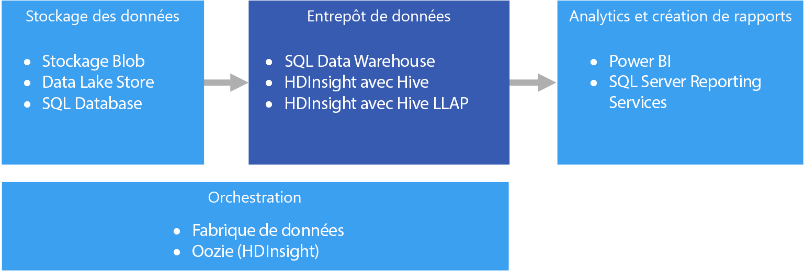

# Entreposage de données et mini-Data Warehouses

Un entrepôt de données est un référentiel central, organisationnel et relationnel de données intégrées provenant d’une ou de plusieurs sources hétérogènes, à travers de nombreuses ou toutes les zones de sujet. Les entrepôts de données stockent des données d’historique et actuelles, et permettent de créer des rapports et d’analyser des données de différentes façons.

Les données à déplacer dans un entrepôt de données sont régulièrement extraites de différentes sources qui contiennent d’importantes informations d’entreprise. Durant leur déplacement, les données peuvent être mises en forme, nettoyées, validées, synthétisées et réorganisées. Elles peuvent également être stockées avec le plus bas niveau de détail, avec des vues agrégées fournies dans l’entrepôt pour la création de rapports. Dans tous les cas, l’entrepôt de données devient un espace de stockage permanent pour les données utilisées pour la création de rapports, l’analyse et la prise d’importantes décisions commerciales à l’aide d’outils de Business Intelligence (BI).

## Mini-Data Warehouses et magasins de données opérationnels

La gestion des données à l’échelle est complexe, et disposer d’un entrepôt de données unique qui représente l’ensemble des données au sein de toute l’entreprise est une pratique de moins en moins courante. À la place, les organisations créent des entrepôts de données plus petits et plus spécifiques, appelés *mini-Data Warehouses*, qui exposent les données souhaitées à des fins d’analyse. Un processus d’orchestration renseigne les mini-Data Warehouses à partir des données conservées dans un magasin de données opérationnel. Le magasin de données opérationnel agit en tant qu’intermédiaire entre le système transactionnel source et le mini-Data Warehouse. Les données gérées par le magasin de données opérationnel sont une version nettoyée des données présentes dans le système transactionnel source, et représentent généralement un sous-ensemble des données d’historique gérées par l’entrepôt de données ou le mini-Data Warehouse. 

## Quand utiliser cette solution ?

Optez pour un entrepôt de données si vous avez besoin de convertir un grand nombre de données de systèmes d’exploitation dans un format actuel, précis et facile à comprendre. Les entrepôts de données ne doivent pas forcément suivre la même structure de données laconique que vous pouvez utiliser dans vos bases de données opérationnelles/OLTP. Vous pouvez utiliser des noms de colonne pertinents pour les utilisateurs professionnels et les analystes, restructurer le schéma pour simplifier les relations entre les données, et consolider plusieurs tables en une seule. Ces étapes guident les utilisateurs qui ont besoin de créer des rapports ad hoc, ou de créer des rapports et d’analyser les données dans des systèmes de BI, sans l’aide d’un administrateur de base de données (DBA) ou d’un développeur de données.

Vous pouvez utiliser un entrepôt de données si vous avez besoin de conserver vos données d’historique dans un emplacement autre que les systèmes transactionnels sources pour des raisons de performances. Les entrepôts de données facilitent l’accès aux données d’historique à partir de plusieurs emplacements, en fournissant un emplacement centralisé utilisant des formats, des clés, des méthodes d’accès et des modèles de données courants.

L’accès en lecture des entrepôts de données est optimisé, ce qui accélère la génération de rapports en comparaison avec l’exécution de rapports via le système transactionnel source. Les entrepôts de données présentent en outre les avantages suivants :

* Toutes les données d’historique provenant de différentes sources peuvent être stockées et sont accessibles à partir d’un entrepôt de données en tant que source de vérité unique.
* Vous pouvez améliorer la qualité des données en les nettoyant au cours de leur importation dans l’entrepôt de données, afin de disposer de données plus précises, ainsi que de descriptions et codes cohérents.
* Les outils de création de rapports ne sont pas comparables aux systèmes transactionnels sources pour ce qui est des cycles de traitement des requêtes. Un entrepôt de données permet au système transactionnel de se centrer principalement sur la gestion des écritures, tandis que l’entrepôt lui-même répond à la plupart des demandes de lecture.
* Un entrepôt de données peut aider à consolider des données provenant de différents logiciels.
* Les outils d’exploration de données peuvent vous aider à rechercher des modèles masqués à l’aide de méthodologies automatiques appliquées aux données stockées dans votre entrepôt.
* Les entrepôts de données facilitent la mise en place d’un accès sécurisé aux utilisateurs autorisés, tout en limitant l’accès aux autres utilisateurs. Il n’est pas nécessaire d’accorder aux utilisateurs professionnels l’accès aux données sources, ce qui élimine un vecteur d’attaque potentiel par rapport à un ou plusieurs systèmes transactionnels de production.
* Les entrepôts de données facilitent la création de solutions de Business Intelligence applicables aux données, telles que les [cubes OLAP](online-analytical-processing.md).

## Défis

La configuration correcte d’un entrepôt de données en fonction des besoins de votre entreprise peut présenter les difficultés suivantes :

* Consacrer le temps nécessaire à la définition correcte des concepts de votre entreprise : il s’agit d’une étape importante, car les entrepôts de données sont axés sur les informations, où le reste du projet dépend du mappage des concepts. Cela implique la normalisation des termes et formats professionnels courants (tels que les devises et les dates) et la restructuration du schéma qui soit pertinente pour les utilisateurs professionnels, mais qui garantisse toujours l’exactitude des relations et agrégats de données.
* Planifier et configurer l’orchestration de vos données : ces étapes doivent notamment prendre en compte la façon dont les données doivent être copiées du système transactionnel source vers l’entrepôt de données, et le moment auquel les données d’historique doivent être déplacées de vos magasins de données opérationnels vers l’entrepôt.
* Préserver ou améliorer la qualité des données en les nettoyant au cours de leur importation dans l’entrepôt.

## Entreposage de données dans Azure

Dans Azure, vous pouvez avoir une ou plusieurs sources de données, provenant de transactions de clients ou de diverses applications métier utilisées par différents services. Ces données sont généralement stockées dans une ou plusieurs bases de données [OLTP](online-transaction-processing.md). Les données peuvent être persistantes dans d’autres supports de stockage tels que des partages réseau, des objets blob de stockage Azure ou un Data Lake. Elles peuvent également être stockées dans l’entrepôt de données lui-même ou dans une base de données relationnelle comme Azure SQL Database. L’objectif de la couche du magasin de données analytique est de satisfaire les requêtes émises par les outils d’analyse et de création de rapports au niveau de l’entrepôt de données ou du mini-Data Warehouse. Dans Azure, cette fonctionnalité de magasin analytique est disponible avec Azure SQL Data Warehouse, ou avec HDInsight Azure à l’aide d’une requête Hive ou interactive. Vous avez également besoin d’un certain niveau d’orchestration pour déplacer ou copier régulièrement des données du stockage de données vers l’entrepôt de données, ce qui peut être effectué à l’aide d’Azure Data Factory ou d’Oozie sur Azure HDInsight.

Services connexes :

* [Azure SQL Database](/azure/sql-database/)
* [SQL Server sur une machine virtuelle](/sql/sql-server/sql-server-technical-documentation)
* [Azure Data Warehouse](/azure/sql-data-warehouse/sql-data-warehouse-overview-what-is)
* [Apache Hive sur HDInsight](/azure/hdinsight/hadoop/hdinsight-use-hive)
* [Interactive Query (Hive LLAP) sur HDInsight](/azure/hdinsight/interactive-query/apache-interactive-query-get-started)

## Choix de technologie

- [Entrepôts de données](../technology-choices/data-warehouses.md)
- [Orchestration de pipeline](../technology-choices/pipeline-orchestration-data-movement.md)

