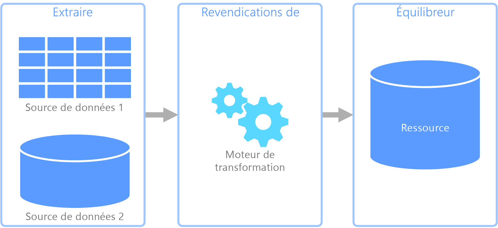
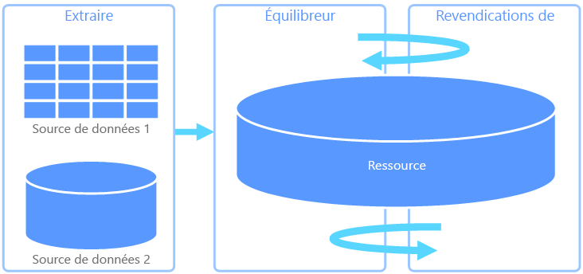
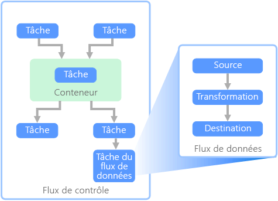

# Extraire, transformer et charger (ETL)

Un problème courant auquel les organisations font face est le mode de collecte de données à partir de plusieurs sources, dans plusieurs formats, et le déplacement de ces données vers un ou plusieurs magasins de données. La destination peut ne pas être le même type de magasin de données que la source, et souvent le format est différent, ou les données doivent être mises en forme ou nettoyées avant d’être chargées dans leur destination finale.

Au fil des années, différents outils, services et processus ont été développés pour relever ces défis. Quel que soit le processus utilisé, il est nécessaire de coordonner le travail et d’appliquer un certain degré de transformation des données dans le pipeline de données. Les sections suivantes illustrent les méthodes couramment utilisées pour effectuer ces tâches.

## Extraire, transformer et charger (ETL)

ETL est un pipeline de données utilisé pour collecter des données provenant de différentes sources, transformer les données en fonction des règles métier et charger les données dans un magasin de données de destination. Le travail de transformation dans ETL a lieu dans un moteur spécialisé et implique souvent l’utilisation de tables intermédiaires pour conserver temporairement les données lors de leur transformation et leur chargement final vers leur destination.

La transformation des données qui a lieu implique généralement plusieurs opérations, comme le filtrage, le tri, l’agrégation, la jointure des données, le nettoyage des données, la déduplication et la validation des données.

Souvent, les trois phases ETL sont exécutées en parallèle pour gagner du temps. Par exemple, tandis que les données sont extraites, un processus de transformation peut travailler sur les données déjà reçues et les préparer pour le chargement, et un processus de chargement peut commencer à travailler sur les données préparées, au lieu d’attendre la fin du processus d’extraction complet.

Service Azure approprié :
- [Azure Data Factory v2](https://azure.microsoft.com/services/data-factory/)

Autres outils :
- [SQL Server Integration Services (SSIS)](/sql/integration-services/sql-server-integration-services)

## Extraire, charger et transformer (ELT)

Extraire, charger et transformer (ELT) diffère du processus ETL uniquement où la transformation a lieu. Dans le pipeline ELT, la transformation se produit dans le magasin de données cible. Au lieu d’utiliser un moteur de transformation distinct, les fonctionnalités de traitement du magasin de données cible sont utilisées pour transformer les données. Cela simplifie l’architecture en supprimant le moteur de transformation du pipeline. Un autre avantage de cette approche est que la montée en puissance du magasin de données cible permet également la montée en puissance des performances du pipeline ELT. Toutefois, ELT fonctionne bien uniquement lorsque le système cible est suffisamment puissant pour transformer les données de manière efficace.

Les scénarios d’utilisation classiques d’ELT concernent le domaine du Big Data. Par exemple, vous pouvez commencer par extraire toutes les données sources dans des fichiers plats dans un stockage évolutif comme le système de fichiers distribués (HDFS) Hadoop ou Azure Data Lake Store. Les technologies comme Spark, Hive ou PolyBase peuvent ensuite être utilisées pour interroger les données sources. Le point clé avec ELT est que le magasin de données utilisé pour effectuer la transformation est le même magasin de données que celui où les données sont finalement consommées. Ce magasin de données lit directement à partir du stockage évolutif, au lieu de charger les données dans son propre stockage propriétaire. Cette approche ignore l’étape de copie des données présente dans ETL, qui peut être une opération longue pour les jeux de données volumineux.

Dans la pratique, le magasin de données cible est un [entrepôt de données](./data-warehousing.md) utilisant un cluster Hadoop (avec Hive ou Spark) ou un SQL Data Warehouse. En général, un schéma est placé sur les données de fichier plat au moment de la requête et stocké sous la forme d’une table, permettant l’interrogation des données comme toute autre table dans le magasin de données. Celles-ci sont désignées comme des tables externes, car les données ne résident pas dans le stockage géré par le magasin de données lui-même, mais dans un stockage évolutif externe. 

Le magasin de données gère uniquement le schéma des données et applique le schéma lors de la lecture. Par exemple, un cluster Hadoop utilisant Hive décrit une table Hive où la source des données est en réalité un chemin d’accès à un ensemble de fichiers dans HDFS. Dans SQL Data Warehouse, PolyBase peut obtenir le même résultat &mdash; créant une table sur des données stockées en externe à la base de données. Une fois la source de données chargée, les données présentes dans les tables externes peuvent être traitées grâce aux fonctionnalités du magasin de données. Dans les scénarios Big Data, cela signifie que le magasin de données doit être capable d’un traitement parallèle massif (MPP), qui fractionne les données en segments plus petits et distribue le traitement des segments sur plusieurs machines en parallèle.

La dernière phase du pipeline ELT consiste généralement à transformer la source de données dans un format final plus efficace pour les types de requêtes qui doivent être pris en charge. Par exemple, les données peuvent être partitionnées. En outre, ELT peut utiliser des formats de stockage optimisé comme Parquet, qui stocke les données orientées ligne dans un mode en colonnes et fournit une indexation optimisée. 

Service Azure approprié :

- [Azure SQL Data Warehouse](/azure/sql-data-warehouse/sql-data-warehouse-overview-what-is)
- [HDInsight avec Hive](/azure/hdinsight/hadoop/hdinsight-use-hive)
- [Azure Data Factory v2](https://azure.microsoft.com/services/data-factory/)
- [Oozie sur HDInsight](/azure/hdinsight/hdinsight-use-oozie-linux-mac)

Autres outils :

- [SQL Server Integration Services (SSIS)](/sql/integration-services/sql-server-integration-services)

## Flux de données et flux de contrôle

Dans le contexte de pipelines de données, le flux de contrôle garantit le traitement de façon ordonnée d’un ensemble de tâches. Pour appliquer l’ordre de traitement correct de ces tâches, des contraintes de priorité sont utilisées. Vous pouvez comparer ces contraintes à des connecteurs dans un diagramme de flux de travail, comme indiqué dans l’image ci-dessous. Chaque tâche a un résultat, comme la réussite, l’échec ou l’achèvement. Le traitement de la tâche suivante n’est lancé que lorsque la tâche précédente est terminée avec l’un de ces résultats.

Les flux de contrôle exécutent les flux de données en tant que tâche. Dans une tâche de flux de données, les données sont extraites d’une source, transformées ou chargées dans un magasin de données. La sortie d’une tâche de flux de données peut correspondre à l’entrée de la prochaine tâche de flux de données et les flux de données peuvent s’exécuter en parallèle. Contrairement aux flux de contrôle, vous ne pouvez pas ajouter de contraintes entre les tâches d’un flux de données. Toutefois, vous pouvez ajouter une visionneuse de données afin d’observer les données lorsqu’elles sont traitées par chaque tâche.

Dans le schéma ci-dessus, le flux de contrôle comporte plusieurs tâches, notamment une tâche de flux de données. L’une des tâches est imbriquée dans un conteneur. Les conteneurs peuvent être utilisés pour donner une structure aux tâches, fournissant une unité de travail. La répétition d’éléments dans une collection, comme des fichiers dans un dossier ou des instructions dans une base de données, en est un exemple.

Service Azure approprié :
- [Azure Data Factory v2](https://azure.microsoft.com/services/data-factory/)

Autres outils :
- [SQL Server Integration Services (SSIS)](/sql/integration-services/sql-server-integration-services)

## Choix de technologie

- [Magasins de données de traitement transactionnel en ligne (OLTP)](../technology-choices/oltp-data-stores.md)
- [Magasins de données de traitement analytique en ligne (OLAP)](../technology-choices/olap-data-stores.md)
- [Entrepôts de données](../technology-choices/data-warehouses.md)
- [Orchestration de pipeline](../technology-choices/pipeline-orchestration-data-movement.md)
