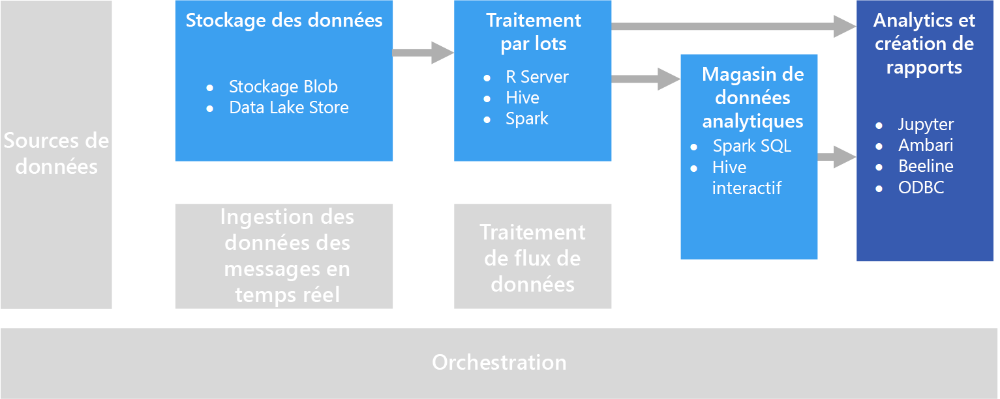

# Exploration interactive des donnéesInteractive data exploration

Dans de nombreuses solutions d’informatique décisionnelle (BI) d’entreprise, les rapports et les modèles sémantiques sont créés par les spécialistes de la BI et gérés de façon centralisée.In many corporate business intelligence (BI) solutions, reports and semantic models are created by BI specialists and managed centrally. Cependant, les organisations veulent de plus en plus souvent donner les moyens aux utilisateurs de prendre des décisions guidées par les données.Increasingly, however, organizations want to enable users to make data-driven decisions. Par ailleurs, elles sont de plus en plus nombreuses à engager des *scientifiques des données* ou des *analystes de données*, dont le travail consiste à explorer les données de façon interactive et à appliquer des modèles statistiques et des techniques d’analyse pour trouver des tendances et des modèles dans les données.Additionally, a growing number of organizations are hiring *data scientists* or *data analysts*, whose job is to explore data interactively and apply statistical models and analytical techniques to find trends and patterns in the data. L’exploration interactive des données requiert des outils et des plateformes qui assurent un traitement à faible latence des visualisations de données et des requêtes ad hoc.Interactive data exploration requires tools and platforms that provide low-latency processing for ad-hoc queries and data visualizations.

## Informatique décisionnelle en libre-serviceSelf-service BI

L’informatique décisionnelle en libre-service est le nom donné à une approche moderne de la prise de décision selon laquelle les utilisateurs ont l’autonomie nécessaire pour rechercher, explorer et partager des informations à partir de l’ensemble des données de l’entreprise.Self-service BI is a name given to a modern approach to business decision making in which users are empowered to find, explore, and share insights from data across the enterprise. Pour cela, la solution de données doit remplir plusieurs conditions :To accomplish this, the data solution must support several requirements:

* Découverte des sources de données d’entreprise au moyen d’un catalogue de données.Discovery of business data sources through a data catalog.
* Gestion des données de référence garantissant la cohérence des valeurs et des définitions des entités de données.Master data management to ensure consistency of data entity definitions and values.
* Outils interactifs de modélisation et de visualisation des données pour les utilisateurs professionnels.Interactive data modeling and visualization tools for business users.

Dans une solution d’informatique décisionnelle en libre-service, les utilisateurs professionnels recherchent et exploitent en général les sources de données qui correspondent à leur propre domaine dans l’entreprise, et utilisent des outils intuitifs et des applications de productivité pour définir des rapports et des modèles de données personnels, qu’ils peuvent partager avec leurs collègues.In a self-service BI solution, business users typically find and consume data sources that are relevant to their particular area of the business, and use intuitive tools and productivity applications to define personal data models and reports that they can share with their colleagues.

Services Azure appropriés :Relevant Azure services:

- [Azure Data CatalogAzure Data Catalog](/azure/data-catalog/data-catalog-what-is-data-catalog)
- [Microsoft Power BIMicrosoft Power BI](https://powerbi.microsoft.com/)

## Expérimentation en science des donnéesData science experimentation
Lorsqu’une organisation a besoin de techniques avancées d’analytique et de modélisation prédictive, le travail de préparation initial est généralement effectué par des spécialistes de la science des données.When an organization requires advanced analytics and predictive modeling, the initial preparation work is usually undertaken by specialist data scientists. Un scientifique des données explore les données et applique des techniques d’analyse statistique pour trouver des relations entre les *traits* des données et les *étiquettes* prédites souhaitées.A data scientist explores the data and applies statistical analytical techniques to find relationships between data *features* and the desired predicted *labels*. L’exploration de données est généralement effectuée à l’aide de langages de programmation comme Python et R, qui prennent en charge nativement la modélisation statistique et la visualisation.Data exploration is typically done using programming languages such as Python or R that natively support statistical modeling and visualization. Les scripts utilisés sont généralement hébergés dans des environnements spécialisés, par exemple, des Notebooks Jupyter.The scripts used to explore the data are typically hosted in specialized environments such as Jupyter Notebooks. Ces outils permettent aux scientifiques des données d’explorer les données par programme tout en documentant et en partageant les informations trouvées.These tools enable data scientists to explore the data programmatically while documenting and sharing the insights they find.

Services Azure appropriés :Relevant Azure services:

- [Azure NotebooksAzure Notebooks](https://notebooks.azure.com/)
- [Azure Machine Learning StudioAzure Machine Learning Studio](/azure/machine-learning/studio/what-is-ml-studio)
- [Services Azure Machine Learning – ExpérimentationAzure Machine Learning Experimentation Services](/azure/machine-learning/preview/experimentation-service-configuration)
- [La machine virtuelle de la science des donnéesThe Data Science Virtual Machine](/azure/machine-learning/data-science-virtual-machine/overview)

## DéfisChallenges

- **Respect de la confidentialité des données.****Data privacy compliance.** Faites attention quand vous mettez des données personnelles à la disposition des utilisateurs à des fins d’analyse et de création de rapports en libre-service.You need to be careful about making personal data available to users for self-service analysis and reporting. Cela soulève probablement des considérations relatives à la conformité, en raison des directives organisationnelles, ainsi que des problèmes de réglementation.There are likely to be compliance considerations, due to organizational policies and also regulatory issues. 

- **Volume de données**.**Data volume.** S’il peut être utile de donner accès à la totalité de la source de données aux utilisateurs, cela peut occasionner de très longues opérations Excel ou Power BI, ou des requêtes Spark SQL qui utilisent de nombreuses ressources de cluster.While it may be useful to give users access to the full data source, it can result in very long-running Excel or Power BI operations, or Spark SQL queries that use a lot of cluster resources.

- **Connaissances des utilisateurs**.**User knowledge.** Les utilisateurs créent leurs propres requêtes et agrégations afin de prendre des décisions d’entreprise éclairées.Users create their own queries and aggregations in order to inform business decisions. Avez-vous l’assurance qu’ils ont les compétences nécessaires en analyse et en interrogation pour obtenir des résultats corrects ?Are you confident that users have the necessary analytical and querying skills to get accurate results?

- **Partage des résultats**.**Sharing results.** Le fait que les utilisateurs puissent créer et partager des rapports ou des visualisations de données risque de poser des questions de sécurité.There may be security considerations if users can create and share reports or data visualizations.

## ArchitectureArchitecture

Bien que l’objectif de ce scénario soit de prendre en charge l’analyse interactive des données, les tâches de nettoyage, d’échantillonnage et de structuration impliquées dans la science des données représentent souvent des processus longs.Although the goal of this scenario is to support interactive data analysis, the data cleansing, sampling, and structuring tasks involved in data science often include long-running processes. D’où la pertinence d’une architecture de [traitement par lots](../big-data/batch-processing.md).That makes a [batch processing](../big-data/batch-processing.md) architecture appropriate.

## Choix de technologieTechnology choices

Les technologies suivantes sont recommandées pour l’exploration interactive des données dans Azure.The following technologies are recommended choices for interactive data exploration in Azure.

### Stockage des donnéesData storage

- **Conteneurs Azure Storage Blob** ou **Azure Data Lake Store**.**Azure Storage Blob Containers** or **Azure Data Lake Store**. Les scientifiques des données travaillent généralement avec des données sources brutes, de façon à avoir accès à tous les traits, à toutes les valeurs hors norme et à toutes les erreurs dans les données possibles.Data scientists generally work with raw source data, to ensure they have access to all possible features, outliers, and errors in the data. Dans un scénario de Big Data, ces données prennent généralement la forme de fichiers dans un magasin de données.In a big data scenario, this data usually takes the form of files in a data store.

Pour plus d’informations, consultez la page [Stockage de données](../technology-choices/data-storage.md).For more information, see [Data storage](../technology-choices/data-storage.md).

### Traitement par lotsBatch processing

- **R Server** ou **Spark**.**R Server** or **Spark**. La plupart des scientifiques des données utilisent des langages de programmation prenant en charge de nombreux packages mathématiques et statistiques, par exemple, R ou Python.Most data scientists use programming languages with strong support for mathematical and statistical packages, such as R or Python. En cas de gros volumes de données, il est possible de réduire la latence en utilisant des plateformes qui permettent à ces langages d’utiliser des traitements distribués.When working with large volumes of data, you can reduce latency by using platforms that enable these languages to use distributed processing. R Server peut être utilisé seul ou conjointement avec Spark pour monter en charge les fonctions de traitement de R ; Spark prend nativement en charge Python pour des fonctionnalités de montée en charge similaires dans ce langage.R Server can be used on its own or in conjunction with Spark to scale out R processing functions, and Spark natively supports Python for similar scale-out capabilities in that language.
- **Hive**.**Hive**. Hive est un bon choix pour transformer les données suivant une sémantique de type SQL.Hive is a good choice for transforming data using SQL-like semantics. Les utilisateurs peuvent créer et charger des tables à l’aide d’instructions HiveQL, similaires à SQL d’un point de vue sémantique.Users can create and load tables using HiveQL statements, which are semantically similar to SQL.

Pour plus d’informations, consultez la section [Traitement par lots](../technology-choices/batch-processing.md).For more information, see [Batch processing](../technology-choices/batch-processing.md).

### Magasin de données analytiquesAnalytical Data Store

- **Spark SQL**.**Spark SQL**. Spark SQL est une API qui repose sur Spark et prend en charge la création de trames de données et de tables interrogeables avec la syntaxe SQL.Spark SQL is an API built on Spark that supports the creation of dataframes and tables that can be queried using SQL syntax. Que les fichiers de données à analyser soient des fichiers sources bruts ou de nouveaux fichiers nettoyés et préparés par un processus de traitement par lots, les utilisateurs peuvent définir des tables Spark SQL dessus pour aller plus loin dans l’interrogation de l’analyse.Regardless of whether the data files to be analyzed are raw source files or new files that have been cleaned and prepared by a batch process, users can define Spark SQL tables on them for further querying an analysis. 
- **Hive**.**Hive**. En parallèle du traitement des données brutes par lots avec Hive, vous pouvez créer une base de données Hive contenant les tables et les vues Hive en fonction des dossiers dans lesquels sont stockées les données, ce qui permet d’effectuer des requêtes interactives à des fins d’analyse et de création de rapports.In addition to batch processing raw data by using Hive, you can create a Hive database that contains Hive tables and views based on the folders where the data is stored, enabling interactive queries for analysis and reporting. HDInsight contient un type de cluster Hive interactif qui utilise la mise en cache en mémoire afin de réduire le temps de réponse aux requêtes Hive.HDInsight includes an Interactive Hive cluster type that uses in-memory caching to reduce Hive query response times. Les utilisateurs qui sont à l’aise avec la syntaxe de type SQL peuvent utiliser Interactive Hive pour explorer les données.Users who are comfortable with SQL-like syntax can use Interactive Hive to explore data.

Pour plus d’informations, consultez la section [Magasins de données analytiques](../technology-choices/analytical-data-stores.md).For more information, see [Analytical data stores](../technology-choices/analytical-data-stores.md).

### Analytique et création de rapportsAnalytics and reporting

- **Jupyter**.**Jupyter**. Les Notebooks Jupyter offrent une interface sur navigateur pour exécuter du code dans des langages comme R, Python ou Scala.Jupyter Notebooks provides a browser-based interface for running code in languages such as R, Python, or Scala. Lorsque R Server ou Spark est utilisé pour traiter les données par lots, ou Spark SQL pour définir un schéma des tables à des fins d’interrogation, Jupyter peut représenter un bon choix pour interroger les données.When using R Server or Spark to batch process data, or when using Spark SQL to define a schema of tables for querying, Jupyter can be a good choice for querying the data. Si vous utilisez Spark, vous pouvez vous servir de l’API de trame de données Spark standard ou de l’API Spark SQL ainsi que des instructions SQL incorporées pour interroger les données et générer des visualisations.When using Spark, you can use the standard Spark dataframe API or the Spark SQL API as well as embedded SQL statements to query the data and produce visualizations.
- **Drill**.**Drill**. Pour effectuer une exploration de données ad hoc, [Apache Drill](https://drill.apache.org/) est un moteur de requête SQL sans schéma.If you want to perform ad hoc data exploration, [Apache Drill](https://drill.apache.org/) is a schema-free SQL query engine. Puisqu’il n’a pas besoin de schéma, vous pouvez interroger des données issues de diverses sources de données, et le moteur comprendra automatiquement la structure de ces données.Because it doesn't require a schema, you can query data from a variety of data sources, and the engine will automatically understand the structure of the data.
- **Clients Interactive Hive**.**Interactive Hive Clients**. Si vous utilisez un cluster Interactive Hive pour interroger les données, vous pouvez utiliser la vue Hive dans le tableau de bord du cluster Ambari, l’outil de ligne de commande Beeline ou n’importe quel outil ODBC (avec le pilote ODBC de Hive), par exemple, Microsoft Excel ou Power BI.If you use an Interactive Hive cluster to query the data, you can use the Hive view in the Ambari cluster dashboard, the Beeline command line tool, or any ODBC-based tool (using the Hive ODBC driver), such as Microsoft Excel or Power BI.

Pour plus d'informations, consultez la section [Technologies d’analytique des données et de création de rapports](../technology-choices/analysis-visualizations-reporting.md).For more information, see [Data analytics and reporting technology](../technology-choices/analysis-visualizations-reporting.md).
