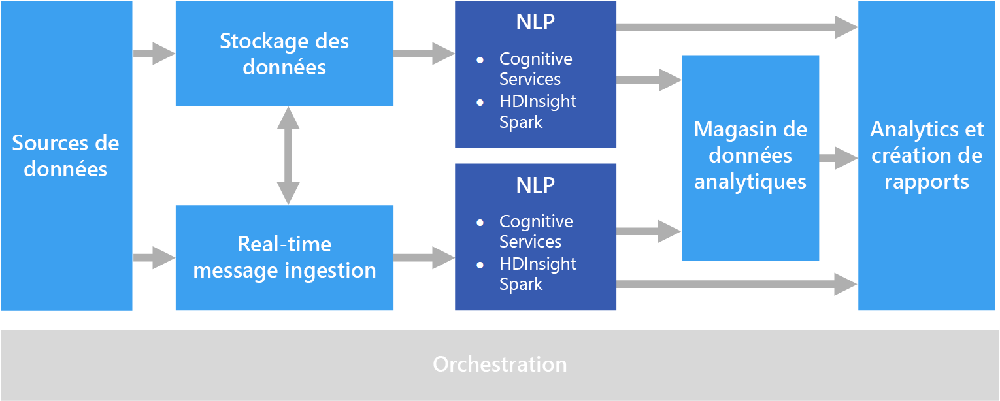

# Traitement en langage naturel

Le traitement en langage naturel (NLP) est utilisé pour des tâches telles que l’analyse des sentiments, la détection des rubriques, la détection de la langue, l’extraction de phrases clés et la classification des documents.

## Quand utiliser cette solution ?

NLP peut être utilisé pour classifier des documents, tels que l’étiquetage des documents sensibles ou indésirables. Les résultats du NLP peuvent être utilisés pour un traitement ou une recherche ultérieure. Le NLP est également utilisé pour résumer un texte en identifiant les entités présentes dans le document. Ces entités peuvent également servir à ajouter des balises à des documents avec des mots clés, ce qui permet une recherche et une récupération basées sur le contenu. Les entités peuvent être combinées dans les rubriques à des résumés qui décrivent les rubriques importantes présentes dans chaque document. Les rubriques détectées peuvent être utilisées pour classer les documents pour la navigation ou pour énumérer des documents connexes selon une rubrique sélectionnée. Le NLP est encore utilisé pour noter le sentiment d’un texte, afin d’évaluer la tonalité positive ou négative d’un document. Ces approches utilisent de nombreuses techniques à partir du traitement en langage naturel, telle que :

- **Générateur de jetons**. Fractionner le texte en mots ou expressions.
- **Recherche de radical et lemmatisation**. Normalisation des mots afin que différentes formes correspondent au mot canonique avec la même signification. Par exemple, « exécution » et « exécuté » correspondent à « exécuter ».
- **Extraction d’une entité**. Identification des sujets dans le texte.
- **Détection d’une partie du message**. Identification des verbe, nom, participe, expression verbale et ainsi de suite d’un texte.
- **Détection des limites d’une phrase**. Détection des phrases complètes dans les paragraphes du texte.

Lorsque vous utilisez NLP pour extraire des informations et des analyses de textes de forme libre, les documents bruts stockés dans le stockage d’objets tels que le stockage Azure ou Azure Data Lake Store constituent généralement le point de départ.

## Défis

- Le traitement d’une collection de documents texte de forme libre représente généralement beaucoup de ressources à calculer ce qui prend beaucoup de temps.
- Sans un format standardisé de document, il peut être très difficile d’obtenir des résultats précis de manière cohérente à l’aide du traitement de textes de forme libre et extraire des faits spécifiques à partir d’un document. Par exemple, considérez une représentation textuelle d’une facture&mdash;il peut être difficile de créer un processus capable d’extraire correctement la date et le numéro de la facture pour les factures de plusieurs fournisseurs.

## Architecture

Dans une solution NLP, le traitement de textes de forme libre est effectué par rapport à des documents contenant des paragraphes de texte. L’architecture globale peut être une architecture de [traitement par lots](../big-data/batch-processing.md) ou de [traitement de flux en temps réel](../big-data/real-time-processing.md).

Le traitement réel varie en fonction du résultat souhaité, mais en termes de pipeline, NLP peut être appliqué par lots ou en temps réel. Par exemple, l’analyse des sentiments peut être utilisée par rapport à des blocs de texte pour produire un score de sentiment. Cela peut être possible en exécutant un traitement par lots sur des données dans le stockage ou en temps réel à l’aide de plusieurs petits blocs de données transitant via un service de messagerie.

## Choix de technologie

- [Traitement en langage naturel](../technology-choices/natural-language-processing.md)
