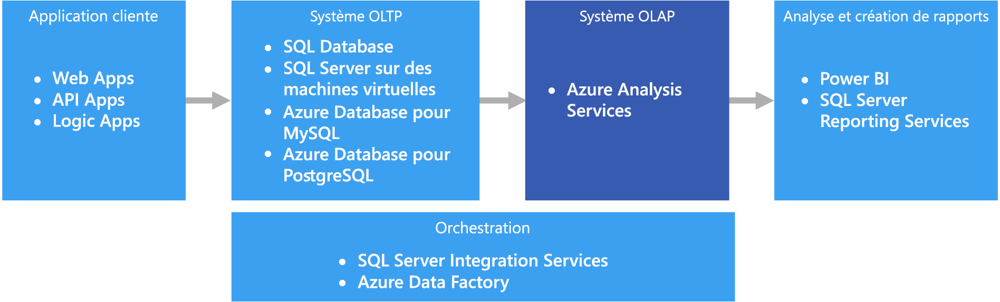

# Traitement analytique en ligne (OLAP)

Le traitement analytique en ligne (OLAP) est une technologie qui organise les bases de données de grandes entreprises et prend en charge les analyses complexes. Il peut être utilisé pour effectuer des requêtes analytiques complexes sans impact négatif sur les systèmes transactionnels.

Les bases de données utilisées par une entreprise pour stocker l’ensemble de ses transactions et enregistrements sont appelées bases de données de [traitement transactionnel en ligne (OLTP)](online-transaction-processing.md). Généralement, ces bases de données disposent d’enregistrements entrés un par un. Elles contiennent souvent une grande quantité d’informations précieuses pour l’organisation. Toutefois, les bases de données utilisées pour l’OLTP ne sont pas conçues pour l’analyse. Par conséquent, la récupération de réponses en provenant est à la fois coûteuse et laborieuse. Les systèmes OLAP ont été conçus pour aider à extraire ces informations décisionnelles de manière très performante à partir des données. La raison en est que les bases de données OLAP sont optimisées pour des charges de travail fortes en lecture et faibles en écriture.

 

## Quand utiliser cette solution ?

Tenez compte d’OLAP dans les scénarios suivants :

- Vous devez exécuter des requêtes analytiques et ad hoc complexes rapidement, sans impact négatif sur vos systèmes OLTP. 
- Vous souhaitez permettre aux utilisateurs professionnels de générer simplement des rapports à partir de vos données.
- Vous souhaitez fournir un nombre d’agrégations qui permettront aux utilisateurs d’obtenir des résultats rapides et cohérents. 

OLAP est particulièrement utile pour appliquer des calculs d’agrégats sur de grandes quantités de données. Les systèmes OLAP sont optimisés pour des scénarios forts en lecture, tels que l’analytique et le décisionnel. OLAP permet aux utilisateurs de segmenter des données multidimensionnelles en sections qui peuvent être affichées en deux dimensions (par exemple, un tableau croisé dynamique) ou de filtrer les données par valeurs spécifiques. Ce processus est parfois appelé « découpage » de données et peut être effectué même si les données sont partitionnées entre plusieurs sources de données. Cela permet aux utilisateurs de rechercher des tendances, de repérer des modèles et d’explorer les données sans avoir à connaître les détails de l’analyse traditionnelle des données.

Des [modèles sémantiques](../concepts/semantic-modeling.md) peuvent aider les utilisateurs professionnels à faire abstraction de la complexité des relations et faciliter l’analyse rapide de données.

## Défis

Malgré tous les avantages des systèmes OLAP, quelques défis doivent être relevés :

- alors que les données dans les systèmes OLTP sont constamment mises à jour via des transactions qui affluent à partir de sources diverses, les magasins de données OLAP sont généralement actualisés à des intervalles beaucoup plus longs, selon les besoins. Cela signifie que les systèmes OLAP sont mieux adaptés à des décisions commerciales stratégiques qu’à des réponses immédiates à des modifications. De même, un niveau de nettoyage des données et les besoins en matière d’orchestration doivent être planifiés pour que les banques de données OLAP restent à jour.
- Contrairement aux tables relationnelles traditionnelles normalisées des systèmes OLT, les modèles de données OLAP ont tendance à être multidimensionnels. De ce fait, il est difficile, voire impossible, de mapper directement à des modèles entité-relation ou orientés objet, où chaque attribut est mappé à une colonne. Au lieu de cela, les systèmes OLAP utilisent généralement un schéma en étoile ou en flocon à la place de la normalisation traditionnelle.

## OLAP dans Azure

Dans Azure, les données conservées dans les systèmes OLTP, tels que la base de données SQL Azure, sont copiées dans le système OLAP, par exemple dans [Azure Analysis Services](/azure/analysis-services/analysis-services-overview). Les outils d’exploration et de visualisation des données tels que [Power BI](https://powerbi.microsoft.com), Excel et des options tierces se connectent aux serveurs d’Analysis Services et fournissent aux utilisateurs des informations hautement interactives et visuellement riches sur les données modélisées. Le flux de données à partir de données d’OLTP à OLAP est généralement orchestré à l’aide de SQL Server Integration Services, qui peut être exécuté à l’aide d’[Azure Data Factory](/azure/data-factory/concepts-integration-runtime).

## Choix de technologie

- [Magasins de données de traitement analytique en ligne (OLAP)](../technology-choices/olap-data-stores.md)

