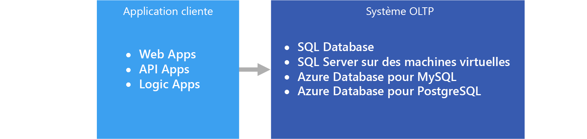

# Traitement transactionnel en ligne (OLTP)

La gestion des [données transactionnelles](../concepts/transactional-data.md) à l’aide de systèmes informatiques est nommée Traitement transactionnel en ligne (OLTP). Les systèmes OLTP enregistrent les interactions de l’entreprise lorsqu’elles se produisent dans les opérations quotidiennes de l’organisation et prennent en charge l’interrogation de ces données pour faire des inférences.

## Quand utiliser cette solution

Choisissez OLTP lorsque vous avez besoin de traiter et stocker efficacement les transactions commerciales et les rendre immédiatement disponibles pour les applications clientes de manière cohérente. Utilisez cette architecture lorsque tout retard tangible dans le traitement peut avoir un impact négatif sur les opérations quotidiennes de l’entreprise.

Les systèmes OLTP sont conçus pour traiter et stocker efficacement des transactions, ainsi que les données transactionnelles de requête. L’objectif de traiter et de stocker efficacement des transactions individuelles par un système OLTP est atteint en partie par la normalisation des données &mdash; c’est-à-dire, le fractionnement des données en blocs plus petits qui sont moins redondants. Cela prend en charge l’efficacité en permettant au système OLTP de traiter indépendamment une grande quantité de transactions et en évitant le traitement supplémentaire nécessaire pour maintenir l’intégrité des données en présence de données redondantes.

## Défis
La mise en œuvre et l’utilisation d’un système OLTP peuvent créer quelques défis :

- Les systèmes OLTP ne sont pas toujours appropriés pour gérer des agrégats sur de grandes quantités de données, bien qu’il existe des exceptions, notamment une solution SQL Server correctement planifiée. L’analytique des données qui s’appuient sur des calculs d’agrégation pour des millions de transactions individuelles exige, pour un système OLTP, de très nombreuses ressources. Elles peuvent s’exécuter lentement et entraîner un ralentissement en bloquant les autres transactions dans la base de données.
- Lors de la réalisation d’analyses et la création de rapports sur les données très normalisées, les requêtes ont tendance à être complexes, car la plupart doivent dénormaliser les données à l’aide de jonctions. En outre, les conventions d’affectation de noms pour les objets de base de données dans les systèmes OLTP ont tendance à être laconique et concise. La normalisation accrue couplée à des conventions d’affectation de noms laconiques complique l’interrogation des systèmes OLTP par les utilisateurs professionnels, sans l’aide d’un développeur de base de données ou développeur des données.
- Le stockage indéfini de l’historique des transactions et le stockage de trop de données dans une table peuvent entraîner le ralentissement des performances de requêtes, en fonction du nombre de transactions stockées. La solution courante consiste à maintenir une période pertinente (par exemple, l’année fiscale en cours) dans le système OLTP et décharger les données historiques vers d’autres systèmes, par exemple un mini-data Warehouse ou un [entrepôt de données](../technology-choices/data-warehouses.md).

## OLTP dans Azure

Les applications telles que les sites Web hébergés dans [App Service Web Apps](/azure/app-service/app-service-web-overview), les API REST en cours d’exécution dans l’App Service ou les applications de bureau ou mobiles communiquent avec le système OLTP, en général via une API REST intermédiaire.

Dans la pratique, la plupart des charges de travail ne sont pas purement OLTP. Elles sont généralement également un [composant analytique](../scenarios/online-analytical-processing.md). En outre, il existe une demande croissante de rapports en temps réel, telles que l’exécution des rapports à partir du système d’exploitation. Cela est également appelé HTAP (Traitement transactionnel et analytique hybride). Pour plus d’informations, consultez [Banques de données du Traitement analytique en ligne (OLAP)](../technology-choices/olap-data-stores.md).

## Choix de technologie

Stockage des données :

- [Azure SQL Database](/azure/sql-database/)
- [SQL Server dans une machine virtuelle Azure](/azure/virtual-machines/windows/sql/virtual-machines-windows-sql-server-iaas-overview?toc=%2Fazure%2Fvirtual-machines%2Fwindows%2Ftoc.json)
- [Azure Database pour MySQL](/azure/mysql/)
- [Base de données Azure pour PostgreSQL](/azure/postgresql/)

Pour plus d’informations, consultez [Choix d’une banque de données OLTP](../technology-choices/oltp-data-stores.md)

Sources de données :

- [App Service](/azure/app-service/)
- [Mobile Apps](/azure/app-service-mobile/)

