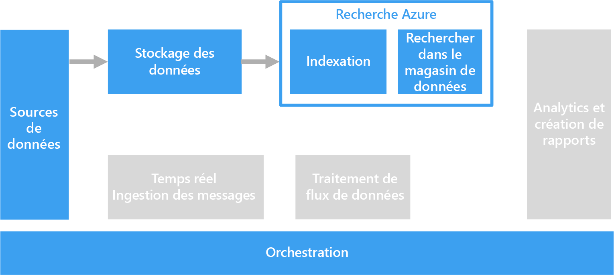

# Traitement de texte de forme libre pour la recherche

Pour que la recherche soit prise en charge, le traitement de textes de forme libre est effectué par rapport à des documents contenant des paragraphes de texte.

La recherche de texte fonctionne en créant un index spécialisé, qui est précalculée par rapport à une collection de documents. Une application cliente soumet une requête contenant les termes de la recherche. La requête retourne un jeu de résultats composé d’une liste des documents triés en fonction de la mesure dans laquelle ils correspondent respectivement aux critères de recherche. Le jeu de résultats peut également inclure le contexte dans lequel le document correspond aux critères, ce qui permet à l’application de mettre en surbrillance la phrase correspondante dans le document.

Le traitement du texte de forme libre peut produire des données utiles et exploitables à partir de grandes quantités de données texte bruyantes. Les résultats permettent de donner une structure bien définie et requêtable à des documents non structurés.

## Défis

- Le traitement d’une collection de documents texte de forme libre représente généralement beaucoup de calculs et est très chronophage.
- Pour rechercher efficacement du texte de forme libre, l’index de recherche doit prendre en charge la recherche floue basée sur des termes à la structure similaire. Par exemple, les index de recherche sont créés avec une lemmatisation et une recherche de radical linguistique, afin que les requêtes pour « exécutent » correspondent à des documents contenant « exécuté » et « exécutant ».

## Architecture

Dans la plupart des scénarios, les documents de texte source sont chargés dans le stockage d’objets, par exemple stockage Azure ou Azure Data Lake Store. La recherche en texte intégral dans une base de données SQL Server ou Azure SQL constitue une exception. Dans ce cas, les données du document sont chargées dans des tables gérées par la base de données. Une fois enregistrés, les documents sont traités dans un lot pour créer l’index.

## Choix de technologie

Les options pour la création d’un index de recherche incluent la recherche Azure, Elasticsearch et HDInsight avec Solr. Chacune de ces technologies peut remplir un index de recherche à partir d’une collection de documents. La recherche Azure fournit des indexeurs qui peuvent automatiquement remplir l’index pour les documents, du texte brut aux formats Excel et PDF. Sur HDInsight, Apache Solr peut indexer des fichiers binaires de nombreux types, y compris le texte brut, Word et PDF. Une fois l’index créé, les clients peuvent accéder à l’interface de recherche à l’aide d’une API REST.

Si vos données de texte sont stockées dans une base de données SQL Server ou SQL Azure, vous pouvez utiliser la recherche en texte intégral intégrée à la base de données. La base de données remplit l’index de texte, de données binaires ou de données XML stockées dans la même base de données. Les clients effectuent des recherches à l’aide de requêtes T-SQL.

Pour en savoir plus, consultez les [Magasins de données de recherche](../technology-choices/search-options.md).
