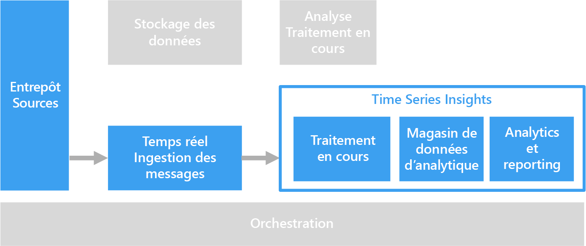

# Solutions de la série chronologique

Les données de la série chronologique constituent un ensemble de valeurs organisés chronologiquement. Parmi les exemples de données de la série chronologique, on trouve : des données de capteur, le cours de la bourse et la télémétrie applicative. Les données de la série chronologique peuvent être analysées à la recherche des tendances historiques, des alertes en temps réel ou la modélisation prédictive.

Les données de série chronologique représentent la façon dont un élément multimédia ou un processus changent au fil du temps. Les données disposent d’un horodateur, mais plus important encore, le temps constitue l’axe le plus explicite pour l’affichage ou l’analyse des données. En général, les données de la série chronologique arrivent par ordre chronologique et sont traitées comme une instruction plutôt qu’une mise à jour dans votre base de données. Pour cette raison, les modifications sont mesurées au fil du temps, ce qui vous permet de considérer le passé et de prévoir les futures modifications. Par conséquent, la visualisation des données de la série chronologique est meilleure avec des graphiques nuages de points ou en courbes.

Vous trouverez ci-après des exemples de données de la série chronologique :

- le cours de la bourse capturé au fil du temps pour détecter des tendances
- des performances du serveur, telles que l’utilisation du processeur, la charge d’e/s, l’utilisation de la mémoire et la consommation de bande passante réseau
- la télémétrie des capteurs sur l’équipement industriel, pouvant être utilisé pour détecter les pannes matérielles latente et déclencher des notifications d’alerte
- des données de télémétrie de voiture en temps réel, y compris la vitesse, le freinage et l’accélération sur une fenêtre de temps pour produire un indice de risque d’agrégation pour le pilote.

Dans chacun de ces cas, vous pouvez constater à quel point le temps est un vecteur important. L’affichage des événements dans l’ordre dans lequel ils se produisent est une caractéristique clé des données de la série chronologique, car il s’agit d’un classement temporel naturel. Cela diffère des données capturées pour les pipelines de données OLTP standard où les données peuvent être entrées dans n’importe quel ordre et mises à jour à tout moment.

## Quand utiliser cette solution

Choisissez une solution de la série chronologique lorsque vous devez ingérer des données dont la valeur stratégique est centrée autour de modifications sur une période de temps. Vous ingérez alors principalement de nouvelles données et mettez rarement, voire jamais, à jour. Vous pouvez utiliser ces informations pour détecter des anomalies, visualiser des tendances et comparer des données actuelles pour les données d’historique, entre autres choses. Ce type d’architecture est également mieux adapté à la modélisation prédictive et la prévision des résultats, car vous disposez de l’historique des modifications apportées au fil du temps, ce qui peut être appliqué à n’importe quel nombre de modèles de prévision.

L’utilisation de la série chronologique présente les avantages suivants :

- les données de la série chronologique représentent la modification d’un composant ou d’un processus au fil du temps
- elle vous permet de détecter rapidement les modifications apportées à un nombre de sources associées, faisant clairement ressortir les anomalies et les tendances émergentes
- mieux adaptée à la modélisation prédictive et aux prévisions.

### Internet des objets (IoT)

Les données collectées par les appareils IoT sont naturellement adaptées au stockage et à l’analyse de la série chronologique. Les données entrantes sont insérées et rarement, voire jamais, mises à jour. Les données sont horodatées et insérées selon leur ordre de réception et elles sont généralement affichées par ordre chronologique, permettant aux utilisateurs de découvrir des tendances, repérer les anomalies et utiliser les informations pour des analyses prédictives.

Pour plus d’informations, consultez la rubrique [Internet des objets](../big-data/index.md#internet-of-things-iot).

### Analyse en temps réel

Les données de la série chronologique sont souvent soumises à une contrainte de temps &mdash; c’est-à-dire qu’elles doivent être traitées rapidement, afin d’identifier les tendances en temps réel ou générer des alertes. Dans ces scénarios, tout retard d’informations peut entraîner des temps d’arrêt et impacter l’entreprise. En outre, il est souvent nécessaire de mettre les données en corrélation à partir d’une variété de sources différentes, telles que les capteurs.

Dans l’idéal, vous devriez avoir une couche de traitement de flux qui puisse gérer les données entrantes en temps réel et les traiter toutes avec une haute précision et une granularité élevée. Cela n’est pas toujours possible, en fonction de votre architecture de diffusion en continu et des composants de votre mise en mémoire tampon du flux et couches de traitement du flux. Vous devrez peut-être sacrifier la précision des données de la série chronologique en les réduisant. Pour ce faire, faites glisser les fenêtres de temps (de quelques secondes, par exemple), ce qui permet à la couche de traitement d’effectuer des calculs en temps voulu. Vous devrez peut-être aussi sous-échantillonner et regrouper vos données lors de l’affichage de longues périodes de temps, telles que le zoom pour afficher les données capturées sur plusieurs mois.

## Défis

- Les données de la série chronologique sont souvent très volumineuses, surtout dans les scénarios de l’IoT. Le stockage, l’indexation, l’interrogation, l’analyse et la visualisation des données de la série chronologique peuvent être difficiles.

- Il peut être difficile de trouver la bonne combinaison entre un stockage rapide et des opérations de Compute puissantes pour le traitement analytique en temps réel, tout en réduisant le temps de commercialisation et l’investissement du coût global.

## Architecture

Dans de nombreux scénarios qui impliquent des données de la série chronologique, tels que l’IoT, les données sont capturées en temps réel. Par conséquent, une architecture de [traitement en temps réel](../big-data/real-time-processing.md) est appropriée.

Les données à partir d’une ou de plusieurs sources de données sont ingérées dans la couche de mise en mémoire tampon du flux par [IoT Hub](/azure/iot-hub/), [Event Hubs](/azure/event-hubs/) ou [Kafka sur HDInsight](/azure/hdinsight/kafka/apache-kafka-introduction). Les données sont ensuite traitées dans la couche de traitement du flux qui peut éventuellement transférer les données traitées dans un service de Machine Learning pour des analyses prédictives. Les données traitées sont stockées dans une banque de données analytiques, telles que [HBase](/azure/hdinsight/hbase/apache-hbase-overview), [Azure Cosmos DB](/azure/cosmos-db/), Azure Data Lake ou stockage Blob. Une application ou un service analytique et de création de rapports, tels que Power BI ou OpenTSDB (s’il est stocké dans HBase) peut être utilisé pour afficher les données de la série chronologique pour analyse.

Une autre option consiste à utiliser [Azure Time Series Insights](/azure/time-series-insights/). Time Series Insights est un service entièrement géré pour les données de la série chronologique. Dans cette architecture, Time Series Insights joue les rôles de traitement du flux, de banque de données et d’analyse et création de rapports. Il accepte des données de streaming à partir de l’IoT Hub ou des Event Hubs et stocke, traite, analyse et affiche les données quasiment en temps réel. Il ne pré-agrège pas les données, mais stocke les événements bruts.

Time Series Insights s’adapte au schéma, ce qui signifie que vous n’avez pas à effectuer la préparation des données pour commencer à dériver les informations. Cela vous permet d’explorer, de comparer et de mettre en corrélation les diverses sources de données en toute transparence. Il fournit également des filtres et des agrégats de type SQL, la capacité de construire, visualiser, comparer et superposer divers modèles de la série chronologique, des cartes thermiques et la capacité d’enregistrer et de partager des requêtes.

## Choix de technologie

- [Stockage des données](../technology-choices/data-storage.md)
- [Analyse, visualisations et création de rapports](../technology-choices/analysis-visualizations-reporting.md)
- [Banques de données analytiques](../technology-choices/analytical-data-stores.md)
- [Traitement du flux](../technology-choices/stream-processing.md)