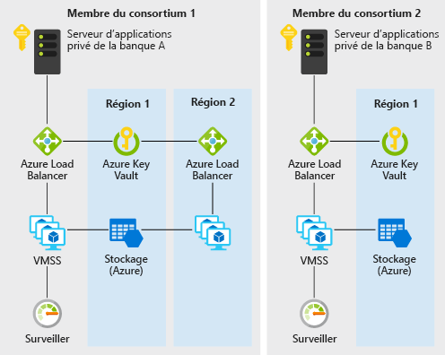

# Confiance décentralisée entre les banques sur AzureDecentralized trust between banks on Azure

Cet exemple de scénario est utile pour les banques ou autres établissements souhaitant mettre en place un environnement fiable pour le partage des informations sans avoir recours à une base de données centralisée.This example scenario is useful for banks or any other institutions that want to establish a trusted environment for information sharing without resorting to a centralized database. Pour les besoins de cet exemple, nous allons décrire le scénario dans le contexte de la gestion des informations de cote de crédit entre les banques. Néanmoins, l’architecture peut être appliquée à tout autre scénario dans lequel un consortium d’organisations souhaite partager des informations validées entre elles, sans avoir recours à un système central exécuté par une seule des parties.For the purpose of this example, we will describe the scenario in the context of maintaining credit score information between banks, but the architecture can be applied to any scenario where a consortium of organizations want to share validated information with one another without resorting to the use of a central system ran by one single party.

En règle générale, les banques au sein d’un système financier s’appuient sur des sources centralisées telles que des bureaux de crédit pour obtenir des informations sur la cote de crédit d’un particulier, ainsi que son historique.Traditionally, banks within a financial system rely on centralized sources such as credit bureaus for information on an individual's credit score and history. Une approche centralisée concentre des risques opérationnels et requiert de faire appel à un tiers, ce qui est parfois inutile.A centralized approach presents a concentration of operational risk and sometimes an unnecessary third party.

Grâce aux technologies de registre distribué, un consortium de banques peut mettre en place un système décentralisé plus efficace et moins susceptible d’être attaqué. En outre, ce système peut faire office de plateforme sur laquelle des structures innovantes peuvent être implémentées pour résoudre les problèmes classiques de confidentialité, de vitesse et de coûts.With DLTs (distributed ledger technology), a consortium of banks can establish a decentralized system that can be more efficient, less susceptible to attack, and serve as a new platform where innovative structures can be implemented to solve traditional challenges with privacy, speed, and cost.

Cet exemple vous montre comment les services Azure tels que les groupes de machines virtuelles identiques, les réseaux virtuels, Key Vault, Stockage, Load Balancer et Monitor peuvent être rapidement approvisionnés pour le déploiement d’une blockchain Ethereum PoA privée efficace où les banques membres peuvent créer leurs propres nœuds.This example will show you how Azure services such as virtual machine scale sets, Virtual Network, Key Vault, Storage, Load Balancer, and Monitor can be quickly provisioned for the deployment of an efficient private Ethereum PoA blockchain where member banks can establish their own nodes.

## Cas d’usage appropriésRelevant use cases

Les autres cas d’usage appropriés sont les suivants :Other relevant use cases include:

- Déplacement des budgets alloués entre les différentes divisions d’une multinationaleMovement of allocated budgets between different business units of a multinational corporation
- Paiements transfrontaliersCross-border payments
- Scénarios de financement commercialTrade finance scenarios
- Systèmes de fidélisation impliquant différentes sociétésLoyalty systems involving different companies
- Écosystèmes de chaîne d’approvisionnementSupply chain ecosystems

## ArchitectureArchitecture

Ce scénario couvre les composants principaux nécessaires pour créer un réseau de blockchain d’entreprise privé, surveillé, sécurisé et évolutif au sein d’un consortium de deux membres minimum.This scenario covers the back-end components that are necessary to create a scalable, secure, and monitored private, enterprise blockchain network within a consortium of two or more members. Les informations concernant la façon dont ces composants sont approvisionnés (c.-à-d. au sein de différents abonnements et groupes de ressources), ainsi que les exigences de connectivité (c.-à-d. VPN ou ExpressRoute) doivent être étudiées en fonction de la stratégie de votre organisation.Details of how these components are provisioned (that is, within different subscriptions and resource groups) as well as the connectivity requirements (that is, VPN or ExpressRoute) are left for your consideration based on your organization's policy requirements. Voici comment les données circulent :Here's how data flows:

1. La banque A crée/met à jour le dossier de crédit d’un particulier en envoyant une transaction au réseau de blockchain via JSON-RPC.Bank A creates/updates an individual's credit record by sending a transaction to the blockchain network via JSON-RPC.
2. Les données circulent depuis le serveur d’application privé de la banque A vers l’équilibreur de charge Azure, puis vers une machine virtuelle de nœud de validation sur le groupe de machines virtuelles identiques.Data flows from Bank A's private application server to the Azure load balancer and subsequently to a validating node VM on the virtual machine scale set.
3. Le réseau Ethereum PoA crée un bloc à un moment prédéfini (2 secondes pour ce scénario).The Ethereum PoA network creates a block at a preset time (2 seconds for this scenario).
4. La transaction est englobée dans le bloc créé et validée sur l’ensemble du réseau de blockchain.The transaction is bundled into the created block and validated across the blockchain network.
5. La banque B peut lire le dossier de crédit créé par la banque A en communiquant avec son propre nœud comme via JSON-RPC.Bank B can read the credit record created by bank A by communicating with its own node similarly via JSON-RPC.

### ComposantsComponents

- Les machines virtuelles au sein de groupes de machines virtuelles identiques fournissent la fonctionnalité de calcul à la demande pour héberger les processus de validateur de la blockchainVirtual machines within virtual machine scale sets provides the on-demand compute facility to host the validator processes for the blockchain
- Key Vault est utilisé en tant que fonctionnalité de stockage sécurisé pour les clés privées de chaque validateurKey Vault is used as the secure storage facility for the private keys of each validator
- Load Balancer répartit les requêtes de RPC, de peering et de Governance DAppLoad Balancer spreads the RPC, peering, and Governance DApp requests
- Stockage héberge les informations réseau persistantes et coordonne les bauxStorage hosting persistent network information and coordinating leasing
- Operations Management Suite (un regroupement de plusieurs services Azure) fournit des insights sur les nœuds disponibles, les transactions par minute et les membres du consortiumOperations Management Suite (a bundling of a few Azure services) provides insight into available nodes, transactions per minute and consortium members

### Autres solutionsAlternatives

L’approche Ethereum PoA est choisie pour cet exemple, car il s’agit d’un bon point de départ pour un consortium d’organisations souhaitant créer un environnement dans lequel des informations peuvent être échangées et partagées de façon fiable, décentralisée et simple.The Ethereum PoA approach is chosen for this example because it is a good entry point for a consortium of organizations that want to create an environment where information can be exchanged and shared with one another easily in a trusted, decentralized, and easy to understand way. Les modèles de solution Azure disponibles constituent également un moyen rapide et pratique pour aider le leader d’un consortium à mettre en place une blockchain Ethereum PoA. En outre, ils permettent aux organisations membres du consortium de créer rapidement leurs ressources Azure au sein de leur groupe de ressources et abonnement pour rejoindre un réseau existant.The available Azure solution templates also provide a fast and convenient way not just for a consortium leader to start an Ethereum PoA blockchain, but also for member organizations in the consortium to spin up their own Azure resources within their own resource group and subscription to join an existing network.

Pour d’autres scénarios étendus ou différents, des problèmes relatifs à la confidentialité des transactions peuvent se poser.For other extended or different scenarios, concerns such as transaction privacy may arise. Par exemple, dans un scénario de transfert de titres, les membres d’un consortium ne souhaitent peut-être pas que leurs transactions soient visibles par les autres membres.For example, in a securities transfer scenario, members in a consortium may not want their transactions to be visible even to other members. Des alternatives à l’approche Ethereum PoA répondant à ces problèmes existent :Other alternatives to Ethereum PoA exist that addresses these concerns in their own way:

- CordaCorda
- QuorumQuorum
- HyperledgerHyperledger

## ConsidérationsConsiderations

### DisponibilitéAvailability

[Azure Monitor][monitor] est utilisé pour surveiller en permanence le réseau de blockchain et ainsi garantir la disponibilité.[Azure Monitor][monitor] is used to continuously monitor the blockchain network for issues to ensure availability. Un lien vers un tableau de bord de supervision personnalisé basé sur Azure Monitor vous est envoyé après le déploiement du modèle de solution de blockchain utilisé dans ce scénario.A link to a custom monitoring dashboard based on Azure Monitor will be sent to you upon successful deployment of the blockchain solution template used in this scenario. Le tableau de bord affiche les nœuds qui signalent des pulsations au cours des 30 dernières minutes, ainsi que d’autres statistiques utiles.The dashboard shows nodes that are reporting heartbeats in the past 30 minutes as well as other useful statistics.

### ExtensibilitéScalability

Un problème courant des blockchains est le nombre de transactions qu’une blockchain peut inclure dans une durée prédéfinie.A popular concern for blockchain is the number of transactions that a blockchain can include within a preset amount of time. Ce scénario utilise PoA (Proof-of-Authority) quand une telle extensibilité peut être mieux gérée qu’avec PoW (Proof-of-Work).This scenario uses Proof-of-Authority where such scalability can be better managed than Proof-of-Work. Dans les réseaux basés &ndash;sur PoA, les participants au consensus sont connus et gérés, ce qui est plus approprié pour une blockchain privée destinée à un consortium d’organisations qui se connaissent entre elles.In Proof-of-Authority&ndash;based networks, consensus participants are known and managed, making it more suitable for private blockchain for a consortium of organization that knows one another. Les paramètres tels que la durée de bloc moyenne, les transactions par minute et la consommation des ressources de calcul peuvent être facilement surveillées via le tableau de bord personnalisé.Parameters such as average block time, transactions per minute and compute resource consumption can be easily monitored via the custom dashboard. Les ressources peuvent ensuite être ajustées en fonction des exigences de mise à l’échelle.Resources can then be adjusted accordingly based on scale requirements.

Pour obtenir des conseils d’ordre général sur la conception de solutions évolutives, consultez la [liste de contrôle de l’extensibilité][scalability] dans le Centre des architectures Azure.For general guidance on designing scalable solutions, see the [scalability checklist][scalability] in the Azure Architecture Center.

### SécuritéSecurity

[Azure Key Vault][vault] est utilisé pour stocker et gérer facilement les clés privées des validateurs.[Azure Key Vault][vault] is used to easily store and manage the private keys of validators. Le déploiement par défaut dans cet exemple crée un réseau de blockchain qui est accessible via Internet.The default deployment in this example creates a blockchain network that is accessible via the internet. Pour les scénarios de production où un réseau privé est souhaité, les membres peuvent être connectés entre eux par le biais de connexions de passerelle VPN entre des réseaux virtuels.For production scenario where a private network is desired, members can be connected to each other via VNet-to-VNet VPN gateway connections. La procédure à suivre pour configurer un VPN est indiquée dans la section sur les ressources associées ci-dessous.The steps for configuring a VPN are included in the related resources section below.

Pour obtenir des conseils d’ordre général sur la conception de solutions sécurisées, consultez la [documentation sur la sécurité Azure][security].For general guidance on designing secure solutions, see the [Azure Security Documentation][security].

### RésilienceResiliency

La blockchain Ethereum PoA peut offrir un certain degré de résilience puisque les nœuds de validateur peuvent être déployés dans différentes régions.The Ethereum PoA blockchain can itself provide some degree of resilience as the validator nodes can be deployed in different regions. Azure permet d’effectuer des déploiements dans plus de 54 régions du monde entier.Azure has options for deployments in over 54 regions worldwide. Une blockchain comme celle de notre exemple offre des possibilités uniques et nouvelles de coopération pour accroître la résilience.A blockchain such as the one in this scenario provides unique and refreshing possibilities of cooperation to increase resilience. La résilience du réseau n’est pas fournie uniquement pour une seule partie centralisée, mais pour tous les membres du consortium.The resilience of the network is not just provided for by a single centralized party but all members of the consortium. Une blockchain basée&ndash;sur PoA permet d’obtenir une résilience réseau plus planifiée et délibérée.A proof-of-authority&ndash;based blockchain allows network resilience to be even more planned and deliberate.

Pour obtenir des instructions générales sur la conception de solutions résilientes, consultez [conception d’applications Azure fiables](../../reliability/index.md).For general guidance on designing resilient solutions, see [Designing reliable Azure applications](../../reliability/index.md).

## TarifsPricing

Pour explorer le coût d’exécution de ce scénario, tous les services sont préconfigurés dans le calculateur de coûts.To explore the cost of running this scenario, all of the services are pre-configured in the cost calculator. Pour connaître les prix en fonction de votre cas d’usage particulier, modifiez les variables appropriées en fonction des exigences de disponibilité et de performances souhaitées.To see how the pricing would change for your particular use case, change the appropriate variables to match your expected performance and availability requirements.

Nous proposons trois exemples de profils de coût basés sur le nombre d’instances de groupe identique de machines virtuelles exécutant vos applications (les instances peuvent se trouver dans différentes régions).We have provided three sample cost profiles based on the number of scale set VM instances that run your applications (the instances can reside in different regions).

- [Petit][small-pricing] : 2 machines virtuelles par mois avec la supervision désactivée[Small][small-pricing]: this pricing example correlates to 2 VMs per month with monitoring turned off
- [Moyen][medium-pricing] : 7 machines virtuelles par mois avec la supervision activée[Medium][medium-pricing]: this pricing example correlates to 7 VMs per month with monitoring turned on
- [Grand][large-pricing] : 15 machines virtuelles par mois avec la supervision activée[Large][large-pricing]: this pricing example correlates to 15 VMs per month with monitoring turned on

Les tarifs ci-dessus sont donnés pour un membre du consortium qui souhaite mettre en place ou rejoindre un réseau de blockchain.The above pricing is for one consortium member to start or join a blockchain network. En général, dans un consortium regroupant plusieurs entreprises ou organisations, chaque membre bénéficie de son propre abonnement Azure.Typically in a consortium where there are multiple companies or organizations involved, each member will get their own Azure subscription.

## Étapes suivantesNext Steps

Pour voir un exemple de ce scénario, déployez [l’application de démonstration de blockchain Ethereum PoA][deploy] sur Azure.To see an example of this scenario, deploy the [Ethereum PoA blockchain demo application][deploy] on Azure. Passez ensuite en revue le [fichier README du code source du scénario][source].Then review the [README of the scenario source code][source].

## Ressources associéesRelated resources

Pour plus d’informations sur l’utilisation du modèle de solution Ethereum PoA pour Azure, consultez ce [guide d’utilisation][guide].For more information on using the Ethereum Proof-of-Authority solution template for Azure, review this [usage guide][guide].

<!-- links -->
[small-pricing]: https://azure.com/e/4e429d721eb54adc9a1558fae3e67990
[medium-pricing]: https://azure.com/e/bb42cd77437744be8ed7064403bfe2ef
[large-pricing]: https://azure.com/e/e205b443de3e4adfadf4e09ffee30c56
[guide]: /azure/blockchain-workbench/ethereum-poa-deployment
[deploy]: https://portal.azure.com/?pub_source=email&pub_status=success#create/microsoft-azure-blockchain.azure-blockchain-ethereumethereum-poa-consortium
[source]: https://github.com/vitoc/creditscoreblockchain
[monitor]: /azure/monitoring-and-diagnostics/monitoring-overview-azure-monitor
[scalability]: /azure/architecture/checklist/scalability
[security]: /azure/security/
[vault]: https://azure.microsoft.com/services/key-vault/
