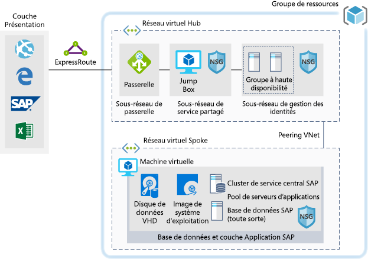

# SAP pour des charges de travail de développement/testSAP for dev/test workloads

Cet exemple fournit des conseils pour savoir comment exécuter une implémentation de développement/test de SAP NetWeaver dans un environnement Windows ou Linux sur Azure.This example provides guidance for how to run a dev/test implementation of SAP NetWeaver in a Windows or Linux environment on Azure. La base de données utilisée est AnyDB, le terme SAP pour tout SGBD pris en charge (qui n’est pas SAP HANA).The database used is AnyDB, the SAP term for any supported DBMS (that isn't SAP HANA). Étant donné que cette architecture est conçue pour les environnements hors production, elle est déployée avec une seule machine virtuelle et sa taille peut être modifiée pour prendre en compte les besoins de votre organisation.Because this architecture is designed for non-production environments, it's deployed with just a single virtual machine (VM) and it's size can be changed to accommodate your organization's needs.

Pour les cas d'usage de production, examinez les architectures de référence SAP disponibles ci-dessous :For production use cases review the SAP reference architectures available below:

* [SAP NetWeaver pour AnyDB][sap-netweaver][SAP netweaver for AnyDB][sap-netweaver]
* [SAP S/4Hana][sap-hana][SAP S/4Hana][sap-hana]
* [SAP sur des Instances de grande taille Azure][sap-large][SAP on Azure large instances][sap-large]

## Cas d’usage connexesRelated use cases

Pensez à ce scénario pour les cas d’usage suivants :Consider this scenario for the following use cases:

* Charges de travail SAP non productives non critiques (bac à sable, développement, test, assurance qualité)Non-critical SAP non-productive workloads (sandbox, development, test, quality assurance)
* Charges de travail SAP Professionnel non critiqueNon-critical SAP business one workloads

## ArchitectureArchitecture

Ce scénario couvre la fourniture d’une base de données du système SAP unique et un serveur d’application SAP sur une machine virtuelle unique, les données transitent dans le scénario comme suit :This scenario covers the provision of a single SAP system database and SAP application Server on a single virtual machine, the data flows through the scenario as follows:

1. Les clients à partir de la couche Présentation utilisent leur GUI SAP ou d’autres interfaces utilisateur (Internet Explorer, Excel ou une autre application web) en local pour accéder à un système Azure basé sur SAP.Customers from the Presentation Tier use their SAP gui, or other user interfaces (Internet Explorer, Excel or other web application) on premise to access the Azure based SAP system.
2. La connectivité est fournie via l’utilisation de l’ExpressRoute établie.Connectivity is provided through the use of the established Express Route. L’ExpressRoute est arrêtée dans Azure au niveau de la passerelle ExpressRoute.The Express Route is terminated in Azure at the Express Route Gateway. Le trafic réseau est acheminé via la passerelle ExpressRoute vers le sous-réseau de passerelle et depuis le sous-réseau de passerelle vers le sous-réseau Spoke de niveau Application (voir le modèle [hub-spoke][hub-spoke]) et via une passerelle de sécurité réseau vers la machine virtuelle d’applications SAP.Network traffic routes through the Express Route gateway to the Gateway Subnet and from the gateway subnet to the Application Tier Spoke subnet (see the [hub-spoke][hub-spoke] pattern) and via a Network Security Gateway to the SAP application virtual machine.
3. Les serveurs de gestion d’identité fournissent des services d’authentification.The identity management servers provide authentication services.
4. La Jump Box fournit des fonctionnalités de gestion locale.The Jump Box provides local management capabilities.

### ComposantsComponents

* Les [groupes de ressources](/azure/azure-resource-manager/resource-group-overview#resource-groups) sont des conteneurs logiques pour des ressources Azure.[Resource Groups](/azure/azure-resource-manager/resource-group-overview#resource-groups) is a logical container for Azure resources.
* Les [réseaux virtuels](/azure/virtual-network/virtual-networks-overview) constituent la base des communications réseau dans Azure[Virtual Networks](/azure/virtual-network/virtual-networks-overview) is the basis of network communications within Azure
* Les [machines virtuelles Azure](/azure/virtual-machines/windows/overview) fournissent une infrastructure sécurisée et virtualisée à la demande et à grande échelle avec un serveur Windows ou Linux[Virtual Machine](/azure/virtual-machines/windows/overview) Azure Virtual Machines provides on-demand, high-scale, secure, virtualized infrastructure using Windows or Linux Server
* [ExpressRoute](/azure/expressroute/expressroute-introduction) vous permet d’étendre vos réseaux locaux au cloud de Microsoft via une connexion privée assurée par un fournisseur de connectivité.[Express Route](/azure/expressroute/expressroute-introduction) lets you extend your on-premises networks into the Microsoft cloud over a private connection facilitated by a connectivity provider.
* Les [groupes de sécurité réseau](/azure/virtual-network/security-overview) vous permettent de limiter le trafic réseau vers les ressources d’un réseau virtuel.[Network Security Group](/azure/virtual-network/security-overview) lets you limit network traffic to resources in a virtual network. Un groupe de sécurité réseau contient une liste de règles de sécurité qui autorisent ou refusent le trafic réseau entrant ou sortant en fonction de l’adresse IP source ou de destination, du port et du protocole.A network security group contains a list of security rules that allow or deny inbound or outbound network traffic based on source or destination IP address, port, and protocol. 

## ConsidérationsConsiderations

### DisponibilitéAvailability

 Microsoft propose un contrat de niveau de service (SLA) pour les instances de machine virtuelle uniques.Microsoft offers a service level agreement (SLA) for single VM instances. Pour plus d’informations sur le contrat de niveau de service Microsoft Azure pour les machines virtuelles [Contrat SLA pour les machines virtuelles](https://azure.microsoft.com/support/legal/sla/virtual-machines)For more information on Microsoft Azure Service Level Agreement for Virtual Machines [SLA For Virtual Machines](https://azure.microsoft.com/support/legal/sla/virtual-machines)

### ExtensibilitéScalability

Pour obtenir des conseils d’ordre général sur la conception de solutions évolutives, consultez la [liste de contrôle de l’extensibilité][scalability] dans le Centre des architectures Azure.For general guidance on designing scalable solutions, see the [scalability checklist][scalability] in the Azure Architecture Center.

### SécuritéSecurity

Pour obtenir des conseils d’ordre général sur la conception de solutions sécurisées, consultez la [documentation sur la sécurité Azure][security].For general guidance on designing secure solutions, see the [Azure Security Documentation][security].

### RésilienceResiliency

Pour obtenir des conseils d’ordre général sur la conception de solutions résilientes, consultez l’article [Conception d’applications résilientes pour Azure][resiliency].For general guidance on designing resilient solutions, see [Designing resilient applications for Azure][resiliency].

## TarifsPricing

Explorez le coût d’exécution de ce scénario, tous les services sont préconfigurés dans le calculateur de coûts.Explore the cost of running this scenario, all of the services are pre-configured in the cost calculator.  Pour pouvoir observer l’évolution de la tarification pour votre cas d’usage particulier, modifiez les variables appropriées en fonction du trafic que vous escomptez.To see how the pricing would change for your particular use case change the appropriate variables to match your expected traffic.

Nous proposons quatre exemples de profils de coût basés sur la quantité de trafic que vous escomptez :We have provided four sample cost profiles based on amount of traffic you expect to get:

|TailleSize|SAPSAPs|Type de machine virtuelleVM Type|StockageStorage|Calculatrice de tarification AzureAzure Pricing Calculator|
|----|----|-------|-------|---------------|
|PetiteSmall|80008000|D8s_v3D8s_v3|2xP20, 1xP102xP20, 1xP10|[PetiteSmall](https://azure.com/e/9d26b9612da9466bb7a800eab56e71d1)|
|MoyenneMedium|1600016000|D16s_v3D16s_v3|3xP20, 1xP103xP20, 1xP10|[MoyenneMedium](https://azure.com/e/465bd07047d148baab032b2f461550cd)|
grandLarge|3200032000|E32s_v3E32s_v3|3xP20, 1xP103xP20, 1xP10|[GrandeLarge](https://azure.com/e/ada2e849d68b41c3839cc976000c6931)|
Très grandeExtra Large|64 00064000|M64sM64s|4xP20, 1xP104xP20, 1xP10|[Très grandeExtra Large](https://azure.com/e/975fb58a965c4fbbb54c5c9179c61cef)|

Remarque : la tarification est un guide et indique uniquement les machines virtuelles et les coûts de stockage (exclut les frais de la mise en réseau, du stockage des sauvegardes et des entrées/sorties de données).Note: pricing is a guide and only indicates the VMs and storage costs (excludes, networking, backup storage and data ingress/egress charges).

* [Petite](https://azure.com/e/9d26b9612da9466bb7a800eab56e71d1) : un petit système se compose d’une machine virtuelle du type D8s_v3 avec 8 x vCPUs, 32 Go de RAM et un stockage temporaire de 200 Go, en plus de deux disques de stockage premium de 512 Go et un de 128 Go.[Small](https://azure.com/e/9d26b9612da9466bb7a800eab56e71d1): A small system consists of VM type D8s_v3 with 8x vCPUs, 32GB RAM and 200GB temp storage, additionally two 512GB and one 128GB premium storage disks.
* [Moyenne](https://azure.com/e/465bd07047d148baab032b2f461550cd) : un système moyen se compose d’une machine virtuelle du type D16s_v3 avec 16 x vCPUs, 64 Go de RAM et un stockage temporaire de 400 Go, en plus de trois disques de stockage premium de 512 Go et un de 128 Go.[Medium](https://azure.com/e/465bd07047d148baab032b2f461550cd): A medium system consists of VM type D16s_v3 with 16x vCPUs, 64GB RAM and 400GB temp storage, additionally three 512GB and one 128GB premium storage disks.
* [Grande](https://azure.com/e/ada2e849d68b41c3839cc976000c6931) : un grand système se compose d’une machine virtuelle du type E32s_v3 avec 32 x vCPUs, 256 Go de RAM et un stockage temporaire de 512 Go, en plus de trois disques de stockage premium de 512 Go et un de 128 Go.[Large](https://azure.com/e/ada2e849d68b41c3839cc976000c6931): A large system consists of VM type E32s_v3 with 32x vCPUs, 256GB RAM and 512GB temp storage, additionally three 512GB and one 128GB premium storage disks.
* [Très grande](https://azure.com/e/975fb58a965c4fbbb54c5c9179c61cef) : un très grand système se compose d’une machine virtuelle du type M64s avec 64 x vCPUs, 1024 Go de RAM et un stockage temporaire de 2000 Go, en plus de quatre disques de stockage premium de 512 Go et un de 128 Go.[Extra Large](https://azure.com/e/975fb58a965c4fbbb54c5c9179c61cef): An extra large system consists of a VM type M64s with 64x vCPUs, 1024GB RAM and 2000GB temp storage, additionally four 512GB and one 128GB premium storage disks.

## DéploiementDeployment

Pour déployer l’infrastructure sous-jacente similaire au scénario ci-dessus, veuillez utiliser le bouton DéployerTo deploy the underlying infrastructure similar to the scenario above, please use the deploy button

\* SAP ne sera pas installé, vous devrez le faire une fois l’infrastructure construite manuellement.\* SAP will not be installed, you'll need to do this after the infrastructure is built manually.

<!-- links -->
[reference architecture]:  /azure/architecture/reference-architectures/sap
[resiliency]: /azure/architecture/resiliency/
[security]: /azure/security/
[scalability]: /azure/architecture/checklist/scalability
[sap-netweaver]: /azure/architecture/reference-architectures/sap/sap-netweaver
[sap-hana]: /azure/architecture/reference-architectures/sap/sap-s4hana
[sap-large]: /azure/architecture/reference-architectures/sap/hana-large-instances
[hub-spoke]: /azure/architecture/reference-architectures/hybrid-networking/hub-spoke