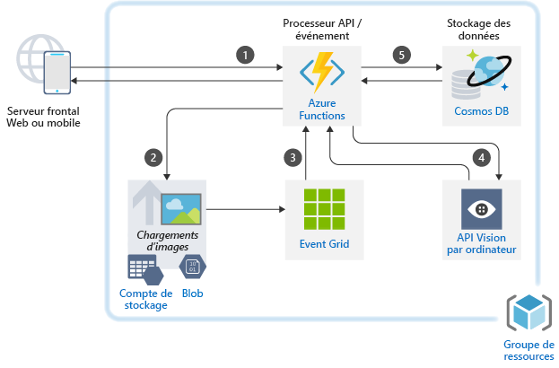
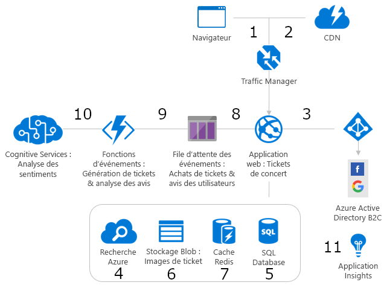
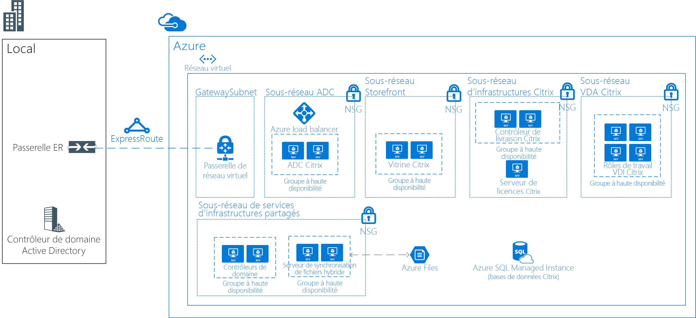
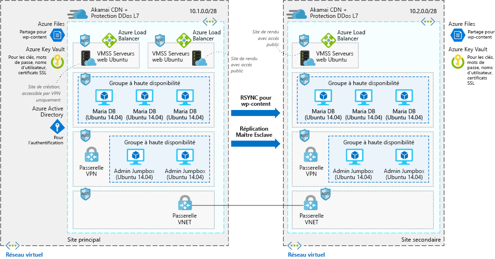

## Scénarios liés à l’IAAI Scenarios

<ul  class="panelContent cardsC">
<li style="display: flex; flex-direction: column;">
    <a href="./ai/commerce-chatbot.md" style="display: flex; flex-direction: column; flex: 1 0 auto;">
        

            

                

                    

                        

                            
                        

                    

                    

                        <h3>Bot conversationnel pour les réservations d’hôtel sur AzureConversational chatbot for hotel reservations on Azure</h3>
                        
Créez un bot conversationnel pour les applications de commerce avec Azure Bot Service.Build a conversational chatbot for commerce applications with Azure Bot Service.

                    

                

            

        

    </a>
</li>
<li style="display: flex; flex-direction: column;">
    <a href="./ai/intelligent-apps-image-processing.md" style="display: flex; flex-direction: column; flex: 1 0 auto;">
        

            

                

                    

                        

                            
                        

                    

                    

                        <h3>Classification d’images pour les déclarations de sinistre sur AzureImage classification for insurance claims on Azure</h3>
                        
Générer le traitement d’images dans vos applications Azure.Build image processing into your Azure applications.

                    

                

            

        

    </a>
</li>
</ul>

## Scénarios d’applicationApplication Scenarios

<ul  class="panelContent cardsC">
<li style="display: flex; flex-direction: column;">
    <a href="./apps/apim-api-scenario.md" style="display: flex; flex-direction: column; flex: 1 0 auto;">
        

            

                

                    

                        

                            
                        

                    

                    

                        <h3>Migration d’une application web héritée vers une architecture basée sur les API sur AzureMigrating a legacy web application to an API-based architecture on Azure</h3>
                        
Utilisez Gestion des API Azure pour moderniser une application web héritée.Use Azure API Management to modernize a legacy web application.

                    

                

            

        

    </a>
</li>
<li style="display: flex; flex-direction: column;">
    <a href="./apps/app-monitoring.md" style="display: flex; flex-direction: column; flex: 1 0 auto;">
        

            

                

                    

                        

                            
                        

                    

                    

                        <h3>Supervision des applications web sur AzureWeb application monitoring on Azure</h3>
                        
Surveillez une application web hébergée dans Azure App Service.Monitor a web application hosted in Azure App Service.

                    

                

            

        

    </a>
</li>
<li style="display: flex; flex-direction: column;">
    <a href="./apps/decentralized-trust.md" style="display: flex; flex-direction: column; flex: 1 0 auto;">
        

            

                

                    

                        

                            
                        

                    

                    

                        <h3>Confiance décentralisée entre les banques sur AzureDecentralized trust between banks on Azure</h3>
                        
Établissez un environnement de confiance pour communiquer et partager des informations sans avoir recours à une base de données centralisée.Establish a trusted environment for communication and information sharing without resorting to a centralized database.

                    

                

            

        

    </a>
</li>
<li style="display: flex; flex-direction: column;">
    <a href="./apps/devops-dotnet-webapp.md" style="display: flex; flex-direction: column; flex: 1 0 auto;">
        

            

                

                    

                        

                            
                        

                    

                    

                        <h3>Pipeline CI/CD avec Azure DevOpsCI/CD pipeline with Azure DevOps</h3>
                        
Générez et publiez une application .NET sur Azure Web Apps à l’aide d’Azure DevOps.Build and release a .NET app to Azure Web Apps using Azure DevOps.

                    

                

            

        

    </a>
</li>
<li style="display: flex; flex-direction: column;">
    <a href="./apps/devops-with-aks.md" style="display: flex; flex-direction: column; flex: 1 0 auto;">
        

            

                

                    

                        

                            
                        

                    

                    

                        <h3>Pipeline CI/CD pour les charges de travail basées sur des conteneursCI/CD pipeline for container-based workloads</h3>
                        
Créez un pipeline DevOps pour une application web Node.js qui utilise Jenkins, Azure Container Registry, Azure Kubernetes Service, Cosmos DB et Grafana.Build a DevOps pipeline for a Node.js web app with Jenkins, Azure Container Registry, Azure Kubernetes Service, Cosmos DB, and Grafana.

                    

                

            

        

    </a>
</li>
<li style="display: flex; flex-direction: column;">
    <a href="./apps/ecommerce-scenario.md" style="display: flex; flex-direction: column; flex: 1 0 auto;">
        

            

                

                    

                        

                            
                        

                    

                    

                        <h3>Serveur frontal e-commerce sur AzureE-commerce front end on Azure</h3>
                        
Hébergez un site d’e-commerce sur Azure.Host an e-commerce site on Azure.

                    

                

            

        

    </a>
</li>
<li style="display: flex; flex-direction: column;">
    <a href="./apps/ecommerce-search.md" style="display: flex; flex-direction: column; flex: 1 0 auto;">
        

            

                

                    

                        

                            
                        

                    

                    

                        <h3>Moteur de recherche de produit intelligent pour l’e-commerceIntelligent product search engine for e-commerce</h3>
                        
Offrez une expérience de recherche de haute qualité dans une application d’e-commerce.Provide a world-class search experience in an e-commerce application.

                    

                

            

        

    </a>
</li>
<li style="display: flex; flex-direction: column;">
    <a href="./apps/hpc-saas.md" style="display: flex; flex-direction: column; flex: 1 0 auto;">
        

            

                

                    

                        

                            
                        

                    

                    

                        <h3>Un service d’ingénierie assistée par ordinateur sur AzureA computer-aided engineering service on Azure</h3>
                        
Offrez une plateforme de software as a service (SaaS) pour l’ingénierie assistée par ordinateur (IAO) sur Azure.Provide a software-as-a-service (SaaS) platform for computer-aided engineering (CAE) on Azure.

                    

                

            

        

    </a>
</li>
<li style="display: flex; flex-direction: column;">
    <a href="./apps/sap-dev-test.md" style="display: flex; flex-direction: column; flex: 1 0 auto;">
        

            

                

                    

                        

                            
                        

                    

                    

                        <h3>Environnements de développement/test pour les charges de travail SAP sur AzureDev/test enviroments for SAP workloads on Azure</h3>
                        
Créez un environnement de développement/test pour les charges de travail SAP.Build a dev/test environment for SAP workloads.

                    

                

            

        

    </a>
</li>
<li style="display: flex; flex-direction: column;">
    <a href="./apps/sap-production.md" style="display: flex; flex-direction: column; flex: 1 0 auto;">
        

            

                

                    

                        

                            
                        

                    

                    

                        <h3>Exécution des charges de travail de production SAP à l’aide d’une base de données Oracle sur AzureRunning SAP production workloads using an Oracle database on Azure</h3>
                        
Exécutez un déploiement de production SAP dans Azure à l’aide d’une base de données Oracle.Run an SAP production deployment in Azure using an Oracle database.

                    

                

            

        

    </a>
</li>
</ul>

## Scénarios liés aux donnéesData Scenarios

<ul  class="panelContent cardsC">
<li style="display: flex; flex-direction: column;">
    <a href="./data/big-data-with-iot.md" style="display: flex; flex-direction: column; flex: 1 0 auto;">
        

            

                

                    

                        

                            
                        

                    

                    

                        <h3>L’IoT et l’analyse de données dans le secteur de la constructionIoT and data analytics in the construction industry</h3>
                        
Utilisez des appareils IoT et l’analyse des données pour fournir une gestion et une opération complètes des projets de construction.Use IoT devices and data analytics to provide comprehensive management and operation of construction projects.

                    

                

            

        

    </a>
</li>
<li style="display: flex; flex-direction: column;">
    <a href="./data/data-warehouse.md" style="display: flex; flex-direction: column; flex: 1 0 auto;">
        

            

                

                    

                        

                            
                        

                    

                    

                        <h3>Entreposage et analyse des données pour les ventes et le marketingData warehousing and analytics for sales and marketing</h3>
                        
Consolidez les données provenant de plusieurs sources et optimisez l’analyse des données.Consolidate data from multiple sources and optimize data analytics.

                    

                

            

        

    </a>
</li>
<li style="display: flex; flex-direction: column;">
    <a href="./data/ecommerce-order-processing.md" style="display: flex; flex-direction: column; flex: 1 0 auto;">
        

            

                

                    

                        

                            
                        

                    

                    

                        <h3>Traitement évolutif des commandes sur AzureScalable order processing on Azure</h3>
                        
Créez un pipeline de traitement de commande hautement évolutif à l’aide d’Azure Cosmos DB.Build a highly scalable order processing pipeline using Azure Cosmos DB.

                    

                

            

        

    </a>
</li>
<li style="display: flex; flex-direction: column;">
    <a href="./data/fraud-detection.md" style="display: flex; flex-direction: column; flex: 1 0 auto;">
        

            

                

                    

                        

                            
                        

                    

                    

                        <h3>Détection des fraudes en temps réel dans AzureReal-time fraud detection on Azure</h3>
                        
Détectez les activités frauduleuses en temps réel à l’aide d’Azure Event Hubs et de Stream Analytics.Detect fraudulent activity in real-time using Azure Event Hubs and Stream Analytics.

                    

                

            

        

    </a>
</li>
<li style="display: flex; flex-direction: column;">
    <a href="./data/realtime-analytics-vehicle-iot.md" style="display: flex; flex-direction: column; flex: 1 0 auto;">
        

            

                

                    

                        

                            
                        

                    

                    

                        <h3>Ingestion et traitement de données IoT automobiles en temps réelIngestion and processing of real-time automotive IoT data</h3>
                        
Ingérez et traitez les données de véhicule en temps réel à l’aide de l’IoT.Ingest and process real-time vehicle data using IoT.

                    

                

            

        

    </a>
</li>
</ul>

## Scénarios liés aux infrastructuresInfrastructure Scenarios

<ul  class="panelContent cardsC">
<li style="display: flex; flex-direction: column;">
    <a href="./infrastructure/hpc-cfd.md" style="display: flex; flex-direction: column; flex: 1 0 auto;">
        

            

                

                    

                        

                            
                        

                    

                    

                        <h3>Exécution des simulations de diagramme de flux cumulé (CFD) sur AzureRunning computational fluid dynamics (CFD) simulations on Azure</h3>
                        
Exécutez des simulations de diagramme de flux cumulé (CFD) sur Azure.Execute computational fluid dynamics (CFD) simulations on Azure.

                    

                

            

        

    </a>
</li>
<li style="display: flex; flex-direction: column;">
    <a href="./infrastructure/linux-vdi-citrix.md" style="display: flex; flex-direction: column; flex: 1 0 auto;">
        

            

                

                    

                        

                            
                        

                    

                    

                        <h3>Bureaux virtuels Linux avec CitrixLinux virtual desktops with Citrix</h3>
                        
Générez un environnement VDI pour les bureaux Linux à l’aide de Citrix sur Azure.Build a VDI environment for Linux Desktops using Citrix on Azure.

                    

                

            

        

    </a>
</li>
<li style="display: flex; flex-direction: column;">
    <a href="./infrastructure/regulated-multitier-app.md" style="display: flex; flex-direction: column; flex: 1 0 auto;">
        

            

                

                    

                        

                            
                        

                    

                    

                        <h3>Sécuriser une application web Windows pour les secteurs industriels réglementésSecure Windows web application for regulated industries</h3>
                        
Créez une application web sécurisée, à plusieurs niveaux avec Windows Server sur Azure à l’aide de groupes identiques, d’Application Gateway et d’équilibreurs de charge.Build a secure, multi-tier web application with Windows Server on Azure using scale sets, Application Gateway, and load balancers.

                    

                

            

        

    </a>
</li>
<li style="display: flex; flex-direction: column;">
    <a href="./infrastructure/service-fabric-microservices.md" style="display: flex; flex-direction: column; flex: 1 0 auto;">
        

            

                

                    

                        

                            
                        

                    

                    

                        <h3>Utilisation de Service Fabric pour décomposer des applications monolithiquesUsing Service Fabric to decompose monolithic applications</h3>
                        
Décomposez une grande application monolithique en microservices.Decompose a large monolithic application into microservices.

                    

                

            

        

    </a>
</li>
<li style="display: flex; flex-direction: column;">
    <a href="./infrastructure/video-rendering.md" style="display: flex; flex-direction: column; flex: 1 0 auto;">
        

            

                

                    

                        

                            
                        

                    

                    

                        <h3>Rendu vidéo 3D sur Azure3D video rendering on Azure</h3>
                        
Exécutez des charges de travail HPC natives dans Azure à l’aide du service Azure Batch.Run native HPC workloads in Azure using the Azure Batch service.

                    

                

            

        

    </a>
</li>
<li style="display: flex; flex-direction: column;">
    <a href="./infrastructure/wordpress.md" style="display: flex; flex-direction: column; flex: 1 0 auto;">
        

            

                

                    

                        

                            
                        

                    

                    

                        <h3>Sites web WordPress hautement évolutifs et sécurisés sur AzureHighly scalable and secure WordPress websites on Azure</h3>
                        
Créez un site web WordPress hautement évolutif et sécurisé pour les événements multimédias.Build a highly scalable and secure WordPress website for media events.

                    

                

            

        

    </a>
</li>
</ul>

