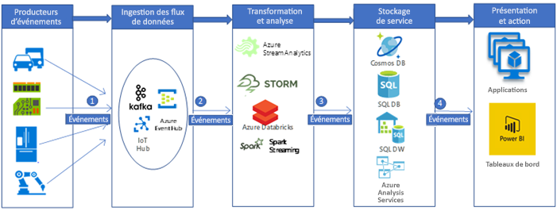

# Ingestion et traitement de données IoT automobiles en temps réelIngestion and processing of real-time automotive IoT data

Cet exemple de scénario crée un pipeline permettant l’ingestion et le traitement en temps réel des données des appareils IoT (en général des capteurs) sur une plateforme d’analyse Big Data dans Azure.This example scenario builds a real time data ingestion and processing pipeline to ingest and process messages from IoT devices (in general sensors) into a big data analytic platform in Azure. Les plateformes d’ingestion et de traitement télématiques pour les véhicules sont essentielles à la création de solutions automobiles connectées.Vehicle telematics ingestion and processing platforms are the key to create connected car solutions. Ce scénario particulier a été conçu pour les systèmes d’ingestion et de traitement de la télématique automobile.This specific scenario is motivated by the car telematics ingestion and processing systems. Cependant, les modèles de conception sont applicables à de nombreux domaines qui se servent de capteurs pour gérer et surveiller des systèmes complexes dans des secteurs tels que les bâtiments intelligents, les communications, la fabrication, la vente au détail et la santé.However, the design patterns are relevant for many industries using sensors to manage and monitor complex systems in industries such as smart buildings, communications, manufacturing, retail, and healthcare.

Cet exemple illustre un pipeline d’ingestion et de traitement de données en temps réel pour les messages provenant des appareils IoT installés dans les véhicules.This example demonstrates a real time data ingestion and processing pipeline for messages from IoT devices installed in vehicles. Les appareils et les capteurs IoT génèrent des millions de messages (ou d’événements).Thousands and millions of messages (or events) are generated by the IoT devices and sensors. En capturant et en analysant ces messages, nous pouvons identifier des informations utiles et prendre les mesures appropriées.By capturing and analyzing these messages, we can decipher valuable insights and take appropriate actions. Par exemple, en capturant les messages en temps réel des appareils télématiques des véhicules qui en sont équipés, nous pouvons surveiller en temps réel l’emplacement des véhicules, planifier des itinéraires optimisés, aider les conducteurs et appuyer des secteurs liés à la télématique comme les assurances automobiles.For example, with cars equipped telematics devices, if we can capture the device (IoT) messages in real time, we would be able to monitor the live location of vehicles, plan optimized routes, provide assistance to drivers, and support telematics-related industries such as auto insurance.

Dans cet exemple d’illustration, une entreprise de construction automobile souhaite créer un système en temps réel d’ingestion et de traitement des messages provenant des appareils télématiques.For this example demonstration, imagine a car manufacturing company that wants to create a real time system to ingest and process messages from telematics devices. Les objectifs de l’entreprise sont les suivants :The company's goals include:
* Ingérer et stocker les données en temps réel des capteurs et des appareils des véhicules.Ingest and store data in real time from vehicles sensors and devices.
* Analyser les messages pour comprendre l’emplacement des véhicules et d’autres informations provenant de différents types de capteurs (comme les capteurs liés au moteur et aux conditions environnementales).Analyze the messages to understand vehicle location, and other information emitted through different types of sensors (such as engine-related sensors and environment-related sensors).
* Stocker les données après analyse en vue de traitements ultérieurs afin de fournir des informations exploitables (par exemple, les agences d’assurance peuvent souhaiter savoir ce qui s’est passé au cours d’un accident)Store the data after analysis for other downstream processing to provide actionable insights (For example, in accident scenarios, insurance agencies may be interested to know what happened during an accident etc.)

## Cas d’usage appropriésRelevant use cases

Les autres cas d’usage appropriés sont les suivants :Other relevant use cases include:

* Rappels et alertes de maintenance des véhicules.Vehicle maintenance reminders and alerting.
* Services basés sur l’emplacement des passagers du véhicule (c’est-à-dire, secours).Location-based services for the vehicle passengers (that is, SOS).
* Véhicules autonomes (conduite automatique).Autonomous (self-driving) vehicles.

## ArchitectureArchitecture

Dans une implémentation classique de pipeline de traitement de Big Data, les données circulent de gauche à droite.In a typical big data processing pipeline implementation, the data flows from left to right. Dans ce pipeline de traitement de Big Data en temps réel, les données circulent dans la solution de la manière suivante :In this real time big data processing pipeline, the data flows through the solution as follows:

1. Les événements générés à partir des sources de données IoT sont envoyés à la couche d’ingestion de flux via Azure HDInsight Kafka en tant que flux de messages.Events generated from the IoT data sources are sent to the stream ingestion layer through Azure HDInsight Kafka as a stream of messages. HDInsight Kafka stocke les flux de données dans les rubriques pour une durée configurable.HDInsight Kafka stores streams of data in topics for a configurable of time.
2. Le consommateur Kafka, Azure Databricks, récupère le message en temps réel dans la rubrique Kafka afin de traiter les données en fonction de la logique métier et ensuite de les envoyer à la couche Serving à des fins de stockage.Kafka consumer, Azure Databricks, picks up the message in real time from the Kafka topic, to process the data based on the business logic and can then send to Serving layer for storage.
3. Les services de stockage en aval, comme Azure Cosmos DB, Azure SQL Data Warehouse ou Azure SQL DB, constituent alors une source de données pour la couche de présentation et d’action.Downstream storage services, like Azure Cosmos DB, Azure SQL Data warehouse, or Azure SQL DB, will then be a data source for presentation and action layer.
4. Les analystes métier peuvent utiliser Microsoft Power BI pour analyser les données stockées.Business analysts can use Microsoft Power BI to analyze warehoused data. D’autres applications peuvent également être créées sur la couche de service.Other applications can be built upon the serving layer as well. Par exemple, nous pouvons exposer des API basées sur les données de la couche de service pour des usages tiers.For example, we can expose APIs based on the service layer data for third party uses.

### ComposantsComponents
Les événements générés par les appareils IoT (données ou messages) sont ingérés, traités, puis stockés à des fins d’analyse, de présentation et d’action ultérieures à l’aide des composants Azure suivants :IoT device-generated events (data or messages) are ingested, processed, and then stored for further analysis, presentation, and action, using the following Azure components:
* [Apache Kafka sur HDInsight](/azure/hdinsight/kafka/apache-kafka-introduction) se trouve dans la couche d’ingestion.[Apache Kafka on HDInsight](/azure/hdinsight/kafka/apache-kafka-introduction) is in the ingestion layer. Les données sont enregistrées dans la rubrique Kafka à l’aide d’une API de producteur Kafka.The data is written into the Kafka topic using a Kafka producer API.
* [Azure Databricks](/services/databricks) se trouve dans la couche de transformation et d’analyse.[Azure Databricks](/services/databricks) is located in the transformation and analytics layer. Les blocs-notes Databricks implémentent une API consommateur Kafka afin de lire les données de la rubrique Kafka.Databricks notebooks implement a Kafka consumer API to read the data from the Kafka topic.
* [Azure Cosmos DB](/services/cosmos-db), [Azure SQL Database](/azure/sql-database/sql-database-technical-overview), et Azure SQL Data Warehouse se trouvent dans la couche de stockage Serving, où Azure Databricks peut écrire les données avec des connecteurs de données.[Azure Cosmos DB](/services/cosmos-db), [Azure SQL Database](/azure/sql-database/sql-database-technical-overview), and Azure SQL Data Warehouse are in the Serving storage layer, where Azure Databricks can write the data via data connectors.
* [Azure SQL Data Warehouse](/azure/sql-data-warehouse/sql-data-warehouse-overview-what-is) est un système distribué permettant de stocker et d’analyser de grands ensembles de données.[Azure SQL Data Warehouse](/azure/sql-data-warehouse/sql-data-warehouse-overview-what-is) is a distributed system for storing and analyzing large datasets. Son recours à un traitement parallèle massif (MPP) lui permet d’exécuter des analyses hautes performances.Its use of massive parallel processing (MPP) makes it suitable for running high-performance analytics.
* [Power BI](https://docs.microsoft.com/power-bi) est une suite d’outils d’analyse métier pour analyser les données et partager les informations.[Power BI](https://docs.microsoft.com/power-bi) is a suite of business analytics tools to analyze data and share insights. Power BI peut interroger un modèle sémantique stocké dans Analysis Services ou interroger directement SQL Data Warehouse.Power BI can query a semantic model stored in Analysis Services, or it can query SQL Data Warehouse directly.
* [Azure Active Directory (Azure AD)](/azure/active-directory) authentifie les utilisateurs lors de la connexion à [Azure Databricks](https://azure.microsoft.com/services/databricks).[Azure Active Directory (Azure AD)](/azure/active-directory) authenticates users, when connecting to [Azure Databricks](https://azure.microsoft.com/services/databricks). Si nous créons un cube dans [Analysis Services](/azure/analysis-services) basé sur le modèle Azure de données SQL Data Warehouse, nous pouvons nous servir d’AAD pour établir la connexion au serveur Analysis Services par le biais de Power BI.If we would build a cube in [Analysis Services](/azure/analysis-services) based on the model based on Azure SQL Data Warehouse data, we could use AAD to connect to the Analysis Services server through Power BI. Data Factory peut également utiliser Azure AD pour s’authentifier auprès de SQL Data Warehouse via un principal de service ou une identité MSI (Managed Service Identity).Data Factory can also use Azure AD to authenticate to SQL Data Warehouse via a service principal or Managed Service Identity (MSI).
* Il est possible d’utiliser [Azure App Services](/azure/app-service/app-service-web-overview), notamment [API App](/services/app-service/api) pour présenter des données à des tiers en fonction des données stockées dans la couche Serving.[Azure App Services](/azure/app-service/app-service-web-overview), in particular [API App](/services/app-service/api) can be used to expose data to third parties, based on the data stored in the Serving Layer.

## Autres solutionsAlternatives

Il est possible d’implémenter un pipeline de Big Data plus généralisé avec d’autres composants Azure.A more generalized big data pipeline could be implemented using other Azure components.
* Dans la couche d’ingestion de flux, nous pouvons utiliser [IoT Hub](https://azure.microsoft.com/services/iot-hub) ou [Event Hub](https://azure.microsoft.com/services/event-hubs), au lieu de [HDInsight Kafka](/azure/hdinsight/kafka/apache-kafka-introduction) pour ingérer les données.In the stream ingestion layer, we could use [IoT Hub](https://azure.microsoft.com/services/iot-hub) or [Event Hub](https://azure.microsoft.com/services/event-hubs), instead of [HDInsight Kafka](/azure/hdinsight/kafka/apache-kafka-introduction) to ingest data.
* Dans la couche de transformation et d’analyse, nous pouvons utiliser [HDInsight Storm](/azure/hdinsight/storm/apache-storm-overview), [HDInsight Spark](/azure/hdinsight/spark/apache-spark-overview) ou [Azure Stream Analytics](https://azure.microsoft.com/services/stream-analytics).In the transformation and analytics layer, we could use [HDInsight Storm](/azure/hdinsight/storm/apache-storm-overview), [HDInsight Spark](/azure/hdinsight/spark/apache-spark-overview), or [Azure Stream Analytics](https://azure.microsoft.com/services/stream-analytics).
* La fonctionnalité [Analysis Services](/azure/analysis-services) fournit un modèle sémantique de vos données.[Analysis Services](/azure/analysis-services) provides a semantic model for your data. Elle permet également de renforcer les performances du système lors de l’analyse de vos données.It can also increase system performance when analyzing your data. Vous pouvez créer le modèle à partir des données Azure DW.You can build the model based on Azure DW data.

## ConsidérationsConsiderations

Les technologies de cette architecture ont été choisies en fonction de l’échelle nécessaire au traitement des événements, du SLA des services, de la gestion des coûts et de la facilité de la gestion des composants.The technologies in this architecture were chosen based on the scale needed to process events, the SLA of the services, the cost management and ease of management of the components.
* La fonctionnalité [HDInsight Kafka](/azure/hdinsight/kafka/apache-kafka-introduction) managée est livrée avec un SLA à 99,9 % intégré à Azure Managed DisksManaged [HDInsight Kafka](/azure/hdinsight/kafka/apache-kafka-introduction) comes with a 99.9% SLA is integrated with Azure Managed Disks
* La fonctionnalité [Azure Databricks](/azure/azure-databricks/what-is-azure-databricks) est optimisée de A à Z pour assurer des performances et une rentabilité optimales dans le cloud.[Azure Databricks](/azure/azure-databricks/what-is-azure-databricks) is optimized from the ground up for performance and cost-efficiency in the cloud. Databricks Runtime ajoute plusieurs fonctionnalités essentielles aux charges de travail Apache Spark qui peuvent augmenter les performances et réduire les coûts d’un facteur allant de 10 à 100 lorsque vous utilisez Azure, notamment :The Databricks Runtime adds several key capabilities to Apache Spark workloads that can increase performance and reduce costs by as much as 10-100x when running on Azure, including:
* Azure Databricks s’intègre en profondeur aux magasins et aux bases de données Azure : [Azure SQL Data Warehouse](/azure/sql-data-warehouse), [Azure Cosmos DB](https://azure.microsoft.com/services/cosmos-db), [Azure Data Lake Storage](https://azure.microsoft.com/services/storage/data-lake-storage) et [Stockage Blob Azure](https://azure.microsoft.com/services/storage/blobs)Azure Databricks integrates deeply with Azure databases and stores: [Azure SQL Data Warehouse](/azure/sql-data-warehouse), [Azure Cosmos DB](https://azure.microsoft.com/services/cosmos-db), [Azure Data Lake Storage](https://azure.microsoft.com/services/storage/data-lake-storage), and [Azure Blob Storage](https://azure.microsoft.com/services/storage/blobs)
    * Mise à l’échelle et arrêt automatique des clusters Spark pour réduire les coûts de façon automatique.Autoscaling and autotermination for Spark clusters to automatically minimize costs.
    * Optimisations des performances, notamment la mise en cache, l’indexation et l’optimisation avancée des requêtes, permettant d’améliorer les performances de 10 à 100 fois par rapport aux déploiements traditionnels Apache Spark dans les environnements cloud ou locaux.Performance optimizations including caching, indexing, and advanced query optimization, which can improve performance by as much as 10-100x over traditional Apache Spark deployments in cloud or on-premises environments.
    * L’intégration à Azure Active Directory vous permet d’appliquer des solutions Azure complètes avec Azure Databricks.Integration with Azure Active Directory enables you to run complete Azure-based solutions using Azure Databricks.
    * L’accès basé sur les rôles dans Azure Databricks permet d’obtenir des autorisations d’utilisateur fines pour les blocs-notes, les clusters, les travaux et les données.Role-based access in Azure Databricks enables fine-grained user permissions for notebooks, clusters, jobs, and data.
    * Fourni avec des SLA de classe Entreprise.Comes with Enterprise-grade SLAs.
* Azure Cosmos DB est un service de base de données multimodèle mondialement distribué de Microsoft.Azure Cosmos DB is Microsoft’s globally distributed, multi-model database. Le service Azure Cosmos DB repose sur une distribution mondiale et sur une scalabilité horizontale.Azure Cosmos DB was built from the ground up with global distribution and horizontal scale at its core. Il offre une distribution mondiale clé en main sur un nombre illimité de régions Azure grâce à une scalabilité et à une réplication transparentes de vos données, quel que soit l’emplacement de vos utilisateurs.It offers turnkey global distribution across any number of Azure regions by transparently scaling and replicating your data wherever your users are. Bénéficiez d’une scalabilité élastique du débit et du stockage dans le monde entier et payez uniquement le débit et le stockage dont vous avez besoin.You can elastically scale throughput and storage worldwide, and pay only for the throughput and storage you need.
* L’architecture de traitement massivement parallèle de SQL Data Warehouse assure évolutivité et hautes performances.The massively parallel processing architecture of SQL Data Warehouse provides scalability and high performance.
* Azure SQL Data Warehouse vous garantit des SLA et des pratiques recommandées pour assurer une haute disponibilité.Azure SQL Data Warehouse has guaranteed SLAs and recommended practices for achieving high availability.
* Lorsque l’activité d’analyse est faible, l’entreprise peut mettre à l’échelle Azure SQL Data Warehouse à la demande de façon à réduire ou même à interrompre le calcul afin de réduire les coûts.When analysis activity is low, the company can scale Azure SQL Data Warehouse on demand, reducing or even pausing compute to lower costs.
* Le modèle de sécurité d’Azure SQL Data Warehouse assure la sécurité des connexions, l’authentification et l’autorisation via l’authentification Azure AD ou SQL Server, et le chiffrement.The Azure SQL Data Warehouse security model provides connection security, authentication, and authorization via Azure AD or SQL Server authentication, and encryption.

## TarifsPricing

Consultez la [tarification Azure Databricks](https://azure.microsoft.com/pricing/details/databricks), la [tarification Azure HDInsight](https://azure.microsoft.com/pricing/details/hdinsight) et l’[exemple de tarification d’un scénario d’entreposage de données](https://azure.com/e/b798fb70c53e4dd19fdeacea4db78276) via la  calculatrice de tarification Azure.Review [Azure Databricks pricing](https://azure.microsoft.com/pricing/details/databricks), [Azure HDInsight pricing](https://azure.microsoft.com/pricing/details/hdinsight), [pricing sample for a data warehousing scenario](https://azure.com/e/b798fb70c53e4dd19fdeacea4db78276) via the Azure pricing calculator. Ajustez les valeurs pour déterminer l’incidence de vos besoins sur vos coûts.Adjust the values to see how your requirements affect your costs.
* [Azure HDInsight](/azure/hdinsight) est un service cloud entièrement géré, qui simplifie, accélère et rentabilise le traitement de quantités importantes de données[Azure HDInsight](/azure/hdinsight) is a fully-managed cloud service that makes it easy, fast, and cost-effective to process massive amounts of data
* [Azure Databricks](https://azure.microsoft.com/services/databricks) offre deux charges de travail distinctes sur plusieurs [instances de machines virtuelles](https://azure.microsoft.com/pricing/details/databricks/#instances) adaptées à votre flux de travail Analytique données. Avec la charge de travail Engineering données, les ingénieurs de données peuvent facilement créer et exécuter des travaux. De plus, la charge de travail Analytique données aide les scientifiques des données à explorer, à visualiser, à manipuler et à partager facilement des données et informations de façon interactive.[Azure Databricks](https://azure.microsoft.com/services/databricks) offers two distinct workloads on several [VM Instances](https://azure.microsoft.com/pricing/details/databricks/#instances) tailored for your data analytics workflow—the Data Engineering workload makes it easy for data engineers to build and execute jobs, and the Data Analytics workload makes it easy for data scientists to explore, visualize, manipulate, and share data and insights interactively.
* [Azure Cosmos DB](https://azure.microsoft.com/services/cosmos-db) garantit des latences en millisecondes à un chiffre au 99e centile partout dans le monde, offre de [multiples modèles de cohérence bien définis](/azure/cosmos-db/consistency-levels) afin d’affiner les performances, et garantit une haute disponibilité grâce à des fonctionnalités d’hébergement multiple, le tout régi par des [contrats SLA](https://azure.microsoft.com/support/legal/sla/cosmos-db) comptant parmi les plus complets et les plus pertinents du secteur.[Azure Cosmos DB](https://azure.microsoft.com/services/cosmos-db) guarantees single-digit-millisecond latencies at the 99th percentile anywhere in the world, offers [multiple well-defined consistency models](/azure/cosmos-db/consistency-levels) to fine-tune performance, and guarantees high availability with multi-homing capabilities—all backed by industry leading comprehensive [service level agreements](https://azure.microsoft.com/support/legal/sla/cosmos-db) (SLAs).
* [Azure SQL Data Warehouse](https://azure.microsoft.com/pricing/details/sql-data-warehouse/gen2) vous permet de mettre à l’échelle vos niveaux de calcul et de stockage de façon indépendante.[Azure SQL Data Warehouse](https://azure.microsoft.com/pricing/details/sql-data-warehouse/gen2) allows you to scale your compute and storage levels independently. Les ressources de calcul sont facturées à l’heure, et vous pouvez mettre ces ressources à l’échelle ou en pause à la demande.Compute resources are charged per hour, and you can scale or pause these resources on demand. Les ressources de stockage sont facturées au téraoctet. Vos coûts augmentent donc en fonction du volume de données ingéré.Storage resources are billed per terabyte, so your costs will increase as you ingest more data.
* [Analysis Services](https://azure.microsoft.com/pricing/details/analysis-services) est disponible pour les niveaux développeur, de base et standard.[Analysis Services](https://azure.microsoft.com/pricing/details/analysis-services) is available in developer, basic, and standard tiers. La tarification des instances est établie en fonction des unités de traitement des requêtes (QPU) et de la mémoire disponible.Instances are priced based on query processing units (QPUs) and available memory. Pour diminuer vos coûts, réduisez le nombre de requêtes exécutées, la quantité de données traitées et leur fréquence d’exécution.To keep your costs lower, minimize the number of queries you run, how much data they process, and how often they run.
* [Power BI](https://powerbi.microsoft.com/pricing) offre différentes options de produit selon les besoins.[Power BI](https://powerbi.microsoft.com/pricing) has different product options for different requirements. [Power BI Embedded](https://azure.microsoft.com/pricing/details/power-bi-embedded) offre une option Azure permettant d’intégrer la fonctionnalité Power BI dans vos applications.[Power BI Embedded](https://azure.microsoft.com/pricing/details/power-bi-embedded) provides an Azure-based option for embedding Power BI functionality inside your applications. L’exemple de tarification ci-dessus comprend une instance Power BI Embedded.A Power BI Embedded instance is included in the pricing sample above.

## Étapes suivantesNext Steps

* Consultez l’architecture de référence [Analyses en temps réel](https://azure.microsoft.com/solutions/architecture/real-time-analytics) qui comprend un flux de pipeline Big Data.Review the [Real-time analytics](https://azure.microsoft.com/solutions/architecture/real-time-analytics) reference architecture that includes big data pipeline flow.
* Consultez l’architecture de référence [Analyses avancées en Big Data](https://azure.microsoft.com/solutions/architecture/advanced-analytics-on-big-data)pour avoir un aperçu de la façon dont les différents composants Azure permettent de créer un pipeline Big Data.Review the [Advanced analytics on big data](https://azure.microsoft.com/solutions/architecture/advanced-analytics-on-big-data) reference architecture to get a peek on how different azure components can help build a big data pipeline.
* Consultez la documentation [Traitement en temps réel](/azure/architecture/data-guide/big-data/real-time-processing) pour obtenir un aperçu rapide de la façon dont les différents composants Azure permettent de traiter les flux de données en temps réel.Read the [Real time processing](/azure/architecture/data-guide/big-data/real-time-processing) Azure documentation to get a quick view of how different Azure components help in processing streams of data in real time.
* Retrouvez des conseils architecturaux complets sur les pipelines de données, l’entreposage des données, le traitement analytique en ligne (OLAP) et le Big Data dans le [guide sur l’architecture des données Azure](/azure/architecture/data-guide).Find comprehensive architectural guidance on data pipelines, data warehousing, online analytical processing (OLAP), and big data in the [Azure Data Architecture Guide](/azure/architecture/data-guide).
