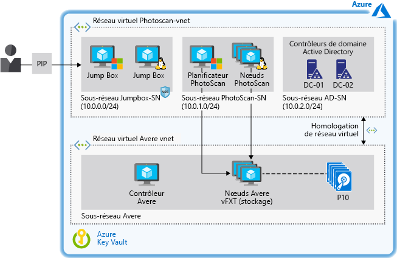

# Accélérer la modélisation basée sur des images numériques dans AzureAccelerate digital image-based modeling on Azure

Cet exemple de scénario fournit des conseils sur la conception et l’architecture aux organisations qui veulent effectuer une modélisation basée sur des images sur l’infrastructure IaaS Azure.This example scenario provides architecture and design guidance for any organization that wants to perform image-based modeling on Azure infrastructure-as-a-service (IaaS). Le scénario est conçu pour l’exécution de logiciels de photogrammétrie sur Machines virtuelles Azure en utilisant un stockage hautes performances qui accélère le temps de traitement.The scenario is designed for running photogrammetry software on Azure Virtual Machines (VMs) using high-performance storage that accelerates processing time. L’environnement peut faire l’objet d’un scale-up ou d’un scale-down en fonction des besoins et prend en charge plusieurs téraoctets de stockage sans sacrifier les performances.The environment can be scaled up and down as needed and supports terabytes of storage without sacrificing performance.

## Cas d’usage appropriésRelevant use cases

Les cas d’usage appropriés sont les suivants :Relevant use cases include:

- Modélisation et mesure de bâtiments, ingénierie des structures et investigation scientifique des lieux d’accident.Modeling and measuring buildings, engineering structures, and forensic accident scenes.
- Création d’effets visuels pour les jeux sur ordinateur et les films.Creating visual effects for computer games and movies.
- Utilisation d’images numériques pour générer indirectement des mesures d’objets de différentes échelles, comme dans la planification urbaine et d’autres applications.Using digital images to indirectly generate measurements of objects of various scales as in urban planning and other applications.

## ArchitectureArchitecture

Cet exemple décrit l’utilisation du logiciel de photogrammétrie Agisoft PhotoScan avec le stockage Avere vFXT.This example describes the use of Agisoft PhotoScan photogrammetry software backed by Avere vFXT storage. PhotoScan a été choisi pour sa popularité dans les applications de système d’information géographique, pour la documentation de patrimoine culturel, pour le développement de jeux et pour la production d’effets visuels.PhotoScan was chosen for its popularity in geographic information system (GIS) applications, cultural heritage documentation, game development, and visual effects production. Il convient pour la photogrammétrie de proximité et aérienne.It is suitable for both close-range photogrammetry and aerial photogrammetry.

Les concepts de cet article s’appliquent aux charges de travail de computing haute performance (HPC) basées sur un planificateur et aux nœuds worker gérés comme infrastructure.The concepts in this article apply to any high-performance computing (HPC) workload based on a scheduler and worker nodes managed as infrastructure.  Pour cette charge de travail, Avere vFXT a été sélectionné pour ses performances supérieures lors de tests d’évaluation.For this workload, Avere vFXT was selected for its superior performance during benchmark tests.  Cependant, le scénario découple le stockage du traitement : d’autres solutions de stockage peuvent donc être utilisées (consultez [alternatives](#alternatives) plus loin dans ce document).However, the scenario decouples the storage from the processing so that other storage solutions can be used (see [alternatives](#alternatives) later in this document).

Cette architecture comprend également des contrôleurs de domaine Active Directory pour contrôler l’accès aux ressources Azure et fournir une résolution de noms interne via le DNS (Domain Name System).This architecture also includes Active Directory domain controllers to control access to Azure resources and provide internal name resolution through the Domain Name System (DNS). Des ordinateurs Jump Box fournissent aux administrateurs un accès aux machines virtuelles Windows et Linux qui exécutent la solution.Jump boxes provide administrator access to the Windows and Linux VMs that run the solution.

1. Un utilisateur soumet un certain nombre d’images à PhotoScan.User submits a number of images to PhotoScan.
2. Le planificateur PhotoScan s’exécute sur une machine virtuelle Windows qui sert de nœud principal et pilote le traitement des images de l’utilisateur.The PhotoScan Scheduler runs on a Windows VM that serves as the head node and directs processing of the user's images.
3. PhotoScan recherche des points communs sur les photographies et construit la géométrie (maillage) en utilisant les nœuds de traitement PhotoScan qui s’exécutent sur des machines virtuelles avec des GPU (Graphics Processing Unit).PhotoScan searches for common points on the photographs and constructs the geometry (mesh) using the PhotoScan processing nodes running on VMs with graphics processing units (GPUs).
4. Avere vFXT fournit une solution de stockage haute performance sur Azure basée sur NFSv3 et constituée d’au moins quatre machines virtuelles.Avere vFXT provides a high-performance storage solution on Azure based on Network File System version 3 (NFSv3) and comprised of at least four VMs.
5. PhotoScan effectue le rendu du modèle.PhotoScan renders the model.

### ComposantsComponents

- [Agisoft PhotoScan](http://www.agisoft.com/) : Le planificateur PhotoScan s’exécute sur une machine virtuelle Windows Server 2016 et les nœuds de traitement utilisent cinq machines virtuelles avec des GPU qui exécutent CentOS Linux 7.5.[Agisoft PhotoScan](http://www.agisoft.com/): The PhotoScan Scheduler runs on a Windows 2016 Server VM, and the processing nodes use five VMs with GPUs that run CentOS Linux 7.5.
- [Avere vFXT](/azure/avere-vfxt/avere-vfxt-overview) est une solution de mise en cache de fichiers qui utilise le stockage d’objets et un stockage NAS traditionnel pour optimiser le stockage de jeux de données volumineux.[Avere vFXT](/azure/avere-vfxt/avere-vfxt-overview) is a file caching solution that uses object storage and traditional network-attached storage (NAS) to optimize storage of large datasets.  Il inclut :It includes:
  - Contrôleur Avere.Avere Controller. Cette machine virtuelle exécute le script qui installe le cluster Avere vFXT et exécute Ubuntu 18.04 LTS.This VM executes the script that installs the Avere vFXT cluster and runs Ubuntu 18.04 LTS. La machine virtuelle peut être utilisée ultérieurement pour ajouter ou supprimer des nœuds de cluster ainsi que pour détruire le cluster.The VM can be used later to add or remove cluster nodes and to destroy the cluster as well.
  - Cluster vFXT.vFXT cluster. Au moins trois machines virtuelles sont utilisées, une pour chacun des nœuds Avere vFXT basés sur Avere OS 5.0.2.1.At least three VMs are used, one for each of the Avere vFXT nodes based on Avere OS 5.0.2.1. Ces machines virtuelles forment le cluster vFXT, qui est attaché à Stockage Blob Azure.These VMs form the vFXT cluster, which is attached to Azure Blob storage.
- Les [contrôleurs de domaine Microsoft Active Directory](/windows/desktop/ad/active-directory-domain-services) permettent à l’hôte d’accéder aux ressources du domaine et fournissent la résolution de noms DNS.[Microsoft Active Directory domain controllers](/windows/desktop/ad/active-directory-domain-services) allow the host access to domain resources and provide DNS name resolution. AVERE vFXT ajoute un nombre d’enregistrements A &mdash; , par exemple, chaque enregistrement A dans un cluster vFXT pointe vers l’adresse IP de chaque nœud de vFXT Avere.Avere vFXT adds a number of A records &mdash; for example, each A record in a vFXT cluster points to the IP address of each Avere vFXT node. Dans cette configuration, toutes les machines virtuelles utilisent le modèle de tourniquet (round robin) pour accéder aux exportations de vFXT.In this setup, all VMs use the round-robin pattern to access vFXT exports.
- Les [autres machines virtuelles](/azure/virtual-machines/) servent d’ordinateurs Jump Box utilisées par l’administrateur pour accéder au nœud du planificateur et aux nœuds de traitement.[Other VMs](/azure/virtual-machines/) serve as jump boxes used by the administrator to access the scheduler and processing nodes. L’ordinateur Jump Box Windows est obligatoire pour permettre à l’administrateur d’accéder au nœud principal via le protocole RDP.The Windows jumpbox is mandatory to allow the administrator to access the head node via remote desktop protocol. Le deuxième ordinateur Jump Box est facultatif et exécute Linux pour l’administration des nœuds worker.The second jumpbox is optional and runs Linux for administration of the worker nodes.
- Les [groupes de sécurité réseau](/azure/virtual-network/manage-network-security-group) limitent l’accès à l’adresse IP publique et autorisent les ports 3389 et 22 pour l’accès aux machines virtuelles attachées au sous-réseau de l’ordinateur Jump Box.[Network security groups](/azure/virtual-network/manage-network-security-group) (NSGs) limit access to the public IP address (PIP) and allow ports 3389 and 22 for access to the VMs attached to the Jumpbox subnet.
- Le [peering de réseau virtuel](/azure/virtual-network/virtual-network-peering-overview) connecte un réseau virtuel PhotoScan à un réseau virtuel Avere.[Virtual network peering](/azure/virtual-network/virtual-network-peering-overview) connects a PhotoScan virtual network to an Avere virtual network.
- [Stockage Blob Azure](/azure/storage/blobs/storage-blobs-introduction) fonctionne avec Avere vFXT comme serveur de fichiers principal pour stocker les données validées à traiter.[Azure Blob storage](/azure/storage/blobs/storage-blobs-introduction) works with Avere vFXT as the core filer to store the committed data being processed. Avere vFXT identifie les données actives stockées dans Stockage Blob Azure et les place dans les disques SSD utilisés pour la mise en cache dans ses nœuds de calcul quand un travail PhotoScan s’exécute.Avere vFXT identifies the active data stored in Azure Blob and tiers it into solid-state drives (SSD) used for caching in its compute nodes while a PhotoScan job is running. Si des modifications sont apportées, les données sont validées de façon asynchrone dans le serveur de fichiers principal.If changes are made, the data is asynchronously committed back to the core filer.
- [Azure Key Vault](/azure/key-vault/key-vault-overview) est utilisé pour stocker les mots de passe de l’administrateur et le code d’activation de PhotoScan.[Azure Key Vault](/azure/key-vault/key-vault-overview) is used to store the administrator passwords and PhotoScan activation code.

### Autres solutionsAlternatives

- Pour tirer parti des services Azure dans la gestion d’un cluster HPC, utilisez des outils comme Azure CycleCloud ou Azure Batch, au lieu de gérer les ressources via des modèles ou des scripts.To take advantage of Azure services for managing an HPC cluster, use tools such as Azure CycleCloud or Azure Batch instead of managing the resources through templates or scripts.
- Déployez le système de fichiers virtuel parallèle BeeGFS comme stockage back-end sur Azure au lieu d’Avere vFXT.Deploy the BeeGFS parallel virtual file system as the back-end storage on Azure instead of Avere vFXT. Utilisez le [modèle BeeGFS](https://github.com/paulomarquesc/beegfs-template) pour déployer cette solution de bout en bout sur Azure.Use the [BeeGFS template](https://github.com/paulomarquesc/beegfs-template) to deploy this end-to-end solution on Azure.
- Déployez la solution de stockage de votre choix, comme GlusterFS, Lustre ou les espaces de stockage direct de Windows.Deploy the storage solution of your choice, such as GlusterFS, Lustre, or Windows Storage Spaces Direct. Pour cela, modifiez le [modèle PhotoScan](https://github.com/paulomarquesc/photoscan-template) pour qu’il utilise la solution de stockage souhaitée.To do this, edit the [PhotoScan template](https://github.com/paulomarquesc/photoscan-template) to work with the storage solution you want.
- Déployez les nœuds worker avec le système d’exploitation Windows au lieu de Linux, qui est l’option par défaut.Deploy the worker nodes with the Windows operating system instead of Linux, the default option. Si vous choisissez des nœuds Windows, les options d’intégration du stockage ne sont pas exécutées par les modèles de déploiement.When choosing Windows nodes, storage integration options are not executed by the deployment templates. Vous devez intégrer manuellement l’environnement à une solution de stockage, ou personnaliser le modèle PhotoScan pour fournir cette automatisation, comme décrit dans le [dépôt](https://github.com/paulomarquesc/photoscan-template/blob/master/docs/AverePostDeploymentSteps.md).You must manually integrate the environment with an existing storage solution, or customize the PhotoScan template to provide such automation, as described in the [repository](https://github.com/paulomarquesc/photoscan-template/blob/master/docs/AverePostDeploymentSteps.md).

## ConsidérationsConsiderations

Ce scénario est conçu spécifiquement pour fournir un stockage haute performance pour une charge de travail HPC, qu’elle soit déployée sur Windows ou sur Linux.This scenario is designed specifically to provide high-performance storage for an HPC workload, whether it is deployed on Windows or Linux. D’une façon générale, la configuration du stockage de la charge de travail HPC doit correspondre aux bonnes pratiques appropriées utilisées pour les déploiements locaux.In general, the storage configuration of the HPC workload should match the appropriate best practices used for on-premises deployments.

Les considérations relatives au déploiement dépendent des applications et des services utilisés, mais il faut prendre en compte quelques remarques :Deployment considerations depend on the applications and services used, but a few notes apply:

- Lors de la création d’applications haute performance, utilisez Stockage Azure Premium et [optimisez la couche Application](/azure/virtual-machines/windows/premium-storage-performance).When building high-performance applications, use Azure Premium Storage and [optimize the application layer](/azure/virtual-machines/windows/premium-storage-performance). Optimisez le stockage pour les accès fréquents en utilisant le [niveau d’accès chaud](/azure/storage/blobs/storage-blob-storage-tiers) de Stockage Blob Azure.Optimize storage for frequent access using Azure Blob [hot tier access](/azure/storage/blobs/storage-blob-storage-tiers).
- Utiliser un stockage [option de réplication](/azure/storage/common/storage-redundancy) qui répond à vos besoins de disponibilité et les performances.Use a storage [replication option](/azure/storage/common/storage-redundancy) that meets your availability and performance requirements. Dans cet exemple, Avere vFXT est configuré par défaut pour la haute disponibilité, avec un stockage localement redondant (LRS).In this example, Avere vFXT is configured for high availability by default, with locally redundant storage (LRS). Pour l’équilibrage de charge, toutes les machines virtuelles utilisent le modèle de tourniquet (round robin) pour accéder aux exportations de vFXT.For load balancing, all VMs in this setup use the round-robin pattern to access vFXT exports.
- Si le stockage back-end est utilisé à la fois par des clients Windows et des clients Linux, utilisez des serveurs Samba pour prendre en charge les nœuds Windows.If the backend storage will be consumed by both Windows clients and Linux clients, use Samba servers to support the Windows nodes. Une [version](https://github.com/paulomarquesc/beegfs-template) de cet exemple de scénario basé sur BeeGFS utilise Samba pour prendre en charge le nœud du planificateur de la charge de travail HPC (PhotoScan) s’exécutant sur Windows.A [version](https://github.com/paulomarquesc/beegfs-template) of this example scenario based on BeeGFS uses Samba to support the scheduler node of the HPC workload (PhotoScan) running on Windows. Un équilibreur de charge est déployé pour agir comme remplacement intelligent pour le tourniquet (round robin) DNS.A load balancer is deployed to act like a smart replacement for DNS round robin.
- Exécutez les applications HPC en utilisant le type de machine virtuelle le mieux adapté à votre charge de travail [Windows](/azure/virtual-machines/windows/sizes-hpc) ou [Linux](/azure/virtual-machines/linux/sizes?toc=%2fazure%2fvirtual-machines%2flinux%2ftoc.json).Run HPC applications using the VM type best suited for your [Windows](/azure/virtual-machines/windows/sizes-hpc) or [Linux](/azure/virtual-machines/linux/sizes?toc=%2fazure%2fvirtual-machines%2flinux%2ftoc.json) workload.
- Pour isoler la charge de travail HPC des ressources de stockage, déployez chaque ressource dans son propre réseau virtuel, puis utilisez le [peering](/azure/virtual-network/virtual-network-peering-overview) de réseau virtuel pour connecter les deux réseaux.To isolate the HPC workload from the storage resources, deploy each in its own virtual network, then use virtual network [peering](/azure/virtual-network/virtual-network-peering-overview) to connect the two. Le peering crée une connexion haut débit à faible latence entre les ressources dans différents réseaux virtuels et route le trafic à travers l’infrastructure principale Microsoft via des adresses IP privées uniquement.Peering creates a low-latency, high-bandwidth connection between resources in different virtual networks and routes traffic through the Microsoft backbone infrastructure through private IP addresses only.

### SécuritéSecurity

Cet exemple se concentre sur le déploiement d’une solution de stockage haute performance pour une charge de travail HPC et n’est pas une solution de sécurité.This example focuses on deploying a high-performance storage solution for an HPC workload and is not a security solution. Veillez à impliquer votre équipe de sécurité pour les éventuelles modifications.Make sure to involve your security team for any changes.

Pour renforcer la sécurité, cet exemple d’infrastructure permet à toutes les machines virtuelles Windows d’être jointes au domaine et utilise Active Directory pour l’authentification centralisée.For added security, this example infrastructure enables all the Windows VMs to be domain-joined and uses Active Directory for central authentication. Il fournit également des services DNS personnalisés pour toutes les machines virtuelles.It also provides custom DNS services for all VMs. Pour aider à protéger l’environnement, ce modèle s’appuie sur des [groupes de sécurité réseau](/azure/virtual-network/security-overview).To help protect the environment, this template relies on [network security groups (NSGs)](/azure/virtual-network/security-overview). Les groupes de sécurité réseau offrent des filtres de trafic et des règles de sécurité de base.NSGs offer basic traffic filters and security rules.

Considérez les options suivantes pour améliorer la sécurité dans ce scénario :Consider the following options to further improve security in this scenario:

- Utilisez des appliances de réseau virtuel, comme Fortinet, Checkpoint et Juniper.Use network virtual appliances such as Fortinet, Checkpoint, and Juniper.
- Appliquez le [contrôle d’accès en fonction du rôle](/azure/role-based-access-control/overview) aux groupes de ressources.Apply [role-based access control](/azure/role-based-access-control/overview) to the resource groups.
- Activez l’accès [JIT](/azure/security-center/security-center-just-in-time) aux machines virtuelles si les ordinateurs Jump Box sont accessibles via Internet.Enable VM [JIT](/azure/security-center/security-center-just-in-time) access if jump boxes are accessed via the Internet.
- Utilisez [Azure Key Vault](/azure/key-vault/quick-create-portal) pour stocker les mots de passe utilisés par les comptes d’administrateur.Use [Azure Key Vault](/azure/key-vault/quick-create-portal) to store the passwords used by administrator accounts.

## TarifsPricing

Le coût d’exécution de ce scénario peut varier considérablement selon plusieurs facteurs.The cost of running this scenario can vary greatly depending on multiple factors.  Le nombre et la taille des machines virtuelles, la quantité de stockage nécessaire et le temps nécessaire pour effectuer un travail détermineront le coût.The number and size of VMs, how much storage is required, and the amount of time to complete a job will determine your cost.

L’exemple de profil de coûts suivant dans la [calculatrice de prix Azure](https://azure.com/e/42362ddfd2e245a28a8e78bc609c80f3) est basé sur une configuration classique pour Avere vFXT et PhotoScan :The following sample cost profile in the [Azure pricing calculator](https://azure.com/e/42362ddfd2e245a28a8e78bc609c80f3) is based on a typical configuration for Avere vFXT and PhotoScan:

- 1 machine virtuelle Ubuntu A1\_v2 pour exécuter le contrôleur Avere.1 A1\_v2 Ubuntu VM to run the Avere controller.
- 3 machines virtuelles Avere OS D16s\_v3 : une pour chacun des nœuds Avere vFXT qui forment le cluster vFXT.3 D16s\_v3 Avere OS VMs, one for each of the Avere vFXT nodes that form the vFXT cluster.
- 5 machines virtuelles Linux NC24\_v2 pour fournir les GPU nécessaires aux nœuds de traitement PhotoScan.5 NC24\_v2 Linux VMs to provide the GPUs needed by the PhotoScan processing nodes.
- 1 machine virtuelle CentOS D8s\_v3 pour le nœud du planificateur PhotoScan.1 D8s\_v3 CentOS VM for the PhotoScan scheduler node.
- 1 machine virtuelle CentOS DS2\_v2 utilisée comme ordinateur Jump Box de l’administrateur.1 DS2\_v2 CentOS used as administrator jumpbox.
- 2 machines virtuelles DS2\_v2 pour les contrôleurs de domaine Active Directory.2 DS2\_v2 VMs for the Active Directory domain controllers.
- Disques managés Premium.Premium managed disks.
- Stockage Blob v2 universel (GPv2) avec LRS et niveau d’accès chaud (seuls les comptes de stockage GPv2 exposent l’attribut Niveau d’accès).General purpose v2 (GPv2) Blob storage with LRS and hot tier access (only GPv2 storage accounts expose the Access Tier attribute).
- Réseau virtuel prenant en charge le transfert de 10 To de données.Virtual network with support for 10 TB data transfer.

Pour plus d’informations sur cette architecture, consultez le [livre électronique](https://azure.microsoft.com/en-us/resources/deploy-agisoft-photoscan-on-azure-with-azere-vfxt-for-azure-or-beegfs/).For details about this architecture, see the [ebook](https://azure.microsoft.com/en-us/resources/deploy-agisoft-photoscan-on-azure-with-azere-vfxt-for-azure-or-beegfs/). Pour voir quel serait le tarif de votre cas d’usage particulier, choisissez des tailles de machines virtuelles différentes dans la calculatrice de prix en fonction du déploiement que vous prévoyez.To see how the pricing would change for your particular use case, choose different VM sizes in the pricing calculator to match your expected deployment.

## DéploiementDeployment

Pour obtenir des instructions pas à pas sur le déploiement de cette architecture, notamment tous les prérequis de l’utilisation d’Avere FxT ou BeeGFS, téléchargez le livre électronique : [Deploy Agisoft PhotoScan on Azure With Avere vFXT for Azure or BeeGFS](https://azure.microsoft.com/en-us/resources/deploy-agisoft-photoscan-on-azure-with-azere-vfxt-for-azure-or-beegfs/).For step-by-step instructions for deploying this architecture, including all the prerequisites for using either Avere FxT or BeeGFS, download the ebook: [Deploy Agisoft PhotoScan on Azure With Avere vFXT for Azure or BeeGFS](https://azure.microsoft.com/en-us/resources/deploy-agisoft-photoscan-on-azure-with-azere-vfxt-for-azure-or-beegfs/).

## Ressources associéesRelated resources

Les ressources suivantes fournissent plus d’informations sur les composants utilisés dans ce scénario, ainsi que des approches alternatives pour le traitement par lots sur Azure.The following resources will provide more information on the components utilized in this scenario, along with alternative approaches for batch computing on Azure.

- Vue d’ensemble d’[Avere vFXT pour Azure](/azure/avere-vfxt/avere-vfxt-overview)Overview of [Avere vFXT for Azure](/azure/avere-vfxt/avere-vfxt-overview)
- Page d’accueil d’[Agisoft PhotoScan](https://www.agisoft.com/)[Agisoft PhotoScan](https://www.agisoft.com/) home Page
- [Liste de contrôle des performances et de l’extensibilité du Stockage Microsoft AzureAzure Storage Performance and Scalability Checklist](/azure/storage/common/storage-performance-checklist)
- [Systèmes de fichiers virtuels parallèles sur Microsoft Azure : Tests de performances de Lustre, GlusterFS et BeeGFS](https://azure.microsoft.com/mediahandler/files/resourcefiles/parallel-virtual-file-systems-on-microsoft-azure/Parallel_Virtual_File_Systems_on_Microsoft_Azure.pdf) (PDF)[Parallel Virtual File Systems on Microsoft Azure: Performance tests of Lustre, GlusterFS, and BeeGFS](https://azure.microsoft.com/mediahandler/files/resourcefiles/parallel-virtual-file-systems-on-microsoft-azure/Parallel_Virtual_File_Systems_on_Microsoft_Azure.pdf) (PDF)
- Un exemple de scénario pour l’[ingénierie assistée par ordinateur (IAO) sur Azure](/azure/architecture/example-scenario/apps/hpc-saas)An example scenario for [computer-aided engineering (CAE) on Azure](/azure/architecture/example-scenario/apps/hpc-saas)
- Page d’accueil de [HPC sur Azure](https://azure.microsoft.com/en-us/solutions/high-performance-computing/)[HPC on Azure](https://azure.microsoft.com/en-us/solutions/high-performance-computing/) home page
- Vue d’ensemble de [Big Compute : HPC &amp; Microsoft Batch](https://azure.microsoft.com/en-us/solutions/big-compute/)Overview of [Big Compute: HPC &amp; Microsoft Batch](https://azure.microsoft.com/en-us/solutions/big-compute/)