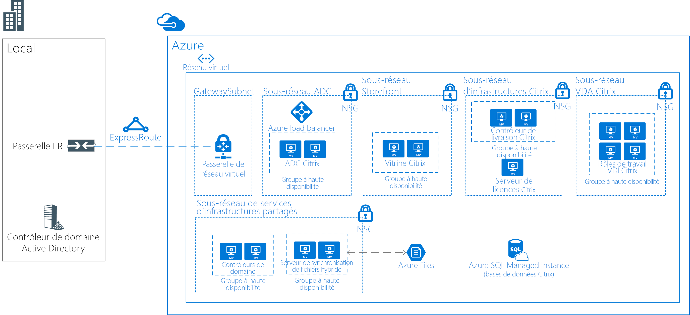

# Bureaux virtuels Linux avec CitrixLinux Virtual Desktops with Citrix

Cet exemple de scénario s’applique à tous les secteurs qui ont besoin d’une infrastructure de bureaux virtuels (VDI) pour les postes de travail Linux.This example scenario is applicable to any industry that needs a Virtual Desktop Infrastructure (VDI) for Linux Desktops. Le sigle VDI désigne le processus d’exécution d’un bureau utilisateur dans une machine virtuelle hébergée sur un serveur dans le centre de données.VDI refers to the process of running a user desktop inside a virtual machine that lives on a server in the datacenter. Dans ce scénario, le client a choisi d’utiliser une solution Citrix pour satisfaire ses besoins en matière de VDI.The customer in this scenario chose to use a Citrix-based solution for their VDI needs.

Les entreprises disposent souvent d’environnements hétérogènes avec des collaborateurs qui utilisent différents appareils et systèmes d’exploitation.Organizations often have heterogeneous environments with multiple devices and operating systems being used by employees. Il peut être difficile de fournir un accès uniforme aux applications tout en assurant la sécurité de l’environnement.It can be challenging to provide consistent access to applications while maintaining a secure environment. Une solution VDI pour les postes de travail Linux vous permet de fournir un accès aux utilisateurs, quel que soit leur appareil ou leur système d’exploitation.A VDI solution for Linux desktops will allow your organization to provide access irrespective of the device or OS used by the end user.

Voici quelques avantages de ce scénario :Some benefits of this scenario include the following:

- Le retour sur investissement est plus élevé avec des bureaux virtuels Linux partagés en permettant à un plus grand nombre d’utilisateurs d’accéder à la même infrastructure.Return on investment will be higher with shared Linux virtual desktops by giving more users access to the same infrastructure. En regroupant les ressources sur un environnement VDI centralisé, les appareils des utilisateurs n’ont pas besoin d’être aussi puissants.By consolidating resources on a centralized VDI environment, the end user devices don't need to be as powerful.
- Les performances sont les mêmes, quel que soit l’appareil de l’utilisateur.Performance will be consistent regardless of the end user device.
- Les utilisateurs peuvent accéder aux applications Linux depuis n’importe quel appareil (y compris les appareils qui ne fonctionnent pas sous Linux).Users can access Linux applications from any device (including non-Linux devices).
- Les données sensibles de tous les collaborateurs répartis peuvent être sécurisées dans le centre de données Azure.Sensitive data can be secured in the Azure data center for all distributed employees.

## Cas d’utilisation appropriésRelevant use cases

Pensez à ce scénario pour les cas d’usage suivants :Consider this scenario for the following use case:

- Accès sécurisé à des postes de travail VDI Linux spécialisés et stratégiques à partir d’appareils fonctionnant ou non sous LinuxProviding secure access to mission-critical, specialized Linux VDI desktops from Linux or non-Linux devices

## ArchitectureArchitecture

Cet exemple de scénario illustre comment permettre au réseau d’entreprise d’accéder aux bureaux virtuels Linux :This example scenario demonstrates allowing the corporate network to access the Linux Virtual Desktops:

- Une connexion ExpressRoute est établie entre l’environnement local et Azure afin d’assurer la rapidité et la fiabilité de la connectivité avec le cloud.An ExpressRoute is established between the on-premises environment and Azure, for fast and reliable connectivity to the cloud.
- Solution Citrix XenDeskop déployée pour une infrastructure VDI.Citrix XenDeskop solution deployed for VDI.
- CitrixVDA fonctionne sur Ubuntu (ou une autre distribution compatible).The CitrixVDA run on Ubuntu (or another supported distro).
- Les groupes de sécurité réseau Azure appliquent les ACL réseau appropriées.Azure Network Security Groups will apply the correct network ACLs.
- Citrix ADC (NetScaler) publie et équilibre le chargement de tous les services Citrix.Citrix ADC (NetScaler) will publish and load balance all the Citrix services.
- Les services de domaine Active Directory sont utilisés pour accéder aux serveurs Citrix.Active Directory Domain Services will be used to domain join the Citrix servers. Les serveurs VDA ne sont pas rattachés au domaine.VDA servers will not be domain joined.
- Azure Hybrid File Sync permet de partager le stockage sur l’ensemble de la solution.Azure Hybrid File Sync will enable shared storage across the solution. Par exemple, il peut être utilisé dans des solutions distantes/à domicile.For example, it can be used in remote/home solutions.

Dans ce scénario, les références SKU suivantes sont utilisées :For this scenario, the following SKUs are used:

- Citrix ADC (NetScaler) : 2 x D4sv3 avec [image Paiement à l’utilisation de NetScaler 12.0 VPX Standard Edition 200 Mbits/s ](https://azuremarketplace.microsoft.com/pt-br/marketplace/apps/citrix.netscalervpx-120?tab=PlansAndPrice)Citrix ADC (NetScaler): 2 x D4sv3 with [NetScaler 12.0 VPX Standard Edition 200 MBPS PAYG image](https://azuremarketplace.microsoft.com/pt-br/marketplace/apps/citrix.netscalervpx-120?tab=PlansAndPrice)
- Citrix License Server : 1 x D2s v3Citrix License Server: 1 x D2s v3
- Citrix VDA : 4 x D8s v3Citrix VDA: 4 x D8s v3
- Citrix StoreFront : 2 x D2s v3Citrix Storefront: 2 x D2s v3
- Citrix Delivery Controller : 2 x D2s v3Citrix Delivery Controller: 2 x D2s v3
- Contrôleurs de domaine : 2 x D2sv3Domain Controllers: 2 x D2sv3
- Serveurs de fichiers Azure : 2 x D2sv3Azure File Servers: 2 x D2sv3

> [!NOTE]
> Toutes les licences (autres que NetScaler) sont sous licence BYOL (apportez votre propre licence)All the licenses (other than NetScaler) are bring-your-own-license (BYOL)

### ComposantsComponents

- Le [réseau virtuel Azure](/azure/virtual-network/virtual-networks-overview) permet à de nombreuses ressources, telles que les machines virtuelles de communiquer en toute sécurité entre elles, avec Internet et avec les réseaux locaux.[Azure Virtual Network](/azure/virtual-network/virtual-networks-overview) allows resources such as VMs to securely communicate with each other, the internet, and on-premises networks. Les réseaux virtuels fournissent un isolement et une segmentation, ils filtrent et acheminent le trafic et ils autorisent une connexion entre des emplacements.Virtual networks provide isolation and segmentation, filter and route traffic, and allow connection between locations. Dans ce scénario, un réseau virtuel est utilisé pour toutes les ressources.One virtual network will be used for all resources in this scenario.
- Les [groupes de sécurité réseau Azure](/azure/virtual-network/security-overview) contiennent une liste de règles de sécurité qui autorisent ou refusent le trafic réseau entrant ou sortant en fonction de l’adresse IP source ou de destination, du port et du protocole.[Azure network security groups](/azure/virtual-network/security-overview) contain a list of security rules that allow or deny inbound or outbound network traffic based on source or destination IP address, port, and protocol. Les réseaux virtuels dans ce scénario sont sécurisés avec des règles de groupe de sécurité réseau qui limitent le flux du trafic entre les composants d’application.The virtual networks in this scenario are secured with network security group rules that restrict the flow of traffic between the application components.
- [Azure Load Balancer](/azure/application-gateway/overview) distribue le trafic entrant en fonction des règles et des sondes d’intégrité.[Azure load balancer](/azure/application-gateway/overview) distributes inbound traffic according to rules and health probes. Un équilibreur de charge offre une latence faible et un débit élevé, et peut augmenter l’échelle jusqu’à des millions de flux pour toutes les applications TCP et UDP.A load balancer provides low latency and high throughput, and scales up to millions of flows for all TCP and UDP applications. Dans ce scénario, un équilibreur de charge interne permet de répartir le trafic sur Citrix NetScaler.An internal load balancer is used in this scenario to distribute traffic on the Citrix NetScaler.
- [Azure Hybrid File Sync](https://github.com/MicrosoftDocs/azure-docs/edit/master/articles/storage/files/storage-sync-files-planning.md) est utilisé pour tout le stockage partagé.[Azure Hybrid File Sync](https://github.com/MicrosoftDocs/azure-docs/edit/master/articles/storage/files/storage-sync-files-planning.md) will be used for all shared storage. Le stockage est répliqué sur deux serveurs de fichiers à l’aide d’Hybrid File Sync.The storage will replicate to two file servers using Hybrid File Sync.
- [Azure SQL Database](/azure/sql-database/sql-database-technical-overview) est une base de données relationnelle en tant que service reposant sur la dernière version stable du moteur de base de données Microsoft SQL Server.[Azure SQL Database](/azure/sql-database/sql-database-technical-overview) is a relational database-as-a-service (DBaaS) based on the latest stable version of Microsoft SQL Server Database Engine. Elle sert à l’hébergement des bases de données Citrix.It will be used for hosting Citrix databases.
- [ExpressRoute](/azure/expressroute/expressroute-introduction) vous permet d’étendre vos réseaux locaux au cloud de Microsoft via une connexion privée assurée par un fournisseur de connectivité.[ExpressRoute](/azure/expressroute/expressroute-introduction) lets you extend your on-premises networks into the Microsoft cloud over a private connection facilitated by a connectivity provider.
- [Les services de domaine Active Directory sont utilisés pour les services d’annuaire et l’authentification des utilisateurs[Active Directory Domain Services is used for Directory Services and user authentication
- Les [groupes à haute disponibilité Azure](/azure/virtual-machines/windows/tutorial-availability-sets) veillent à ce que les machines virtuelles que vous déployez sur Azure soient distribuées sur plusieurs nœuds matériels isolés d’un cluster.[Azure Availabilty Sets](/azure/virtual-machines/windows/tutorial-availability-sets) will ensure that the VMs you deploy on Azure are distributed across multiple isolated hardware nodes in a cluster. Leur utilisation garantit qu’en cas de défaillance matérielle ou logicielle dans Azure, seul un sous-ensemble de vos machines virtuelles est affecté et que votre solution globale reste disponible et opérationnelle.Doing this ensures that if a hardware or software failure within Azure happens, only a subset of your VMs are impacted and that your overall solution remains available and operational.
- [Citrix ADC (NetScaler)](https://www.citrix.com/products/citrix-adc) est un contrôleur de livraison d’applications qui effectue des analyses de trafic spécifiques sur les applications afin de distribuer, d’optimiser et de protéger de façon intelligente le trafic réseau couche 4-couche 7 (L4-L7) pour les applications Web.[Citrix ADC (NetScaler)](https://www.citrix.com/products/citrix-adc) is an application delivery controller that performs application-specific traffic analysis to intelligently distribute, optimize, and secure Layer 4-Layer 7 (L4–L7) network traffic for web applications.
- [Citrix StoreFront](https://www.citrix.com/products/citrix-virtual-apps-and-desktops/citrix-storefront.html) est un magasin d’applications professionnelles qui améliore la sécurité et simplifie les déploiements pour une expérience utilisateur moderne et presque native inégalée sur toutes les plateformes Citrix Receiver.[Citrix Storefront](https://www.citrix.com/products/citrix-virtual-apps-and-desktops/citrix-storefront.html) is an enterprise app store that improves security and simplifies deployments, delivering a modern, unmatched near-native user experience across Citrix Receiver on any platform. StoreFront facilite la gestion des environnements d’applications et de bureaux virtuels Citrix sur plusieurs sites et en plusieurs versions.StoreFront makes it easy to manage multi-site and multi-version Citrix Virtual Apps and Desktops environments.
- [Citrix License Server](https://www.citrix.com/buy/licensing/overview.html) gère les licences des produits Citrix.[Citrix License Server](https://www.citrix.com/buy/licensing/overview.html) will manage the licenses for Citrix products.
- [Citrix XenDesktops VDA](https://docs.citrix.com/en-us/citrix-virtual-apps-desktops-service) permet de se connecter aux applications et aux bureaux.[Citrix XenDesktops VDA](https://docs.citrix.com/en-us/citrix-virtual-apps-desktops-service) enables connections to applications and desktops. Le VDA est installé sur la machine qui exécute les applications ou les bureaux virtuels de l’utilisateur.The VDA is installed on the machine that runs the applications or virtual desktops for the user. Il permet aux machines de s’enregistrer auprès des contrôleurs de livraison et de gérer la connexion HDX (High Definition eXperience) à un appareil utilisateur.It enables the machines to register with Delivery Controllers and manage the High Definition eXperience (HDX) connection to a user device.
- [Citrix Delivery Controller](https://docs.citrix.com/en-us/xenapp-and-xendesktop/7-15-ltsr/manage-deployment/delivery-controllers) est le composant côté serveur chargé de gérer l’accès des utilisateurs, ainsi que la distribution et l’optimisation des connexions.[Citrix Delivery Controller](https://docs.citrix.com/en-us/xenapp-and-xendesktop/7-15-ltsr/manage-deployment/delivery-controllers) is the server-side component responsible for managing user access, plus brokering and optimizing connections. Les contrôleurs assurent également les services de création de machines qui effectuent les images des bureaux et des serveurs.Controllers also provide the Machine Creation Services that create desktop and server images.

### Autres solutionsAlternatives

- Il existe plusieurs partenaires ayant des solutions VDI prises en charge par Azure, comme VMware, Workspot, etc.There are multiple partners with VDI solutions that supported in Azure such as VMware, Workspot, and others. Cet exemple précis d’architecture repose sur un projet de déploiement ayant utilisé Citrix.This specific sample architecture is based on a deployed project that used Citrix.
- Citrix fournit un service cloud qui résume une partie de cette architecture.Citrix provides a cloud service that abstracts part of this architecture. Il peut s’agir d’une autre option pour cette solution.It could be an alternative for this solution. Pour plus d’informations, consultez la page [Cloud Citrix](https://www.citrix.com/products/citrix-cloud).For more information, see [Citrix Cloud](https://www.citrix.com/products/citrix-cloud).

## ConsidérationsConsiderations

- Consultez les [conditions requises Linux pour Citrix](https://docs.citrix.com/en-us/linux-virtual-delivery-agent/current-release/system-requirements).Check the [Citrix Linux Requirements](https://docs.citrix.com/en-us/linux-virtual-delivery-agent/current-release/system-requirements).
- La latence peut avoir une incidence sur l’ensemble de la solution.Latency can have impact on the overall solution. Pour un environnement de production, effectuez des essais en conséquence.For a production environment, test accordingly.
- Selon le scénario, la solution peut avoir besoin de machines virtuelles avec GPU pour VDA.Depending on the scenario, the solution may need VMs with GPUs for VDA. Pour cette solution, nous partons du principe que le GPU n’est pas nécessaire.For this solution, it is assumed that GPU is not a requirement.

### Disponibilité, extensibilité et sécuritéAvailability, Scalability, and Security

- Cet exemple est conçu pour assurer une haute disponibilité de tous les rôles autres que celui du serveur de licences.This example is designed for high availability for all roles other than the licensing server. Comme l’environnement continue de fonctionner pendant un délai supplémentaire de 30 jours si le serveur de licences se trouve hors ligne, aucune redondance supplémentaire n’est requise sur ce serveur.Because the environment continues to function during a 30-day grace period if the license server is offline, no additional redundancy is required on that server.
- Tous les serveurs assurant des rôles similaires doivent être déployés dans des [groupes à haute disponibilité](/azure/virtual-machines/windows/manage-availability#configure-multiple-virtual-machines-in-an-availability-set-for-redundancy).All servers providing similar roles should be deployed in [Availability Sets](/azure/virtual-machines/windows/manage-availability#configure-multiple-virtual-machines-in-an-availability-set-for-redundancy).
- Cet exemple de scénario ne comprend pas les fonctionnalités de reprise d’activité après sinistre.This example scenario does not include Disaster Recovery capabilities. [Azure Site Recovery](/azure/site-recovery/site-recovery-overview) peut compléter idéalement cette conception.[Azure Site Recovery](/azure/site-recovery/site-recovery-overview) could be a good add-on to this design.
- Envisagez de déployer dans ce scénario les instances de machine virtuelle sur des [zones de disponibilité](/azure/availability-zones/az-overview).Consider deploying the VM instances in this scenario across [Availability Zones](/azure/availability-zones/az-overview). Chaque zone de disponibilité est composée d’un ou de plusieurs centres de données équipés d’une alimentation, d’un refroidissement et d’un réseau indépendants.Each availability zone is made up of one or more datacenters equipped with independent power, cooling, and networking. Chaque région activée a un minimum de trois zones de disponibilité.Each enabled region has a minimum of three availability zones. Cette distribution d’instances de machine virtuelle entre des zones offre une haute disponibilité pour les couches Application.This distribution of VM instances across zones provides high availability to the application tiers. Pour plus d’informations, consultez [Que sont les zones de disponibilité dans Azure ?](/azure/availability-zones/az-overview).For more information, see [what are Availability Zones in Azure?](/azure/availability-zones/az-overview). Vous pouvez aussi [déployer des passerelles VPN et ExpressRoute dans des zones de disponibilité Azure](/azure/vpn-gateway/about-zone-redundant-vnet-gateways).You can also [deploy VPN and ExpressRoute gateways in Azure Availability Zones](/azure/vpn-gateway/about-zone-redundant-vnet-gateways).
- Pour une solution de gestion des déploiements de production, il est nécessaire d’implémenter des solutions de type [sauvegarde](/azure/backup/backup-introduction-to-azure-backup), [surveillance](/azure/monitoring-and-diagnostics/monitoring-overview) et [mise à jour](/azure/automation/automation-update-management).For a production deployment management solution should be implemented such as [backup](/azure/backup/backup-introduction-to-azure-backup), [monitoring](/azure/monitoring-and-diagnostics/monitoring-overview) and [update management](/azure/automation/automation-update-management).
- Cet exemple doit fonctionner pour environ 250 utilisateurs simultanés (environ 50-60 par serveur VDA) avec une utilisation mixte.This example should work for about 250 concurrent (about 50-60 per VDA server) users with a mixed usage. Mais la capacité dépend beaucoup du type d’applications utilisées.But that will greatly depended on the type of applications being used. Pour une utilisation en production, des tests de charge rigoureux doivent être effectués.For production use, rigorous load testing should be performed.

## DéploiementDeployment

Pour plus d’informations sur le déploiement, consultez la [documentation officielle Citrix](https://docs.citrix.com/en-us/citrix-virtual-apps-desktops/install-configure.html).For deployment information, see the official [Citrix documentation](https://docs.citrix.com/en-us/citrix-virtual-apps-desktops/install-configure.html).

## TarifsPricing

- Les licences Citrix XenDesktop ne sont pas incluses dans les frais de service Azure.The Citrix XenDesktop licenses are not included in Azure service charges.
- La licence Citrix NetScaler est incluse dans un modèle de paiement à l’utilisation.The Citrix NetScaler license is included in a pay-as-you-go model.
- L’utilisation d’instances réservées réduit considérablement les coûts de calcul de la solution.Using reserved instances will greatly reduce the compute cost for the solution.
- Les coûts liés à ExpressRoute ne sont pas inclus.The ExpressRoute cost is not included.

## Étapes suivantesNext Steps

- Consultez [ici](https://docs.citrix.com/en-us/citrix-virtual-apps-desktops/install-configure) la documentation Citrix sur la planification et le déploiement.Check Citrix documentation for planning and deployment [here](https://docs.citrix.com/en-us/citrix-virtual-apps-desktops/install-configure).
- Pour déployer Citrix ADC (NetScaler) dans Azure, consultez [ici](https://github.com/citrix/netscaler-azure-templates) les modèles de Gestionnaire des ressources fournis par Citrix.To deploy Citrix ADC (NetScaler) in Azure, review the Resource Manager templates provided by Citrix [here](https://github.com/citrix/netscaler-azure-templates).
