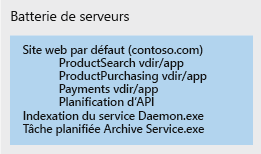
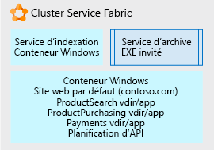

# Utilisation de Service Fabric pour décomposer des applications monolithiques

Dans cet exemple de scénario, nous allons examiner une approche consistant à utiliser [Service Fabric](/azure/service-fabric/service-fabric-overview) en tant que plateforme pour décomposer une application monolithique difficile à gérer. Nous considérons ici une approche itérative de la décomposition d’un site web IIS/ASP.NET en une application constituée de plusieurs microservices facilement gérables.

L’évolution d’une architecture monolithique vers une architecture de microservices offre les avantages suivants :

- Vous pouvez modifier une petite unité de code compréhensible et ne déployer que cette unité.
- Le déploiement de chaque unité de code ne nécessite que quelques minutes au plus.
- Si cette petite unité de code comporte une erreur, seule cette unité cesse de fonctionner, et non la totalité de l’application.
- Les petites unités de code peuvent être réparties discrètement et en toute simplicité entre plusieurs équipes de développement.
- Les nouveaux développeurs peuvent appréhender rapidement et facilement les fonctionnalités discrètes de chaque unité.

Cet exemple considère une application IIS volumineuse sur une batterie de serveurs, mais les concepts de décomposition et d’hébergement itératifs sont applicables à tout type d’application de grande taille. Bien que cette solution utilise Windows, la plateforme Service Fabric est également exécutable sur Linux. Elle peut être exécutée localement, dans Azure ou sur des nœuds de machine virtuelle dans le fournisseur de cloud de votre choix.

## Cas d’usage appropriés

Ce scénario s’applique aux organisations disposant d’applications web monolithiques volumineuses qui font face aux difficultés suivantes :

- erreurs dans les modifications de code mineures qui entraînent un dysfonctionnement de la totalité du site web ;
- mises en production nécessitant plusieurs jours en raison de l’obligation de mettre à jour la mise en production de la totalité du site web ;
- longue période d’apprentissage des nouveaux développeurs ou équipes qui rejoignent l’organisation du fait de la complexité du codebase, qui nécessite une somme de connaissances considérable de la part de chacun.

## Architecture

En utilisant Service Fabric comme plateforme d’hébergement, nous pouvons convertir un site web IIS volumineux en une collection de microservices, comme illustré ci-après :

Dans la figure ci-dessus, nous avons décomposé toutes les parties d’une application IIS de grande taille en différents éléments :

- Un service de routage ou de passerelle qui accepte les requêtes de navigateur entrantes, les analyses pour déterminer le service qui doit les traiter, puis les transfère vers ce service.
- Quatre applications ASP.NET Core qui correspondaient auparavant à des répertoires virtuels sous le site IIS unique s’exécutant en tant qu’applications ASP.NET. Ces applications ont été divisées en microservices indépendants propres à chacune d’elles. En conséquence, elles peuvent faire l’objet de modifications, d’un contrôle des versions et de mises à niveau séparément. Dans cet exemple, nous avons réécrit chaque application à l’aide de .Net Core et d’ASP.NET Core sous forme de [Reliable Services](/azure/service-fabric/service-fabric-reliable-services-introduction), ce qui leur permet d’accéder en mode natif à l’intégralité des fonctionnalités et avantages de la plateforme Service Fabric (services de communication, rapports d’intégrité, notifications, etc.).
- Un service Windows appelé *service Indexation*, placé dans un conteneur Windows afin qu’il n’apporte plus de modifications directes au registre du serveur sous-jacent, mais qu’il soit exécutable de manière autonome et déployable avec toutes ses dépendances comme une seule unité.
- Un service Archive, qui est un simple exécutable dont les exécutions sont planifiées et qui accomplit certaines tâches pour les sites. Il est directement hébergé sous la forme d’un exécutable autonome, car nous avons déterminé qu’il joue parfaitement son rôle tel quel et qu’il ne vaut pas la peine de le modifier.

## Considérations

La première difficulté consiste à commencer à identifier les petits bits de code qui peuvent être sortis de l’application monolithique sous forme de microservices appelables par l’application monolithique. Au fil du temps, l’application monolithique est décomposée de manière itérative en une collection de microservices de ce type, que les développeurs peuvent comprendre, modifier et déployer facilement et rapidement avec un minimum de risques.

Nous avons choisi la plateforme Service Fabric en raison de sa capacité à prendre en charge l’exécution de tous les microservices sous leurs différentes formes. Par exemple, si vous disposez d’une combinaison d’exécutables autonomes, de nouveaux sites web et API de petite taille, de services en conteneur, etc., Service Fabric peut combiner l’ensemble de ces types de services dans un seul cluster.

Pour parvenir à cette application décomposée finale, nous avons utilisé une approche itérative. Nous sommes partis d’un site web IIS/ASP.NET volumineux sur une batterie de serveurs. La figure ci-après illustre l’un des nœuds de la batterie de serveurs. Ce nœud contient le site web d’origine avec plusieurs répertoires virtuels, un service Windows supplémentaire appelé par le site, ainsi qu’un exécutable qui assure une maintenance périodique des archives du site.

Lors de la première itération de développement, le site IIS et ses répertoires virtuels sont placés dans un [conteneur Windows](/azure/service-fabric/service-fabric-containers-overview). Grâce à cette approche, le site reste opérationnel sans être étroitement lié au système d’exploitation du nœud serveur sous-jacent. Le conteneur est exécuté et orchestré par le nœud Service Fabric sous-jacent, mais ce dernier ne doit pas nécessairement présenter un état spécifique dont dépendrait le site (entrées de registre, fichiers, etc.). Tous ces éléments se trouvent dans le conteneur. Nous avons également placé le service Indexation dans un conteneur Windows pour les mêmes raisons. Les conteneurs peuvent faire l’objet d’un déploiement, d’un contrôle de version et d’une mise à l’échelle indépendamment les uns des autres. Enfin, nous avons hébergé le service Archive, un simple [exécutable .exe autonome](/azure/service-fabric/service-fabric-guest-executables-introduction) ne présentant aucune exigence spécifique.

La figure ci-après illustre notre site web volumineux désormais partiellement décomposé en unités indépendantes. Il pourra être décomposé davantage par la suite.

Les évolutions ultérieures viseront à diviser le conteneur de site web par défaut volumineux et unique illustré ci-dessus. Les applications ASP.NET sous forme de répertoires virtuels sont supprimées une par une du conteneur et transférées vers [Reliable Services](/azure/service-fabric/service-fabric-reliable-services-introduction) ASP.NET Core.

Une fois que chacun des répertoires virtuels a été sorti, le site web par défaut est écrit sous la forme d’un service fiable ASP.NET Core, qui accepte les requêtes de navigateur entrantes et les routes vers l’application ASP.NET adéquate.

### Disponibilité, extensibilité et sécurité

Service Fabric [peut prendre en charge différents types de microservices](/azure/service-fabric/service-fabric-choose-framework) tout en garantissant des appels rapides et simples entre ceux qui se trouvent sur le même cluster. Ce cluster à réparation spontanée et [à tolérance de panne](/azure/service-fabric/service-fabric-availability-services) peut exécuter des conteneurs et des exécutables, et dispose même d’une API native permettant d’écrire des microservices directement dans ce cluster (modèle « Reliable Services » mentionné ci-dessus). Cette plateforme facilite les mises à niveau propagées et le contrôle de version de chaque microservice. Vous pouvez indiquer à la plateforme d’augmenter ou de diminuer la taille des instances d’un microservice donné distribué dans l’ensemble du cluster Service Fabric afin de [mettre à l’échelle ](/azure/service-fabric/service-fabric-concepts-scalability) uniquement les microservices dont vous avez besoin.

Service Fabric est un cluster basé sur une infrastructure de nœuds virtuels (ou physiques) qui disposent d’un système d’exploitation et d’une infrastructure de réseau et de stockage. Il assure par conséquent un ensemble de tâches d’administration, de maintenance et de supervision.

Prenez également en compte la gouvernance et le contrôle du cluster. De même que vous ne laisseriez personne déployer des bases de données de manière arbitraire sur votre serveur de base de données de production, vous n’autoriserez pas le déploiement d’applications dans le cluster Service Fabric sans supervision.

Service Fabric est en mesure d’héberger de très nombreux [scénarios d’application](/azure/service-fabric/service-fabric-application-scenarios) différents. Prenez donc le temps d’identifier ceux qui s’appliquent à votre cas de figure.

## Tarifs

Dans le cas d’un cluster Service Fabric hébergé sur Azure, l’essentiel du coût découle du nombre de nœuds et de la taille de ces derniers dans votre cluster. Azure permet de créer rapidement et simplement un cluster composé de nœuds sous-jacents de la taille choisie, mais les frais de calcul dépendent de la taille des nœuds multipliée par le nombre de nœuds.

Les autres éléments de coût correspondent aux frais de stockage des disques virtuels de chaque nœud et aux frais de sortie des E/S réseau à partir d’Azure (par exemple, l’acheminement du trafic réseau d’Azure vers le navigateur de l’utilisateur).

Pour vous permettre de vous faire une idée du coût, nous avons créé un exemple utilisant certaines valeurs par défaut pour la taille du cluster, le réseau et le stockage : Ouvrez la [calculatrice de prix](https://azure.com/e/52dea096e5844d5495a7b22a9b2ccdde). N’hésitez pas à remplacer les valeurs par défaut de cette calculatrice par celles qui sont adaptées à votre situation.

## Étapes suivantes

Prenez le temps de vous familiariser avec la plateforme en parcourant la [documentation](/azure/service-fabric/service-fabric-overview) et en examinant les différents [scénarios d’application](/azure/service-fabric/service-fabric-application-scenarios) de Service Fabric. La documentation décrit les éléments constitutifs d’un cluster, les environnements dans lesquels il peut s’exécuter, l’architecture logicielle et la procédure de maintenance correspondante.

Pour voir une démonstration de Service Fabric sur une application .NET existante, déployez le [démarrage rapide](/azure/service-fabric/service-fabric-quickstart-dotnet) Service Fabric.

En ce qui concerne votre application actuelle, commencez à réfléchir à ses différentes fonctions. Choisissez-en une et étudiez la manière dont vous pouvez la séparer du reste de l’application. Ne considérez qu’une seule unité discrète et compréhensible à la fois.

## Ressources associées

- [Création de microservices sur Azure](/azure/architecture/microservices)
- [Vue d’ensemble de Service Fabric](/azure/service-fabric/service-fabric-overview)
- [Modèle de programmation Service Fabric](/azure/service-fabric/service-fabric-choose-framework)
- [Disponibilité de Service Fabric](/azure/service-fabric/service-fabric-availability-services)
- [Mise à l’échelle dans Service Fabric](/azure/service-fabric/service-fabric-concepts-scalability)
- [Hébergement de conteneurs dans Service Fabric](/azure/service-fabric/service-fabric-containers-overview)
- [Hébergement d’exécutables autonomes dans Service Fabric](/azure/service-fabric/service-fabric-guest-executables-introduction)
- [Reliable Services natif de Service Fabric](/azure/service-fabric/service-fabric-reliable-services-introduction)
- [Scénarios d’applications Service Fabric](/azure/service-fabric/service-fabric-application-scenarios)