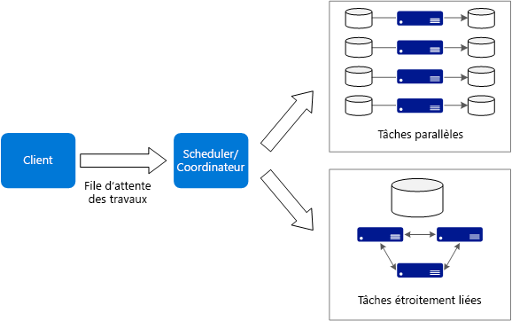
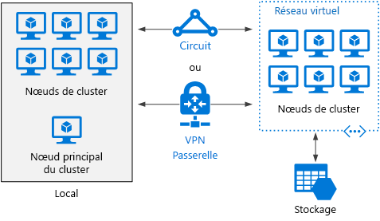

# Style d’architecture Big ComputeBig compute architecture style

Le terme *Big Compute* décrit les charges de travail à grande échelle qui nécessitent plusieurs centaines ou milliers de cœurs.The term *big compute* describes large-scale workloads that require a large number of cores, often numbering in the hundreds or thousands. Les scénarios d’utilisation possibles incluent notamment le rendu d’images, la dynamique des fluides, la modélisation des risques financiers, la prospection pétrolière, la conception de médicaments et l’analyse technique des contraintes.Scenarios include image rendering, fluid dynamics, financial risk modeling, oil exploration, drug design, and engineering stress analysis, among others.

Voici quelques caractéristiques types des applications Big Compute :Here are some typical characteristics of big compute applications:

- Le travail peut être fractionné en tâches discrètes qui sont exécutables sur plusieurs cœurs simultanément.The work can be split into discrete tasks, which can be run across many cores simultaneously.
- Chaque tâche est un processus fini.Each task is finite. Elle accepte une entrée, effectue un traitement spécifique, puis génère la sortie correspondante.It takes some input, does some processing, and produces output. L’ensemble de l’application s’exécute pendant une durée limitée (nombre de minutes ou de jours).The entire application runs for a finite amount of time (minutes to days). Un modèle courant consiste à approvisionner un grand nombre de cœurs en rafale, puis à revenir à zéro une fois l’application terminée.A common pattern is to provision a large number of cores in a burst, and then spin down to zero once the application completes.
- Il n’est pas nécessaire que l’application reste opérationnelle 24 h sur 24, 7 jours sur 7.The application does not need to stay up 24/7. Toutefois, le système doit gérer les défaillances de nœud ou les incidents d’application.However, the system must handle node failures or application crashes.
- Dans le cas de certaines applications, les tâches sont indépendantes et peuvent s’exécuter en parallèle.For some applications, tasks are independent and can run in parallel. Dans d’autres cas, les tâches sont étroitement liées, ce qui signifie qu’elles doivent interagir ou échanger des résultats intermédiaires.In other cases, tasks are tightly coupled, meaning they must interact or exchange intermediate results. Dans ce cas, envisagez d’utiliser des technologies de réseau à haut débit comme InfiniBand et l’Accès direct à la mémoire à distance (RDMA).In that case, consider using high-speed networking technologies such as InfiniBand and remote direct memory access (RDMA).
- Selon votre charge de travail, vous pouvez utiliser des tailles de machine virtuelle nécessitant beaucoup de ressources système (H16r, H16mr et A9).Depending on your workload, you might use compute-intensive VM sizes (H16r, H16mr, and A9).

## Quand utiliser cette architectureWhen to use this architecture

- Opérations nécessitant beaucoup de ressources système telles que les simulations et les calculs ultrarapides.Computationally intensive operations such as simulation and number crunching.
- Simulations utilisant de nombreuses ressources de calcul et devant être réparties entre les unités centrales de quelques dizaines à plusieurs milliers d’ordinateurs.Simulations that are computationally intensive and must be split across CPUs in multiple computers (10-1000s).
- Simulations qui nécessitent une quantité de mémoire trop importante pour un seul ordinateur et qui doivent donc être réparties entre plusieurs ordinateurs.Simulations that require too much memory for one computer, and must be split across multiple computers.
- Calculs de longue durée qui mettraient trop de temps à s’exécuter sur un seul ordinateur.Long-running computations that would take too long to complete on a single computer.
- Calculs plus modestes devant être exécutés plusieurs centaines ou milliers de fois, comme les méthodes de Monte Carlo.Smaller computations that must be run 100s or 1000s of times, such as Monte Carlo simulations.

## AvantagesBenefits

- Obtention de hautes performances avec un traitement de type « [massivement parallèle][embarrassingly-parallel] ».High performance with "[embarrassingly parallel][embarrassingly-parallel]" processing.
- Possibilité d’exploiter des centaines, voire des milliers de cœurs d’ordinateur pour résoudre plus rapidement les problèmes complexes.Can harness hundreds or thousands of computer cores to solve large problems faster.
- Accès à un matériel hautes performances spécialisé, avec des réseaux InfiniBand à haut débit dédiés.Access to specialized high-performance hardware, with dedicated high-speed InfiniBand networks.
- Possibilité d’approvisionnement et de suppression de machines virtuelles en fonction de la tâche à accomplir.You can provision VMs as needed to do work, and then tear them down.

## DéfisChallenges

- Gestion de l’infrastructure de machines virtuelles.Managing the VM infrastructure.
- Gestion du volume de calculs ultrarapidesManaging the volume of number crunching
- Approvisionnement de milliers de cœurs au moment opportun.Provisioning thousands of cores in a timely manner.
- Dans le cas des tâches étroitement liées, l’ajout de cœurs peut entraîner une baisse de rendement.For tightly coupled tasks, adding more cores can have diminishing returns. Vous devrez peut-être effectuer des essais pour déterminer le nombre de cœurs optimal.You may need to experiment to find the optimum number of cores.

## Big Compute à l’aide d’Azure BatchBig compute using Azure Batch

[Azure Batch][batch] est un service géré qui permet d’exécuter des applications de calcul haute performance (HPC) à grande échelle.[Azure Batch][batch] is a managed service for running large-scale high-performance computing (HPC) applications.

Avec Azure Batch, vous configurez un pool de machines virtuelles, puis vous chargez les applications et les fichiers de données.Using Azure Batch, you configure a VM pool, and upload the applications and data files. Le service Batch approvisionne ensuite les machines virtuelles, leur affecte des tâches, puis exécute ces dernières et surveille l’état d’avancement de l’exécution.Then the Batch service provisions the VMs, assign tasks to the VMs, runs the tasks, and monitors the progress. Batch peut également augmenter automatiquement la taille des machines virtuelles afin de traiter la charge de travail.Batch can automatically scale out the VMs in response to the workload. Enfin, Batch offre une fonctionnalité de planification des travaux.Batch also provides job scheduling.

## Exécution de Big Compute sur des machines virtuellesBig compute running on Virtual Machines

Vous pouvez utiliser [Microsoft HPC Pack][hpc-pack] pour administrer un cluster de machines virtuelles, puis planifier et surveiller des travaux HPC.You can use [Microsoft HPC Pack][hpc-pack] to administer a cluster of VMs, and schedule and monitor HPC jobs. Dans le cadre de cette approche, vous devez approvisionner et gérer les machines virtuelles et l’infrastructure réseau.With this approach, you must provision and manage the VMs and network infrastructure. Envisagez d’adopter cette approche si vous devez traiter des charges de travail HPC et que vous souhaitez en déplacer une partie ou la totalité vers Azure.Consider this approach if you have existing HPC workloads and want to move some or all it to Azure. Vous pouvez déplacer l’intégralité du cluster HPC vers Azure, ou conserver votre cluster HPC au niveau local, mais utiliser Azure pour sa capacité de débordement.You can move the entire HPC cluster to Azure, or keep your HPC cluster on-premises but use Azure for burst capacity. Pour plus d’informations, consultez l’article [Solutions Batch et HPC pour les charges de travail de calcul à grande échelle][batch-hpc-solutions].For more information, see [Batch and HPC solutions for large-scale computing workloads][batch-hpc-solutions].

### HPC Pack déployé sur AzureHPC Pack deployed to Azure

Dans ce scénario, le cluster HPC est entièrement créé dans Azure.In this scenario, the HPC cluster is created entirely within Azure.

Le nœud principal fournit les services de gestion et de planification des travaux au cluster.The head node provides management and job scheduling services to the cluster. Pour les tâches étroitement liées, utilisez un réseau RDMA garantissant des communications à très haut débit et à faible latence entre les machines virtuelles.For tightly coupled tasks, use an RDMA network that provides very high bandwidth, low latency communication between VMs. Pour plus d’informations, consultez l’article [Déployer un cluster HPC Pack 2016 dans Azure][deploy-hpc-azure].For more information see [Deploy an HPC Pack 2016 cluster in Azure][deploy-hpc-azure].

### Débordement d’un cluster HPC vers AzureBurst an HPC cluster to Azure

Dans ce scénario, une organisation exécute HPC Pack en local et utilise des machines virtuelles Azure pour leur capacité de débordement.In this scenario, an organization is running HPC Pack on-premises, and uses Azure VMs for burst capacity. Le nœud principal du cluster est local.The cluster head node is on-premises. ExpressRoute ou une passerelle VPN connectent le réseau local au réseau virtuel Azure.ExpressRoute or VPN Gateway connects the on-premises network to the Azure VNet.

<!-- links -->

[batch]: /azure/batch/
[batch-hpc-solutions]: /azure/batch/batch-hpc-solutions
[deploy-hpc-azure]: /azure/virtual-machines/windows/hpcpack-2016-cluster
[embarrassingly-parallel]: https://en.wikipedia.org/wiki/Embarrassingly_parallel
[hpc-pack]: https://technet.microsoft.com/library/cc514029
