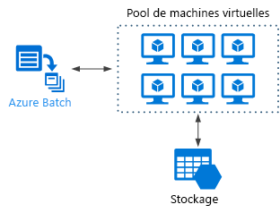

# Style d’architecture Big Compute

Le terme *Big Compute* décrit les charges de travail à grande échelle qui nécessitent plusieurs centaines ou milliers de cœurs. Les scénarios d’utilisation possibles incluent notamment le rendu d’images, la dynamique des fluides, la modélisation des risques financiers, la prospection pétrolière, la conception de médicaments et l’analyse technique des contraintes.

Voici quelques caractéristiques types des applications Big Compute :

- Le travail peut être fractionné en tâches discrètes qui sont exécutables sur plusieurs cœurs simultanément.
- Chaque tâche est un processus fini. Elle accepte une entrée, effectue un traitement spécifique, puis génère la sortie correspondante. L’ensemble de l’application s’exécute pendant une durée limitée (nombre de minutes ou de jours). Un modèle courant consiste à approvisionner un grand nombre de cœurs en rafale, puis à revenir à zéro une fois l’application terminée.
- Il n’est pas nécessaire que l’application reste opérationnelle 24 h sur 24, 7 jours sur 7. Toutefois, le système doit gérer les défaillances de nœud ou les incidents d’application.
- Dans le cas de certaines applications, les tâches sont indépendantes et peuvent s’exécuter en parallèle. Dans d’autres cas, les tâches sont étroitement liées, ce qui signifie qu’elles doivent interagir ou échanger des résultats intermédiaires. Dans ce cas, envisagez d’utiliser des technologies de réseau à haut débit comme InfiniBand et l’Accès direct à la mémoire à distance (RDMA).
- Selon votre charge de travail, vous pouvez utiliser des tailles de machine virtuelle nécessitant beaucoup de ressources système (H16r, H16mr et A9).

## Quand utiliser cette architecture

- Opérations nécessitant beaucoup de ressources système telles que les simulations et les calculs ultrarapides.
- Simulations utilisant de nombreuses ressources de calcul et devant être réparties entre les unités centrales de quelques dizaines à plusieurs milliers d’ordinateurs.
- Simulations qui nécessitent une quantité de mémoire trop importante pour un seul ordinateur et qui doivent donc être réparties entre plusieurs ordinateurs.
- Calculs de longue durée qui mettraient trop de temps à s’exécuter sur un seul ordinateur.
- Calculs plus modestes devant être exécutés plusieurs centaines ou milliers de fois, comme les méthodes de Monte Carlo.

## Avantages

- Obtention de hautes performances avec un traitement de type « [massivement parallèle][embarrassingly-parallel] ».
- Possibilité d’exploiter des centaines, voire des milliers de cœurs d’ordinateur pour résoudre plus rapidement les problèmes complexes.
- Accès à un matériel hautes performances spécialisé, avec des réseaux InfiniBand à haut débit dédiés.
- Possibilité d’approvisionnement et de suppression de machines virtuelles en fonction de la tâche à accomplir.

## Défis

- Gestion de l’infrastructure de machines virtuelles.
- Gestion du volume de calculs ultrarapides
- Approvisionnement de milliers de cœurs au moment opportun.
- Dans le cas des tâches étroitement liées, l’ajout de cœurs peut entraîner une baisse de rendement. Vous devrez peut-être effectuer des essais pour déterminer le nombre de cœurs optimal.

## Big Compute à l’aide d’Azure Batch

[Azure Batch][batch] est un service géré qui permet d’exécuter des applications de calcul haute performance (HPC) à grande échelle.

Avec Azure Batch, vous configurez un pool de machines virtuelles, puis vous chargez les applications et les fichiers de données. Le service Batch approvisionne ensuite les machines virtuelles, leur affecte des tâches, puis exécute ces dernières et surveille l’état d’avancement de l’exécution. Batch peut également augmenter automatiquement la taille des machines virtuelles afin de traiter la charge de travail. Enfin, Batch offre une fonctionnalité de planification des travaux.

## Exécution de Big Compute sur des machines virtuelles

Vous pouvez utiliser [Microsoft HPC Pack][hpc-pack] pour administrer un cluster de machines virtuelles, puis planifier et surveiller des travaux HPC. Dans le cadre de cette approche, vous devez approvisionner et gérer les machines virtuelles et l’infrastructure réseau. Envisagez d’adopter cette approche si vous devez traiter des charges de travail HPC et que vous souhaitez en déplacer une partie ou la totalité vers Azure. Vous pouvez déplacer l’intégralité du cluster HPC vers Azure, ou conserver votre cluster HPC au niveau local, mais utiliser Azure pour sa capacité de débordement. Pour plus d’informations, consultez l’article [Solutions Batch et HPC pour les charges de travail de calcul à grande échelle][batch-hpc-solutions].

### HPC Pack déployé sur Azure

Dans ce scénario, le cluster HPC est entièrement créé dans Azure.

Le nœud principal fournit les services de gestion et de planification des travaux au cluster. Pour les tâches étroitement liées, utilisez un réseau RDMA garantissant des communications à très haut débit et à faible latence entre les machines virtuelles. Pour plus d’informations, consultez l’article [Déployer un cluster HPC Pack 2016 dans Azure][deploy-hpc-azure].

### Débordement d’un cluster HPC vers Azure

Dans ce scénario, une organisation exécute HPC Pack en local et utilise des machines virtuelles Azure pour leur capacité de débordement. Le nœud principal du cluster est local. ExpressRoute ou une passerelle VPN connectent le réseau local au réseau virtuel Azure.

<!-- links -->

[batch]: /azure/batch/
[batch-hpc-solutions]: /azure/batch/batch-hpc-solutions
[deploy-hpc-azure]: /azure/virtual-machines/windows/hpcpack-2016-cluster
[embarrassingly-parallel]: https://en.wikipedia.org/wiki/Embarrassingly_parallel
[hpc-pack]: https://technet.microsoft.com/library/cc514029
