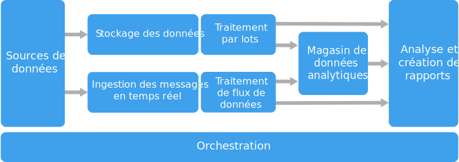

# Style d’architecture Big DataBig data architecture style

Une architecture Big Data est conçue pour gérer l’ingestion, le traitement et l’analyse de données trop volumineuses ou complexes pour les systèmes de base de données traditionnels.A big data architecture is designed to handle the ingestion, processing, and analysis of data that is too large or complex for traditional database systems.

Les solutions Big Data impliquent généralement un ou plusieurs des types de charges de travail suivants :Big data solutions typically involve one or more of the following types of workload:

- Traitement par lots des sources Big Data au repos.Batch processing of big data sources at rest.
- Traitement en temps réel des Big Data en mouvement.Real-time processing of big data in motion.
- Exploration interactive des Big Data.Interactive exploration of big data.
- Analyse prédictive et apprentissage machine.Predictive analytics and machine learning.

La plupart des architectures Big Data incluent tout ou partie des composants suivants :Most big data architectures include some or all of the following components:

- **Sources de données** : Toutes les solutions Big Data reposent sur une ou plusieurs sources de données.**Data sources**: All big data solutions start with one or more data sources. Voici quelques exemples :Examples include:

  - Magasins de données d’application, tels que des bases de données relationnelles.Application data stores, such as relational databases.
  - Fichiers statiques produits par les applications, tels que les fichiers journaux de serveur web.Static files produced by applications, such as web server log files.
  - Sources de données en temps réel, tels que les appareils IoT.Real-time data sources, such as IoT devices.

- **Stockage des données** : Les données destinées aux opérations de traitement par lots sont généralement stockées dans un magasin de fichiers distribués, qui peut contenir de vastes volumes de fichiers volumineux dans divers formats.**Data storage**: Data for batch processing operations is typically stored in a distributed file store that can hold high volumes of large files in various formats. Ce type de magasin est souvent appelé « *lac de données* ».This kind of store is often called a *data lake*. Les options pour l’implémentation de ce stockage incluent des conteneurs Azure Data Lake Store ou les conteneurs blob dans le stockage Azure.Options for implementing this storage include Azure Data Lake Store or blob containers in Azure Storage.

- **Traitement par lots** : Étant donné que les jeux de données sont trop lourds, une solution Big Data doit souvent traiter les fichiers de données à l’aide de traitements par lots à longue durée d’exécution pour filtrer, agréger et préparer les données en vue de l’analyse.**Batch processing**: Because the data sets are so large, often a big data solution must process data files using long-running batch jobs to filter, aggregate, and otherwise prepare the data for analysis. Généralement, ces travaux impliquent la lecture des fichiers source, leur traitement et l’écriture de la sortie dans de nouveaux fichiers.Usually these jobs involve reading source files, processing them, and writing the output to new files. Les options incluent l’exécution de travaux U-SQL dans Azure Data Lake Analytics, à l’aide de travaux personnalisés de mappage/réduction, Pig ou Hive dans un cluster HDInsight Hadoop ou à l’aide des programmes Java, Scala ou Python dans un cluster HDInsight Spark.Options include running U-SQL jobs in Azure Data Lake Analytics, using Hive, Pig, or custom Map/Reduce jobs in an HDInsight Hadoop cluster, or using Java, Scala, or Python programs in an HDInsight Spark cluster.

- **Ingestion de messages en temps réel** : Si la solution inclut des sources en temps réel, l’architecture doit inclure un moyen pour capturer et stocker des messages en temps réel pour le traitement de flux de données.**Real-time message ingestion**: If the solution includes real-time sources, the architecture must include a way to capture and store real-time messages for stream processing. Il peut s’agir d’un simple magasin de données, où les messages entrants sont déposés dans un dossier en vue du traitement.This might be a simple data store, where incoming messages are dropped into a folder for processing. Toutefois, de nombreuses solutions besoin d’un magasin d’ingestion des messages qui agit comme une mémoire tampon pour les messages et qui prend en charge un traitement de montée en puissance, une remise fiable et d’autres sémantiques de files d’attente de message.However, many solutions need a message ingestion store to act as a buffer for messages, and to support scale-out processing, reliable delivery, and other message queuing semantics. Les options incluent Azure Event Hubs, Azure IoT Hubs et Kafka.Options include Azure Event Hubs, Azure IoT Hubs, and Kafka.

- **Traitement de flux** : Après avoir capturé les messages en temps réel, la solution doit les traiter en filtrant, en agrégeant et, plus généralement, en préparant les données pour l’analyse.**Stream processing**: After capturing real-time messages, the solution must process them by filtering, aggregating, and otherwise preparing the data for analysis. Les données de flux traitées sont ensuite écrites dans un récepteur de sortie.The processed stream data is then written to an output sink. Azure Stream Analytics fournit un service de traitement de flux managé reposant sur des requêtes SQL à l’exécution permanente qui fonctionnent sur les flux de données indépendants.Azure Stream Analytics provides a managed stream processing service based on perpetually running SQL queries that operate on unbounded streams. Vous pouvez également utiliser des technologies de flux Apache open source comme Storm et Spark dans un cluster HDInsight.You can also use open source Apache streaming technologies like Storm and Spark Streaming in an HDInsight cluster.

- **Magasin de données analytiques** : De nombreuses solutions Big Data préparent les données pour l’analyse, puis fournissent les données traitées dans un format structuré qui peut être interrogé à l’aide des outils d’analyse.**Analytical data store**: Many big data solutions prepare data for analysis and then serve the processed data in a structured format that can be queried using analytical tools. Le magasin de données analytique utilisé pour répondre à ces requêtes peut être un entrepôt de données relationnelles de type Kimball, comme indiqué dans les solutions décisionnelles (BI) plus traditionnelles.The analytical data store used to serve these queries can be a Kimball-style relational data warehouse, as seen in most traditional business intelligence (BI) solutions. Les données peuvent également être présentées via une technologie NoSQL à faible latence, telle que HBase, ou via une base de données Hive interactif qui fournit une abstraction de métadonnées sur les fichiers de données dans le magasin de données distribuées.Alternatively, the data could be presented through a low-latency NoSQL technology such as HBase, or an interactive Hive database that provides a metadata abstraction over data files in the distributed data store. Azure SQL Data Warehouse fournit un service managé pour l’entreposage cloud des données à grande échelle.Azure SQL Data Warehouse provides a managed service for large-scale, cloud-based data warehousing. HDInsight prend en charge les formats Hive interactif, HBase et Spark SQL, qui peuvent également servir à préparer les données en vue de l’analyse.HDInsight supports Interactive Hive, HBase, and Spark SQL, which can also be used to serve data for analysis.

- **Analyse et rapports** : La plupart des solutions Big Data ont pour but de fournir des informations sur les données par le biais de l’analyse et des rapports.**Analysis and reporting**: The goal of most big data solutions is to provide insights into the data through analysis and reporting. Pour permettre aux utilisateurs d’analyser les données, l’architecture peut inclure une couche de modélisation des données, comme un cube OLAP multidimensionnel ou un modèle de données tabulaire dans Azure Analysis Services.To empower users to analyze the data, the architecture may include a data modeling layer, such as a multidimensional OLAP cube or tabular data model in Azure Analysis Services. Elle peut également prendre en charge le décisionnel libre-service, en utilisant les technologies de modélisation et de visualisation de Microsoft Power BI ou Microsoft Excel.It might also support self-service BI, using the modeling and visualization technologies in Microsoft Power BI or Microsoft Excel. L’analyse et les rapports peuvent aussi prendre la forme d’une exploration interactive des données par les scientifiques de données ou les analystes de données.Analysis and reporting can also take the form of interactive data exploration by data scientists or data analysts. Pour ces scénarios, plusieurs services Azure prennent en charge les blocs-notes analytiques, tels que Jupyter, ce qui permet à ces utilisateurs de tirer parti de leurs connaissances avec Python ou R. Pour l’exploration de données à grande échelle, vous pouvez utiliser Microsoft R Server seul ou avec Spark.For these scenarios, many Azure services support analytical notebooks, such as Jupyter, enabling these users to leverage their existing skills with Python or R. For large-scale data exploration, you can use Microsoft R Server, either standalone or with Spark.

- **Orchestration** : La plupart des solutions Big Data consistent en des opérations de traitement de données répétées, encapsulées dans des workflows, qui transforment les données source, déplacent les données entre plusieurs sources et récepteurs, chargent les données traitées dans un magasin de données analytique, ou envoient les résultats directement à un rapport ou à un tableau de bord.**Orchestration**: Most big data solutions consist of repeated data processing operations, encapsulated in workflows, that transform source data, move data between multiple sources and sinks, load the processed data into an analytical data store, or push the results straight to a report or dashboard. Pour automatiser ces workflows, vous pouvez utiliser une technologie d’orchestration telle qu’Azure Data Factory ou Apache Oozie avec Sqoop.To automate these workflows, you can use an orchestration technology such Azure Data Factory or Apache Oozie and Sqoop.

Azure inclut de nombreux services qui peuvent être utilisés dans une architecture Big Data.Azure includes many services that can be used in a big data architecture. Il existe deux grandes catégories :They fall roughly into two categories:

- Services managés, y compris Azure Data Lake Store, Azure Data Lake Analytics, Azure Data Warehouse, Azure Stream Analytics, Azure Event Hub, Azure IoT Hub et Azure Data Factory.Managed services, including Azure Data Lake Store, Azure Data Lake Analytics, Azure Data Warehouse, Azure Stream Analytics, Azure Event Hub, Azure IoT Hub, and Azure Data Factory.
- Technologies open source basées sur une plateforme Apache Hadoop, y compris HDFS, HBase, Hive, Pig, Spark, Storm, Oozie, Sqoop et Kafka.Open source technologies based on the Apache Hadoop platform, including HDFS, HBase, Hive, Pig, Spark, Storm, Oozie, Sqoop, and Kafka. Ces technologies sont disponibles sur Azure dans le service Azure HDInsight.These technologies are available on Azure in the Azure HDInsight service.

Ces options ne sont pas mutuellement exclusives, et de nombreuses solutions combinent les technologies open source avec les services Azure.These options are not mutually exclusive, and many solutions combine open source technologies with Azure services.

## Quand utiliser cette architectureWhen to use this architecture

Envisagez ce style d’architecture pour répondre aux besoins suivants :Consider this architecture style when you need to:

- Stocker et traiter des données dans des volumes trop vastes pour une base de données traditionnelle.Store and process data in volumes too large for a traditional database.
- Transformer des données non structurées en vue d’une analyse et de la création de rapports.Transform unstructured data for analysis and reporting.
- Capturer, traiter et analyser des flux de données indépendants en temps réel ou avec une faible latence.Capture, process, and analyze unbounded streams of data in real time, or with low latency.
- Utilisez Azure Machine Learning ou Microsoft Cognitive Services.Use Azure Machine Learning or Microsoft Cognitive Services.

## AvantagesBenefits

- **Choix de technologie**.**Technology choices**. Vous pouvez combiner des services managés Azure et des technologies Apache dans des clusters HDInsight afin de tirer parti des compétences ou des investissements technologiques existants.You can mix and match Azure managed services and Apache technologies in HDInsight clusters, to capitalize on existing skills or technology investments.
- **Performances via le parallélisme**.**Performance through parallelism**. Les solutions Big Data tirent parti du parallélisme, ce qui en fait des solutions hautes performances qui s’adaptent à des volumes importants de données.Big data solutions take advantage of parallelism, enabling high-performance solutions that scale to large volumes of data.
- **Mise à l’échelle élastique**.**Elastic scale**. Tous les composants de l’architecture Big Data prennent en charge l’approvisionnement de montée en puissance, afin que vous puissiez ajuster votre solution aux petites ou aux grandes charges de travail et ne payer que pour les ressources que vous utilisez.All of the components in the big data architecture support scale-out provisioning, so that you can adjust your solution to small or large workloads, and pay only for the resources that you use.
- **Interopérabilité avec les solutions existantes**.**Interoperability with existing solutions**. Les composants de l’architecture Big Data sont également utilisés pour les solutions de décisionnel d’entreprise et de traitement IoT, ce qui vous permet de créer une solution intégrée pour toutes les charges de données.The components of the big data architecture are also used for IoT processing and enterprise BI solutions, enabling you to create an integrated solution across data workloads.

## DéfisChallenges

- **Complexité** :**Complexity**. Les solutions Big Data peuvent être extrêmement complexes, avec nombreux composants pour gérer l’ingestion de données à partir de plusieurs sources de données.Big data solutions can be extremely complex, with numerous components to handle data ingestion from multiple data sources. Il peut être difficile de générer, tester et dépanner des processus Big Data.It can be challenging to build, test, and troubleshoot big data processes. En outre, pour optimiser les performances, il faut parfois utiliser de nombreux paramètres de configuration sur plusieurs systèmes.Moreover, there may be a large number of configuration settings across multiple systems that must be used in order to optimize performance.
- **Compétences**.**Skillset**. De nombreuses technologies Big Data sont hautement spécialisées et utilisent des infrastructures et des langues assez rares pour des architectures d’applications plus générales.Many big data technologies are highly specialized, and use frameworks and languages that are not typical of more general application architectures. En revanche, les technologies Big Data font évoluer de nouvelles API qui s’appuient sur plusieurs langages établis.On the other hand, big data technologies are evolving new APIs that build on more established languages. Par exemple, le langage U-SQL dans Azure Data Lake Analytics repose sur une combinaison de Transact-SQL et C#.For example, the U-SQL language in Azure Data Lake Analytics is based on a combination of Transact-SQL and C#. De même, les API basées sur SQL sont disponibles pour Hive, HBase et Spark.Similarly, SQL-based APIs are available for Hive, HBase, and Spark.
- **Maturité de la technologie**.**Technology maturity**. La plupart des technologies utilisées en Big Data sont en pleine évolution.Many of the technologies used in big data are evolving. Tandis que les technologies Hadoop de base comme Hive et Pig se sont stabilisées, de nouvelles technologies, telles que Spark, introduisent des modifications et des améliorations importantes à chaque nouvelle version.While core Hadoop technologies such as Hive and Pig have stabilized, emerging technologies such as Spark introduce extensive changes and enhancements with each new release. Les services managés tels qu’Azure Data Lake Analytics et Azure Data Factory sont relativement récents par rapport aux autres services Azure et évolueront probablement au fil du temps.Managed services such as Azure Data Lake Analytics and Azure Data Factory are relatively young, compared with other Azure services, and will likely evolve over time.
- **Sécurité**.**Security**. Les solutions Big Data s’appuient généralement sur le stockage de toutes les données statiques dans un lac de données centralisé.Big data solutions usually rely on storing all static data in a centralized data lake. La sécurisation de l’accès à ces données peut être difficile, en particulier lorsque les données doivent être ingérées et consommées par plusieurs applications et plateformes.Securing access to this data can be challenging, especially when the data must be ingested and consumed by multiple applications and platforms.

## Bonnes pratiquesBest practices

- **Tirer parti du parallélisme**.**Leverage parallelism**. La plupart des technologies de traitement Big Data distribuent la charge sur plusieurs unités de traitement.Most big data processing technologies distribute the workload across multiple processing units. Cela nécessite la création et le stockage de fichiers de données statiques dans un format fractionnable.This requires that static data files are created and stored in a splittable format. Les systèmes de fichiers distribués tels que HDFS permettent d’optimiser les performances de lecture et d’écriture. Le traitement réel est effectué par plusieurs nœuds de cluster en parallèle, ce qui réduit globalement les temps de travail.Distributed file systems such as HDFS can optimize read and write performance, and the actual processing is performed by multiple cluster nodes in parallel, which reduces overall job times.

- **Partitionner les données**.**Partition data**. En général, le traitement par lots se produit selon une planification périodique &mdash;par exemple, selon une fréquence hebdomadaire ou mensuelle.Batch processing usually happens on a recurring schedule &mdash; for example, weekly or monthly. Partitionnez les fichiers de données et les structures de données telles que les tables en fonction de périodes qui correspondent à la planification du traitement.Partition data files, and data structures such as tables, based on temporal periods that match the processing schedule. Cela simplifie l’ingestion de données et la planification des travaux, et facilite la résolution des problèmes.That simplifies data ingestion and job scheduling, and makes it easier to troubleshoot failures. En outre, le partitionnement des tables utilisées dans les requêtes Hive, U-SQL ou SQL peut améliorer considérablement les performances des requêtes.Also, partitioning tables that are used in Hive, U-SQL, or SQL queries can significantly improve query performance.

- **Appliquer une sémantique de schéma à la lecture**.**Apply schema-on-read semantics**. Un lac de données permet de combiner le stockage de fichiers dans plusieurs formats, qu’ils soient structurés, semi-structurés ou non structurés.Using a data lake lets you to combine storage for files in multiple formats, whether structured, semi-structured, or unstructured. Utilisez une sémantique de *schéma à la lecture*, qui projette un schéma sur les données lors de leur traitement, et non lors du stockage.Use *schema-on-read* semantics, which project a schema onto the data when the data is processing, not when the data is stored. Cela confère une grande souplesse à la solution et empêche les goulots d’étranglement pendant l’ingestion des données, causés par la validation des données et la vérification du type.This builds flexibility into the solution, and prevents bottlenecks during data ingestion caused by data validation and type checking.

- **Traiter les données sur place**.**Process data in-place**. Les solutions BI traditionnelles utilisent souvent un processus ETL (extraction, transformation et chargement) pour déplacer des données dans un entrepôt de données.Traditional BI solutions often use an extract, transform, and load (ETL) process to move data into a data warehouse. Avec de plus grands volumes de données et une plus grande variété de formats, les solutions Big Data utilisent généralement des variantes de processus ETL, comme le processus TEL (transformation, extraction et chargement).With larger volumes data, and a greater variety of formats, big data solutions generally use variations of ETL, such as transform, extract, and load (TEL). Avec cette approche, les données sont traitées dans le magasin de données distribué, en leur donnant la structure requise avant de déplacer les données transformées dans un magasin de données analytique.With this approach, the data is processed within the distributed data store, transforming it to the required structure, before moving the transformed data into an analytical data store.

- **Équilibrer les coûts d’utilisation et de temps**.**Balance utilization and time costs**. Pour les travaux de traitement par lots, il est important de prendre en compte deux facteurs : le coût unitaire de nœuds de calcul et le coût par minute de l’utilisation de ces nœuds pour effectuer le travail.For batch processing jobs, it's important to consider two factors: The per-unit cost of the compute nodes, and the per-minute cost of using those nodes to complete the job. Par exemple, un programme de traitement par lots peut prendre les huit heures avec quatre nœuds de cluster.For example, a batch job may take eight hours with four cluster nodes. Toutefois, il peut arriver que le programme utilise les quatre nœuds uniquement pendant les deux premières heures et, par la suite, qu’il n’ait besoin que de deux nœuds.However, it might turn out that the job uses all four nodes only during the first two hours, and after that, only two nodes are required. Dans ce cas, exécuter l’intégralité du programme sur deux nœuds augmenterait la durée totale du travail, sans pour autant la doubler. Le coût total serait donc inférieur.In that case, running the entire job on two nodes would increase the total job time, but would not double it, so the total cost would be less. Dans certains scénarios métier, une durée de traitement plus longue peut être préférable au coût plus élevé lié à l’utilisation de ressources de cluster sous-exploitées.In some business scenarios, a longer processing time may be preferable to the higher cost of using under-utilized cluster resources.

- **Séparer les ressources de cluster**.**Separate cluster resources**. Lorsque vous déployez des clusters HDInsight, vous obtenez normalement de meilleures performances en approvisionnant des ressources de cluster distinctes pour chaque type de charge de travail.When deploying HDInsight clusters, you will normally achieve better performance by provisioning separate cluster resources for each type of workload. Par exemple, bien que les clusters Spark incluent Hive, si vous avez besoin d’effectuer un traitement intensif avec Hive et Spark, vous devez envisager de déployer des clusters dédiés distincts pour Spark et Hadoop.For example, although Spark clusters include Hive, if you need to perform extensive processing with both Hive and Spark, you should consider deploying separate dedicated Spark and Hadoop clusters. De même, si vous utilisez HBase et Storm pour le traitement de flux de données à faible latence et Hive pour le traitement par lots, envisagez des clusters distincts pour Storm, HBase et Hadoop.Similarly, if you are using HBase and Storm for low latency stream processing and Hive for batch processing, consider separate clusters for Storm, HBase, and Hadoop.

- **Orchestrer l’ingestion de données**.**Orchestrate data ingestion**. Dans certains cas, les applications métier existantes peuvent écrire des fichiers de données destinés à un traitement par lots directement dans les conteneurs d’objets blob de stockage Azure, où ils peuvent être consommés par HDInsight ou Azure Data Lake Analytics.In some cases, existing business applications may write data files for batch processing directly into Azure storage blob containers, where they can be consumed by HDInsight or Azure Data Lake Analytics. Toutefois, vous devez souvent orchestrer l’ingestion de données dans le lac de données à partir de sources de données externes ou locales.However, you will often need to orchestrate the ingestion of data from on-premises or external data sources into the data lake. Utilisez un pipeline ou un workflow d’orchestration, tels que ceux pris en charge par Azure Data Factory ou Oozie, pour effectuer cette opération de manière prévisible et facile à gérer de manière centralisée.Use an orchestration workflow or pipeline, such as those supported by Azure Data Factory or Oozie, to achieve this in a predictable and centrally manageable fashion.

- **Nettoyer les données sensibles tôt**.**Scrub sensitive data early**. Le workflow d’ingestion de données doit nettoyer les données sensibles tôt dans le processus pour éviter de les stocker dans le lac de données.The data ingestion workflow should scrub sensitive data early in the process, to avoid storing it in the data lake.

## Architecture IoTIoT architecture

L’Internet des objets (IoT) est un sous-ensemble spécialisé des solutions big data.Internet of Things (IoT) is a specialized subset of big data solutions. Le diagramme suivant présente une architecture logique possible pour IoT.The following diagram shows a possible logical architecture for IoT. Le diagramme met en avant les composants de diffusion d’événements de l’architecture.The diagram emphasizes the event-streaming components of the architecture.

La **passerelle cloud** ingère les événements d’appareils à la limite du cloud en utilisant un système de messagerie fiable et à faible latence.The **cloud gateway** ingests device events at the cloud boundary, using a reliable, low latency messaging system.

Les appareils peuvent envoyer les événements directement à la passerelle cloud ou via une **passerelle de champ**.Devices might send events directly to the cloud gateway, or through a **field gateway**. Une passerelle de champ est un appareil ou un logiciel spécialisé, généralement colocalisée avec les appareils, qui reçoit les événements et les transfère à la passerelle cloud.A field gateway is a specialized device or software, usually colocated with the devices, that receives events and forwards them to the cloud gateway. La passerelle de champ peut aussi prétraiter les événements d’appareils bruts, remplissant des fonctions de filtrage, d’agrégation ou de transformation de protocole.The field gateway might also preprocess the raw device events, performing functions such as filtering, aggregation, or protocol transformation.

Après ingestion, les événements transitent par un ou plusieurs **processeurs de flux** qui peuvent acheminer les données (par exemple, vers le stockage) ou procéder à l’analytique et autres traitements.After ingestion, events go through one or more **stream processors** that can route the data (for example, to storage) or perform analytics and other processing.

Voici quelques types de traitement courants.The following are some common types of processing. (Cette liste n’est certainement pas exhaustive.)(This list is certainly not exhaustive.)

- Écriture de données d’événement dans un stockage froid pour archivage ou traitement analytique par lots.Writing event data to cold storage, for archiving or batch analytics.

- Analytique de séquence à chaud (« hot path analytics »), avec une analyse du flux d’événements en (quasi) temps réel, pour détecter les anomalies, reconnaître les modèles dans des fenêtres de temps glissantes ou déclencher des alertes quand une condition spécifique est rencontrée dans le flux.Hot path analytics, analyzing the event stream in (near) real time, to detect anomalies, recognize patterns over rolling time windows, or trigger alerts when a specific condition occurs in the stream.

- Gestion de types de messages d’appareils non liés à la télémétrie, tels que les notifications et les alarmes.Handling special types of non-telemetry messages from devices, such as notifications and alarms.

- Apprentissage automatique.Machine learning.

Les cadres gris représentent les composants d’un système IoT qui ne sont pas directement liés à la diffusion d’événements, mais qui sont inclus ici par souci d’exhaustivité.The boxes that are shaded gray show components of an IoT system that are not directly related to event streaming, but are included here for completeness.

- Le **registre d’appareils** est une base de données qui recense les appareils provisionnés, avec notamment leur ID et les métadonnées associées usuelles, telles que l’emplacement.The **device registry** is a database of the provisioned devices, including the device IDs and usually device metadata, such as location.

- L’**API de provisionnement** est une interface externe commune pour provisionner et inscrire de nouveaux appareils.The **provisioning API** is a common external interface for provisioning and registering new devices.

- Certaines solutions IoT autorisent l’envoi de **messages de commande et de contrôle** aux appareils.Some IoT solutions allow **command and control messages** to be sent to devices.

> Cette section a fourni une vue d’ensemble globale d’IoT et bon nombre de subtilités et d’écueils sont à prendre en considération.This section has presented a very high-level view of IoT, and there are many subtleties and challenges to consider. Pour obtenir une description et une présentation plus détaillées d’une architecture de référence, consultez [Microsoft Azure IoT Reference Architecture][iot-ref-arch] (PDF téléchargeable).For a more detailed reference architecture and discussion, see the [Microsoft Azure IoT Reference Architecture][iot-ref-arch] (PDF download).

## Étapes suivantesNext steps

- En savoir plus sur les [architectures big data](../../data-guide/big-data/index.md).Learn more about [big data architectures](../../data-guide/big-data/index.md).

 <!-- links -->

[iot-ref-arch]: https://azure.microsoft.com/updates/microsoft-azure-iot-reference-architecture-available/
