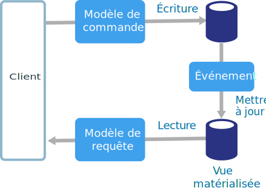
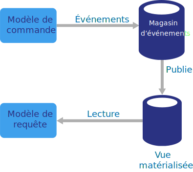
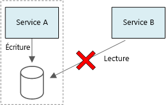

# Style d’architecture CQRS

Le modèle CQRS (Command and Query Responsibility Segregation, répartition des responsabilités entre les commandes et les requêtes) est un style d’architecture qui sépare les opérations de lecture des opérations d’écriture. 

Dans les architectures traditionnelles, le même modèle de données est utilisé pour interroger et mettre à jour une base de données. Cette approche se révèle simple et efficace pour les opérations CRUD de base. Toutefois, dans le cas des applications plus complexes, elle peut devenir plus difficile à gérer. Par exemple, côté lecture, l’application peut exécuter de nombreuses requêtes, renvoyant des objets de transfert de données de différentes formes. Le mappage d’objets peut alors devenir compliqué. Côté écriture, le modèle peut implémenter une logique métier et de validation complexe. Par conséquent, vous risquez d’obtenir un modèle excessivement complexe et surchargé.

Un autre problème potentiel réside dans le fait que les charges de travail de lecture et d’écriture sont souvent asymétriques et présentent des exigences de performances et de mise à l’échelle très différentes. 

CQRS résout ces problèmes en séparant les lectures des écritures dans des modèles distincts et utilise des **commandes** pour mettre à jour les données, et des **requêtes** pour lire les données.

- Les commandes doivent reposer sur les tâches au lieu d’être centrées sur les données (par exemple, « Réserver une chambre d’hôtel » plutôt que « Définir l’état de réservation sur Réservé »). Les commandes peuvent être placées dans une file d’attente pour faire l’objet d’un traitement asynchrone, au lieu d’être traitées de manière synchrone.

- Les requêtes ne modifient jamais la base de données. Une requête renvoie un objet de transfert de données qui n’encapsule aucune connaissance du domaine.

Pour renforcer l’isolation, vous pouvez séparer physiquement les données de lecture des données d’écriture. Dans ce cas, la base de données de lecture peut utiliser son propre schéma de données optimisé pour les requêtes. Par exemple, elle peut stocker une [vue matérialisée][materialized-view] des données, afin d’éviter des jointures ou des mappages O/RM complexes. Elle peut même utiliser un autre type de magasin de données. Par exemple, il est possible que la base de données d’écriture soit relationnelle, et que la base de données de lecture soit une base de données de documents.

Si vous utilisez des bases de données de lecture et d’écriture distinctes, vous devez les garder synchronisées. En règle générale, vous obtenez ce résultat en faisant en sorte que le modèle d’écriture publie un événement chaque fois qu’il met à jour la base de données. La mise à jour de la base de données et la publication de l’événement doivent s’effectuer dans une transaction unique. 

Certaines implémentations de l’architecture CQRS utilisent le [modèle d’approvisionnement en événements][event-sourcing] (ou Event Sourcing). Avec ce modèle, l’état de l’application est stocké sous la forme d’une séquence d’événements. Chaque événement représente un ensemble de modifications des données. L’état actuel est construit par la relecture des événements. Dans un contexte CQRS, l’un des avantages de l’approvisionnement en événements réside dans le fait que les mêmes événements peuvent être utilisés pour informer les autres composants &mdash; en particulier, pour avertir le modèle de lecture. Le modèle de lecture utilise les événements pour créer une capture instantanée de l’état actuel, ce qui se révèle plus efficace pour les requêtes. Toutefois, l’approvisionnement en événements complique la conception.

## Quand utiliser cette architecture

Envisagez d’utiliser CQRS pour les domaines collaboratifs dans lesquels de nombreux utilisateurs accèdent aux mêmes données, en particulier lorsque les charges de travail de lecture et d’écriture sont asymétriques.

CQRS n’est pas une architecture de premier niveau qui s’applique à la totalité d’un système. Appliquez uniquement CQRS aux sous-systèmes dans lesquels la séparation des lectures et des écritures présente un intérêt manifeste. Dans le cas contraire, vous ajouterez de la complexité sans recevoir aucun avantage en contrepartie.

## Avantages

- **Mise à l’échelle de manière indépendante**. CQRS permet de mettre à l’échelle les charges de travail de lecture et d’écriture indépendamment, et peut contribuer à réduire les contentions de verrouillage.
- **Schémas de données optimisés**.  Le côté lecture peut utiliser un schéma optimisé pour les requêtes, tandis que le côté écriture utilise un schéma optimisé pour les mises à jour.  
- **Sécurité**. Il est plus facile de s’assurer que seules les entités de domaine adéquates effectuent des écritures sur les données.
- **Séparation des problèmes**. Le fait de séparer le côté lecture du côté écriture peut produire des modèles plus faciles à gérer et plus flexibles. La plus grande partie de la logique métier complexe est placée dans le modèle d’écriture. Le modèle de lecture peut être relativement simple.
- **Requêtes simplifiées**. En stockant une vue matérialisée dans la base de données de lecture, l’application peut éviter les jointures complexes lors de l’interrogation.

## Défis

- **Complexité**. Le principe de base de CQRS est simple. Toutefois, cette architecture peut compliquer la conception d’applications, notamment si elle inclut le modèle d’approvisionnement en événements.

- **Messagerie**. Bien que CQRS ne nécessite aucune messagerie, il est fréquent d’utiliser une messagerie pour traiter les commandes et pour publier les événements de mise à jour. Dans ce cas, l’application doit gérer les échecs de messages ou les messages en double. 

- **Cohérence finale**. Si vous séparez les bases de données de lecture et d’écriture, les données de lecture peuvent être périmées. 

## Meilleures pratiques

- Pour plus d’informations sur l’implémentation de CQRS, consultez l’article [CQRS Pattern (Modèle CQRS)][cqrs-pattern].

- Envisagez d’utiliser le modèle [Approvisionnement en événements][event-sourcing] pour éviter les conflits de mise à jour.

- Pensez à utiliser le [modèle de vue matérialisée][materialized-view] pour le modèle de lecture afin d’optimiser le schéma pour les requêtes.

## CQRS dans les microservices

CQRS peut se révéler particulièrement utile dans une [architecture de microservices][microservices]. L’un des principes des microservices est qu’un service ne peut pas accéder directement au magasin de données d’un autre service.

Dans le diagramme ci-après, le Service A écrit dans un magasin de données, et le Service B conserve une vue matérialisée des données. Le Service A publie un événement chaque fois qu’il écrit dans le magasin de données. Le Service B s’abonne à l’événement.

<!-- links -->

[cqrs-pattern]: ../../patterns/cqrs.md
[event-sourcing]: ../../patterns/event-sourcing.md
[materialized-view]: ../../patterns/materialized-view.md
[microservices]: ./microservices.md
