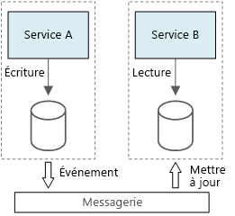

# Style d’architecture CQRSCQRS architecture style

Le modèle CQRS (Command and Query Responsibility Segregation, répartition des responsabilités entre les commandes et les requêtes) est un style d’architecture qui sépare les opérations de lecture des opérations d’écriture.Command and Query Responsibility Segregation (CQRS) is an architecture style that separates read operations from write operations. 

Dans les architectures traditionnelles, le même modèle de données est utilisé pour interroger et mettre à jour une base de données.In traditional architectures, the same data model is used to query and update a database. Cette approche se révèle simple et efficace pour les opérations CRUD de base.That's simple and works well for basic CRUD operations. Toutefois, dans le cas des applications plus complexes, elle peut devenir plus difficile à gérer.In more complex applications, however, this approach can become unwieldy. Par exemple, côté lecture, l’application peut exécuter de nombreuses requêtes, renvoyant des objets de transfert de données de différentes formes.For example, on the read side, the application may perform many different queries, returning data transfer objects (DTOs) with different shapes. Le mappage d’objets peut alors devenir compliqué.Object mapping can become complicated. Côté écriture, le modèle peut implémenter une logique métier et de validation complexe.On the write side, the model may implement complex validation and business logic. Par conséquent, vous risquez d’obtenir un modèle excessivement complexe et surchargé.As a result, you can end up with an overly complex model that does too much.

Un autre problème potentiel réside dans le fait que les charges de travail de lecture et d’écriture sont souvent asymétriques et présentent des exigences de performances et de mise à l’échelle très différentes.Another potential problem is that read and write workloads are often asymmetrical, with very different performance and scale requirements. 

CQRS résout ces problèmes en séparant les lectures des écritures dans des modèles distincts et utilise des **commandes** pour mettre à jour les données, et des **requêtes** pour lire les données.CQRS addresses these problems by separating reads and writes into separate models, using **commands** to update data, and **queries** to read data.

- Les commandes doivent reposer sur les tâches au lieu d’être centrées sur les donnéesCommands should be task based, rather than data centric. (par exemple, « Réserver une chambre d’hôtel » plutôt que « Définir l’état de réservation sur Réservé »). Les commandes peuvent être placées dans une file d’attente pour faire l’objet d’un traitement asynchrone, au lieu d’être traitées de manière synchrone.("Book hotel room," not "set ReservationStatus to Reserved.") Commands may be placed on a queue for asynchronous processing, rather than being processed synchronously.

- Les requêtes ne modifient jamais la base de données.Queries never modify the database. Une requête renvoie un objet de transfert de données qui n’encapsule aucune connaissance du domaine.A query returns a DTO that does not encapsulate any domain knowledge.

Pour renforcer l’isolation, vous pouvez séparer physiquement les données de lecture des données d’écriture.For greater isolation, you can physically separate the read data from the write data. Dans ce cas, la base de données de lecture peut utiliser son propre schéma de données optimisé pour les requêtes.In that case, the read database can use its own data schema that is optimized for queries. Par exemple, elle peut stocker une [vue matérialisée][materialized-view] des données, afin d’éviter des jointures ou des mappages O/RM complexes.For example, it can store a [materialized view][materialized-view] of the data, in order to avoid complex joins or complex O/RM mappings. Elle peut même utiliser un autre type de magasin de données.It might even use a different type of data store. Par exemple, il est possible que la base de données d’écriture soit relationnelle, et que la base de données de lecture soit une base de données de documents.For example, the write database might be relational, while the read database is a document database.

Si vous utilisez des bases de données de lecture et d’écriture distinctes, vous devez les garder synchronisées. En règle générale, vous obtenez ce résultat en faisant en sorte que le modèle d’écriture publie un événement chaque fois qu’il met à jour la base de données.If separate read and write databases are used, they must be kept in sync. Typically this is accomplished by  having the write model publish an event whenever it updates the database. La mise à jour de la base de données et la publication de l’événement doivent s’effectuer dans une transaction unique.Updating the database and publishing the event must occur in a single transaction. 

Certaines implémentations de l’architecture CQRS utilisent le [modèle d’approvisionnement en événements][event-sourcing] (ou Event Sourcing).Some implementations of CQRS use the [Event Sourcing pattern][event-sourcing]. Avec ce modèle, l’état de l’application est stocké sous la forme d’une séquence d’événements.With this pattern, application state is stored as a sequence of events. Chaque événement représente un ensemble de modifications des données.Each event represents a set of changes to the data. L’état actuel est construit par la relecture des événements.The current state is constructed by replaying the events. Dans un contexte CQRS, l’un des avantages de l’approvisionnement en événements réside dans le fait que les mêmes événements peuvent être utilisés pour informer les autres composants &mdash; en particulier, pour avertir le modèle de lecture.In a CQRS context, one benefit of Event Sourcing is that the same events can be used to notify other components &mdash; in particular, to notify the read model. Le modèle de lecture utilise les événements pour créer une capture instantanée de l’état actuel, ce qui se révèle plus efficace pour les requêtes.The read model uses the events to create a snapshot of the current state, which is more efficient for queries. Toutefois, l’approvisionnement en événements complique la conception.However, Event Sourcing adds complexity to the design.

## Quand utiliser cette architectureWhen to use this architecture

Envisagez d’utiliser CQRS pour les domaines collaboratifs dans lesquels de nombreux utilisateurs accèdent aux mêmes données, en particulier lorsque les charges de travail de lecture et d’écriture sont asymétriques.Consider CQRS for collaborative domains where many users access the same data, especially when the read and write workloads are asymmetrical.

CQRS n’est pas une architecture de premier niveau qui s’applique à la totalité d’un système.CQRS is not a top-level architecture that applies to an entire system. Appliquez uniquement CQRS aux sous-systèmes dans lesquels la séparation des lectures et des écritures présente un intérêt manifeste.Apply CQRS only to those subsystems where there is clear value in separating reads and writes. Dans le cas contraire, vous ajouterez de la complexité sans recevoir aucun avantage en contrepartie.Otherwise, you are creating additional complexity for no benefit.

## AvantagesBenefits

- **Mise à l’échelle de manière indépendante**.**Independently scaling**. CQRS permet de mettre à l’échelle les charges de travail de lecture et d’écriture indépendamment, et peut contribuer à réduire les contentions de verrouillage.CQRS allows the read and write workloads to scale independently, and may result in fewer lock contentions.
- **Schémas de données optimisés**.**Optimized data schemas.**  Le côté lecture peut utiliser un schéma optimisé pour les requêtes, tandis que le côté écriture utilise un schéma optimisé pour les mises à jour.The read side can use a schema that is optimized for queries, while the write side uses a schema that is optimized for updates.  
- **Sécurité**.**Security**. Il est plus facile de s’assurer que seules les entités de domaine adéquates effectuent des écritures sur les données.It's easier to ensure that only the right domain entities are performing writes on the data.
- **Séparation des problèmes**.**Separation of concerns**. Le fait de séparer le côté lecture du côté écriture peut produire des modèles plus faciles à gérer et plus flexibles.Segregating the read and write sides can result in models that are more maintainable and flexible. La plus grande partie de la logique métier complexe est placée dans le modèle d’écriture.Most of the complex business logic goes into the write model. Le modèle de lecture peut être relativement simple.The read model can be relatively simple.
- **Requêtes simplifiées**.**Simpler queries**. En stockant une vue matérialisée dans la base de données de lecture, l’application peut éviter les jointures complexes lors de l’interrogation.By storing a materialized view in the read database, the application can avoid complex joins when querying.

## DéfisChallenges

- **Complexité** :**Complexity**. Le principe de base de CQRS est simple.The basic idea of CQRS is simple. Toutefois, cette architecture peut compliquer la conception d’applications, notamment si elle inclut le modèle d’approvisionnement en événements.But it can lead to a more complex application design, especially if they include the Event Sourcing pattern.

- **Messagerie**.**Messaging**. Bien que CQRS ne nécessite aucune messagerie, il est fréquent d’utiliser une messagerie pour traiter les commandes et pour publier les événements de mise à jour.Although CQRS does not require messaging, it's common to use messaging to process commands and publish update events. Dans ce cas, l’application doit gérer les échecs de messages ou les messages en double.In that case, the application must handle message failures or duplicate messages. 

- **Cohérence finale**.**Eventual consistency**. Si vous séparez les bases de données de lecture et d’écriture, les données de lecture peuvent être périmées.If you separate the read and write databases, the read data may be stale. 

## Meilleures pratiquesBest practices

- Pour plus d’informations sur l’implémentation de CQRS, consultez l’article [CQRS Pattern (Modèle CQRS)][cqrs-pattern].For more information about implementing CQRS, see [CQRS Pattern][cqrs-pattern].

- Envisagez d’utiliser le modèle [Approvisionnement en événements][event-sourcing] pour éviter les conflits de mise à jour.Consider using the [Event Sourcing][event-sourcing] pattern to avoid update conflicts.

- Pensez à utiliser le [modèle de vue matérialisée][materialized-view] pour le modèle de lecture afin d’optimiser le schéma pour les requêtes.Consider using the [Materialized View pattern][materialized-view] for the read model, to optimize the schema for queries.

## CQRS dans les microservicesCQRS in microservices

CQRS peut se révéler particulièrement utile dans une [architecture de microservices][microservices].CQRS can be especially useful in a [microservices architecture][microservices]. L’un des principes des microservices est qu’un service ne peut pas accéder directement au magasin de données d’un autre service.One of the principles of microservices is that a service cannot directly access another service's data store.

Dans le diagramme ci-après, le Service A écrit dans un magasin de données, et le Service B conserve une vue matérialisée des données.In the following diagram, Service A writes to a data store, and Service B keeps a materialized view of the data. Le Service A publie un événement chaque fois qu’il écrit dans le magasin de données.Service A publishes an event whenever it writes to the data store. Le Service B s’abonne à l’événement.Service B subscribes to the event.

<!-- links -->

[cqrs-pattern]: ../../patterns/cqrs.md
[event-sourcing]: ../../patterns/event-sourcing.md
[materialized-view]: ../../patterns/materialized-view.md
[microservices]: ./microservices.md
