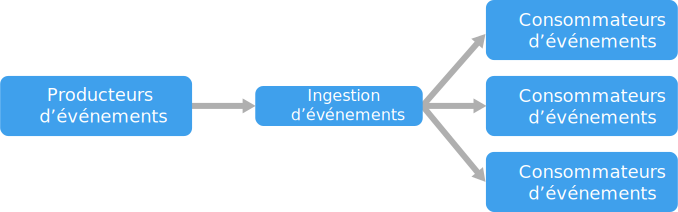

# Style d’architecture basée sur les événements

Une architecture basée sur les événements est constituée de **producteurs d’événements** qui génèrent un flux d’événements et de **consommateurs d’événements** qui écoutent les événements.

Les événements étant remis en quasi-temps réel, les consommateurs peuvent y répondre immédiatement à mesure qu’ils se produisent. Les producteurs sont dissociés des consommateurs (un producteur ne peut pas identifier les consommateurs qui sont à l’écoute). Les consommateurs sont aussi dissociés les uns des autres, et chaque consommateur voit tous les événements. Il s’agit d’une différence notable par rapport au modèle des [consommateurs concurrents][competing-consumers], où les consommateurs extraient les messages d’une file d’attente et où un message est traité une seule fois (à condition qu’il n’y ait pas d’erreurs). Dans certains systèmes, comme IoT, les événements doivent être ingérés dans de très gros volumes.

Une architecture basée sur les événements peut utiliser un modèle de publication/abonnement ou un modèle de flux d’événements.

- **Publication/abonnement** : l’infrastructure de messagerie effectue le suivi des abonnements. Quand un événement est publié, elle communique l’événement à chaque abonné. Une fois l’événement reçu, il ne peut pas être relu et les nouveaux abonnés ne le voient pas.

- **Streaming d’événements** : les événements sont écrits dans un journal. Les événements sont classés dans un ordre strict (au sein d’une partition) et sont durables. Les clients ne s’abonnent pas au flux, mais ils peuvent lire n’importe quelle partie du flux. Il revient au client d’avancer sa position dans le flux. Cela signifie qu’un client peut se joindre à tout moment et relire les événements.

Du côté du consommateur, il existe quelques variantes courantes :

- **Traitement des événements simples** : un événement déclenche immédiatement une action dans le consommateur. Par exemple, vous pouvez utiliser Azure Functions avec un déclencheur Service Bus, de telle sorte qu’une fonction s’exécute chaque fois qu’un message est publié dans une rubrique Service Bus.

- **Traitement des événements complexes** : un consommateur traite une série d’événements, à la recherche de modèles dans les données d’événement, en s’appuyant sur une technologie telle qu’Azure Stream Analytics ou Apache Storm. Par exemple, vous pouvez agréger les relevés d’un appareil intégré dans une fenêtre de temps et générer une notification si la moyenne mobile dépasse un certain seuil.

- **Traitement des flux d’événements** : utilisez une plateforme de diffusion de données, telle qu’Azure IoT Hub ou Apache Kafka, comme pipeline pour ingérer les événements et les transmettre aux processeurs de flux. Les processeurs de flux agissent de façon à traiter ou transformer le flux. Il peut exister plusieurs processeurs de flux pour différents sous-systèmes de l’application. Cette approche est parfaitement adaptée aux charges de travail IoT.

La source des événements peut être extérieure au système. Il peut s’agir par exemple des appareils physiques d’une solution IoT. Dans ce cas, le système doit pouvoir ingérer les données selon le volume et le débit imposés par la source de données.

Dans le diagramme logique ci-dessus, chaque type de consommateur est représenté par un cadre unique. Dans la pratique, il est courant d’avoir plusieurs instances d’un même consommateur pour éviter que celui-ci devienne un point de défaillance unique dans le système. Plusieurs instances peuvent aussi s’avérer nécessaires pour gérer le volume et la fréquence des événements. De même, un même consommateur peut traiter les événements de plusieurs threads. Cela peut être une source de problèmes si les événements doivent être traités dans l’ordre ou s’ils nécessitent une sémantique « exactly-once » (exactement une fois). Consultez [Minimiser la coordination][minimize-coordination].

## Quand utiliser cette architecture

- Plusieurs sous-systèmes doivent traiter les mêmes événements.
- Traitement en temps réel avec un décalage dans le temps minimal.
- Traitement des événements complexes, tel que les critères spéciaux ou l’agrégation dans des fenêtres de temps.
- Volume et vélocité élevés des données, par exemple IoT.

## Avantages

- Les producteurs et les consommateurs sont dissociés.
- Absence d’intégrations point à point. Simplicité d’ajout de nouveaux consommateurs au système.
- Les consommateurs peuvent répondre immédiatement aux événements, dès leur arrivée.
- Architecture hautement scalable et distribuée.
- Les sous-systèmes ont des vues indépendantes du flux d’événements.

## Défis

- Transmission non garantie. Dans certains systèmes, surtout dans les scénarios IoT, il est essentiel de garantir la transmission des événements.
- Traitement des événements dans l’ordre ou une seule fois. Chaque type de consommateur s’exécute généralement dans plusieurs instances à des fins de résilience et de scalabilité. Cela peut être une source de problèmes si les événements doivent être traités dans l’ordre (dans un type de consommateur) ou si la logique de traitement n’est pas idempotent.

 <!-- links -->

[competing-consumers]: ../../patterns/competing-consumers.md
[minimize-coordination]: ../design-principles/minimize-coordination.md
