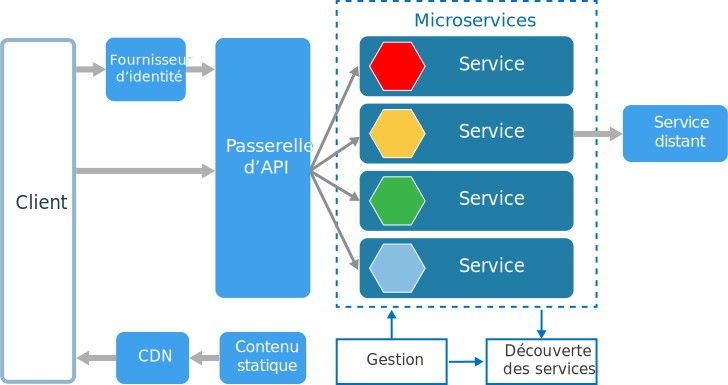
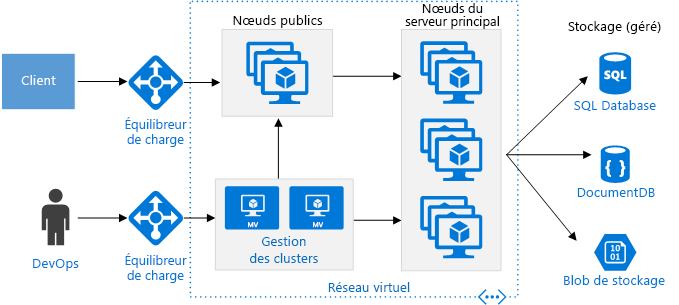
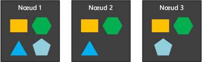
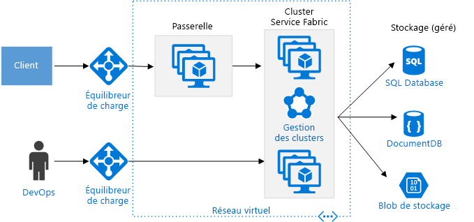

# Style d’architecture de microservicesMicroservices architecture style

Une architecture de microservices se compose d’un ensemble de petits services autonomes.A microservices architecture consists of a collection of small, autonomous services. Chaque service est autonome et doit implémenter une fonctionnalité unique.Each service is self-contained and should implement a single business capability. Pour obtenir des instructions détaillées sur la création d’une architecture de microservices sur Azure, consultez [Conception, génération et exploitation de microservices sur Azure](../../microservices/index.md).For detailed guidance about building a microservices architecture on Azure, see [Designing, building, and operating microservices on Azure](../../microservices/index.md).

 
À certains égards, les microservices sont l’évolution naturelle des architectures orientées services (SOA), mais il existe des différences.In some ways, microservices are the natural evolution of service oriented architectures (SOA), but there are differences between microservices and SOA. Voici certaines caractéristiques qui définissent un microservice :Here are some defining characteristics of a microservice:

- Dans une architecture de microservices, les services sont de petite taille, indépendants et faiblement liés.In a microservices architecture, services are small, independent, and loosely coupled.

- Chaque service est un code base distinct, qui peut être géré par une petite équipe de développement.Each service is a separate codebase, which can be managed by a small development team.

- Les services peuvent être déployés de manière indépendante.Services can be deployed independently. Une équipe peut mettre à jour un service existant sans avoir à recréer et redéployer l’application entière.A team can update an existing service without rebuilding and redeploying the entire application.

- Les services sont responsables de la persistance de leurs propres données ou de leur propre état externe.Services are responsible for persisting their own data or external state. Ils se distinguent en cela du modèle traditionnel dans lequel une couche de données distincte gère la persistance des données.This differs from the traditional model, where a separate data layer handles data persistence.

- Les services communiquent entre eux à l’aide d’API bien définies.Services communicate with each other by using well-defined APIs. Les détails de l’implémentation interne de chaque service sont cachés aux autres services.Internal implementation details of each service are hidden from other services.

- Les services n’ont pas besoin de partager une pile de technologies, des bibliothèques ou des frameworks identiques.Services don't need to share the same technology stack, libraries, or frameworks.

Outre les services proprement dits, une architecture de microservices type est constituée d’autres composants :Besides for the services themselves, some other components appear in a typical microservices architecture:

**Gestion** :**Management**. le composant de gestion est chargé de placer les services sur les nœuds, d’identifier les défaillances, de rééquilibrer les services entre les nœuds, et ainsi de suite.The management component is responsible for placing services on nodes, identifying failures, rebalancing services across nodes, and so forth.  

**Découverte des services** :**Service Discovery**.  tient à jour une liste des services et des nœuds sur lesquels ils se trouvent.Maintains a list of services and which nodes they are located on. Permet de rechercher le point de terminaison d’un service.Enables service lookup to find the endpoint for a service. 

**Passerelle d’API** :**API Gateway**. la passerelle d’API est le point d’entrée des clients.The API gateway is the entry point for clients. Les clients n’appellent pas les services directement.Clients don't call services directly. Au lieu de cela, ils appellent la passerelle d’API, qui transfère l’appel aux services appropriés sur le backend.Instead, they call the API gateway, which forwards the call to the appropriate services on the back end. La passerelle d’API peut agréger les réponses de plusieurs services et retourner la réponse agrégée.The API gateway might aggregate the responses from several services and return the aggregated response. 

L’utilisation de la passerelle d’API offre les avantages suivants :The advantages of using an API gateway include:

- Il dissocie les clients des services.It decouples clients from services. Les services peuvent être versionnés ou refactorisés sans avoir à mettre à jour tous les clients.Services can be versioned or refactored without needing to update all of the clients.

-  Les services peuvent utiliser des protocoles de messagerie qui ne sont pas compatibles avec le web, comme AMQP.Services can use messaging protocols that are not web friendly, such as AMQP.

- La passerelle d’API peut exécuter d’autres fonctions transversales, telles que l’authentification, la journalisation, la terminaison SSL et l’équilibrage de charge.The API Gateway can perform other cross-cutting functions such as authentication, logging, SSL termination, and load balancing.

## Quand utiliser cette architectureWhen to use this architecture

Envisagez ce style d’architecture pour :Consider this architecture style for:

- Les applications volumineuses qui exigent une grande rapidité de diffusion.Large applications that require a high release velocity.

- Les applications complexes qui doivent offrir une grande scalabilité.Complex applications that need to be highly scalable.

- Les applications dotées de domaines étoffés ou d’un grand nombre de sous-domaines.Applications with rich domains or many subdomains.

- Une organisation constituée de petites équipes de développement.An organization that consists of small development teams.

## AvantagesBenefits 

- **Déploiements indépendants** :**Independent deployments**. vous pouvez mettre à jour un service sans avoir à redéployer l’application entière et effectuer une restauration ou une restauration par progression si une mise à jour est une source de problèmes.You can update a service without redeploying the entire application, and roll back or roll forward an update if something goes wrong. Les résolutions de bogues et les diffusions de fonctionnalités sont plus faciles à gérer et moins risquées.Bug fixes and feature releases are more manageable and less risky.

- **Développement indépendant** :**Independent development**. une même équipe de développement peut créer, tester et déployer un service.A single development team can build, test, and deploy a service. Résultat : l’innovation est continue et la cadence des diffusions est supérieure.The result is continuous innovation and a faster release cadence. 

- **Petites équipes spécialisées** :**Small, focused teams**. les équipes peuvent se concentrer sur un seul service.Teams can focus on one service. la portée de chaque service étant plus limitée, le code base est plus facile à comprendre et les nouveaux membres d’équipes s’intègrent plus facilement.The smaller scope of each service makes the code base easier to understand, and it's easier for new team members to ramp up.

- **Isolation des erreurs** :**Fault isolation**. si un service tombe en panne, il n’impacte pas l’ensemble de l’application.If a service goes down, it won't take out the entire application. Cependant, cela ne signifie pas pour autant que vous bénéficiez d’une résilience ex nihilo.However, that doesn't mean you get resiliency for free. Vous devez toujours suivre les bonnes pratiques de résilience et les modèles de conception.You still need to follow resiliency best practices and design patterns. Consultez [Conception d’applications résilientes pour Azure][resiliency-overview].See [Designing resilient applications for Azure][resiliency-overview].

- **Piles de technologies mixtes** :**Mixed technology stacks**. les équipes peuvent opter pour les technologies qui se prêtent le mieux à leur service.Teams can pick the technology that best fits their service. 

- **Mise à l’échelle précise** :**Granular scaling**. les services peuvent mis à l’échelle de manière indépendante.Services can be scaled independently. Dans le même temps, la plus grande densité des services par machine virtuelle signifie que les ressources des machines virtuelles sont entièrement exploitées.At the same time, the higher density of services per VM means that VM resources are fully utilized. En utilisant des contraintes de placement, un service peut être assorti à un profil de machine virtuelle (processeur rapide, mémoire volumineuse, etc.).Using placement constraints, a services can be matched to a VM profile (high CPU, high memory, and so on).

## DéfisChallenges

- **Complexité** :**Complexity**. une application de microservices possède plus d’éléments mobiles qu’une application monolithique équivalente.A microservices application has more moving parts than the equivalent monolithic application. Si chaque service est plus simple, le système dans son ensemble est plus complexe.Each service is simpler, but the entire system as a whole is more complex.

- **Développement et tests** :**Development and test**. développer avec des dépendances de services demande une approche différente.Developing against service dependencies requires a different approach. Les outils existants ne sont pas nécessairement conçus pour fonctionner avec des dépendances de services.Existing tools are not necessarily designed to work with service dependencies. Refactoriser au-delà des limites des services peut être une tâche ardue.Refactoring across service boundaries can be difficult. Il est aussi difficile de tester les dépendances de services, en particulier quand l’application évolue rapidement.It is also challenging to test service dependencies, especially when the application is evolving quickly.

- **Manque de gouvernance** :**Lack of governance**. l’approche décentralisée de création de microservices présente des avantages, mais elle peut aussi être une source de problèmes.The decentralized approach to building microservices has advantages, but it can also lead to problems. Vous pouvez en effet vous trouver face à une diversité de langages et de frameworks telle que l’application devient difficile à gérer.You may end up with so many different languages and frameworks that the application becomes hard to maintain. Il peut être utile de mettre en place certains standards à l’échelle du projet, sans trop amoindrir la flexibilité des équipes.It may be useful to put some project-wide standards in place, without overly restricting teams' flexibility. Cela vaut en particulier pour les fonctionnalités transversales, telles que la journalisation.This especially applies to cross-cutting functionality such as logging.

- **Surcharge du réseau et latence** :**Network congestion and latency**. l’utilisation de nombreux services granulaires de petite taille peut se traduire par une intensification des communications entre les services.The use of many small, granular services can result in more interservice communication. De même, si la chaîne des dépendances de services devient trop longue (le service A appelle le service B, qui appelle le service C, etc.), la latence supplémentaire qui s’ensuit peut devenir un problème.Also, if the chain of service dependencies gets too long (service A calls B, which calls C...), the additional latency can become a problem. Vous devrez faire preuve de circonspection au moment de concevoir des API.You will need to design APIs carefully. Évitez les API trop bavardes, envisagez des formats de sérialisation et cherchez à utiliser des modèles de communication asynchrone.Avoid overly chatty APIs, think about serialization formats, and look for places to use asynchronous communication patterns.

- **Intégrité des données** :**Data integrity**. chaque microservice étant responsable de la persistance de ses propres données,With each microservice responsible for its own data persistence. la cohérence des données peut être une gageure.As a result, data consistency can be a challenge. Adoptez la cohérence éventuelle dans la mesure du possible.Embrace eventual consistency where possible.

- **Gestion** :**Management**. une expérience réussie avec les microservices exige une culture DevOps mature.To be successful with microservices requires a mature DevOps culture. La mise en place d’une journalisation corrélée entre les services peut poser des problèmes.Correlated logging across services can be challenging. En règle générale, la journalisation doit mettre en corrélation plusieurs appels de services pour une même opération utilisateur.Typically, logging must correlate multiple service calls for a single user operation.

- **Gestion des versions** :**Versioning**. les mises à jour apportées à un service ne doivent pas perturber les services qui en dépendent.Updates to a service must not break services that depend on it. Plusieurs services pouvant être mis à jour à tout moment, sans une conception minutieuse, vous risquez de rencontrer des problèmes de compatibilité descendante ou ascendante.Multiple services could be updated at any given time, so without careful design, you might have problems with backward or forward compatibility.

- **Compétences** :**Skillset**. les microservices sont des systèmes hautement distribués.Microservices are highly distributed systems. Évaluez avec soin les chances de réussite en tenant compte des compétences et de l’expérience de l’équipe.Carefully evaluate whether the team has the skills and experience to be successful.

## Meilleures pratiquesBest practices

- Modélisez les services autour du domaine de l’entreprise.Model services around the business domain. 

- Décentralisez tout.Decentralize everything. Les équipes individuelles sont chargées de concevoir et de créer des services.Individual teams are responsible for designing and building services. Évitez de partager du code ou des schémas de données.Avoid sharing code or data schemas. 

- Le stockage de données doit être privé par rapport au service qui détient les données.Data storage should be private to the service that owns the data. Utilisez le stockage le mieux adapté à chaque service et type de données.Use the best storage for each service and data type. 

- Les services communiquent via des API bien conçues.Services communicate through well-designed APIs. Évitez de divulguer les détails d’une implémentation.Avoid leaking implementation details. Les API doivent modéliser le domaine, et non l’implémentation interne du service.APIs should model the domain, not the internal implementation of the service.

- Évitez le couplage entre les services.Avoid coupling between services. Le couplage trouve souvent son origine dans les schémas de base de données partagés et les protocoles de communication rigides.Causes of coupling include shared database schemas and rigid communication protocols.

- Déchargez les problèmes transversaux, tels que l’authentification et la terminaison SSL, sur la passerelle.Offload cross-cutting concerns, such as authentication and SSL termination, to the gateway.

- Maintenez la connaissance du domaine à l’extérieur de la passerelle.Keep domain knowledge out of the gateway. La passerelle doit traiter et acheminer les demandes des clients sans connaître les règles d’entreprise ou la logique du domaine.The gateway should handle and route client requests without any knowledge of the business rules or domain logic. Sinon, la passerelle devient une dépendance et peut provoquer un couplage entre les services.Otherwise, the gateway becomes a dependency and can cause coupling between services.

- Le couplage entre les services doit être faible et leur cohésion fonctionnelle élevée.Services should have loose coupling and high functional cohesion. Les fonctions susceptibles de changer en même temps doivent être empaquetées et déployées ensemble.Functions that are likely to change together should be packaged and deployed together. Si elles résident dans des services distincts, ces services finissent par être fortement couplés, car une modification dans un service nécessite la mise à jour de l’autre service.If they reside in separate services, those services end up being tightly coupled, because a change in one service will require updating the other service. Une communication proéminente entre deux services peut être le signe d’un couplage étroit et d’une faible cohésion.Overly chatty communication between two services may be a symptom of tight coupling and low cohesion. 

- Isolez les défaillances.Isolate failures. Utilisez des stratégies de résilience pour empêcher que les défaillances au sein d’un service se répercutent en cascade.Use resiliency strategies to prevent failures within a service from cascading. Consultez [Modèles de résilience][resiliency-patterns] et [Conception d’applications résilientes][resiliency-overview].See [Resiliency patterns][resiliency-patterns] and [Designing resilient applications][resiliency-overview].

## Microservices et Azure Container ServiceMicroservices using Azure Container Service 

Vous pouvez utiliser [Azure Container Service](/azure/container-service/) pour configurer et provisionner un cluster Docker.You can use [Azure Container Service](/azure/container-service/) to configure and provision a Docker cluster. Azure Container Services prend en charge plusieurs conteneurs et orchestrateurs courants, dont Kubernetes, DC/OS et Docker Swarm.Azure Container Services supports several popular container orchestrators, including Kubernetes, DC/OS, and Docker Swarm.

 
**Nœuds publics** :**Public nodes**. ces nœuds sont accessibles via un équilibreur de charge public.These nodes are reachable through a public-facing load balancer. La passerelle d’API est hébergée sur ces nœuds.The API gateway is hosted on these nodes.

**Nœuds backend** :**Backend nodes**. ces nœuds exécutent des services auxquels les clients accèdent via la passerelle d’API.These nodes run services that clients reach via the API gateway. Ces nœuds ne reçoivent pas directement de trafic Internet.These nodes don't receive Internet traffic directly. Les nœuds backend peuvent englober plusieurs pools de machines virtuelles, chacun avec un profil matériel différent.The backend nodes might include more than one pool of VMs, each with a different hardware profile. Par exemple, vous pouvez créer des pools distincts pour des charges de travail de calcul générales, des charges de travail processeur élevées et des charges de travail mémoire élevées.For example, you could create separate pools for general compute workloads, high CPU workloads, and high memory workloads. 

**Machines virtuelles de gestion** :**Management VMs**. ces machines virtuelles exécutent les nœuds principaux de l’orchestrateur de conteneur.These VMs run the master nodes for the container orchestrator. 

**Mise en réseau** :**Networking**. les nœuds publics, les nœuds backend et les machines virtuelles de gestion sont placés dans des sous-réseaux distincts au sein d’un même réseau virtuel (VNet).The public nodes, backend nodes, and management VMs are placed in separate subnets within the same virtual network (VNet). 

**Équilibreurs de charge** :**Load balancers**.  un équilibreur de charge externe fait face aux nœuds publics.An externally facing load balancer sits in front of the public nodes. Il distribue les demandes Internet aux nœuds publics.It distributes internet requests to the public nodes. Un autre équilibreur de charge est placé devant les machines virtuelles de gestion pour autoriser le trafic Secure Shell (SSH) vers les machines virtuelles de gestion, en utilisant des règles NAT.Another load balancer is placed in front of the management VMs, to allow secure shell (ssh) traffic to the management VMs, using NAT rules.

Pour des besoins de fiabilité et de scalabilité, chaque service est répliqué sur plusieurs machines virtuelles.For reliability and scalability, each service is replicated across multiple VMs. Mais comme les services sont aussi relativement légers (par rapport à une application monolithique), ils sont généralement plusieurs à être empaquetés dans une même machine virtuelle.However, because services are also relatively lightweight (compared with a monolithic application), multiple services are usually packed into a single VM. Cette plus forte densité autorise une meilleure utilisation des ressources.Higher density allows better resource utilization. Si un service déterminé n’utilise pas beaucoup de ressources, vous n’avez pas besoin de dédier une machine virtuelle entière à l’exécution de ce service.If a particular service doesn't use a lot of resources, you don't need to dedicate an entire VM to running that service.

Le diagramme suivant illustre trois nœuds exécutant quatre services différents (indiqués par différentes formes).The following diagram shows three nodes running four different services (indicated by different shapes). Notez que chaque service compte au moins deux instances.Notice that each service has at least two instances. 
 

## Microservices et Azure Service FabricMicroservices using Azure Service Fabric

Le schéma suivant illustre une architecture de microservices utilisant [Azure Service Fabric](/azure/service-fabric/).The following diagram shows a microservices architecture using [Azure Service Fabric](/azure/service-fabric/).

Le cluster Service Fabric est déployé sur un ou plusieurs groupes de machines virtuelles identiques.The Service Fabric cluster is deployed to one or more VM scale sets. Le cluster peut être constitué de plusieurs groupes de machines virtuelles identiques pour profiter d’une combinaison de types de machine virtuelle.You might have more than one VM scale set in the cluster, in order to have a mix of VM types. Une passerelle d’API est placée devant le cluster Service Fabric, avec un équilibreur de charge externe pour réceptionner les demandes des clients.An API Gateway is placed in front of the Service Fabric cluster, with an external load balancer to receive client requests.

Le runtime Service Fabric assure la gestion du cluster, notamment le placement des services, le basculement des nœuds et le contrôle d’intégrité.The Service Fabric runtime performs cluster management, including service placement, node failover, and health monitoring. Le runtime est déployé sur les nœuds du cluster proprement dits.The runtime is deployed on the cluster nodes themselves. Il n’existe pas d’ensemble distinct de machines virtuelles de gestion de cluster.There isn't a separate set of cluster management VMs.

Les services communiquent entre eux via le proxy inverse intégré à Service Fabric.Services communicate with each other using the reverse proxy that is built into Service Fabric. Service Fabric propose un service de découverte qui peut résoudre le point de terminaison pour un service nommé.Service Fabric provides a discovery service that can resolve the endpoint for a named service.

<!-- links -->

[resiliency-overview]: ../../resiliency/index.md
[resiliency-patterns]: ../../patterns/category/resiliency.md

