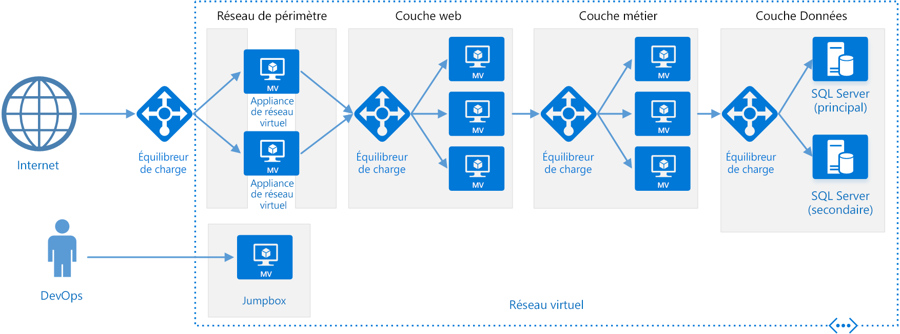

# Style d’architecture multiniveau

Une architecture multiniveau divise une application en plusieurs **couches logiques** et **niveaux physiques**. 

Les couches permettent de séparer les responsabilités et de gérer les dépendances. À chaque couche correspond une responsabilité spécifique. Si une couche supérieure peut utiliser les services d’une couche inférieure, l’inverse n’est pas vrai. 

Les niveaux sont physiquement séparés et s’exécutent sur des machines distinctes. Un niveau peut appeler un autre niveau directement ou utiliser la messagerie asynchrone (file d’attente de messages). Même si chaque couche peut être hébergée dans son propre niveau, il ne s’agit pas d’une obligation. Plusieurs couches peuvent être hébergées dans un même niveau. Si la séparation physique des niveaux améliore la scalabilité et la résilience, elle ajoute aussi de la latence du fait de la communication réseau supplémentaire. 

Une application classique à trois niveaux est constituée d’un niveau de présentation, d’un niveau intermédiaire et d’un niveau de base de données. Le niveau intermédiaire est facultatif. Les applications plus complexes peuvent avoir plus de trois niveaux. Le diagramme ci-dessus représente une application à deux niveaux intermédiaires, encapsulant différents domaines de fonctionnalité. 

Une application multiniveau peut avoir une **architecture à couches fermées** ou une **architecture à couches ouvertes** :

- Dans une architecture à couches fermées, une couche peut appeler uniquement la couche inférieure suivante. 
- Dans une architecture à couches ouvertes, une couche peut appeler n’importe quelle couche inférieure. 

Une architecture à couche fermées limite les dépendances entre les couches. En revanche, elle peut générer un trafic réseau inutile si une couche transmet simplement les demandes à la couche suivante. 

## Quand utiliser cette architecture

Les architectures multiniveaux sont généralement implémentées sous forme d’applications IaaS (infrastructure-as-service), où chaque niveau s’exécute sur un ensemble distinct de machines virtuelles. Cependant, une application multiniveau ne doit pas nécessairement être une pure application IaaS. Souvent, il est judicieux d’utiliser des services managés pour certaines parties de l’architecture, notamment la mise en cache, la messagerie et le stockage de données.

Une architecture multiniveau est à envisager pour :

- les applications web simples ; 
- la migration d’une application locale vers Azure avec une refactorisation minimale ;
- le développement unifié d’applications locales et cloud.

Les architectures multiniveaux sont très courantes dans les applications locales classiques. De ce fait, elles conviennent parfaitement quand il s’agit de migrer des charges de travail existantes vers Azure.

## Avantages

- Portabilité entre le cloud et les environnements locaux, et entre les plateformes cloud.
- Courbe d’apprentissage limitée pour la plupart des développeurs.
- Évolution naturelle du modèle d’application classique.
- Ouverte à un environnement hétérogène (Windows/Linux).

## Inconvénients

- Il est facile de se retrouver avec un niveau intermédiaire qui effectue uniquement des opérations CRUD sur la base de données, ce qui ajoute une latence supplémentaire pour un intérêt limité. 
- La conception monolithique interdit tout déploiement indépendant de fonctionnalités.
- La gestion d’une application IaaS s’avère plus fastidieuse que pour une application utilisant uniquement des services managés. 
- Il peut être difficile de gérer la sécurité réseau dans un système de grande taille.

## Bonnes pratiques

- Utilisez la mise à l’échelle automatique pour gérer les évolutions au niveau de la charge. Consultez [Bonnes pratiques en matière de mise à l’échelle automatique][autoscaling].
- Utilisez la messagerie asynchrone pour dissocier les niveaux.
- Mettez en cache les données semi-statiques. Consultez [Bonnes pratiques en matière de mise en cache][caching].
- Configurez le niveau de base de données pour la haute disponibilité à l’aide d’une solution telle que les [Groupes de disponibilité SQL Server Always On][sql-always-on].
- Placez un pare-feu d’applications web (WAF) entre le frontend et Internet.
- Placez chaque niveau dans son propre sous-réseau et utilisez les sous-réseaux comme frontière de sécurité. 
- Limitez l’accès à la couche Données en autorisant uniquement les demandes en provenance des niveaux intermédiaires.

## Architecture multiniveau sur les machines virtuelles

Cette section décrit une architecture multiniveau recommandée s’exécutant sur des machines virtuelles. 

Chaque niveau est constitué d’au moins deux machines virtuelles placées dans un groupe à haute disponibilité ou un groupe de machines virtuelles identiques. La présence de plusieurs machines virtuelles assure une résilience en cas de défaillance d’une machine virtuelle. Les équilibreurs de charge servent à répartir les demandes entre les machines virtuelles d’un même niveau. Un niveau peut faire l’objet d’une mise à l’échelle horizontale par l’ajout de machines virtuelles supplémentaires au pool. 

Chaque niveau est également placé dans son propre sous-réseau, ce qui signifie que leurs adresses IP internes se trouvent dans la même plage d’adresses. Cela permet d’appliquer facilement des règles de groupe de sécurité réseau (NSG) et des tables de routage aux niveaux individuels.

Les niveaux web et business sont sans état. N’importe quelle machine virtuelle peut traiter une demande pour ce niveau. La couche Données doit être constituée d’une base de données répliquée. Pour Windows, nous recommandons SQL Server avec des groupes de disponibilité Always On pour la haute disponibilité. Pour Linux, choisissez une base de données qui prend en charge la réplication, comme Apache Cassandra. 

Les groupes de sécurité réseau (NSG) limitent l’accès à chaque niveau. Par exemple, le niveau de base de données autorise uniquement l’accès à partir du niveau business.

Pour obtenir des informations plus détaillées et un modèle Resource Manager déployable, consultez les architectures de référence suivantes :

- [Exécuter des machines virtuelles Windows pour une architecture multiniveau][n-tier-windows]
- [Exécuter des machines virtuelles Linux pour une application multiniveau][n-tier-linux]

### Considérations supplémentaires

- Les architectures multiniveau ne sont pas limitées à trois niveaux. Il est courant que les applications plus complexes aient davantage de niveaux. Dans ce cas, envisagez d’utiliser le routage de la couche 7 pour acheminer les demandes vers un niveau particulier.

- Les niveaux constituent la limite de scalabilité, de fiabilité et de sécurité. Envisagez d’utiliser des niveaux distincts pour les services ayant des exigences différentes dans ces domaines.

- Utiliser des groupes de machines virtuelles identiques pour la mise à l’échelle automatique.

- Recherchez dans l’architecture des endroits où vous pouvez utiliser un service managé sans refactorisation importante. Regardez tout particulièrement du côté de la mise en cache, de la messagerie, du stockage et des bases de données. 

- Pour renforcer la sécurité, placez une zone DMZ réseau devant l’application. La zone DMZ comprend des appliances virtuelles réseau (NVA) qui implémentent des fonctionnalités de sécurité telles que des pare-feu et l’inspection des paquets. Pour plus d’informations, consultez [Architecture de référence de zone DMZ réseau][dmz].

- Pour la haute disponibilité, placez au moins deux NVA dans un groupe à haute disponibilité, avec un équilibrage de charge externe pour répartir les demandes Internet entre les instances. Pour plus d’informations, consultez [Déployer des appliances virtuelles réseau hautement disponibles][ha-nva].

- N’autorisez pas d’accès RDP ou SSH direct aux machines virtuelles qui exécutent du code d’application. Au lieu de cela, les opérateurs doivent se connecter à un serveur de rebond, aussi appelé hôte bastion. Il s’agit d’une machine virtuelle située sur le réseau dont les administrateurs se servent pour se connecter aux autres machines virtuelles. Le serveur de rebond dispose d’un groupe de sécurité réseau (NSG) qui n’autorise RDP ou SSH qu’à partir des adresses IP publiques approuvées.

- Vous pouvez étendre le réseau virtuel Azure à votre réseau local en utilisant un réseau privé virtuel (VPN) de site à site ou Azure ExpressRoute. Pour plus d’informations, consultez [Architecture de référence de réseau hybride][hybrid-network].

- Si votre organisation utilise Active Directory pour gérer les identités, vous pouvez étendre votre environnement Active Directory à Azure VNet. Pour plus d’informations, consultez [Architecture de référence de gestion des identités][identity].

- Si vous avez besoin d’une plus grande disponibilité que celle offerte par le contrat SLA Azure pour les machines virtuelles, répliquez l’application dans deux régions et utilisez Azure Traffic Manager pour le basculement. Pour plus d’informations, consultez [Exécuter des machines virtuelles Windows dans plusieurs régions][multiregion-windows] ou [Exécuter des machines virtuelles Linux dans plusieurs régions][multiregion-linux].

[autoscaling]: ../../best-practices/auto-scaling.md
[caching]: ../../best-practices/caching.md
[dmz]: ../../reference-architectures/dmz/index.md
[ha-nva]: ../../reference-architectures/dmz/nva-ha.md
[hybrid-network]: ../../reference-architectures/hybrid-networking/index.md
[identity]: ../../reference-architectures/identity/index.md
[multiregion-linux]: ../../reference-architectures/virtual-machines-linux/multi-region-application.md
[multiregion-windows]: ../../reference-architectures/virtual-machines-windows/multi-region-application.md
[n-tier-linux]: ../../reference-architectures/virtual-machines-linux/n-tier.md
[n-tier-windows]: ../../reference-architectures/virtual-machines-windows/n-tier.md
[sql-always-on]: /sql/database-engine/availability-groups/windows/always-on-availability-groups-sql-server