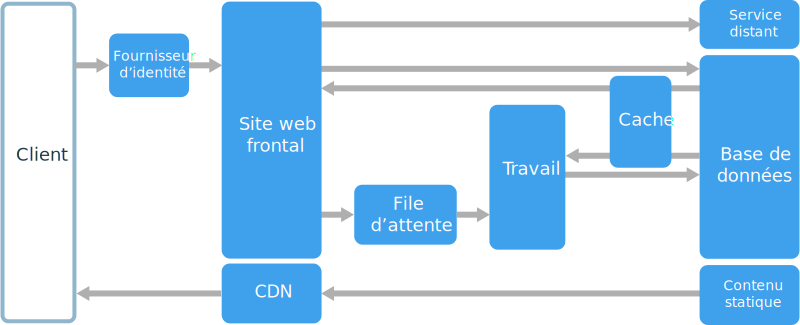
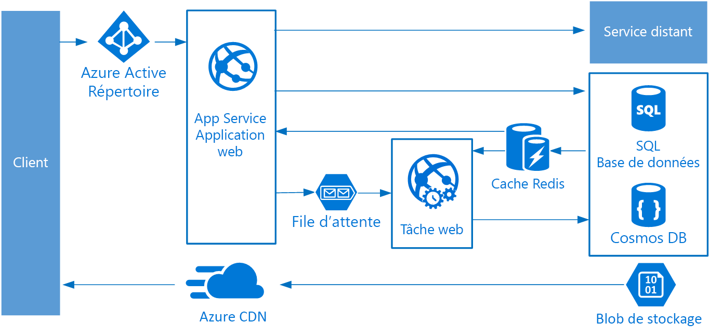

# Style d’architecture Web-File d’attente-Worker

Les principaux composants de cette architecture sont un **serveur web frontal** qui traite les requêtes des clients et un **Worker** qui s’occupe des tâches gourmandes en ressources, des flux de travail à exécution longue ou des programmes de traitement par lots.  Le serveur web frontal communique avec le Worker via une **file d’attente de messages**.  

Les autres composants généralement intégrés dans cette architecture sont :

- Une ou plusieurs bases de données. 
- Un cache pour stocker des valeurs à partir de la base de données pour des lectures rapides.
- Un réseau de distribution de contenu (CDN) pour traiter du contenu statique.
- Des services à distance, tels qu’un service de messagerie ou SMS. Souvent, ils sont fournis par des tiers.
- Un fournisseur d’identité pour l’authentification.

Le serveur web et le Worker sont sans état. L’état de session peut être stocké dans un cache distribué. N’importe quel travail à exécution longue est traité de façon asynchrone par le Worker. Le Worker peut être déclenché par des messages dans la file d’attente ou s’exécuter selon une planification pour le traitement par lots. Le Worker est un composant facultatif. S’il n’y a aucune opération à exécution longue, le Worker peut être omis.  

Le serveur frontal peut être une API web. Du côté client, l’API web peut être utilisée par une application de page unique qui effectue les appels AJAX ou par une application cliente native.

## Quand utiliser cette architecture

L’architecture Web-File d’attente-Worker est généralement implémentée à l’aide des services de calcul gérés d’Azure App Service ou d’Azure Cloud Services. 

Envisagez ce style d’architecture pour :

- Des applications avec un domaine relativement simple.
- Des applications ayant des flux de travail à exécution longue ou des opérations par lots.
- Lorsque vous souhaitez utiliser des services gérés plutôt que l’infrastructure as a service (IaaS).

## Avantages

- Architecture relativement simple, facile à comprendre.
- Gestion et déploiement faciles.
- Séparation nette des problèmes.
- Le serveur frontal est dissocié du Worker à l’aide d’une messagerie asynchrone.
- Le serveur frontal et le Worker peuvent être mis à l’échelle indépendamment.

## Défis

- Sans une conception minutieuse, le serveur frontal et le Worker peuvent devenir des composants monolithiques volumineux, difficiles à gérer et à mettre à jour.
- Des dépendances masquées peuvent être présentes si le serveur frontal et le Worker partagent des schémas de données ou des modules de code. 

## Meilleures pratiques

- Exposez une API bien conçue au client. Consultez [API design][api-design] (Conception d’API).
- Effectuez une mise à l’échelle automatique pour gérer les évolutions au niveau de la charge. Consultez [Autoscaling][autoscaling] (Mise à l’échelle automatique).
- Mettez en cache les données semi-statiques. Consultez [Caching][caching] (Mise en cache).
- Utilisez un réseau de distribution de contenu (CDN) pour héberger le contenu statique. Consultez [Content Delivery Network][cdn] (Réseau de distribution de contenu).
- Utilisez la persistance polyglotte lorsque cela est approprié. Consultez [Use the best data store for the job][polyglot] (Utiliser le meilleur magasin de données pour le travail).
- Partitionnez des données pour améliorer l’extensibilité, réduire la contention et optimiser les performances. Consultez [Data partitioning][data-partition] (Partitionnement des données).

## Web-File d’attente-Worker sur Azure App Service

Cette section décrit une architecture Web-File d’attente-Worker recommandée qui utilise Azure App Service. 

Le serveur frontal est implémenté en tant qu’application web Azure App Service et le Worker est implémenté en tant que WebJob. L’application web et WebJob sont associés à un plan App Service qui fournit les instances de machine virtuelle. 

Vous pouvez utiliser les files d’attente Azure Service Bus ou de stockage Azure pour la file d’attente de messages. (Le schéma montre une file d’attente de stockage Azure.)

Cache Redis Azure stocke l’état de session et d’autres données qui nécessitent un accès à faible latence.

Azure CDN est utilisé pour mettre en cache le contenu statique comme des images, des CSS ou des HTML.

Pour le stockage, choisissez les technologies de stockage qui répondent le mieux aux besoins de l’application. Vous pouvez utiliser plusieurs technologies de stockage (persistance polyglotte). Pour illustrer cette idée, le schéma montre Azure SQL Database et Azure Cosmos DB.  

Pour plus d’informations, consultez [Improve scalability in a web application][scalable-web-app] (Améliorer l’évolutivité d’une application web).

### Considérations supplémentaires

- Toutes les transactions n’ont pas à passer par la file d’attente et le Worker avant d’arriver au stockage. Le serveur web frontal peut directement effectuer des opérations de lecture/d’écriture simples. Les Workers sont conçus pour les tâches gourmandes en ressources ou les flux de travail à exécution longue. Dans certains cas, aucun Worker ne vous sera nécessaire.

- Utilisez la fonctionnalité de mise à l’échelle intégrée d’App Service pour augmenter la taille des instances de machine virtuelle. Si la charge sur l’application suit les modèles prévisibles, utilisez la mise à l’échelle automatique basée sur la planification. Si la charge est imprévisible, utilisez des règles de mise à l’échelle automatique basée sur des métriques.      

- Envisagez de placer l’application web et WebJob dans des plans App Service distincts. De cette manière, ils sont hébergés sur des instances distinctes de machine virtuelle et peuvent être mis à l’échelle indépendamment. 

- Utilisez des plans App Service distincts pour la production et le test. Sinon, si vous utilisez le même plan pour la production et le test, cela signifie que l’exécution des tests a lieu sur vos machines virtuelles de production.

- Utilisez des emplacements de déploiement pour gérer les déploiements. Cela vous permet de déployer une version mise à jour sur un emplacement de préproduction, puis de basculer sur la nouvelle version. Cela vous permet également de revenir à la version précédente en cas de problème avec la mise à jour.

<!-- links -->

[api-design]: ../../best-practices/api-design.md
[autoscaling]: ../../best-practices/auto-scaling.md
[caching]: ../../best-practices/caching.md
[cdn]: ../../best-practices/cdn.md
[data-partition]: ../../best-practices/data-partitioning.md
[polyglot]: ../design-principles/use-the-best-data-store.md
[scalable-web-app]: ../../reference-architectures/app-service-web-app/scalable-web-app.md