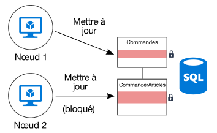
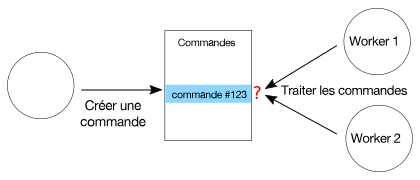

# Minimiser la coordination

## Minimiser la coordination entre les services d’application pour privilégier la scalabilité

La plupart des applications cloud sont constituées de plusieurs services d’application : frontends web, bases de données, processus métier, rapport et analyse, etc. Pour assurer le niveau de scalabilité et de fiabilité attendu, chacun de ces services doit s’exécuter sur plusieurs instances.

Que se passe-t-il quand deux instances essaient d’effectuer des opérations simultanées qui ont des répercussions sur un état partagé ? Dans certains cas, il doit exister une coordination entre les nœuds, par exemple pour préserver les garanties ACID. Dans ce diagramme, `Node2` attend que `Node1` libère un verrou de base de données :

La coordination limite les avantages de la mise à l’échelle horizontale et crée des goulots d’étranglement. Dans cet exemple, à mesure que l’application monte en charge et que des instances supplémentaires sont ajoutées, la contention de verrouillage augmente. Dans le pire des cas, les instances frontend passent l’essentiel de leur temps à attendre des verrous.

La sémantique « exactly once » (une seule fois) est une autre source fréquente de coordination. Par exemple, une commande doit être traitée une seule fois. Deux workers sont à l’écoute des nouvelles commandes. `Worker1` récupère une commande pour traitement. L’application doit veiller à ce que `Worker2` ne duplique pas le travail, mais aussi à ce que la commande ne soit pas supprimée si `Worker1` subit une défaillance.

Vous pouvez utiliser un modèle tel que [Superviseur de l’agent du planificateur][sas-pattern] pour assurer la coordination entre les workers, mais dans ce cas, la répartition du travail peut s’avérer une meilleure approche. Chaque worker se voit affecter une certaine série de commandes (par exemple, par région de facturation). Si un worker subit une défaillance, une nouvelle instance reprend là où l’instance précédente s’est arrêtée, mais il n’y a pas de contention entre plusieurs instances.

## Recommandations

**Adoptez la cohérence éventuelle** : quand les données sont distribuées, une coordination est nécessaire pour mettre en œuvre des garanties de cohérence forte. Par exemple, prenons le cas d’une opération qui met à jour deux bases de données. Au lieu de la placer dans l’étendue d’une transaction unique, il est préférable que le système prenne en charge la cohérence éventuelle, peut-être en utilisant le modèle de [transaction de compensation][compensating-transaction], pour procéder à une restauration logique après une défaillance.

**Utilisez des événements de domaine pour synchroniser l’état** : un [événement de domaine][domain-event] est un événement qui s’inscrit quand quelque chose d’important se produit dans le domaine. Les services intéressés peuvent écouter l’événement, au lieu d’utiliser une transaction globale pour assurer la coordination entre plusieurs services. Si cette approche est utilisée, le système doit tolérer la cohérence éventuelle (voir l’élément précédent).

**Envisagez l’utilisation de modèles tels que CQRS et l’approvisionnement en événements (event sourcing)**. Ces deux modèles peuvent contribuer à réduire la contention entre les charges de travail de lecture et les charges de travail d’écriture.

- Le [modèle CQRS][cqrs-pattern] sépare les opérations de lecture des opérations d’écriture. Dans certaines implémentations, les données de lecture sont physiquement séparées des données d’écriture.

- Dans le [modèle d’approvisionnement en événements][event-sourcing], les changements d’état sont inscrits comme série d’événements dans une banque de données en ajout seul. L’ajout d’un événement au flux est une opération atomique, nécessitant un verrouillage minimal.

Ces deux modèles se complètent mutuellement. Si la banque en écriture seule de CQRS utilise l’approvisionnement en événements, la banque en lecture seule peut écouter les mêmes événements pour créer un instantané accessible en lecture de l’état actif, optimisé pour les requêtes. Cependant, avant d’adopter CQRS ou l’approvisionnement en événements, prenez connaissance des inconvénients de cette approche. Pour plus d’informations, consultez [Style d’architecture CQRS][cqrs-style].

**Répartissez les données** :  évitez de placer toutes vos données dans un même schéma de données partagé entre divers services d’application. Une architecture de microservices applique ce principe en rendant chaque service responsable de sa propre banque de données. Dans une base de données unique, le répartition des données dans différentes partitions peut améliorer la concurrence, car un service qui écrit dans une partition n’affecte pas un service qui écrit dans une autre partition.

**Concevez des opérations idempotent** : dans la mesure du possible, concevez des opérations idempotent. De cette façon, elles pourront être traitées à l’aide d’une sémantique « at-least-once » (au moins une fois). Par exemple, vous pouvez placer des éléments de travail dans une file d’attente. Si un worker se bloque au milieu d’une opération, un autre travail récupère simplement l’élément de travail.

**Utilisez un traitement parallèle asynchrone** : si une opération passe par l’exécution asynchrone de plusieurs étapes (telles que des appels à des services distants), vous pouvez les appeler en parallèle et agréger ensuite les résultats. Cette approche suppose que chaque étape ne dépend pas des résultats de l’étape précédente.

**Utilisez si possible l’accès concurrentiel optimiste** : le contrôle d’accès concurrentiel pessimiste utilise des verrous de base de données pour éviter les conflits. Cela peut dégrader les performances et réduire la disponibilité. Avec le contrôle d’accès concurrentiel optimiste, chaque transaction modifie une copie ou un instantané des données. Une fois la transaction engagée, le moteur de base de données valide la transaction et rejette celles qui affecteraient la cohérence de la base de données.

Azure SQL Database et SQL Server prennent en charge l’accès concurrentiel optimiste via l’[isolement d’instantané][sql-snapshot-isolation]. Certains services de stockage Azure prennent en charge l’accès concurrentiel optimiste via l’utilisation d’ETags, notamment [Azure Cosmos DB][cosmosdb-faq] et le [stockage Azure][storage-concurrency].

**Envisagez d’utiliser MapReduce ou d’autres algorithmes parallèles distribués**. Selon les données et le type de travail à effectuer, vous pourrez peut-être répartir le travail en plusieurs tâches indépendantes qui seront effectuées par plusieurs nœuds fonctionnant en parallèle. Consultez [Style d’architecture Big Compute][big-compute].

**Utilisez l’élection du responsable pour la coordination** : dans les cas où vous avez besoin de coordonner les opérations, veillez à ce que le coordinateur ne devienne pas un point de défaillance unique dans l’application. Avec le [modèle d’élection du responsable][leader-election], seule une instance est responsable à un instant T et joue le rôle de coordinateur. En cas d’échec du responsable, une nouvelle instance est élue responsable.

<!-- links -->

[big-compute]: ../architecture-styles/big-compute.md
[compensating-transaction]: ../../patterns/compensating-transaction.md
[cqrs-style]: ../architecture-styles/cqrs.md
[cqrs-pattern]: ../../patterns/cqrs.md
[cosmosdb-faq]: /azure/cosmos-db/faq
[domain-event]: https://martinfowler.com/eaaDev/DomainEvent.html
[event-sourcing]: ../../patterns/event-sourcing.md
[leader-election]: ../../patterns/leader-election.md
[sas-pattern]: ../../patterns/scheduler-agent-supervisor.md
[sql-snapshot-isolation]: /sql/t-sql/statements/set-transaction-isolation-level-transact-sql
[storage-concurrency]: https://azure.microsoft.com/blog/managing-concurrency-in-microsoft-azure-storage-2/