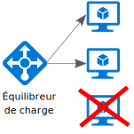
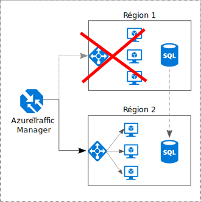

# Rendre tous les éléments redondants

## Intégrez la redondance à votre application afin d’éviter les points de défaillance uniques

Une application résiliente contourne les défaillances. Identifiez les chemins critiques dans votre application. Existe-t-il une redondance à chaque point de ces chemins ? En cas de défaillance d’un sous-système, l’application basculera-t-elle vers un autre équipement ?

## Recommandations

**Considérez les exigences métiers**. Le degré de redondance intégré à un système peut avoir une incidence sur les coûts et la complexité. Votre architecture doit tenir compte de vos exigences métiers, telles que l’objectif de délai de récupération (RTO). Par exemple, un déploiement dans plusieurs régions se révèle plus coûteux et plus complexe à gérer qu’un déploiement dans une seule région. Vous devrez mettre en place des procédures opérationnelles pour gérer le basculement et la restauration automatique. Tous les scénarios métiers ne justifient pas ce surcroît de complexité et ces frais supplémentaires.

**Placez les machines virtuelles derrière un équilibreur de charge**. N’utilisez pas une seule machine virtuelle pour les charges de travail stratégiques. Au lieu de cela, placez plusieurs machines virtuelles derrière un équilibreur de charge. Si l’une des machines virtuelles n’est plus disponible, l’équilibreur de charge répartit le trafic entre les autres machines virtuelles intègres. Pour plus d’informations sur la procédure de déploiement de cette configuration, consultez l’article [Exécuter des machines virtuelles à charge équilibrée à des fins de scalabilité et de disponibilité][multi-vm-blueprint].

**Répliquez les bases de données**. Azure SQL Database et Cosmos DB répliquent automatiquement les données dans une région, et vous pouvez activer la géoréplication entre les régions. Si vous utilisez une solution de base de données IaaS, choisissez-en une qui prend en charge la réplication et le basculement, telle que [Groupes de disponibilité Always On SQL Server][sql-always-on].

**Activez la géoréplication**. La géoréplication pour [Azure SQL Database][sql-geo-replication] et [Cosmos DB][cosmosdb-geo-replication] crée des réplicas lisibles secondaires de vos données dans une ou plusieurs régions secondaires. En cas de défaillance, la base de données peut basculer vers la région secondaire pour les écritures.

**Créez des partitions pour garantir la disponibilité**. Le partitionnement de base de données est souvent utilisé pour améliorer l’extensibilité, mais peut également optimiser la disponibilité. Si l’une des partitions n’est plus disponible, les autres partitions restent accessibles. Une défaillance dans une partition n’interrompra ainsi qu’un sous-ensemble du nombre total de transactions.

**Déployez l’application dans plusieurs régions**. Pour optimiser la disponibilité, déployez l’application dans plusieurs régions. De cette manière, dans les rares cas où un problème affecte l’ensemble d’une région, l’application pourra basculer vers une autre région. Le diagramme ci-après illustre une application multirégion qui utilise Azure Traffic Manager pour gérer le basculement.

**Synchronisez le basculement du serveur frontal et du serveur principal**. Utilisez Azure Traffic Manager pour assurer le basculement du serveur frontal. Si le serveur frontal devient inaccessible dans une région, Traffic Manager route les nouvelles requêtes vers la région secondaire. Selon votre solution de base de données, vous devrez peut-être coordonner le basculement de la base de données.

**Utilisez un basculement automatique, mais une restauration manuelle**. Utilisez Traffic Manager pour le basculement automatique, mais non pour la restauration automatique. Dans le cas d’une restauration automatique, vous risquez de basculer vers la région primaire avant que celle-ci soit complètement intègre. À la place, vérifiez que tous les sous-systèmes de l’application sont intègres avant de procéder à une restauration manuelle. En outre, selon la base de données, vous devrez peut-être vérifier la cohérence des données avant d’effectuer la restauration.

**Incluez une redondance pour Traffic Manager**. Traffic Manager constitue un point de défaillance possible. Examinez le Contrat de niveau de service (SLA) de Traffic Manager et déterminez si Traffic Manager peut à lui seul répondre à vos exigences métiers en matière de haute disponibilité. Si ce n’est pas le cas, ajoutez une autre solution de gestion du trafic en guise de restauration automatique. En cas de défaillance du service Azure Traffic Manager, modifiez vos enregistrements CNAME dans DNS pour qu’ils pointent vers l’autre service de gestion du trafic.

<!-- links -->

[multi-vm-blueprint]: ../../reference-architectures/virtual-machines-windows/multi-vm.md

[cassandra]: https://cassandra.apache.org/
[cosmosdb-geo-replication]: /azure/cosmos-db/distribute-data-globally
[sql-always-on]: https://msdn.microsoft.com/library/hh510230.aspx
[sql-geo-replication]: /azure/sql-database/sql-database-geo-replication-overview
