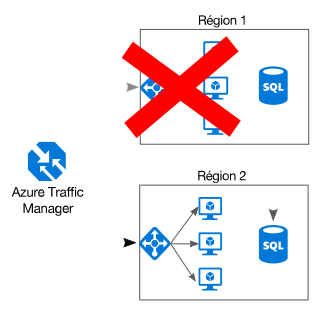

# Rendre tous les éléments redondantsMake all things redundant

## Intégrez la redondance à votre application afin d’éviter les points de défaillance uniquesBuild redundancy into your application, to avoid having single points of failure

Une application résiliente contourne les défaillances.A resilient application routes around failure. Identifiez les chemins critiques dans votre application.Identify the critical paths in your application. Existe-t-il une redondance à chaque point de ces chemins ?Is there redundancy at each point in the path? En cas de défaillance d’un sous-système, l’application basculera-t-elle vers un autre équipement ?If a subsystem fails, will the application fail over to something else?

## RecommandationsRecommendations 

**Considérez les exigences métiers**.**Consider business requirements**. Le degré de redondance intégré à un système peut avoir une incidence sur les coûts et la complexité.The amount of redundancy built into a system can affect both cost and complexity. Votre architecture doit tenir compte de vos exigences métiers, telles que l’objectif de délai de récupération (RTO).Your architecture should be informed by your business requirements, such as recovery time objective (RTO). Par exemple, un déploiement dans plusieurs régions se révèle plus coûteux et plus complexe à gérer qu’un déploiement dans une seule région.For example, a multi-region deployment is more expensive than a single-region deployment, and is more complicated to manage. Vous devrez mettre en place des procédures opérationnelles pour gérer le basculement et la restauration automatique.You will need operational procedures to handle failover and failback. Tous les scénarios métiers ne justifient pas ce surcroît de complexité et ces frais supplémentaires.The additional cost and complexity might be justified for some business scenarios and not others.

**Placez les machines virtuelles derrière un équilibreur de charge**.**Place VMs behind a load balancer**. N’utilisez pas une seule machine virtuelle pour les charges de travail stratégiques.Don't use a single VM for mission-critical workloads. Au lieu de cela, placez plusieurs machines virtuelles derrière un équilibreur de charge.Instead, place multiple VMs behind a load balancer. Si l’une des machines virtuelles n’est plus disponible, l’équilibreur de charge répartit le trafic entre les autres machines virtuelles intègres.If any VM becomes unavailable, the load balancer distributes traffic to the remaining healthy VMs. Pour plus d’informations sur la procédure de déploiement de cette configuration, consultez l’article [Exécuter des machines virtuelles à charge équilibrée à des fins de scalabilité et de disponibilité][multi-vm-blueprint].To learn how to deploy this configuration, see [Multiple VMs for scalability and availability][multi-vm-blueprint].

**Répliquez les bases de données**.**Replicate databases**. Azure SQL Database et Cosmos DB répliquent automatiquement les données dans une région, et vous pouvez activer la géoréplication entre les régions.Azure SQL Database and Cosmos DB automatically replicate the data within a region, and you can enable geo-replication across regions. Si vous utilisez une solution de base de données IaaS, choisissez-en une qui prend en charge la réplication et le basculement, telle que [Groupes de disponibilité Always On SQL Server][sql-always-on].If you are using an IaaS database solution, choose one that supports replication and failover, such as [SQL Server Always On Availability Groups][sql-always-on]. 

**Activez la géoréplication**.**Enable geo-replication**. La géoréplication pour [Azure SQL Database][sql-geo-replication] et [Cosmos DB][cosmosdb-geo-replication] crée des réplicas lisibles secondaires de vos données dans une ou plusieurs régions secondaires.Geo-replication for [Azure SQL Database][sql-geo-replication] and [Cosmos DB][cosmosdb-geo-replication] creates secondary readable replicas of your data in one or more secondary regions. En cas de défaillance, la base de données peut basculer vers la région secondaire pour les écritures.In the event of an outage, the database can fail over to the secondary region for writes.

**Créez des partitions pour garantir la disponibilité**.**Partition for availability**. Le partitionnement de base de données est souvent utilisé pour améliorer l’extensibilité, mais peut également optimiser la disponibilité.Database partitioning is often used to improve scalability, but it can also improve availability. Si l’une des partitions n’est plus disponible, les autres partitions restent accessibles.If one shard goes down, the other shards can still be reached. Une défaillance dans une partition n’interrompra ainsi qu’un sous-ensemble du nombre total de transactions.A failure in one shard will only disrupt a subset of the total transactions. 

**Déployez l’application dans plusieurs régions**.**Deploy to more than one region**. Pour optimiser la disponibilité, déployez l’application dans plusieurs régions.For the highest availability, deploy the application to more than one region. De cette manière, dans les rares cas où un problème affecte l’ensemble d’une région, l’application pourra basculer vers une autre région.That way, in the rare case when a problem affects an entire region, the application can fail over to another region. Le diagramme ci-après illustre une application multirégion qui utilise Azure Traffic Manager pour gérer le basculement.The following diagram shows a multi-region application that uses Azure Traffic Manager to handle failover.

**Synchronisez le basculement du serveur frontal et du serveur principal**.**Synchronize front and backend failover**. Utilisez Azure Traffic Manager pour assurer le basculement du serveur frontal.Use Azure Traffic Manager to fail over the front end. Si le serveur frontal devient inaccessible dans une région, Traffic Manager route les nouvelles requêtes vers la région secondaire.If the front end becomes unreachable in one region, Traffic Manager will route new requests to the secondary region. Selon votre solution de base de données, vous devrez peut-être coordonner le basculement de la base de données.Depending on your database solution, you may need to coordinate failing over the database. 

**Utilisez un basculement automatique, mais une restauration manuelle**.**Use automatic failover but manual failback**. Utilisez Traffic Manager pour le basculement automatique, mais non pour la restauration automatique.Use Traffic Manager for automatic failover, but not for automatic failback. Dans le cas d’une restauration automatique, vous risquez de basculer vers la région primaire avant que celle-ci soit complètement intègre.Automatic failback carries a risk that you might switch to the primary region before the region is completely healthy. À la place, vérifiez que tous les sous-systèmes de l’application sont intègres avant de procéder à une restauration manuelle.Instead, verify that all application subsystems are healthy before manually failing back. En outre, selon la base de données, vous devrez peut-être vérifier la cohérence des données avant d’effectuer la restauration.Also, depending on the database, you might need to check data consistency before failing back.

**Incluez une redondance pour Traffic Manager**.**Include redundancy for Traffic Manager**. Traffic Manager constitue un point de défaillance possible.Traffic Manager is a possible failure point. Examinez le Contrat de niveau de service (SLA) de Traffic Manager et déterminez si Traffic Manager peut à lui seul répondre à vos exigences métiers en matière de haute disponibilité.Review the Traffic Manager SLA, and determine whether using Traffic Manager alone meets your business requirements for high availability. Si ce n’est pas le cas, ajoutez une autre solution de gestion du trafic en guise de restauration automatique.If not, consider adding another traffic management solution as a failback. En cas de défaillance du service Azure Traffic Manager, modifiez vos enregistrements CNAME dans DNS pour qu’ils pointent vers l’autre service de gestion du trafic.If the Azure Traffic Manager service fails, change your CNAME records in DNS to point to the other traffic management service.

<!-- links -->

[multi-vm-blueprint]: ../../reference-architectures/virtual-machines-windows/multi-vm.md

[cassandra]: http://cassandra.apache.org/
[cosmosdb-geo-replication]: /azure/cosmos-db/distribute-data-globally
[sql-always-on]: https://msdn.microsoft.com/library/hh510230.aspx
[sql-geo-replication]: /azure/sql-database/sql-database-geo-replication-overview
