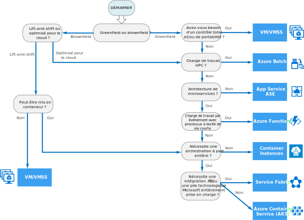

# Arbre de décision des services de calcul AzureDecision tree for Azure compute services

Azure offre de nombreuses manières d’héberger votre code d’application.Azure offers a number of ways to host your application code. Le terme *calcul* fait référence au modèle d’hébergement des ressources de calcul utilisées par votre application.The term *compute* refers to the hosting model for the computing resources that your application runs on. L’organigramme suivant vous aidera à choisir un service de calcul pour votre application.The following flowchart will help you to choose a compute service for your application.
 

Il vous guide au travers d’un ensemble de critères de décisions clé pour trouver une recommandation.The flowchart guides you through a set of key decision criteria to reach a recommendation. Chaque application dispose de ces exigences propres. Vous devez donc vous baser sur la recommandation pour commencer.Every application has unique requirements, so you should treat the recommendation as a starting point. Réalisez ensuite une analyse plus détaillée, en considérant les aspects suivants :Then perform a more detailed analysis, looking at aspects such as:
 
- Ensemble des fonctionnalitésFeature set
- [Limites du serviceService limits](/azure/azure-subscription-service-limits)
- [CoûtCost](https://azure.microsoft.com/pricing/)
- [Contrat SLASLA](https://azure.microsoft.com/support/legal/sla/)
- [Disponibilité régionaleRegional availability](https://azure.microsoft.com/global-infrastructure/services/)
- Écosystème de développement et compétences en équipeDeveloper ecosystem and team skills
- [Table de comparaison des calculsCompute comparison tables](./compute-comparison.md)

Si votre application comprend plusieurs charges de travail, évaluez-les séparément.If your application consists of multiple workloads, evaluate each workload separately. Une solution complète peut incorporer deux services de calcul ou plus.A complete solution may incorporate two or more compute services.

