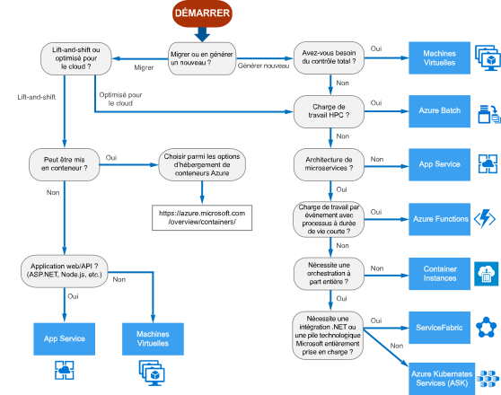

# Arbre de décision des services de calcul AzureDecision tree for Azure compute services

Azure offre de nombreuses manières d’héberger votre code d’application.Azure offers a number of ways to host your application code. Le terme *calcul* fait référence au modèle d’hébergement des ressources de calcul utilisées par votre application.The term *compute* refers to the hosting model for the computing resources that your application runs on. L’organigramme suivant vous aidera à choisir un service de calcul pour votre application.The following flowchart will help you to choose a compute service for your application. Il vous guide au travers d’un ensemble de critères de décisions clé pour trouver une recommandation.The flowchart guides you through a set of key decision criteria to reach a recommendation. 

**Traitez cet organigramme comme un point de départ.****Treat this flowchart as a starting point.** Chaque application dispose de ces exigences propres, utilisez donc la recommandation pour commencer.Every application has unique requirements, so use the recommendation as a starting point. Réalisez ensuite une évaluation plus détaillée, en considérant les aspects suivants :Then perform a more detailed evaluation, looking at aspects such as:
 
- Ensemble des fonctionnalitésFeature set
- [Limites du serviceService limits](/azure/azure-subscription-service-limits)
- [CoûtCost](https://azure.microsoft.com/pricing/)
- [CONTRAT SLASLA](https://azure.microsoft.com/support/legal/sla/)
- [Disponibilité régionaleRegional availability](https://azure.microsoft.com/global-infrastructure/services/)
- Écosystème de développement et compétences en équipeDeveloper ecosystem and team skills
- [Table de comparaison des calculsCompute comparison tables](./compute-comparison.md)

Si votre application comprend plusieurs charges de travail, évaluez-les séparément.If your application consists of multiple workloads, evaluate each workload separately. Une solution complète peut incorporer deux services de calcul ou plus.A complete solution may incorporate two or more compute services.

Pour plus d’informations sur les options d’hébergement des conteneurs dans Azure, consultez https://azure.microsoft.com/overview/containers/.For more information about your options for hosting containers in Azure, see https://azure.microsoft.com/overview/containers/.

## OrganigrammeFlowchart

## DéfinitionsDefinitions

- L’**opération « lift-and-shift »** est une stratégie visant à migrer une charge de travail vers le cloud sans reconcevoir l’application ou modifier le code.**Lift and shift** is a strategy for migrating a workload to the cloud without redesigning the application or making code changes. Elle est également appelée *ré-hébergement*.Also called *rehosting*. Pour plus d’informations, consultez [Centre de migration Azure](https://azure.microsoft.com/migration/).For more information, see [Azure migration center](https://azure.microsoft.com/migration/).

- **Optimisé pour le cloud** est une stratégie visant à migrer vers le cloud par la refactorisation d’une application, pour tirer parti des fonctionnalités cloud natives.**Cloud optimized** is a strategy for migrating to the cloud by refactoring an application to take advantage of cloud-native features and capabilities.

## Étapes suivantesNext steps

Pour connaître les autres critères à prendre en compte, consultez [Critères de sélection d’un service de calcul Azure](./compute-comparison.md).For additional criteria to consider, see [Criteria for choosing an Azure compute service](./compute-comparison.md).
