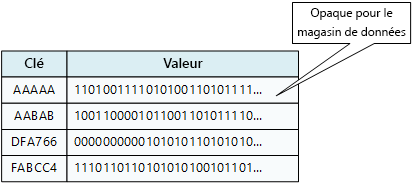
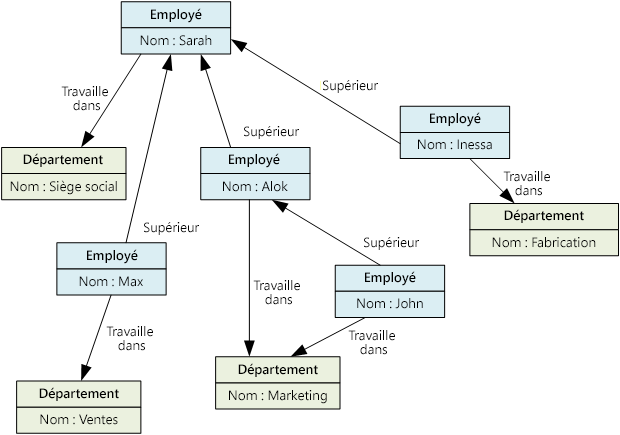
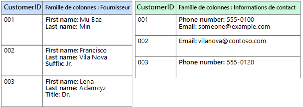

# Choisir le magasin de données correct

Les systèmes d’entreprise modernes gèrent des volumes de données de plus en plus grands. Les données peuvent provenir de services externes, être générées par le système même ou bien être créées par les utilisateurs. Ces jeux de données peuvent avoir des caractéristiques et des exigences de traitement très différentes. Les entreprises utilisent des données pour évaluer des tendances, déclencher des processus d’entreprise, faire l’audit de leurs opérations, analyser le comportement des clients et beaucoup d’autres choses. 

Cette hétérogénéité signifie qu’un magasin de données unique n’est généralement pas la meilleure approche. Au lieu de cela, il est souvent préférable de stocker les différents types de données dans plusieurs magasins de données, chacun étant consacré à une charge de travail ou un modèle d’utilisation spécifique. Le terme *persistance polyglotte* est utilisé pour décrire les solutions utilisant une combinaison de technologies de magasin de données.

La sélection du magasin de données correspondant à vos besoins est une décision de conception primordiale. Il existe des centaines d’implémentations possibles entre les bases de données SQL et NoSQL. Les magasins de données sont souvent classés selon la façon dont ils structurent les données et les types d’opérations qu’ils prennent en charge. Cet article décrit certains des modèles de stockage les plus courants. Notez qu’une technologie de magasin de données particulière peut prendre en charge plusieurs modèles de stockage. Par exemple, les systèmes de gestion de base de données relationnelle (SGBDR) peuvent également prendre en charge le stockage graphique ou de paires clé/valeur. En fait, il n’existe une tendance générale pour ce que l'on appelle la prise en charge *multimodèle*, où un système de base de données unique prend en charge plusieurs modèles. Mais il est toujours utile de comprendre les différents modèles à un niveau élevé. 

Tous les magasins de données d’une catégorie donnée ne fournissent pas le même ensemble de fonctionnalités. La plupart des magasins de données fournissent des fonctionnalités côté serveur pour demander et traiter des données. Cette fonctionnalité est parfois intégrée dans le moteur de stockage de données. Dans d’autres cas, les capacités de stockage et de traitement de données sont séparées, et il peut y avoir plusieurs options de traitement et d’analyse. Les magasins de données prennent également en charge différentes interfaces de programmation et de gestion. 

En règle générale, vous devriez commencer par envisager le modèle de stockage convenant le mieux à vos besoins. Envisagez ensuite un magasin de données particulier au sein de cette catégorie, en fonction de facteurs tels que les fonctionnalités, le coût et la facilité de gestion.

## Systèmes de gestion de base de données relationnelle

Les bases de données relationnelles organisent les données comme une série de tables à deux dimensions avec des lignes et des colonnes. Chaque table possède ses propres colonnes, et chaque ligne d’une table a le même jeu de colonnes. Ce modèle a une base mathématique et la plupart des fournisseurs fournissent un dialecte du langage SQL pour la récupération et la gestion des données. En règle générale, un SGBDR implémente un mécanisme cohérent au niveau transactionnel et conforme au modèle ACID (atomicité, cohérence, isolation, durabilité) pour mettre les informations à jour. 

Un SGBDR prend normalement en charge un modèle de schéma à l’écriture, où la structure de données est définie à l’avance, et toutes les opérations de lecture et d’écriture doivent utiliser ce schéma. Ce comportement diffère de la plupart des magasins de données NoSQL, particulièrement ceux du type clé/valeur, où le modèle de schéma à la lecture suppose que le client imposera son propre schéma d’interprétation sur les données issues de la base de données, et est indépendant du format des données écrites.

Un SGBDR est très utile lorsque de fortes garanties de cohérence sont importantes &mdash; où toutes les modifications sont atomiques et les transactions laissent toujours les données dans un état cohérent. Toutefois, les structures sous-jacentes ne se prêtent pas à la mise à l’échelle par la distribution du stockage et du traitement sur plusieurs ordinateurs. En outre, les informations stockées dans un système SGBDR, doivent être placées dans une structure relationnelle en suivant le processus de normalisation. Bien que ce processus soit bien compris, il peut entraîner un manque d’efficacité, à cause du besoin de désassembler les entités logiques dans des lignes au sein de tables distinctes, puis en remontant les données lors de l’exécution des requêtes. 

Service Azure approprié : 

- [Azure SQL Database][sql-db]
- [Azure Database pour MySQL][mysql]
- [Azure Database pour PostgreSQL][postgres]

## Magasins de clés/valeurs

Un magasin de clés/valeurs est essentiellement une table de hachage volumineuse. Vous associez chaque valeur de données à une clé unique, le magasin de clés/valeurs utilise cette clé pour stocker les données à l’aide d’une fonction de hachage appropriée. La fonction de hachage est sélectionnée pour offrir une répartition des clés hachées sur le stockage de données. 

La plupart des magasins de clés/valeurs prennent uniquement en charge les opérations simples de requête, d’insertion et de suppression. Pour modifier une valeur (partiellement ou entièrement), une application doit remplacer les données existantes pour la valeur entière. Dans la plupart des implémentations, la lecture ou écriture d’une valeur unique est une opération atomique. Si la valeur est grande, l’écriture peut prendre un certain temps. 

Une application peut stocker des données arbitraires en tant qu’ensemble de valeurs, bien que certains magasins de clés/valeurs imposent des limites sur la taille maximale des valeurs. Les valeurs stockées sont opaques pour le logiciel de système de stockage. Toutes les informations de schéma doivent être fournies et interprétées par l’application. Fondamentalement, les valeurs sont des objets BLOB et le magasin de clés/valeurs récupère ou stocke simplement la valeur par clé. 

Les magasins de clés/valeurs sont fortement optimisés pour les applications effectuant des recherches simples, mais ils sont moins adaptés aux systèmes qui doivent interroger des données dans plusieurs magasins de clés/valeurs. Les magasins de clés/valeurs ne sont pas optimisés pour les scénarios où la requête par valeur est plus importante que les recherches basées uniquement sur les clés. Par exemple, avec une base de données relationnelle, vous pouvez rechercher un enregistrement à l’aide d’une clause WHERE, mais généralement les magasins de clés/valeurs ne disposent pas de ce type de fonctionnalité de recherche pour les valeurs.

Un magasin de clés/valeurs unique peut être extrêmement évolutif, étant donné qu’il peut facilement distribuer des données entre plusieurs nœuds sur des machines distinctes. 

Services Azure appropriés : 

- [Cosmos DB][cosmosdb]
- [Cache Redis Azure][redis-cache]

## Bases de données de documents

Une base de données de documents est conceptuellement semblable à un magasin de clés/valeurs, à l’exception du fait qu’il stocke une collection de champs et de données nommés (sous forme de documents), qui pourraient être des éléments scalaires simples ou bien des éléments composés tels que des listes et des collections enfants. Les données dans les champs d’un document peuvent être encodées de différentes façons, notamment XML, YAML, JSON, BSON ou même stockées comme du texte brut. Contrairement aux magasins de clés/valeurs, les champs dans les documents sont exposés au système de gestion de stockage, permettant à une application d’interroger et de filtrer des données en utilisant les valeurs de ces champs. 

En règle générale, un document contient la totalité des données pour une entité. Les éléments constituant une entité sont spécifiques à l’application. Par exemple, une entité peut contenir les détails d’un client, d’une commande ou une combinaison des deux. Un seul document peut contenir des informations réparties sur plusieurs tables relationnelles dans un SGBDR. 

Un magasin de documents ne demande pas que tous les documents possèdent la même structure. Cette approche de forme libre offre une grande flexibilité. Les applications peuvent stocker des données différentes dans des documents selon les changements d’exigence pour l’entreprise.

L’application peut récupérer des documents à l’aide de la clé de document. Il s’agit d’un identificateur unique pour le document, souvent haché, pour aider à répartir les données uniformément. Certaines bases de données de documents créent automatiquement la clé de document. D’autres permettent de spécifier un attribut du document pour l’utiliser comme clé. L’application peut également interroger des documents en fonction de la valeur d’un ou plusieurs champs. Certaines bases de données de documents prennent en charge l’indexation pour faciliter la recherche rapide de documents basée sur un ou plusieurs champs indexés. 

Plusieurs bases de données de documents prennent en charge les mises à jour sur place, permettant à une application de modifier les valeurs des champs spécifiques dans un document sans réécrire la totalité du document. Les opérations de lecture et d’écriture sur plusieurs champs dans un seul document sont généralement atomiques.

Service Azure approprié : [Cosmos DB][cosmosdb]

## Bases de données de graphiques

Une base de données de graphiques stocke deux types d’informations, les nœuds et les bords. Vous pouvez considérer les nœuds comme des entités. Les bords qui définissent les relations entre les nœuds. Les nœuds et les bords peuvent avoir des propriétés fournissant des informations sur ce nœud ou ce bord, semblables aux colonnes dans une table. Les bords peuvent également avoir un sens indiquant la nature de la relation.

Une base de données de graphiques vise à permettre à une application d’effectuer efficacement des requêtes parcourant le réseau de nœuds de bords et d’analyser les relations entre des entités. Le diagramme suivant montre la structure de la base de données du personnel d’une entreprise sous forme de graphique. Les entités sont les employés et les services, les bords indiquent les relations hiérarchiques et le service de chaque employé. Dans ce graphique, les flèches sur les bords indiquent le sens des relations.
 

Cette structure simplifie l’exécution de requêtes telles que « Trouver tous les employés qui rendent compte directement ou indirectement à Sarah » ou « Qui travaille dans le même service que John ? » Pour les graphiques de grande taille avec un grand nombre d’entités et de relations, vous pouvez effectuer des analyses très complexes en un temps record. Plusieurs bases de données de graphiques fournissent un langage de requête que vous pouvez utiliser pour parcourir efficacement un réseau de relations. 

Service Azure approprié : [Cosmos DB][cosmosdb]

## Bases de données de familles de colonnes

Une base de données de familles de colonnes organise les données en lignes et en colonnes. Dans sa forme la plus simple, une base de données de familles de colonnes peut sembler, au moins sur le plan conceptuel, très similaire à une base de données relationnelle. La puissance d’une base de données de familles de colonnes se trouve dans son approche dénormalisé pour la structuration des données éparses. 

Vous pouvez considérer une base de données de familles de colonnes comme contenant des données tabulaires avec des lignes et des colonnes, mais les colonnes sont divisées en groupes nommés *familles de colonne*. Chaque famille de colonnes conserve un ensemble de colonnes logiquement liées entre elles et généralement récupérées ou manipulées en tant qu’unité. Les autres données accessibles séparément peuvent être stockées dans des familles de colonnes distinctes. Dans une famille de colonnes, de nouvelles colonnes peuvent être ajoutées dynamiquement, et des lignes peuvent être incomplètes (autrement dit, une ligne n’a pas besoin d’avoir une valeur pour chaque colonne).

Le diagramme suivant montre un exemple avec deux familles de colonnes, `Identity` et `Contact Info`. Les données d’une même entité ont la même clé de ligne dans chaque famille de colonnes. Cette structure, où les lignes pour un objet donné dans une famille de colonnes peuvent être modifiées dynamiquement, constitue un avantage important de l’approche par famille de colonnes, rendant cette forme de magasin de données hautement adaptée pour le stockage des données structurées et volatiles.

 

Contrairement à un magasin de clés/valeurs ou une base de données de documents, la plupart des bases de données de familles de colonnes stockent les données dans l’ordre des clés, plutôt qu’en calculant un hachage. De nombreuses implémentations permettent de créer des index sur des colonnes spécifiques dans une famille de colonnes. Les index vous permettent de récupérer des données à partir de la valeur des colonnes, au lieu d’utiliser la clé de ligne.

Les opérations de lecture et d’écriture pour une ligne sont généralement atomiques avec une famille de colonnes unique, même si certaines implémentations permettent l’atomicité sur la ligne entière, couvrant alors plusieurs familles de colonne.

Service Azure approprié : [HBase dans HDInsight][hbase]

## Analyse de données

Les magasins d’analyse de données proposent des solutions massivement parallèles pour les opérations de réception, de stockage et d’analyse des données. Ces données sont réparties sur plusieurs serveurs à l’aide d’une architecture sans aucun partage afin d’optimiser l’évolutivité et de réduire les dépendances. Les données ont peu de chances d’être statiques, ces magasins doivent donc être en mesure de gérer de grandes quantités d’informations, arrivant dans divers formats à partir de plusieurs flux, tout en continuant le traitement de nouvelles requêtes. 

Services Azure appropriés :

- [SQL Data Warehouse][sql-dw]
- [Azure Data Lake][data-lake]

## Bases de données de moteur de recherche  

Une base de données de moteur de recherche prend en charge la possibilité de rechercher des informations contenues dans des magasins de données et des services externes. Une base de données de moteur de recherche peut être utilisée pour indexer d’importants volumes de données et fournir un accès à ces index quasiment en temps réel. Bien que les bases de données de moteur de recherche soient généralement considérées comme synonymes d’internet, de nombreux systèmes à grande échelle les utilisent pour fournir des capacités de recherche structurées et ad hoc à leurs propres bases de données.

Les principales caractéristiques d’une base de données de moteur de recherche sont la possibilité de stocker et d’indexer les informations très rapidement, et de traiter les demandes de recherche avec un temps de réponse rapide. Les index peuvent être multidimensionnels et peuvent prendre en charge les recherches en texte libre sur de grands volumes de données de texte. L’indexation peut être effectuée à l’aide d’un modèle d’extraction, déclenché par la base de données de moteur de recherche, ou à l’aide d’un modèle d’émission, initié par le code de l’application externe. 

La recherche peut être exacte ou approximative. Une recherche approximative trouve les documents correspondant à un ensemble de conditions et calcule leur niveau de correspondance. Certains moteurs de recherche prennent également en charge l’analyse linguistique pouvant renvoyer les correspondances basées sur les synonymes, des expansions de genre (par exemple, mise en correspondance de `dogs` avec `pets`) et la recherche du radical (correspondance de mots avec la même racine). 

Service Azure approprié : [Recherche Azure][search]

## Bases de données de séries chronologiques

Les données de séries chronologiques sont des ensembles de valeurs organisées par l’heure, et une base de données de séries chronologiques est une base de données optimisée pour ce type de données. Les bases de données de séries chronologiques doivent prendre en charge un très grand nombre d’écritures, étant donné qu’elles collectent généralement d’importantes quantités de données en temps réel à partir d’un grand nombre de sources. Les mises à jour sont rares, et les suppressions sont souvent réalisées par des opérations en bloc. Bien que les enregistrements écrits dans une base de données de séries chronologiques sont généralement petits, il existe souvent un grand nombre d’enregistrements, et la taille totale des données peut croître rapidement.

Les bases de données de séries chronologiques conviennent au stockage des données de télémétrie. Les scénarios incluent des capteurs IoT ou des compteurs de l’application ou du système.

Service Azure approprié : [Time Series Insights][time-series]

## Stockage d’objets  

Le stockage d’objets est optimisé pour le stockage et la récupération d’objets binaires volumineux (images, fichiers, flux vidéo et audio, objets de données d’application et documents de grande taille, images de disque de machine virtuelle). Les objets dans ces types de magasin sont composés de données stockées, des métadonnées et un ID unique pour accéder à l’objet. Les magasins d’objets permettent de gérer de très grandes quantités de données non structurées.  

Service Azure approprié : [Stockage Blob][blob]

## Fichiers partagés   

Parfois, l’utilisation de fichiers plats simples est le moyen le plus efficace pour stocker et récupérer des informations. Les partages de fichiers permettent d’accéder aux fichiers via un réseau. Compte tenu de la sécurité et des mécanismes de contrôle d’accès simultanés, un tel partage de données peut permettre aux services distribués de fournir un accès de données hautement évolutif pour effectuer des opérations de base et de bas niveau telles que des requêtes simples de lecture et d’écriture.

Service Azure approprié : [Stockage Fichier][file-storage]

<!-- links -->

[blob]: https://azure.microsoft.com/services/storage/blobs/
[cosmosdb]: https://azure.microsoft.com/services/cosmos-db/
[data-lake]: https://azure.microsoft.com/solutions/data-lake/
[file-storage]: https://azure.microsoft.com/services/storage/files/
[hbase]: /azure/hdinsight/hdinsight-hbase-overview
[mysql]: https://azure.microsoft.com/services/mysql/
[postgres]: https://azure.microsoft.com/services/postgresql/
[redis-cache]: https://azure.microsoft.com/services/cache/
[search]: https://azure.microsoft.com/services/search/
[sql-db]: https://azure.microsoft.com/services/sql-database
[sql-dw]: https://azure.microsoft.com/services/sql-data-warehouse/
[time-series]: https://azure.microsoft.com/services/time-series-insights/
