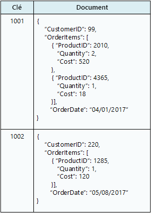

# Choisir le magasin de données correctChoose the right data store

Les systèmes d’entreprise modernes gèrent des volumes de données de plus en plus grands.Modern business systems manage increasingly large volumes of data. Les données peuvent provenir de services externes, être générées par le système même ou bien être créées par les utilisateurs.Data may be ingested from external services, generated by the system itself, or created by users. Ces jeux de données peuvent avoir des caractéristiques et des exigences de traitement très différentes.These data sets may have extremely varied characteristics and processing requirements. Les entreprises utilisent des données pour évaluer des tendances, déclencher des processus d’entreprise, faire l’audit de leurs opérations, analyser le comportement des clients et beaucoup d’autres choses.Businesses use data to assess trends, trigger business processes, audit their operations, analyze customer behavior, and many other things. 

Cette hétérogénéité signifie qu’un magasin de données unique n’est généralement pas la meilleure approche.This heterogeneity means that a single data store is usually not the best approach. Au lieu de cela, il est souvent préférable de stocker les différents types de données dans plusieurs magasins de données, chacun étant consacré à une charge de travail ou un modèle d’utilisation spécifique.Instead, it's often better to store different types of data in different data stores, each focused towards a specific workload or usage pattern. Le terme *persistance polyglotte* est utilisé pour décrire les solutions utilisant une combinaison de technologies de magasin de données.The term *polyglot persistence* is used to describe solutions that use a mix of data store technologies.

La sélection du magasin de données correspondant à vos besoins est une décision de conception primordiale.Selecting the right data store for your requirements is a key design decision. Il existe des centaines d’implémentations possibles entre les bases de données SQL et NoSQL.There are literally hundreds of implementations to choose from among SQL and NoSQL databases. Les magasins de données sont souvent classés selon la façon dont ils structurent les données et les types d’opérations qu’ils prennent en charge.Data stores are often categorized by how they structure data and the types of operations they support. Cet article décrit certains des modèles de stockage les plus courants.This article describes several of the most common storage models. Notez qu’une technologie de magasin de données particulière peut prendre en charge plusieurs modèles de stockage.Note that a particular data store technology may support multiple storage models. Par exemple, les systèmes de gestion de base de données relationnelle (SGBDR) peuvent également prendre en charge le stockage graphique ou de paires clé/valeur.For example, a relational database management systems (RDBMS) may also support key/value or graph storage. En fait, il n’existe une tendance générale pour ce que l'on appelle la prise en charge *multimodèle*, où un système de base de données unique prend en charge plusieurs modèles.In fact, there is a general trend for so-called *multimodel* support, where a single database system supports several models. Mais il est toujours utile de comprendre les différents modèles à un niveau élevé.But it's still useful to understand the different models at a high level. 

Tous les magasins de données d’une catégorie donnée ne fournissent pas le même ensemble de fonctionnalités.Not all data stores in a given category provide the same feature-set. La plupart des magasins de données fournissent des fonctionnalités côté serveur pour demander et traiter des données.Most data stores provide server-side functionality to query and process data. Cette fonctionnalité est parfois intégrée dans le moteur de stockage de données.Sometimes this functionality is built into the data storage engine. Dans d’autres cas, les capacités de stockage et de traitement de données sont séparées, et il peut y avoir plusieurs options de traitement et d’analyse.In other cases, the data storage and processing capabilities are separated, and there may be several options for processing and analysis. Les magasins de données prennent également en charge différentes interfaces de programmation et de gestion.Data stores also support different programmatic and management interfaces. 

En règle générale, vous devriez commencer par envisager le modèle de stockage convenant le mieux à vos besoins.Generally, you should start by considering which storage model is best suited for your requirements. Envisagez ensuite un magasin de données particulier au sein de cette catégorie, en fonction de facteurs tels que les fonctionnalités, le coût et la facilité de gestion.Then consider a particular data store within that category, based on factors such as feature set, cost, and ease of management.

## Systèmes de gestion de base de données relationnelleRelational database management systems

Les bases de données relationnelles organisent les données comme une série de tables à deux dimensions avec des lignes et des colonnes.Relational databases organize data as a series of two-dimensional tables with rows and columns. Chaque table possède ses propres colonnes, et chaque ligne d’une table a le même jeu de colonnes.Each table has its own columns, and every row in a table has the same set of columns. Ce modèle a une base mathématique et la plupart des fournisseurs fournissent un dialecte du langage SQL pour la récupération et la gestion des données.This model is mathematically based, and most vendors provide a dialect of the Structured Query Language (SQL) for retrieving and managing data. En règle générale, un SGBDR implémente un mécanisme cohérent au niveau transactionnel et conforme au modèle ACID (atomicité, cohérence, isolation, durabilité) pour mettre les informations à jour.An RDBMS typically implements a transactionally consistent mechanism that conforms to the ACID (Atomic, Consistent, Isolated, Durable) model for updating information. 

Un SGBDR prend normalement en charge un modèle de schéma à l’écriture, où la structure de données est définie à l’avance, et toutes les opérations de lecture et d’écriture doivent utiliser ce schéma.An RDBMS typically supports a schema-on-write model, where the data structure is defined ahead of time, and all read or write operations must use the schema. Ce comportement diffère de la plupart des magasins de données NoSQL, particulièrement ceux du type clé/valeur, où le modèle de schéma à la lecture suppose que le client imposera son propre schéma d’interprétation sur les données issues de la base de données, et est indépendant du format des données écrites.This is in contrast to most NoSQL data stores, particularly key/value types, where the schema-on-read model assumes that the client will be imposing its own interpretive schema on data coming out of the database, and is agnostic to the data format being written.

Un SGBDR est très utile lorsque de fortes garanties de cohérence sont importantes &mdash; où toutes les modifications sont atomiques et les transactions laissent toujours les données dans un état cohérent.An RDBMS is very useful when strong consistency guarantees are important &mdash; where all changes are atomic, and transactions always leave the data in a consistent state. Toutefois, les structures sous-jacentes ne se prêtent pas à la mise à l’échelle par la distribution du stockage et du traitement sur plusieurs ordinateurs.However, the underlying structures do not lend themselves to scaling out by distributing storage and processing across machines. En outre, les informations stockées dans un système SGBDR, doivent être placées dans une structure relationnelle en suivant le processus de normalisation.Also, information stored in an RDBMS, must be put into a relational structure by following the normalization process. Bien que ce processus soit bien compris, il peut entraîner un manque d’efficacité, à cause du besoin de désassembler les entités logiques dans des lignes au sein de tables distinctes, puis en remontant les données lors de l’exécution des requêtes.While this process is well understood, it can lead to inefficiencies, because of the need to disassemble logical entities into rows in separate tables, and then reassemble the data when running queries. 

Service Azure approprié :Relevant Azure service: 

- [Azure SQL Database][sql-db][Azure SQL Database][sql-db]
- [Azure Database pour MySQL][mysql][Azure Database for MySQL][mysql]
- [Azure Database pour PostgreSQL][postgres][Azure Database for PostgreSQL][postgres]

## Magasins de clés/valeursKey/value stores

Un magasin de clés/valeurs est essentiellement une table de hachage volumineuse.A key/value store is essentially a large hash table. Vous associez chaque valeur de données à une clé unique, le magasin de clés/valeurs utilise cette clé pour stocker les données à l’aide d’une fonction de hachage appropriée.You associate each data value with a unique key, and the key/value store uses this key to store the data by using an appropriate hashing function. La fonction de hachage est sélectionnée pour offrir une répartition des clés hachées sur le stockage de données.The hashing function is selected to provide an even distribution of hashed keys across the data storage. 

La plupart des magasins de clés/valeurs prennent uniquement en charge les opérations simples de requête, d’insertion et de suppression.Most key/value stores only support simple query, insert, and delete operations. Pour modifier une valeur (partiellement ou entièrement), une application doit remplacer les données existantes pour la valeur entière.To modify a value (either partially or completely), an application must overwrite the existing data for the entire value. Dans la plupart des implémentations, la lecture ou écriture d’une valeur unique est une opération atomique.In most implementations, reading or writing a single value is an atomic operation. Si la valeur est grande, l’écriture peut prendre un certain temps.If the value is large, writing may take some time. 

Une application peut stocker des données arbitraires en tant qu’ensemble de valeurs, bien que certains magasins de clés/valeurs imposent des limites sur la taille maximale des valeurs.An application can store arbitrary data as a set of values, although some key/value stores impose limits on the maximum size of values. Les valeurs stockées sont opaques pour le logiciel de système de stockage.The stored values are opaque to the storage system software. Toutes les informations de schéma doivent être fournies et interprétées par l’application.Any schema information must be provided and interpreted by the application. Fondamentalement, les valeurs sont des objets BLOB et le magasin de clés/valeurs récupère ou stocke simplement la valeur par clé.Essentially, values are blobs and the key/value store simply retrieves or stores the value by key. 

Les magasins de clés/valeurs sont fortement optimisés pour les applications effectuant des recherches simples, mais ils sont moins adaptés aux systèmes qui doivent interroger des données dans plusieurs magasins de clés/valeurs.Key/value stores are highly optimized for applications performing simple lookups, but are less suitable for systems that need to query data across different key/value stores. Les magasins de clés/valeurs ne sont pas optimisés pour les scénarios où la requête par valeur est plus importante que les recherches basées uniquement sur les clés.Key/value stores are also not optimized for scenarios where querying by value is important, rather than performing lookups based only on keys. Par exemple, avec une base de données relationnelle, vous pouvez rechercher un enregistrement à l’aide d’une clause WHERE, mais généralement les magasins de clés/valeurs ne disposent pas de ce type de fonctionnalité de recherche pour les valeurs.For example, with a relational database, you can find a record by using a WHERE clause, but key/values stores usually do not have this type of lookup capability for values.

Un magasin de clés/valeurs unique peut être extrêmement évolutif, étant donné qu’il peut facilement distribuer des données entre plusieurs nœuds sur des machines distinctes.A single key/value store can be extremely scalable, as the data store can easily distribute data across multiple nodes on separate machines. 

Services Azure appropriés :Relevant Azure services: 

- [Cosmos DB][cosmosdb][Cosmos DB][cosmosdb]
- [Cache Redis Azure][redis-cache][Azure Redis Cache][redis-cache]

## Bases de données de documentsDocument databases

Une base de données de documents est conceptuellement semblable à un magasin de clés/valeurs, à l’exception du fait qu’il stocke une collection de champs et de données nommés (sous forme de documents), qui pourraient être des éléments scalaires simples ou bien des éléments composés tels que des listes et des collections enfants.A document database is conceptually similar to a key/value store, except that it stores a collection of named fields and data (known as documents), each of which could be simple scalar items or compound elements such as lists and child collections. Les données dans les champs d’un document peuvent être encodées de différentes façons, notamment XML, YAML, JSON, BSON ou même stockées comme du texte brut.The data in the fields of a document can be encoded in a variety of ways, including XML, YAML, JSON, BSON,or even stored as plain text. Contrairement aux magasins de clés/valeurs, les champs dans les documents sont exposés au système de gestion de stockage, permettant à une application d’interroger et de filtrer des données en utilisant les valeurs de ces champs.Unlike key/value stores, the fields in documents are exposed to the storage management system, enabling an application to query and filter data by using the values in these fields. 

En règle générale, un document contient la totalité des données pour une entité.Typically, a document contains the entire data for an entity. Les éléments constituant une entité sont spécifiques à l’application.What items constitute an entity are application specific. Par exemple, une entité peut contenir les détails d’un client, d’une commande ou une combinaison des deux.For example, an entity could contain the details of a customer, an order, or a combination of both. Un seul document peut contenir des informations réparties sur plusieurs tables relationnelles dans un SGBDR.A single document may contain information that would be spread across several relational tables in an RDBMS. 

Un magasin de documents ne demande pas que tous les documents possèdent la même structure.A document store does not require that all documents have the same structure. Cette approche de forme libre offre une grande flexibilité.This free-form approach provides a great deal of flexibility. Les applications peuvent stocker des données différentes dans des documents selon les changements d’exigence pour l’entreprise.Applications can store different data in documents as business requirements change.

L’application peut récupérer des documents à l’aide de la clé de document.The application can retrieve documents by using the document key. Il s’agit d’un identificateur unique pour le document, souvent haché, pour aider à répartir les données uniformément.This is a unique identifier for the document, which is often hashed, to help distribute data evenly. Certaines bases de données de documents créent automatiquement la clé de document.Some document databases create the document key automatically. D’autres permettent de spécifier un attribut du document pour l’utiliser comme clé.Others enable you to specify an attribute of the document to use as the key. L’application peut également interroger des documents en fonction de la valeur d’un ou plusieurs champs.The application can also query documents based on the value of one or more fields. Certaines bases de données de documents prennent en charge l’indexation pour faciliter la recherche rapide de documents basée sur un ou plusieurs champs indexés.Some document databases support indexing to facilitate fast lookup of documents based on one or more indexed fields. 

Plusieurs bases de données de documents prennent en charge les mises à jour sur place, permettant à une application de modifier les valeurs des champs spécifiques dans un document sans réécrire la totalité du document.Many document databases support in-place updates, enabling an application to modify the values of specific fields in a document without rewriting the entire document. Les opérations de lecture et d’écriture sur plusieurs champs dans un seul document sont généralement atomiques.Read and write operations over multiple fields in a single document are usually atomic.

Service Azure approprié : [Cosmos DB][cosmosdb]Relevant Azure service: [Cosmos DB][cosmosdb]

## Bases de données de graphiquesGraph databases

Une base de données de graphiques stocke deux types d’informations, les nœuds et les bords.A graph database stores two types of information, nodes and edges. Vous pouvez considérer les nœuds comme des entités.You can think of nodes as entities. Les bords qui définissent les relations entre les nœuds.Edges which specify the relationships between nodes. Les nœuds et les bords peuvent avoir des propriétés fournissant des informations sur ce nœud ou ce bord, semblables aux colonnes dans une table.Both nodes and edges can have properties that provide information about that node or edge, similar to columns in a table. Les bords peuvent également avoir un sens indiquant la nature de la relation.Edges can also have a direction indicating the nature of the relationship.

Une base de données de graphiques vise à permettre à une application d’effectuer efficacement des requêtes parcourant le réseau de nœuds de bords et d’analyser les relations entre des entités.The purpose of a graph database is to allow an application to efficiently perform queries that traverse the network of nodes and edges, and to analyze the relationships between entities. Le diagramme suivant montre la structure de la base de données du personnel d’une entreprise sous forme de graphique.The follow diagram shows an organization's personnel database structured as a graph. Les entités sont les employés et les services, les bords indiquent les relations hiérarchiques et le service de chaque employé.The entities are employees and departments, and the edges indicate reporting relationships and the department in which employees work. Dans ce graphique, les flèches sur les bords indiquent le sens des relations.In this graph, the arrows on the edges show the direction of the relationships.
 

Cette structure simplifie l’exécution de requêtes telles que « Trouver tous les employés qui rendent compte directement ou indirectement à Sarah » ou « Qui travaille dans le même service que John ? »This structure makes it straightforward to perform queries such as "Find all employees who report directly or indirectly to Sarah" or "Who works in the same department as John?" Pour les graphiques de grande taille avec un grand nombre d’entités et de relations, vous pouvez effectuer des analyses très complexes en un temps record.For large graphs with lots of entities and relationships, you can perform very complex analyses very quickly. Plusieurs bases de données de graphiques fournissent un langage de requête que vous pouvez utiliser pour parcourir efficacement un réseau de relations.Many graph databases provide a query language that you can use to traverse a network of relationships efficiently. 

Service Azure approprié : [Cosmos DB][cosmosdb]Relevant Azure service: [Cosmos DB][cosmosdb]

## Bases de données de familles de colonnesColumn-family databases

Une base de données de familles de colonnes organise les données en lignes et en colonnes.A column-family database organizes data into rows and columns. Dans sa forme la plus simple, une base de données de familles de colonnes peut sembler, au moins sur le plan conceptuel, très similaire à une base de données relationnelle.In its simplest form, a column-family database can appear very similar to a relational database, at least conceptually. La puissance d’une base de données de familles de colonnes se trouve dans son approche dénormalisé pour la structuration des données éparses.The real power of a column-family database lies in its denormalized approach to structuring sparse data. 

Vous pouvez considérer une base de données de familles de colonnes comme contenant des données tabulaires avec des lignes et des colonnes, mais les colonnes sont divisées en groupes nommés *familles de colonne*.You can think of a column-family database as holding tabular data with rows and columns, but the columns are divided into groups known as *column families*. Chaque famille de colonnes conserve un ensemble de colonnes logiquement liées entre elles et généralement récupérées ou manipulées en tant qu’unité.Each column family holds a set of columns that are logically related together and are typically retrieved or manipulated as a unit. Les autres données accessibles séparément peuvent être stockées dans des familles de colonnes distinctes.Other data that is accessed separately can be stored in separate column families. Dans une famille de colonnes, de nouvelles colonnes peuvent être ajoutées dynamiquement, et des lignes peuvent être incomplètes (autrement dit, une ligne n’a pas besoin d’avoir une valeur pour chaque colonne).Within a column family, new columns can be added dynamically, and rows can be sparse (that is, a row doesn't need to have a value for every column).

Le diagramme suivant montre un exemple avec deux familles de colonnes, `Identity` et `Contact Info`.The following diagram shows an example with two column families, `Identity` and `Contact Info`. Les données d’une même entité ont la même clé de ligne dans chaque famille de colonnes.The data for a single entity has the same row key in each column-family. Cette structure, où les lignes pour un objet donné dans une famille de colonnes peuvent être modifiées dynamiquement, constitue un avantage important de l’approche par famille de colonnes, rendant cette forme de magasin de données hautement adaptée pour le stockage des données structurées et volatiles.This structure, where the rows for any given object in a column family can vary dynamically, is an important benefit of the column-family approach, making this form of data store highly suited for storing structured, volatile data.

 

Contrairement à un magasin de clés/valeurs ou une base de données de documents, la plupart des bases de données de familles de colonnes stockent les données dans l’ordre des clés, plutôt qu’en calculant un hachage.Unlike a key/value store or a document database, most column-family databases store data in key order, rather than by computing a hash. De nombreuses implémentations permettent de créer des index sur des colonnes spécifiques dans une famille de colonnes.Many implementations allow you to create indexes over specific columns in a column-family. Les index vous permettent de récupérer des données à partir de la valeur des colonnes, au lieu d’utiliser la clé de ligne.Indexes let you retrieve data by columns value, rather than row key.

Les opérations de lecture et d’écriture pour une ligne sont généralement atomiques avec une famille de colonnes unique, même si certaines implémentations permettent l’atomicité sur la ligne entière, couvrant alors plusieurs familles de colonne.Read and write operations for a row are usually atomic with a single column-family, although some implementations provide atomicity across the entire row, spanning multiple column-families.

Service Azure approprié : [HBase dans HDInsight][hbase]Relevant Azure service: [HBase in HDInsight][hbase]

## Analyse de donnéesData analytics

Les magasins d’analyse de données proposent des solutions massivement parallèles pour les opérations de réception, de stockage et d’analyse des données.Data analytics stores provide massively parallel solutions for ingesting, storing, and analyzing data. Ces données sont réparties sur plusieurs serveurs à l’aide d’une architecture sans aucun partage afin d’optimiser l’évolutivité et de réduire les dépendances.This data is distributed across multiple servers using a share-nothing architecture to maximize scalability and minimize dependencies. Les données ont peu de chances d’être statiques, ces magasins doivent donc être en mesure de gérer de grandes quantités d’informations, arrivant dans divers formats à partir de plusieurs flux, tout en continuant le traitement de nouvelles requêtes.The data is unlikely to be static, so these stores must be able to handle large quantities of information, arriving in a variety of formats from multiple streams, while continuing to process new queries. 

Services Azure appropriés :Relevant Azure services:

- [SQL Data Warehouse][sql-dw][SQL Data Warehouse][sql-dw]
- [Azure Data Lake][data-lake][Azure Data Lake][data-lake]

## Bases de données de moteur de rechercheSearch Engine Databases  

Une base de données de moteur de recherche prend en charge la possibilité de rechercher des informations contenues dans des magasins de données et des services externes.A search engine database supports the ability to search for information held in external data stores and services. Une base de données de moteur de recherche peut être utilisée pour indexer d’importants volumes de données et fournir un accès à ces index quasiment en temps réel.A search engine database can be used to index massive volumes of data and provide near real-time access to these indexes. Bien que les bases de données de moteur de recherche soient généralement considérées comme synonymes d’internet, de nombreux systèmes à grande échelle les utilisent pour fournir des capacités de recherche structurées et ad hoc à leurs propres bases de données.Although search engine databases are commonly thought of as being synonymous with the web, many large-scale systems use them to provide structured and ad-hoc search capabilities on top of their own databases.

Les principales caractéristiques d’une base de données de moteur de recherche sont la possibilité de stocker et d’indexer les informations très rapidement, et de traiter les demandes de recherche avec un temps de réponse rapide.The key characteristics of a search engine database are the ability to store and index information very quickly, and provide fast response times for search requests. Les index peuvent être multidimensionnels et peuvent prendre en charge les recherches en texte libre sur de grands volumes de données de texte.Indexes can be multi-dimensional and may support free-text searches across large volumes of text data. L’indexation peut être effectuée à l’aide d’un modèle d’extraction, déclenché par la base de données de moteur de recherche, ou à l’aide d’un modèle d’émission, initié par le code de l’application externe.Indexing can be performed using a pull model, triggered by the search engine database, or using a push model, initiated by external application code. 

La recherche peut être exacte ou approximative.Searching can be exact or fuzzy. Une recherche approximative trouve les documents correspondant à un ensemble de conditions et calcule leur niveau de correspondance.A fuzzy search finds documents that match a set of terms and calculates how closely they match. Certains moteurs de recherche prennent également en charge l’analyse linguistique pouvant renvoyer les correspondances basées sur les synonymes, des expansions de genre (par exemple, mise en correspondance de `dogs` avec `pets`) et la recherche du radical (correspondance de mots avec la même racine).Some search engines also support linguistic analysis that can return matches based on synonyms, genre expansions (for example, matching `dogs` to `pets`), and stemming (matching words with the same root). 

Service Azure approprié : [Recherche Azure][search]Relevant Azure service: [Azure Search][search]

## Bases de données de séries chronologiquesTime Series Databases

Les données de séries chronologiques sont des ensembles de valeurs organisées par l’heure, et une base de données de séries chronologiques est une base de données optimisée pour ce type de données.Time series data is a set of values organized by time, and a time series database is a database that is optimized for this type of data. Les bases de données de séries chronologiques doivent prendre en charge un très grand nombre d’écritures, étant donné qu’elles collectent généralement d’importantes quantités de données en temps réel à partir d’un grand nombre de sources.Time series databases must support a very high number of writes, as they typically collect large amounts of data in real time from a large number of sources. Les mises à jour sont rares, et les suppressions sont souvent réalisées par des opérations en bloc.Updates are rare, and deletes are often done as bulk operations. Bien que les enregistrements écrits dans une base de données de séries chronologiques sont généralement petits, il existe souvent un grand nombre d’enregistrements, et la taille totale des données peut croître rapidement.Although the records written to a time-series database are generally small,  there are often a large number of records, and total data size can grow rapidly.

Les bases de données de séries chronologiques conviennent au stockage des données de télémétrie.Time series databases are good for storing telemetry data. Les scénarios incluent des capteurs IoT ou des compteurs de l’application ou du système.Scenarios include IoT sensors or application/system counters.

Service Azure approprié : [Time Series Insights][time-series]Relevant Azure service: [Time Series Insights][time-series]

## Stockage d’objetsObject storage  

Le stockage d’objets est optimisé pour le stockage et la récupération d’objets binaires volumineux (images, fichiers, flux vidéo et audio, objets de données d’application et documents de grande taille, images de disque de machine virtuelle).Object storage is optimized for storing and retrieving large binary objects (images, files, video and audio streams, large application data objects and documents, virtual machine disk images). Les objets dans ces types de magasin sont composés de données stockées, des métadonnées et un ID unique pour accéder à l’objet.Objects in these store types are composed of the stored data, some metadata, and a unique ID for accessing the object. Les magasins d’objets permettent de gérer de très grandes quantités de données non structurées.Object stores enables the management of extremely large amounts of unstructured data.  

Service Azure approprié : [Stockage Blob][blob]Relevant Azure service: [Blob Storage][blob]

## Fichiers partagésShared files   

Parfois, l’utilisation de fichiers plats simples est le moyen le plus efficace pour stocker et récupérer des informations.Sometimes, using simple flat files can be the most effective means of storing and retrieving information. Les partages de fichiers permettent d’accéder aux fichiers via un réseau.Using file shares enables files to be accessed across a network. Compte tenu de la sécurité et des mécanismes de contrôle d’accès simultanés, un tel partage de données peut permettre aux services distribués de fournir un accès de données hautement évolutif pour effectuer des opérations de base et de bas niveau telles que des requêtes simples de lecture et d’écriture.Given appropriate security and concurrent access control mechanisms, sharing data in this way can enable distributed services to provide highly scalable data access for performing basic, low-level operations such as simple read and write requests.

Service Azure approprié : [Stockage Fichier][file-storage]Relevant Azure service: [File Storage][file-storage]

<!-- links -->

[blob]: https://azure.microsoft.com/services/storage/blobs/
[cosmosdb]: https://azure.microsoft.com/services/cosmos-db/
[data-lake]: https://azure.microsoft.com/solutions/data-lake/
[file-storage]: https://azure.microsoft.com/services/storage/files/
[hbase]: /azure/hdinsight/hdinsight-hbase-overview
[mysql]: https://azure.microsoft.com/services/mysql/
[postgres]: https://azure.microsoft.com/services/postgresql/
[redis-cache]: https://azure.microsoft.com/services/cache/
[search]: https://azure.microsoft.com/services/search/
[sql-db]: https://azure.microsoft.com/services/sql-database
[sql-dw]: https://azure.microsoft.com/services/sql-data-warehouse/
[time-series]: https://azure.microsoft.com/services/time-series-insights/