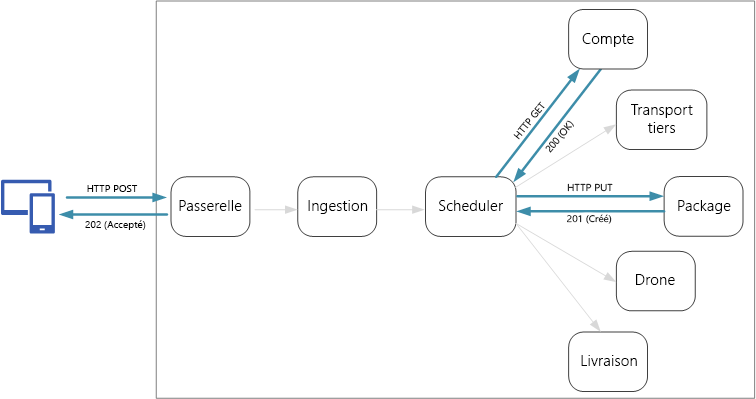
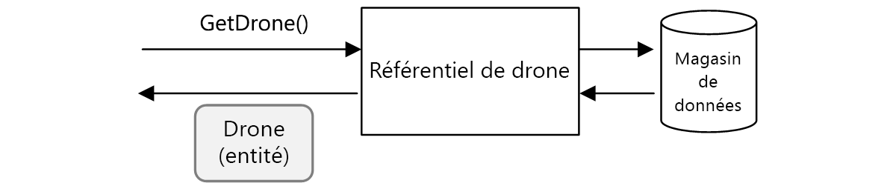
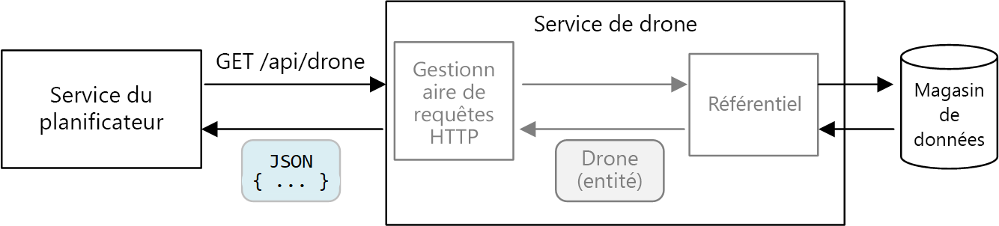
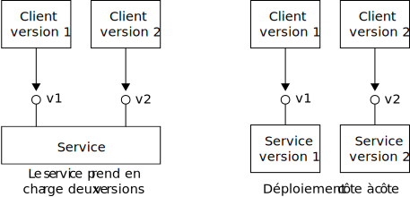

# <a name="designing-microservices-api-design"></a><span data-ttu-id="f8188-103">Conception de microservices : conception d’API</span><span class="sxs-lookup"><span data-stu-id="f8188-103">Designing microservices: API design</span></span>

<span data-ttu-id="f8188-104">Il est essentiel qu’une architecture de microservices intègre des API efficaces, car tous les échanges de données entre les services s’effectuent par le biais de messages ou d’appels d’API.</span><span class="sxs-lookup"><span data-stu-id="f8188-104">Good API design is important in a microservices architecture, because all data exchange between services happens either through messages or API calls.</span></span> <span data-ttu-id="f8188-105">Des API efficaces évitent la création [d’E/S bavardes](../antipatterns/chatty-io/index.md).</span><span class="sxs-lookup"><span data-stu-id="f8188-105">APIs must be efficient to avoid creating [chatty I/O](../antipatterns/chatty-io/index.md).</span></span> <span data-ttu-id="f8188-106">Les services étant conçus par des équipes qui travaillent indépendamment les unes des autres, les API doivent comporter des schémas de sémantique et de contrôle de version bien définis afin que les mises à jour n’interrompent pas d’autres services.</span><span class="sxs-lookup"><span data-stu-id="f8188-106">Because services are designed by teams working independently, APIs must have well-defined semantics and versioning schemes, so that updates don't break other services.</span></span>



<span data-ttu-id="f8188-107">Il est important d’établir une distinction entre deux types d’API :</span><span class="sxs-lookup"><span data-stu-id="f8188-107">It's important to distinguish between two types of API:</span></span>

- <span data-ttu-id="f8188-108">API publiques appelées par les applications clientes ;</span><span class="sxs-lookup"><span data-stu-id="f8188-108">Public APIs that client applications call.</span></span> 
- <span data-ttu-id="f8188-109">API principales utilisées pour la communication interservice.</span><span class="sxs-lookup"><span data-stu-id="f8188-109">Backend APIs that are used for interservice communication.</span></span>

<span data-ttu-id="f8188-110">Ces deux cas d’usage présentent des exigences quelque peu différentes.</span><span class="sxs-lookup"><span data-stu-id="f8188-110">These two use cases have somewhat different requirements.</span></span> <span data-ttu-id="f8188-111">Une API publique doit être compatible avec les applications clientes, qui correspondent généralement à des applications de navigateur ou à des applications mobiles natives.</span><span class="sxs-lookup"><span data-stu-id="f8188-111">A public API must be compatible with client applications, typically browser applications or native mobile applications.</span></span> <span data-ttu-id="f8188-112">La plupart du temps, cela signifie que l’API publique utilisera REST sur HTTP.</span><span class="sxs-lookup"><span data-stu-id="f8188-112">Most of the time, that means the public API will use REST over HTTP.</span></span> <span data-ttu-id="f8188-113">En revanche, dans le cas des API principales, vous devez prendre en compte les performances réseau.</span><span class="sxs-lookup"><span data-stu-id="f8188-113">For the backend APIs, however, you need to take network performance into account.</span></span> <span data-ttu-id="f8188-114">Selon la granularité de vos services, la communication interservice peut entraîner un trafic réseau très dense.</span><span class="sxs-lookup"><span data-stu-id="f8188-114">Depending on the granularity of your services, interservice communication can result in a lot of network traffic.</span></span> <span data-ttu-id="f8188-115">Les services sont susceptibles de devenir rapidement liés aux E/S.</span><span class="sxs-lookup"><span data-stu-id="f8188-115">Services can quickly become I/O bound.</span></span> <span data-ttu-id="f8188-116">Il est alors indispensable de prendre en compte d’autres facteurs, tels que la vitesse de sérialisation et la taille de charge utile.</span><span class="sxs-lookup"><span data-stu-id="f8188-116">For that reason, considerations such as serialization speed and payload size become more important.</span></span> <span data-ttu-id="f8188-117">Il existe certaines alternatives courantes à l’utilisation de REST sur HTTP, telles que gRPC, Apache Avro et Apache Thrift.</span><span class="sxs-lookup"><span data-stu-id="f8188-117">Some popular alternatives to using REST over HTTP include gRPC, Apache Avro, and Apache Thrift.</span></span> <span data-ttu-id="f8188-118">Ces protocoles prennent en charge la sérialisation binaire et se révèlent généralement plus efficaces que HTTP.</span><span class="sxs-lookup"><span data-stu-id="f8188-118">These protocols support binary serialization and are generally more efficient than HTTP.</span></span>

## <a name="considerations"></a><span data-ttu-id="f8188-119">Considérations</span><span class="sxs-lookup"><span data-stu-id="f8188-119">Considerations</span></span>

<span data-ttu-id="f8188-120">Voici quelques points à prendre en compte lors du choix du mode d’implémentation d’une API.</span><span class="sxs-lookup"><span data-stu-id="f8188-120">Here are some things to think about when choosing how to implement an API.</span></span>

<span data-ttu-id="f8188-121">**Comparaison entre REST et RPC**.</span><span class="sxs-lookup"><span data-stu-id="f8188-121">**REST vs RPC**.</span></span> <span data-ttu-id="f8188-122">Comparez les compromis induits par l’utilisation d’une interface de style REST et par l’emploi d’une interface de style RPC.</span><span class="sxs-lookup"><span data-stu-id="f8188-122">Consider the tradeoffs between using a REST-style interface versus an RPC-style interface.</span></span>

- <span data-ttu-id="f8188-123">Le style REST modélise les ressources et peut ainsi vous permettre d’exprimer votre modèle de domaine de façon naturelle.</span><span class="sxs-lookup"><span data-stu-id="f8188-123">REST models resources, which can be a natural way express your domain model.</span></span> <span data-ttu-id="f8188-124">Il définit une interface uniforme reposant sur les verbes HTTP, ce qui favorise l’évolutivité.</span><span class="sxs-lookup"><span data-stu-id="f8188-124">It defines a uniform interface based on HTTP verbs, which encourages evolvability.</span></span> <span data-ttu-id="f8188-125">REST comporte une sémantique bien définie en termes d’idempotence, d’effets secondaires et de codes de réponse.</span><span class="sxs-lookup"><span data-stu-id="f8188-125">It has well-defined semantics in terms of idempotency, side effects, and response codes.</span></span> <span data-ttu-id="f8188-126">En outre, il applique une communication sans état, ce qui améliore l’extensibilité.</span><span class="sxs-lookup"><span data-stu-id="f8188-126">And it enforces stateless communication, which improves scalability.</span></span> 

- <span data-ttu-id="f8188-127">RPC est davantage axé sur les opérations ou sur les commandes.</span><span class="sxs-lookup"><span data-stu-id="f8188-127">RPC is more oriented around operations or commands.</span></span> <span data-ttu-id="f8188-128">Étant donné que les interfaces RPC sont comparables à des appels de méthode locaux, elles peuvent vous amener à concevoir des API excessivement bavardes.</span><span class="sxs-lookup"><span data-stu-id="f8188-128">Because RPC interfaces look like local method calls, it may lead you to design overly chatty APIs.</span></span> <span data-ttu-id="f8188-129">Toutefois, cela n’implique pas que le mécanisme RPC soit lui-même bavard.</span><span class="sxs-lookup"><span data-stu-id="f8188-129">However, that doesn't mean RPC must be chatty.</span></span> <span data-ttu-id="f8188-130">Cela signifie simplement que vous devez accorder un soin tout particulier à la conception de l’interface.</span><span class="sxs-lookup"><span data-stu-id="f8188-130">It just means you need to use care when designing the interface.</span></span>

<span data-ttu-id="f8188-131">Dans le cas d’une interface RESTful, le choix le plus courant consiste à utiliser REST sur HTTP à l’aide de JSON.</span><span class="sxs-lookup"><span data-stu-id="f8188-131">For a RESTful interface, the most common choice is REST over HTTP using JSON.</span></span> <span data-ttu-id="f8188-132">Pour une interface de style RPC, il existe plusieurs infrastructures courantes, telles que gRPC, Apache Avro et Apache Thrift.</span><span class="sxs-lookup"><span data-stu-id="f8188-132">For an RPC-style interface, there are several popular frameworks, including gRPC, Apache  Avro, and Apache Thrift.</span></span>

<span data-ttu-id="f8188-133">**Efficacité**.</span><span class="sxs-lookup"><span data-stu-id="f8188-133">**Efficiency**.</span></span> <span data-ttu-id="f8188-134">Considérez l’efficacité en termes de taille, de mémoire et de taille de charge utile.</span><span class="sxs-lookup"><span data-stu-id="f8188-134">Consider efficiency in terms of speed, memory, and payload size.</span></span> <span data-ttu-id="f8188-135">Une interface basée sur gRPC se révèle généralement plus rapide que REST sur HTTP.</span><span class="sxs-lookup"><span data-stu-id="f8188-135">Typically a gRPC-based interface is faster than REST over HTTP.</span></span>

<span data-ttu-id="f8188-136">**Interface Definition Language (IDL)**.</span><span class="sxs-lookup"><span data-stu-id="f8188-136">**Interface definition language (IDL)**.</span></span> <span data-ttu-id="f8188-137">Un langage IDL est utilisé pour définir les méthodes, les paramètres et les valeurs renvoyées d’une API.</span><span class="sxs-lookup"><span data-stu-id="f8188-137">An IDL is used to define the methods, parameters, and return values of an API.</span></span> <span data-ttu-id="f8188-138">Il est possible d’utiliser un IDL pour générer le code client, le code de sérialisation et la documentation sur les API.</span><span class="sxs-lookup"><span data-stu-id="f8188-138">An IDL can be used to generate client code, serialization code, and API documentation.</span></span> <span data-ttu-id="f8188-139">Les IDL peuvent également être consommés par des outils de test d’API tels que Postman.</span><span class="sxs-lookup"><span data-stu-id="f8188-139">IDLs can also be consumed by API testing tools such as Postman.</span></span> <span data-ttu-id="f8188-140">Les infrastructures comme gRPC, Avro et Thrift définissent leurs propres spécifications IDL.</span><span class="sxs-lookup"><span data-stu-id="f8188-140">Frameworks such as gRPC, Avro, and Thrift define their own IDL specifications.</span></span> <span data-ttu-id="f8188-141">REST sur HTTP ne présente pas un format IDL standard, mais un choix courant consiste à utiliser OpenAPI (anciennement Swagger).</span><span class="sxs-lookup"><span data-stu-id="f8188-141">REST over HTTP does not have a standard IDL format, but a common choice is OpenAPI (formerly Swagger).</span></span> <span data-ttu-id="f8188-142">Vous pouvez également créer une API REST HTTP sans utiliser de langage de définition formel, mais vous perdrez alors les avantages des fonctions de génération et de test du code.</span><span class="sxs-lookup"><span data-stu-id="f8188-142">You can also create an HTTP REST API without using a formal definition language, but then you lose the benefits of code generation and testing.</span></span>

<span data-ttu-id="f8188-143">**Sérialisation**.</span><span class="sxs-lookup"><span data-stu-id="f8188-143">**Serialization**.</span></span> <span data-ttu-id="f8188-144">De quelle manière les objets sont-ils sérialisés sur le réseau ?</span><span class="sxs-lookup"><span data-stu-id="f8188-144">How are objects serialized over the wire?</span></span> <span data-ttu-id="f8188-145">Les options possibles comprennent les formats reposant sur du texte (principalement JSON) et les formats binaires tels que la mémoire tampon de protocole.</span><span class="sxs-lookup"><span data-stu-id="f8188-145">Options include text-based formats (primarily JSON) and binary formats such as protocol buffer.</span></span> <span data-ttu-id="f8188-146">Les formats binaires sont généralement plus rapides que les formats texte.</span><span class="sxs-lookup"><span data-stu-id="f8188-146">Binary formats are generally faster than text-based formats.</span></span> <span data-ttu-id="f8188-147">Toutefois, JSON présente des avantages en termes d’interopérabilité, car la plupart des langages et des infrastructures prennent en charge la sérialisation JSON.</span><span class="sxs-lookup"><span data-stu-id="f8188-147">However, JSON has advantages in terms of interoperability, because most languages and frameworks support JSON serialization.</span></span> <span data-ttu-id="f8188-148">Certains formats de sérialisation nécessitent un schéma fixe, tandis que d’autres requièrent la compilation d’un fichier de définition de schéma.</span><span class="sxs-lookup"><span data-stu-id="f8188-148">Some serialization formats require a fixed schema, and some require compiling a schema definition file.</span></span> <span data-ttu-id="f8188-149">Dans ce cas, vous devrez intégrer cette étape dans votre processus de génération.</span><span class="sxs-lookup"><span data-stu-id="f8188-149">In that case, you'll need to incorporate this step into your build process.</span></span> 

<span data-ttu-id="f8188-150">**Infrastructures et langages pris en charge**.</span><span class="sxs-lookup"><span data-stu-id="f8188-150">**Framework and language support**.</span></span> <span data-ttu-id="f8188-151">Le protocole HTTP est pris en charge dans la quasi-totalité des infrastructures et des langages.</span><span class="sxs-lookup"><span data-stu-id="f8188-151">HTTP is supported in nearly every framework and language.</span></span> <span data-ttu-id="f8188-152">Les infrastructures gRPC, Avro et Thrift comportent toutes des bibliothèques pour C++, C#, Java et Python.</span><span class="sxs-lookup"><span data-stu-id="f8188-152">gRPC, Avro, and Thrift all have libraries for C++, C#, Java, and Python.</span></span> <span data-ttu-id="f8188-153">Thrift et gRPC prennent également en charge Go.</span><span class="sxs-lookup"><span data-stu-id="f8188-153">Thrift and gRPC also support Go.</span></span> 

<span data-ttu-id="f8188-154">**Compatibilité et interopérabilité**.</span><span class="sxs-lookup"><span data-stu-id="f8188-154">**Compatibility and interoperability**.</span></span> <span data-ttu-id="f8188-155">Si vous choisissez un protocole tel que gRPC, vous pouvez avoir besoin d’une couche de traduction de protocole entre l’API publique et le back end.</span><span class="sxs-lookup"><span data-stu-id="f8188-155">If you choose a protocol like gRPC, you may need a protocol translation layer between the public API and the back end.</span></span> <span data-ttu-id="f8188-156">Une [passerelle](./gateway.md) peut assurer cette fonction.</span><span class="sxs-lookup"><span data-stu-id="f8188-156">A [gateway](./gateway.md) can perform that function.</span></span> <span data-ttu-id="f8188-157">Si vous utilisez une maille de services, considérez les protocoles qui sont compatibles avec cette dernière.</span><span class="sxs-lookup"><span data-stu-id="f8188-157">If you are using a service mesh, consider which protocols are compatible with the service mesh.</span></span> <span data-ttu-id="f8188-158">Par exemple, linkerd intègre une prise en charge de HTTP, de Thrift et de gRPC.</span><span class="sxs-lookup"><span data-stu-id="f8188-158">For example, linkerd has built-in support for HTTP, Thrift, and gRPC.</span></span> 

<span data-ttu-id="f8188-159">Nous vous recommandons de choisir REST sur HTTP, sauf si vous souhaitez bénéficier des avantages en termes de performances offerts par un protocole binaire.</span><span class="sxs-lookup"><span data-stu-id="f8188-159">Our baseline recommendation is to choose REST over HTTP unless you need the performance benefits of a binary protocol.</span></span> <span data-ttu-id="f8188-160">REST sur HTTP ne requiert aucune bibliothèque spéciale.</span><span class="sxs-lookup"><span data-stu-id="f8188-160">REST over HTTP requires no special libraries.</span></span> <span data-ttu-id="f8188-161">Il crée un couplage minimal, car les appelants n’ont pas besoin d’un stub client pour communiquer avec le service.</span><span class="sxs-lookup"><span data-stu-id="f8188-161">It creates minimal coupling, because callers don't need a client stub to communicate with the service.</span></span> <span data-ttu-id="f8188-162">Des écosystèmes d’outils élaborés prennent en charge les définitions de schéma, ainsi que les fonctions de test et de surveillance des points de terminaison HTTP RESTful.</span><span class="sxs-lookup"><span data-stu-id="f8188-162">There is rich ecosystems of tools to support schema definitions, testing, and monitoring of RESTful HTTP endpoints.</span></span> <span data-ttu-id="f8188-163">Enfin, HTTP est compatible avec les clients de navigateur, éliminant ainsi la nécessité de disposer d’une couche de traduction de protocole entre le client et le serveur principal.</span><span class="sxs-lookup"><span data-stu-id="f8188-163">Finally, HTTP is compatible with browser clients, so you don't need a protocol translation layer between the client and the backend.</span></span> 

<span data-ttu-id="f8188-164">Toutefois, si vous choisissez REST sur HTTP, vous devez procéder à des tests de performances et de charge au début du processus de développement afin de vérifier que cette méthode fournit des résultats satisfaisants pour votre scénario.</span><span class="sxs-lookup"><span data-stu-id="f8188-164">However, if you choose REST over HTTP, you should do performance and load testing early in the development process, to validate whether it performs well enough for your scenario.</span></span>

## <a name="restful-api-design"></a><span data-ttu-id="f8188-165">Conception d’API RESTful</span><span class="sxs-lookup"><span data-stu-id="f8188-165">RESTful API design</span></span>

<span data-ttu-id="f8188-166">Vous disposez de nombreuses ressources pour concevoir des API RESTful.</span><span class="sxs-lookup"><span data-stu-id="f8188-166">There are many resources for designing RESTful APIs.</span></span> <span data-ttu-id="f8188-167">Vous trouverez ci-après quelques ressources qui pourront vous être utiles :</span><span class="sxs-lookup"><span data-stu-id="f8188-167">Here are some that you might find helpful:</span></span>

- [<span data-ttu-id="f8188-168">Conception d’API</span><span class="sxs-lookup"><span data-stu-id="f8188-168">API design</span></span>](../best-practices/api-design.md) 

- [<span data-ttu-id="f8188-169">Implémentation de l’API</span><span class="sxs-lookup"><span data-stu-id="f8188-169">API implementation</span></span>](../best-practices/api-implementation.md) 

- [<span data-ttu-id="f8188-170">Microsoft REST API Guidelines (Directives relatives aux API REST Microsoft)</span><span class="sxs-lookup"><span data-stu-id="f8188-170">Microsoft REST API Guidelines</span></span>](https://github.com/Microsoft/api-guidelines)

<span data-ttu-id="f8188-171">Voici quelques considérations spécifiques à prendre en compte.</span><span class="sxs-lookup"><span data-stu-id="f8188-171">Here are some specific considerations to keep in mind.</span></span>

- <span data-ttu-id="f8188-172">Prenez garde aux API qui communiquent des détails de l’implémentation interne ou qui reflètent simplement un schéma de base de données interne.</span><span class="sxs-lookup"><span data-stu-id="f8188-172">Watch out for APIs that leak internal implementation details or simply mirror an internal database schema.</span></span> <span data-ttu-id="f8188-173">L’API doit modéliser le domaine.</span><span class="sxs-lookup"><span data-stu-id="f8188-173">The API should model the domain.</span></span> <span data-ttu-id="f8188-174">Elle constitue un contrat entre les services, et dans l’idéal, ne doit changer qu’en cas d’ajout de nouvelles fonctionnalités, et non pour la simple raison que vous avez refactorisé du code ou normalisé une table de base de données.</span><span class="sxs-lookup"><span data-stu-id="f8188-174">It's a contract between services, and ideally should only change when new functionality is added, not just because you refactored some code or normalized a database table.</span></span> 

- <span data-ttu-id="f8188-175">Les tailles de charge utile ou les modèles d’interaction requis peuvent varier selon les types de clients (interface d’applications mobiles, navigateur web de bureau, etc.).</span><span class="sxs-lookup"><span data-stu-id="f8188-175">Different types of client, such as mobile application and desktop web browser, may require different payload sizes or interaction patterns.</span></span> <span data-ttu-id="f8188-176">Envisagez d’utiliser le [modèle de services principaux destiné aux frontaux](../patterns/backends-for-frontends.md) afin de créer des services principaux pour chaque client, qui exposent une interface optimale pour le client concerné.</span><span class="sxs-lookup"><span data-stu-id="f8188-176">Consider using the [Backends for Frontends pattern](../patterns/backends-for-frontends.md) to create separate backends for each client, that expose an optimal interface for that client.</span></span>

- <span data-ttu-id="f8188-177">Dans le cas des opérations présentant des effets secondaires, faites en sorte de les rendre idempotentes et de les implémenter en tant que méthodes PUT.</span><span class="sxs-lookup"><span data-stu-id="f8188-177">For operations with side effects, consider making them idempotent and implementing them as PUT methods.</span></span> <span data-ttu-id="f8188-178">Cette approche autorise les nouvelles tentatives sécurisées et peut contribuer à améliorer la résilience.</span><span class="sxs-lookup"><span data-stu-id="f8188-178">That will enable safe retries and can improve resiliency.</span></span> <span data-ttu-id="f8188-179">Les articles [Ingestion et workflow](./ingestion-workflow.md#idempotent-vs-non-idempotent-operations) et [Communication interservice](./interservice-communication.md) décrivent cet aspect en détail.</span><span class="sxs-lookup"><span data-stu-id="f8188-179">The chapters [Ingestion and workflow](./ingestion-workflow.md#idempotent-vs-non-idempotent-operations) and [Interservice communication](./interservice-communication.md) discuss this issue in more detail.</span></span>

- <span data-ttu-id="f8188-180">Les méthodes HTTP peuvent présenter une sémantique asynchrone, dans le cadre de laquelle la méthode renvoie une réponse immédiatement, alors que le service exécute l’opération de façon asynchrone.</span><span class="sxs-lookup"><span data-stu-id="f8188-180">HTTP methods can have asynchronous semantics, where the method returns a response immediately, but the service carries out the operation asynchronously.</span></span> <span data-ttu-id="f8188-181">Dans ce cas, la méthode doit renvoyer un code de réponse [HTTP 202](https://www.w3.org/Protocols/rfc2616/rfc2616-sec10.html), qui indique que la requête a été acceptée pour traitement, mais que le traitement n’a pas encore été effectué.</span><span class="sxs-lookup"><span data-stu-id="f8188-181">In that case, the method should return an [HTTP 202](https://www.w3.org/Protocols/rfc2616/rfc2616-sec10.html) response code, which indicates the request was accepted for processing, but the processing is not yet completed.</span></span>

## <a name="mapping-rest-to-ddd-patterns"></a><span data-ttu-id="f8188-182">Mappage des modèles REST sur les modèles de conception pilotée par le domaine</span><span class="sxs-lookup"><span data-stu-id="f8188-182">Mapping REST to DDD patterns</span></span>

<span data-ttu-id="f8188-183">Les modèles tels que les objets d’entité, d’agrégat et de valeur sont conçus pour placer certaines contraintes sur les objets de votre modèle de domaine.</span><span class="sxs-lookup"><span data-stu-id="f8188-183">Patterns such as entity, aggregate, and value object are designed to place certain constraints on the objects in your domain model.</span></span> <span data-ttu-id="f8188-184">Dans de nombreuses descriptions de l’approche de conception pilotée par le domaine, les modèles sont modélisés à l’aide de concepts de langage orienté objet tels que les constructeurs ou les méthodes getter et setter de propriété.</span><span class="sxs-lookup"><span data-stu-id="f8188-184">In many discussions of DDD, the patterns are modeled using object-oriented (OO) language concepts like constructors or property getters and setters.</span></span> <span data-ttu-id="f8188-185">Par exemple, les *objets de valeur* sont censés être immuables.</span><span class="sxs-lookup"><span data-stu-id="f8188-185">For example, *value objects* are supposed to be immutable.</span></span> <span data-ttu-id="f8188-186">Dans un langage de programmation orienté objet, vous appliquez cette règle en attribuant les valeurs dans le constructeur et en définissant les propriétés en lecture seule :</span><span class="sxs-lookup"><span data-stu-id="f8188-186">In an OO programming language, you would enforce this by assigning the values in the constructor and making the properties read-only:</span></span>

```ts
export class Location {
    readonly latitude: number;
    readonly longitude: number;

    constructor(latitude: number, longitude: number) {
        if (latitude < -90 || latitude > 90) {
            throw new RangeError('latitude must be between -90 and 90');
        }
        if (longitude < -180 || longitude > 180) {
            throw new RangeError('longitude must be between -180 and 180');
        }
        this.latitude = latitude;
        this.longitude = longitude;
    }
}
```

<span data-ttu-id="f8188-187">Ces types de pratiques de codage sont particulièrement importantes lorsque vous créez une application monolithique traditionnelle.</span><span class="sxs-lookup"><span data-stu-id="f8188-187">These sorts of coding practices are particularly important when building a traditional monolithic application.</span></span> <span data-ttu-id="f8188-188">Dans le cas d’une base de code volumineuse, de nombreux sous-systèmes sont susceptibles d’utiliser l’objet `Location` ; il est donc essentiel que l’objet applique le comportement adéquat.</span><span class="sxs-lookup"><span data-stu-id="f8188-188">With a large code base, many subsystems might use the `Location` object, so it's important for the object to enforce correct behavior.</span></span> 

<span data-ttu-id="f8188-189">Un autre exemple concerne le modèle de référentiel, qui offre l’assurance que les autres parties de l’application n’effectuent pas de lectures ou d’écritures directes dans le magasin de données :</span><span class="sxs-lookup"><span data-stu-id="f8188-189">Another example is the Repository pattern, which ensures that other parts of the application do not make direct reads or writes to the data store:</span></span>



<span data-ttu-id="f8188-190">Toutefois, dans une architecture de microservices, les services ne partagent pas la même base de code, ni de magasins de données.</span><span class="sxs-lookup"><span data-stu-id="f8188-190">In a microservices architecture, however, services don't share the same code base and don't share data stores.</span></span> <span data-ttu-id="f8188-191">A la place, ils communiquent par le biais d’API.</span><span class="sxs-lookup"><span data-stu-id="f8188-191">Instead, they communicate through APIs.</span></span> <span data-ttu-id="f8188-192">Considérons le cas où le service Scheduler demande des informations concernant un drone du service Drone.</span><span class="sxs-lookup"><span data-stu-id="f8188-192">Consider the case where the Scheduler service requests information about a drone from the Drone service.</span></span> <span data-ttu-id="f8188-193">Le service Drone comporte des modèles de drone internes, exprimés par l’intermédiaire d’un code.</span><span class="sxs-lookup"><span data-stu-id="f8188-193">The Drone service has its internal model of a drone, expressed through code.</span></span> <span data-ttu-id="f8188-194">Toutefois, le service Scheduler ne voit pas ces modèles.</span><span class="sxs-lookup"><span data-stu-id="f8188-194">But the Scheduler doesn't see that.</span></span> <span data-ttu-id="f8188-195">A la place, il récupère une *représentation* de l’entité de drone &mdash;, correspondant peut-être à un objet JSON dans une réponse HTTP.</span><span class="sxs-lookup"><span data-stu-id="f8188-195">Instead, it gets back a *representation* of the drone entity &mdash; perhaps a JSON object in an HTTP response.</span></span>



<span data-ttu-id="f8188-196">Le service Scheduler ne peut pas modifier les modèles internes du service Drone, ni écrire dans le magasin de données de ce service.</span><span class="sxs-lookup"><span data-stu-id="f8188-196">The Scheduler service can't modify the Drone service's internal models, or write to the Drone service's data store.</span></span> <span data-ttu-id="f8188-197">Cela signifie que le code qui implémente le service Drone présente une surface d’exposition plus modeste que le code d’une application monolithique traditionnelle.</span><span class="sxs-lookup"><span data-stu-id="f8188-197">That means the code that implements the Drone service has a smaller exposed surface area, compared with code in a traditional monolith.</span></span> <span data-ttu-id="f8188-198">Si le service Drone définit une classe Location, l’étendue de cette classe est limitée ; autrement dit, aucun autre service ne consommera directement la classe.</span><span class="sxs-lookup"><span data-stu-id="f8188-198">If the Drone service defines a Location class, the scope of that class is limited &mdash; no other service will directly consume the class.</span></span> 

<span data-ttu-id="f8188-199">C’est la raison pour laquelle ce guide ne se concentre pas sur les pratiques de codage, car ces dernières sont liées aux modèles tactiques de conception pilotée par le domaine.</span><span class="sxs-lookup"><span data-stu-id="f8188-199">For these reasons, this guidance doesn't focus much on coding practices as they relate to the tactical DDD patterns.</span></span> <span data-ttu-id="f8188-200">Mais il s’avère que vous pouvez également modéliser de nombreux modèles de conception pilotée par le domaine par le biais des API REST.</span><span class="sxs-lookup"><span data-stu-id="f8188-200">But it turns out that you can also model many of the DDD patterns through REST APIs.</span></span> 

<span data-ttu-id="f8188-201">Par exemple : </span><span class="sxs-lookup"><span data-stu-id="f8188-201">For example:</span></span>

- <span data-ttu-id="f8188-202">Les agrégats sont naturellement mappés sur des *ressources* dans REST.</span><span class="sxs-lookup"><span data-stu-id="f8188-202">Aggregates map naturally to *resources* in REST.</span></span> <span data-ttu-id="f8188-203">Par exemple, l’agrégat Delivery est exposé en tant que ressource par l’API Delivery.</span><span class="sxs-lookup"><span data-stu-id="f8188-203">For example, the Delivery aggregate would be exposed as a resource by the Delivery API.</span></span>

- <span data-ttu-id="f8188-204">Les agrégats sont des limites de cohérence.</span><span class="sxs-lookup"><span data-stu-id="f8188-204">Aggregates are consistency boundaries.</span></span> <span data-ttu-id="f8188-205">Les opérations sur les agrégats ne doivent jamais laisser un agrégat dans un état incohérent.</span><span class="sxs-lookup"><span data-stu-id="f8188-205">Operations on aggregates should never leave an aggregate in an inconsistent state.</span></span> <span data-ttu-id="f8188-206">Par conséquent, évitez de créer des API qui permettent à un client de manipuler l’état interne d’un agrégat.</span><span class="sxs-lookup"><span data-stu-id="f8188-206">Therefore, you should avoid creating APIs that allow a client to manipulate the internal state of an aggregate.</span></span> <span data-ttu-id="f8188-207">À la place, favorisez les API de granularité grossière qui exposent les agrégats sous forme de ressources.</span><span class="sxs-lookup"><span data-stu-id="f8188-207">Instead, favor coarse-grained APIs that expose aggregates as resources.</span></span>

- <span data-ttu-id="f8188-208">Les entités sont dotées d’identités uniques.</span><span class="sxs-lookup"><span data-stu-id="f8188-208">Entities have unique identities.</span></span> <span data-ttu-id="f8188-209">Dans REST, les ressources comportent des identificateurs uniques qui prennent la forme d’URL.</span><span class="sxs-lookup"><span data-stu-id="f8188-209">In REST, resources have unique identifiers in the form of URLs.</span></span> <span data-ttu-id="f8188-210">Créez des URL de ressource qui correspondent à l’identité de domaine d’une entité.</span><span class="sxs-lookup"><span data-stu-id="f8188-210">Create resource URLs that correspond to an entity's domain identity.</span></span> <span data-ttu-id="f8188-211">Le mappage d’une URL sur l’identité de domaine peut être opaque pour le client.</span><span class="sxs-lookup"><span data-stu-id="f8188-211">The mapping from URL to domain identity may be opaque to client.</span></span>

- <span data-ttu-id="f8188-212">Il est possible d’atteindre les entités enfants d’un agrégat en naviguant à partir de l’entité racine.</span><span class="sxs-lookup"><span data-stu-id="f8188-212">Child entities of an aggregate can be reached by navigating from the root entity.</span></span> <span data-ttu-id="f8188-213">Si vous suivez les principes [HATEOAS](https://en.wikipedia.org/wiki/HATEOAS), les entités enfants sont accessibles par le biais de liens dans la représentation de l’entité parente.</span><span class="sxs-lookup"><span data-stu-id="f8188-213">If you follow [HATEOAS](https://en.wikipedia.org/wiki/HATEOAS) principles, child entities can be reached via links in the representation of the parent entity.</span></span> 

- <span data-ttu-id="f8188-214">Étant donné que les objets de valeur sont immuables, les mises à jour s’effectuent en remplaçant la totalité de l’objet de valeur.</span><span class="sxs-lookup"><span data-stu-id="f8188-214">Because value objects are immutable, updates are performed by replacing the entire value object.</span></span> <span data-ttu-id="f8188-215">Dans REST, implémentez les mises à jour par l’intermédiaire de requêtes PUT ou PATCH.</span><span class="sxs-lookup"><span data-stu-id="f8188-215">In REST, implement updates through PUT or PATCH requests.</span></span> 

- <span data-ttu-id="f8188-216">Un référentiel permet aux clients de rechercher, ajouter ou supprimer des objets dans une collection, en extrayant les détails du magasin de données sous-jacent.</span><span class="sxs-lookup"><span data-stu-id="f8188-216">A repository lets clients query, add, or remove objects in a collection, abstracting the details of the underlying data store.</span></span> <span data-ttu-id="f8188-217">Dans REST, une collection peut constituer une ressource distincte, avec des méthodes d’interrogation de la collection ou d’ajout de nouvelles entités à la collection.</span><span class="sxs-lookup"><span data-stu-id="f8188-217">In REST, a collection can be a distinct resource, with methods for querying the collection or adding new entities to the collection.</span></span>

<span data-ttu-id="f8188-218">Lorsque vous concevez vos API, pensez à la façon dont elles expriment le modèle de domaine ; ne considérez pas uniquement les données à l’intérieur du modèle, mais également les opérations d’entreprise et les contraintes sur les données.</span><span class="sxs-lookup"><span data-stu-id="f8188-218">When you design your APIs, think about how they express the domain model, not just the data inside the model, but also the business operations and the constraints on the data.</span></span>

| <span data-ttu-id="f8188-219">Concept de conception pilotée par le domaine</span><span class="sxs-lookup"><span data-stu-id="f8188-219">DDD concept</span></span> | <span data-ttu-id="f8188-220">Équivalent REST</span><span class="sxs-lookup"><span data-stu-id="f8188-220">REST equivalent</span></span> | <span data-ttu-id="f8188-221">exemples</span><span class="sxs-lookup"><span data-stu-id="f8188-221">Example</span></span> | 
|-------------|-----------------|---------|
| <span data-ttu-id="f8188-222">Agrégat</span><span class="sxs-lookup"><span data-stu-id="f8188-222">Aggregate</span></span> | <span data-ttu-id="f8188-223">Ressource</span><span class="sxs-lookup"><span data-stu-id="f8188-223">Resource</span></span> | `{ "1":1234, "status":"pending"... }` | 
| <span data-ttu-id="f8188-224">Identité</span><span class="sxs-lookup"><span data-stu-id="f8188-224">Identity</span></span> | <span data-ttu-id="f8188-225">URL</span><span class="sxs-lookup"><span data-stu-id="f8188-225">URL</span></span> | `http://delivery-service/deliveries/1` |
| <span data-ttu-id="f8188-226">Entités enfants</span><span class="sxs-lookup"><span data-stu-id="f8188-226">Child entities</span></span> | <span data-ttu-id="f8188-227">Liens</span><span class="sxs-lookup"><span data-stu-id="f8188-227">Links</span></span> | `{ "href": "/deliveries/1/confirmation" }` |
| <span data-ttu-id="f8188-228">Mise à jour des objets de valeur</span><span class="sxs-lookup"><span data-stu-id="f8188-228">Update value objects</span></span> | <span data-ttu-id="f8188-229">PUT ou PATCH</span><span class="sxs-lookup"><span data-stu-id="f8188-229">PUT or PATCH</span></span> | `PUT http://delivery-service/deliveries/1/dropoff` |
| <span data-ttu-id="f8188-230">Référentiel</span><span class="sxs-lookup"><span data-stu-id="f8188-230">Repository</span></span> | <span data-ttu-id="f8188-231">Collection</span><span class="sxs-lookup"><span data-stu-id="f8188-231">Collection</span></span> | `http://delivery-service/deliveries?status=pending` |


## <a name="api-versioning"></a><span data-ttu-id="f8188-232">Contrôle de version d’API</span><span class="sxs-lookup"><span data-stu-id="f8188-232">API versioning</span></span>

<span data-ttu-id="f8188-233">Une API est un contrat entre un service et des clients ou des consommateurs de ce service.</span><span class="sxs-lookup"><span data-stu-id="f8188-233">An API is a contract between a service and clients or consumers of that service.</span></span> <span data-ttu-id="f8188-234">Si une API change, il existe un risque d’arrêt des clients qui dépendent de cette API, qu’il s’agisse de clients externes ou d’autres microservices.</span><span class="sxs-lookup"><span data-stu-id="f8188-234">If an API changes, there is a risk of breaking clients that depend on the API, whether those are external clients or other microservices.</span></span> <span data-ttu-id="f8188-235">Par conséquent, n’apportez qu’un nombre de modifications minimal à vos API.</span><span class="sxs-lookup"><span data-stu-id="f8188-235">Therefore, it's a good idea to minimize the number of API changes that you make.</span></span> <span data-ttu-id="f8188-236">La plupart du temps, les changements apportés à l’implémentation sous-jacente ne nécessitent aucune modification de l’API.</span><span class="sxs-lookup"><span data-stu-id="f8188-236">Often, changes in the underlying implementation don't require any changes to the API.</span></span> <span data-ttu-id="f8188-237">Toutefois, dans la pratique, il arrivera un moment où vous souhaiterez ajouter de nouvelles fonctionnalités ou capacités nécessitant la modification d’une API existante.</span><span class="sxs-lookup"><span data-stu-id="f8188-237">Realistically, however, at some point you will want to add new features or new capabilities that require changing an existing API.</span></span>

<span data-ttu-id="f8188-238">Chaque fois que possible, faites en sorte que ces modifications d’API soient à compatibilité descendante.</span><span class="sxs-lookup"><span data-stu-id="f8188-238">Whenever possible, make API changes backward compatible.</span></span> <span data-ttu-id="f8188-239">Par exemple, évitez de supprimer un champ d’un modèle, car cette opération risque d’arrêter les clients qui s’attendent à trouver ce champ à cet emplacement.</span><span class="sxs-lookup"><span data-stu-id="f8188-239">For example, avoid removing a field from a model, because that can break clients that expect the field to be there.</span></span> <span data-ttu-id="f8188-240">L’ajout d’un champ n’interrompt pas la compatibilité, car les clients doivent ignorer tous les champs qu’ils ne comprennent pas dans une réponse.</span><span class="sxs-lookup"><span data-stu-id="f8188-240">Adding a field does not break compatibility, because clients should ignore any fields they don't understand in a response.</span></span> <span data-ttu-id="f8188-241">Toutefois, le service doit gérer les cas où un client plus ancien omet le nouveau champ dans une requête.</span><span class="sxs-lookup"><span data-stu-id="f8188-241">However, the service must handle the case where an older client omits the new field in a request.</span></span> 

<span data-ttu-id="f8188-242">Prenez en charge le contrôle de version dans votre contrat d’API.</span><span class="sxs-lookup"><span data-stu-id="f8188-242">Support versioning in your API contract.</span></span> <span data-ttu-id="f8188-243">Si vous introduisez une modification d’API entraînant un arrêt, proposez une nouvelle version de l’API.</span><span class="sxs-lookup"><span data-stu-id="f8188-243">If you introduce a breaking API change, introduce a new API version.</span></span> <span data-ttu-id="f8188-244">Continuez à prendre en charge la version précédente et offrez aux clients la possibilité de sélectionner la version à appeler.</span><span class="sxs-lookup"><span data-stu-id="f8188-244">Continue to support the previous version, and let clients select which version to call.</span></span> <span data-ttu-id="f8188-245">Vous pouvez procéder de deux manières.</span><span class="sxs-lookup"><span data-stu-id="f8188-245">There are a couple of ways to do this.</span></span> <span data-ttu-id="f8188-246">La première méthode consiste à exposer simplement les deux versions dans le même service.</span><span class="sxs-lookup"><span data-stu-id="f8188-246">One is simply to expose both versions in the same service.</span></span> <span data-ttu-id="f8188-247">La seconde méthode consiste à exécuter deux versions du service côte à côte et à acheminer les requêtes vers l’une ou l’autre version en fonction des règles d’acheminement HTTP.</span><span class="sxs-lookup"><span data-stu-id="f8188-247">Another option is to run two versions of the service side-by-side, and route requests to one or the other version, based on HTTP routing rules.</span></span> 



<span data-ttu-id="f8188-248">La prise en charge de plusieurs versions implique différents coûts en termes de temps de développement, de test et de fonctionnement.</span><span class="sxs-lookup"><span data-stu-id="f8188-248">There's a cost to supporting multiple versions, in terms of developer time, testing, and operational overhead.</span></span> <span data-ttu-id="f8188-249">Il est donc judicieux de déconseiller l’utilisation des anciennes versions le plus rapidement possible.</span><span class="sxs-lookup"><span data-stu-id="f8188-249">Therefore, it's good to deprecate old versions as quickly as possible.</span></span> <span data-ttu-id="f8188-250">Dans le cas des API internes, l’équipe propriétaire de l’API peut collaborer avec d’autres équipes pour aider ces dernières à effectuer la migration vers la nouvelle version.</span><span class="sxs-lookup"><span data-stu-id="f8188-250">For internal APIs, the team that owns the API can work with other teams to help them migrate to the new version.</span></span> <span data-ttu-id="f8188-251">Dans ce contexte, un processus de gouvernance entre les différentes équipes se révèle particulièrement utile.</span><span class="sxs-lookup"><span data-stu-id="f8188-251">This is when having a cross-team governance process is useful.</span></span> <span data-ttu-id="f8188-252">Dans le cas des API externes (publiques), il peut être plus difficile de déconseiller une version d’API, en particulier si l’API est consommée par des tiers ou par des applications clientes natives.</span><span class="sxs-lookup"><span data-stu-id="f8188-252">For external (public) APIs, it can be harder to deprecate an API version, especially if the API is consumed by third parties or by native client applications.</span></span> 

<span data-ttu-id="f8188-253">Lorsqu’une implémentation de service change, il est utile d’identifier cette modification par une version.</span><span class="sxs-lookup"><span data-stu-id="f8188-253">When a service implementation changes, it's useful to tag the change with a version.</span></span> <span data-ttu-id="f8188-254">La version fournit des informations importantes lors de la résolution des erreurs.</span><span class="sxs-lookup"><span data-stu-id="f8188-254">The version provides important information when troubleshooting errors.</span></span> <span data-ttu-id="f8188-255">Dans le cadre de l’analyse de la cause racine, il peut se révéler très utile de connaître précisément la version du service qui a été appelée.</span><span class="sxs-lookup"><span data-stu-id="f8188-255">It can be very helpful for root cause analysis to know exactly which version of the service was called.</span></span> <span data-ttu-id="f8188-256">Envisagez d’utiliser la [gestion sémantique de version](https://semver.org/) pour les versions de service.</span><span class="sxs-lookup"><span data-stu-id="f8188-256">Consider using [semantic versioning](https://semver.org/) for service versions.</span></span> <span data-ttu-id="f8188-257">La gestion sémantique de version utilise un format *MAJOR.MINOR.PATCH*.</span><span class="sxs-lookup"><span data-stu-id="f8188-257">Semantic versioning uses a *MAJOR.MINOR.PATCH* format.</span></span> <span data-ttu-id="f8188-258">Toutefois, les clients doivent uniquement sélectionner une API par son numéro de version principale, ou éventuellement par son numéro de version mineure si les modifications qui existent entre les différentes versions mineures sont importantes, mais n’entraînent pas d’arrêt.</span><span class="sxs-lookup"><span data-stu-id="f8188-258">However, clients should only select an API by the major version number, or possibly the minor version if there are significant (but non-breaking) changes between minor versions.</span></span> <span data-ttu-id="f8188-259">En d’autres termes, il est raisonnable de permettre aux clients de choisir entre les versions 1 et 2 d’une API, mais non de les laisser sélectionner la version 2.1.3.</span><span class="sxs-lookup"><span data-stu-id="f8188-259">In other words, it's reasonable for clients to select between version 1 and version 2 of an API, but not to select version 2.1.3.</span></span> <span data-ttu-id="f8188-260">Si vous autorisez un tel niveau de granularité, vous serez probablement contraint de prendre en charge une multitude de versions.</span><span class="sxs-lookup"><span data-stu-id="f8188-260">If you allow that level of granularity, you risk having to support a proliferation of versions.</span></span> 

<span data-ttu-id="f8188-261">Pour plus d’informations sur le contrôle de version d’API, consultez la section [Contrôle de version d’une API web RESTful](../best-practices/api-design.md#versioning-a-restful-web-api).</span><span class="sxs-lookup"><span data-stu-id="f8188-261">For further discussion of API versioning, see [Versioning a RESTful web API](../best-practices/api-design.md#versioning-a-restful-web-api).</span></span>

> [!div class="nextstepaction"]
> [<span data-ttu-id="f8188-262">Ingestion et workflow</span><span class="sxs-lookup"><span data-stu-id="f8188-262">Ingestion and workflow</span></span>](./ingestion-workflow.md)