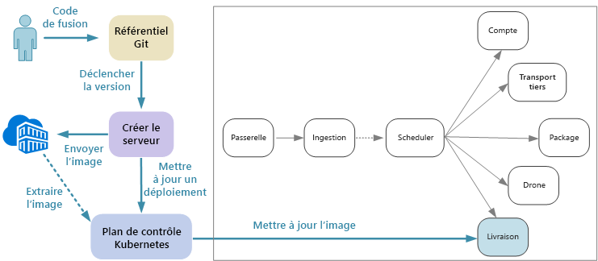
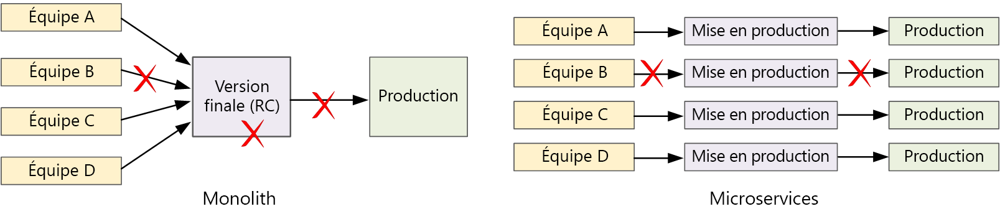

# Conception des microservices : Intégration continueDesigning microservices: Continuous integration

L’intégration et la livraison continues sont une condition essentielle à la réussite des microservices.Continuous integration and continuous delivery (CI/CD) are a key requirement for achieving success with microservices. Sans processus efficace d’intégration et de livraison continues, vous n’obtiendrez pas l’agilité attendue des microservices.Without a good CI/CD process, you will not achieve the agility that microservices promise. Certaines des difficultés du processus appliqué aux microservices proviennent de la multiplication des bases de code et de l’hétérogénéité des environnements de génération pour les divers services.Some of the CI/CD challenges for microservices arise from having multiple code bases and heterogenous build environments for the various services. Ce chapitre décrit ces obstacles et recommande certaines stratégies pour les surmonter.This chapter describes the challenges and recommends some approaches to the problem.

L’accélération des cycles de version constitue l’un des motifs principaux d’adoption d’une architecture de microservices.Faster release cycles are one of the biggest reasons to adopt a microservices architecture. 

Dans une application purement monolithique, un pipeline unique de conception génère le fichier exécutable de l’application.In a purely monolithic application, there is a single build pipeline whose output is the application executable. L’ensemble des tâches de développement alimentent ce pipeline.All development work feeds into this pipeline. Si un bogue de priorité élevée est identifié, un correctif doit être intégré, testé puis publié, ce qui peut retarder la sortie des nouvelles fonctionnalités.If a high-priority bug is found, a fix must be integrated, tested, and published, which can delay the release of new features. Il est vrai que vous pouvez atténuer ces problèmes en vous dotant de modules correctement rationalisés et en valorisant des branches de fonctionnalités destinées à réduire l’incidence des modifications de code.It's true that you can mitigate these problems by having well-factored modules and using feature branches to minimize the impact of code changes. Toutefois, à mesure que l’application devient plus complexe, en parallèle de l’ajout des fonctionnalités, le processus de publication d’un monolithe a tendance à se fragiliser et présente des risques de rupture.But as the application grows more complex, and more features are added, the release process for a monolith tends to become more brittle and likely to break. 

Si une approche de microservices est suivie, vous ne déplorez jamais une longue chaîne de publication au sein de laquelle les équipes interviennent tour à tour.Following the microservices philosophy, there should never be a long release train where every team has to get in line. L’équipe qui développe le service « A » peut publier une mise à jour à tout moment, sans attendre que les modifications de l’équipe du service « B » soient fusionnées, testées et déployées.The team that builds service "A" can release an update at any time, without waiting for changes in service "B" to be merged, tested, and deployed. Le processus d’intégration et de livraison continues est essentiel à cette approche.The CI/CD process is critical to making this possible. Votre pipeline de publication doit être automatisé et hautement fiable, de manière à réduire au maximum les risques liés au déploiement des mises à jour.Your release pipeline must be automated and highly reliable, so that the risks of deploying updates are minimized. Si vous publiez une production tous les jours ou plusieurs fois par jour, les régressions et les interruptions de service doivent être très rares.If you are releasing to production daily or multiple times a day, regressions or service disruptions must be very rare. En même temps, en cas de déploiement d’une mauvaise mise à jour, vous devez disposer d’un moyen fiable pour revenir vers une version antérieure du service.At the same time, if a bad update does get deployed, you must have a reliable way to quickly roll back or roll forward to a previous version of a service.

Le processus dont nous parlons traite de plusieurs processus associés : intégration continue, livraison continue et déploiement continu.When we talk about CI/CD, we are really talking about several related processes: Continuous integration, continuous delivery, and continuous deployment.

- L’intégration continue implique que les modifications du code sont fréquemment fusionnées dans la branche principale, à l’aide de processus automatisés de génération et de test qui garantissent que le code de la branche principale présente toujours une qualité acceptable pour la production.Continuous integration means that code changes are frequently merged into the main branch, using automated build and test processes to ensure that  code in the main branch is always production-quality.

- Avec la livraison continue, les modifications de code sont automatiquement publiées sur un environnement de type production.Continuous delivery means that code changes that pass the CI process are automatically published to a production-like environment. Si le déploiement au sein de l’environnement de production réelle peut nécessiter une approbation manuelle, il est automatisé.Deployment into the live production environment may require manual approval, but is otherwise automated. L’objectif est de toujours disposer d’un code *prêt* à être déployé en production.The goal is that your code should always be *ready* to deploy into production.

- Avec le déploiement continu, les modifications de code traitées par le processus sont automatiquement déployées en production.Continuous deployment means that code changes that pass the CI/CD process are automatically deployed into production.

Dans le contexte de Kubernetes et des microservices, l’intégration continue consiste en la génération et le test d’images de conteneurs, et en leur transmission vers un registre de conteneurs.In the context of Kubernetes and microservices, the CI stage is concerned with building and testing container images, and pushing those images to a container registry. Durant la phase de déploiement, les spécifications de pod sont mises à jour pour récupérer l’image de production la plus récente.In the deployment stage, pod specs are updated to pick up the latest production image.

## DéfisChallenges

- **De nombreuses bases de code indépendantes et réduites**.**Many small independent code bases**. Chaque équipe est responsable de la création de son propre service, associé à un pipeline de génération spécifique.Each team is responsible for building its own service, with its own build pipeline. Dans certaines organisations, les équipes peuvent utiliser des référentiels de code séparés.In some organizations, teams may use separate code repositories. Ainsi, parfois, l’expertise en matière de génération du système est partagée entre les équipes, sans que quiconque au sein de l’organisation ne sache comment déployer l’application entière.This could lead to a situation where the knowledge of how to build the system is spread across teams, and nobody in the organization knows how to deploy the entire application. Par exemple, que se passe-t-il en cas de récupération d’urgence, si vous devez déployer rapidement vers un nouveau cluster ?For example, what happens in a disaster recovery scenario, if you need to quickly deploy to a new cluster?   

- **Langues et infrastructures multiples**.**Multiple languages and frameworks**. Si chaque équipe utilise sa propre combinaison de technologies, il peut s’avérer difficile de créer un processus de génération unique fonctionnant dans tous les services de l’organisation.With each team using its own mix of technologies, it can be difficult to create a single build process that works across the organization. Le processus de génération doit être suffisamment souple pour que chaque équipe puisse opter pour la langue ou l’infrastructure de son choix.The build process must be flexible enough that every team can adapt it for their choice of language or framework. 

- **Intégration et test de charge**.**Integration and load testing**. Chaque équipe publiant les mises à jour à son propre rythme, la mise en œuvre d’une approche de test robuste de bout en bout peut présenter des difficultés, plus particulièrement quand des interdépendances entre services sont identifiées.With teams releasing updates at their own pace, it can be challenging to design robust end-to-end testing, especially when services have dependencies on other services. En outre, l’exécution d’un cluster de production intégral peut s’avérer onéreuse. Aussi, il est peu probable que l’ensemble des équipes soient en mesure d’exécuter leur propre cluster à l’échelle de la production, simplement pour la phase de test.Moreover, running a full production cluster can be expensive, so it's unlikely that every team will be able to run its own full cluster at production scales, just for testing. 

- **Gestion des mises en production**.**Release management**. Chaque équipe doit être capable de déployer une mise à jour en production.Every team should have the ability to deploy an update to production. Cela ne signifie pas que tous les membres doivent être autorisés à le faire.That doesn't mean that every team member has permissions to do so. Cependant, une organisation disposant d’un rôle centralisé de gestionnaire des versions peut constater un ralentissement de ses déploiements.But having a centralized Release Manager role can reduce the velocity of deployments. Plus le processus d’intégration et de livraison continue est automatisé et fiable, moins la nécessité d’une autorité centrale se fait sentir.The more that your CI/CD process is automated and reliable, the less there should be a need for a central authority. Ceci dit, vous pouvez avoir plusieurs stratégies, adaptées à la fois à la publication des modifications majeures de fonctionnalités et des correctifs mineurs.That said, you might have different policies for releasing major feature updates versus minor bug fixes. La décentralisation ne signifie pas qu’il n’existe plus aucune trace de gouvernance.Being decentralized does not mean there should be zero governance.

- **Gestion des versions d’images de conteneur**.**Container image versioning**. Durant le cycle de développement et de test, le processus d’intégration et de livraison continue génère de nombreuses images de conteneur.During the development and test cycle, the CI/CD process will build many container images. Seulement une partie de ces instances sont candidates à la publication, puis un nouvel écrémage filtre les éléments transmis en phase de production.Only some of those are candidates for release, and then only some of those release candidates will get pushed into production. Vous devez disposer d’une stratégie claire de gestion des versions, qui vous permettent de savoir quelles images sont déployées à un instant t en production, et ainsi de revenir à une version antérieure si nécessaire.You should have a clear versioning strategy, so that you know which images are currently deployed to production, and can roll back to a previous version if necessary. 

- **Mises à jour de service**.**Service updates**. Lorsque vous mettez à jour un service vers une nouvelle version, il ne doit pas perturber les autres services qui en dépendent.When you update a service to a new version, it shouldn't break other services that depend on it. Si vous procédez à une mise à jour propagée, une combinaison de versions différentes sera exécutée sur un intervalle ponctuel.If you do a rolling update, there will be a period of time when a mix of versions is running. 
 
Ces enjeux reflètent une problématique centrale.These challenges reflect a fundamental tension. D’une part, les équipes doivent travailler aussi indépendamment que possible.On the one hand, teams need to work as independently as possible. Malgré tout, une certaine coordination est requise, de manière à ce qu’une personne donnée puisse effectuer des tâches variées, comme l’exécution du test d’intégration, le redéploiement de la solution entière vers un nouveau cluster ou l’annulation d’une mauvaise mise à jour.On the other hand, some coordination is needed so that a single person can do tasks like running an integration test, redeploying the entire solution to a new cluster, or rolling back a bad update. 
 
## Approches d’intégration/livraison continues pour les microservicesCI/CD approaches for microservices

Il est recommandé que chaque équipe de service héberge son environnement de génération au sein d’un conteneur.It's a good practice for every service team to containerize their build environment. Ce conteneur doit comporter tous les outils nécessaires pour le développement des artefacts de code dédiés au service considéré.This container should have all of the build tools necessary to build the code artifacts for their service. Bien souvent, vous pouvez trouver une image Docker officielle pour votre langue et votre infrastructure.Often you can find an official Docker image for your language and framework. Vous pouvez ensuite recourir à `docker run` ou à Docker Compose pour exécuter la version.Then you can use `docker run` or Docker Compose to run the build. 

Avec cette approche, il est très facile de configurer un nouvel environnement de génération.With this approach, it's trivial to set up a new build environment. Un développeur souhaitant générer votre code n’a pas besoin d’installer un jeu d’outils de génération ; il lui suffit d’exécuter l’image de conteneur.A developer who wants to build your code doesn't need to install a set of build tools, but simply runs the container image. Plus important encore peut-être, votre serveur de builds peut être configuré pour effectuer la même chose.Perhaps more importantly, your build server can be configured to do the same thing. De cette manière, vous n’avez pas à installer ces outils sur le serveur de builds, ni à gérer des versions en conflit des outils.That way, you don't need to install those tools onto the build server, or manage conflicting versions of tools. 

Pour les opérations locales de développement et de test, utilisez Docker pour exécuter le service au sein d’un conteneur.For local development and testing, use Docker to run the service inside a container. Dans le cadre de ce processus, vous devrez peut-être exécuter d’autres conteneurs prenant en charge des services fictifs ou des bases de données test nécessaires pour le test en local.As part of this process, you may need to run other containers that have mock services or test databases needed for local testing. Vous pourriez utiliser Docker Compose pour coordonner ces conteneurs, ou Minikube pour exécuter Kubernetes en local.You could use Docker Compose to coordinate these containers, or use Minikube to run Kubernetes locally. 

Lorsque le code est prêt, ouvrez une requête d’extraction et procédez à une fusion dans les données de références.When the code is ready, open a pull request and merge into master. Cela déclenche une tâche sur le serveur de builds :This will start a job on the build server:

1. Générez les ressources du code.Build the code assets. 
2. Exécutez des tests unitaires sur le code.Run unit tests against the code.
3. Générez l’image de conteneur.Build the container image.
4. Testez l’image de conteneur en exécutant des tests fonctionnels sur un conteneur en exécution.Test the container image by running functional tests on a running container. Durant cette phase, des erreurs peuvent être identifiées dans le fichier Docker, comme un mauvais point d’entrée.This step can catch errors in the Docker file, such as a bad entry point.
5. Envoyez l’image dans un registre de conteneurs.Push the image to a container registry.
6. Mettez à jour le cluster de test avec la nouvelle image avant d’exécuter les tests d’intégration.Update the test cluster with the new image to run integration tests.

Lorsque l’image est prête à passer en production, mettez à jour les fichiers de déploiement en fonction de l’image la plus récente, en tenant compte des éventuels fichiers de configuration Kubernetes.When the image is ready to go into production, update the deployment files as needed to specify the latest image, including any Kubernetes configuration files. Appliquez ensuite la mise à jour sur le cluster de production.Then apply the update to the production cluster.

Voici quelques recommandations pour optimiser la fiabilité des déploiements :Here are some recommendations for making deployments more reliable:
 
- Définissez des conventions d’organisation pour les balises de conteneurs, la gestion des versions et des conventions de d’affectation de noms pour les ressources déployées sur le cluster (pod, services, etc.).Define organization-wide conventions for container tags, versioning, and naming conventions for resources deployed to the cluster (pods, services, and so on). Cela peut simplifier le diagnostic des problèmes de déploiement.That can make it easier to diagnose deployment issues. 

- Créez 2 registres distincts de conteneur, un dédié au développement/au test et un à la production.Create two separate container registries, one for development/testing and one for production. N’envoyez pas l’image dans le registre de production avant d’être prêt à la déployer en phase de production.Don't push an image to the production registry until you're ready to deploy it into production. Si vous combinez cette pratique à la gestion sémantique des versions des images de conteneurs, vous pouvez réduire les risques de déploiement accidentel d’une version non approuvée pour publication.If you combine this practice with semantic versioning of container images, it can reduce the chance of accidentally deploying a version that wasn't approved for release.

## Mise à jour des servicesUpdating services

Il existe différentes stratégies de mise à jour d’un service déjà en production.There are various strategies for updating a service that's already in production. Nous présentons ici 3 options courantes : mise à jour propagée, déploiement bleu-vert et contrôle de la validité de la mise en production.Here we discuss three common options: Rolling update, blue-green deployment, and canary release.

### Mise à jour propagéeRolling update 

Dans une mise à jour propagée, vous déployez de nouvelles instances d’un service ; ces nouvelles instances reçoivent immédiatement les requêtes.In a rolling update, you deploy new instances of a service, and the new instances start receiving requests right away. À mesure que les nouvelles instances arrivent, les anciennes instances sont supprimées.As the new instances come up, the previous instances are removed.

Les mises à jour propagées correspondent au comportement par défaut dans Kubernetes, quand vous mettez à jour les spécifications des pods pour un déploiement.Rolling updates are the default behavior in Kubernetes when you update the pod spec for a Deployment. Le contrôleur de déploiement crée un nouveau jeu de réplicas pour les pods mis à jour.The Deployment controller creates a new ReplicaSet for the updated pods. Ensuite, il promeut le nouveau jeu en rétrogradant l’ancien, ceci pour garantir le maintien d’un nombre souhaité de réplicas.Then it scales up the new ReplicaSet while scaling down the old one, to maintain the desired replica count. Les anciens pods ne sont pas supprimés avant que les nouveaux ne soient prêts.It doesn't delete old pods until the new ones are ready. Kubernetes conserve un historique de la mise à jour, ce qui vous permet d’utiliser kubectl pour annuler une opération, au besoin.Kubernetes keeps a history of the update, so you can use kubectl to roll back an update if needed. 

Si votre service effectue une tâche de démarrage longue, vous pouvez définir une détection de préparation.If your service performs a long startup task, you can define a readiness probe. Cette sonde de préparation signale quand le conteneur est prêt à recevoir le trafic.The readiness probe reports when the container is ready to start receiving traffic. Kubernetes n’envoie aucun trafic au pod avant l’aval de la sonde.Kubernetes won't send traffic to the pod until the probe reports success. 

L’une des difficultés liées aux mises à jour propagées est la confusion régnant durant le processus de mise à jour. À ce stade, une combinaison de versions anciennes et nouvelles exécute et reçoit le trafic.One challenge of rolling updates is that during the update process, a mix of old and new versions are running and receiving traffic. Pendant cette période, une requête peut être dirigée vers l’une ou l’autre des versions.During this period, any request could get routed to either of the two versions. Cela peut provoquer des problèmes, en fonction de l’ampleur des changements entre les deux versions.That may or may not cause problems, depending on the scope of the changes between the two versions. 

### Déploiement bleu-vertBlue-green deployment

Dans un déploiement bleu-vert, il est possible de déployer la nouvelle version en parallèle de la version précédente.In a blue-green deployment, you deploy the new version alongside the previous version. Une fois la nouvelle version validée, vous basculez simultanément l’ensemble du trafic de l’ancienne version vers la nouvelle.After you validate the new version, you switch all traffic at once from the previous version to the new version. Après le basculement, vous vérifiez l’absence de problèmes dans l’application.After the switch, you monitor the application for any problems. Si une erreur survient, vous pouvez revenir à l’ancienne version.If something goes wrong, you can swap back to the old version. En supposant qu’il n’existe aucun problème, vous pouvez supprimer l’ancienne version.Assuming there are no problems, you can delete the old version.

Avec une application monolithique ou multiniveau plus traditionnelle, un déploiement bleu-vert est généralement synonyme d’approvisionnement de deux environnements identiques.With a more traditional monolithic or N-tier application, blue-green deployment generally meant provisioning two identical environments. Vous déployez alors la nouvelle version dans un environnement intermédiaire, avant de rediriger le trafic client vers l’environnement intermédiaire, par exemple, en échangeant les adresses IP virtuelles.You would deploy the new version to a staging environment, then redirect client traffic to the staging environment &mdash; for example, by swapping VIP addresses.

Dans Kubernetes, il n’est pas nécessaire d’approvisionner un cluster distinct pour procéder à des déploiements bleu-vert.In Kubernetes, you don't need to provision a separate cluster to do blue-green deployments. Ici, vous pouvez valoriser des sélecteurs.Instead, you can take advantage of selectors. Créez une nouvelle ressource de déploiement avec une nouvelle spécification de pods et un jeu différent d’étiquettes.Create a new Deployment resource with a new pod spec and a different set of labels. Créez ce déploiement, sans supprimer le déploiement précédent ni modifier le service pointant vers lui.Create this deployment, without deleting the previous deployment or modifying the service that points to it. Une fois que les nouveaux pods sont exécutés, vous pouvez mettre à jour le sélecteur du service en fonction du nouveau déploiement.Once the new pods are running, you can update the service's selector to match the new deployment. 

Avec les déploiements bleu-vert, le service bascule l’ensemble des pods au même moment.An advantage of blue-green deployments is that the service switches all the pods at the same time. Une fois que le service est mis à jour, toutes les nouvelles requêtes sont acheminées vers la nouvelle version.After the service is updated, all new requests get routed to the new version. L’un des inconvénients est que pendant la mise à jour, vous exécutez deux fois plus de pods pour le service (l’actuel et le suivant).One drawback is that during the update, you are running twice as many pods for the service (current and next). Si les pods nécessitent un volume important d’UC ou de ressources de mémoire, il vous faudra éventuellement augmenter temporairement la taille du cluster pour prendre en charge efficacement la consommation de ressources.If the pods require a lot of CPU or memory resources, you may need to scale out the cluster temporarily to handle the resource consumption. 

### Contrôle la validité de la mise en productionCanary release

Durant un contrôle de la validité de la mise en production, vous déployez une version mise à jour à un nombre réduit de clients.In a canary release, you roll out an updated version to a small number of clients. Ensuite, vous analysez le comportement du nouveau service avant de procéder à un déploiement plus large vers l’ensemble des clients.Then you monitor the behavior of the new service before rolling it out to all clients. Ainsi, vous contrôlez la mise en œuvre progressive du processus, observez les données réelles et identifiez les problèmes avant que l’ensemble des clients ne soient affectés.This lets you do a slow rollout in a controlled fashion, observe real data, and spot problems before all customers are affected.

La gestion de cette version est plus complexe que celle des versions bleu-vert et propagée, dans la mesure où vous devez diriger dynamiquement les requêtes vers différentes versions du service.A canary release is more complex to manage than either blue-green or rolling update, because you must dynamically route requests to different versions of the service. Dans Kubernetes, vous pouvez configurer un service pour une prise en charge de deux jeux de réplicas (un pour chaque version), avant de modifier manuellement au besoin la quantité de réplicas.In Kubernetes, you can configure a Service to span two replica sets (one for each version) and adjust the replica counts manually. Toutefois, cette approche présente une granularité plutôt grossière, en raison de la manière dont la charge de Kubernetes s’équilibre entre les pods.However, this approach is rather coarse-grained, because of the way Kubernetes load balances across pods. Par exemple, si vous disposez d’au total dix réplicas, vous pouvez modifier le trafic en incrément de 10 % uniquement.For example, if you have a total of ten replicas, you can only shift traffic in 10% increments. Si vous avez recours à une maille de service, vous pouvez solliciter les règles d’acheminement dédiées pour implémenter une stratégie de publication plus sophistiquée.If you are using a service mesh, you can use the service mesh routing rules to implement a more sophisticated canary release strategy. Voici quelques ressources qui peuvent vous être utiles :Here are some resources that may be helpful:

- Kubernetes sans maille de service : [contrôles de la validité de la mise en production](https://kubernetes.io/docs/concepts/cluster-administration/manage-deployment/#canary-deployments)Kubernetes without service mesh: [Canary deployments](https://kubernetes.io/docs/concepts/cluster-administration/manage-deployment/#canary-deployments)
- Linkerd : [acheminement dynamique des requêtes](https://linkerd.io/features/routing/)Linkerd: [Dynamic request routing](https://linkerd.io/features/routing/)
- Istio : [contrôles de la validité de la mise en production à l’aide d’Istio](https://istio.io/blog/canary-deployments-using-istio.html)Istio: [Canary Deployments using Istio](https://istio.io/blog/canary-deployments-using-istio.html)

## ConclusionConclusion

Au cours des récentes années, le marché a subi une refonte majeure, en passant d’un modèle de développement de *systèmes d’enregistrement* à un modèle de mise en œuvre de *systèmes d’engagement*.In recent years, there has been a sea change in the industry, a movement from building *systems of record* to building *systems of engagement*.

Les systèmes d’enregistrement sont des applications traditionnelles de gestion des données back-office.Systems of record are traditional back-office data management applications. Au cœur de ces systèmes est bien souvent hébergé un système SGBDR, qui est le cas échéant la source unique de vérité.At the heart of these systems there often sits an RDBMS that is the single source of truth. L’expression « système d’engagement » a été inventée par Geoffrey Moore, dans son article paru en 2011 *Systems of Engagement and the Future of Enterprise IT* (Systèmes d’engagement et l’avenir de l’informatique d’entreprise).The term "system of engagement" is credited to Geoffrey Moore, in his 2011 paper *Systems of Engagement and the Future of Enterprise IT*. Les systèmes d’engagement sont des applications axées sur la communication et la collaboration.Systems of engagement are applications focused on communication and collaboration. Ils connectent les personnes en temps réel.They connect people in real time. Ils doivent être disponibles 24h/24 et 7j/7.They must be available 24/7. De nouvelles fonctionnalités sont régulièrement introduites, sans mise hors connexion des applications.New features are introduced regularly without taking the application offline. Les utilisateurs sont davantage exigeants et plus impatients vis-à-vis des délais inattendus ou des périodes d’interruption.Users expect more and are less patient of unexpected delays or downtime.

Au sein du marché de la consommation, une amélioration de l’expérience utilisateur peut constituer une valeur métier quantifiable.In the consumer space, a better user experience can have measurable business value. La durée pendant laquelle un utilisateur interagit avec une application peut se traduire directement en revenus.The amount of time that a user engages with an application may translate directly into revenue. Dans l’univers des systèmes d’entreprise, les attentes des utilisateurs ont évolué.And in the realm of business systems, users' expectations have changed. Si ces systèmes visent à encourager la communication et la collaboration, ils doivent être inspirés des applications orientées consommateur.If these systems aim to foster communication and collaboration, they must take their cue from consumer-facing applications.

Les microservices sont une réponse à cette évolution.Microservices are a response to this changing landscape. En décomposant une application monolithique en groupe de services sommairement liés, nous sommes en mesure de réguler la publication de chaque service et de mettre en œuvre des mises à jour fréquentes sans déplorer de périodes d’interruption ni bouleversement fondamental.By decomposing a monolithic application into a group of loosely coupled services, we can control the release cycle of each service, and enable frequent updates without downtime or breaking changes. Les microservices, par ailleurs, présentent des avantages en matière d’évolutivité, d’isolation des défaillances et de résilience.Microservices also help with scalability, failure isolation, and resiliency. Parallèlement, les plateformes cloud simplifient le développement et l’exécution des microservices, avec un approvisionnement automatisé des ressources de calcul, des orchestrateurs de conteneur en tant que service et des environnements sans serveur basés sur les événements.Meanwhile, cloud platforms are making it easier to build and run microservices, with automated provisioning of compute resources, container orchestrators as a service, and event-driven serverless environments.

Cependant, comme nous l’avons vu, les architectures de microservices présentent de nombreuses difficultés.But as we've seen, microservices architectures also being a lot of challenges. Pour réussir, vous devez partir d’une conception robuste.To succeed, you must start from a solid design. Il est nécessaire d’analyser soigneusement le domaine, et de prendre soin de bien choisir les technologies, modéliser les données et concevoir les API tout en veillant à instaurer une culture DevOps mature.You must put careful thought into analyzing the domain, choosing technologies, modeling data, designing APIs, and building a mature DevOps culture. Nous espérons que ce guide et l’[implémentation de référence](https://github.com/mspnp/microservices-reference-implementation) associée vous ont éclairé la voie sur le chemin de la réussite.We hope that this guide, and the accompanying [reference implementation](https://github.com/mspnp/microservices-reference-implementation), has helped to illuminate the journey. 

