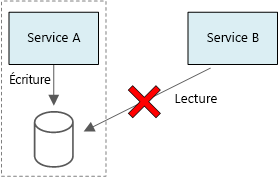

# Conception de microservices : Considérations sur les donnéesDesigning microservices: Data considerations

Ce chapitre décrit les considérations relatives à la gestion des données au sein d’une architecture de microservices.This chapter describes considerations for managing data in a microservices architecture. Dans la mesure où chaque microservice gère ses propres données, l’intégrité et la cohérence des données sont des problématiques majeures.Because every microservice manages its own data, data integrity and data consistency are critical challenges.

L’un des principes fondamentaux des microservices est que chaque service gère ses propres données.A basic principle of microservices is that each service manages its own data. Deux services ne devraient pas partager un magasin de données.Two services should not share a data store. A contrario, chaque service est responsable de son propre magasin de données privé, auquel les autres services ne peuvent pas accéder directement.Instead, each service is responsible for its own private data store, which other services cannot access directly.

Cette règle a vocation à éviter tout couplage non intentionnel entre les services, problème qui peut se produire dans les cas de figure où les services partagent des schémas de données sous-jacents.The reason for this rule is to avoid unintentional coupling between services, which can result if services share the same underlying data schemas. Si un schéma de données est modifié, le changement doit être coordonné sur chacun des services pris en charge par la base de données considérée.If there is a change to the data schema, the change must be coordinated across every service that relies on that database. En isolant le magasin de données de chaque service, nous sommes en mesure de limiter la portée du changement et de préserver l’agilité de déploiements véritablement indépendants.By isolating each service's data store, we can limit the scope of change, and preserve the agility of truly independent deployments. Cela s’explique également par le fait que chaque microservice peut posséder ses propres modèles de données, requêtes ou modèles de lecture/écriture.Another reason is that each microservice may have its own data models, queries, or read/write patterns. En recourant à un magasin de données partagé, vous limitez la capacité des équipes à optimiser le stockage de données sur leur service respectif.Using a shared data store limits each team's ability to optimize data storage for their particular service.

Cette approche entraîne naturellement une [persistance polyglotte](https://martinfowler.com/bliki/PolyglotPersistence.html) &mdash;, l’utilisation de plusieurs technologies de stockage de données au sein d’une application unique.This approach naturally leads to [polyglot persistence](https://martinfowler.com/bliki/PolyglotPersistence.html) &mdash; the use of multiple data storage technologies within a single application. Un service peut avoir besoin des fonctionnalités de schéma à la lecture d’une base de données documentaire.One service might require the schema-on-read capabilities of a document database. Un autre peut nécessiter l’intégrité référentielle fournie par un SGBDR.Another might need the referential integrity provided by an RDBMS. Chaque équipe est libre de prendre la décision la mieux adaptée pour son service.Each team is free to make the best choice for their service. Pour plus d’informations sur le principe général de la persistance polyglotte, consultez la section [Utiliser la meilleure banque de données pour le travail](../guide/design-principles/use-the-best-data-store.md).For more about the general principle of polyglot persistence, see [Use the best data store for the job](../guide/design-principles/use-the-best-data-store.md).

> [!NOTE]
> Il est tout à fait acceptable que les services partagent le même serveur de base de données physique.It's fine for services to share the same physical database server. Le problème survient quand les services partagent le même schéma, ou lisent et écrivent sur le même jeu de tables de base de données.The problem occurs when services share the same schema, or read and write to the same set of database tables.

## DéfisChallenges

Certains problèmes sont provoqués par cette approche distribuée de la gestion des données.Some challenges arise from this distributed approach to managing data. Tout d’abord, une redondance peut être identifiée entre les magasins de données, le même élément de données apparaissant à plusieurs endroits.First, there may be redundancy across the data stores, with the same item of data appearing in multiple places. Par exemple, les données peuvent être stockées dans le cadre d’une transaction, puis déplacées ailleurs à des fins d’analyse, de génération de rapport ou d’archivage.For example, data might be stored as part of a transaction, then stored elsewhere for analytics, reporting, or archiving. Les données dupliquées ou partitionnées peuvent entraîner des problèmes d’intégrité et de cohérence des données.Duplicated or partitioned data can lead to issues of data integrity and consistency. Lorsque les relations de données s’étendent sur plusieurs services, vous ne pouvez pas recourir aux techniques traditionnelles de gestion des données pour appliquer les relations.When data relationships span multiple services, you can't use traditional data management techniques to enforce the relationships.

La modélisation traditionnelle des données valorise la règle « chaque événement à sa place ».Traditional data modeling uses the rule of "one fact in one place." Chaque entité apparaît exactement une fois dans le schéma.Every entity appears exactly once in the schema. D’autres entités peuvent y faire référence, sans qu’il n’y ait duplication.Other entities may hold references to it but not duplicate it. L’avantage évident de l’approche traditionnelle est identifié au niveau des mises à jour, qui sont effectuées de manière centralisée, ce qui permet d’éviter les soucis d’incohérence des données.The obvious advantage to the traditional approach is that updates are made in a single place, which avoids problems with data consistency. Dans une architecture de microservices, vous devez réfléchir à la propagation des mises à jour entre les services et trouver un moyen d’obtenir la cohérence finale au sein d’un système où les données apparaissent à différents endroits sans forte cohérence initiale.In a microservices architecture, you have to consider how updates are propagated across services, and how to manage eventual consistency when data appears in multiple places without strong consistency.

## Approches de la gestion des donnéesApproaches to managing data

Il n’existe aucune approche unique adaptée à tous les cas de figure, mais voici quelques recommandations relatives à la gestion des données dans une architecture de microservices.There is no single approach that's correct in all cases, but here are some general guidelines for managing data in a microservices architecture.

- Adoptez la cohérence éventuelle dans la mesure du possible.Embrace eventual consistency where possible. Appréhendez les emplacements du système qui nécessitent une forte cohérence ou des transactions ACID, et les secteurs où une cohérence finale est acceptable.Understand the places in the system where you need strong consistency or ACID transactions, and the places where eventual consistency is acceptable.

- Lorsque vous avez un besoin crucial de cohérence, un service peut représenter la source de vérité pour une entité donnée, exposée via une API.When you need strong consistency guarantees, one service may represent the source of truth for a given entity, which is exposed through an API. Les autres services peuvent conserver leur propre copie des données, ou un sous-ensemble des données qui présentent une cohérence finale avec les données de référence mais qui ne sont pas considérés comme la source de vérité.Other services might hold their own copy of the data, or a subset of the data, that is eventually consistent with the master data but not considered the source of truth. Par exemple, imaginez un système de commerce électronique pourvu d’un service de commande client et d’un service de recommandation.For example, imagine an e-commerce system with a customer order service and a recommendation service. Le service de recommandation peut être à l’écoute des événements du service de commande, mais si un client sollicite un remboursement, il s’agit du service de commande et non du service de recommandation qui dispose de l’historique des transactions.The recommendation service might listen to events from the order service, but if a customer requests a refund, it is the order service, not the recommendation service, that has the complete transaction history.

- Pour les transactions, utilisez des modèles comme [Superviseur de l’agent du planificateur](../patterns/scheduler-agent-supervisor.md) et [Transaction de compensation](../patterns/compensating-transaction.md) pour garantir la cohérence des données entre les différents services.For transactions, use patterns such as [Scheduler Agent Supervisor](../patterns/scheduler-agent-supervisor.md) and [Compensating Transaction](../patterns/compensating-transaction.md) to keep data consistent across several services.  Il vous faudra éventuellement stocker un volume supplémentaire de données capturant l’état d’une unité de travail s’étendant sur plusieurs services, afin d’éviter toute défaillance partielle entre plusieurs services.You may need to store an additional piece of data that captures the state of a unit of work that spans multiple services, to avoid partial failure among multiple services. Par exemple, conservez un élément de travail dans une file d’attente durable lorsqu’une transaction à plusieurs étapes est en cours.For example, keep a work item on a durable queue while a multi-step transaction is in progress.

- Stockez uniquement les données dont un service a besoin.Store only the data that a service needs. Un service peut nécessiter uniquement un sous-ensemble des informations sur une entité de domaine.A service might only need a subset of information about a domain entity. Par exemple, dans une limite de contexte Expédition, nous devons savoir quel client est associé à une livraison spécifique.For example, in the Shipping bounded context, we need to know which customer is associated to a particular delivery. Nous n’avons toutefois pas besoin de l’adresse de facturation du client, qui est gérée par la limite de contexte Comptes.But we don't need the customer's billing address &mdash; that's managed by the Accounts bounded context. Une analyse approfondie du domaine et l’application d’une approche de conception pilotée par domaine sont vos alliés.Thinking carefully about the domain, and using a DDD approach, can help here.

- Vérifiez si vos services sont cohérents et couplés souplement.Consider whether your services are coherent and loosely coupled. Si deux services échangent continuellement des informations entre eux, entraînant de fait une riche interaction entre les API, il vous faudra redessiner vos limites de service, en fusionnant deux services ou en refactorisant leur fonctionnalité.If two services are continually exchanging information with each other, resulting in chatty APIs, you may need to redraw your service boundaries, by merging two services or refactoring their functionality.

- Valorisez un [style d’architecture basée sur les événements](../guide/architecture-styles/event-driven.md).Use an [event driven architecture style](../guide/architecture-styles/event-driven.md). Dans ce style d’architecture, un service publie un événement si des modifications sont apportées à ses entités ou modèles publics.In this architecture style, a service publishes an event when there are changes to its public models or entities. Les services intéressés peuvent s’abonner à ces événements.Interested services can subscribe to these events. Par exemple, un autre service peut utiliser les événements pour établir une vue matérialisée des données, davantage adaptée au modèle de requête.For example, another service could use the events to construct a materialized view of the data that is more suitable for querying.

- Un service détenant les événements doit publier un schéma servant à automatiser la sérialisation et la désérialisation des événements, ceci pour éviter tout couplage étroit entre les éditeurs et les abonnés.A service that owns events should publish a schema that can be used to automate serializing and deserializing the events, to avoid tight coupling between publishers and subscribers. Envisagez le schéma JSON ou une infrastructure comme [Microsoft Bond](https://github.com/Microsoft/bond), Protobuf ou Avro.Consider JSON schema or a framework like [Microsoft Bond](https://github.com/Microsoft/bond), Protobuf, or Avro.

- À grande échelle, les événements peuvent constituer un goulot d’étranglement sur le système ; aussi, envisagez l’agrégation ou le traitement par lot afin de réduire la charge totale.At high scale, events can become a bottleneck on the system, so consider using aggregation or batching to reduce the total load.

## Application Drone Delivery : Choix des magasins de donnéesDrone Delivery: Choosing the data stores

Même avec un nombre limité de services, la limite de contexte Expédition illustre plusieurs des points évoqués dans cette section.Even with only a few services, the Shipping bounded context illustrates several of the points discussed in this section.

Lorsqu’un utilisateur planifie une nouvelle livraison, la requête du client comprend des informations sur la livraison, comme les emplacements de la collecte et du dépôt, mais aussi sur le colis, comme la taille et le poids.When a user schedules a new delivery, the client request includes information about the both the delivery, such as the pickup and dropoff locations, and about the package, such as the size and weight. Ces informations définissent une unité de travail, que le service d’ingestion transmet aux unités de débit Event Hub.This information defines a unit of work, which the Ingestion service sends to Event Hubs. Il est primordial que l’unité de travail demeure au sein du stockage persistant quand le service Planificateur exécute le workflow, de manière à ce qu’aucune requête de livraison ne soit perdue.It's important that the unit of work stays in persistent storage while the Scheduler service is executing the workflow, so that no delivery requests are lost. Pour plus d’informations sur le workflow, voir [Ingestion et workflow](./ingestion-workflow.md).For more discussion of the workflow, see [Ingestion and workflow](./ingestion-workflow.md).

Les divers services principaux s’intéressent à différentes portions des données de la requête, et présentent par ailleurs différents profils de lecture et d’écriture.The various backend services care about different portions of the information in the request, and also have different read and write profiles.

### Service de livraisonDelivery service

Le service de livraison stocke les données sur les livraisons qui sont planifiées ou en cours.The Delivery service stores information about every delivery that is currently scheduled or in progress. Il est à l’écoute des événements des drones, et effectue le suivi de l’état des livraisons en cours.It listens for events from the drones, and tracks the status of deliveries that are in progress. Il transmet également les événements de domaine avec les mises à jour des états de livraison.It also sends domain events with delivery status updates.

Il est probable que les utilisateurs attendant un colis contrôlent régulièrement l’état de la livraison associée.It's expected that users will frequently check the status of a delivery while they are waiting for their package. Par conséquent, le service de livraison doit pouvoir compter sur un magasin de données qui mette l’accent sur le débit (en lecture et en écriture) de traitement des données stockées sur le long terme.Therefore, the Delivery service requires a data store that emphasizes throughput (read and write) over long-term storage. En outre, le service de livraison n’effectue aucune requête ni analyse complexes ; il récupère simplement l’état d’une livraison donnée.Also, the Delivery service does not perform any complex queries or analysis, it simply fetches the latest status for a given delivery. Son équipe a opté pour le cache Redis Azure pour ses hautes performances de lecture-écriture.The Delivery service team chose Azure Redis Cache for its high read-write performance. Les données stockées dans Redis présentent une durée de vie relativement courte.The information stored in Redis is relatively short-lived. Une fois la livraison effectuée, le service d’historique des livraisons constitue le système d’enregistrement.Once a delivery is complete, the Delivery History service is the system of record.

### Service d’historique des livraisonsDelivery History service

Ce service est à l’écoute des événements d’état de livraison du service de livraison.The Delivery History service listens for delivery status events from the Delivery service. Il stocke ces données dans un système de stockage à long terme.It stores this data in long-term storage. Il existe deux cas d’utilisation différents pour ces données d’historique, qui présentent des exigences propres en matière de stockage des données.There are two different use-cases for this historical data, which have different data storage requirements.

Le premier scénario consiste en l’agrégation des données à des fins d’analyse, dans l’objectif d’optimiser les activités ou d’améliorer la qualité de service.The first scenario is aggregating the data for the purpose of data analytics, in order to optimize the business or improve the quality of the service. Notez que le service d’historique des données n’effectue pas l’analyse des données en tant que telle.Note that the Delivery History service doesn't perform the actual analysis of the data. Il est seulement en charge de l’ingestion et du stockage.It's only responsible for the ingestion and storage. Pour ce scénario, le stockage doit être optimisé pour l’analyse de données sur un grand ensemble de données, à l’aide d’une approche de schéma à la lecture prenant en charge diverses sources de données.For this scenario, the storage must be optimized for data analysis over a large set of data, using a schema-on-read approach to accommodate a variety of data sources. [Azure Data Lake Store](/azure/data-lake-store/) convient parfaitement pour ce scénario.[Azure Data Lake Store](/azure/data-lake-store/) is a good fit for this scenario. Azure Data Lake Store est un système de fichiers Apache Hadoop compatible avec Hadoop Distributed File System (HDFS) ; il est parfaitement adapté aux scénarios d’analyse des données.Data Lake Store is an Apache Hadoop file system compatible with Hadoop Distributed File System (HDFS), and is tuned for performance for data analytics scenarios.

L’autre scénario permet aux utilisateurs d’effectuer une recherche dans l’historique d’une livraison effectuée.The other scenario is enabling users to look up the history of a delivery after the delivery is completed. La solution Azure Data Lake n’est pas particulièrement optimisée pour ce scénario.Azure Data Lake is not particularly optimized for this scenario. Pour des performances optimales, Microsoft recommande de stocker les données de séries chronologiques dans Data Lake, dans des dossiers partitionnés par date.For optimal performance, Microsoft recommends storing time-series data in Data Lake in folders partitioned by date. (Voir [Paramétrage d’Azure Data Lake Store pour les performances](/azure/data-lake-store/data-lake-store-performance-tuning-guidance)).(See [Tuning Azure Data Lake Store for performance](/azure/data-lake-store/data-lake-store-performance-tuning-guidance)). Toutefois, cette structure n’est pas optimale pour rechercher des enregistrements individuels par identifiant.However, that structure is not optimal for looking up individual records by ID. Sauf si vous connaissez également l’horodatage, une recherche par identifiant nécessite d’analyser l’ensemble de la collection.Unless you also know the timestamp, a lookup by ID requires scanning the entire collection. Par conséquent, le service en charge de l’historique des livraisons stocke également un sous-ensemble des données d’historique dans Cosmos DB, à des fins d’accélération des procédures de recherche.Therefore, the Delivery History service also stores a subset of the historical data in Cosmos DB for quicker lookup. Il n’est pas nécessaire de conserver indéfiniment les enregistrements dans Cosmos DB.The records don't need to stay in Cosmos DB indefinitely. Les livraisons plus anciennes peuvent être archivées, après un mois par exemple.Older deliveries can be archived &mdash; say, after a month. Cela peut se faire en exécutant un processus régulier par lot.This could be done by running an occasional batch process.

### Service de packagePackage service

Le service en charge des packages stocke les informations relatives à tous les packages.The Package service stores information about all of the packages. Les exigences de stockage du service sont les suivantes :The storage requirements for the Package are:

- Un stockage à long terme.Long-term storage.
- Capacité à gérer un volume important de packages, nécessitant un débit élevé en écriture.Able to handle a high volume of packages, requiring high write throughput.
- Prise en charge de requêtes simples par ID de package.Support simple queries by package ID. Aucune jointure complexe ni exigence pour l’intégrité référentielle.No complex joins or requirements for referential integrity.

Les données de package n’étant pas relationnelles, une base de données documentaire est adaptée, tandis que Cosmos DB peut prendre en charge un débit très élevé en valorisant les collections partagées.Because the package data is not relational, a document oriented database is appropriate, and Cosmos DB can achieve very high throughput by using sharded collections. L’équipe en charge du service Package, qui maîtrise la pile MEAN (MongoDB, Express.js, AngularJS et Node.js), sélectionne l’[API MongoDB](/azure/cosmos-db/mongodb-introduction) pour Cosmos DB.The team that works on the Package service is familiar with the MEAN stack (MongoDB, Express.js, AngularJS, and Node.js), so they select the [MongoDB API](/azure/cosmos-db/mongodb-introduction) for Cosmos DB. Cela lui permet de valoriser son expérience avec MongoDB, tout en profitant des avantages de Cosmos DB, qui est un service géré Azure.That lets them leverage their existing experience with MongoDB, while getting the benefits of Cosmos DB, which is a managed Azure service.

> [!div class="nextstepaction"]
> [Communication entre les servicesInterservice communication](./interservice-communication.md)