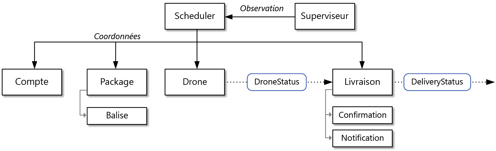

# Conception de microservices : Analyse de domaineDesigning microservices: Domain analysis

L’un des plus grandes problématiques des microservices est la définition des limites de chacun des services isolés.One of the biggest challenges of microservices is to define the boundaries of individual services. Le principe de base est qu’un service doit exécuter « une action » &mdash; ; toutefois, l’application concrète de cette règle nécessite une réflexion approfondie.The general rule is that a service should do "one thing" &mdash; but putting that rule into practice requires careful thought. Aucun processus mécanique ne produira la conception idéale.There is no mechanical process that will produce the "right" design. Vous devez analyser en profondeur le domaine, les exigences et les objectifs de votre entreprise.You have to think deeply about your business domain, requirements, and goals. Sinon, vous pouvez avoir à gérer une conception incohérente présentant des caractéristiques indésirables, comme des dépendances masquées entre les services, un couplage étroit ou des interfaces mal développées.Otherwise, you can end up with a haphazard design that exhibits some undesirable characteristics, such as hidden dependencies between services, tight coupling, or poorly designed interfaces. Dans ce chapitre, nous appliquons une approche orientée domaine de la conception des microservices.In this chapter, we take a domain-driven approach to designing microservices.

Les microservices doivent être alignés sur les activités commerciales, pas développés comme des couches horizontales de données, telles que l’accès aux données ou la messagerie.Microservices should be designed around business capabilities, not horizontal layers such as data access or messaging. Par ailleurs, ils doivent présenter un couplage souple et une haute cohérence fonctionnelle.In addition, they should have loose coupling and high functional cohesion. Les microservices sont *couplés souplement* si vous êtes en mesure de modifier un service sans avoir à mettre à jour d’autres services au même moment.Microservices are *loosely coupled* if you can change one service without requiring other services to be updated at the same time. Un microservice est *cohérent* s’il a une vocation unique et précisément définie, comme la gestion des comptes utilisateurs ou le suivi de l’historique de livraison.A microservice is *cohesive* if it has a single, well-defined purpose, such as managing user accounts or tracking delivery history. Un service a vocation à encapsuler la connaissance du domaine et à extraire cette connaissance des clients.A service should encapsulate domain knowledge and abstract that knowledge from clients. Par exemple, un client doit pouvoir programmer un drone sans connaître en détail l’algorithme de programmation ni maîtriser la gestion de la flotte de drones.For example, a client should be able to schedule a drone without knowing the details of the scheduling algorithm or how the drone fleet is managed.

La conception pilotée par domaine fournit une infrastructure constituant la base d’un ensemble efficacement organisé de microservices.Domain-driven design (DDD) provides a framework that can get you most of the way to a set of well-designed microservices. Cette approche comporte deux phases distinctes, l’une stratégique, l’autre tactique.DDD has two distinct phases, strategic and tactical. Dans la phase stratégique de la conception pilotée par domaine, vous définissez la structure à grande échelle du système.In strategic DDD, you are defining the large-scale structure of the system. Cette phase garantit que votre architecture demeure axée sur les fonctionnalités commerciales.Strategic DDD helps to ensure that your architecture remains focused on business capabilities. La phase tactique, quant à elle, offre un jeu de modèles de conception à valoriser pour créer le modèle du domaine.Tactical DDD provides a set of design patterns that you can use to create the domain model. Ces modèles comprennent les entités, les agrégats et les services de domaine.These patterns include entities, aggregates, and domain services. Ces modèles tactiques vous aident à concevoir des microservices à la fois cohérents et souplement couplés.These tactical patterns will help you to design microservices that are both loosely coupled and cohesive.

Dans ce chapitre et dans le suivant, nous allons nous intéresser aux phases suivantes, en les exécutant avec l’application Drone Delivery :In this chapter and the next, we'll walk through the following steps, applying them to the Drone Delivery application:

1. Commencez par analyser le domaine d’entreprise afin d’appréhender les exigences fonctionnelles de l’application.Start by analyzing the business domain to understand the application's functional requirements. Cette étape produit une description informelle du domaine, qui peut être affinée en un jeu plus formel de modèles de domaine.The output of this step is an informal description of the domain, which can be refined into a more formal set of domain models.

2. Ensuite, définissez les *limites de contexte* du domaine.Next, define the *bounded contexts* of the domain. Chaque limite de contexte comporte un modèle de domaine représentant un sous-domaine spécifique de l’application dans son ensemble.Each bounded context contains a domain model that represents a particular subdomain of the larger application.

3. Au sein d’une limite de contexte, appliquez des modèles tactiques de la conception pilotée par domaine afin de définir les entités, les agrégats et les services de domaine.Within a bounded context, apply tactical DDD patterns to define entities, aggregates, and domain services.

4. Utilisez les résultats de l’étape précédente pour identifier les microservices dans votre application.Use the results from the previous step to identify the microservices in your application.

Dans ce chapitre, nous abordons les trois premières étapes, qui sont principalement liées à la conception pilotée par domaine.In this chapter, we cover the first three steps, which are primarily concerned with DDD. Dans le chapitre suivant, nous identifierons les microservices.In the next chapter, we will identify the microservices. Toutefois, il est essentiel de se rappeler que la conception pilotée par domaine est un processus continu, itératif.However, it's important to remember that DDD is an iterative, ongoing process. Les limites de services ne sont pas fixes.Service boundaries aren't fixed in stone. À mesure de l’évolution d’une application, vous pouvez décider de décomposer un service en sous-services de taille plus réduite.As an application evolves, you may decide to break apart a service into several smaller services.

> [!NOTE]
> Ce chapitre n’a pas vocation à apporter une analyse complète et exhaustive du domaine.This chapter is not meant to show a complete and comprehensive domain analysis. Nous tâcherons d’apporter un exemple concis, illustrant les points principaux.We deliberately kept the example brief, in order to illustrate the main points. Pour plus d’informations sur la conception pilotée par domaine, nous vous recommandons de lire l’ouvrage d’Eric Evans, *Domain-Driven Design* (Conception pilotée par domaine), dans lequel le concept fut pour la première fois évoqué.For more background on DDD, we recommend Eric Evans' *Domain-Driven Design*, the book that first introduced the term. Une autre référence importante est le livre *Implementing Domain-Driven Design* (Implémentation de la conception pilotée par domaine) de Vaughn Vernon.Another good reference is *Implementing Domain-Driven Design* by Vaughn Vernon.

## Analyser le domaineAnalyze the domain

L’application d’une approche de conception pilotée par domaine vous permet de configurer des microservices de manière à ce que chacune des composantes constitue une niche dédiée à une exigence fonctionnelle de l’entreprise.Using a DDD approach will help you to design microservices so that every service forms a natural fit to a functional business requirement. Cela peut vous aider à éviter le piège consistant à développer une conception dictée par les limites organisationnelles ou les choix technologiques.It can help you to avoid the trap of letting organizational boundaries or technology choices dictate your design.

Avant d’écrire le code, vous devez bénéficier d’une visibilité exhaustive sur le système en cours de création.Before writing any code, you need a bird's eye view of the system that you are creating. La conception pilotée par domaine vise dans un premier temps à modeler le domaine d’entreprise et à créer un *modèle de domaine*.DDD starts by modeling the business domain and creating a *domain model*. Le modèle de domaine est un modèle théorique du modèle d’entreprise.The domain model is an abstract model of the business domain. Il répartit et organise la connaissance du domaine, en fournissant un langage commun pour les développeurs et les experts du domaine.It distills and organizes domain knowledge, and provides a common language for developers and domain experts.

Commencez par mapper l’ensemble des fonctions d’entreprise et leurs connexions.Start by mapping all of the business functions and their connections. Il s’agira probablement d’un travail collaboratif impliquant les experts du domaine, les architectes logiciels et d’autres parties prenantes.This will likely be a collaborative effort that involves domain experts, software architects, and other stakeholders. Il n’est pas nécessaire de recourir à aucun formalisme particulier.You don't need to use any particular formalism.  Dessinez un schéma ou établissez une esquisse sur tableau blanc.Sketch a diagram or draw on whiteboard.

À mesure que vous enrichissez le schéma, vous pouvez commencer à identifier des sous-domaines distincts.As you fill in the diagram, you may start to identify discrete subdomains. Quelles fonctions sont étroitement liées ?Which functions are closely related? Quelles sont les fonctions au cœur de l’entreprise, quelles sont celles prenant en charge les services auxiliaires ?Which functions are core to the business, and which provide ancillary services? À quoi ressemble le graphique de dépendance ?What is the dependency graph? Durant cette phase initiale, vous ne vous intéressez pas aux technologies ni aux détails de l’implémentation.During this initial phase, you aren't concerned with technologies or implementation details. Ceci dit, vous devez identifier l’emplacement d’intégration de l’application avec les systèmes externes, tel que le processus CRM, le système de traitement des paiements ou les architectures de facturation.That said, you should note the place where the application will need to integrate with external systems, such as CRM, payment processing, or billing systems.

## Application Drone Delivery : Analyse du domaine d’entrepriseDrone Delivery: Analyzing the business domain

Après quelques activités d’analyse initiale de domaine, l’équipe Fabrikam est parvenue à établir une esquisse brute décrivant le domaine de l’application Drone Delivery.After some initial domain analysis, the Fabrikam team came up with a rough sketch that depicts the Drone Delivery domain.

- L’**Expédition**, au cœur de l’activité, est placée au centre du schéma.**Shipping** is placed in the center of the diagram, because it's core to the business. Elle est tributaire de l’ensemble des autres éléments du schéma.Everything else in the diagram exists to enable this functionality.
- La **Gestion des drones** est également cruciale.**Drone management** is also core to the business. Une fonctionnalité étroitement liée à la gestion des drones est la **réparation des drones** ; combinée à l’**analyse prédictive**, elle permet d’établir un échéancier des périodes d’entretien et de maintenance des drones.Functionality that is closely related to drone management includes **drone repair** and using **predictive analysis** to predict when drones need servicing and maintenance.
- L’**analyse de l’heure prévue** fournit des estimations des horaires de collecte et de livraison.**ETA analysis** provides time estimates for pickup and delivery.
- Le modèle de **transport tiers** permet à l’application de planifier des modes de transport alternatifs en cas d’incapacité du drone à livrer l’intégralité d’un colis.**Third-party transportation** will enable the application to schedule alternative transportation methods if a package cannot be shipped entirely by drone.
- Le **partage de drones** est une extension possible de l’activité principale.**Drone sharing** is a possible extension of the core business. La société peut disposer d’une capacité supérieure de drones sur des intervalles spécifiques, et louer des appareils qui seraient inutilisés sans sa sollicitation.The company may have excess drone capacity during certain hours, and could rent out drones that would otherwise be idle. Cette fonctionnalité ne sera pas disponible dans la version initiale.This feature will not be in the initial release.
- La **surveillance vidéo** est un autre secteur que l’entreprise pourrait choisir de développer à l’avenir.**Video surveillance** is another area that the company might expand into later.
- Les **comptes utilisateurs**, la **facturation** et le **centre d’appels** sont des sous-domaines qui prennent en charge l’activité fondamentale.**User accounts**, **Invoicing**, and **Call center** are subdomains that support the core business.

Notez qu’à ce stade du processus, nous n’avons encore pris aucune décision ayant trait à l’implémentation ou aux technologies.Notice that at this point in the process, we haven't made any decisions about implementation or technologies. Certains des sous-systèmes peuvent recourir à des systèmes logiciels externes ou des services tiers.Some of the subsystems may involve external software systems or third-party services. Même dans ce cas, l’application doit interagir avec ces systèmes et services. Aussi, il est important de les inclure dans le modèle de domaine.Even so, the application needs to interact with these systems and services, so it's important to include them in the domain model.

> [!NOTE]
> Lorsqu’une application dépend d’un système externe, il existe un risque que le schéma de données ou l’API de ce dernier soient répercutés dans votre application, et compromettent le cas échéant la conception architecturale.When an application depends on an external system, there is a risk that the external system's data schema or API will leak into your application, ultimately compromising the architectural design. Ce cas de figure est recensé en particulier avec les systèmes hérités ne respectant pas forcément les meilleures pratiques modernes et pouvant valoriser des schémas de données complexes ou des API obsolètes.This is particularly true with legacy systems that may not follow modern best practices, and may use convoluted data schemas or obsolete APIs. Dans ce cas, il est important de définir une limite précise entre ces systèmes externes et l’application.In that case, it's important to have a well-defined boundary between these external systems and the application. À cette fin, utilisez le [modèle d’étranglement](../patterns/strangler.md) ou le [modèle de couche anticorruption](../patterns/anti-corruption-layer.md).Consider using the [Strangler pattern](../patterns/strangler.md) or the [Anti-Corruption Layer pattern](../patterns/anti-corruption-layer.md) for this purpose.

## Définir les limites de contexteDefine bounded contexts

Le modèle de domaine comprend des représentations des composantes réelles (utilisateurs, drones, colis, etc.).The domain model will include representations of real things in the world &mdash; users, drones, packages, and so forth. Cela ne signifie pas pour autant que chacune des portions du système doive utiliser la même représentation pour une composante donnée.But that doesn't mean that every part of the system needs to use the same representations for the same things.

Par exemple, les sous-systèmes dédiés à la réparation des drones et à l’analyse prédictive doivent représenter de nombreuses caractéristiques physiques des drones, comme l’historique de maintenance, le kilométrage, l’âge, le numéro de modèle, les caractéristiques de performance, etc.For example, subsystems that handle drone repair and predictive analysis will need to represent many physical characteristics drones, such as their maintenance history, mileage, age, model number, performance characteristics, and so on. Toutefois, lors de la planification d’une livraison, ces éléments importent peu.But when it's time to schedule a delivery, we don't care about those things. Le sous-système de planification doit simplement connaître la disponibilité des drones, ainsi que les horaires prévus de collecte et de livraison.The scheduling subsystem only needs to know whether a drone is available, and the ETA for pickup and delivery.

Si nous essayions de développer un modèle unique pour chacun de ces sous-systèmes, cela pourrait s’avérer inutilement complexe.If we tried to create a single model for both of these subsystems, it would be unnecessarily complex. Par ailleurs, l’évolution au fil du temps du modèle serait ralentie, dans la mesure où les modifications devraient être validées par plusieurs équipes travaillant sur des sous-systèmes séparés.It would also become harder for the model to evolve over time, because any changes will need to satisfy multiple teams working on separate subsystems. Par conséquent, il est souvent préférable de concevoir des modèles séparés qui représentent la même entité réelle (dans ce cas, un drone) dans deux contextes différents.Therefore, it's often better to design separate models that represent the same real-world entity (in this case, a drone) in two different contexts. Chaque modèle comporte les fonctions et attributs qui sont nécessaires au sein du contexte considéré.Each model contains only the features and attributes that are relevant within its particular context.

C’est là que le concept de *limites de contexte* de la conception pilotée par domaine entre en jeu.This is where the DDD concept of *bounded contexts* comes into play. Une limite de contexte correspond tout simplement au périmètre, au sein d’un domaine, dans lequel s’applique un modèle de domaine particulier.A bounded context is simply the boundary within a domain where a particular domain model applies. En considérant le schéma précédent, nous pouvons rassembler les fonctionnalités par modèle de domaine.Looking at the previous diagram, we can group functionality according to whether various functions will share a single domain model.

Les limites de contexte ne sont pas forcément isolées les unes des autres.Bounded contexts are not necessarily isolated from one another. Dans ce schéma, les lignes pleines reliant les limites de contexte représentent les points d’interaction entre deux limites de contexte.In this diagram, the solid lines connecting the bounded contexts represent places where two bounded contexts interact. Par exemple, l’Expédition dépend des Comptes utilisateur au niveau de la collecte des informations sur les clients, et de la Gestion des drones en matière de sollicitation des drones disponibles de la flotte.For example, Shipping depends on User Accounts to get information about customers, and on Drone Management to schedule drones from the fleet.

Dans son ouvrage *Domain Driven Design* (Conception pilotée par domaine), Eric Evans décrit plusieurs approches utilisées pour maintenir l’intégrité d’un modèle de domaine interagissant avec une autre limite de contexte.In the book *Domain Driven Design*, Eric Evans describes several patterns for maintaining the integrity of a domain model when it interacts with another bounded context. L’un des principes fondamentaux des microservices concerne la communication des services, qui s’effectue via des API précisément définies.One of the main principles of microservices is that services communicate through well-defined APIs. Cette approche correspond à deux modèles que M. Evans appelle Open Host Service (Service hôte ouvert) et Published Language (Langage publié).This approach corresponds to two patterns that Evans calls Open Host Service and Published Language. L’idée derrière le Service hôte ouvert, c’est qu’un sous-système définit un protocole formel (API) valorisé par les autres sous-systèmes souhaitant communiquer avec lui.The idea of Open Host Service is that a subsystem defines a formal protocol (API) for other subsystems to communicate with it. Le modèle de Langage publié prolonge cette philosophie. Il consiste en la publication de l’API dans une forme que d’autres équipes peuvent utiliser pour écrire aux clients.Published Language extends this idea by publishing the API in a form that other teams can use to write clients. Dans le chapitre sur la [Conception d’API](./api-design.md), nous évoquons l’utilisation de la [Spécification OpenAPI](https://www.openapis.org/specification/repo) (auparavant connue en tant que Swagger) pour définir les descriptions d’interface indépendantes du langage pour les API REST, exprimées au format JSON ou YAML.In the chapter on [API Design](./api-design.md), we discuss using [OpenAPI Specification](https://www.openapis.org/specification/repo) (formerly known as Swagger) to define language-agnostic interface descriptions for REST APIs, expressed in JSON or YAML format.

Pour le reste de cette activité, nous nous intéresserons à la limite de contexte Expédition.For the rest of this journey, we will focus on the Shipping bounded context.

## Phase tactique de la conception pilotée par domaineTactical DDD

Pendant la phase stratégique de la conception, vous mappez le domaine d’entreprise et définissez les limites de contexte de vos modèles de domaine.During the strategic phase of DDD, you are mapping out the business domain and defining bounded contexts for your domain models. La phase tactique consiste à définir vos modèles de domaine avec davantage de précision.Tactical DDD is when you define your domain models with more precision. Les modèles tactiques sont appliqués au sein d’une seule limite de contexte.The tactical patterns are applied within a single bounded context. Au sein d’une architecture de microservices, nous nous intéressons particulièrement aux modèles d’entités et d’agrégats.In a microservices architecture, we are particularly interested in the entity and aggregate patterns. En appliquant ces modèles, nous nous donnons les moyens d’identifier les limites naturelles des services au sein de notre application (voir le [chapitre suivant](./microservice-boundaries.md)).Applying these patterns will help us to identify natural boundaries for the services in our application (see [next chapter](./microservice-boundaries.md)). En règle générale, un microservice doit être plus petit qu’un agrégat, et pas plus grand qu’une limite de contexte.As a general principle, a microservice should be no smaller than an aggregate, and no larger than a bounded context. Nous allons dans un premier temps examiner les modèles tactiques.First, we'll review the tactical patterns. Ensuite, nous les appliquerons à la limite du contexte Expédition dans l’application Drone Delivery.Then we'll apply them to the Shipping bounded context in the Drone Delivery application.

### Vue d’ensemble des modèles tactiquesOverview of the tactical patterns

Cette section propose une brève synthèse des modèles tactiques de la conception pilotée par domaine. Aussi, si vous maîtrisez bien cette solution, vous pouvez passer cette section.This section provides a brief summary of the tactical DDD patterns, so if you are already familiar with DDD, you can probably skip this section. Les modèles sont décrits en détail dans les chapitres 5 &ndash; 6 de l’ouvrage d’Eric Evans, et dans le livre *Implementing Domain-Driven Design* (Implémentation de la conception pilotée par domaine) de Vaughn Vernon.The patterns are described in more detail in chapters 5 &ndash; 6 of Eric Evans' book, and in *Implementing Domain-Driven Design* by Vaughn Vernon.

**Entités**.**Entities**. Une entité est un objet présentant une identité unique et permanente.An entity is an object with a unique identity that persists over time. Par exemple, dans une application bancaire, les clients et les comptes sont des entités.For example, in a banking application, customers and accounts would be entities.

- Une entité présente un identifiant unique dans le système, pouvant être utilisé pour la rechercher ou la récupérer.An entity has a unique identifier in the system, which can be used to look up or retrieve the entity. Cela ne signifie pas que les identifiants sont toujours exposés directement aux utilisateurs.That doesn't mean the identifier is always exposed directly to users. Il peut s’agit d’un GUID ou de la clé primaire dans une base de données.It could be a GUID or a primary key in a database.
- Une identité peut être associée à plusieurs limites de contexte et persister au-delà de la durée de vie de l’application.An identity may span multiple bounded contexts, and may endure beyond the lifetime of the application. Par exemple, les numéros de comptes bancaires ou les numéros d’identification nationaux n’arrivent pas à expiration à la disparition d’une application spécifique.For example, bank account numbers or government-issued IDs are not tied to the lifetime of a particular application.
- Les attributs d’une entité peuvent évoluer au cours du temps.The attributes of an entity may change over time. Par exemple, le nom ou l’adresse d’une personne peuvent évoluer.For example, a person's name or address might change, but they are still the same person.
- Une entité peut comporter des références à d’autres entités.An entity can hold references to other entities.

**Objets de valeur**.**Value objects**. Un objet de valeur n’a aucune identité.A value object has no identity. Il est défini uniquement par les valeurs de ses attributs.It is defined only by the values of its attributes. Les objets de valeur sont également immuables.Value objects are also immutable. Pour modifier un objet de valeur, vous devez toujours créer une nouvelle instance de remplacement.To update a value object, you always create a new instance to replace the old one. Les objets de valeur peuvent comporter des méthodes encapsulant la logique du domaine. Toutefois, ces méthodes ne doivent avoir aucun effet sur l’état de l’objet.Value objects can have methods that encapsulate domain logic, but those methods should have no side-effects on the object's state. Comme exemples typiques des objets de valeur, citons les couleurs, les dates et les heures, ainsi que les valeurs de devise.Typical examples of value objects include colors, dates and times, and currency values.

**Agrégats**.**Aggregates**. Un agrégat définit la limite de cohérence autour d’une ou plusieurs entités.An aggregate defines a consistency boundary around one or more entities. Une seule des entités d’un agrégat est la racine.Exactly one entity in an aggregate is the root. La recherche s’effectue à l’aide de l’identifiant de l’entité racine.Lookup is done using the root entity's identifier. Toutes les autres entités de l’agrégat sont des enfants de la racine ; elles sont référencées en suivant les pointeurs de la racine.Any other entities in the aggregate are children of the root, and are referenced by following pointers from the root.

La finalité d’un agrégat est de modéliser les éléments transactionnels invariants.The purpose of an aggregate is to model transactional invariants. Les composantes du monde réel présentent des réseaux complexes de relations.Things in the real world have complex webs of relationships. Les clients créent des commandes, les commandes contiennent des produits, les produits ont des fournisseurs, etc.Customers create orders, orders contain products, products have suppliers, and so on. Si l’application modifie plusieurs objets connexes, comment garantit-elle la cohérence ?If the application modifies several related objects, how does it guarantee consistency? Comment effectuer le suivi des éléments invariants ? Comment les appliquer ?How do we keep track of invariants and enforce them?  

Les applications traditionnelles ont bien souvent valorisé les transactions de base de données pour garantir les principes de cohérence.Traditional applications have often used database transactions to enforce consistency. Dans une application distribuée, toutefois, ce n’est pas toujours possible.In a distributed application, however, that's often not feasible. Une seule transaction commerciale peut être associée à plusieurs magasins de données, peut être à long terme ou encore impliquer le recours à des services tiers.A single business transaction may span multiple data stores, or may be long running, or may involve third-party services. Finalement, c’est à l’application, non à la couche de données, d’appliquer les éléments invariants requis pour le domaine.Ultimately it's up to the application, not the data layer, to enforce the invariants required for the domain. C’est ce que les agrégats ont vocation à modéliser.That's what aggregates are meant to model.

> [!NOTE]
> Un agrégat peut être constitué d’une entité unique, sans entité enfant.An aggregate might consist of a single entity, without child entities. Il s’agit d’un agrégat parce qu’une limite transactionnelle est identifiée.What makes it an aggregate is the transactional boundary.

**Services de domaine et d’application**.**Domain and application services**. Dans la terminologie de la conception pilotée par domaine, un service est un objet implémentant une certaine logique sans avoir aucun effet sur l’état.In DDD terminology, a service is an object that implements some logic without holding any state. Evans fait la différence entre les *services de domaine*, qui encapsulent la logique du domaine, et les *services d’application*, qui offrent une fonctionnalité technique, comme l’authentification utilisateur ou l’envoi d’un message SMS.Evans distinguishes between *domain services*, which encapsulate domain logic, and *application services*, which provide technical functionality, such as user authentication or sending an SMS message. Les services de domaine sont souvent utilisés pour modéliser un comportement valable sur plusieurs entités.Domain services are often used to model behavior that spans multiple entities.

> [!NOTE]
> Le terme *service* présente plusieurs significations en développement logiciel.The term *service* is overloaded in software development. Ici, la définition n’est pas directement liée aux microservices.The definition here is not directly related to microservices.

**Événements de domaine**.**Domain events**. Les événements de domaine peuvent servir à communiquer des signalements à d’autres composantes du système.Domain events can be used to notify other parts of the system when something happens. Comme le nom le suggère, les événements de domaine sont liés au déroulé des opérations au sein du domaine.As the name suggests, domain events should mean something within the domain. Par exemple, « un enregistrement a été inséré dans un tableau » n’est pas un événement de domaine.For example, "a record was inserted into a table" is not a domain event. « Une livraison a été annulée » est un événement de domaine."A delivery was cancelled" is a domain event. Les événements de domaine sont particulièrement pertinents au sein d’une architecture de microservices.Domain events are especially relevant in a microservices architecture. Les microservices étant distribués sans partager de magasins de données, ils tirent parti des événements de domaine pour se coordonner entre eux.Because microservices are distributed and don't share data stores, domain events provide a way for microservices to coordinate with each other. Le chapitre [Communication interservice](./interservice-communication.md) évoque plus en détail la messagerie asynchrone.The chapter [Interservice communication](./interservice-communication.md) discusses asynchronous messaging in more detail.

Il existe plusieurs modèles de conception pilotée par domaine non répertoriés ici, comme les fabriques, les référentiels et les modules.There are a few other DDD patterns not listed here, including factories, repositories, and modules. Si ces modèles peuvent s’avérer utiles lors de l’implémentation d’un microservice, ils sont moins intéressants au moment de la conception des limites entre les microservices.These can be useful patterns for when you are implementing a microservice, but they are less relevant when designing the boundaries between microservice.

## Application Drone Delivery : Application des modèlesDrone delivery: Applying the patterns

Nous allons commencer par les scénarios devant être pris en charge par la limite de contexte Expédition.We start with the scenarios that the Shipping bounded context must handle.

- Un client peut demander qu’un drone collecte des marchandises au sein d’une entreprise enregistrée auprès du service de livraison par drone.A customer can request a drone to pick up goods from a business that is registered with the drone delivery service.
- L’expéditeur génère une balise (un code-barres ou une carte RFID) qu’il place sur le colis.The sender generates a tag (barcode or RFID) to put on the package.
- Un drone récupère le colis à l’emplacement source et le dépose à sa destination finale.A drone will pick up and deliver a package from the source location to the destination location.
- Lorsqu’un client planifie une livraison, le système communique un horaire prévu en fonction des données d’itinéraire, des conditions météorologiques et des données d’historique.When a customer schedules a delivery, the system provides an ETA based on route information, weather conditions, and historical data.
- Lorsque le drone est en vol, un utilisateur peut effectuer le suivi de son parcours et s’informer de l’horaire prévu actualisé.When the drone is in flight, a user can track the current location and the latest ETA.
- Jusqu’à ce que le drone collecte le colis, le client peut annuler une livraison.Until a drone has picked up the package, the customer can cancel a delivery.
- Le client est informé de la remise du colis.The customer is notified when the delivery is completed.
- L’expéditeur peut demander la confirmation de la livraison au client, sous la forme d’une signature par écrit ou par empreinte digitale.The sender can request delivery confirmation from the customer, in the form of a signature or finger print.
- Les utilisateurs peuvent rechercher l’historique d’une livraison effectuée.Users can look up the history of a completed delivery.

Pour ces scénarios, l’équipe de développement a identifié les **entités** suivantes.From these scenarios, the development team identified the following **entities**.

- LivraisonDelivery
- PackagePackage
- DroneDrone
- CompteAccount
- ConfirmationConfirmation
- NotificationNotification
- TagTag

Les quatre premiers éléments,associés à la livraison, au colis, au drone et au compte sont tous des **agrégats** représentant des limites de cohérence transactionnelles.The first four, Delivery, Package, Drone, and Account, are all **aggregates** that represent transactional consistency boundaries. Les confirmations et les notifications sont des entités enfants des livraisons, tandis que les balises sont des entités enfants des colis.Confirmations and Notifications are child entities of Deliveries, and Tags are child entities of Packages.

Les **objets de valeur** de cette conception sont l’emplacement, l’horaire prévu, le poids du colis et la taille du colis.The **value objects** in this design include Location, ETA, PackageWeight, and PackageSize.

À titre d’illustration, voici un diagramme UML de l’agrégat de livraison.To illustrate, here is a UML diagram of the Delivery aggregate. Notez qu’il comporte des références à d’autres agrégats, dont le compte, le colis et le drone.Notice that it holds references to other aggregates, including Account, Package, and Drone.

Il existe deux événements de domaine :There are two domain events:

- Lorsqu’un drone est en vol, l’entité Drone transmet l’événement DroneStatus qui décrit l’emplacement du drone et son état (en vol, à terre).While a drone is in flight, the Drone entity sends DroneStatus events that describe the drone's location and status (in-flight, landed).

- L’entité de livraison transmet les événements DeliveryTracking à chaque changement d’étape de la livraison.The Delivery entity sends DeliveryTracking events whenever the stage of a delivery changes. Il peut par exemple s’agir d’une création de livraison, d’un report, d’une échéance proche ou d’une fin de mission (DeliveryCreated, DeliveryRescheduled, DeliveryHeadedToDropoff et DeliveryCompleted, respectivement).These include DeliveryCreated, DeliveryRescheduled, DeliveryHeadedToDropoff, and DeliveryCompleted.

Notez que ces événements décrivent les éléments importants du modèle de domaine.Notice that these events describe things that are meaningful within the domain model. Ils ont trait à une situation au sein du domaine, et ne sont liés à aucune construction particulière de langage de programmation.They describe something about the domain, and aren't tied to a particular programming language construct.

L’équipe en charge du développement a identifié un domaine supplémentaire de fonctionnalités qui ne peut être pris en compte dans aucune des entités décrites jusqu’à présent.The development team identified one more area of functionality, which doesn't fit neatly into any of the entities described so far. Une partie du système doit coordonner l’ensemble des étapes associées à la planification et à la mise à jour d’une livraison.Some part of the system must coordinate all of the steps involved in scheduling or updating a delivery. En conséquence, l’équipe de développement a ajouté deux **services de domaine** à la livraison : un *Planificateur* en charge de la coordination des étapes et un *Superviseur* qui surveille l’état de chaque étape, afin de détecter les défaillances ou les échéances. Il s’agit d’une variante du [modèle de superviseur de l’agent planificateur](../patterns/scheduler-agent-supervisor.md).Therefore, the development team added two **domain services** to the design: a *Scheduler* that coordinates the steps, and a *Supervisor* that monitors the status of each step, in order to detect whether any steps have failed or timed out. This is a variation of the [Scheduler Agent Supervisor pattern](../patterns/scheduler-agent-supervisor.md).

> [!div class="nextstepaction"]
> [Identification des limites de microserviceIdentifying microservice boundaries](./microservice-boundaries.md)
