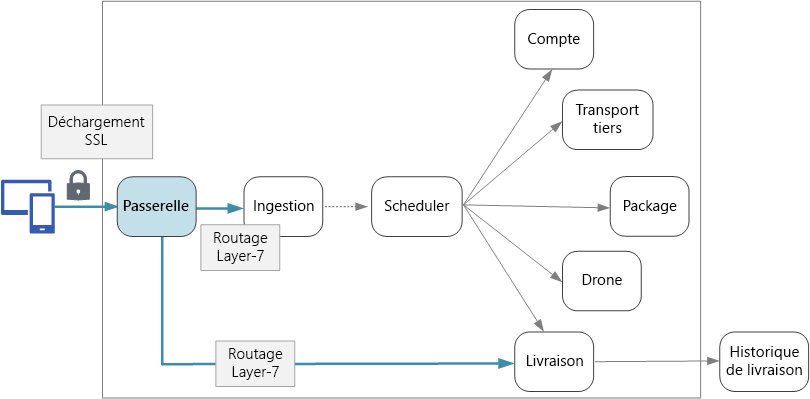

# Conception de microservices : passerelles d’APIDesigning microservices: API gateways

Dans une architecture microservices, un client peut interagir avec plusieurs services frontaux.In a microservices architecture, a client might interact with more than one front-end service. Dans ce cas, comment un client sait-il quels points de terminaison appeler ?Given this fact, how does a client know what endpoints to call? Que se passe-t-il lors de l’introduction de nouveaux services ou lorsque des services existants sont refactorisés ?What happens when new services are introduced, or existing services are refactored? Comment les services gèrent-ils l’arrêt SSL, l’authentification et les autres problèmes ?How do services handle SSL termination, authentication, and other concerns? Une *passerelle d’API* permet de relever ces défis.An *API gateway* can help to address these challenges. 

## Qu'est-ce qu'une passerelle d'API ?What is an API gateway?

Une passerelle d’API se situe entre les clients et les services.An API gateway sits between clients and services. Elle agit comme un proxy inverse, en acheminant les requêtes des clients vers les services.It acts as a reverse proxy, routing requests from clients to services. Elle peut également effectuer diverses tâches transversales telles que l’authentification, l’arrêt SSL et la limitation du débit.It may also perform various cross-cutting tasks such as authentication, SSL termination, and rate limiting. Si vous ne pouvez pas déployer de passerelle, les clients doivent envoyer des requêtes directement aux services frontaux.If you don't deploy a gateway, clients must send requests directly to front-end services. Toutefois, il existe certains problèmes potentiels relatifs à l’exposition directe des services aux clients :However, there are some potential problems with exposing services directly to clients:

- Elle peut entraîner un code client complexe.It can result in complex client code. Le client doit effectuer le suivi de plusieurs points de terminaison et gérer les échecs de façon résiliente.The client must keep track of multiple endpoints, and handle failures in a resilient way. 
- Elle crée un couplage entre le client et le serveur principal.It creates coupling between the client and the backend. Le client doit connaître la façon dont les services individuels sont décomposés.The client needs to know how the individual services are decomposed. Cela rend plus difficiles la maintenance du client et la refactorisation des services.That makes it harder to maintain the client and also harder to refactor services.
- Une seule opération peut nécessiter des appels à plusieurs services.A single operation might require calls to multiple services. Cela peut entraîner plusieurs allers-retours réseau entre le client et le serveur, ajoutant ainsi une latence importante.That can result in multiple network round trips between the client and the server, adding significant latency. 
- Chaque service public doit gérer des problèmes tels que l’authentification, le SSL et la limitation du débit client.Each public-facing service must handle concerns such as authentication, SSL, and client rate limiting. 
- Les services doivent exposer un protocole pratique pour le client, comme HTTP ou WebSocket.Services must expose a client-friendly protocol such as HTTP or WebSocket. Cela limite le choix des [protocoles de communication](./interservice-communication.md).This limits the choice of [communication protocols](./interservice-communication.md). 
- Les services avec des points de terminaison publics représentent une surface d’attaque potentielle et doivent être renforcés.Services with public endpoints are a potential attack surface, and must be hardened.

Une passerelle permet de résoudre ces problèmes en dissociant les clients des services.A gateway helps to address these issues by decoupling clients from services. Les passerelles peuvent exécuter un certain nombre de fonctions différentes, et vous n’aurez peut-être pas besoin de toutes.Gateways can perform a number of different functions, and you may not need all of them. Les fonctions peuvent être regroupées dans les modèles de conception suivants :The functions can be grouped into the following design patterns:

[Routage de passerelle](../patterns/gateway-routing.md) :[Gateway Routing](../patterns/gateway-routing.md). utilisez la passerelle comme un proxy inverse pour acheminer les requêtes vers un ou plusieurs services principaux, à l’aide du routage de couche 7.Use the gateway as a reverse proxy to route requests to one or more backend services, using layer 7 routing. La passerelle fournit un point de terminaison unique pour les clients et permet de découpler les clients des services.The gateway provides a single endpoint for clients, and helps to decouple clients from services. 

[Agrégation de passerelle](../patterns/gateway-aggregation.md) :[Gateway Aggregation](../patterns/gateway-aggregation.md). utilisez la passerelle pour agréger plusieurs requêtes individuelles dans une requête unique.Use the gateway to aggregate multiple individual requests into a single request. Ce modèle s’applique lorsqu’une opération requiert des appels à plusieurs services principaux.This pattern applies when a single operation requires calls to multiple backend services. Le client envoie une seule requête à la passerelle.The client sends one request to the gateway. La passerelle répartit les requêtes entre les différents services principaux, puis agrège les résultats et les renvoie au client.The gateway dispatches requests to the various backend services, and then aggregates the results and sends them back to the client. Cela permet de réduire les échanges excessifs entre le client et les services principaux.This helps to reduce chattiness between the client and the backend. 

[Déchargement de passerelle](../patterns/gateway-offloading.md) :[Gateway Offloading](../patterns/gateway-offloading.md). utilisez la passerelle pour décharger des fonctionnalités à partir des services individuels vers la passerelle, en particulier les problèmes transversaux.Use the gateway to offload functionality from individual services to the gateway, particularly cross-cutting concerns. Il peut être utile de regrouper ces fonctions à un seul endroit, plutôt que de confier leur mise en œuvre à chaque service.It can be useful to consolidate these functions into one place, rather than making every service responsible for implementing them. Cela est particulièrement vrai pour les fonctionnalités dont l’implémentation correcte nécessite des compétences particulières, telles que l’authentification et l’autorisation.This is particularly true for features that requires specialized skills to implement correctly, such as authentication and authorization. 

Voici quelques exemples de fonctionnalités qui peuvent être déchargées sur une passerelle :Here are some examples of functionality that could be offloaded to a gateway:

- Arrêt SSLSSL termination
- AuthentificationAuthentication
- Liste verte d’adresses IPIP whitelisting
- Limitation du débit clientClient rate limiting (throttling)
- Enregistrement et surveillanceLogging and monitoring
- Mise en cache des réponsesResponse caching
- Pare-feu d’application webWeb application firewall
- Compression GZIPGZIP compression
- Maintenance du contenu statiqueServicing static content

## Choix d’une technologie de passerelleChoosing a gateway technology

Voici quelques options justifiant l’implémentation d’une passerelle d’API dans votre application.Here are some options for implementing an API gateway in your application.

- **Serveur proxy inverse** :**Reverse proxy server**. Nginx et HAProxy sont des serveurs proxy inverse courants qui prennent en charge des fonctionnalités telles que l’équilibrage de charge, le SSL et le routage de couche 7.Nginx and HAProxy are popular reverse proxy servers that support features such as load balancing, SSL, and layer 7 routing. Tous deux sont des produits libres et open source, avec des éditions payantes qui fournissent des fonctionnalités supplémentaires et des options de support.They are both free, open-source products, with paid editions that provide additional features and support options. Nginx et HAProxy sont des produits matures, dotés de riches ensembles de fonctionnalités et aux hautes performances.Nginx and HAProxy are both mature products with rich feature sets and high performance. Vous pouvez les étendre avec des modules tiers ou en écrivant des scripts personnalisés dans Lua.You can extend them with third-party modules or by writing custom scripts in Lua. Nginx prend également en charge un module de création de script basé sur JavaScript, appelé NginScript.Nginx also supports a JavaScript-based scripting module called NginScript.

- **Contrôleur d’entrée de maillage de service** :**Service mesh ingress controller**. si vous utilisez un maillage de service tel que linkerd ou Istio, considérez les fonctionnalités fournies par le contrôleur d’entrée de ce service de maillage.If you are using a service mesh such as linkerd or Istio, consider the features that are provided by the ingress controller for that service mesh. Par exemple, le contrôleur d’entrée Istio prend en charge le routage de couche 7, les redirections HTTP, les nouvelles tentatives et d’autres fonctionnalités.For example, the Istio ingress controller supports layer 7 routing, HTTP redirects, retries, and other features. 

- [Azure Application Gateway](/azure/application-gateway/) :[Azure Application Gateway](/azure/application-gateway/). Application Gateway est un service managé d’équilibrage de charge qui peut exécuter un routage de couche 7et un arrêt SSL.Application Gateway is a managed load balancing service that can perform layer-7 routing and SSL termination. Il fournit également un pare-feu d’application web (WAF).It also provides a web application firewall (WAF).

- [Azure API Management](/azure/api-management/) :[Azure API Management](/azure/api-management/). API Management est une solution clé en main pour la publication d’API à destination des clients internes et externes.API Management is a turnkey solution for publishing APIs to external and internal customers. Elle fournit des fonctionnalités utiles pour gérer une API publique, y compris la limitation du débit, la liste verte d’adresses IP et l’authentification à l’aide d’Azure Active Directory ou d’autres fournisseurs d’identité.It provides features that are useful for managing a public-facing API, including rate limiting, IP white listing, and authentication using Azure Active Directory or other identity providers. API Management n’effectue aucun équilibrage de charge. Par conséquent, elle doit être utilisée conjointement à un équilibreur de charge, tel qu’Application Gateway ou un proxy inverse.API Management doesn't perform any load balancing, so it should be used in conjunction with a load balancer such as Application Gateway or a reverse proxy.

Lors du choix d’une technologie de passerelle, considérez les points suivants :When choosing a gateway technology, consider the following:

**Fonctionnalités** :**Features**. les options répertoriées ci-dessus prennent en charge le routage de couche 7, mais la prise en charge des autres fonctionnalités varie.The options listed above all support layer 7 routing, but support for other features will vary. Selon les fonctionnalités dont vous avez besoin, vous pouvez déployer plusieurs passerelles.Depending on the features that you need, you might deploy more than one gateway. 

**Déploiement**.**Deployment**. Azure Application Gateway et API Management sont des services managés.Azure Application Gateway and API Management are managed services. Nginx et HAProxy s’exécutent généralement dans des conteneurs situés à l’intérieur du cluster, mais ils peuvent également être déployés vers des machines virtuelles dédiées en dehors du cluster.Nginx and HAProxy will typically run in containers inside the cluster, but can also be deployed to dedicated VMs outside of the cluster. Cela isole la passerelle du reste de la charge de travail, mais entraîne une surcharge de gestion plus élevée.This isolates the gateway from the rest of the workload, but incurs higher management overhead.

**Gestion** :**Management**. lors de l’ajout ou de la mise à jour de services, les règles de routage de passerelle peuvent nécessiter une mise à jour.When services are updated or new services are added, the gateway routing rules may need to be updated. Envisagez le mode de gestion de ce processus.Consider how this process will be managed. Des considérations similaires s’appliquent à la gestion des certificats SSL, des listes vertes d’adresses IP et d’autres aspects de la configuration.Similar considerations apply to managing SSL certificates, IP whitelists, and other aspects of configuration.

## Points à prendre en considération pour le déploiementDeployment considerations

### Déploiement Nginx ou HAProxy vers KubernetesDeploying Nginx or HAProxy to Kubernetes

Vous pouvez déployer Nginx ou HAProxy sur Kubernetes en tant que [ReplicaSet](https://kubernetes.io/docs/concepts/workloads/controllers/replicaset/) ou [DaemonSet](https://kubernetes.io/docs/concepts/workloads/controllers/daemonset/) qui spécifie l’image de conteneur Nginx ou HAProxy.You can deploy Nginx or HAProxy to Kubernetes as a [ReplicaSet](https://kubernetes.io/docs/concepts/workloads/controllers/replicaset/) or [DaemonSet](https://kubernetes.io/docs/concepts/workloads/controllers/daemonset/) that specifies the Nginx or HAProxy container image. Utilisez un élément ConfigMap pour stocker le fichier de configuration du proxy et montez l’élément ConfigMap en tant que volume.Use a ConfigMap to store the configuration file for the proxy, and mount the ConfigMap as a volume. Créez un service de type LoadBalancer pour exposer la passerelle via un équilibreur de charge Azure.Create a service of type LoadBalancer to expose the gateway through an Azure Load Balancer. 

<!-- - Configure a readiness probe that serves a static file from the gateway (rather than routing to another service). -->

Une alternative consiste à créer un contrôleur d’entrée.An alternative is to create an Ingress Controller. Un contrôleur d’entrée est une ressource Kubernetes qui déploie un équilibreur de charge ou un serveur proxy inverse.An Ingress Controller is a Kubernetes resource that deploys a load balancer or reverse proxy server. Plusieurs implémentations existent, y compris Nginx et HAProxy.Several implementations exist, including Nginx and HAProxy. Une ressource séparée appelée « entrée » définit des paramètres pour le contrôleur d’entrée, tels que des règles de routage et des certificats TLS.A separate resource called an Ingress defines settings for the Ingress Controller, such as routing rules and TLS certificates. De cette façon, vous n’avez pas besoin de gérer des fichiers de configuration complexes propres à une technologie de serveur proxy spécifique.That way, you don't need to manage complex configuration files that are specific to a particular proxy server technology. Les contrôleurs d’entrée sont encore une fonctionnalité bêta de Kubernetes au moment de la rédaction de cet article et continueront d’évoluer.Ingress Controllers are still a beta feature of Kubernetes at the time of this writing, and the feature will continue to evolve.

La passerelle est un point de défaillance unique ou un goulot d’étranglement potentiel dans le système. Déployez donc toujours au moins deux réplicas pour une haute disponibilité.The gateway is a potential bottleneck or single point of failure in the system, so always deploy at least two replicas for high availability. Vous devrez peut-être mettre à l’échelle les réplicas, en fonction de la charge.You may need to scale out the replicas further, depending on the load. 

Envisagez également d’exécuter la passerelle sur un ensemble dédié de nœuds dans le cluster.Also consider running the gateway on a dedicated set of nodes in the cluster. Cette approche présente les avantages suivants :Benefits to this approach include:

- Isolement :Isolation. tout le trafic entrant est envoyé vers un ensemble fixe de nœuds, qui peut être isolé des services principaux.All inbound traffic goes to a fixed set of nodes, which can be isolated from backend services.

- Configuration stable :Stable configuration. si la passerelle est mal configurée, l’application entière peut devenir indisponible.If the gateway is misconfigured, the entire application may become unavailable. 

- Les performances.Performance. vous pouvez utiliser une configuration de machine virtuelle spécifique pour la passerelle pour des raisons de performances.You may want to use a specific VM configuration for the gateway for performance reasons.

<!-- - Load balancing. You can configure the external load balancer so that requests always go to a gateway node. That can save a network hop, which would otherwise happen whenever a request lands on a node that isn't running a gateway pod. This consideration applies mainly to large clusters, where the gateway runs on a relatively small fraction of the total nodes. In Azure Container Service (ACS), this approach currently requires [ACS Engine](https://github.com/Azure/acs-engine)) which allows you to create multiple agent pools. Then you can deploy the gateway as a DaemonSet to the front-end pool. -->

### Azure Application GatewayAzure Application Gateway

Pour connecter Application Gateway à un cluster Kubernetes dans Azure :To connect Application Gateway to a Kubernetes cluster in Azure:

1. Créez un sous-réseau vide dans le réseau virtuel du cluster.Create an empty subnet in the cluster VNet.
2. Déployez Application Gateway.Deploy Application Gateway.
3. Créez un service Kubernetes avec type=[NodePort](https://kubernetes.io/docs/concepts/services-networking/service/#type-nodeport).Create a Kubernetes service with type=[NodePort](https://kubernetes.io/docs/concepts/services-networking/service/#type-nodeport). Cela expose le service sur chaque nœud afin qu’il soit accessible depuis l’extérieur du cluster.This exposes the service on each node so that it can be reached from outside the cluster. Cela ne crée pas d’équilibreur de charge.It does not create a load balancer.
5. Obtenez le numéro de port attribué au service.Get the assigned port number for the service.
6. Ajoutez une règle Application Gateway où :Add an Application Gateway rule where:
    - Le pool principal contient les machines virtuelles d’agent.The backend pool contains the agent VMs.
    - Le paramètre HTTP spécifie le numéro de port de service.The HTTP setting specifies the service port number.
    - Le processus d’écoute de la passerelle écoute sur les ports 80/443.The gateway listener listens on ports 80/443
    
Définissez le nombre d’instances sur 2 ou plus pour la haute disponibilité.Set the instance count to 2 or more for high availability.

### Gestion des API AzureAzure API Management 

Pour connecter API Management à un cluster Kubernetes dans Azure :To connect API Management to a Kubernetes cluster in Azure:

1. Créez un sous-réseau vide dans le réseau virtuel du cluster.Create an empty subnet in the cluster VNet.
2. Déployez API Management vers ce sous-réseau.Deploy API Management to that subnet.
3. Créez un service Kubernetes de type LoadBalancer.Create a Kubernetes service of type LoadBalancer. Utilisez l’annotation d’[équilibreur de charge interne](https://kubernetes.io/docs/concepts/services-networking/service/#internal-load-balancer) pour créer un équilibreur de charge interne, au lieu d’un équilibreur de charge connecté à Internet, qui est l’option par défaut.Use the [internal load balancer](https://kubernetes.io/docs/concepts/services-networking/service/#internal-load-balancer) annotation to create an internal load balancer, instead of an Internet-facing load balancer, which is the default.
4. Recherchez l’adresse IP privée de l’équilibreur de charge interne, à l’aide de kubectl ou de l’interface de ligne de commande Azure.Find the private IP of the internal load balancer, using kubectl or the Azure CLI.
5. Utilisez API Management pour créer une API qui mène à l’adresse IP privée de l’équilibreur de charge.Use API Management to create an API that directs to the private IP address of the load balancer.

Vous pouvez combiner API Management avec un proxy inverse : Nginx, HAProxy ou Azure Application Gateway.Consider combining API Management with a reverse proxy, whether Nginx, HAProxy, or Azure Application Gateway. Pour plus d’informations sur l’utilisation d’API Management avec Application Gateway, voir [Intégration de la gestion des API dans un réseau virtuel interne avec Application Gateway](/azure/api-management/api-management-howto-integrate-internal-vnet-appgateway).For information about using API Management with Application Gateway, see [Integrate API Management in an internal VNET with Application Gateway](/azure/api-management/api-management-howto-integrate-internal-vnet-appgateway).

> [!div class="nextstepaction"]
> [Enregistrement et surveillanceLogging and monitoring](./logging-monitoring.md)
