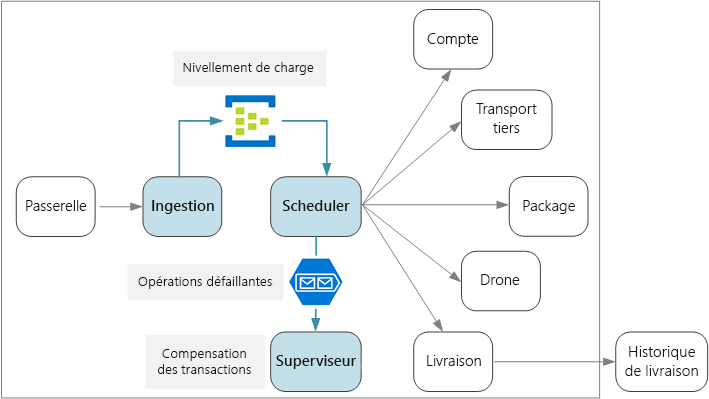
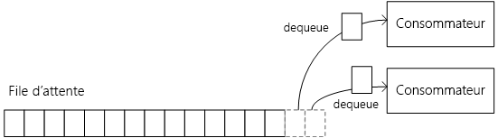
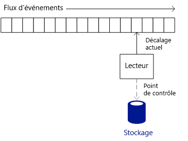
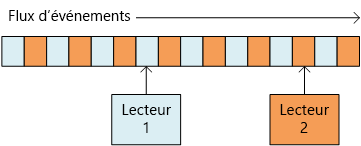
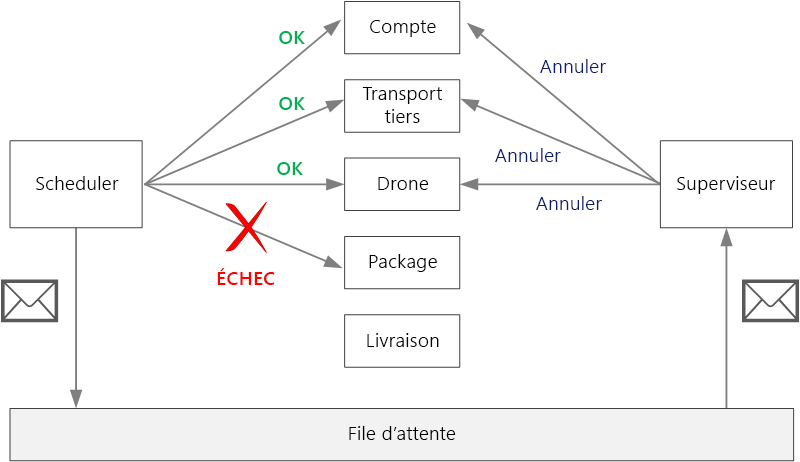

# <a name="designing-microservices-ingestion-and-workflow"></a><span data-ttu-id="8d376-103">Conception de microservices : ingestion et workflow</span><span class="sxs-lookup"><span data-stu-id="8d376-103">Designing microservices: Ingestion and workflow</span></span>

<span data-ttu-id="8d376-104">La plupart du temps, les microservices présentent un workflow qui s’étend sur plusieurs services pour une même transaction.</span><span class="sxs-lookup"><span data-stu-id="8d376-104">Microservices often have a workflow that spans multiple services for a single transaction.</span></span> <span data-ttu-id="8d376-105">Ce workflow doit être fiable ; autrement dit, il ne peut pas perdre de transactions ni les laisser dans un état incomplet.</span><span class="sxs-lookup"><span data-stu-id="8d376-105">The workflow must be reliable; it can't lose transactions or leave them in a partially completed state.</span></span> <span data-ttu-id="8d376-106">Il est également primordial de contrôler le taux d’ingestion des requêtes entrantes.</span><span class="sxs-lookup"><span data-stu-id="8d376-106">It's also critical to control the ingestion rate of incoming requests.</span></span> <span data-ttu-id="8d376-107">Étant donné qu’une multitude de petits services communiquent entre eux, il existe un risque qu’une rafale de requêtes entrantes submerge la communication interservice.</span><span class="sxs-lookup"><span data-stu-id="8d376-107">With many small services communicating with each other, a burst of incoming requests can overwhelm the interservice communication.</span></span> 



## <a name="the-drone-delivery-workflow"></a><span data-ttu-id="8d376-108">Workflow de livraison par drone</span><span class="sxs-lookup"><span data-stu-id="8d376-108">The drone delivery workflow</span></span>

<span data-ttu-id="8d376-109">Dans l’application de livraison par drone Drone Delivery, la planification d’une livraison requiert l’exécution des opérations suivantes :</span><span class="sxs-lookup"><span data-stu-id="8d376-109">In the Drone Delivery application, the following operations must be performed to schedule a delivery:</span></span>

1. <span data-ttu-id="8d376-110">Vérifiez l’état du compte du client (service Account).</span><span class="sxs-lookup"><span data-stu-id="8d376-110">Check the status of the customer's account (Account service).</span></span>
2. <span data-ttu-id="8d376-111">Créez une entité de package (service Package).</span><span class="sxs-lookup"><span data-stu-id="8d376-111">Create a new package entity (Package service).</span></span>
3. <span data-ttu-id="8d376-112">Vérifiez si cette livraison requiert un transport tiers en fonction des emplacements de prélèvement et de livraison (service Third-party Transportation).</span><span class="sxs-lookup"><span data-stu-id="8d376-112">Check whether any third-party transportation is required for this delivery, based on the pickup and delivery locations (Third-party Transportation service).</span></span>
4. <span data-ttu-id="8d376-113">Planifiez un drone pour le prélèvement (service Drone).</span><span class="sxs-lookup"><span data-stu-id="8d376-113">Schedule a drone for pickup (Drone service).</span></span>
5. <span data-ttu-id="8d376-114">Créez une entité de livraison (service Delivery).</span><span class="sxs-lookup"><span data-stu-id="8d376-114">Create a new delivery entity (Delivery service).</span></span>

<span data-ttu-id="8d376-115">Ce workflow constitue le fondement de toute l’application. Le processus de bout en bout doit donc se révéler aussi performant que fiable.</span><span class="sxs-lookup"><span data-stu-id="8d376-115">This is the core of the entire application, so the end-to-end process must be performant as well as reliable.</span></span> <span data-ttu-id="8d376-116">Vous devez relever certains défis spécifiques :</span><span class="sxs-lookup"><span data-stu-id="8d376-116">Some particular challenges must be addressed:</span></span>

- <span data-ttu-id="8d376-117">**Nivellement de charge**.</span><span class="sxs-lookup"><span data-stu-id="8d376-117">**Load leveling**.</span></span> <span data-ttu-id="8d376-118">Un nombre excessif de requêtes de client risque de submerger le système avec un trafic réseau interservice.</span><span class="sxs-lookup"><span data-stu-id="8d376-118">Too many client requests can overwhelm the system with interservice network traffic.</span></span> <span data-ttu-id="8d376-119">Ce volume de requêtes est également susceptible de surcharger les dépendances du serveur principal, comme les services de stockage ou les services distants.</span><span class="sxs-lookup"><span data-stu-id="8d376-119">It can also overwhelm backend dependencies such as storage or remote services.</span></span> <span data-ttu-id="8d376-120">Ces derniers peuvent réagir en limitant les services qui les appellent, engendrant ainsi une régulation de flux dans le système.</span><span class="sxs-lookup"><span data-stu-id="8d376-120">These may react by throttling the services calling them, creating backpressure in the system.</span></span> <span data-ttu-id="8d376-121">Par conséquent, il est important de niveler la charge des requêtes qui entrent dans le système en plaçant ces dernières dans une mémoire tampon ou dans une file d’attente pour traitement.</span><span class="sxs-lookup"><span data-stu-id="8d376-121">Therefore, it's important to load level the requests coming into the system, by putting them into a buffer or queue for processing.</span></span> 

- <span data-ttu-id="8d376-122">**Garantie de remise**.</span><span class="sxs-lookup"><span data-stu-id="8d376-122">**Guaranteed delivery**.</span></span> <span data-ttu-id="8d376-123">Pour éviter l’abandon d’une quelconque requête de client, le composant d’ingestion doit garantir le fait que les messages sont remis au moins une fois.</span><span class="sxs-lookup"><span data-stu-id="8d376-123">To avoid dropping any client requests, the ingestion component must guarantee at-least-once delivery of messages.</span></span> 

- <span data-ttu-id="8d376-124">**Gestion des erreurs**.</span><span class="sxs-lookup"><span data-stu-id="8d376-124">**Error handling**.</span></span> <span data-ttu-id="8d376-125">Si l’un des services renvoie un code d’erreur ou rencontre un échec non temporaire, la livraison ne peut pas être planifiée.</span><span class="sxs-lookup"><span data-stu-id="8d376-125">If any of the services returns an error code or experiences a non-transient failure, the delivery cannot be scheduled.</span></span> <span data-ttu-id="8d376-126">Un code d’erreur peut signaler une condition d’erreur attendue (par exemple, suspension du compte du client) ou une erreur de serveur inattendue (HTTP 5xx).</span><span class="sxs-lookup"><span data-stu-id="8d376-126">An error code might indicate an expected error condition (for example, the customer's account is suspended) or an unexpected server error (HTTP 5xx).</span></span> <span data-ttu-id="8d376-127">Il est également possible qu’un service ne soit pas disponible et entraîne alors l’expiration de l’appel réseau.</span><span class="sxs-lookup"><span data-stu-id="8d376-127">A service might also be unavailable, causing the network call to time out.</span></span> 

<span data-ttu-id="8d376-128">Nous allons commencer par examiner le côté ingestion de l’équation, autrement dit, la façon dont le système peut ingérer les requêtes utilisateur entrantes à haut débit.</span><span class="sxs-lookup"><span data-stu-id="8d376-128">First we'll look at the ingestion side of the equation &mdash; how the system can ingest incoming user requests at high throughput.</span></span> <span data-ttu-id="8d376-129">Ensuite, nous étudierons la manière dont l’application de livraison par drone peut implémenter un workflow fiable.</span><span class="sxs-lookup"><span data-stu-id="8d376-129">Then we'll consider how the drone delivery application can implement a reliable workflow.</span></span> <span data-ttu-id="8d376-130">Il s’avère que la conception du sous-système d’ingestion affecte le serveur principal du workflow.</span><span class="sxs-lookup"><span data-stu-id="8d376-130">It turns out that the design of the ingestion subsystem affects the workflow backend.</span></span> 

## <a name="ingestion"></a><span data-ttu-id="8d376-131">Ingestion</span><span class="sxs-lookup"><span data-stu-id="8d376-131">Ingestion</span></span>

<span data-ttu-id="8d376-132">En se basant sur les exigences métiers, l’équipe de développement a identifié les impératifs non fonctionnels ci-après en matière d’ingestion :</span><span class="sxs-lookup"><span data-stu-id="8d376-132">Based on business requirements, the development team identified the following non-functional requirements for ingestion:</span></span>

- <span data-ttu-id="8d376-133">débit soutenu de 10 000 requêtes par seconde ;</span><span class="sxs-lookup"><span data-stu-id="8d376-133">Sustained throughput of 10K requests/sec.</span></span>
- <span data-ttu-id="8d376-134">capacité de prise en charge de pics atteignant jusqu’à 50 000 requêtes par seconde sans abandon de requêtes de client ni expiration du délai d’attente ;</span><span class="sxs-lookup"><span data-stu-id="8d376-134">Able to handle spikes of up to 50K/sec without dropping client requests or timing out.</span></span>
- <span data-ttu-id="8d376-135">latence inférieure à 500 ms au 99e centile.</span><span class="sxs-lookup"><span data-stu-id="8d376-135">Less than 500ms latency in the 99th percentile.</span></span>

<span data-ttu-id="8d376-136">L’obligation de gérer les pics de trafic occasionnels représente un véritable défi de conception.</span><span class="sxs-lookup"><span data-stu-id="8d376-136">The requirement to handle occasional spikes in traffic presents a design challenge.</span></span> <span data-ttu-id="8d376-137">Il serait théoriquement possible d’augmenter la taille des instances du système afin de prendre en charge le trafic attendu maximal.</span><span class="sxs-lookup"><span data-stu-id="8d376-137">In theory, the system could be scaled out to handle the maximum expected traffic.</span></span> <span data-ttu-id="8d376-138">Toutefois, l’approvisionnement d’un tel volume de ressources se révélerait hautement inefficace.</span><span class="sxs-lookup"><span data-stu-id="8d376-138">However, provisioning that many resources would be very inefficient.</span></span> <span data-ttu-id="8d376-139">En effet, dans la majorité des cas, l’application n’aura pas besoin d’une telle capacité, de sorte que certains cœurs resteront inactifs, occasionnant ainsi des dépenses inutiles sans offrir de valeur ajoutée.</span><span class="sxs-lookup"><span data-stu-id="8d376-139">Most of the time, the application will not need that much capacity, so there would be idle cores, costing money without adding value.</span></span>

<span data-ttu-id="8d376-140">Une meilleure approche consiste à placer les requêtes entrantes dans une mémoire tampon et à permettre à cette dernière de niveler la charge.</span><span class="sxs-lookup"><span data-stu-id="8d376-140">A better approach is to put the incoming requests into a buffer, and let the buffer act as a load leveler.</span></span> <span data-ttu-id="8d376-141">Dans le cadre de cette conception, le service Ingestion doit être en mesure de prendre en charge le taux d’ingestion maximal sur de courtes périodes, alors que les services principaux ont seulement besoin de gérer la charge soutenue maximale.</span><span class="sxs-lookup"><span data-stu-id="8d376-141">With this design, the Ingestion service must be able to handle the maximum ingestion rate over short periods, but the backend services only need to handle the maximum sustained load.</span></span> <span data-ttu-id="8d376-142">Grâce à la mise en mémoire tampon au niveau du frontal, il n’est pas nécessaire que les services principaux prennent en charge les pics de trafic importants.</span><span class="sxs-lookup"><span data-stu-id="8d376-142">By buffering at the front end, the backend services shouldn't need to handle large spikes in traffic.</span></span> <span data-ttu-id="8d376-143">À l’échelle requise pour l’application Drone Delivery, [Azure Event Hubs](/azure/event-hubs/) constitue un choix judicieux pour le nivellement de charge.</span><span class="sxs-lookup"><span data-stu-id="8d376-143">At the scale required for the Drone Delivery application, [Azure Event Hubs](/azure/event-hubs/) is a good choice for load leveling.</span></span> <span data-ttu-id="8d376-144">Event Hubs offre une latence faible et un débit élevé, et constitue une solution rentable en cas de volumes d’ingestion élevés.</span><span class="sxs-lookup"><span data-stu-id="8d376-144">Event Hubs offers low latency and high throughput, and is a cost effective solution at high ingestion volumes.</span></span> 

<span data-ttu-id="8d376-145">Pour nos tests, nous avons utilisé un Event Hub de niveau Standard avec 32 partitions et 100 unités de débit.</span><span class="sxs-lookup"><span data-stu-id="8d376-145">For our testing, we used a Standard tier event hub with 32 partitions and 100 throughput units.</span></span> <span data-ttu-id="8d376-146">Nous avons observé un taux d’ingestion de 32 000 événements/seconde environ, avec une latence approximative de 90 ms.</span><span class="sxs-lookup"><span data-stu-id="8d376-146">We observed about 32K events / second ingestion, with latency around 90ms.</span></span> <span data-ttu-id="8d376-147">Pour l’instant, la limite par défaut est de 20 unités de débit, mais les clients Azure peuvent demander des unités de débit supplémentaires en créant une demande de support.</span><span class="sxs-lookup"><span data-stu-id="8d376-147">Currently the default limit is 20 throughput units, but Azure customers can request additional throughput units by filing a support request.</span></span> <span data-ttu-id="8d376-148">Pour plus d’informations, consultez l’article [Quotas Event Hubs](/azure/event-hubs/event-hubs-quotas).</span><span class="sxs-lookup"><span data-stu-id="8d376-148">See [Event Hubs quotas](/azure/event-hubs/event-hubs-quotas) for more information.</span></span> <span data-ttu-id="8d376-149">Comme pour toutes les mesures de performances, de nombreux facteurs peuvent affecter les performances, comme la taille de charge utile des messages ; par conséquent, n’interprétez pas ces valeurs comme un point de référence.</span><span class="sxs-lookup"><span data-stu-id="8d376-149">As with all performance metrics, many factors can affect performance, such as message payload size, so don't interpret these numbers as a benchmark.</span></span> <span data-ttu-id="8d376-150">Si un débit supplémentaire est nécessaire, le service Ingestion peut partitionner les données entre plusieurs Event Hubs.</span><span class="sxs-lookup"><span data-stu-id="8d376-150">If more throughput is needed, the Ingestion service can shard across more than one event hub.</span></span> <span data-ttu-id="8d376-151">Pour des débits encore plus élevés, [Event Hubs Dedicated](/azure/event-hubs/event-hubs-dedicated-overview) offre des déploiements à locataire unique qui peuvent accepter plus de 2 millions d’événements par seconde.</span><span class="sxs-lookup"><span data-stu-id="8d376-151">For even higher throughput rates, [Event Hubs Dedicated](/azure/event-hubs/event-hubs-dedicated-overview) offers single-tenant deployments that can ingress over 2 million events per second.</span></span>

<span data-ttu-id="8d376-152">Il est important de comprendre de quelle façon Event Hubs peut atteindre un débit aussi élevé, car ceci a une incidence sur le mode de consommation des messages d’Event Hubs par un client.</span><span class="sxs-lookup"><span data-stu-id="8d376-152">It's important to understand how Event Hubs can achieve such high throughput, because that affects how a client should consume messages from Event Hubs.</span></span> <span data-ttu-id="8d376-153">Le service Event Hubs n’implémente pas de *file d’attente*.</span><span class="sxs-lookup"><span data-stu-id="8d376-153">Event Hubs does not implement a *queue*.</span></span> <span data-ttu-id="8d376-154">À la place, il met en œuvre un *flux d’événements*.</span><span class="sxs-lookup"><span data-stu-id="8d376-154">Rather, it implements an *event stream*.</span></span> 

<span data-ttu-id="8d376-155">Dans le cadre de l’utilisation d’une file d’attente, un consommateur spécifique peut supprimer un message de la file d’attente, auquel cas le consommateur suivant ne verra pas ce message.</span><span class="sxs-lookup"><span data-stu-id="8d376-155">With a queue, an individual consumer can remove a message from the queue, and the next consumer won't see that message.</span></span> <span data-ttu-id="8d376-156">Les files d’attente vous permettent donc d’utiliser un [modèle de consommateurs concurrents](../patterns/competing-consumers.md) pour traiter les messages en parallèle et pour améliorer l’extensibilité.</span><span class="sxs-lookup"><span data-stu-id="8d376-156">Queues therefore allow you to use a [Competing Consumers pattern](../patterns/competing-consumers.md) to process messages in parallel and improve scalability.</span></span> <span data-ttu-id="8d376-157">En vue d’accroître la résilience, le consommateur maintient un verrou sur le message et libère ce verrou une fois qu’il a fini de traiter le message.</span><span class="sxs-lookup"><span data-stu-id="8d376-157">For greater resiliency, the consumer holds a lock on the message and releases the lock when it's done processing the message.</span></span> <span data-ttu-id="8d376-158">Si le consommateur échoue &mdash; par exemple, si le nœud sur lequel il s’exécute cesse de fonctionner &mdash; le verrou expire et le message réintègre la file d’attente.</span><span class="sxs-lookup"><span data-stu-id="8d376-158">If the consumer fails &mdash; for example, the node it's running on crashes &mdash; the lock times out and the message goes back onto the queue.</span></span> 



<span data-ttu-id="8d376-159">En revanche, Event Hubs utilise une sémantique de diffusion en continu.</span><span class="sxs-lookup"><span data-stu-id="8d376-159">Event Hubs, on the other hand, uses streaming semantics.</span></span> <span data-ttu-id="8d376-160">Les consommateurs lisent le flux de manière indépendante à leur propre rythme.</span><span class="sxs-lookup"><span data-stu-id="8d376-160">Consumers read the stream independently at their own pace.</span></span> <span data-ttu-id="8d376-161">Chaque consommateur est chargé d’assurer le suivi de sa position actuelle dans le flux.</span><span class="sxs-lookup"><span data-stu-id="8d376-161">Each consumer is responsible for keeping track of its current position in the stream.</span></span> <span data-ttu-id="8d376-162">Un consommateur doit écrire sa position actuelle dans le stockage persistant à intervalle régulier prédéfini.</span><span class="sxs-lookup"><span data-stu-id="8d376-162">A consumer should write its current position to persistent storage at some predefined interval.</span></span> <span data-ttu-id="8d376-163">De cette façon, si le consommateur rencontre une erreur (par exemple, blocage du consommateur ou échec de l’hôte), une nouvelle instance peut reprendre la lecture du flux à partir de la dernière position enregistrée.</span><span class="sxs-lookup"><span data-stu-id="8d376-163">That way, if the consumer experiences a fault (for example, the consumer crashes, or the host fails), then a new instance can resume reading the stream from the last recorded position.</span></span> <span data-ttu-id="8d376-164">Ce processus est désigné sous le terme de *création de points de contrôle*.</span><span class="sxs-lookup"><span data-stu-id="8d376-164">This process is called *checkpointing*.</span></span> 

<span data-ttu-id="8d376-165">Pour des raisons de performances, un consommateur ne crée généralement pas de point de contrôle après chaque message.</span><span class="sxs-lookup"><span data-stu-id="8d376-165">For performance reasons, a consumer generally doesn't checkpoint after each message.</span></span> <span data-ttu-id="8d376-166">À la place, il effectue cette opération à intervalle régulier, par exemple après le traitement de *n* messages, ou toutes les *n* secondes.</span><span class="sxs-lookup"><span data-stu-id="8d376-166">Instead, it checkpoints at some fixed interval, for example after processing *n* messages, or every *n* seconds.</span></span> <span data-ttu-id="8d376-167">Par conséquent, en cas d’échec d’un consommateur, il est possible que certains événements soient traités deux fois, car une nouvelle instance repart toujours du dernier point de contrôle.</span><span class="sxs-lookup"><span data-stu-id="8d376-167">As a consequence, if a consumer fails, some events may get processed twice, because a new instance always picks up from the last checkpoint.</span></span> <span data-ttu-id="8d376-168">Cette approche implique de trouver un juste équilibre : des points de contrôle fréquents peuvent nuire aux performances, mais des points de contrôle trop rares nécessiteront la relecture d’un plus grand nombre d’événements après un échec.</span><span class="sxs-lookup"><span data-stu-id="8d376-168">There is a tradeoff: Frequent checkpoints can hurt performance, but sparse checkpoints mean you will replay more events after a failure.</span></span>  


 
<span data-ttu-id="8d376-169">Le service Event Hubs n’est pas conçu pour prendre en charge des consommateurs concurrents.</span><span class="sxs-lookup"><span data-stu-id="8d376-169">Event Hubs is not designed for competing consumers.</span></span> <span data-ttu-id="8d376-170">Bien que plusieurs consommateurs puissent lire un flux, chacun d’eux parcourt le flux indépendamment.</span><span class="sxs-lookup"><span data-stu-id="8d376-170">Although multiple consumers can read a stream, each traverses the stream independently.</span></span> <span data-ttu-id="8d376-171">À la place, Event Hubs utilise un modèle de consommateur partitionné.</span><span class="sxs-lookup"><span data-stu-id="8d376-171">Instead, Event Hubs uses a partitioned consumer pattern.</span></span> <span data-ttu-id="8d376-172">Un Event Hub comporte jusqu’à 32 partitions.</span><span class="sxs-lookup"><span data-stu-id="8d376-172">An event hub has up to 32 partitions.</span></span> <span data-ttu-id="8d376-173">La mise à l’échelle horizontale est obtenue par l’attribution d’un consommateur distinct à chaque partition.</span><span class="sxs-lookup"><span data-stu-id="8d376-173">Horizontal scale is achieved by assigning a separate consumer to each partition.</span></span>

<span data-ttu-id="8d376-174">Qu’est-ce que cela signifie pour le workflow de livraison par drone ?</span><span class="sxs-lookup"><span data-stu-id="8d376-174">What does this mean for the drone delivery workflow?</span></span> <span data-ttu-id="8d376-175">Pour tirer pleinement parti d’Event Hubs, le service Delivery Scheduler ne peut pas attendre que chaque message soit traité avant de passer au message suivant.</span><span class="sxs-lookup"><span data-stu-id="8d376-175">To get the full benefit of Event Hubs, the Delivery Scheduler cannot wait for each message to be processed before moving onto the next.</span></span> <span data-ttu-id="8d376-176">S’il procède de cette façon, il passera la plupart de son temps à attendre que les appels réseau soient terminés.</span><span class="sxs-lookup"><span data-stu-id="8d376-176">If it does that, it will spend most of its time waiting for network calls to complete.</span></span> <span data-ttu-id="8d376-177">À la place, il doit traiter des lots de messages en parallèle à l’aide d’appels asynchrones vers les services principaux.</span><span class="sxs-lookup"><span data-stu-id="8d376-177">Instead, it needs to process batches of messages in parallel, using asynchronous calls to the backend services.</span></span> <span data-ttu-id="8d376-178">Comme nous allons le voir, il est également important de choisir une stratégie de création de points de contrôle adéquate.</span><span class="sxs-lookup"><span data-stu-id="8d376-178">As we'll see, choosing the right checkpointing strategy is also important.</span></span>  

## <a name="workflow"></a><span data-ttu-id="8d376-179">Workflow</span><span class="sxs-lookup"><span data-stu-id="8d376-179">Workflow</span></span>

<span data-ttu-id="8d376-180">Nous avons examiné trois options pour la lecture et le traitement des messages : hôte du processeur d’événements, files d’attente Service Bus et bibliothèque IoTHub React.</span><span class="sxs-lookup"><span data-stu-id="8d376-180">We looked at three options for reading and processing the messages: Event Processor Host, Service Bus queues, and the IoTHub React library.</span></span> <span data-ttu-id="8d376-181">Nous avons opté pour IoTHub React, mais pour que vous en compreniez la raison, il est utile de commencer par examiner l’option d’utilisation de l’hôte du processeur d’événements.</span><span class="sxs-lookup"><span data-stu-id="8d376-181">We chose IoTHub React, but to understand why, it helps to start with Event Processor Host.</span></span> 

### <a name="event-processor-host"></a><span data-ttu-id="8d376-182">Hôte du processeur d’événements</span><span class="sxs-lookup"><span data-stu-id="8d376-182">Event Processor Host</span></span>

<span data-ttu-id="8d376-183">L’hôte du processeur d’événements est conçu pour le traitement de messages par lot.</span><span class="sxs-lookup"><span data-stu-id="8d376-183">Event Processor Host is designed for message batching.</span></span> <span data-ttu-id="8d376-184">L’application implémente l’interface `IEventProcessor`, et l’hôte du processeur crée une instance de processeur d’événements pour chaque partition dans l’Event Hub.</span><span class="sxs-lookup"><span data-stu-id="8d376-184">The application implements the `IEventProcessor` interface, and the Processor Host creates one event processor instance for each partition in the event hub.</span></span> <span data-ttu-id="8d376-185">Ensuite, l’hôte du processeur d’événements appelle la méthode `ProcessEventsAsync` de chaque processeur d’événements avec les lots de messages d’événement.</span><span class="sxs-lookup"><span data-stu-id="8d376-185">The Event Processor Host then calls each event processor's `ProcessEventsAsync` method with batches of event messages.</span></span> <span data-ttu-id="8d376-186">L’application détermine quand créer des points de contrôle dans la méthode `ProcessEventsAsync`, et l’hôte du processeur d’événements écrit ces points de contrôle dans le stockage Azure.</span><span class="sxs-lookup"><span data-stu-id="8d376-186">The application controls when to checkpoint inside the `ProcessEventsAsync` method, and the Event Processor Host writes the checkpoints to Azure storage.</span></span> 

<span data-ttu-id="8d376-187">Dans une partition, l’hôte du processeur d’événements attend que la méthode `ProcessEventsAsync` soit renvoyée avant de l’appeler de nouveau avec le lot suivant.</span><span class="sxs-lookup"><span data-stu-id="8d376-187">Within a partition, Event Processor Host waits for `ProcessEventsAsync` to return before calling again with the next batch.</span></span> <span data-ttu-id="8d376-188">Cette approche simplifie le modèle de programmation, car votre code de traitement des événements n’a pas besoin d’être réentrant.</span><span class="sxs-lookup"><span data-stu-id="8d376-188">This approach simplifies the programming model, because your event processing code doesn't need to be reentrant.</span></span> <span data-ttu-id="8d376-189">Toutefois, cela signifie également que le processeur d’événements ne gère qu’un lot à la fois, et cela restreint la vitesse à laquelle l’hôte du processeur peut pomper les messages.</span><span class="sxs-lookup"><span data-stu-id="8d376-189">However, it also means that the event processor handles one batch at a time, and this gates the speed at which the Processor Host can pump messages.</span></span>

> [!NOTE] 
> <span data-ttu-id="8d376-190">L’hôte du processeur *n’attend* pas à proprement parler, dans le sens où il bloquerait un thread.</span><span class="sxs-lookup"><span data-stu-id="8d376-190">The Processor Host doesn't actually *wait* in the sense of blocking a thread.</span></span> <span data-ttu-id="8d376-191">La méthode `ProcessEventsAsync` est asynchrone, de sorte que l’hôte du processeur peut accomplir d’autres tâches pendant que la méthode s’exécute.</span><span class="sxs-lookup"><span data-stu-id="8d376-191">The `ProcessEventsAsync` method is asynchronous, so the Processor Host can do other work while the method is completing.</span></span> <span data-ttu-id="8d376-192">Mais il ne remettra aucun autre lot de messages pour cette partition tant que la méthode n’aura pas été renvoyée.</span><span class="sxs-lookup"><span data-stu-id="8d376-192">But it won't deliver another batch of messages for that partition until the method returns.</span></span> 

<span data-ttu-id="8d376-193">Dans l’application de livraison par drone, un lot de messages peut être traité en parallèle.</span><span class="sxs-lookup"><span data-stu-id="8d376-193">In the drone application, a batch of messages can be processed in parallel.</span></span> <span data-ttu-id="8d376-194">Toutefois, l’attente du traitement de la totalité du lot est toujours susceptible d’entraîner un goulot d’étranglement.</span><span class="sxs-lookup"><span data-stu-id="8d376-194">But waiting for the whole batch to complete can still cause a bottleneck.</span></span> <span data-ttu-id="8d376-195">La vitesse du traitement est tributaire de celle du message le plus lent d’un lot.</span><span class="sxs-lookup"><span data-stu-id="8d376-195">Processing can only be as fast as the slowest message within a batch.</span></span> <span data-ttu-id="8d376-196">Toute variation des temps de réponse peut engendrer une « longue file » dans le cadre de laquelle quelques réponses lentes ralentissent la totalité du système.</span><span class="sxs-lookup"><span data-stu-id="8d376-196">Any variation in response times can create a "long tail," where a few slow responses drag down the entire system.</span></span> <span data-ttu-id="8d376-197">Nos tests de performances ont montré que cette approche ne nous permettait pas d’atteindre notre débit cible.</span><span class="sxs-lookup"><span data-stu-id="8d376-197">Our performance tests showed that we did not achieve our target throughput using this approach.</span></span> <span data-ttu-id="8d376-198">Cela ne signifie *pas* qu’il vous faille éviter d’utiliser l’hôte du processeur d’événements.</span><span class="sxs-lookup"><span data-stu-id="8d376-198">This does *not* mean that you should avoid using Event Processor Host.</span></span> <span data-ttu-id="8d376-199">Mais dans le cas d’un débit élevé, évitez d’exécuter des tâches de longue durée à l’intérieur de la méthode `ProcesssEventsAsync`.</span><span class="sxs-lookup"><span data-stu-id="8d376-199">But for high throughput, avoid doing any long-running tasks inside the `ProcesssEventsAsync` method.</span></span> <span data-ttu-id="8d376-200">Traitez chaque lot rapidement.</span><span class="sxs-lookup"><span data-stu-id="8d376-200">Process each batch quickly.</span></span>

### <a name="iothub-react"></a><span data-ttu-id="8d376-201">IotHub React</span><span class="sxs-lookup"><span data-stu-id="8d376-201">IotHub React</span></span> 

<span data-ttu-id="8d376-202">[IotHub React](https://github.com/Azure/toketi-iothubreact) est une bibliothèque Akka Streams pour la lecture d’événements issus d’Event Hubs.</span><span class="sxs-lookup"><span data-stu-id="8d376-202">[IotHub React](https://github.com/Azure/toketi-iothubreact) is an Akka Streams library for reading events from Event Hub.</span></span> <span data-ttu-id="8d376-203">Akka Streams est une infrastructure de programmation basée sur des flux qui implémente la spécification [Reactive Streams](http://www.reactive-streams.org/).</span><span class="sxs-lookup"><span data-stu-id="8d376-203">Akka Streams is a stream-based programming framework that implements the [Reactive Streams](http://www.reactive-streams.org/) specification.</span></span> <span data-ttu-id="8d376-204">Elle permet de générer des pipelines de diffusion en continu efficaces, dans le cadre desquels toutes les opérations de diffusion en continu sont exécutées de manière asynchrone, et où les pipelines gèrent la régulation de flux de manière appropriée.</span><span class="sxs-lookup"><span data-stu-id="8d376-204">It provides a way to build efficient streaming pipelines, where all streaming operations are performed asynchronously, and the pipeline gracefully handles backpressure.</span></span> <span data-ttu-id="8d376-205">Une régulation de flux se produit lorsqu’une source d’événements produit des événements plus rapidement que les consommateurs en aval ne peuvent les recevoir &mdash; ce qui est précisément le cas lorsque le système de livraison par drone rencontre un pic de trafic.</span><span class="sxs-lookup"><span data-stu-id="8d376-205">Backpressure occurs when an event source produces events at a faster rate than the downstream consumers can receive them &mdash; which is exactly the situation when the drone delivery system has a spike in traffic.</span></span> <span data-ttu-id="8d376-206">Si les services principaux fonctionnent moins rapidement, IoTHub React ralentira.</span><span class="sxs-lookup"><span data-stu-id="8d376-206">If backend services go slower, IoTHub React will slow down.</span></span> <span data-ttu-id="8d376-207">Si la capacité est accrue, IoTHub React transmettra (push) davantage de messages par le biais du pipeline.</span><span class="sxs-lookup"><span data-stu-id="8d376-207">If capacity is increased, IoTHub React will push more messages through the pipeline.</span></span>

<span data-ttu-id="8d376-208">Akka Streams constitue également un modèle de programmation très naturel pour la diffusion en continu d’événements à partir d’Event Hubs.</span><span class="sxs-lookup"><span data-stu-id="8d376-208">Akka Streams is also a very natural programming model for streaming events from Event Hubs.</span></span> <span data-ttu-id="8d376-209">Au lieu d’effectuer une boucle sur un lot d’événements, vous définissez un ensemble d’opérations qui seront appliquées à chaque événement, et vous laissez Akka Streams gérer la diffusion en continu.</span><span class="sxs-lookup"><span data-stu-id="8d376-209">Instead of looping through a batch of events, you define a set of operations that will be applied to each event, and let Akka Streams handle the streaming.</span></span> <span data-ttu-id="8d376-210">Akka Streams définit un pipeline de diffusion en continu en termes de *sources*, de *flux* et de *récepteurs*.</span><span class="sxs-lookup"><span data-stu-id="8d376-210">Akka Streams defines a streaming pipeline in terms of *Sources*, *Flows*, and *Sinks*.</span></span> <span data-ttu-id="8d376-211">Une source génère un flux de sortie, un flux traite un flux d’entrée et produit un flux de sortie, et un récepteur consomme un flux sans produire de sortie.</span><span class="sxs-lookup"><span data-stu-id="8d376-211">A source generates an output stream, a flow processes an input stream and produces an output stream, and a sink consumes a stream without producing any output.</span></span>

<span data-ttu-id="8d376-212">Voici le code du service Scheduler qui configure le pipeline Akka Streams :</span><span class="sxs-lookup"><span data-stu-id="8d376-212">Here is the code in the Scheduler service that sets up the Akka Streams pipeline:</span></span>

```java
IoTHub iotHub = new IoTHub();
Source<MessageFromDevice, NotUsed> messages = iotHub.source(options);

messages.map(msg -> DeliveryRequestEventProcessor.parseDeliveryRequest(msg))
        .filter(ad -> ad.getDelivery() != null).via(deliveryProcessor()).to(iotHub.checkpointSink())
        .run(streamMaterializer);
```

<span data-ttu-id="8d376-213">Ce code configure Event Hubs en tant que source.</span><span class="sxs-lookup"><span data-stu-id="8d376-213">This code configures Event Hubs as a source.</span></span> <span data-ttu-id="8d376-214">L’instruction `map` désérialise chaque message d’événement dans une classe Java qui représente une requête de livraison.</span><span class="sxs-lookup"><span data-stu-id="8d376-214">The `map` statement deserializes each event message into a Java class that represents a delivery request.</span></span> <span data-ttu-id="8d376-215">L’instruction `filter` supprime tous les objets `null` du flux ; ceci évite les situations dans lesquelles un message ne peut pas être désérialisé.</span><span class="sxs-lookup"><span data-stu-id="8d376-215">The `filter` statement removes any `null` objects from the stream; this guards against the case where a message can't be deserialized.</span></span> <span data-ttu-id="8d376-216">L’instruction `via` joint la source à un flux qui traite chaque requête de livraison.</span><span class="sxs-lookup"><span data-stu-id="8d376-216">The `via` statement joins the source to a flow that processes each delivery request.</span></span> <span data-ttu-id="8d376-217">La méthode `to` joint le flux au récepteur de points de contrôle, qui est intégré à IoTHub React.</span><span class="sxs-lookup"><span data-stu-id="8d376-217">The `to` method joins the flow to the checkpoint sink, which is built into IoTHub React.</span></span>

<span data-ttu-id="8d376-218">IoTHub React utilise une autre stratégie de points de contrôle que l’hôte du processeur d’événements.</span><span class="sxs-lookup"><span data-stu-id="8d376-218">IoTHub React uses a different checkpointing strategy than Event Host Processor.</span></span> <span data-ttu-id="8d376-219">Les points de contrôle sont écrits par le récepteur de points de contrôle, qui constitue la phase finale du pipeline.</span><span class="sxs-lookup"><span data-stu-id="8d376-219">Checkpoints are written by the checkpoint sink, which is the terminating stage in the pipeline.</span></span> <span data-ttu-id="8d376-220">La conception d’Akka Streams permet au pipeline de poursuivre la diffusion en continu des données pendant que le récepteur écrit le point de contrôle.</span><span class="sxs-lookup"><span data-stu-id="8d376-220">The design of Akka Streams allows the pipeline to continue streaming data while the sink is writing the checkpoint.</span></span> <span data-ttu-id="8d376-221">Cela signifie que les phases de traitement en amont n’ont pas besoin d’attendre que des points de contrôle surviennent.</span><span class="sxs-lookup"><span data-stu-id="8d376-221">That means the upstream processing stages don't need to wait for checkpointing to happen.</span></span> <span data-ttu-id="8d376-222">Vous pouvez configurer la création de points de contrôle pour qu’elle se produise après un délai d’expiration ou après le traitement d’un certain nombre de messages.</span><span class="sxs-lookup"><span data-stu-id="8d376-222">You can configure checkpointing to occur after a timeout or after a certain number of messages have been processed.</span></span>

<span data-ttu-id="8d376-223">La méthode `deliveryProcessor` crée le flux Akka Streams :</span><span class="sxs-lookup"><span data-stu-id="8d376-223">The `deliveryProcessor` method creates the Akka Streams flow:</span></span>  

```java
private static Flow<AkkaDelivery, MessageFromDevice, NotUsed> deliveryProcessor() {
    return Flow.of(AkkaDelivery.class).map(delivery -> {
        CompletableFuture<DeliverySchedule> completableSchedule = DeliveryRequestEventProcessor
                .processDeliveryRequestAsync(delivery.getDelivery(), 
                        delivery.getMessageFromDevice().properties());
        
        completableSchedule.whenComplete((deliverySchedule,error) -> {
            if (error!=null){
                Log.info("failed delivery" + error.getStackTrace());
            }
            else{
                Log.info("Completed Delivery",deliverySchedule.toString());
            }
                                
        });
        completableSchedule = null;
        return delivery.getMessageFromDevice();
    });
}
```

<span data-ttu-id="8d376-224">Le flux appelle une méthode `processDeliveryRequestAsync` statique qui procède au traitement proprement dit de chaque message.</span><span class="sxs-lookup"><span data-stu-id="8d376-224">The flow calls a static `processDeliveryRequestAsync` method that does the actual work of processing each message.</span></span>

### <a name="scaling-with-iothub-react"></a><span data-ttu-id="8d376-225">Mise à l’échelle avec IoTHub React</span><span class="sxs-lookup"><span data-stu-id="8d376-225">Scaling with IoTHub React</span></span>

<span data-ttu-id="8d376-226">Le service Scheduler est conçu pour que chaque instance de conteneur lise les événements à partir d’une seule partition.</span><span class="sxs-lookup"><span data-stu-id="8d376-226">The Scheduler service is designed so that each container instance reads from a single partition.</span></span> <span data-ttu-id="8d376-227">Par exemple, si l’Event Hub comporte 32 partitions, le service Scheduler est déployé avec 32 réplicas.</span><span class="sxs-lookup"><span data-stu-id="8d376-227">For example, if the Event Hub has 32 partitions, the Scheduler service is deployed with 32 replicas.</span></span> <span data-ttu-id="8d376-228">Ceci offre une grande flexibilité en termes de mise à l’échelle horizontale.</span><span class="sxs-lookup"><span data-stu-id="8d376-228">This allows for a lot of flexibility in terms of horizontal scaling.</span></span> 

<span data-ttu-id="8d376-229">Selon la taille du cluster, il est possible que plusieurs pods du service Scheduler s’exécutent sur un même nœud du cluster.</span><span class="sxs-lookup"><span data-stu-id="8d376-229">Depending on the size of the cluster, a node in the cluster might have more than one Scheduler service pod running on it.</span></span> <span data-ttu-id="8d376-230">Mais si le service Scheduler a besoin de ressources supplémentaires, vous pouvez augmenter la taille des instances dans le cluster afin de répartir les pods entre un plus grand nombre de nœuds.</span><span class="sxs-lookup"><span data-stu-id="8d376-230">But if the Scheduler service needs more resources, the cluster can be scaled out, in order to distribute the pods across more nodes.</span></span> <span data-ttu-id="8d376-231">Nos tests de performances ont démontré que le service Scheduler est lié à la mémoire et aux threads ; par conséquent, les performances dépendaient considérablement de la taille de la machine virtuelle et du nombre de pods par nœud.</span><span class="sxs-lookup"><span data-stu-id="8d376-231">Our performance tests showed that the Scheduler service is memory- and thread-bound, so performance depended greatly on the VM size and the number of pods per node.</span></span>

<span data-ttu-id="8d376-232">Chaque instance a besoin de connaître la partition Event Hubs à partir de laquelle elle doit lire les événements.</span><span class="sxs-lookup"><span data-stu-id="8d376-232">Each instance needs to know which Event Hubs partition to read from.</span></span> <span data-ttu-id="8d376-233">Pour configurer le nombre de partitions, nous avons tiré avantage du type de ressource [StatefulSet](https://kubernetes.io/docs/concepts/workloads/controllers/statefulset/) dans Kubernetes.</span><span class="sxs-lookup"><span data-stu-id="8d376-233">To configure the partition number, we took advantage of the [StatefulSet](https://kubernetes.io/docs/concepts/workloads/controllers/statefulset/) resource type in Kubernetes.</span></span> <span data-ttu-id="8d376-234">Les pods d’une ressource StatefulSet comportent un identificateur persistant incluant un index numérique.</span><span class="sxs-lookup"><span data-stu-id="8d376-234">Pods in a StatefulSet have a persistent identifier that includes a numeric index.</span></span> <span data-ttu-id="8d376-235">Plus précisément, le nom du pod correspond à `<statefulset name>-<index>`, et cette valeur est mise à la disposition du conteneur par le biais de [l’API Downward](https://kubernetes.io/docs/tasks/inject-data-application/downward-api-volume-expose-pod-information/) Kubernetes.</span><span class="sxs-lookup"><span data-stu-id="8d376-235">Specifically, the pod name is `<statefulset name>-<index>`, and this value is available to the container through the Kubernetes [Downward API](https://kubernetes.io/docs/tasks/inject-data-application/downward-api-volume-expose-pod-information/).</span></span> <span data-ttu-id="8d376-236">Au moment de l’exécution, le service Scheduler lit le nom du pod et utilise l’index du pod en tant qu’ID de partition.</span><span class="sxs-lookup"><span data-stu-id="8d376-236">At run time, the Scheduler services reads the pod name and uses the pod index as the partition ID.</span></span>

<span data-ttu-id="8d376-237">Si vous avez besoin d’augmenter encore davantage la taille des instances du service Scheduler, vous pouvez attribuer plusieurs pods par partition Event Hub, afin que chaque partition soit lue par différents pods.</span><span class="sxs-lookup"><span data-stu-id="8d376-237">If you needed to scale out the Scheduler service even further, you could assign more than one pod per event hub partition, so that multiple pods are reading each partition.</span></span> <span data-ttu-id="8d376-238">Toutefois, dans ce cas, chaque instance lira tous les événements de la partition attribuée.</span><span class="sxs-lookup"><span data-stu-id="8d376-238">However, in that case, each instance would read all of the events in the assigned partition.</span></span> <span data-ttu-id="8d376-239">Pour éviter tout traitement en double, vous devrez donc utiliser un algorithme de hachage afin que chaque instance ignore une partie des messages.</span><span class="sxs-lookup"><span data-stu-id="8d376-239">To avoid duplicate processing, you would need to use a hashing algorithm, so that each instance skips over a portion of the messages.</span></span> <span data-ttu-id="8d376-240">De cette façon, plusieurs lecteurs peuvent consommer le flux, mais chaque message n’est traité que par une seule instance.</span><span class="sxs-lookup"><span data-stu-id="8d376-240">That way, multiple readers can consume the stream, but every message is processed by only one instance.</span></span> 
 


### <a name="service-bus-queues"></a><span data-ttu-id="8d376-241">Files d’attente Service Bus</span><span class="sxs-lookup"><span data-stu-id="8d376-241">Service Bus queues</span></span>

<span data-ttu-id="8d376-242">La troisième option que nous avons envisagée consistait à copier les messages d’Event Hubs dans une file d’attente Service Bus, puis à faire en sorte que le service Scheduler lise les messages à partir de Service Bus.</span><span class="sxs-lookup"><span data-stu-id="8d376-242">A third option that we considered was to copy messages from Event Hubs into a Service Bus queue, and then have the Scheduler service read the messages from Service Bus.</span></span> <span data-ttu-id="8d376-243">Il peut sembler étrange d’écrire les requêtes entrantes dans Event Hubs uniquement dans le but de les copier dans Service Bus.</span><span class="sxs-lookup"><span data-stu-id="8d376-243">It might seem strange to writing the incoming requests into Event Hubs only to copy them in Service Bus.</span></span>  <span data-ttu-id="8d376-244">Toutefois, l’idée était de tirer profit des différents points forts de chaque service : utiliser Event Hubs pour absorber les pics de trafic dense, tout en tirant parti de la sémantique de file d’attente de Service Bus pour traiter la charge de travail avec un modèle de consommateurs concurrents.</span><span class="sxs-lookup"><span data-stu-id="8d376-244">However, the idea was to leverage the different strengths of each service: Use Event Hubs to absorb spikes of heavy traffic, while taking advantage of the queue semantics in Service Bus to process the workload with a competing consumers pattern.</span></span> <span data-ttu-id="8d376-245">Souvenez-vous que le débit soutenu que nous ciblons est inférieur à notre charge maximale attendue ; par conséquent, le traitement de la file d’attente Service Bus n’a pas besoin d’être aussi rapide que l’ingestion des messages.</span><span class="sxs-lookup"><span data-stu-id="8d376-245">Remember that our target for sustained throughput is less than our expected peak load, so processing the Service Bus queue would not need to be as fast the message ingestion.</span></span>
 
<span data-ttu-id="8d376-246">Dans le cadre de cette approche, notre implémentation de preuve de concept a atteint environ 4 000 opérations par seconde.</span><span class="sxs-lookup"><span data-stu-id="8d376-246">With this approach, our proof-of-concept implementation achieved about 4K operations per second.</span></span> <span data-ttu-id="8d376-247">Ces tests portaient sur des services principaux fictifs qui n’accomplissaient aucune tâche réelle, mais ajoutaient simplement un temps de latence fixe par service.</span><span class="sxs-lookup"><span data-stu-id="8d376-247">These tests used mock backend services that did not do any real work, but simply added a fixed amount of latency per service.</span></span> <span data-ttu-id="8d376-248">Notez que nos valeurs de performances étaient sensiblement inférieures à la valeur maximale théorique pour Service Bus.</span><span class="sxs-lookup"><span data-stu-id="8d376-248">Note that our performance numbers were much less than the theoretical maximum for Service Bus.</span></span> <span data-ttu-id="8d376-249">Les raisons possibles de cet écart sont les suivantes :</span><span class="sxs-lookup"><span data-stu-id="8d376-249">Possible reasons for the discrepancy include:</span></span>

- <span data-ttu-id="8d376-250">utilisation de valeurs non optimales pour différents paramètres de client, tels que la limite du pool de connexions, le degré de parallélisation, le nombre de prérécupérations et la taille de lot ;</span><span class="sxs-lookup"><span data-stu-id="8d376-250">Not having optimal values for various client parameters, such as the connection pool limit, the degree of parallelization, the prefetch count, and the batch size.</span></span>

- <span data-ttu-id="8d376-251">goulots d’étranglement des E/S réseau ;</span><span class="sxs-lookup"><span data-stu-id="8d376-251">Network I/O bottlenecks.</span></span>

- <span data-ttu-id="8d376-252">utilisation du mode [PeekLock](/rest/api/servicebus/peek-lock-message-non-destructive-read) au lieu du mode [ReceiveAndDelete](/rest/api/servicebus/receive-and-delete-message-destructive-read), qui était nécessaire pour garantir le fait que les messages avaient été remis au moins une fois.</span><span class="sxs-lookup"><span data-stu-id="8d376-252">Use of [PeekLock](/rest/api/servicebus/peek-lock-message-non-destructive-read) mode rather than [ReceiveAndDelete](/rest/api/servicebus/receive-and-delete-message-destructive-read), which was needed to ensure at-least-once delivery of messages.</span></span>

<span data-ttu-id="8d376-253">L’exécution de tests de performances supplémentaires aurait pu nous aider à découvrir la cause racine de ces problèmes et à résoudre ces derniers.</span><span class="sxs-lookup"><span data-stu-id="8d376-253">Further performance tests might have discovered the root cause and allowed us to resolve these issues.</span></span> <span data-ttu-id="8d376-254">Toutefois, étant donné qu’IotHub React nous a permis d’atteindre notre niveau de performance cible, nous avons opté pour cette solution.</span><span class="sxs-lookup"><span data-stu-id="8d376-254">However, IotHub React met our performance target, so we chose that option.</span></span> <span data-ttu-id="8d376-255">Cela dit, Service Bus constitue une option viable pour ce scénario.</span><span class="sxs-lookup"><span data-stu-id="8d376-255">That said, Service Bus is a viable option for this scenario.</span></span>

## <a name="handling-failures"></a><span data-ttu-id="8d376-256">Gestion des échecs</span><span class="sxs-lookup"><span data-stu-id="8d376-256">Handling failures</span></span> 

<span data-ttu-id="8d376-257">Il existe trois classes générales d’échec à prendre en compte.</span><span class="sxs-lookup"><span data-stu-id="8d376-257">There are three general classes of failure to consider.</span></span>

1. <span data-ttu-id="8d376-258">Un service en aval peut présenter un échec non temporaire, autrement dit, peu susceptible de disparaître de lui-même.</span><span class="sxs-lookup"><span data-stu-id="8d376-258">A downstream service may have a non-transient failure, which is any failure that's unlikely to go away by itself.</span></span> <span data-ttu-id="8d376-259">Les échecs non temporaires comprennent les conditions d’erreur normales, telles qu’une entrée non valide dans une méthode.</span><span class="sxs-lookup"><span data-stu-id="8d376-259">Non-transient failures include normal error conditions, such as invalid input to a method.</span></span> <span data-ttu-id="8d376-260">Les échecs non temporaires englobent également les exceptions non prises en charge dans le code d’application ou le blocage d’un processus.</span><span class="sxs-lookup"><span data-stu-id="8d376-260">They also include unhandled exceptions in application code or a process crashing.</span></span> <span data-ttu-id="8d376-261">Si ce type d’erreur se produit, la totalité de la transaction métier doit être marquée en tant qu’échec.</span><span class="sxs-lookup"><span data-stu-id="8d376-261">If this type of error occurs, the entire business transaction must be marked as a failure.</span></span> <span data-ttu-id="8d376-262">Il peut se révéler nécessaire d’annuler d’autres étapes réussies de la même transaction.</span><span class="sxs-lookup"><span data-stu-id="8d376-262">It may be necessary to undo other steps in the same transaction that already succeeded.</span></span> <span data-ttu-id="8d376-263">(Voir la section « Transactions de compensation » ci-dessous.)</span><span class="sxs-lookup"><span data-stu-id="8d376-263">(See Compensating Transactions, below.)</span></span>
 
2. <span data-ttu-id="8d376-264">Un service en aval peut rencontrer un échec temporaire, tel qu’un délai d’expiration réseau.</span><span class="sxs-lookup"><span data-stu-id="8d376-264">A downstream service may experience a transient failure such as a network timeout.</span></span> <span data-ttu-id="8d376-265">Il est souvent possible de résoudre ces erreurs en procédant simplement à une nouvelle tentative d’appel.</span><span class="sxs-lookup"><span data-stu-id="8d376-265">These errors can often be resolved simply by retrying the call.</span></span> <span data-ttu-id="8d376-266">Si l’opération continue d’échouer après un certain nombre de tentatives, elle est considérée comme un échec non temporaire.</span><span class="sxs-lookup"><span data-stu-id="8d376-266">If the operation still fails after a certain number of attempts, it's considered a non-transient failure.</span></span> 

3. <span data-ttu-id="8d376-267">Le service Scheduler proprement dit peut faire l’objet d’une défaillance (par exemple, en raison du blocage d’un nœud).</span><span class="sxs-lookup"><span data-stu-id="8d376-267">The Scheduler service itself might fault (for example, because a node crashes).</span></span> <span data-ttu-id="8d376-268">Dans ce cas, Kubernetes présentera une nouvelle instance du service.</span><span class="sxs-lookup"><span data-stu-id="8d376-268">In that case, Kubernetes will bring up a new instance of the service.</span></span> <span data-ttu-id="8d376-269">Toutefois, toutes les transactions qui étaient déjà en cours d’exécution au moment de l’incident devront être reprises.</span><span class="sxs-lookup"><span data-stu-id="8d376-269">However, any transactions that were already in progress must be resumed.</span></span> 

## <a name="compensating-transactions"></a><span data-ttu-id="8d376-270">Transactions de compensation</span><span class="sxs-lookup"><span data-stu-id="8d376-270">Compensating transactions</span></span>

<span data-ttu-id="8d376-271">Si un échec non temporaire se produit, la transaction actuelle peut se trouver dans un état *d’échec partiel*, dans lequel une ou plusieurs étapes ont déjà été correctement exécutées.</span><span class="sxs-lookup"><span data-stu-id="8d376-271">If a non-transient failure happens, the current transaction might be in a *partially failed* state, where one or more steps already completed successfully.</span></span> <span data-ttu-id="8d376-272">Par exemple, si le service Drone avait déjà planifié un drone, le drone doit être annulé.</span><span class="sxs-lookup"><span data-stu-id="8d376-272">For example, if the Drone service already scheduled a drone, the drone must be canceled.</span></span> <span data-ttu-id="8d376-273">Dans ce cas, l’application doit annuler les étapes qui ont réussi en utilisant une [transaction de compensation](../patterns/compensating-transaction.md).</span><span class="sxs-lookup"><span data-stu-id="8d376-273">In that case, the application needs to undo the steps that succeeded, by using a [Compensating Transaction](../patterns/compensating-transaction.md).</span></span> <span data-ttu-id="8d376-274">Dans certains cas, cette opération doit être effectuée par un système externe ou même par un processus manuel.</span><span class="sxs-lookup"><span data-stu-id="8d376-274">In some cases, this must be done by an external system or even by a manual process.</span></span> 

<span data-ttu-id="8d376-275">Si la logique des transactions de compensation se révèle complexe, envisagez de créer un service distinct qui sera responsable de ce processus.</span><span class="sxs-lookup"><span data-stu-id="8d376-275">If the logic for compensating transactions is complex, consider creating a separate service that is responsible for this process.</span></span> <span data-ttu-id="8d376-276">Dans l’application Drone Delivery, le service Scheduler place les opérations ayant échoué dans une file d’attente dédiée.</span><span class="sxs-lookup"><span data-stu-id="8d376-276">In the Drone Delivery application, the Scheduler service puts failed operations onto a dedicated queue.</span></span> <span data-ttu-id="8d376-277">Un microservice distinct, appelé Supervisor, lit les données de cette file d’attente et appelle une API d’annulation sur les services qui nécessitent une compensation.</span><span class="sxs-lookup"><span data-stu-id="8d376-277">A separate microservice, called the Supervisor, reads from this queue and calls a cancellation API on the services that need to compensate.</span></span> <span data-ttu-id="8d376-278">Ceci constitue une variante du [modèle de superviseur de l’agent du planificateur][scheduler-agent-supervisor].</span><span class="sxs-lookup"><span data-stu-id="8d376-278">This is a variation of the [Scheduler Agent Supervisor pattern][scheduler-agent-supervisor].</span></span> <span data-ttu-id="8d376-279">Le service Supervisor peut également exécuter d’autres actions, telles qu’avertir l’utilisateur par texte ou par e-mail, ou envoyer une alerte à un tableau de bord des opérations.</span><span class="sxs-lookup"><span data-stu-id="8d376-279">The Supervisor service might take other actions as well, such as notify the user by text or email, or send an alert to an operations dashboard.</span></span> 



## <a name="idempotent-vs-non-idempotent-operations"></a><span data-ttu-id="8d376-280">Opérations idempotentes et non idempotentes</span><span class="sxs-lookup"><span data-stu-id="8d376-280">Idempotent vs non-idempotent operations</span></span>

<span data-ttu-id="8d376-281">Pour éviter toute perte de requêtes, le service Scheduler doit garantir que tous les messages sont traités au moins une fois.</span><span class="sxs-lookup"><span data-stu-id="8d376-281">To avoid losing any requests, the Scheduler service must guarantee that all messages are processed at least once.</span></span> <span data-ttu-id="8d376-282">Event Hubs peut garantir que les messages ont été remis au moins une fois si le client applique une stratégie de points de contrôle adéquate.</span><span class="sxs-lookup"><span data-stu-id="8d376-282">Event Hubs can guarantee at-least-once delivery if the client checkpoints correctly.</span></span>

<span data-ttu-id="8d376-283">Il est possible que le service Scheduler cesse de fonctionner alors qu’il était en train de traiter une ou plusieurs requêtes de client.</span><span class="sxs-lookup"><span data-stu-id="8d376-283">If the Scheduler service crashes, it may be in the middle of processing one or more client requests.</span></span> <span data-ttu-id="8d376-284">Dans ce cas, les messages correspondants seront prélevés par une autre instance du service Scheduler et feront l’objet d’un nouveau traitement.</span><span class="sxs-lookup"><span data-stu-id="8d376-284">Those messages will be picked up by another instance of the Scheduler and reprocessed.</span></span> <span data-ttu-id="8d376-285">Que se passe-t-il si une requête est traitée deux fois ?</span><span class="sxs-lookup"><span data-stu-id="8d376-285">What happens if a request is processed twice?</span></span> <span data-ttu-id="8d376-286">Il est important d’éviter tout travail en double.</span><span class="sxs-lookup"><span data-stu-id="8d376-286">It's important to avoid duplicating any work.</span></span> <span data-ttu-id="8d376-287">En effet, nous ne voulons pas que le système envoie deux drones pour le même package.</span><span class="sxs-lookup"><span data-stu-id="8d376-287">After all, we don't want the system to send two drones for the same package.</span></span>

<span data-ttu-id="8d376-288">Une approche possible consiste à concevoir toutes les opérations comme étant idempotentes.</span><span class="sxs-lookup"><span data-stu-id="8d376-288">One approach is to design all operations to be idempotent.</span></span> <span data-ttu-id="8d376-289">Une opération est idempotente si elle peut être appelée plusieurs fois sans produire d’effets secondaires supplémentaires après le premier appel.</span><span class="sxs-lookup"><span data-stu-id="8d376-289">An operation is idempotent if it can be called multiple times without producing additional side-effects after the first call.</span></span> <span data-ttu-id="8d376-290">En d’autres termes, le résultat sera le même, qu’un client appelle l’opération une fois, deux fois ou à différentes reprises.</span><span class="sxs-lookup"><span data-stu-id="8d376-290">In other words, a client can invoke the operation once, twice, or many times, and the result will be the same.</span></span> <span data-ttu-id="8d376-291">Fondamentalement, le service doit ignorer les appels en double.</span><span class="sxs-lookup"><span data-stu-id="8d376-291">Essentially, the service should ignore duplicate calls.</span></span> <span data-ttu-id="8d376-292">Pour qu’une méthode avec des effets secondaires soit idempotente, le service doit être en mesure de détecter les appels en double.</span><span class="sxs-lookup"><span data-stu-id="8d376-292">For a method with side effects to be idempotent, the service must be able to detect duplicate calls.</span></span> <span data-ttu-id="8d376-293">Par exemple, vous pouvez faire en sorte que l’appelant attribue l’ID, au lieu que ce soit le service qui génère un nouvel ID.</span><span class="sxs-lookup"><span data-stu-id="8d376-293">For example, you can have the caller assign the ID, rather than having the service generate a new ID.</span></span> <span data-ttu-id="8d376-294">Le service peut alors rechercher l’existence d’ID en double.</span><span class="sxs-lookup"><span data-stu-id="8d376-294">The service can then check for duplicate IDs.</span></span>

> [!NOTE]
> <span data-ttu-id="8d376-295">La spécification HTTP stipule que les méthodes GET, PUT et DELETE doivent être idempotentes.</span><span class="sxs-lookup"><span data-stu-id="8d376-295">The HTTP specification states that GET, PUT, and DELETE methods must be idempotent.</span></span> <span data-ttu-id="8d376-296">Le caractère idempotent des méthodes POST n’est pas garanti.</span><span class="sxs-lookup"><span data-stu-id="8d376-296">POST methods are not guaranteed to be idempotent.</span></span> <span data-ttu-id="8d376-297">Si une méthode POST crée une ressource, il n’existe généralement aucune garantie que cette opération soit idempotente.</span><span class="sxs-lookup"><span data-stu-id="8d376-297">If a POST method creates a new resource, there is generally no guarantee that this operation is idempotent.</span></span> 

<span data-ttu-id="8d376-298">Il n’est pas toujours simple d’écrire une méthode idempotente.</span><span class="sxs-lookup"><span data-stu-id="8d376-298">It's not always straightforward to write idempotent method.</span></span> <span data-ttu-id="8d376-299">Une autre possibilité consiste à faire en sorte que le service Scheduler suive la progression de chaque transaction dans un magasin durable.</span><span class="sxs-lookup"><span data-stu-id="8d376-299">Another option is for the Scheduler to track the progress of every transaction in a durable store.</span></span> <span data-ttu-id="8d376-300">Chaque fois qu’il traite un message, il recherche l’état dans ce magasin durable.</span><span class="sxs-lookup"><span data-stu-id="8d376-300">Whenever it processes a message, it would look up the state in the durable store.</span></span> <span data-ttu-id="8d376-301">Au terme de chaque étape, il écrit le résultat correspondant dans le magasin.</span><span class="sxs-lookup"><span data-stu-id="8d376-301">After each step, it would write the result to the store.</span></span> <span data-ttu-id="8d376-302">Cette approche peut avoir des répercussions sur les performances.</span><span class="sxs-lookup"><span data-stu-id="8d376-302">There may be performance implications to this approach.</span></span>

## <a name="example-idempotent-operations"></a><span data-ttu-id="8d376-303">Exemple : opérations idempotentes</span><span class="sxs-lookup"><span data-stu-id="8d376-303">Example: Idempotent operations</span></span>

<span data-ttu-id="8d376-304">La spécification HTTP stipule que les méthodes PUT doivent être idempotentes.</span><span class="sxs-lookup"><span data-stu-id="8d376-304">The HTTP specification states that PUT methods must be idempotent.</span></span> <span data-ttu-id="8d376-305">La spécification définit le terme « idempotent » de cette façon :</span><span class="sxs-lookup"><span data-stu-id="8d376-305">The specification defines idempotent this way:</span></span>

>  <span data-ttu-id="8d376-306">Une méthode de requête est dite « idempotente » si l’exécution de plusieurs requêtes identiques à l’aide de cette méthode est censée produire le même effet sur le serveur que l’exécution d’une seule de ces requêtes.</span><span class="sxs-lookup"><span data-stu-id="8d376-306">A request method is considered "idempotent" if the intended effect on the server of multiple identical requests with that method is the   same as the effect for a single such request.</span></span> <span data-ttu-id="8d376-307">([RFC 7231](https://tools.ietf.org/html/rfc7231#section-4))</span><span class="sxs-lookup"><span data-stu-id="8d376-307">([RFC 7231](https://tools.ietf.org/html/rfc7231#section-4))</span></span>

<span data-ttu-id="8d376-308">Il est important de bien comprendre la différence entre les sémantiques PUT et POST lors de la création d’une entité.</span><span class="sxs-lookup"><span data-stu-id="8d376-308">It's important to understand the difference between PUT and POST semantics when creating a new entity.</span></span> <span data-ttu-id="8d376-309">Dans les deux cas, le client envoie une représentation d’une entité dans le corps de la requête.</span><span class="sxs-lookup"><span data-stu-id="8d376-309">In both cases, the client sends a representation of an entity in the request body.</span></span> <span data-ttu-id="8d376-310">Toutefois, la signification de l’URI diffère.</span><span class="sxs-lookup"><span data-stu-id="8d376-310">But the meaning of the URI is different.</span></span>

- <span data-ttu-id="8d376-311">Dans le cas d’une méthode POST, l’URI représente une ressource parente de la nouvelle entité, telle qu’une collection.</span><span class="sxs-lookup"><span data-stu-id="8d376-311">For a POST method, the URI represents a parent resource of the new entity, such as a collection.</span></span> <span data-ttu-id="8d376-312">Par exemple, l’URI utilisé pour la création d’une livraison pourrait être `/api/deliveries`.</span><span class="sxs-lookup"><span data-stu-id="8d376-312">For example, to create a new delivery, the URI might be `/api/deliveries`.</span></span> <span data-ttu-id="8d376-313">Le serveur crée l’entité et lui attribue un nouvel URI, tel que `/api/deliveries/39660`.</span><span class="sxs-lookup"><span data-stu-id="8d376-313">The server creates the entity and assigns it a new URI, such as `/api/deliveries/39660`.</span></span> <span data-ttu-id="8d376-314">Cet URI est renvoyé dans l’en-tête Location de la réponse.</span><span class="sxs-lookup"><span data-stu-id="8d376-314">This URI is returned in the Location header of the response.</span></span> <span data-ttu-id="8d376-315">Chaque fois que le client envoie une requête, le serveur crée une entité avec un nouvel URI.</span><span class="sxs-lookup"><span data-stu-id="8d376-315">Each time the client sends a request, the server will create a new entity with a new URI.</span></span>

- <span data-ttu-id="8d376-316">Dans le cas d’une méthode PUT, l’URI identifie l’entité.</span><span class="sxs-lookup"><span data-stu-id="8d376-316">For a PUT method, the URI identifies the entity.</span></span> <span data-ttu-id="8d376-317">Si une entité présente déjà cet URI, le serveur remplace l’entité existante par la version dans la requête.</span><span class="sxs-lookup"><span data-stu-id="8d376-317">If there already exists an entity with that URI, the server replaces the existing entity with the version in the request.</span></span> <span data-ttu-id="8d376-318">Si aucune entité ne présente cet URI, le serveur en crée une.</span><span class="sxs-lookup"><span data-stu-id="8d376-318">If no entity exists with that URI, the server creates one.</span></span> <span data-ttu-id="8d376-319">Par exemple, supposons que le client envoie une requête PUT à `api/deliveries/39660`.</span><span class="sxs-lookup"><span data-stu-id="8d376-319">For example, suppose the client sends a PUT request to `api/deliveries/39660`.</span></span> <span data-ttu-id="8d376-320">Si aucune livraison ne présente cet URI, le serveur en crée une.</span><span class="sxs-lookup"><span data-stu-id="8d376-320">Assuming there is no delivery with that URI, the server creates a new one.</span></span> <span data-ttu-id="8d376-321">Si le client envoie de nouveau la même requête par la suite, le serveur remplacera l’entité existante.</span><span class="sxs-lookup"><span data-stu-id="8d376-321">Now if the client sends the same request again, the server will replace the existing entity.</span></span>

<span data-ttu-id="8d376-322">Voici l’implémentation de la méthode PUT dans le service Delivery.</span><span class="sxs-lookup"><span data-stu-id="8d376-322">Here is the Delivery service's implementation of the PUT method.</span></span> 

```csharp
[HttpPut("{id}")]
[ProducesResponseType(typeof(Delivery), 201)]
[ProducesResponseType(typeof(void), 204)]
public async Task<IActionResult> Put([FromBody]Delivery delivery, string id)
{
    logger.LogInformation("In Put action with delivery {Id}: {@DeliveryInfo}", id, delivery.ToLogInfo());
    try
    {
        var internalDelivery = delivery.ToInternal();

        // Create the new delivery entity.
        await deliveryRepository.CreateAsync(internalDelivery);

        // Create a delivery status event.
        var deliveryStatusEvent = new DeliveryStatusEvent { DeliveryId = delivery.Id, Stage = DeliveryEventType.Created };
        await deliveryStatusEventRepository.AddAsync(deliveryStatusEvent);

        // Return HTTP 201 (Created)
        return CreatedAtRoute("GetDelivery", new { id= delivery.Id }, delivery);
    }
    catch (DuplicateResourceException)
    {
        // This method is mainly used to create deliveries. If the delivery already exists then update it.
        logger.LogInformation("Updating resource with delivery id: {DeliveryId}", id);

        var internalDelivery = delivery.ToInternal();
        await deliveryRepository.UpdateAsync(id, internalDelivery);

        // Return HTTP 204 (No Content)
        return NoContent();
    }
}
```

<span data-ttu-id="8d376-323">En principe, la plupart des requêtes créeront une entité ; par conséquent, la méthode anticipe les choses en appelant `CreateAsync` sur l’objet de référentiel, puis traite toutes les exceptions de ressources en double en mettant à jour la ressource à la place.</span><span class="sxs-lookup"><span data-stu-id="8d376-323">It's expected that most requests will create a new entity, so the method optimistically calls `CreateAsync` on the repository object, and then handles any duplicate-resource exceptions by updating the resource instead.</span></span> 

> [!div class="nextstepaction"]
> [<span data-ttu-id="8d376-324">Passerelles d’API</span><span class="sxs-lookup"><span data-stu-id="8d376-324">API gateways</span></span>](./gateway.md)

<!-- links -->

[scheduler-agent-supervisor]: ../patterns/scheduler-agent-supervisor.md