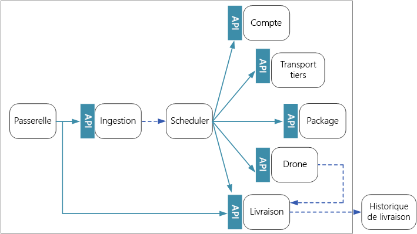
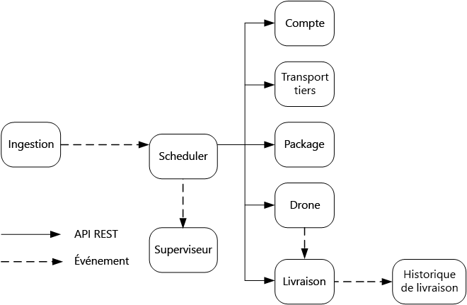

# Conception de microservices : communication interserviceDesigning microservices: Interservice communication

La communication entre les microservices doit se révéler à la fois efficace et robuste.Communication between microservices must be efficient and robust. Or, étant donné que l’exécution d’une simple transaction implique l’interaction d’un grand nombre de petits services, cet objectif peut représenter un véritable défi.With lots of small services interacting to complete a single transaction, this can be a challenge. Dans cet article, nous allons comparer les compromis induits par l’utilisation d’une messagerie asynchrone et par l’emploi d’API synchrones.In this chapter, we look at the tradeoffs between asynchronous messaging versus synchronous APIs. Ensuite, nous étudierons certaines des difficultés liées à la conception de communications interservice résilientes, ainsi que le rôle qu’une maille de services peut jouer.Then we look at some of the challenges in designing resilient interservice communication, and the role that a service mesh can play.

## DéfisChallenges 

Cette section répertorie quelques-uns des principaux défis en matière de communications interservice.Here are some of the main challenges arising from service-to-service communication. Les mailles de services, décrites plus loin dans cet article, sont conçues pour vous aider à relever la plupart de ces défis.Service meshes, described later in this chapter, are designed to handle many of these challenges.

**Résilience**.**Resiliency.** Il peut exister plusieurs dizaines ou même centaines d’instances d’un microservice donné.There may be dozens or even hundreds of instances of any given microservice. Une instance peut échouer pour plusieurs raisons.An instance can fail for any number of reasons. Il peut se produire un échec au niveau du nœud, par exemple une défaillance matérielle ou un redémarrage de machine virtuelle.There can be a node-level failure, such as a hardware failure or a VM reboot. Une instance peut se bloquer ou être submergée de requêtes et se trouver dans l’incapacité de traiter toute nouvelle requête.An instance might crash, or be overwhelmed with requests and unable to process any new requests. Tous ces événements sont susceptibles d’entraîner l’échec d’un appel réseau.Any of these events can cause a network call to fail. Deux modèles de conception peuvent vous aider à accroître la résilience des appels réseau interservice :There are two design patterns that can help make service-to-service network calls more resilient:

- **[Nouvelle tentative](../patterns/retry.md)**.**[Retry](../patterns/retry.md)**. Un appel réseau peut échouer en raison d’une erreur temporaire qui disparaît d’elle-même.A network call may fail because of a transient fault that goes away by itself. Au lieu que l’opération échoue immédiatement, l’appelant doit généralement effectuer un nombre défini de nouvelles tentatives ou jusqu’à ce qu’un délai d’expiration configuré soit écoulé.Rather than fail outright, the caller should typically retry the operation a certain number of times, or until a configured time-out period elapses. Toutefois, si une opération n’est pas idempotente, les nouvelles tentatives peuvent produire des effets secondaires imprévus.However, if an operation is not idempotent, retries can cause unintended side effects. Ainsi, il est possible que l’appel d’origine réussisse, mais que l’appelant n’obtienne jamais de réponse.The original call might succeed, but the caller never gets a response. Si l’appelant effectue une nouvelle tentative, l’opération risque d’être appelée deux fois.If the caller retries, the operation may be invoked twice. En règle générale, il est déconseillé de retenter l’exécution des méthodes POST ou PATCH, car le caractère idempotent de ces dernières n’est pas garanti.Generally, it's not safe to retry POST or PATCH methods, because these are not guaranteed to be idempotent.

- **[Disjoncteur](../patterns/circuit-breaker.md)**.**[Circuit Breaker](../patterns/circuit-breaker.md)**. Un nombre excessif de requêtes ayant échoué peut provoquer un goulot d’étranglement, car les requêtes en attente s’accumulent dans la file d’attente.Too many failed requests can cause a bottleneck, as pending requests accumulate in the queue. Ces demandes bloquées peuvent contenir des ressources système critiques telles que la mémoire, des threads, les connexions de la base de données, etc. Cela peut provoquer une succession d’échecs.These blocked requests might hold critical system resources such as memory, threads, database connections, and so on, which can cause cascading failures. Le modèle Disjoncteur peut empêcher un service de tenter d’exécuter à plusieurs reprises une opération susceptible d’échouer.The Circuit Breaker pattern can prevent a service from repeatedly trying an operation that is likely to fail. 

**Équilibrage de charge**.**Load balancing**. Lorsque le service « A » appelle le service « B », la requête doit atteindre une instance en cours d’exécution du service « B ».When service "A" calls service "B", the request must reach a running instance of service "B". Dans Kubernetes, le type de ressource `Service` fournit une adresse IP stable pour un groupe de pods.In Kubernetes, the `Service` resource type provides a stable IP address for a group of pods. Le trafic réseau vers l’adresse IP du service est transféré à un pod au moyen de règles d’iptable.Network traffic to the service's IP address gets forwarded to a pod by means of iptable rules. Par défaut, un pod aléatoire est choisi.By default, a random pod is chosen. Une maille de services (voir ci-dessous) peut fournir des algorithmes d’équilibrage de charge plus intelligents en fonction de la latence observée ou d’autres mesures.A service mesh (see below) can provide more intelligent load balancing algorithms based on observed latency or other metrics.

**Traçage distribué**.**Distributed tracing**. Une même transaction peut s’étendre sur plusieurs services.A single transaction may span multiple services. Cette situation peut compliquer la surveillance des performances globales et de l’intégrité du système.That can make it hard to monitor the overall performance and health of the system. Même si chaque service génère des journaux et des mesures, ces informations seront d’une utilité limitée si elles ne sont pas liées d’une manière ou d’une autre.Even if every service generates logs and metrics, without some way to tie them together, they are of limited use. Le traçage distribué constitue donc un défi à relever et est décrit de façon plus détaillée dans l’article [Journalisation et surveillance](./logging-monitoring.md).The chapter [Logging and monitoring](./logging-monitoring.md) talks more about distributed tracing, but we mention it here as a challenge.

**Contrôle de version des services**.**Service versioning**. Lorsqu’une équipe déploie une nouvelle version d’un service, elle doit éviter d’interrompre tout autre service ou les clients externes qui dépendent de ce service.When a team deploys a new version of a service, they must avoid breaking any other services or external clients that depend on it. En outre, vous pouvez vouloir exécuter plusieurs versions d’un service côte à côte et acheminer les requêtes vers une version spécifique.In addition, you might want to run multiple versions of a service side-by-side, and route requests to a particular version. Pour plus d’informations sur cet aspect, consultez la section [Contrôle de version d’API](./api-design.md#api-versioning).See [API Versioning](./api-design.md#api-versioning) for more discussion of this issue.

**Chiffrement TLS et authentification TLS mutuelle**.**TLS encryption and mutual TLS authentication**. Pour des raisons de sécurité, vous pouvez chiffrer le trafic entre les services avec TLS et utiliser l’authentification TLS mutuelle pour authentifier les appelants.For security reasons, you may want to encrypt traffic between services with TLS, and use mutual TLS authentication to authenticate callers.

## Comparaison entre messagerie synchrone et messagerie asynchroneSynchronous versus asynchronous messaging

Les microservices peuvent utiliser deux modèles de messagerie de base pour communiquer avec d’autres microservices.There are two basic messaging patterns that microservices can use to communicate with other microservices. 

1. Communication synchrone.Synchronous communication. Dans ce modèle, un service appelle une API exposée par un autre service à l’aide d’un protocole tel que HTTP ou gRPC.In this pattern, a service calls an API that another service exposes, using a protocol such as HTTP or gRPC. Cette option constitue un modèle de messagerie synchrone, car l’appelant attend une réponse de la part du récepteur.This option is a synchronous messaging pattern because the caller waits for a response from the receiver. 

2. Transmission de message asynchrone.Asynchronous message passing. Dans ce modèle, un service envoie un message sans attendre de réponse, et un ou plusieurs services traitent ce message de façon asynchrone.In this pattern, a service sends message without waiting for a response, and one or more services process the message asynchronously.

Il est important d’établir une distinction entre E/S asynchrone et protocole asynchrone.It's important to distinguish between asynchronous I/O and an asynchronous protocol. Le terme E/S asynchrone signifie que le thread appelant n’est pas bloqué pendant que l’E/S s’exécute.Asynchronous I/O means the calling thread is not blocked while the I/O completes. Cette approche est importante pour les performances, mais constitue un détail d’implémentation en termes d’architecture.That's important for performance, but is an implementation detail in terms of the architecture. Un protocole asynchrone signifie que l’expéditeur n’attend pas de réponse.An asynchronous protocol means the sender doesn't wait for a response. HTTP est un protocole synchrone, même si un client HTTP peut utiliser des E/S asynchrones lorsqu’il envoie une requête.HTTP is a synchronous protocol, even though an HTTP client may use asynchronous I/O when it sends a request. 

Chaque modèle implique des compromis.There are tradeoffs to each pattern. Le modèle requête/réponse constitue un paradigme bien défini, de sorte que la conception d’une API peut sembler plus naturelle que celle d’un système de messagerie.Request/response is a well-understood paradigm, so designing an API may feel more natural than designing a messaging system. Toutefois, la messagerie asynchrone confère certains avantages qui peuvent se révéler d’une grande utilité dans une architecture de microservices :However, asynchronous messaging has some advantages that can be very useful in a microservices architecture:

- **Couplage réduit**.**Reduced coupling**. L’expéditeur du message n’a pas besoin de disposer d’informations concernant le consommateur.The message sender does not need to know about the consumer. 

- **Abonnés multiples**.**Multiple subscribers**. Un modèle de publication/abonnement permet à plusieurs consommateurs de s’abonner à la réception d’événements.Using a pub/sub model, multiple consumers can subscribe to receive events. Consultez l’article [Style d’architecture basée sur les événements](/azure/architecture/guide/architecture-styles/event-driven).See [Event-driven architecture style](/azure/architecture/guide/architecture-styles/event-driven).

- **Isolation des défaillances**.**Failure isolation**. Si le consommateur échoue, l’expéditeur peut toujours envoyer des messages.If the consumer fails, the sender can still send messages. Ces messages seront récupérés une fois que l’état normal du consommateur aura été rétabli.The messages will be picked up when the consumer recovers. Cette possibilité se révèle particulièrement utile dans une architecture de microservices, car chaque service possède son propre cycle de vie.This ability is especially useful in a microservices architecture, because each service has its own lifecycle. Il est possible qu’un service devienne inaccessible ou soit remplacé par une version plus récente à un moment donné.A service could become unavailable or be replaced with a newer version at any given time. Une messagerie asynchrone peut gérer les temps d’arrêt intermittents.Asynchronous messaging can handle intermittent downtime. En revanche, les API synchrones exigent que le service en aval soit disponible ; dans le cas contraire, l’opération échouera.Synchronous APIs, on the other hand, require the downstream service to be available or the operation fails. 
 
- **Réactivité**.**Responsiveness**. Un service en amont peut répondre plus rapidement s’il n’attend aucune réaction de la part des services en aval.An upstream service can reply faster if it does not wait on downstream services. Cette approche se révèle particulièrement utile dans une architecture de microservices.This is especially useful in a microservices architecture. S’il existe une chaîne de dépendances entre les services (le service A appelle B, qui appelle C, et ainsi de suite), le temps d’attente inhérent aux appels synchrones risque d’augmenter la latence de manière inacceptable.If there is a chain of service dependencies (service A calls B, which calls C, and so on), waiting on synchronous calls can add unacceptable amounts of latency.

- **Nivellement de charge**.**Load leveling**. Une file d’attente peut jouer le rôle de mémoire tampon pour niveler la charge de travail, afin que les récepteurs puissent traiter les messages à leur propre rythme.A queue can act as a buffer to level the workload, so that receivers can process messages at their own rate. 

- **Workflows**.**Workflows**. Il est possible de gérer un workflow à l’aide de files d’attente en créant des points de contrôle qui vérifient le message après chaque étape du workflow.Queues can be used to manage a workflow, by check-pointing the message after each step in the workflow.

Toutefois, l’utilisation efficace d’une messagerie asynchrone soulève également certaines difficultés.However, there are also some challenges to using asynchronous messaging effectively.

- **Couplage avec l’infrastructure de messagerie**.**Coupling with the messaging infrastructure**. L’utilisation d’une infrastructure de messagerie spécifique risque d’entraîner un couplage étroit avec cette infrastructure.Using a particular messaging infrastructure may cause tight coupling with that infrastructure. Il sera alors difficile de passer à une autre infrastructure de messagerie par la suite.It will be difficult to switch to another messaging infrastructure later.

- **Latence**.**Latency**. La latence de bout en bout d’une opération peut devenir élevée si les files d’attente de messages deviennent saturées.End-to-end latency for an operation may become high if the message queues fill up.  

- **Coût**.**Cost**. L’utilisation de hauts débits est susceptible d’augmenter le coût monétaire de l’infrastructure de messagerie de façon significative.At high throughputs, the monetary cost of the messaging infrastructure could be significant.

- **Complexité** :**Complexity**. La gestion d’une messagerie asynchrone n’est pas une tâche aisée.Handling asynchronous messaging is not a trivial task. Par exemple, vous devez gérer les messages en double, soit en procédant à une déduplication, soit en rendant les opérations idempotentes.For example, you must handle duplicated messages, either by de-duplicating or by making operations idempotent. Il est également difficile d’implémenter la sémantique requête-réponse à l’aide d’une messagerie asynchrone.It's also hard to implement request-response semantics using asynchronous messaging. Pour envoyer une réponse, vous devez disposer d’une autre file d’attente, ainsi que d’un moyen de mettre en corrélation les messages de requête et de réponse.To send a response, you need another queue, plus a way to correlate request and response messages.

- **Débit**.**Throughput**. Si les messages nécessitent une *sémantique de file d’attente*, la file d’attente peut devenir un goulot d’étranglement dans le système.If messages require *queue semantics*, the queue can become a bottleneck in the system. Chaque message requiert au moins une opération de file d’attente et une opération d’enlèvement de la file d’attente.Each message requires at least one queue operation and one dequeue operation. En outre, la sémantique de file d’attente requiert généralement un certain type de verrouillage au sein de l’infrastructure de messagerie.Moreover, queue semantics generally require some kind of locking inside the messaging infrastructure. Si la file d’attente est un service géré, elle risque d’entraîner une latence supplémentaire, car la file d’attente est externe au réseau virtuel du cluster.If the queue is a managed service, there may be additional latency, because the queue is external to the cluster's virtual network. Vous pouvez atténuer ces problèmes en traitant les messages par lot, mais cette approche complique le code.You can mitigate these issues by batching messages, but that complicates the code. Si les messages ne nécessitent pas une sémantique de file d’attente, vous serez peut-être en mesure d’utiliser un *flux* d’événements plutôt qu’une file d’attente.If the messages don't require queue semantics, you might be able to use an event *stream* instead of a queue. Pour plus d’informations, consultez l’article [Style d’architecture basée sur les événements](../guide/architecture-styles/event-driven.md).For more information, see [Event-driven architectural style](../guide/architecture-styles/event-driven.md).  

## Drone Delivery : choix des modèles de messagerieDrone Delivery: Choosing the messaging patterns

En tenant compte de ces considérations, l’équipe de développement a effectué les choix de conception ci-après pour l’application de livraison par drone Drone Delivery.With these considerations in mind, the development team made the following design choices for the Drone Delivery application

- Le service Ingestion expose une API REST publique que les applications clientes utilisent pour planifier, mettre à jour ou annuler les livraisons.The Ingestion service exposes a public REST API that client applications use to schedule, update, or cancel deliveries.

- Le service Ingestion utilise Event Hubs pour envoyer des messages asynchrones au service Scheduler.The Ingestion service uses Event Hubs to send asynchronous messages to the Scheduler service. Les messages asynchrones sont nécessaires à l’implémentation du nivellement de charge requis pour l’ingestion.Asynchronous messages are necessary to implement the load-leveling that is required for ingestion. Pour plus d’informations sur la façon dont les services Ingestion et Scheduler interagissent, consultez l’article [Ingestion et workflow][ingestion-workflow].For details on how the Ingestion and Scheduler services interact, see [Ingestion and workflow][ingestion-workflow].

- Les services Account, Delivery, Package, Drone et Third-party Transport exposent tous des API REST internes.The Account, Delivery, Package, Drone, and Third-party Transport services all expose internal REST APIs. Le service Scheduler appelle ces API pour effectuer une requête utilisateur.The Scheduler service calls these APIs to carry out a user request. L’utilisation d’API synchrones est notamment motivée par le fait que le service Scheduler a besoin d’obtenir une réponse de la part de chacun des services en aval.One reason to use synchronous APIs is that the Scheduler needs to get a response from each of the downstream services. Un échec dans l’un des services en aval signifie que la totalité de l’opération a échoué.A failure in any of the downstream services means the entire operation failed. Toutefois, le temps de latence introduit par l’appel des services principaux constitue un problème potentiel.However, a potential issue is the amount of latency that is introduced by calling the backend services. 

- Si l’un des services en aval présente un échec non temporaire, la totalité de la transaction doit être marquée comme ayant échoué.If any downstream service has a non-transient failure, the entire transaction should be marked as failed. Pour gérer cette situation, le service Scheduler envoie un message asynchrone au service Supervisor pour permettre à ce dernier de planifier les transactions de compensation, comme décrit dans l’article [Ingestion et workflow][ingestion-workflow].To handle this case, the Scheduler service sends an asynchronous message to the Supervisor, so that the Supervisor can schedule compensating transactions, as described in the chapter [Ingestion and workflow][ingestion-workflow].   

- Le service Delivery expose une API publique que les clients peuvent utiliser pour obtenir l’état d’une livraison.The Delivery service exposes a public API that clients can use to get the status of a delivery. Dans l’article [Passerelles d’API](./gateway.md), nous décrivons la façon dont une passerelle d’API peut masquer les services sous-jacents au client, afin que ce dernier n’ait pas besoin de savoir quelles sont les API exposées par les différents services.In the chapter [API gateway](./gateway.md), we discuss how an API gateway can hide the underlying services from the client, so the client doesn't need to know which services expose which APIs. 

- Lorsqu’un drone est en vol, le service Drone envoie des événements qui contiennent l’emplacement et l’état actuels du drone.While a drone is in flight, the Drone service sends events that contain the drone's current location and status. Le service Delivery écoute ces événements afin de suivre l’état d’une livraison.The Delivery service listens to these events in order to track the status of a delivery.

- Lorsque l’état d’une livraison change, le service Delivery envoie un événement d’état de livraison, tel que `DeliveryCreated` ou `DeliveryCompleted`.When the status of a delivery changes, the Delivery service sends a delivery status event, such as `DeliveryCreated` or `DeliveryCompleted`. Tous les services peuvent s’abonner à ces événements.Any service can subscribe to these events. Dans la conception actuelle, le service Delivery est le seul abonné, mais il pourra y avoir d’autres abonnés par la suite.In the current design, the Delivery service is the only subscriber, but there might be other subscribers later. Par exemple, les événements peuvent transiter par un service d’analyse en temps réel.For example, the events might go to a real-time analytics service. En outre, étant donné que le service Scheduler n’a pas besoin d’attendre de réponse, l’ajout d’autres abonnés n’a pas d’incidence sur le chemin du workflow principal.And because the Scheduler doesn't have to wait for a response, adding more subscribers doesn't affect the main workflow path.

Notez que les événements d’état de livraison dérivent des événements d’emplacement de drone.Notice that delivery status events are derived from drone location events. Par exemple, lorsqu’un drone atteint un emplacement de livraison et dépose un package, le service Delivery traduit cette situation en événement DeliveryCompleted.For example, when a drone reaches a delivery location and drops off a package, the Delivery service translates this into a DeliveryCompleted event. Ceci constitue un exemple de pensée en termes de modèles de domaine.This is an example of thinking in terms of domain models. Comme indiqué précédemment, le système de gestion des drones (Drone Management) appartient à un contexte lié distinct.As described earlier, Drone Management belongs in a separate bounded context. Les événements de drone véhiculent l’emplacement physique d’un drone.The drone events convey the physical location of a drone. Les événements de livraison représentent quant à eux les changements d’état d’une livraison, ce qui constitue une entité métier différente.The delivery events, on the other hand, represent changes in the status of a delivery, which is a different business entity.

## Utilisation d’une maille de servicesUsing a service mesh

Une *maille de services* est une couche logicielle qui gère les communications interservice.A *service mesh* is a software layer that handles service-to-service communication. Les mailles de services sont destinées à résoudre la plupart des difficultés répertoriées à la section précédente, et à décharger les microservices proprement dits de la responsabilité de ces aspects en déléguant cette responsabilité à une couche partagée.Service meshes are designed to address many of the concerns listed in the previous section, and to move responsibility for these concerns away from the microservices themselves and into a shared layer. La maille de services joue le rôle d’un proxy qui intercepte les communications réseau entre les microservices du cluster.The service mesh acts as a proxy that intercepts network communication between microservices in the cluster. 

> [!NOTE]
> La maille de services consiste un exemple du [modèle Ambassadeur](../patterns/ambassador.md), un service d’assistance qui envoie des requêtes réseau au nom de l’application.Service mesh is an example of the [Ambassador pattern](../patterns/ambassador.md) &mdash; a helper service that sends network requests on behalf of the application. 

Pour l’instant, les principales options de maille de services dans Kubernetes sont [linkerd](https://linkerd.io/) et [Istio](https://istio.io/).Right now, the main options for a service mesh in Kubernetes are [linkerd](https://linkerd.io/) and [Istio](https://istio.io/). Ces deux technologies évoluent rapidement.Both of these technologies are evolving rapidly. Toutefois, voici certaines des fonctionnalités que linkerd et Istio ont en commun :However, some features that both linkerd and Istio have in common include: 

- Équilibrage de charge au niveau session, basé sur les latences observées ou sur le nombre de requêtes en attente.Load balancing at the session level, based on observed latencies or number of outstanding requests. Cette fonctionnalité peut améliorer les performances par rapport à l’équilibrage de charge de type Couche 4 fourni par Kubernetes.This can improve performance over the layer-4 load balancing that is provided by Kubernetes. 

- Acheminement de couche 7 basé sur le chemin d’URL, l’en-tête d’hôte, la version d’API ou toute autre règle de niveau application.Layer-7 routing based on URL path, Host header, API version, or other application-level rules.

- Nouvelle tentative pour les requêtes ayant échoué.Retry of failed requests. Une maille de services comprend les codes d’erreur HTTP et peut retenter automatiquement les requêtes ayant échoué.A service mesh understands HTTP error codes, and can automatically retry failed requests. Vous pouvez configurer le nombre maximal de nouvelles tentatives, ainsi qu’un délai d’expiration afin de limiter la latence maximale.You can configure that maximum number of retries, along with a timeout period in order to bound the maximum latency. 

- Disjoncteur.Circuit breaking. Si une instance entraîne un échec continu des requêtes, la maille de services marquera temporairement cette instance comme non disponible.If an instance consistently fails requests, the service mesh will temporarily mark it as unavailable. Au terme d’une période d’interruption, elle retentera d’utiliser l’instance.After a backoff period, it will try the instance again. Vous pouvez configurer le disjoncteur en fonction de différents critères, tels que le nombre d’échecs consécutifs.You can configure the circuit breaker based on various criteria, such as the number of consecutive failures,  

- La maille de services capture les mesures relatives aux appels interservice, comme le volume de requêtes, la latence, les taux d’erreurs et de réussite, ainsi que les tailles de réponse.Service mesh captures metrics about interservice calls, such as the request volume, latency, error and success rates, and response sizes. La maille de services permet également de procéder à un traçage distribué en ajoutant des informations de corrélation pour chaque tronçon dans une requête.The service mesh also enables distributed tracing by adding correlation information for each hop in a request.

- Authentification TLS mutuelle pour les appels interservice.Mutual TLS Authentication for service-to-service calls.

Avez-vous besoin d’une maille de services ?Do you need a service mesh? Les mailles de services confèrent à un système distribué une valeur ajoutée incontestable.The value they add to a distributed system is certainly compelling. Si vous ne disposez pas d’une maille de services, vous devrez tenir compte de chacun des défis mentionnés au début de cet article.If you don't have a service mesh, you will need to consider each of the challenges mentioned at the beginning of the chapter. Vous pouvez résoudre les problèmes de nouvelle tentative, de disjoncteur et de traçage distribué sans recourir à une maille de services ; toutefois, cette dernière épargne ces problèmes aux différents services en les transférant vers une couche dédiée.You can solve problems like retry, circuit breaker, and distributed tracing without a service mesh, but a service mesh moves these concerns out of the individual services and into a dedicated layer. En revanche, les mailles de services sont une technologie relativement récente qui n’est pas encore arrivée à maturité.On the other hand, service meshes are a relatively new technology that is still maturing. Le déploiement d’une maille de services augmente la complexité de l’installation et de la configuration du cluster.Deploying a service mesh adds complexity to the setup and configuration of the cluster. Cette approche peut avoir une incidence sur les performances, car les requêtes sont alors acheminées par le biais du proxy de la maille de services, et les services supplémentaires s’exécutent désormais sur chaque nœud du cluster.There may be performance implications, because requests now get routed through the service mesh proxy, and because extra services are now running on every node in the cluster. Vous devez donc procéder à un test de performances et de charge approfondi avant de déployer une maille de services en production.You should do thorough performance and load testing before deploying a service mesh in production.

> [!div class="nextstepaction"]
> [Conception d’APIAPI design](./api-design.md)

<!-- links -->

[ingestion-workflow]: ./ingestion-workflow.md
