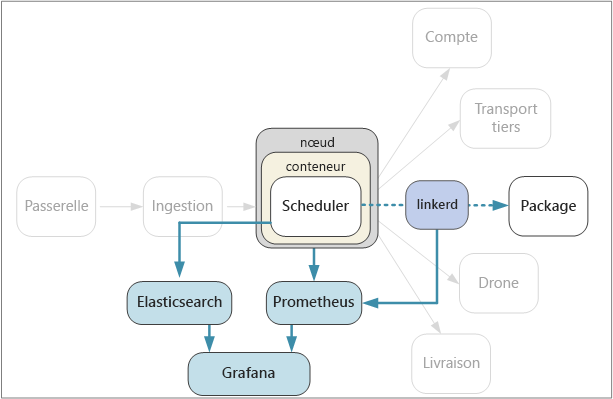

# <a name="designing-microservices-logging-and-monitoring"></a><span data-ttu-id="d0882-103">Conception de microservices : Enregistrement et surveillance</span><span class="sxs-lookup"><span data-stu-id="d0882-103">Designing microservices: Logging and monitoring</span></span>

<span data-ttu-id="d0882-104">Dans toute application complexe, il arrive toujours un moment où quelque chose pose problème.</span><span class="sxs-lookup"><span data-stu-id="d0882-104">In any complex application, at some point something will go wrong.</span></span> <span data-ttu-id="d0882-105">Dans une application de microservices, vous devez suivre le déroulement des opérations dans plusieurs douzaines, voire plusieurs centaines de services.</span><span class="sxs-lookup"><span data-stu-id="d0882-105">In a microservices application, you need to track what's happening across dozens or even hundreds of services.</span></span> <span data-ttu-id="d0882-106">Les fonctions de journalisation et de surveillance jouent un rôle primordial dans la présentation d’une vue holistique du système.</span><span class="sxs-lookup"><span data-stu-id="d0882-106">Logging and monitoring are critically important to give you a holistic view of the system.</span></span>



<span data-ttu-id="d0882-108">Dans une architecture de microservices, l’identification de la cause précise des erreurs ou des goulots d’étranglement des performances peut se révéler particulièrement ardue.</span><span class="sxs-lookup"><span data-stu-id="d0882-108">In a microservices architecture, it can be especially challenging to pinpoint the exact cause of errors or performance bottlenecks.</span></span> <span data-ttu-id="d0882-109">Une même opération utilisateur peut s’étendre sur plusieurs services.</span><span class="sxs-lookup"><span data-stu-id="d0882-109">A single user operation might span multiple services.</span></span> <span data-ttu-id="d0882-110">Il est possible que des services atteignent les limites d’E/S réseau au sein du cluster.</span><span class="sxs-lookup"><span data-stu-id="d0882-110">Services may hit network I/O limits inside the cluster.</span></span> <span data-ttu-id="d0882-111">Une chaîne d’appels entre les services peut engendrer une régulation de flux dans le système, entraînant ainsi une latence élevée ou des échecs en cascade.</span><span class="sxs-lookup"><span data-stu-id="d0882-111">A chain of calls across services may cause backpressure in the system, resulting in high latency or cascading failures.</span></span> <span data-ttu-id="d0882-112">En outre, vous ignorez généralement dans quel nœud un conteneur spécifique s’exécutera.</span><span class="sxs-lookup"><span data-stu-id="d0882-112">Moreover, you generally don't know which node a particular container will run in.</span></span> <span data-ttu-id="d0882-113">Les conteneurs placés sur le même nœud peuvent entrer en concurrence pour bénéficier de ressources processeur ou mémoire limitées.</span><span class="sxs-lookup"><span data-stu-id="d0882-113">Containers placed on the same node may be competing for limited CPU or memory.</span></span>

<span data-ttu-id="d0882-114">Pour faciliter la compréhension du déroulement des opérations, vous devez collecter des données de télémétrie à partir de l’application.</span><span class="sxs-lookup"><span data-stu-id="d0882-114">To make sense of what's happening, you must collect telemetry from the application.</span></span>  <span data-ttu-id="d0882-115">Les données de télémétrie peuvent être divisées en *journaux* et *métriques*.</span><span class="sxs-lookup"><span data-stu-id="d0882-115">Telemetry can be divided into *logs* and *metrics*.</span></span> <span data-ttu-id="d0882-116">[Azure Monitor](/azure/monitoring-and-diagnostics/monitoring-overview) collecte des journaux et des métriques sur la plateforme Azure.</span><span class="sxs-lookup"><span data-stu-id="d0882-116">[Azure Monitor](/azure/monitoring-and-diagnostics/monitoring-overview) collects both logs and metrics across the Azure platform.</span></span>

<span data-ttu-id="d0882-117">Les **journaux** sont des enregistrements textuels des événements qui surviennent pendant l’exécution de l’application.</span><span class="sxs-lookup"><span data-stu-id="d0882-117">**Logs** are text-based records of events that occur while the application is running.</span></span> <span data-ttu-id="d0882-118">Ils comprennent des éléments tels que les journaux d’application (déclarations de trace) ou les journaux de serveur web.</span><span class="sxs-lookup"><span data-stu-id="d0882-118">They include things like application logs (trace statements) or web server logs.</span></span> <span data-ttu-id="d0882-119">Les journaux se révèlent particulièrement utiles pour la forensique et l’analyse de la cause racine.</span><span class="sxs-lookup"><span data-stu-id="d0882-119">Logs are primarily useful for forensics and root cause analysis.</span></span>

<span data-ttu-id="d0882-120">Les **mesures** sont des valeurs numériques qui peuvent être analysées.</span><span class="sxs-lookup"><span data-stu-id="d0882-120">**Metrics** are numerical values that can be analyzed.</span></span> <span data-ttu-id="d0882-121">Vous pouvez les utiliser pour observer le système en temps réel (ou quasiment en temps réel) ou pour analyser les tendances des performances au fil du temps.</span><span class="sxs-lookup"><span data-stu-id="d0882-121">You can use them to observe the system in real time (or close to real time), or to analyze performance trends over time.</span></span> <span data-ttu-id="d0882-122">Les métriques peuvent être davantage sous-catégorisées comme suit :</span><span class="sxs-lookup"><span data-stu-id="d0882-122">Metrics can be further subcategorized as follows:</span></span>

- <span data-ttu-id="d0882-123">Mesures de **niveau nœud**, comprenant l’utilisation de l’UC, de la mémoire, du réseau, du disque et du système de fichiers.</span><span class="sxs-lookup"><span data-stu-id="d0882-123">**Node-level** metrics, including CPU, memory, network, disk, and file system usage.</span></span> <span data-ttu-id="d0882-124">Les mesures système vous aident à comprendre l’allocation des ressources pour chacun des nœuds du cluster et à corriger les valeurs hors norme.</span><span class="sxs-lookup"><span data-stu-id="d0882-124">System metrics help you to understand resource allocation for each node in the cluster, and troubleshoot outliers.</span></span>

- <span data-ttu-id="d0882-125">Métriques des **conteneurs**.</span><span class="sxs-lookup"><span data-stu-id="d0882-125">**Container** metrics.</span></span> <span data-ttu-id="d0882-126">Si des services sont exécutés dans des conteneurs, vous devez collecter les mesures au niveau du conteneur, et non simplement au niveau de la machine virtuelle.</span><span class="sxs-lookup"><span data-stu-id="d0882-126">If services are run inside containers, you need to collect metrics at the container level, not just at the VM level.</span></span> <span data-ttu-id="d0882-127">Vous pouvez configurer Azure Monitor pour surveiller les charges de travail de conteneur dans Azure Kubernetes Service (ACS).</span><span class="sxs-lookup"><span data-stu-id="d0882-127">You can set up Azure Monitor to monitor container workloads in Azure Kubernetes Service (AKS).</span></span> <span data-ttu-id="d0882-128">Pour plus d’informations, voir [Vue d’ensemble de Azure Monitor pour les conteneurs](/azure/monitoring/monitoring-container-insights-overview).</span><span class="sxs-lookup"><span data-stu-id="d0882-128">For more information, see [Azure Monitor for containers overview](/azure/monitoring/monitoring-container-insights-overview).</span></span> <span data-ttu-id="d0882-129">Pour d’autres orchestrateurs de conteneur, utilisez la [solution Container Monitoring dans Log Analytics](/azure/log-analytics/log-analytics-containers).</span><span class="sxs-lookup"><span data-stu-id="d0882-129">For other container orchestrators, use the [Container Monitoring solution in Log Analytics](/azure/log-analytics/log-analytics-containers).</span></span>

- <span data-ttu-id="d0882-130">Mesures **d’application**.</span><span class="sxs-lookup"><span data-stu-id="d0882-130">**Application** metrics.</span></span> <span data-ttu-id="d0882-131">Ces dernières englobent toutes les mesures qui permettent de comprendre le comportement d’un service.</span><span class="sxs-lookup"><span data-stu-id="d0882-131">This includes any metrics that are relevant to understanding the behavior of a service.</span></span> <span data-ttu-id="d0882-132">Il s’agit par exemple du nombre de requêtes HTTP entrantes en file d’attente, de la latence des requêtes ou de la longueur de la file d’attente de messages.</span><span class="sxs-lookup"><span data-stu-id="d0882-132">Examples include the number of queued inbound HTTP requests, request latency, or message queue length.</span></span> <span data-ttu-id="d0882-133">Les applications peuvent également créer des mesures personnalisées spécifiques au domaine, comme le nombre de transactions commerciales traitées par minute.</span><span class="sxs-lookup"><span data-stu-id="d0882-133">Applications can also create custom metrics that are specific to the domain, such as the number of business transactions processed per minute.</span></span> <span data-ttu-id="d0882-134">Utilisez [Application Insights](/azure/application-insights/app-insights-overview) pour activer les métriques d’application.</span><span class="sxs-lookup"><span data-stu-id="d0882-134">Use [Application Insights](/azure/application-insights/app-insights-overview) to enable application metrics.</span></span>

- <span data-ttu-id="d0882-135">Mesures des **services dépendants**.</span><span class="sxs-lookup"><span data-stu-id="d0882-135">**Dependent service** metrics.</span></span> <span data-ttu-id="d0882-136">Les services peuvent appeler des services ou des points de terminaison externes, tels que les services PaaS gérés ou les services SaaS.</span><span class="sxs-lookup"><span data-stu-id="d0882-136">Services may call external services or endpoints, such as managed PaaS services or SaaS services.</span></span> <span data-ttu-id="d0882-137">Les services tiers peuvent ou non fournir des mesures.</span><span class="sxs-lookup"><span data-stu-id="d0882-137">Third-party services may or may not provide any metrics.</span></span> <span data-ttu-id="d0882-138">Si ce n’est pas le cas, vous devrez vous appuyer sur vos propres mesures d’application pour effectuer le suivi des statistiques relatives aux taux de latence et d’erreurs.</span><span class="sxs-lookup"><span data-stu-id="d0882-138">If not, you'll have to rely on your own application metrics to track statistics for latency and error rate.</span></span>

## <a name="considerations"></a><span data-ttu-id="d0882-139">Considérations</span><span class="sxs-lookup"><span data-stu-id="d0882-139">Considerations</span></span>

<span data-ttu-id="d0882-140">L’article [Surveillance et diagnostics](../best-practices/monitoring.md) décrit les meilleures pratiques générales en matière de surveillance d’une application.</span><span class="sxs-lookup"><span data-stu-id="d0882-140">The article [Monitoring and diagnostics](../best-practices/monitoring.md) describes general best practices for monitoring an application.</span></span> <span data-ttu-id="d0882-141">Voici quelques points spécifiques à prendre en compte dans le contexte d’une architecture de microservices.</span><span class="sxs-lookup"><span data-stu-id="d0882-141">Here are some particular things to think about in the context of a microservices architecture.</span></span>

<span data-ttu-id="d0882-142">**Configuration et gestion**.</span><span class="sxs-lookup"><span data-stu-id="d0882-142">**Configuration and management**.</span></span> <span data-ttu-id="d0882-143">Prévoyez-vous d’utiliser un service géré pour la journalisation et la surveillance, ou envisagez-vous de déployer des composants de journalisation et de surveillance sous forme de conteneurs à l’intérieur du cluster ?</span><span class="sxs-lookup"><span data-stu-id="d0882-143">Will you use a managed service for logging and monitoring, or deploy logging and monitoring components as containers inside the cluster?</span></span> <span data-ttu-id="d0882-144">Pour plus d’informations sur ces possibilités, consultez la section [Options technologiques](#technology-options) ci-dessous.</span><span class="sxs-lookup"><span data-stu-id="d0882-144">For more discussion of these options, see the section [Technology Options](#technology-options) below.</span></span>

<span data-ttu-id="d0882-145">**Taux d’ingestion**.</span><span class="sxs-lookup"><span data-stu-id="d0882-145">**Ingestion rate**.</span></span> <span data-ttu-id="d0882-146">À quelle vitesse le système peut-il ingérer les événements de télémétrie ?</span><span class="sxs-lookup"><span data-stu-id="d0882-146">What is the throughput at which the system can ingest telemetry events?</span></span> <span data-ttu-id="d0882-147">Que se passe-t-il si ce taux est dépassé ?</span><span class="sxs-lookup"><span data-stu-id="d0882-147">What happens if that rate is exceeded?</span></span> <span data-ttu-id="d0882-148">Par exemple, le système peut limiter les clients (auquel cas les données de télémétrie sont perdues), ou il peut sous-échantillonner les données.</span><span class="sxs-lookup"><span data-stu-id="d0882-148">For example, the system may throttle clients, in which case telemetry data is lost, or it may downsample the data.</span></span> <span data-ttu-id="d0882-149">Vous pouvez parfois atténuer ce problème en réduisant la quantité de données que vous collectez :</span><span class="sxs-lookup"><span data-stu-id="d0882-149">Sometimes you can mitigate this problem by reducing the amount of data that you collect:</span></span>

- <span data-ttu-id="d0882-150">Agrégez les mesures en calculant les statistiques, telles que la moyenne et l’écart type, puis envoyez ces données statistiques au système de surveillance.</span><span class="sxs-lookup"><span data-stu-id="d0882-150">Aggregate metrics by calculating statistics, such as average and standard deviation, and send that statistical data to the monitoring system.</span></span>
- <span data-ttu-id="d0882-151">Sous-échantillonnez les données ; autrement dit, ne traitez qu’un certain pourcentage des événements.</span><span class="sxs-lookup"><span data-stu-id="d0882-151">Downsample the data &mdash; that is, process only a percentage of the events.</span></span>
- <span data-ttu-id="d0882-152">Traitez les données par lot afin de réduire le nombre d’appels réseau adressés au service de surveillance.</span><span class="sxs-lookup"><span data-stu-id="d0882-152">Batch the data to reduce the number of network calls to the monitoring service.</span></span>

<span data-ttu-id="d0882-153">**Coût**.</span><span class="sxs-lookup"><span data-stu-id="d0882-153">**Cost**.</span></span> <span data-ttu-id="d0882-154">Le coût d’ingestion et de stockage des données de télémétrie peut être substantiel, en particulier si ces données sont volumineuses.</span><span class="sxs-lookup"><span data-stu-id="d0882-154">The cost of ingesting and storing telemetry data may be high, especially at high volumes.</span></span> <span data-ttu-id="d0882-155">Dans certains cas, ce coût peut même dépasser celui de l’exécution de l’application.</span><span class="sxs-lookup"><span data-stu-id="d0882-155">In some cases it could even exceed the cost of running the application.</span></span> <span data-ttu-id="d0882-156">Dans cette éventualité, vous devrez peut-être réduire le volume de données de télémétrie en agrégeant ou en sous-échantillonnant les données, ou en traitant les données par lot, comme décrit ci-dessus.</span><span class="sxs-lookup"><span data-stu-id="d0882-156">In that case, you may need to reduce the volume of telemetry by aggregating, downsampling, or batching the data, as described above.</span></span>

<span data-ttu-id="d0882-157">**Fidélité des données**.</span><span class="sxs-lookup"><span data-stu-id="d0882-157">**Data fidelity**.</span></span> <span data-ttu-id="d0882-158">Quel est le degré de précision des mesures ?</span><span class="sxs-lookup"><span data-stu-id="d0882-158">How accurate are the metrics?</span></span> <span data-ttu-id="d0882-159">Les moyennes peuvent masquer des valeurs hors norme, en particulier à grande échelle.</span><span class="sxs-lookup"><span data-stu-id="d0882-159">Averages can hide outliers, especially at scale.</span></span> <span data-ttu-id="d0882-160">En outre, si le taux d’échantillonnage est trop faible, il risque de lisser les fluctuations des données.</span><span class="sxs-lookup"><span data-stu-id="d0882-160">Also, if the sampling rate is too low, it can smooth out fluctuations in the data.</span></span> <span data-ttu-id="d0882-161">Ainsi, vous pouvez avoir l’impression que toutes les requêtes présentent approximativement la même latence de bout en bout, alors qu’en réalité, une partie significative des requêtes exigent beaucoup plus de temps.</span><span class="sxs-lookup"><span data-stu-id="d0882-161">It may appear that all requests have about the same end-to-end latency, when in fact a significant fraction of requests are taking much longer.</span></span>

<span data-ttu-id="d0882-162">**Latence**.</span><span class="sxs-lookup"><span data-stu-id="d0882-162">**Latency**.</span></span> <span data-ttu-id="d0882-163">Pour bénéficier de fonctions de surveillance et d’émission d’alertes en temps réel, vous devez pouvoir accéder rapidement aux données de télémétrie.</span><span class="sxs-lookup"><span data-stu-id="d0882-163">To enable real-time monitoring and alerts, telemetry data should be available quickly.</span></span> <span data-ttu-id="d0882-164">Dans quelle mesure les données présentées dans le tableau de bord de surveillance sont-elles éloignées des données en temps réel ?</span><span class="sxs-lookup"><span data-stu-id="d0882-164">How "real-time" is the data that appears on the monitoring dashboard?</span></span> <span data-ttu-id="d0882-165">Le sont-elles de quelques secondes ?</span><span class="sxs-lookup"><span data-stu-id="d0882-165">A few seconds old?</span></span> <span data-ttu-id="d0882-166">De plus d’une minute ?</span><span class="sxs-lookup"><span data-stu-id="d0882-166">More than a minute?</span></span>

<span data-ttu-id="d0882-167">**Stockage**.</span><span class="sxs-lookup"><span data-stu-id="d0882-167">**Storage.**</span></span> <span data-ttu-id="d0882-168">Dans le cas des journaux, il peut se révéler plus efficace d’écrire les événements de journal dans le stockage éphémère du cluster, et de configurer un agent pour qu’il expédie les fichiers journaux vers un stockage plus persistant.</span><span class="sxs-lookup"><span data-stu-id="d0882-168">For logs, it may be most efficient to write the log events to ephemeral storage in the cluster, and configure an agent to ship the log files to more persistent storage.</span></span>  <span data-ttu-id="d0882-169">Au final, les données doivent être déplacées vers le stockage à long terme afin d’être disponibles pour une analyse rétrospective.</span><span class="sxs-lookup"><span data-stu-id="d0882-169">Data should eventually be moved to long-term storage so that it's available for retrospective analysis.</span></span> <span data-ttu-id="d0882-170">Étant donné qu’une architecture de microservices peut générer un gros volume de données de télémétrie, le coût du stockage de ces données constitue un facteur important.</span><span class="sxs-lookup"><span data-stu-id="d0882-170">A microservices architecture can generate a large volume of telemetry data, so the cost of storing that data is an important consideration.</span></span> <span data-ttu-id="d0882-171">Prenez également en compte la façon dont vous interrogerez les données.</span><span class="sxs-lookup"><span data-stu-id="d0882-171">Also consider how you will query the data.</span></span>

<span data-ttu-id="d0882-172">**Tableau de bord et visualisation**.</span><span class="sxs-lookup"><span data-stu-id="d0882-172">**Dashboard and visualization.**</span></span> <span data-ttu-id="d0882-173">Bénéficiez-vous d’une vue holistique du système englobant la totalité des services au sein du cluster et des services externes ?</span><span class="sxs-lookup"><span data-stu-id="d0882-173">Do you get a holistic view of the system, across all of the services, both within the cluster and external services?</span></span> <span data-ttu-id="d0882-174">Si vous écrivez des données de télémétrie et des journaux à différents emplacements, le tableau de bord peut-il présenter et mettre en corrélation l’ensemble de ces informations ?</span><span class="sxs-lookup"><span data-stu-id="d0882-174">If you are writing telemetry data and logs to more than one location, can the dashboard show all of them and correlate?</span></span> <span data-ttu-id="d0882-175">Le tableau de bord de surveillance doit au moins fournir les informations suivantes :</span><span class="sxs-lookup"><span data-stu-id="d0882-175">The monitoring dashboard should show at least the following information:</span></span>

- <span data-ttu-id="d0882-176">allocation globale des ressources à des fins de capacité et de croissance,</span><span class="sxs-lookup"><span data-stu-id="d0882-176">Overall resource allocation for capacity and growth.</span></span> <span data-ttu-id="d0882-177">comprenant le nombre de conteneurs, les mesures de système de fichiers, ainsi que l’allocation réseau et de mémoire centrale ;</span><span class="sxs-lookup"><span data-stu-id="d0882-177">This includes the number of containers, file system metrics, network, and core allocation.</span></span>
- <span data-ttu-id="d0882-178">mesures de conteneur mises en corrélation au niveau service ;</span><span class="sxs-lookup"><span data-stu-id="d0882-178">Container metrics correlated at the service level.</span></span>
- <span data-ttu-id="d0882-179">mesures système mises en corrélation avec les conteneurs ;</span><span class="sxs-lookup"><span data-stu-id="d0882-179">System metrics correlated with containers.</span></span>
- <span data-ttu-id="d0882-180">erreurs de service et valeurs hors norme.</span><span class="sxs-lookup"><span data-stu-id="d0882-180">Service errors and outliers.</span></span>

## <a name="distributed-tracing"></a><span data-ttu-id="d0882-181">Traçage distribué</span><span class="sxs-lookup"><span data-stu-id="d0882-181">Distributed tracing</span></span>

<span data-ttu-id="d0882-182">Comme indiqué précédemment, l’une des difficultés inhérentes aux microservices réside dans la compréhension du flux d’événements dans l’ensemble des services.</span><span class="sxs-lookup"><span data-stu-id="d0882-182">As mentioned, one challenge in microservices is understanding the flow of events across services.</span></span> <span data-ttu-id="d0882-183">Une même opération ou transaction peut impliquer des appels adressés à plusieurs services.</span><span class="sxs-lookup"><span data-stu-id="d0882-183">A single operation or transaction may involve calls to multiple services.</span></span> <span data-ttu-id="d0882-184">Pour permettre de reconstruire l’intégralité de la séquence des étapes, chaque service doit propager un *ID de corrélation* faisant office d’identificateur unique pour cette opération.</span><span class="sxs-lookup"><span data-stu-id="d0882-184">To reconstruct the entire sequence of steps, each service should propagate a *correlation ID* that acts as a unique identifier for that operation.</span></span> <span data-ttu-id="d0882-185">L’ID de corrélation autorise un [traçage distribué](https://microservices.io/patterns/observability/distributed-tracing.html) dans l’ensemble des services.</span><span class="sxs-lookup"><span data-stu-id="d0882-185">The correlation ID enables [distributed tracing](https://microservices.io/patterns/observability/distributed-tracing.html) across services.</span></span>

<span data-ttu-id="d0882-186">Le premier service à recevoir une requête client doit générer l’ID de corrélation.</span><span class="sxs-lookup"><span data-stu-id="d0882-186">The first service that receives a client request should generate the correlation ID.</span></span> <span data-ttu-id="d0882-187">Si le service adresse un appel HTTP à un autre service, il place l’ID de corrélation dans un en-tête de requête.</span><span class="sxs-lookup"><span data-stu-id="d0882-187">If the service makes an HTTP call to another service, it puts the correlation ID in a request header.</span></span> <span data-ttu-id="d0882-188">De même, si le service envoie un message asynchrone, il place l’ID de corrélation dans le message.</span><span class="sxs-lookup"><span data-stu-id="d0882-188">Similarly, if the service sends an asynchronous message, it puts the correlation ID into the message.</span></span> <span data-ttu-id="d0882-189">Les services en aval continuent de propager cet ID de corrélation, de sorte que ce dernier transite par la totalité du système.</span><span class="sxs-lookup"><span data-stu-id="d0882-189">Downstream services continue to propagate the correlation ID, so that it flows through the entire system.</span></span> <span data-ttu-id="d0882-190">En outre, l’ensemble du code qui écrit des mesures d’application ou des événements de journal doit inclure l’ID de corrélation.</span><span class="sxs-lookup"><span data-stu-id="d0882-190">In addition, all code that writes application metrics or log events should include the correlation ID.</span></span>

<span data-ttu-id="d0882-191">Lors de la mise en corrélation des appels de service, vous pouvez calculer des mesures opérationnelles telles que la latence de bout en bout d’une transaction complète, le nombre de transactions réussies par seconde et le pourcentage de transactions ayant échoué.</span><span class="sxs-lookup"><span data-stu-id="d0882-191">When service calls are correlated, you can calculate operational metrics such as the end-to-end latency for a complete transaction, the number of successful transactions per second, and the percentage of failed transactions.</span></span> <span data-ttu-id="d0882-192">L’inclusion des ID de corrélation dans les journaux des applications permet d’effectuer l’analyse de la cause racine.</span><span class="sxs-lookup"><span data-stu-id="d0882-192">Including correlation IDs in application logs makes it possible to perform root cause analysis.</span></span> <span data-ttu-id="d0882-193">Si une opération échoue, vous pouvez trouver les instructions de journal concernant tous les appels de service qui faisaient partie de la même opération.</span><span class="sxs-lookup"><span data-stu-id="d0882-193">If an operation fails, you can find the log statements for all of the service calls that were part of the same operation.</span></span>

<span data-ttu-id="d0882-194">Voici quelques considérations à prendre en compte lors de l’implémentation du traçage distribué :</span><span class="sxs-lookup"><span data-stu-id="d0882-194">Here are some considerations when implementing distributed tracing:</span></span>

- <span data-ttu-id="d0882-195">Pour l’instant, il n’existe aucun en-tête HTTP standard pour les ID de corrélation.</span><span class="sxs-lookup"><span data-stu-id="d0882-195">There is currently no standard HTTP header for correlation IDs.</span></span> <span data-ttu-id="d0882-196">Votre équipe doit s’accorder sur une valeur d’en-tête personnalisée.</span><span class="sxs-lookup"><span data-stu-id="d0882-196">Your team should standardize on a custom header value.</span></span> <span data-ttu-id="d0882-197">Ce choix peut être conditionné par votre infrastructure de journalisation/surveillance ou par votre décision d’utiliser une maille de services.</span><span class="sxs-lookup"><span data-stu-id="d0882-197">The choice may be decided by your logging/monitoring framework or choice of service mesh.</span></span>

- <span data-ttu-id="d0882-198">Dans le cas des messages asynchrones, si votre infrastructure de messagerie prend en charge l’ajout de métadonnées aux messages, vous devez inclure l’ID de corrélation sous la forme d’une métadonnée.</span><span class="sxs-lookup"><span data-stu-id="d0882-198">For asynchronous messages, if your messaging infrastructure supports adding metadata to messages, you should include the correlation ID as metadata.</span></span> <span data-ttu-id="d0882-199">Dans le cas contraire, intégrez cet ID au schéma de message.</span><span class="sxs-lookup"><span data-stu-id="d0882-199">Otherwise, include it as part of the message schema.</span></span>

- <span data-ttu-id="d0882-200">Au lieu d’un simple identificateur opaque, vous pouvez envoyer un *contexte de corrélation* contenant des informations plus complètes, telles que les relations appelant-appelé.</span><span class="sxs-lookup"><span data-stu-id="d0882-200">Rather than a single opaque identifier, you might send a *correlation context* that includes richer information, such as caller-callee relationships.</span></span>

- <span data-ttu-id="d0882-201">Le Kit de développement logiciel (SDK) Azure Application Insights injecte automatiquement le contexte de corrélation dans les en-têtes HTTP et inclut l’ID de corrélation dans les journaux d’Application Insights.</span><span class="sxs-lookup"><span data-stu-id="d0882-201">The Azure Application Insights SDK automatically injects correlation context into HTTP headers, and includes the correlation ID in Application Insights logs.</span></span> <span data-ttu-id="d0882-202">Si vous décidez d’utiliser les fonctionnalités de corrélation intégrées à Application Insights, certains services peuvent malgré tout nécessiter la propagation explicite des en-têtes de corrélation, selon les bibliothèques utilisées.</span><span class="sxs-lookup"><span data-stu-id="d0882-202">If you decide to use the correlation features built into Application Insights, some services may still need to explicitly propagate the correlation headers, depending on the libraries being used.</span></span> <span data-ttu-id="d0882-203">Pour plus d’informations, consultez l’article [Corrélation de télémétrie dans Application Insights](/azure/application-insights/application-insights-correlation).</span><span class="sxs-lookup"><span data-stu-id="d0882-203">For more information, see [Telemetry correlation in Application Insights](/azure/application-insights/application-insights-correlation).</span></span>

- <span data-ttu-id="d0882-204">Si vous utilisez Istio ou linkerd en tant que maille de services, ces technologies génèrent automatiquement des en-têtes de corrélation lorsque les appels HTTP sont acheminés par le biais des proxys de maille de services.</span><span class="sxs-lookup"><span data-stu-id="d0882-204">If you are using Istio or linkerd as a service mesh, these technologies automatically generate correlation headers when HTTP calls are routed through the service mesh proxies.</span></span> <span data-ttu-id="d0882-205">Les services doivent transférer les en-têtes appropriés.</span><span class="sxs-lookup"><span data-stu-id="d0882-205">Services should forward the relevant headers.</span></span>

  - <span data-ttu-id="d0882-206">Istio : [Distributed Request Tracing](https://istio-releases.github.io/v0.1/docs/tasks/zipkin-tracing.html)</span><span class="sxs-lookup"><span data-stu-id="d0882-206">Istio: [Distributed Request Tracing](https://istio-releases.github.io/v0.1/docs/tasks/zipkin-tracing.html)</span></span>
  - <span data-ttu-id="d0882-207">linkerd : [Context Headers](https://linkerd.io/config/1.3.0/linkerd/index.html#http-headers)</span><span class="sxs-lookup"><span data-stu-id="d0882-207">linkerd: [Context Headers](https://linkerd.io/config/1.3.0/linkerd/index.html#http-headers)</span></span>

- <span data-ttu-id="d0882-208">Déterminez la façon dont vous agrégerez les journaux.</span><span class="sxs-lookup"><span data-stu-id="d0882-208">Consider how you will aggregate logs.</span></span> <span data-ttu-id="d0882-209">Vous pouvez faire en sorte de normaliser le mode d’inclusion des ID de corrélation dans les journaux par les différentes équipes.</span><span class="sxs-lookup"><span data-stu-id="d0882-209">You may want to standardize across teams on how to include correlation IDs in logs.</span></span> <span data-ttu-id="d0882-210">Utilisez un format structuré ou semi-structuré, tel que JSON, et définissez un champ commun pour le stockage de l’ID de corrélation.</span><span class="sxs-lookup"><span data-stu-id="d0882-210">Use a structured or semi-structured format, such as JSON, and define a common field to hold the correlation ID.</span></span>

## <a name="technology-options"></a><span data-ttu-id="d0882-211">Options technologiques</span><span class="sxs-lookup"><span data-stu-id="d0882-211">Technology options</span></span>

<span data-ttu-id="d0882-212">**Application Insights** est un service géré dans Azure qui ingère et stocke des données de télémétrie et qui fournit des outils permettant d’analyser et de rechercher les données.</span><span class="sxs-lookup"><span data-stu-id="d0882-212">**Application Insights** is a managed service in Azure that ingests and stores telemetry data, and provides tools for analyzing and searching the data.</span></span> <span data-ttu-id="d0882-213">Pour utiliser Application Insights, vous installez un package d’instrumentation dans votre application.</span><span class="sxs-lookup"><span data-stu-id="d0882-213">To use Application Insights, you install an instrumentation package in your application.</span></span> <span data-ttu-id="d0882-214">Ce package surveille l’application et envoie les données de télémétrie au service Application Insights.</span><span class="sxs-lookup"><span data-stu-id="d0882-214">This package monitors the app and sends telemetry data to the Application Insights service.</span></span> <span data-ttu-id="d0882-215">Il peut également extraire les données de télémétrie de l’environnement hôte.</span><span class="sxs-lookup"><span data-stu-id="d0882-215">It can also pull telemetry data from the host environment.</span></span> <span data-ttu-id="d0882-216">Application Insights intègre des fonctions de mise en corrélation et de suivi des dépendances.</span><span class="sxs-lookup"><span data-stu-id="d0882-216">Application Insights provides built-in correlation and dependency tracking.</span></span> <span data-ttu-id="d0882-217">Ce service vous permet de suivre l’ensemble des mesures système, des mesures d’application et des mesures de service Azure au même endroit.</span><span class="sxs-lookup"><span data-stu-id="d0882-217">It lets you track system metrics, application metrics, and Azure service metrics, all in one place.</span></span>

<span data-ttu-id="d0882-218">Gardez à l’esprit qu’Application Insights applique une limitation si le débit de données dépasse une limite maximale ; pour plus d’informations, consultez la section [Limites d’Application Insights](/azure/azure-subscription-service-limits#application-insights-limits).</span><span class="sxs-lookup"><span data-stu-id="d0882-218">Be aware that Application Insights throttles if the data rate exceeds a maximum limit; for details, see [Application Insights limits](/azure/azure-subscription-service-limits#application-insights-limits).</span></span> <span data-ttu-id="d0882-219">Une même opération peut générer plusieurs événements de télémétrie ; par conséquent, si l’application est confrontée à un trafic dense, elle fera probablement l’objet d’une limitation.</span><span class="sxs-lookup"><span data-stu-id="d0882-219">A single operation may generate several telemetry events, so if the application experiences a high volume of traffic, it is likely to get throttled.</span></span> <span data-ttu-id="d0882-220">Pour atténuer ce problème, vous pouvez procéder à un échantillonnage afin de réduire le trafic de télémétrie.</span><span class="sxs-lookup"><span data-stu-id="d0882-220">To mitigate this problem, you can perform sampling to reduce the telemetry traffic.</span></span> <span data-ttu-id="d0882-221">Cette approche présente l’inconvénient d’engendrer des mesures moins précises.</span><span class="sxs-lookup"><span data-stu-id="d0882-221">The tradeoff is that your metrics will be less precise.</span></span> <span data-ttu-id="d0882-222">Pour plus d’informations, consultez l’article [Échantillonnage dans Application Insights](/azure/application-insights/app-insights-sampling).</span><span class="sxs-lookup"><span data-stu-id="d0882-222">For more information, see [Sampling in Application Insights](/azure/application-insights/app-insights-sampling).</span></span> <span data-ttu-id="d0882-223">Vous pouvez également réduire le volume de données en agrégeant préalablement les mesures, autrement dit en calculant les valeurs statistiques telles que la moyenne et l’écart type, puis en envoyant ces valeurs plutôt que les données de télémétrie brutes.</span><span class="sxs-lookup"><span data-stu-id="d0882-223">You can also reduce the data volume by pre-aggregating metrics &mdash; that is, calculating statistical values such as average and standard deviation, and sending those values instead of the raw telemetry.</span></span> <span data-ttu-id="d0882-224">L’approche qui consiste à utiliser Application Insights à grande échelle est décrite dans le billet de blog : [Azure Monitoring and Analytics at Scale](https://blogs.msdn.microsoft.com/azurecat/2017/05/11/azure-monitoring-and-analytics-at-scale/).</span><span class="sxs-lookup"><span data-stu-id="d0882-224">The following blog post describes an approach to using Application Insights at scale: [Azure Monitoring and Analytics at Scale](https://blogs.msdn.microsoft.com/azurecat/2017/05/11/azure-monitoring-and-analytics-at-scale/).</span></span>

<span data-ttu-id="d0882-225">En outre, assurez-vous que vous avez bien compris le modèle de tarification d’Application Insights, car vous serez facturé en fonction du volume de données.</span><span class="sxs-lookup"><span data-stu-id="d0882-225">In addition, make sure that you understand the pricing model for Application Insights, because you are charged based on data volume.</span></span> <span data-ttu-id="d0882-226">Pour plus d’informations, consultez l’article [Gérer la tarification et le volume de données dans Application Insights](/azure/application-insights/app-insights-pricing).</span><span class="sxs-lookup"><span data-stu-id="d0882-226">For more information, see [Manage pricing and data volume in Application Insights](/azure/application-insights/app-insights-pricing).</span></span> <span data-ttu-id="d0882-227">Si votre application génère un gros volume de données de télémétrie et que vous ne souhaitez pas effectuer un échantillonnage ou une agrégation des données, Application Insights ne constitue peut-être pas le choix approprié.</span><span class="sxs-lookup"><span data-stu-id="d0882-227">If your application generates a large volume of telemetry, and you don't wish to perform sampling or aggregation of the data, then Application Insights may not be the appropriate choice.</span></span>

<span data-ttu-id="d0882-228">Si Application Insights ne répond pas à vos besoins, voici certaines suggestions d’approches qui utilisent des technologies open source populaires.</span><span class="sxs-lookup"><span data-stu-id="d0882-228">If Application Insights doesn't meet your requirements, here are some suggested approaches that use popular open-source technologies.</span></span>

<span data-ttu-id="d0882-229">Dans le cas des mesures système et de conteneur, envisagez d’exporter ces mesures vers une base de données en séries chronologiques telle que **Prometheus** ou **InfluxDB** qui s’exécute dans le cluster.</span><span class="sxs-lookup"><span data-stu-id="d0882-229">For system and container metrics, consider exporting metrics to a time-series database such as **Prometheus** or **InfluxDB** running in the cluster.</span></span>

- <span data-ttu-id="d0882-230">InfluxDB est un système basé sur la transmission de type push.</span><span class="sxs-lookup"><span data-stu-id="d0882-230">InfluxDB is a push-based system.</span></span> <span data-ttu-id="d0882-231">Un agent doit transmettre (push) les mesures.</span><span class="sxs-lookup"><span data-stu-id="d0882-231">An agent needs to push the metrics.</span></span> <span data-ttu-id="d0882-232">Vous pouvez utiliser le service [Heapster][heapster], qui collecte les mesures à l’échelle du cluster à partir d’un kubelet, agrège les données, puis les transmet à InfluxDB ou à une autre solution de stockage de séries chronologiques.</span><span class="sxs-lookup"><span data-stu-id="d0882-232">You can use [Heapster][heapster], which is a service that collects cluster-wide metrics from kubelet, aggregates the data, and pushes it to InfluxDB or other time-series storage solution.</span></span> <span data-ttu-id="d0882-233">Azure Container Service déploie Heapster dans le cadre de la configuration du cluster.</span><span class="sxs-lookup"><span data-stu-id="d0882-233">Azure Container Service deploys Heapster as part of the cluster setup.</span></span> <span data-ttu-id="d0882-234">Une autre option consiste à utiliser l’agent [Telegraf](https://www.influxdata.com/time-series-platform/telegraf/), qui collecte et rapporte les mesures.</span><span class="sxs-lookup"><span data-stu-id="d0882-234">Another option is [Telegraf](https://www.influxdata.com/time-series-platform/telegraf/), which is an agent for collecting and reporting metrics.</span></span>

- <span data-ttu-id="d0882-235">Prometheus est un système basé sur l’extraction (pull).</span><span class="sxs-lookup"><span data-stu-id="d0882-235">Prometheus is a pull-based system.</span></span> <span data-ttu-id="d0882-236">Il récupère régulièrement les mesures à partir d’emplacements configurés.</span><span class="sxs-lookup"><span data-stu-id="d0882-236">It periodically scrapes metrics from configured locations.</span></span> <span data-ttu-id="d0882-237">Prometheus peut récupérer les mesures générées par cAdvisor ou par kube-state-metrics.</span><span class="sxs-lookup"><span data-stu-id="d0882-237">Prometheus can scrape metrics generated by cAdvisor or kube-state-metrics.</span></span> <span data-ttu-id="d0882-238">[kube-state-metrics][kube-state-metrics] est un service qui collecte des mesures à partir du serveur d’API Kubernetes et les rend accessibles à Prometheus (ou à un système de récupération compatible avec un point de terminaison client Prometheus).</span><span class="sxs-lookup"><span data-stu-id="d0882-238">[kube-state-metrics][kube-state-metrics] is a service that collects metrics from the Kubernetes API server and makes them available to Prometheus (or a scraper that is compatible with a Prometheus client endpoint).</span></span> <span data-ttu-id="d0882-239">Alors que Heapster agrège les mesures que Kubernetes génère et transfère à un récepteur, kube-state-metrics génère ses propres mesures et les rend récupérables par le biais d’un point de terminaison.</span><span class="sxs-lookup"><span data-stu-id="d0882-239">Whereas Heapster aggregates metrics that Kubernetes generates and forwards them to a sink, kube-state-metrics generates its own metrics and makes them available through an endpoint for scraping.</span></span> <span data-ttu-id="d0882-240">Pour les mesures système, utilisez [l’exportateur Node](https://github.com/prometheus/node_exporter), qui est un exportateur Prometheus pour les mesures système.</span><span class="sxs-lookup"><span data-stu-id="d0882-240">For system metrics, use [Node exporter](https://github.com/prometheus/node_exporter), which is a Prometheus exporter for system metrics.</span></span> <span data-ttu-id="d0882-241">Le système Prometheus prend en charge les données de type virgule flottante, mais non les données de type chaîne ; il se révèle donc adapté aux mesures système, mais pas aux journaux.</span><span class="sxs-lookup"><span data-stu-id="d0882-241">Prometheus supports floating point data, but not string data, so it is appropriate for system metrics but not logs.</span></span>

- <span data-ttu-id="d0882-242">Pour visualiser et surveiller les données, utilisez un outil de tableau de bord tel que **Kibana** ou **Grafana**.</span><span class="sxs-lookup"><span data-stu-id="d0882-242">Use a dashboard tool such as **Kibana** or **Grafana** to visualize and monitor the data.</span></span> <span data-ttu-id="d0882-243">Le service de tableau de bord peut également s’exécuter à l’intérieur d’un conteneur dans le cluster.</span><span class="sxs-lookup"><span data-stu-id="d0882-243">The dashboard service can also run inside a container in the cluster.</span></span>

<span data-ttu-id="d0882-244">Pour les journaux d’application, envisagez d’utiliser **Fluentd** et **Elasticsearch**.</span><span class="sxs-lookup"><span data-stu-id="d0882-244">For application logs, consider using **Fluentd** and **Elasticsearch**.</span></span> <span data-ttu-id="d0882-245">Fluentd est un collecteur de données open source, tandis qu’Elasticsearch est une base de données de documents qui est optimisée pour jouer le rôle de moteur de recherche.</span><span class="sxs-lookup"><span data-stu-id="d0882-245">Fluentd is an open source data collector, and Elasticsearch is a document database that is optimized to act as a search engine.</span></span> <span data-ttu-id="d0882-246">Dans le cadre de cette approche, chaque service envoie des journaux à `stdout` et `stderr`, et Kubernetes écrit ces flux dans le système de fichiers local.</span><span class="sxs-lookup"><span data-stu-id="d0882-246">Using this approach, each service sends logs to `stdout` and `stderr`, and Kubernetes writes these streams to the local file system.</span></span> <span data-ttu-id="d0882-247">Fluentd collecte les journaux, les enrichit éventuellement avec des métadonnées supplémentaires de Kubernetes, puis envoie les journaux à Elasticsearch.</span><span class="sxs-lookup"><span data-stu-id="d0882-247">Fluentd collects the logs, optionally enriches them with additional metadata from Kubernetes, and sends the logs to Elasticsearch.</span></span> <span data-ttu-id="d0882-248">Utilisez Kibana, Grafana ou un outil similaire afin de créer un tableau de bord pour Elasticsearch.</span><span class="sxs-lookup"><span data-stu-id="d0882-248">Use Kibana, Grafana, or a similar tool to create a dashboard for Elasticsearch.</span></span> <span data-ttu-id="d0882-249">Fluentd s’exécute en tant que daemonset dans le cluster, ce qui garantit qu’un seul pod Fluentd est attribué à chaque nœud.</span><span class="sxs-lookup"><span data-stu-id="d0882-249">Fluentd runs as a daemonset in the cluster, which ensures that one Fluentd pod is assigned to each node.</span></span> <span data-ttu-id="d0882-250">Vous pouvez configurer Fluentd pour qu’il collecte les journaux de kubelet, ainsi que les journaux de conteneur.</span><span class="sxs-lookup"><span data-stu-id="d0882-250">You can configure Fluentd to collect kubelet logs as well as container logs.</span></span> <span data-ttu-id="d0882-251">Dans le cas de volumes élevés, l’écriture de journaux dans le système de fichiers local peut devenir un goulot d’étranglement des performances, en particulier lorsque plusieurs services sont en cours d’exécution sur le même nœud.</span><span class="sxs-lookup"><span data-stu-id="d0882-251">At high volumes, writing logs to the local file system could become a performance bottleneck, especially when multiple services are running on the same node.</span></span> <span data-ttu-id="d0882-252">Surveillez la latence de disque et l’utilisation du système de fichiers en production.</span><span class="sxs-lookup"><span data-stu-id="d0882-252">Monitor disk latency and file system utilization in production.</span></span>

<span data-ttu-id="d0882-253">L’un des avantages liés à l’utilisation de Fluentd avec Elasticsearch pour les journaux réside dans le fait que les services ne requièrent aucune dépendance de bibliothèque supplémentaire.</span><span class="sxs-lookup"><span data-stu-id="d0882-253">One advantage of using Fluentd with Elasticsearch for logs is that services do not require any additional library dependencies.</span></span> <span data-ttu-id="d0882-254">Chaque service écrit simplement dans `stdout` et dans `stderr`, et Fluentd gère l’exportation des journaux dans Elasticsearch.</span><span class="sxs-lookup"><span data-stu-id="d0882-254">Each service just writes to `stdout` and `stderr`, and Fluentd handles exporting the logs into Elasticsearch.</span></span> <span data-ttu-id="d0882-255">En outre, les équipes qui écrivent les services n’ont pas besoin de comprendre comment configurer l’infrastructure de journalisation.</span><span class="sxs-lookup"><span data-stu-id="d0882-255">Also, the teams writing services don't need to understand how to configure the logging infrastructure.</span></span> <span data-ttu-id="d0882-256">L’une des difficultés consiste à configurer le cluster Elasticsearch pour un déploiement de production afin de l’adapter à la gestion de votre trafic.</span><span class="sxs-lookup"><span data-stu-id="d0882-256">One challenge is to configure the Elasticsearch cluster for a production deployment, so that it scales to handle your traffic.</span></span>

<span data-ttu-id="d0882-257">Une autre option consiste à envoyer les fichiers journaux au service Log Analytics d’Operations Management Suite (OMS).</span><span class="sxs-lookup"><span data-stu-id="d0882-257">Another option is to send logs to Operations Management Suite (OMS) Log Analytics.</span></span> <span data-ttu-id="d0882-258">Le service [Log Analytics][log-analytics] collecte les données de journal dans un référentiel central, et peut également consolider les données issues d’autres services Azure que votre application utilise.</span><span class="sxs-lookup"><span data-stu-id="d0882-258">The [Log Analytics][log-analytics] service collects log data into a central repository, and can also consolidate data from other Azure services that your application uses.</span></span> <span data-ttu-id="d0882-259">Pour plus d’informations, consultez l’article [Surveiller un cluster Azure Container Service avec Microsoft Operations Management Suite (OMS)][k8s-to-oms].</span><span class="sxs-lookup"><span data-stu-id="d0882-259">For more information, see [Monitor an Azure Container Service cluster with Microsoft Operations Management Suite (OMS)][k8s-to-oms].</span></span>

## <a name="example-logging-with-correlation-ids"></a><span data-ttu-id="d0882-260">Exemple : Journalisation avec des ID de corrélation</span><span class="sxs-lookup"><span data-stu-id="d0882-260">Example: Logging with correlation IDs</span></span>

<span data-ttu-id="d0882-261">Pour illustrer certains des points abordés dans cet article, voici un exemple détaillé de la façon dont le service Package implémente la journalisation.</span><span class="sxs-lookup"><span data-stu-id="d0882-261">To illustrate some of the points discussed in this chapter, here is an extended example of how the Package service implements logging.</span></span> <span data-ttu-id="d0882-262">Le service Package a été écrit en TypeScript et utilise l’infrastructure web [Koa](https://koajs.com/) pour Node.js.</span><span class="sxs-lookup"><span data-stu-id="d0882-262">The Package service was written in TypeScript and uses the [Koa](https://koajs.com/) web framework for Node.js.</span></span> <span data-ttu-id="d0882-263">Vous pouvez choisir entre plusieurs bibliothèques de journalisation Node.js.</span><span class="sxs-lookup"><span data-stu-id="d0882-263">There are several Node.js logging libraries to choose from.</span></span> <span data-ttu-id="d0882-264">Nous avons choisi [Winston](https://github.com/winstonjs/winston), une bibliothèque de journalisation communément utilisée qui répondait à nos besoins en matière de performances lorsque nous l’avons testée.</span><span class="sxs-lookup"><span data-stu-id="d0882-264">We picked [Winston](https://github.com/winstonjs/winston), a popular logging library that met our performance requirements when we tested it.</span></span>

<span data-ttu-id="d0882-265">Pour encapsuler les détails d’implémentation, nous avons défini une interface `ILogger` abstraite :</span><span class="sxs-lookup"><span data-stu-id="d0882-265">To encapsulate the implementation details, we defined an abstract  `ILogger` interface:</span></span>

```ts
export interface ILogger {
    log(level: string, msg: string, meta?: any)
    debug(msg: string, meta?: any)
    info(msg: string, meta?: any)
    warn(msg: string, meta?: any)
    error(msg: string, meta?: any)
}
```

<span data-ttu-id="d0882-266">Voici une implémentation d’`ILogger` qui inclut la bibliothèque Winston dans un wrapper.</span><span class="sxs-lookup"><span data-stu-id="d0882-266">Here is an `ILogger` implementation that wraps the Winston library.</span></span> <span data-ttu-id="d0882-267">Elle utilise l’ID de corrélation en tant que paramètre de constructeur et injecte cet ID dans chaque message de journal.</span><span class="sxs-lookup"><span data-stu-id="d0882-267">It takes the correlation ID as a constructor parameter, and injects the ID into every log message.</span></span>

```ts
class WinstonLogger implements ILogger {
    constructor(private correlationId: string) {}
    log(level: string, msg: string, payload?: any) {
        var meta : any = {};
        if (payload) { meta.payload = payload };
        if (this.correlationId) { meta.correlationId = this.correlationId }
        winston.log(level, msg, meta)
    }
  
    info(msg: string, payload?: any) {
        this.log('info', msg, payload);
    }
    debug(msg: string, payload?: any) {
        this.log('debug', msg, payload);
    }
    warn(msg: string, payload?: any) {
        this.log('warn', msg, payload);
    }
    error(msg: string, payload?: any) {
        this.log('error', msg, payload);
    }
}
```

<span data-ttu-id="d0882-268">Le service Package a besoin d’extraire l’ID de corrélation de la requête HTTP.</span><span class="sxs-lookup"><span data-stu-id="d0882-268">The Package service needs to extract the correlation ID from the HTTP request.</span></span> <span data-ttu-id="d0882-269">Par exemple, si vous utilisez linkerd, l’ID de corrélation figure dans l’en-tête `l5d-ctx-trace`.</span><span class="sxs-lookup"><span data-stu-id="d0882-269">For example, if you're using linkerd, the correlation ID is found in the `l5d-ctx-trace` header.</span></span> <span data-ttu-id="d0882-270">Dans Koa, la requête HTTP est stockée dans un objet de contexte transmis par le biais du pipeline de traitement des requêtes.</span><span class="sxs-lookup"><span data-stu-id="d0882-270">In Koa, the HTTP request is stored in a Context object that gets passed through the request processing pipeline.</span></span> <span data-ttu-id="d0882-271">Nous pouvons définir une fonction d’intergiciel (middleware) pour obtenir l’ID de corrélation à partir de l’objet de contexte et initialiser l’enregistreur d’événements.</span><span class="sxs-lookup"><span data-stu-id="d0882-271">We can define a middleware function to get the correlation ID from the Context and initialize the logger.</span></span> <span data-ttu-id="d0882-272">(Une fonction d’intergiciel (middleware) dans Koa correspond simplement à une fonction qui est exécutée pour chaque requête.)</span><span class="sxs-lookup"><span data-stu-id="d0882-272">(A middleware function in Koa is simply a function that gets executed for each request.)</span></span>

```ts
export type CorrelationIdFn = (ctx: Context) => string;

export function logger(level: string, getCorrelationId: CorrelationIdFn) {
    winston.configure({
        level: level,
        transports: [new (winston.transports.Console)()]
        });
    return async function(ctx: any, next: any) {
        ctx.state.logger = new WinstonLogger(getCorrelationId(ctx));
        await next();
    }
}
```

<span data-ttu-id="d0882-273">Cet intergiciel (middleware) appelle une fonction définie par l’appelant, `getCorrelationId`, afin d’obtenir l’ID de corrélation.</span><span class="sxs-lookup"><span data-stu-id="d0882-273">This middleware invokes a caller-defined function, `getCorrelationId`, to get the correlation ID.</span></span> <span data-ttu-id="d0882-274">Puis il crée une instance de l’enregistreur d’événements et le remise (stash) dans `ctx.state`, qui constitue un dictionnaire de clés-valeurs utilisé dans Koa pour transmettre des informations par le biais du pipeline.</span><span class="sxs-lookup"><span data-stu-id="d0882-274">Then it creates an instance of the logger and stashes it inside `ctx.state`, which is a key-value dictionary used in Koa to pass information through the pipeline.</span></span>

<span data-ttu-id="d0882-275">L’intergiciel (middleware) d’enregistreur d’événements est ajouté au pipeline au moment du démarrage :</span><span class="sxs-lookup"><span data-stu-id="d0882-275">The logger middleware is added to the pipeline on startup:</span></span>

```ts
app.use(logger(Settings.logLevel(), function (ctx) {
    return ctx.headers[Settings.correlationHeader()];  
}));
```

<span data-ttu-id="d0882-276">Une fois tous les éléments configurés, il est facile d’ajouter des instructions de journalisation au code.</span><span class="sxs-lookup"><span data-stu-id="d0882-276">Once everything is configured, it's easy to add logging statements to the code.</span></span> <span data-ttu-id="d0882-277">Par exemple, voici la méthode qui recherche un package.</span><span class="sxs-lookup"><span data-stu-id="d0882-277">For example, here is the method that looks up a package.</span></span> <span data-ttu-id="d0882-278">Elle effectue deux appels à la méthode `ILogger.info`.</span><span class="sxs-lookup"><span data-stu-id="d0882-278">It makes two calls to the `ILogger.info` method.</span></span>

```ts
async getById(ctx: any, next: any) {
  var logger : ILogger = ctx.state.logger;
  var packageId = ctx.params.packageId;
  logger.info('Entering getById, packageId = %s', packageId);

  await next();

  let pkg = await this.repository.findPackage(ctx.params.packageId)

  if (pkg == null) {
    logger.info(`getById: %s not found`, packageId);
    ctx.response.status= 404;
    return;
  }

  ctx.response.status = 200;
  ctx.response.body = this.mapPackageDbToApi(pkg);
}
```

<span data-ttu-id="d0882-279">Nous n’avons pas besoin d’inclure l’ID de corrélation dans les instructions de journalisation, car cette opération est automatiquement effectuée par la fonction d’intergiciel (middleware).</span><span class="sxs-lookup"><span data-stu-id="d0882-279">We don't need to include the correlation ID in the logging statements, because that's done automatically by the middleware function.</span></span> <span data-ttu-id="d0882-280">Ceci simplifie le code de journalisation et réduit le risque qu’un développeur oublie d’inclure l’ID de corrélation.</span><span class="sxs-lookup"><span data-stu-id="d0882-280">This makes the logging code cleaner, and reduces the chance that a developer will forget to include the correlation ID.</span></span> <span data-ttu-id="d0882-281">En outre, étant donné que toutes les instructions de journalisation utilisent l’interface `ILogger` abstraite, l’implémentation de l’enregistreur d’événements sera facilement remplaçable ultérieurement.</span><span class="sxs-lookup"><span data-stu-id="d0882-281">And because all of the logging statements use the abstract `ILogger` interface, it would be easy to replace the logger implementation later.</span></span>

> [!div class="nextstepaction"]
> [<span data-ttu-id="d0882-282">Intégration et livraison continues</span><span class="sxs-lookup"><span data-stu-id="d0882-282">Continuous integration and delivery</span></span>](./ci-cd.md)

<!-- links -->

[app-insights]: /azure/application-insights/app-insights-overview
[heapster]: https://github.com/kubernetes/heapster
[kube-state-metrics]: https://github.com/kubernetes/kube-state-metrics
[k8s-to-oms]: /azure/container-service/kubernetes/container-service-kubernetes-oms
[log-analytics]: /azure/log-analytics/
