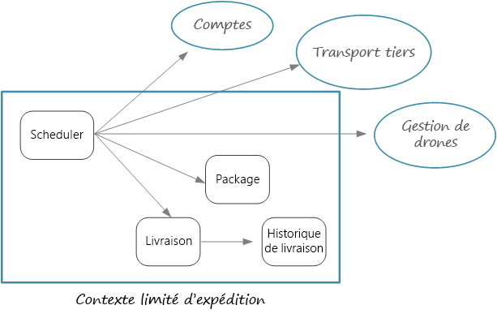
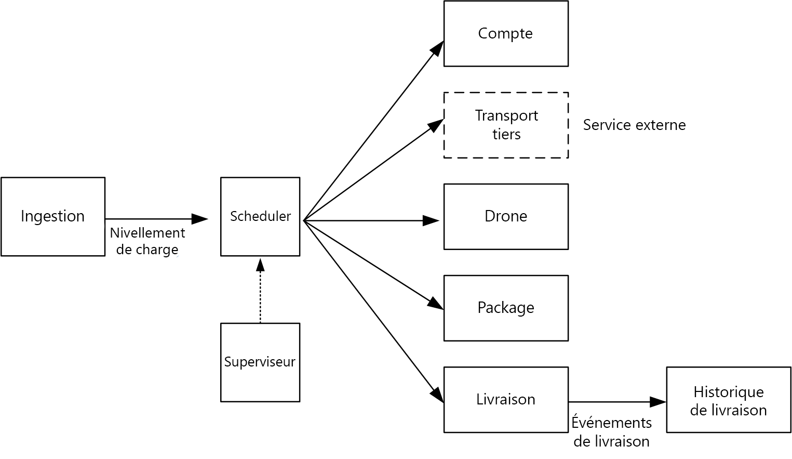

# Conception de microservices : identification des limites de microserviceDesigning microservices: Identifying microservice boundaries

Quelle est la taille adaptée pour un microservice ?What is the right size for a microservice? Vous entendez souvent « ni trop gros, ni trop petit » &mdash; et, bien que certainement correct, ce n’est pas très utile dans la pratique.You often hear something to the effect of, "not too big and not too small" &mdash; and while that's certainly correct, it's not very helpful in practice. Mais si vous partez d’un modèle de domaine bien conçu, il est beaucoup plus facile d’aborder les microservices.But if you start from a carefully designed domain model, it's much easier to reason about microservices.

## Du modèle de domaine aux microservicesFrom domain model to microservices

Dans le [chapitre précédent](./domain-analysis.md), nous avons défini un ensemble de contextes limités pour l’application de livraison par drone, Drone Delivery.In the [previous chapter](./domain-analysis.md), we defined a set of bounded contexts for the Drone Delivery application. Ensuite, nous avons examiné plus en détail un de ces contextes limités (celui de l’expédition) et identifié un ensemble d’entités, d’agrégats et de services de domaine pour ce contexte limité.Then we looked more closely at one of these bounded contexts, the Shipping bounded context, and identified a set of entities, aggregates, and domain services for that bounded context.

Nous sommes maintenant prêts à passer du modèle de domaine à la conception de l’application.Now we're ready to go from domain model to application design. Il s’agit d’une approche que vous pouvez utiliser pour dériver des microservices à partir du modèle de domaine.Here's an approach that you can use to derive microservices from the domain model.

1. Commencez avec un contexte limité.Start with a bounded context. En général, la fonctionnalité dans un microservice ne doit pas s’étendre à plusieurs contextes limités.In general, the functionality in a microservice should not span more than one bounded context. Par définition, un contexte limité marque la limite d’un modèle de domaine particulier.By definition, a bounded context marks the boundary of a particular domain model. S’il s’avère qu’un microservice associe des modèles de domaines différents, vous devrez peut-être revenir en arrière et affiner votre analyse de domaine.If you find that a microservice mixes different domain models together, that's a sign that you may need to go back and refine your domain analysis.

2. Ensuite, examinez les agrégats dans votre modèle de domaine.Next, look at the aggregates in your domain model. Les agrégats font souvent de bons candidats pour les microservices.Aggregates are often good candidates for microservices. Un agrégat bien conçu présente de nombreuses caractéristiques d’un microservice bien conçu. Entre autres :A well-designed aggregate exhibits many of the characteristics of a well-designed microservice, such as:

    - Un agrégat est dérivé des besoins de l’entreprise, plutôt que des problèmes techniques, tels que les accès aux données ou la messagerie.An aggregates is derived from business requirements, rather than technical concerns such as data access or messaging.  
    - Un agrégat doit avoir une cohésion fonctionnelle élevée.An aggregate should have high functional cohesion.
    - Un agrégat est une limite de persistance.An aggregate is a boundary of persistence.
    - Les agrégats doivent être couplés en laissant une marge de manœuvre.Aggregates should be loosely coupled. 
    
3. Les services de domaine font également de bons candidats pour les microservices.Domain services are also good candidates for microservices. Les services de domaine sont des opérations sans état entre plusieurs agrégats.Domain services are stateless operations across multiple aggregates. Un workflow impliquant plusieurs microservices en est un exemple type.A typical example is a workflow that involves several microservices. Nous en verrons un exemple dans l’application Drone Delivery.We'll see an example of this in the Drone Delivery application.

4. Enfin, tenez compte des exigences non fonctionnelles.Finally, consider non-functional requirements. Examinez les facteurs tels que la taille de l’équipe, les types de données, les technologies, ainsi que les exigences d’extensibilité, de disponibilité et de sécurité.Look at factors such as team size, data types, technologies, scalability requirements, availability requirements, and security requirements. Ces facteurs peuvent vous amener à décomposer un microservice en plusieurs services plus petits ou, à l’inverse, à combiner plusieurs microservices en un seul.These factors may lead you to further decompose a microservice into two or more smaller services, or do the opposite and combine several microservices into one. 

Après avoir identifié le microservices dans votre application, vérifiez la conception en vous aidant des critères suivants :After you identify the microservices in your application, validate your design against the following criteria:

- Chaque service a une seule responsabilité.Each service has a single responsibility.
- Il n’existe aucun appel bavard entre les services.There are no chatty calls between services. Si le fractionnement des fonctionnalités entre deux services entraîne trop de bavardage, cela peut indiquer que ces fonctions appartiennent au même service.If splitting functionality into two services causes them to be overly chatty, it may be a symptom that these functions belong in the same service.
- Chaque service est assez petit pour permettre à une petite équipe travaillant indépendamment de le générer.Each service is small enough that it can be built by a small team working independently.
- Il n’existe aucune interdépendance qui nécessite le déploiement de plusieurs services avec un verrouillage.There are no inter-dependencies that will require two or more services to be deployed in lock-step. Il doit toujours être possible de déployer un service sans avoir à redéployer les autres services.It should always be possible to deploy a service without redeploying any other services.
- Les services ne sont pas strictement couplés et peuvent évoluer indépendamment.Services are not tightly coupled, and can evolve independently.
- Les limites de service ne créeront pas de problèmes liés à l’intégrité ou à la cohérence des données.Your service boundaries will not create problems with data consistency or integrity. Parfois, il est important de maintenir la cohérence des données en plaçant des fonctionnalités dans un seul microservice.Sometimes it's important to maintain data consistency by putting functionality into a single microservice. Ceci dit, déterminez si vous avez vraiment besoin d’une forte cohérence.That said, consider whether you really need strong consistency. Il existe des stratégies de résolution de la cohérence éventuelle dans un système distribué, et les avantages de la décomposition des services l’emportent souvent sur les défis de gestion de la cohérence éventuelle.There are strategies for addressing eventual consistency in a distributed system, and the benefits of decomposing services often outweigh the challenges of managing eventual consistency.

Avant tout, il est important d’être pragmatique et de ne pas oublier que la conception orientée domaine est un processus itératif.Above all, it's important to be pragmatic, and remember that domain-driven design is an iterative process. En cas de doute, commencez avec des microservices généraux.When in doubt, start with more coarse-grained microservices. Il est plus facile de fractionner un microservice en deux services plus petits que de refactoriser une fonctionnalité entre plusieurs microservices existants.Splitting a microservice into two smaller services is easier than refactoring functionality across several existing microservices.
  
## Drone Delivery : définition des microservicesDrone Delivery: Defining the microservices

Rappelez-vous que l’équipe de développement a identifié les quatre agrégats &mdash; Livraison, Colis, Drone et Compte &mdash; et deux services de domaine (le planificateur et le superviseur).Recall that the development team had identified the four aggregates &mdash; Delivery, Package, Drone, and Account &mdash; and two domain services, Scheduler and Supervisor. 

Les agrégats Livraison et Colis sont des candidats évidents pour les microservices.Delivery and Package are obvious candidates for microservices. Le planificateur et le superviseur coordonnent les activités effectuées par les autres microservices. Il est donc judicieux de mettre en œuvre ces services de domaine en tant que microservices.The Scheduler and Supervisor coordinate the activities performed by other microservices, so it makes sense to implement these domain services as microservices.  

Les agrégats Drone et Compte sont intéressants, car ils appartiennent à d’autres contextes limités.Drone and Account are interesting because they belong to other bounded contexts. Première option : le planificateur appelle directement les contextes limités Drone et Compte.One option is for the Scheduler to call the Drone and Account bounded contexts directly. Seconde option : créer des microservices Drone et Compte dans le contexte limité Expédition.Another option is to create Drone and Account microservices inside the Shipping bounded context. Ces microservices serviraient de médiateurs entre les contextes limités, en exposant des API ou des schémas de données plus adaptés au contexte Expédition.These microservices would mediate between the bounded contexts, by exposing APIs or data schemas that are more suited to the Shipping context.

Les détails des contextes limités Drone et Compte dépassent le cadre de ce guide. Nous avons donc créé des services fictifs pour eux dans notre implémentation de référence.The details of the Drone and Account bounded contexts are beyond the scope of this guidance, so we created mock services for them in our reference implementation. Mais voici quelques facteurs à prendre en compte dans cette situation :But here are some factors to consider in this situation:

- Quelle charge réseau représente un appel direct dans l’autre contexte limité ?What is the network overhead of calling directly into the other bounded context? 

- Le schéma de données pour l’autre contexte limité est-il approprié pour ce contexte, ou vaut-il mieux avoir un schéma sur mesure pour ce contexte limité ?Is the data schema for the other bounded context suitable for this context, or is it better to have a schema that's tailored to this bounded context? 

- L’autre contexte limité est-il un système hérité ?Is the other bounded context a legacy system? Dans ce cas, vous pouvez créer un service qui agit comme une [couche anti-corruption](../patterns/anti-corruption-layer.md) pour traduire entre le système hérité et l’application moderne.If so, you might create a service that acts as an [anti-corruption layer](../patterns/anti-corruption-layer.md) to translate between the legacy system and the modern application. 

- Quelle est la structure de l’équipe ?What is the team structure? Est-il facile de communiquer avec l’équipe responsable de l’autre contexte limité ?Is it easy to communicate with the team that's responsible for the other bounded context? Si ce n’est pas le cas, créez un service qui sert d’intermédiaire entre les deux contextes pour les frais de communication entre les équipes.If not, creating a service that mediates between the two contexts can help to mitigate the cost of cross-team communication.

Jusqu'à présent, nous n’avons pas considéré les exigences non fonctionnelles.So far, we haven't considered any non-functional requirements. Avec à l’esprit les exigences de débit de l’application, l’équipe de développement décidé créer un microservice Ingestion distinct qui est chargé d’ingérer les requêtes des clients.Thinking about the application's throughput requirements, the development team decided to create a separate Ingestion microservice that is responsible for ingesting client requests. Ce microservice implémentera le [nivellement de charge](../patterns/queue-based-load-leveling.md) en plaçant les requêtes entrantes dans une mémoire tampon en vue de leur traitement.This microservice will implement [load leveling](../patterns/queue-based-load-leveling.md) by putting incoming requests into a buffer for processing. Le planificateur lira les requêtes à partir de la mémoire tampon et exécutera le workflow.The Scheduler will read the requests from the buffer and execute the workflow. 

Les exigences non fonctionnelles ont conduit l’équipe à créer un service supplémentaire.Non-functional requirements led the team to create one additional service. À ce stade, tous les services concernent le processus de planification et de livraison des colis en temps réel.All of the services so far have been about the process of scheduling and delivering packages in real time. Mais le système doit stocker l’historique de chaque livraison dans un emplacement de stockage à long terme pour l’analyse de données.But the system also needs to store the history of every delivery in long-term storage for data analysis. L’équipe a envisagé d’en donner la responsabilité au service Livraison.The team considered making this the responsibility of the Delivery service. Toutefois, les exigences de stockage de données sont très différentes pour une analyse d’historique et des opérations en cours (voir [Considérations relatives aux données](./data-considerations.md)).However, the data storage requirements are quite different for historical analysis versus in-flight operations (see [Data considerations](./data-considerations.md)). Par conséquent, l’équipe a décidé de créer un service Historique des livraisons distinct, qui écoute les événements DeliveryTracking à partir du service Livraison et les écrit dans l’emplacement de stockage à long terme.Therefore, the team decided to create a separate Delivery History service, which will listen for DeliveryTracking events from the Delivery service and write the events into long-term storage.

Le schéma suivant présente la conception à ce stade :The following diagram shows the design at this point:
 

## Choix d'une option de calculChoosing a compute option

Le terme *calcul* fait référence au modèle d’hébergement des ressources de calcul utilisées par votre application.The term *compute* refers to the hosting model for the computing resources that your application runs on. Pour une architecture de microservices, deux approches sont particulièrement prisées :For a microservices architecture, two approaches are especially popular:

- Orchestrateur de service qui gère les services s’exécutant sur des nœuds dédiés (machines virtuelles).A service orchestrator that manages services running on dedicated nodes (VMs).
- Architecture sans serveur utilisant des fonctions en tant que service (FaaS).A serverless architecture using functions as a service (FaaS). 

Bien qu’il ne s’agisse pas des seules options, ce sont deux approches éprouvées pour créer des microservices.While these aren't the only options, they are both proven approaches to building microservices. Une application peut inclure les deux approches.An application might include both approaches.

### Orchestrateurs de servicesService orchestrators

Un orchestrateur gère les tâches liées au déploiement et à la gestion d’un ensemble de services.An orchestrator handles tasks related to deploying and managing a set of services. Ces tâches incluent le placement des services sur des nœuds, la surveillance de l’intégrité des services, le redémarrage des services non intègres, l’équilibrage de charge du trafic réseau entre les instances de service, la détection des services, la mise à l’échelle du nombre d’instances d’un service et l’application des mises à jour de configuration.These tasks include placing services on nodes, monitoring the health of services, restarting unhealthy services, load balancing network traffic across service instances, service discovery, scaling the number of instances of a service, and applying configuration updates. Les orchestrateurs les plus courants sont Kubernetes, DC/OS, Docker Swarm et Service Fabric.Popular orchestrators include Kubernetes, DC/OS, Docker Swarm, and Service Fabric. 

- [Azure Container Service](/azure/container-service/) (ACS) est un service Azure qui permet de déployer un cluster Kubernetes, DC/OS ou Docker Swarm prêt pour la production.[Azure Container Service](/azure/container-service/) (ACS) is an Azure service that lets you deploy a production-ready Kubernetes, DC/OS, or Docker Swarm cluster.

- [AKS (Azure Container Service)](/azure/aks/) est un service managé Kubernetes.[AKS (Azure Container Service)](/azure/aks/) is a managed Kubernetes service. AKS configure Kubernetes et expose les points de terminaison d’API Kubernetes, mais il héberge et gère le plan de contrôle Kubernetes, en exécutant les mises à niveau automatisées, l’application automatisée de correctifs, la mise à l’échelle automatique et d’autres tâches de gestion.AKS provisions Kubernetes and exposes the Kubernetes API endpoints, but hosts and manages the Kubernetes control plane, performing automated upgrades, automated patching, autoscaling, and other management tasks. Vous pouvez considérer AKS comme « des API Kubernetes en tant que service ».You can think of AKS as being "Kubernetes APIs as a service." Au moment de la rédaction de ce document, AKS est toujours en version préliminaire.At the time of writing, AKS is still in preview. Toutefois, AKS devrait devenir la méthode à privilégier pour exécuter Kubernetes dans Azure.However, it's expected that AKS will become the preferred way to run Kubernetes in Azure. 

- [Service Fabric](/azure/service-fabric/) est une plateforme de systèmes distribués pour le packaging, le déploiement et la gestion de microservices.[Service Fabric](/azure/service-fabric/) is a distributed systems platform for packaging, deploying, and managing microservices. Les microservices peuvent être déployés vers Service Fabric comme des conteneurs, des exécutables binaires ou des [Reliable Services](/azure/service-fabric/service-fabric-reliable-services-introduction).Microservices can be deployed to Service Fabric as containers, as binary executables, or as [Reliable Services](/azure/service-fabric/service-fabric-reliable-services-introduction). À l’aide du modèle de programmation des Reliable Services, les services peuvent directement utiliser les API de programmation Service Fabric pour interroger le système, vérifier l’intégrité, recevoir des notifications sur la configuration et les modifications de code, et détecter d’autres services.Using the Reliable Services programming model, services can directly use Service Fabric programming APIs to query the system, report health, receive notifications about configuration and code changes, and discover other services. La singularité de Service Fabric tient au fait qu’il est axé sur la création de services avec état à l’aide de [Reliable Collections](/azure/service-fabric/service-fabric-reliable-services-reliable-collections).A key differentiation with Service Fabric is its strong focus on building stateful services using [Reliable Collections](/azure/service-fabric/service-fabric-reliable-services-reliable-collections).

### ConteneursContainers

On fait parfois l’amalgame entre conteneurs et microservices.Sometimes people talk about containers and microservices as if they were the same thing. Or, il s’agit de deux choses différentes &mdash; vous n’avez pas besoin de conteneurs pour générer des microservices &mdash; et les conteneurs ont des avantages particulièrement intéressants pour les microservices, tels que :While that's not true &mdash; you don't need containers to build microservices &mdash; containers do have some benefits that are particularly relevant to microservices, such as:

- **Portabilité** :**Portability**. Une image de conteneur est un package autonome qui s’exécute sans nécessiter l’installation des bibliothèques ou autres dépendances.A container image is a standalone package that runs without needing to install libraries or other dependencies. Cela la rend facile à déployer.That makes them easy to deploy. Les conteneurs peuvent être démarrés et arrêtés rapidement, afin de lancer des instances pour gérer plus de charge ou pour effectuer une récupération après la défaillance d’un nœud.Containers can be started and stopped quickly, so you can spin up new instances to handle more load or to recover from node failures. 

- **Densité**.**Density**. Les conteneurs sont légers par rapport à l’exécution d’une machine virtuelle, car ils partagent les ressources du système d’exploitation.Containers are lightweight compared with running a virtual machine, because they share OS resources. Cela permet de packager plusieurs conteneurs sur un seul nœud, ce qui est particulièrement utile lorsque l’application se compose de nombreux petits services.That makes it possible to pack multiple containers onto a single node, which is especially useful when the application consists of many small services.

- **Isolation des ressources**.**Resource isolation**. Vous pouvez limiter la quantité de mémoire et d’UC disponible pour un conteneur, ce qui contribue à garantir qu’un processus de perte de contrôle n’épuise pas les ressources de l’hôte.You can limit the amount of memory and CPU that is available to a container, which can help to ensure that a runaway process doesn't exhaust the host resources. Pour plus d’informations, consultez le [modèle de cloisonnement](../patterns/bulkhead.md).See the [Bulkhead Pattern](../patterns/bulkhead.md) for more information.

### Sans serveur (fonctions en tant que service)Serverless (Functions as a Service)

Avec une architecture sans serveur, vous ne gérez ni les machines virtuelles, ni l’infrastructure de réseau virtuel.With a serverless architecture, you don't manage the VMs or the virtual network infrastructure. Par contre, vous déployez le code et le service d’hébergement se charge de placer ce code sur une machine virtuelle et de l’exécuter.Instead, you deploy code and the hosting service handles putting that code onto a VM and executing it. Cette approche a tendance à favoriser les petites fonctions granulaires coordonnées à l’aide de déclencheurs d’événements.This approach tends to favor small granular functions that are coordinated using event-based triggers. Par exemple, un message placé dans une file d’attente peut déclencher une fonction qui lit le contenu de la file d’attente et traite le message.For example, a message being placed onto a queue might trigger a function that reads from the queue and processes the message.

[Azure Functions][functions] est un service de calcul sans serveur qui prend en charge plusieurs déclencheurs de fonction, y compris les requêtes HTTP, les files d’attente Service Bus et les événements Event Hubs.[Azure Functions][functions] is a serverless compute service that supports various function triggers, including HTTP requests, Service Bus queues, and Event Hubs events. Pour obtenir la liste complète, voir [Concepts des déclencheurs et liaisons Azure Functions][functions-triggers].For a complete list, see [Azure Functions triggers and bindings concepts][functions-triggers]. Envisagez également [Azure Event Grid][event-grid], un service de routage d’événement managé dans Azure.Also consider [Azure Event Grid][event-grid], which is a managed event routing service in Azure.

### Orchestrateur ou sans serveur ?Orchestrator or serverless?

Voici quelques éléments à prendre en compte lors du choix entre une approche d’orchestrateur et une approche sans serveur.Here are some factors to consider when choosing between an orchestrator approach and a serverless approach.

**Facilité de gestion** : une application sans serveur est facile à gérer, car la plate-forme gère toutes les ressources de calcul à votre place.**Manageability** A serverless application is easy to manage, because the platform manages all the of compute resources for you. Alors qu’un orchestrateur rend abstraits certains aspects de la gestion et de la configuration d’un cluster, il ne masque pas complètement les machines virtuelles sous-jacentes.While an orchestrator abstracts some aspects of managing and configuring a cluster, it does not completely hide the underlying VMs. Avec un orchestrateur, vous devez envisager des problèmes tels que l’équilibrage de charge, l’utilisation de l’UC et de la mémoire, et la mise en réseau.With an orchestrator, you will need to think about issues such as load balancing, CPU and memory usage, and networking.

**Flexibilité et contrôle** :**Flexibility and control**. un orchestrateur vous donne un grand contrôle sur la configuration et la gestion de vos services et du cluster.An orchestrator gives you a great deal of control over configuring and managing your services and the cluster. L’inconvénient est la complexité accrue.The tradeoff is additional complexity. Avec une architecture sans serveur, vous perdez en contrôle, car ces détails sont rendus abstraits.With a serverless architecture, you give up some degree of control because these details are abstracted.

**Portabilité** :**Portability**. tous les orchestrateurs répertoriés ici (Kubernetes, DC/OS, Docker Swarm et Service Fabric) peuvent s’exécuter localement ou dans plusieurs clouds publics.All of the orchestrators listed here (Kubernetes, DC/OS, Docker Swarm, and Service Fabric) can run on-premises or in multiple public clouds. 

**Intégration d’application** :**Application integration**. il peut être difficile de créer une application complexe à l’aide d’une architecture sans serveur.It can be challenging to build a complex application using a serverless architecture. Une option dans Azure consiste à utiliser [Azure Logic Apps](/azure/logic-apps/) pour coordonner un ensemble de fonctions Azure.One option in Azure is to use [Azure Logic Apps](/azure/logic-apps/) to coordinate a set of Azure Functions. Pour obtenir un exemple de cette approche, consultez [Créer une fonction qui s’intègre avec Azure Logic Apps](/azure/azure-functions/functions-twitter-email).For an example of this approach, see [Create a function that integrates with Azure Logic Apps](/azure/azure-functions/functions-twitter-email).

**Coût** :**Cost**. avec un orchestrateur, vous payez pour les machines virtuelles qui s’exécutent dans le cluster.With an orchestrator, you pay for the VMs that are running in the cluster. Avec une application sans serveur, vous payez uniquement pour les ressources de calcul réellement consommées.With a serverless application, you pay only for the actual compute resources consumed. Dans les deux cas, vous devez tenir compte du coût des services supplémentaires, tels que le stockage, les bases de données et les services de messagerie.In both cases, you need to factor in the cost of any additional services, such as storage, databases, and messaging services.

**Extensibilité**.**Scalability**. Azure Functions est automatiquement mis à l’échelle afin de répondre à la demande, en fonction du nombre d’événements entrants.Azure Functions scales automatically to meet demand, based on the number of incoming events. Avec un orchestrateur, vous pouvez augmenter le nombre d’instances de service en cours d’exécution dans le cluster.With an orchestrator, you can scale out by increasing the number of service instances running in the cluster. Vous pouvez également effectuer une mise à l’échelle en ajoutant des machines virtuelles au cluster.You can also scale by adding additional VMs to the cluster.

Notre implémentation de référence utilise principalement Kubernetes, mais nous avons utilisé Azure Functions pour un service, à savoir le service Historique des livraisons.Our reference implementation primarily uses Kubernetes, but we did use Azure Functions for one service, namely the Delivery History service. Azure Functions est bien adapté à ce service particulier, car il s’agit d’une charge de travail pilotée par des événements.Azure Functions was a good fit for this particular service, because it's is an event-driven workload. En utilisant un déclencheur Event Hubs pour appeler la fonction, le service avait besoin d’une quantité minimale de code.By using an Event Hubs trigger to invoke the function, the service needed a minimal amount of code. En outre, le service Historique des livraisons ne fait pas partie du workflow principal. Son exécution en dehors du cluster Kubernetes n’a donc aucune incidence sur la latence de bout en bout des opérations initiées par l’utilisateur.Also, the Delivery History service is not part of the main workflow, so running it outside of the Kubernetes cluster doesn't affect the end-to-end latency of user-initiated operations. 

> [!div class="nextstepaction"]
> [Considérations sur les donnéesData considerations](./data-considerations.md)

<!-- links -->

[acs-engine]: https://github.com/Azure/acs-engine
[acs-faq]: /azure/container-service/dcos-swarm/container-service-faq
[event-grid]: /azure/event-grid/
[functions]: /azure/azure-functions/functions-overview
[functions-triggers]: /azure/azure-functions/functions-triggers-bindings
