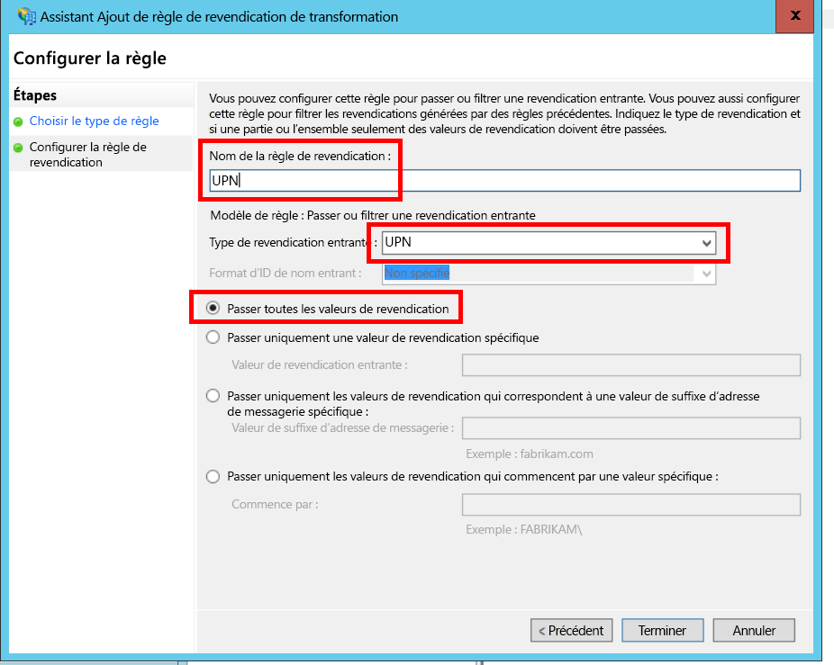

# <a name="federate-with-a-customers-ad-fs"></a><span data-ttu-id="d30c2-103">Se fédérer avec les services AD FS d’un client</span><span class="sxs-lookup"><span data-stu-id="d30c2-103">Federate with a customer's AD FS</span></span>

<span data-ttu-id="d30c2-104">Il décrit comment une application SaaS mutualisée peut prendre en charge l’authentification via Active Directory Federation Services (AD FS), afin de se fédérer avec les services AD FS d’un client.</span><span class="sxs-lookup"><span data-stu-id="d30c2-104">This article describes how a multi-tenant SaaS application can support authentication via Active Directory Federation Services (AD FS), in order to federate with a customer's AD FS.</span></span>

## <a name="overview"></a><span data-ttu-id="d30c2-105">Vue d’ensemble</span><span class="sxs-lookup"><span data-stu-id="d30c2-105">Overview</span></span>

<span data-ttu-id="d30c2-106">Azure Active Directory (Azure AD) vous permet de connecter des utilisateurs à partir de clients Azure AD, y compris de clients Office 365 et Dynamics CRM Online.</span><span class="sxs-lookup"><span data-stu-id="d30c2-106">Azure Active Directory (Azure AD) makes it easy to sign in users from Azure AD tenants, including Office365 and Dynamics CRM Online customers.</span></span> <span data-ttu-id="d30c2-107">Mais qu’en est-il des clients qui utilisent Active Directory localement sur un intranet d’entreprise ?</span><span class="sxs-lookup"><span data-stu-id="d30c2-107">But what about customers who use on-premise Active Directory on a corporate intranet?</span></span>

<span data-ttu-id="d30c2-108">Pour eux, l’une des possibilités consiste à synchroniser leur Active Directory local avec Azure AD, à l’aide d’ [Azure AD Connect].</span><span class="sxs-lookup"><span data-stu-id="d30c2-108">One option is for these customers to sync their on-premise AD with Azure AD, using [Azure AD Connect].</span></span> <span data-ttu-id="d30c2-109">Cependant, certains clients sont parfois dans l’incapacité d’utiliser cette approche, à cause d’une stratégie informatique de l’entreprise ou d’autres raisons.</span><span class="sxs-lookup"><span data-stu-id="d30c2-109">However, some customers may be unable to use this approach, due to corporate IT policy or other reasons.</span></span> <span data-ttu-id="d30c2-110">Dans ce cas, l’autre possibilité consiste à assurer une fédération à l’aide d’Active Directory Federation Services (AD FS).</span><span class="sxs-lookup"><span data-stu-id="d30c2-110">In that case, another option is to federate through Active Directory Federation Services (AD FS).</span></span>

<span data-ttu-id="d30c2-111">Pour ce faire :</span><span class="sxs-lookup"><span data-stu-id="d30c2-111">To enable this scenario:</span></span>

* <span data-ttu-id="d30c2-112">Le client doit disposer d’une batterie de serveurs AD FS sur Internet.</span><span class="sxs-lookup"><span data-stu-id="d30c2-112">The customer must have an Internet-facing AD FS farm.</span></span>
* <span data-ttu-id="d30c2-113">Le fournisseur SaaS déploie sa propre batterie de serveurs AD FS.</span><span class="sxs-lookup"><span data-stu-id="d30c2-113">The SaaS provider deploys their own AD FS farm.</span></span>
* <span data-ttu-id="d30c2-114">Le client et le fournisseur SaaS doivent configurer l’ [approbation de fédération].</span><span class="sxs-lookup"><span data-stu-id="d30c2-114">The customer and the SaaS provider must set up [federation trust].</span></span> <span data-ttu-id="d30c2-115">Ce processus est manuel.</span><span class="sxs-lookup"><span data-stu-id="d30c2-115">This is a manual process.</span></span>

<span data-ttu-id="d30c2-116">La relation d’approbation comprend trois rôles principaux :</span><span class="sxs-lookup"><span data-stu-id="d30c2-116">There are three main roles in the trust relation:</span></span>

* <span data-ttu-id="d30c2-117">Les services AD FS du client sont le [partenaire du compte], responsable de l’authentification des utilisateurs à partir de l’AD du client, et de la création de jetons de sécurité en fonction des revendications des utilisateurs.</span><span class="sxs-lookup"><span data-stu-id="d30c2-117">The customer's AD FS is the [account partner], responsible for authenticating users from the customer's AD, and creating security tokens with user claims.</span></span>
* <span data-ttu-id="d30c2-118">Les services AD FS du fournisseur SaaS sont le [partenaire de ressources], qui approuve le partenaire du compte et reçoit les revendications des utilisateurs.</span><span class="sxs-lookup"><span data-stu-id="d30c2-118">The SaaS provider's AD FS is the [resource partner], which trusts the account partner and receives the user claims.</span></span>
* <span data-ttu-id="d30c2-119">L’application est configurée comme une partie de confiance (RP) dans les services AD FS du fournisseur SaaS.</span><span class="sxs-lookup"><span data-stu-id="d30c2-119">The application is configured as a relying party (RP) in the SaaS provider's AD FS.</span></span>
  
  

> [!NOTE]
> <span data-ttu-id="d30c2-121">Dans cet article, nous partons du principe que l’application utilise OpenID Connect comme protocole d’authentification.</span><span class="sxs-lookup"><span data-stu-id="d30c2-121">In this article, we assume the application uses OpenID connect as the authentication protocol.</span></span> <span data-ttu-id="d30c2-122">L’autre possibilité consiste à utiliser WS-Federation.</span><span class="sxs-lookup"><span data-stu-id="d30c2-122">Another option is to use WS-Federation.</span></span>
>
> <span data-ttu-id="d30c2-123">Pour OpenID Connect, le fournisseur SaaS doit utiliser AD FS 2016 dans Windows Server 2016.</span><span class="sxs-lookup"><span data-stu-id="d30c2-123">For OpenID Connect, the SaaS provider must use AD FS 2016, running in Windows Server 2016.</span></span> <span data-ttu-id="d30c2-124">AD FS 3.0 ne prend pas en charge OpenID Connect.</span><span class="sxs-lookup"><span data-stu-id="d30c2-124">AD FS 3.0 does not support OpenID Connect.</span></span>
>
> <span data-ttu-id="d30c2-125">ASP.NET Core n’intègre pas de prise en charge prêt à l’emploi pour WS-Federation.</span><span class="sxs-lookup"><span data-stu-id="d30c2-125">ASP.NET Core does not include out-of-the-box support for WS-Federation.</span></span>
>
>

<span data-ttu-id="d30c2-126">Pour obtenir un exemple d’utilisation de WS-Federation avec ASP.NET 4, consultez [active-directory-dotnet-webapp-wsfederation][active-directory-dotnet-webapp-wsfederation].</span><span class="sxs-lookup"><span data-stu-id="d30c2-126">For an example of using WS-Federation with ASP.NET 4, see the [active-directory-dotnet-webapp-wsfederation sample][active-directory-dotnet-webapp-wsfederation].</span></span>

## <a name="authentication-flow"></a><span data-ttu-id="d30c2-127">Flux d’authentification</span><span class="sxs-lookup"><span data-stu-id="d30c2-127">Authentication flow</span></span>

1. <span data-ttu-id="d30c2-128">Lorsque l’utilisateur clique sur « Connexion », l’application le redirige vers un point de terminaison OpenID Connect sur les services AD FS du fournisseur SaaS.</span><span class="sxs-lookup"><span data-stu-id="d30c2-128">When the user clicks "sign in", the application redirects to an OpenID Connect endpoint on the SaaS provider's AD FS.</span></span>
2. <span data-ttu-id="d30c2-129">L’utilisateur entre son nom d’utilisateur («`alice@corp.contoso.com`»).</span><span class="sxs-lookup"><span data-stu-id="d30c2-129">The user enters his or her organizational user name ("`alice@corp.contoso.com`").</span></span> <span data-ttu-id="d30c2-130">Les services AD FS utilisent la découverte du domaine d’accueil pour pointer vers les services AD FS du client, où l’utilisateur entre ses informations d’identification.</span><span class="sxs-lookup"><span data-stu-id="d30c2-130">AD FS uses home realm discovery to redirect to the customer's AD FS, where the user enters their credentials.</span></span>
3. <span data-ttu-id="d30c2-131">Les services AD FS du client envoient les revendications des utilisateurs aux services AD FS du fournisseur SaaS, à l’aide de WS-Federation (ou de SAML).</span><span class="sxs-lookup"><span data-stu-id="d30c2-131">The customer's AD FS sends user claims to the SaaS provider's AD FS, using WF-Federation (or SAML).</span></span>
4. <span data-ttu-id="d30c2-132">Les revendications transitent des services AD FS vers l’application, à l’aide d’OpenID Connect.</span><span class="sxs-lookup"><span data-stu-id="d30c2-132">Claims flow from AD FS to the app, using OpenID Connect.</span></span> <span data-ttu-id="d30c2-133">Cela nécessite un changement de protocole (WS-Federation).</span><span class="sxs-lookup"><span data-stu-id="d30c2-133">This requires a protocol transition from WS-Federation.</span></span>

## <a name="limitations"></a><span data-ttu-id="d30c2-134">Limites</span><span class="sxs-lookup"><span data-stu-id="d30c2-134">Limitations</span></span>

<span data-ttu-id="d30c2-135">Par défaut, l’application par partie de confiance ne reçoit qu’un ensemble fixe de revendications disponibles dans id_token, comme le montre le tableau suivant.</span><span class="sxs-lookup"><span data-stu-id="d30c2-135">By default, the relying party application receives only a fixed set of claims available in the id_token, shown in the following table.</span></span> <span data-ttu-id="d30c2-136">Avec AD FS 2016, vous pouvez personnaliser id_token dans les scénarios OpenID Connect.</span><span class="sxs-lookup"><span data-stu-id="d30c2-136">With AD FS 2016, you can customize the id_token in OpenID Connect scenarios.</span></span> <span data-ttu-id="d30c2-137">Pour plus d’informations, consultez [Jetons d’ID personnalisés dans AD FS](/windows-server/identity/ad-fs/development/customize-id-token-ad-fs-2016).</span><span class="sxs-lookup"><span data-stu-id="d30c2-137">For more information, see [Custom ID Tokens in AD FS](/windows-server/identity/ad-fs/development/customize-id-token-ad-fs-2016).</span></span>

| <span data-ttu-id="d30c2-138">Revendication</span><span class="sxs-lookup"><span data-stu-id="d30c2-138">Claim</span></span> | <span data-ttu-id="d30c2-139">Description</span><span class="sxs-lookup"><span data-stu-id="d30c2-139">Description</span></span> |
| --- | --- |
| <span data-ttu-id="d30c2-140">aud</span><span class="sxs-lookup"><span data-stu-id="d30c2-140">aud</span></span> |<span data-ttu-id="d30c2-141">Audience.</span><span class="sxs-lookup"><span data-stu-id="d30c2-141">Audience.</span></span> <span data-ttu-id="d30c2-142">L’application pour laquelle les revendications ont été émises.</span><span class="sxs-lookup"><span data-stu-id="d30c2-142">The application for which the claims were issued.</span></span> |
| <span data-ttu-id="d30c2-143">AuthenticationInstant</span><span class="sxs-lookup"><span data-stu-id="d30c2-143">authenticationinstant</span></span> |<span data-ttu-id="d30c2-144">[Moment d’authentification].</span><span class="sxs-lookup"><span data-stu-id="d30c2-144">[Authentication instant].</span></span> <span data-ttu-id="d30c2-145">Heure à laquelle l’authentification s’est produite.</span><span class="sxs-lookup"><span data-stu-id="d30c2-145">The time at which authentication occurred.</span></span> |
| <span data-ttu-id="d30c2-146">c_hash</span><span class="sxs-lookup"><span data-stu-id="d30c2-146">c_hash</span></span> |<span data-ttu-id="d30c2-147">Valeur de hachage de code.</span><span class="sxs-lookup"><span data-stu-id="d30c2-147">Code hash value.</span></span> <span data-ttu-id="d30c2-148">Il s’agit d’un hachage du contenu du jeton.</span><span class="sxs-lookup"><span data-stu-id="d30c2-148">This is a hash of the token contents.</span></span> |
| <span data-ttu-id="d30c2-149">exp</span><span class="sxs-lookup"><span data-stu-id="d30c2-149">exp</span></span> |<span data-ttu-id="d30c2-150">[Délai d’expiration].</span><span class="sxs-lookup"><span data-stu-id="d30c2-150">[Expiration time].</span></span> <span data-ttu-id="d30c2-151">Délai au bout duquel le jeton n’est plus accepté.</span><span class="sxs-lookup"><span data-stu-id="d30c2-151">The time after which the token will no longer be accepted.</span></span> |
| <span data-ttu-id="d30c2-152">iat</span><span class="sxs-lookup"><span data-stu-id="d30c2-152">iat</span></span> |<span data-ttu-id="d30c2-153">Émis à.</span><span class="sxs-lookup"><span data-stu-id="d30c2-153">Issued at.</span></span> <span data-ttu-id="d30c2-154">Heure d’émission du jeton.</span><span class="sxs-lookup"><span data-stu-id="d30c2-154">The time when the token was issued.</span></span> |
| <span data-ttu-id="d30c2-155">iss</span><span class="sxs-lookup"><span data-stu-id="d30c2-155">iss</span></span> |<span data-ttu-id="d30c2-156">Émetteur.</span><span class="sxs-lookup"><span data-stu-id="d30c2-156">Issuer.</span></span> <span data-ttu-id="d30c2-157">La valeur de cette revendication correspond toujours aux services AD FS du partenaire de ressources.</span><span class="sxs-lookup"><span data-stu-id="d30c2-157">The value of this claim is always the resource partner's AD FS.</span></span> |
| <span data-ttu-id="d30c2-158">Nom</span><span class="sxs-lookup"><span data-stu-id="d30c2-158">name</span></span> |<span data-ttu-id="d30c2-159">Nom d’utilisateur.</span><span class="sxs-lookup"><span data-stu-id="d30c2-159">User name.</span></span> <span data-ttu-id="d30c2-160">Exemple : `john@corp.fabrikam.com`</span><span class="sxs-lookup"><span data-stu-id="d30c2-160">Example: `john@corp.fabrikam.com`</span></span> |
| <span data-ttu-id="d30c2-161">nameidentifier</span><span class="sxs-lookup"><span data-stu-id="d30c2-161">nameidentifier</span></span> |<span data-ttu-id="d30c2-162">[Identificateur de nom].</span><span class="sxs-lookup"><span data-stu-id="d30c2-162">[Name identifier].</span></span> <span data-ttu-id="d30c2-163">Identificateur du nom de l’entité pour laquelle le jeton a été émis.</span><span class="sxs-lookup"><span data-stu-id="d30c2-163">The identifier for the name of the entity for which the token was issued.</span></span> |
| <span data-ttu-id="d30c2-164">nonce</span><span class="sxs-lookup"><span data-stu-id="d30c2-164">nonce</span></span> |<span data-ttu-id="d30c2-165">Valeur à usage unique de session.</span><span class="sxs-lookup"><span data-stu-id="d30c2-165">Session nonce.</span></span> <span data-ttu-id="d30c2-166">Valeur unique générée par AD FS pour empêcher les attaques par relecture.</span><span class="sxs-lookup"><span data-stu-id="d30c2-166">A unique value generated by AD FS to help prevent replay attacks.</span></span> |
| <span data-ttu-id="d30c2-167">upn</span><span class="sxs-lookup"><span data-stu-id="d30c2-167">upn</span></span> |<span data-ttu-id="d30c2-168">Nom d’utilisateur principal.</span><span class="sxs-lookup"><span data-stu-id="d30c2-168">User principal name (UPN).</span></span> <span data-ttu-id="d30c2-169">Exemple : `john@corp.fabrikam.com`</span><span class="sxs-lookup"><span data-stu-id="d30c2-169">Example: `john@corp.fabrikam.com`</span></span> |
| <span data-ttu-id="d30c2-170">pwd_exp</span><span class="sxs-lookup"><span data-stu-id="d30c2-170">pwd_exp</span></span> |<span data-ttu-id="d30c2-171">Période d’expiration de mot de passe.</span><span class="sxs-lookup"><span data-stu-id="d30c2-171">Password expiration period.</span></span> <span data-ttu-id="d30c2-172">Délai en secondes au bout duquel le mot de passe de l’utilisateur ou un secret d’authentification équivalent, tel qu’un code PIN,</span><span class="sxs-lookup"><span data-stu-id="d30c2-172">The number of seconds until the user's password or a similar authentication secret, such as a PIN.</span></span> <span data-ttu-id="d30c2-173">arrive à expiration.</span><span class="sxs-lookup"><span data-stu-id="d30c2-173">expires.</span></span> |

> [!NOTE]
> <span data-ttu-id="d30c2-174">La revendication « iss » contient les services AD FS du partenaire (en règle générale, cette revendication identifie le fournisseur SaaS comme étant l’émetteur).</span><span class="sxs-lookup"><span data-stu-id="d30c2-174">The "iss" claim contains the AD FS of the partner (typically, this claim will identify the SaaS provider as the issuer).</span></span> <span data-ttu-id="d30c2-175">Elle n’identifie pas les services AD FS du client.</span><span class="sxs-lookup"><span data-stu-id="d30c2-175">It does not identify the customer's AD FS.</span></span> <span data-ttu-id="d30c2-176">Vous pouvez trouver le domaine du client dans l’UPN.</span><span class="sxs-lookup"><span data-stu-id="d30c2-176">You can find the customer's domain as part of the UPN.</span></span>

<span data-ttu-id="d30c2-177">Le reste de cet article décrit comment définir la relation d’approbation entre la partie de confiance (l’application) et le partenaire du compte (le client).</span><span class="sxs-lookup"><span data-stu-id="d30c2-177">The rest of this article describes how to set up the trust relationship between the RP (the app) and the account partner (the customer).</span></span>

## <a name="ad-fs-deployment"></a><span data-ttu-id="d30c2-178">Déploiement des services AD FS</span><span class="sxs-lookup"><span data-stu-id="d30c2-178">AD FS deployment</span></span>

<span data-ttu-id="d30c2-179">Le fournisseur SaaS peut déployer les services AD FS sur site ou sur des machines virtuelles Azure.</span><span class="sxs-lookup"><span data-stu-id="d30c2-179">The SaaS provider can deploy AD FS either on-premise or on Azure VMs.</span></span> <span data-ttu-id="d30c2-180">Pour des raisons de sécurité et de disponibilité, les instructions suivantes sont importantes :</span><span class="sxs-lookup"><span data-stu-id="d30c2-180">For security and availability, the following guidelines are important:</span></span>

* <span data-ttu-id="d30c2-181">Déployez au moins deux serveurs AD FS et deux serveurs proxy AD FS pour optimiser la disponibilité des services AD FS.</span><span class="sxs-lookup"><span data-stu-id="d30c2-181">Deploy at least two AD FS servers and two AD FS proxy servers to achieve the best availability of the AD FS service.</span></span>
* <span data-ttu-id="d30c2-182">Les contrôleurs de domaine et les serveurs AD FS ne doivent jamais être exposés directement à Internet et doivent être accessibles directement dans un réseau virtuel.</span><span class="sxs-lookup"><span data-stu-id="d30c2-182">Domain controllers and AD FS servers should never be exposed directly to the Internet and should be in a virtual network with direct access to them.</span></span>
* <span data-ttu-id="d30c2-183">Les proxys d’application web (les anciens proxys AD FS) doivent être utilisés pour publier des serveurs AD FS sur Internet.</span><span class="sxs-lookup"><span data-stu-id="d30c2-183">Web application proxies (previously AD FS proxies) must be used to publish AD FS servers to the Internet.</span></span>

<span data-ttu-id="d30c2-184">La configuration d’une topologie similaire dans Azure nécessite l’utilisation de réseaux virtuels, de groupes de sécurité réseau, de machines virtuelles Azure et de groupes à haute disponibilité.</span><span class="sxs-lookup"><span data-stu-id="d30c2-184">To set up a similar topology in Azure requires the use of Virtual networks, NSG’s, azure VM’s and availability sets.</span></span> <span data-ttu-id="d30c2-185">Pour plus d’informations, consultez [Recommandations en matière de déploiement de Windows Server Active Directory sur des machines virtuelles Azure][active-directory-on-azure].</span><span class="sxs-lookup"><span data-stu-id="d30c2-185">For more details, see [Guidelines for Deploying Windows Server Active Directory on Azure Virtual Machines][active-directory-on-azure].</span></span>

## <a name="configure-openid-connect-authentication-with-ad-fs"></a><span data-ttu-id="d30c2-186">Configurer l’authentification OpenID Connect avec les services AD FS</span><span class="sxs-lookup"><span data-stu-id="d30c2-186">Configure OpenID Connect authentication with AD FS</span></span>

<span data-ttu-id="d30c2-187">Le fournisseur SaaS doit activer OpenID Connect entre l’application et les services AD FS.</span><span class="sxs-lookup"><span data-stu-id="d30c2-187">The SaaS provider must enable OpenID Connect between the application and AD FS.</span></span> <span data-ttu-id="d30c2-188">Pour ce faire, ajoutez un groupe d’applications dans les services AD FS.</span><span class="sxs-lookup"><span data-stu-id="d30c2-188">To do so, add an application group in AD FS.</span></span>  <span data-ttu-id="d30c2-189">Vous trouverez des instructions détaillées dans ce [billet de blog], sous « Setting up a Web App for OpenId Connect sign in AD FS » (Configuration d’une application web pour une connexion via Open ID Connect dans AD FS).</span><span class="sxs-lookup"><span data-stu-id="d30c2-189">You can find detailed instructions in this [blog post], under " Setting up a Web App for OpenId Connect sign in AD FS."</span></span>

<span data-ttu-id="d30c2-190">Ensuite, configurez l’intergiciel (middleware) OpenID Connect.</span><span class="sxs-lookup"><span data-stu-id="d30c2-190">Next, configure the OpenID Connect middleware.</span></span> <span data-ttu-id="d30c2-191">Le point de terminaison des métadonnées est `https://domain/adfs/.well-known/openid-configuration`, où « domain » est le domaine des services AD FS du fournisseur SaaS.</span><span class="sxs-lookup"><span data-stu-id="d30c2-191">The metadata endpoint is `https://domain/adfs/.well-known/openid-configuration`, where domain is the SaaS provider's AD FS domain.</span></span>

<span data-ttu-id="d30c2-192">En général, vous pouvez l’associer à d’autres points de terminaison OpenID Connect (comme AAD).</span><span class="sxs-lookup"><span data-stu-id="d30c2-192">Typically you might combine this with other OpenID Connect endpoints (such as AAD).</span></span> <span data-ttu-id="d30c2-193">Vous aurez besoin de deux boutons de connexion différents (ou identiques mais différenciés par un moyen ou un autre), afin que l’utilisateur soit redirigé vers le point de terminaison d’authentification approprié.</span><span class="sxs-lookup"><span data-stu-id="d30c2-193">You'll need two different sign-in buttons or some other way to distinguish them, so that the user is sent to the correct authentication endpoint.</span></span>

## <a name="configure-the-ad-fs-resource-partner"></a><span data-ttu-id="d30c2-194">Configurer le partenaire de ressources des services AD FS</span><span class="sxs-lookup"><span data-stu-id="d30c2-194">Configure the AD FS Resource Partner</span></span>

<span data-ttu-id="d30c2-195">Le fournisseur SaaS doit effectuer les opérations suivantes pour chaque client qui souhaite se connecter via les services AD FS :</span><span class="sxs-lookup"><span data-stu-id="d30c2-195">The SaaS provider must do the following for each customer that wants to connect via ADFS:</span></span>

1. <span data-ttu-id="d30c2-196">Ajouter une approbation de fournisseur de revendications.</span><span class="sxs-lookup"><span data-stu-id="d30c2-196">Add a claims provider trust.</span></span>
2. <span data-ttu-id="d30c2-197">Ajouter des règles de revendications.</span><span class="sxs-lookup"><span data-stu-id="d30c2-197">Add claims rules.</span></span>
3. <span data-ttu-id="d30c2-198">Activer la découverte du domaine d’accueil.</span><span class="sxs-lookup"><span data-stu-id="d30c2-198">Enable home-realm discovery.</span></span>

<span data-ttu-id="d30c2-199">Voyons ces étapes plus en détail.</span><span class="sxs-lookup"><span data-stu-id="d30c2-199">Here are the steps in more detail.</span></span>

### <a name="add-the-claims-provider-trust"></a><span data-ttu-id="d30c2-200">Ajouter une approbation de fournisseur de revendications</span><span class="sxs-lookup"><span data-stu-id="d30c2-200">Add the claims provider trust</span></span>

1. <span data-ttu-id="d30c2-201">Dans Gestionnaire de serveur, cliquez sur **Outils**, puis sélectionnez **Gestion AD FS**.</span><span class="sxs-lookup"><span data-stu-id="d30c2-201">In Server Manager, click **Tools**, and then select **AD FS Management**.</span></span>
2. <span data-ttu-id="d30c2-202">Dans l’arborescence de la console, sous **AD FS**, cliquez avec le bouton droit sur **Approbations de fournisseur de revendications**.</span><span class="sxs-lookup"><span data-stu-id="d30c2-202">In the console tree, under **AD FS**, right click **Claims Provider Trusts**.</span></span> <span data-ttu-id="d30c2-203">Sélectionnez **Ajouter une approbation de fournisseur de revendications**.</span><span class="sxs-lookup"><span data-stu-id="d30c2-203">Select **Add Claims Provider Trust**.</span></span>
3. <span data-ttu-id="d30c2-204">Cliquez sur **Démarrer** pour démarrer l’assistant.</span><span class="sxs-lookup"><span data-stu-id="d30c2-204">Click **Start** to start the wizard.</span></span>
4. <span data-ttu-id="d30c2-205">Sélectionnez l’option « Importer des données sur le fournisseur de revendications publiées en ligne ou sur un réseau local ».</span><span class="sxs-lookup"><span data-stu-id="d30c2-205">Select the option "Import data about the claims provider published online or on a local network".</span></span> <span data-ttu-id="d30c2-206">Entrez l’URI du point de terminaison des métadonnées de fédération du client.</span><span class="sxs-lookup"><span data-stu-id="d30c2-206">Enter the URI of the customer's federation metadata endpoint.</span></span> <span data-ttu-id="d30c2-207">(Exemple : `https://contoso.com/FederationMetadata/2007-06/FederationMetadata.xml`.) Vous devez vous la procurer auprès du client.</span><span class="sxs-lookup"><span data-stu-id="d30c2-207">(Example: `https://contoso.com/FederationMetadata/2007-06/FederationMetadata.xml`.) You will need to get this from the customer.</span></span>
5. <span data-ttu-id="d30c2-208">Parcourez le reste des étapes de l’Assistant en acceptant les valeurs par défaut.</span><span class="sxs-lookup"><span data-stu-id="d30c2-208">Complete the wizard using the default options.</span></span>

### <a name="edit-claims-rules"></a><span data-ttu-id="d30c2-209">Modifier des règles de revendications</span><span class="sxs-lookup"><span data-stu-id="d30c2-209">Edit claims rules</span></span>

1. <span data-ttu-id="d30c2-210">Cliquez sur l’approbation de fournisseur de revendications ajoutée, puis sélectionnez **Modifier des règles de revendications**.</span><span class="sxs-lookup"><span data-stu-id="d30c2-210">Right-click the newly added claims provider trust, and select **Edit Claims Rules**.</span></span>
2. <span data-ttu-id="d30c2-211">Cliquez sur **Ajouter une règle**.</span><span class="sxs-lookup"><span data-stu-id="d30c2-211">Click **Add Rule**.</span></span>
3. <span data-ttu-id="d30c2-212">Sélectionnez « Transférer ou filtrer une revendication entrante » et cliquez sur **Suivant**.</span><span class="sxs-lookup"><span data-stu-id="d30c2-212">Select "Pass Through or Filter an Incoming Claim" and click **Next**.</span></span>
   <span data-ttu-id="d30c2-213"></span><span class="sxs-lookup"><span data-stu-id="d30c2-213"></span></span>
4. <span data-ttu-id="d30c2-214">Entrez le nom de la règle.</span><span class="sxs-lookup"><span data-stu-id="d30c2-214">Enter a name for the rule.</span></span>
5. <span data-ttu-id="d30c2-215">Sous « Type de revendication entrante », sélectionnez **UPN**.</span><span class="sxs-lookup"><span data-stu-id="d30c2-215">Under "Incoming claim type", select **UPN**.</span></span>
6. <span data-ttu-id="d30c2-216">Sélectionnez « Transférer toutes les valeurs de revendication ».</span><span class="sxs-lookup"><span data-stu-id="d30c2-216">Select "Pass through all claim values".</span></span>
   <span data-ttu-id="d30c2-217"></span><span class="sxs-lookup"><span data-stu-id="d30c2-217"></span></span>
7. <span data-ttu-id="d30c2-218">Cliquez sur **Terminer**.</span><span class="sxs-lookup"><span data-stu-id="d30c2-218">Click **Finish**.</span></span>
8. <span data-ttu-id="d30c2-219">Répétez les étapes 2 à 7 et spécifiez **Type de revendication d’ancrage** comme type de revendication entrante.</span><span class="sxs-lookup"><span data-stu-id="d30c2-219">Repeat steps 2 - 7, and specify **Anchor Claim Type** for the incoming claim type.</span></span>
9. <span data-ttu-id="d30c2-220">Cliquez sur **OK** pour terminer l’assistant.</span><span class="sxs-lookup"><span data-stu-id="d30c2-220">Click **OK** to complete the wizard.</span></span>

### <a name="enable-home-realm-discovery"></a><span data-ttu-id="d30c2-221">Activer la découverte du domaine d’accueil</span><span class="sxs-lookup"><span data-stu-id="d30c2-221">Enable home-realm discovery</span></span>

<span data-ttu-id="d30c2-222">Exécutez le script PowerShell suivant :</span><span class="sxs-lookup"><span data-stu-id="d30c2-222">Run the following PowerShell script:</span></span>

```powershell
Set-ADFSClaimsProviderTrust -TargetName "name" -OrganizationalAccountSuffix @("suffix")
```

<span data-ttu-id="d30c2-223">où « name » est le nom convivial de l’approbation de fournisseur de revendications, et « suffix » est le suffixe UPN de l’Active Directory du client (par exemple, « corp.fabrikam.com »).</span><span class="sxs-lookup"><span data-stu-id="d30c2-223">where "name" is the friendly name of the claims provider trust, and "suffix" is the UPN suffix for the customer's AD (example, "corp.fabrikam.com").</span></span>

<span data-ttu-id="d30c2-224">Avec cette configuration, les utilisateurs peuvent saisir leur compte professionnel et AD FS sélectionne automatiquement le fournisseur de revendications correspondant.</span><span class="sxs-lookup"><span data-stu-id="d30c2-224">With this configuration, end users can type in their organizational account, and AD FS automatically selects the corresponding claims provider.</span></span> <span data-ttu-id="d30c2-225">Consultez la page [Personnalisation des pages de connexion AD FS], dans la section « Configurer le fournisseur d’identité pour utiliser certains suffixes d’adresse de messagerie ».</span><span class="sxs-lookup"><span data-stu-id="d30c2-225">See [Customizing the AD FS Sign-in Pages], under the section "Configure Identity Provider to use certain email suffixes".</span></span>

## <a name="configure-the-ad-fs-account-partner"></a><span data-ttu-id="d30c2-226">Configurer le partenaire de compte AD FS</span><span class="sxs-lookup"><span data-stu-id="d30c2-226">Configure the AD FS Account Partner</span></span>

<span data-ttu-id="d30c2-227">Le client doit effectuer les opérations suivantes :</span><span class="sxs-lookup"><span data-stu-id="d30c2-227">The customer must do the following:</span></span>

1. <span data-ttu-id="d30c2-228">Ajouter une approbation de partie de confiance.</span><span class="sxs-lookup"><span data-stu-id="d30c2-228">Add a relying party (RP) trust.</span></span>
2. <span data-ttu-id="d30c2-229">Ajouter des règles de revendications.</span><span class="sxs-lookup"><span data-stu-id="d30c2-229">Adds claims rules.</span></span>

### <a name="add-the-rp-trust"></a><span data-ttu-id="d30c2-230">Ajouter l’approbation de la partie de confiance</span><span class="sxs-lookup"><span data-stu-id="d30c2-230">Add the RP trust</span></span>

1. <span data-ttu-id="d30c2-231">Dans Gestionnaire de serveur, cliquez sur **Outils**, puis sélectionnez **Gestion AD FS**.</span><span class="sxs-lookup"><span data-stu-id="d30c2-231">In Server Manager, click **Tools**, and then select **AD FS Management**.</span></span>
2. <span data-ttu-id="d30c2-232">Dans l’arborescence de la console, sous **AD FS**, cliquez avec le bouton droit sur **Approbations de partie de confiance**.</span><span class="sxs-lookup"><span data-stu-id="d30c2-232">In the console tree, under **AD FS**, right click **Relying Party Trusts**.</span></span> <span data-ttu-id="d30c2-233">Sélectionnez **Ajouter une approbation de partie de confiance**.</span><span class="sxs-lookup"><span data-stu-id="d30c2-233">Select **Add Relying Party Trust**.</span></span>
3. <span data-ttu-id="d30c2-234">Sélectionnez **Prise en charge des revendications**, puis cliquez sur **Démarrer**.</span><span class="sxs-lookup"><span data-stu-id="d30c2-234">Select **Claims Aware** and click **Start**.</span></span>
4. <span data-ttu-id="d30c2-235">Dans la page **Sélectionner la source de données** page, sélectionnez l’option « Importer des données sur le fournisseur de revendications publiées en ligne ou sur un réseau local ».</span><span class="sxs-lookup"><span data-stu-id="d30c2-235">On the **Select Data Source** page, select the option "Import data about the claims provider published online or on a local network".</span></span> <span data-ttu-id="d30c2-236">Entrez l’URI du point de terminaison des métadonnées de fédération du fournisseur SaaS.</span><span class="sxs-lookup"><span data-stu-id="d30c2-236">Enter the URI of the SaaS provider's federation metadata endpoint.</span></span>
   <span data-ttu-id="d30c2-237"></span><span class="sxs-lookup"><span data-stu-id="d30c2-237"></span></span>
5. <span data-ttu-id="d30c2-238">Dans la page **Indiquer le nom complet** , entrez le nom de votre choix.</span><span class="sxs-lookup"><span data-stu-id="d30c2-238">On the **Specify Display Name** page, enter any name.</span></span>
6. <span data-ttu-id="d30c2-239">Dans la page **Choisir la stratégie de contrôle d’accès** , choisissez une stratégie.</span><span class="sxs-lookup"><span data-stu-id="d30c2-239">On the **Choose Access Control Policy** page, choose a policy.</span></span> <span data-ttu-id="d30c2-240">Vous pouvez autoriser tout le monde dans l’organisation ou choisir un groupe de sécurité.</span><span class="sxs-lookup"><span data-stu-id="d30c2-240">You could permit everyone in the organization, or choose a specific security group.</span></span>
   <span data-ttu-id="d30c2-241"></span><span class="sxs-lookup"><span data-stu-id="d30c2-241"></span></span>
7. <span data-ttu-id="d30c2-242">Entrez les paramètres requis dans la zone **Stratégie**.</span><span class="sxs-lookup"><span data-stu-id="d30c2-242">Enter any parameters required in the **Policy** box.</span></span>
8. <span data-ttu-id="d30c2-243">Cliquez sur **Suivant** pour terminer l’assistant.</span><span class="sxs-lookup"><span data-stu-id="d30c2-243">Click **Next** to complete the wizard.</span></span>

### <a name="add-claims-rules"></a><span data-ttu-id="d30c2-244">Ajouter des règles de revendications</span><span class="sxs-lookup"><span data-stu-id="d30c2-244">Add claims rules</span></span>

1. <span data-ttu-id="d30c2-245">Cliquez avec le bouton droit de la souris sur l’approbation de partie de confiance ajoutée, puis sélectionnez **Modifier la stratégie d’émission de revendications**.</span><span class="sxs-lookup"><span data-stu-id="d30c2-245">Right-click the newly added relying party trust, and select **Edit Claim Issuance Policy**.</span></span>
2. <span data-ttu-id="d30c2-246">Cliquez sur **Ajouter une règle**.</span><span class="sxs-lookup"><span data-stu-id="d30c2-246">Click **Add Rule**.</span></span>
3. <span data-ttu-id="d30c2-247">Sélectionnez « Envoyer les attributs LDAP comme des revendications » et cliquez sur **Suivant**.</span><span class="sxs-lookup"><span data-stu-id="d30c2-247">Select "Send LDAP Attributes as Claims" and click **Next**.</span></span>
4. <span data-ttu-id="d30c2-248">Entrez le nom de la règle (par exemple, « UPN »).</span><span class="sxs-lookup"><span data-stu-id="d30c2-248">Enter a name for the rule, such as "UPN".</span></span>
5. <span data-ttu-id="d30c2-249">Sous **Magasin d’attributs**, sélectionnez **Active Directory**.</span><span class="sxs-lookup"><span data-stu-id="d30c2-249">Under **Attribute store**, select **Active Directory**.</span></span>
   <span data-ttu-id="d30c2-250"></span><span class="sxs-lookup"><span data-stu-id="d30c2-250"></span></span>
6. <span data-ttu-id="d30c2-251">Dans la section **Mappage des attributs LDAP** :</span><span class="sxs-lookup"><span data-stu-id="d30c2-251">In the **Mapping of LDAP attributes** section:</span></span>
   * <span data-ttu-id="d30c2-252">Sous **Attribut LDAP**, sélectionnez **Nom d’utilisateur principal**.</span><span class="sxs-lookup"><span data-stu-id="d30c2-252">Under **LDAP Attribute**, select **User-Principal-Name**.</span></span>
   * <span data-ttu-id="d30c2-253">Sous **Type de revendication sortante**, sélectionnez **UPN**.</span><span class="sxs-lookup"><span data-stu-id="d30c2-253">Under **Outgoing Claim Type**, select **UPN**.</span></span>
     <span data-ttu-id="d30c2-254"></span><span class="sxs-lookup"><span data-stu-id="d30c2-254"></span></span>
7. <span data-ttu-id="d30c2-255">Cliquez sur **Terminer**.</span><span class="sxs-lookup"><span data-stu-id="d30c2-255">Click **Finish**.</span></span>
8. <span data-ttu-id="d30c2-256">Cliquez de nouveau sur **Ajouter une règle** .</span><span class="sxs-lookup"><span data-stu-id="d30c2-256">Click **Add Rule** again.</span></span>
9. <span data-ttu-id="d30c2-257">Sélectionnez « Envoyer les revendications à l’aide d’une règle personnalisée », puis cliquez sur **Suivant**.</span><span class="sxs-lookup"><span data-stu-id="d30c2-257">Select "Send Claims Using a Custom Rule" and click **Next**.</span></span>
10. <span data-ttu-id="d30c2-258">Attribuez un nom à la règle (par exemple, « Type de revendication d’ancrage »).</span><span class="sxs-lookup"><span data-stu-id="d30c2-258">Enter a name for the rule, such as "Anchor Claim Type".</span></span>
11. <span data-ttu-id="d30c2-259">Sous **Règle personnalisée**, ajoutez le code suivant :</span><span class="sxs-lookup"><span data-stu-id="d30c2-259">Under **Custom rule**, enter the following:</span></span>

    ```console
    EXISTS([Type == "http://schemas.microsoft.com/ws/2014/01/identity/claims/anchorclaimtype"])=>
    issue (Type = "http://schemas.microsoft.com/ws/2014/01/identity/claims/anchorclaimtype",
          Value = "http://schemas.xmlsoap.org/ws/2005/05/identity/claims/upn");
    ```

    <span data-ttu-id="d30c2-260">Cette règle émet une revendication de type `anchorclaimtype`.</span><span class="sxs-lookup"><span data-stu-id="d30c2-260">This rule issues a claim of type `anchorclaimtype`.</span></span> <span data-ttu-id="d30c2-261">La revendication indique à la partie de confiance d’utiliser l’UPN comme ID non modifiable de l’utilisateur.</span><span class="sxs-lookup"><span data-stu-id="d30c2-261">The claim tells the relying party to use UPN as the user's immutable ID.</span></span>
12. <span data-ttu-id="d30c2-262">Cliquez sur **Terminer**.</span><span class="sxs-lookup"><span data-stu-id="d30c2-262">Click **Finish**.</span></span>
13. <span data-ttu-id="d30c2-263">Cliquez sur **OK** pour terminer l’assistant.</span><span class="sxs-lookup"><span data-stu-id="d30c2-263">Click **OK** to complete the wizard.</span></span>

<!-- links -->

[Azure AD Connect]: /azure/active-directory/hybrid/whatis-hybrid-identity
[Azure AD Connect]: /azure/active-directory/hybrid/whatis-hybrid-identity
[approbation de fédération]: https://technet.microsoft.com/library/cc770993(v=ws.11).aspx
[federation trust]: https://technet.microsoft.com/library/cc770993(v=ws.11).aspx
[partenaire du compte]: https://technet.microsoft.com/library/cc731141(v=ws.11).aspx
[account partner]: https://technet.microsoft.com/library/cc731141(v=ws.11).aspx
[partenaire de ressources]: https://technet.microsoft.com/library/cc731141(v=ws.11).aspx
[resource partner]: https://technet.microsoft.com/library/cc731141(v=ws.11).aspx
[Moment d’authentification]: https://msdn.microsoft.com/library/system.security.claims.claimtypes.authenticationinstant%28v=vs.110%29.aspx
[Authentication instant]: https://msdn.microsoft.com/library/system.security.claims.claimtypes.authenticationinstant%28v=vs.110%29.aspx
[Délai d’expiration]: https://tools.ietf.org/html/draft-ietf-oauth-json-web-token-25#section-4.1.
[Expiration time]: https://tools.ietf.org/html/draft-ietf-oauth-json-web-token-25#section-4.1.
[Identificateur de nom]: https://msdn.microsoft.com/library/system.security.claims.claimtypes.nameidentifier(v=vs.110).aspx
[Name identifier]: https://msdn.microsoft.com/library/system.security.claims.claimtypes.nameidentifier(v=vs.110).aspx
[active-directory-on-azure]: https://msdn.microsoft.com/library/azure/jj156090.aspx
[billet de blog]: https://www.cloudidentity.com/blog/2015/08/21/OPENID-CONNECT-WEB-SIGN-ON-WITH-ADFS-IN-WINDOWS-SERVER-2016-TP3/
[blog post]: https://www.cloudidentity.com/blog/2015/08/21/OPENID-CONNECT-WEB-SIGN-ON-WITH-ADFS-IN-WINDOWS-SERVER-2016-TP3/
[Personnalisation des pages de connexion AD FS]: https://technet.microsoft.com/library/dn280950.aspx
[Customizing the AD FS Sign-in Pages]: https://technet.microsoft.com/library/dn280950.aspx
[sample application]: https://github.com/mspnp/multitenant-saas-guidance
[client assertion]: client-assertion.md
[active-directory-dotnet-webapp-wsfederation]: https://github.com/Azure-Samples/active-directory-dotnet-webapp-wsfederation
