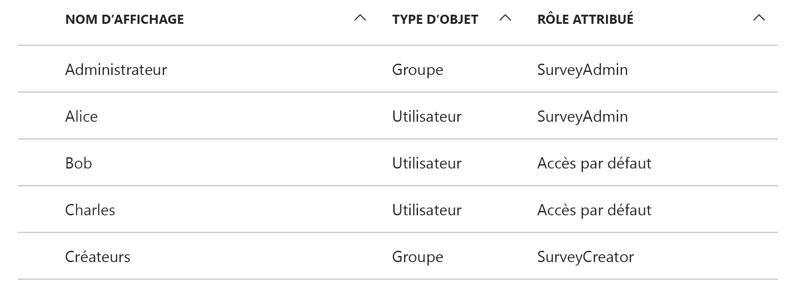

# <a name="application-roles"></a><span data-ttu-id="85b22-103">Rôles d’application</span><span class="sxs-lookup"><span data-stu-id="85b22-103">Application roles</span></span>

<span data-ttu-id="85b22-104">[ Exemple de code][sample application]</span><span class="sxs-lookup"><span data-stu-id="85b22-104">[ Sample code][sample application]</span></span>

<span data-ttu-id="85b22-105">Les rôles d’application servent à affecter des autorisations aux utilisateurs.</span><span class="sxs-lookup"><span data-stu-id="85b22-105">Application roles are used to assign permissions to users.</span></span> <span data-ttu-id="85b22-106">Par exemple, l’application [Tailspin Surveys][Tailspin] définit les rôles suivants :</span><span class="sxs-lookup"><span data-stu-id="85b22-106">For example, the [Tailspin Surveys][Tailspin] application defines the following roles:</span></span>

* <span data-ttu-id="85b22-107">Administrateur.</span><span class="sxs-lookup"><span data-stu-id="85b22-107">Administrator.</span></span> <span data-ttu-id="85b22-108">Peut effectuer toutes les opérations CRUD sur toute enquête appartenant à ce locataire.</span><span class="sxs-lookup"><span data-stu-id="85b22-108">Can perform all CRUD operations on any survey that belongs to that tenant.</span></span>
* <span data-ttu-id="85b22-109">Créateur.</span><span class="sxs-lookup"><span data-stu-id="85b22-109">Creator.</span></span> <span data-ttu-id="85b22-110">Peut créer des enquêtes.</span><span class="sxs-lookup"><span data-stu-id="85b22-110">Can create new surveys.</span></span>
* <span data-ttu-id="85b22-111">Lecteur.</span><span class="sxs-lookup"><span data-stu-id="85b22-111">Reader.</span></span> <span data-ttu-id="85b22-112">Peut consulter les enquêtes appartenant à ce client.</span><span class="sxs-lookup"><span data-stu-id="85b22-112">Can read any surveys that belong to that tenant.</span></span>

<span data-ttu-id="85b22-113">Vous pouvez voir que les rôles sont convertis en permissions, lors de l’ [autorisation].</span><span class="sxs-lookup"><span data-stu-id="85b22-113">You can see that roles ultimately get translated into permissions, during [authorization].</span></span> <span data-ttu-id="85b22-114">Mais la première question concerne l’affectation et la gestion des rôles.</span><span class="sxs-lookup"><span data-stu-id="85b22-114">But the first question is how to assign and manage roles.</span></span> <span data-ttu-id="85b22-115">Nous avons identifié trois principales possibilités :</span><span class="sxs-lookup"><span data-stu-id="85b22-115">We identified three main options:</span></span>

* [<span data-ttu-id="85b22-116">Rôles d’application Azure AD</span><span class="sxs-lookup"><span data-stu-id="85b22-116">Azure AD App Roles</span></span>](#roles-using-azure-ad-app-roles)
* [<span data-ttu-id="85b22-117">Groupes de sécurité Azure AD</span><span class="sxs-lookup"><span data-stu-id="85b22-117">Azure AD security groups</span></span>](#roles-using-azure-ad-security-groups)
* <span data-ttu-id="85b22-118">[Gestionnaire de rôles d’application](#roles-using-an-application-role-manager)</span><span class="sxs-lookup"><span data-stu-id="85b22-118">[Application role manager](#roles-using-an-application-role-manager).</span></span>

## <a name="roles-using-azure-ad-app-roles"></a><span data-ttu-id="85b22-119">Rôles utilisant des rôles d’application Azure AD</span><span class="sxs-lookup"><span data-stu-id="85b22-119">Roles using Azure AD App Roles</span></span>
<span data-ttu-id="85b22-120">Cette approche est celle que nous avons utilisée dans l’application Tailspin Surveys.</span><span class="sxs-lookup"><span data-stu-id="85b22-120">This is the approach that we used in the Tailspin Surveys app.</span></span>

<span data-ttu-id="85b22-121">Dans celle-ci, le fournisseur SaaS définit les rôles d’application en les ajoutant au manifeste de l’application.</span><span class="sxs-lookup"><span data-stu-id="85b22-121">In this approach, The SaaS provider defines the application roles by adding them to the application manifest.</span></span> <span data-ttu-id="85b22-122">Lorsqu’un client se connecte, un administrateur de l’annuaire Active Directory du client affecte les utilisateurs aux rôles.</span><span class="sxs-lookup"><span data-stu-id="85b22-122">After a customer signs up, an admin for the customer's AD directory assigns users to the roles.</span></span> <span data-ttu-id="85b22-123">Lorsqu’un utilisateur se connecte, les rôles qui lui sont affectés sont envoyés en tant que revendications.</span><span class="sxs-lookup"><span data-stu-id="85b22-123">When a user signs in, the user's assigned roles are sent as claims.</span></span>

> [!NOTE]
> <span data-ttu-id="85b22-124">Si le client a Azure AD Premium, l’administrateur peut affecter un groupe de sécurité à un rôle, les membres de ce groupe héritant du rôle d’application concerné.</span><span class="sxs-lookup"><span data-stu-id="85b22-124">If the customer has Azure AD Premium, the admin can assign a security group to a role, and members of the group will inherit the app role.</span></span> <span data-ttu-id="85b22-125">C’est une solution pratique pour gérer des rôles, car le propriétaire du groupe n’a pas besoin d’être administrateur AD.</span><span class="sxs-lookup"><span data-stu-id="85b22-125">This is a convenient way to manage roles, because the group owner doesn't need to be an AD admin.</span></span>
> 
> 

<span data-ttu-id="85b22-126">Avantages de cette approche :</span><span class="sxs-lookup"><span data-stu-id="85b22-126">Advantages of this approach:</span></span>

* <span data-ttu-id="85b22-127">Modèle de programmation simple.</span><span class="sxs-lookup"><span data-stu-id="85b22-127">Simple programming model.</span></span>
* <span data-ttu-id="85b22-128">Rôles propres à l’application.</span><span class="sxs-lookup"><span data-stu-id="85b22-128">Roles are specific to the application.</span></span> <span data-ttu-id="85b22-129">Les revendications de rôle d’une application ne sont pas envoyées à une autre application.</span><span class="sxs-lookup"><span data-stu-id="85b22-129">The role claims for one application are not sent to another application.</span></span>
* <span data-ttu-id="85b22-130">Si le client supprime l’application à partir de son client AD, les rôles disparaissent.</span><span class="sxs-lookup"><span data-stu-id="85b22-130">If the customer removes the application from their AD tenant, the roles go away.</span></span>
* <span data-ttu-id="85b22-131">L’application n’a pas besoin d’autorisations Active Directory supplémentaires, autres que la lecture du profil de l’utilisateur.</span><span class="sxs-lookup"><span data-stu-id="85b22-131">The application doesn't need any extra Active Directory permissions, other than reading the user's profile.</span></span>

<span data-ttu-id="85b22-132">Inconvénients :</span><span class="sxs-lookup"><span data-stu-id="85b22-132">Drawbacks:</span></span>

* <span data-ttu-id="85b22-133">Les clients n’ayant pas Azure AD Premium ne peuvent pas attribuer de groupes de sécurité aux rôles.</span><span class="sxs-lookup"><span data-stu-id="85b22-133">Customers without Azure AD Premium cannot assign security groups to roles.</span></span> <span data-ttu-id="85b22-134">Pour ces clients, toutes les affectations d’utilisateur doivent être effectuées par un administrateur AD.</span><span class="sxs-lookup"><span data-stu-id="85b22-134">For these customers, all user assignments must be done by an AD administrator.</span></span>
* <span data-ttu-id="85b22-135">Si vous avez une API web principale, distincte de l’application web, les attributions de rôle de l’application web ne s’appliquent à l’API web.</span><span class="sxs-lookup"><span data-stu-id="85b22-135">If you have a backend web API, which is separate from the web app, then role assignments for the web app don't apply to the web API.</span></span> <span data-ttu-id="85b22-136">Pour plus d’informations sur ce point, consultez la page [Sécurisation d’une API web principale].</span><span class="sxs-lookup"><span data-stu-id="85b22-136">For more discussion of this point, see [Securing a backend web API].</span></span>

### <a name="implementation"></a><span data-ttu-id="85b22-137">Implémentation</span><span class="sxs-lookup"><span data-stu-id="85b22-137">Implementation</span></span>
<span data-ttu-id="85b22-138">**Définissez les rôles.**</span><span class="sxs-lookup"><span data-stu-id="85b22-138">**Define the roles.**</span></span> <span data-ttu-id="85b22-139">Le fournisseur SaaS déclare les rôles d’application dans le [manifeste de l’application].</span><span class="sxs-lookup"><span data-stu-id="85b22-139">The SaaS provider declares the app roles in the [application manifest].</span></span> <span data-ttu-id="85b22-140">Par exemple, voici l’entrée du manifeste de l’application Surveys :</span><span class="sxs-lookup"><span data-stu-id="85b22-140">For example, here is the manifest entry for the Surveys app:</span></span>

```
"appRoles": [
  {
    "allowedMemberTypes": [
      "User"
    ],
    "description": "Creators can create Surveys",
    "displayName": "SurveyCreator",
    "id": "1b4f816e-5eaf-48b9-8613-7923830595ad",
    "isEnabled": true,
    "value": "SurveyCreator"
  },
  {
    "allowedMemberTypes": [
      "User"
    ],
    "description": "Administrators can manage the Surveys in their tenant",
    "displayName": "SurveyAdmin",
    "id": "c20e145e-5459-4a6c-a074-b942bbd4cfe1",
    "isEnabled": true,
    "value": "SurveyAdmin"
  }
],
```

<span data-ttu-id="85b22-141">La propriété `value` apparaît dans la revendication de rôle.</span><span class="sxs-lookup"><span data-stu-id="85b22-141">The `value`  property appears in the role claim.</span></span> <span data-ttu-id="85b22-142">La propriété `id` est l’identificateur unique du rôle défini.</span><span class="sxs-lookup"><span data-stu-id="85b22-142">The `id` property is the unique identifier for the defined role.</span></span> <span data-ttu-id="85b22-143">Générez toujours une nouvelle valeur GUID pour `id`.</span><span class="sxs-lookup"><span data-stu-id="85b22-143">Always generate a new GUID value for `id`.</span></span>

<span data-ttu-id="85b22-144">**Affectez les utilisateurs**.</span><span class="sxs-lookup"><span data-stu-id="85b22-144">**Assign users**.</span></span> <span data-ttu-id="85b22-145">Lorsqu’un nouveau client se connecte, l’application est enregistrée dans le client AD du client.</span><span class="sxs-lookup"><span data-stu-id="85b22-145">When a new customer signs up, the application is registered in the customer's AD tenant.</span></span> <span data-ttu-id="85b22-146">À ce stade, un administrateur AD de ce client peut affecter des utilisateurs aux rôles.</span><span class="sxs-lookup"><span data-stu-id="85b22-146">At this point, an AD admin for that tenant can assign users to roles.</span></span>

> [!NOTE]
> <span data-ttu-id="85b22-147">Comme nous l’avons déjà vu, les clients n’ayant pas Azure AD Premium ne peuvent pas attribuer de groupes de sécurité aux rôles.</span><span class="sxs-lookup"><span data-stu-id="85b22-147">As noted earlier, customers with Azure AD Premium can also assign security groups to roles.</span></span>
> 
> 

<span data-ttu-id="85b22-148">La capture d’écran du portail Azure suivante montre les utilisateurs et groupes de l’application Surveys.</span><span class="sxs-lookup"><span data-stu-id="85b22-148">The following screenshot from the Azure portal shows users and groups for the Survey application.</span></span> <span data-ttu-id="85b22-149">Admin et Creator sont des groupes, assignés aux rôles SurveyAdmin et SurveyCreator, respectivement.</span><span class="sxs-lookup"><span data-stu-id="85b22-149">Admin and Creator are groups, assigned to SurveyAdmin and SurveyCreator roles respectively.</span></span> <span data-ttu-id="85b22-150">Alice est un utilisateur qui a été assigné directement au rôle SurveyAdmin.</span><span class="sxs-lookup"><span data-stu-id="85b22-150">Alice is a user who was assigned directly to the SurveyAdmin role.</span></span> <span data-ttu-id="85b22-151">Bob et Charles sont des utilisateurs qui n’ont pas été directement assignés à un rôle.</span><span class="sxs-lookup"><span data-stu-id="85b22-151">Bob and Charles are users that have not been directly assigned to a role.</span></span>



<span data-ttu-id="85b22-153">Comme indiqué dans la capture d’écran suivante, Charles fait partie du groupe Admin ; il hérite donc du rôle SurveyAdmin.</span><span class="sxs-lookup"><span data-stu-id="85b22-153">As shown in the following screenshot, Charles is part of the Admin group, so he inherits the SurveyAdmin role.</span></span> <span data-ttu-id="85b22-154">Bob, quant à lui, n’a pas encore été assigné à un rôle.</span><span class="sxs-lookup"><span data-stu-id="85b22-154">In the case of Bob, he has not been assigned a role yet.</span></span>


> [!NOTE]
> <span data-ttu-id="85b22-156">L’application peut également assigner des rôles par programme à l’aide de l’API Graph Azure AD.</span><span class="sxs-lookup"><span data-stu-id="85b22-156">An alternative approach is for the application to assign roles programmatically, using the Azure AD Graph API.</span></span> <span data-ttu-id="85b22-157">Toutefois, pour cela, l’application doit obtenir des autorisations d’écriture dans le répertoire AD du client.</span><span class="sxs-lookup"><span data-stu-id="85b22-157">However, this requires the application to obtain write permissions for the customer's AD directory.</span></span> <span data-ttu-id="85b22-158">Une application avec ces autorisations pourrait faire beaucoup de dégâts &mdash; le client fait confiance à l’application pour qu’elle n’endommage pas son répertoire.</span><span class="sxs-lookup"><span data-stu-id="85b22-158">An application with those permissions could do a lot of mischief &mdash; the customer is trusting the app not to mess up their directory.</span></span> <span data-ttu-id="85b22-159">De nombreux clients pourraient refuser d’accorder ce niveau d’accès.</span><span class="sxs-lookup"><span data-stu-id="85b22-159">Many customers might be unwilling to grant this level of access.</span></span>
> 

<span data-ttu-id="85b22-160">**Obtenez des revendications de rôle**.</span><span class="sxs-lookup"><span data-stu-id="85b22-160">**Get role claims**.</span></span> <span data-ttu-id="85b22-161">Lorsqu’un utilisateur se connecte, l’application reçoit le ou les rôles de celui-ci dans une revendication avec le type `http://schemas.microsoft.com/ws/2008/06/identity/claims/role`.</span><span class="sxs-lookup"><span data-stu-id="85b22-161">When a user signs in, the application receives the user's assigned role(s) in a claim with type `http://schemas.microsoft.com/ws/2008/06/identity/claims/role`.</span></span>  

<span data-ttu-id="85b22-162">Un utilisateur peut avoir zéro, un ou plusieurs rôles.</span><span class="sxs-lookup"><span data-stu-id="85b22-162">A user can have multiple roles, or no role.</span></span> <span data-ttu-id="85b22-163">Dans votre code d’autorisation, ne supposez pas que l’utilisateur n’a qu’une revendication de rôle.</span><span class="sxs-lookup"><span data-stu-id="85b22-163">In your authorization code, don't assume the user has exactly one role claim.</span></span> <span data-ttu-id="85b22-164">Rédigez plutôt un code qui vérifie si une valeur de revendication spécifique est présente :</span><span class="sxs-lookup"><span data-stu-id="85b22-164">Instead, write code that checks whether a particular claim value is present:</span></span>

```csharp
if (context.User.HasClaim(ClaimTypes.Role, "Admin")) { ... }
```

## <a name="roles-using-azure-ad-security-groups"></a><span data-ttu-id="85b22-165">Rôles utilisant les groupes de sécurité Azure AD</span><span class="sxs-lookup"><span data-stu-id="85b22-165">Roles using Azure AD security groups</span></span>
<span data-ttu-id="85b22-166">Dans cette approche, les rôles sont représentés comme des groupes de sécurité AD.</span><span class="sxs-lookup"><span data-stu-id="85b22-166">In this approach, roles are represented as AD security groups.</span></span> <span data-ttu-id="85b22-167">L’application affecte des autorisations aux utilisateurs en fonction de leur appartenance à des groupes de sécurité.</span><span class="sxs-lookup"><span data-stu-id="85b22-167">The application assigns permissions to users based on their security group memberships.</span></span>

<span data-ttu-id="85b22-168">Avantages :</span><span class="sxs-lookup"><span data-stu-id="85b22-168">Advantages:</span></span>

* <span data-ttu-id="85b22-169">Pour les clients qui n’ont pas Azure AD Premium, cette approche permet de gérer les affectations de rôle à l’aide de groupes de sécurité.</span><span class="sxs-lookup"><span data-stu-id="85b22-169">For customers who do not have Azure AD Premium, this approach enables the customer to use security groups to manage role assignments.</span></span>

<span data-ttu-id="85b22-170">Inconvénients :</span><span class="sxs-lookup"><span data-stu-id="85b22-170">Disadvantages:</span></span>

* <span data-ttu-id="85b22-171">Complexité.</span><span class="sxs-lookup"><span data-stu-id="85b22-171">Complexity.</span></span> <span data-ttu-id="85b22-172">Étant donné que chaque client envoie différentes revendications de groupe, l’application doit suivre des groupes de sécurité correspondant aux rôles d’application, pour chaque client.</span><span class="sxs-lookup"><span data-stu-id="85b22-172">Because every tenant sends different group claims, the app must keep track of which security groups correspond to which application roles, for each tenant.</span></span>
* <span data-ttu-id="85b22-173">Si le client supprime l’application de son client AD, les groupes de sécurité sont conservés dans son annuaire AD.</span><span class="sxs-lookup"><span data-stu-id="85b22-173">If the customer removes the application from their AD tenant, the security groups are left in their AD directory.</span></span>

### <a name="implementation"></a><span data-ttu-id="85b22-174">Implémentation</span><span class="sxs-lookup"><span data-stu-id="85b22-174">Implementation</span></span>
<span data-ttu-id="85b22-175">Dans le manifeste de l’application, attribuez à la propriété `groupMembershipClaims` la valeur « SecurityGroup ».</span><span class="sxs-lookup"><span data-stu-id="85b22-175">In the application manifest, set the `groupMembershipClaims` property to "SecurityGroup".</span></span> <span data-ttu-id="85b22-176">Cette opération est nécessaire pour obtenir les revendications d’appartenance au groupe à partir d’AAD.</span><span class="sxs-lookup"><span data-stu-id="85b22-176">This is needed to get group membership claims from AAD.</span></span>

```
{
   // ...
   "groupMembershipClaims": "SecurityGroup",
}
```

<span data-ttu-id="85b22-177">Lorsqu’un nouveau client se connecte, l’application lui demande de créer des groupes de sécurité pour les rôles nécessaires à l’application.</span><span class="sxs-lookup"><span data-stu-id="85b22-177">When a new customer signs up, the application instructs the customer to create security groups for the roles needed by the application.</span></span> <span data-ttu-id="85b22-178">Il doit ensuite entrer les ID d’objet de groupe dans l’application.</span><span class="sxs-lookup"><span data-stu-id="85b22-178">The customer then needs to enter the group object IDs into the application.</span></span> <span data-ttu-id="85b22-179">L’application les enregistre dans une table qui mappe ces ID de groupe aux rôles d’application, par client.</span><span class="sxs-lookup"><span data-stu-id="85b22-179">The application stores these in a table that maps group IDs to application roles, per tenant.</span></span>

> [!NOTE]
> <span data-ttu-id="85b22-180">Autre possibilité, l’application pourrait créer les groupes par programme à l’aide de l’API Azure AD Graph.</span><span class="sxs-lookup"><span data-stu-id="85b22-180">Alternatively, the application could create the groups programmatically, using the Azure AD Graph API.</span></span>  <span data-ttu-id="85b22-181">Cette méthode est moins sujette aux erreurs.</span><span class="sxs-lookup"><span data-stu-id="85b22-181">This would be less error prone.</span></span> <span data-ttu-id="85b22-182">Toutefois, pour cela, l’application doit obtenir des autorisations de lecture et d’écriture sur tous les groupes dans le répertoire AD du client.</span><span class="sxs-lookup"><span data-stu-id="85b22-182">However, it requires the application to obtain "read and write all groups" permissions for the customer's AD directory.</span></span> <span data-ttu-id="85b22-183">De nombreux clients pourraient refuser d’accorder ce niveau d’accès.</span><span class="sxs-lookup"><span data-stu-id="85b22-183">Many customers might be unwilling to grant this level of access.</span></span>
> 
> 

<span data-ttu-id="85b22-184">Lorsqu’un utilisateur se connecte :</span><span class="sxs-lookup"><span data-stu-id="85b22-184">When a user signs in:</span></span>

1. <span data-ttu-id="85b22-185">L’application reçoit les groupes de l’utilisateur sous la forme de revendications.</span><span class="sxs-lookup"><span data-stu-id="85b22-185">The application receives the user's groups as claims.</span></span> <span data-ttu-id="85b22-186">La valeur de chaque revendication est l’ID d’objet d’un groupe.</span><span class="sxs-lookup"><span data-stu-id="85b22-186">The value of each claim is the object ID of a group.</span></span>
2. <span data-ttu-id="85b22-187">Azure AD limite le nombre de groupes envoyés dans le jeton.</span><span class="sxs-lookup"><span data-stu-id="85b22-187">Azure AD limits the number of groups sent in the token.</span></span> <span data-ttu-id="85b22-188">Si le nombre de groupes dépasse cette limite, Azure AD envoie une revendication spéciale de « dépassement ».</span><span class="sxs-lookup"><span data-stu-id="85b22-188">If the number of groups exceeds this limit, Azure AD sends a special "overage" claim.</span></span> <span data-ttu-id="85b22-189">Si cette revendication est présente, l’application doit interroger l’API Azure AD Graph pour obtenir tous les groupes auxquels appartient cet utilisateur.</span><span class="sxs-lookup"><span data-stu-id="85b22-189">If that claim is present, the application must query the Azure AD Graph API to get all of the groups to which that user belongs.</span></span> <span data-ttu-id="85b22-190">Pour plus d’informations, consultez [Authorization in Cloud Applications using AD Groups] (Autorisation dans les applications cloud à l’aide de groupes AD), sous la section intitulée « Groups claim overage » (Dépassement de revendications de groupes).</span><span class="sxs-lookup"><span data-stu-id="85b22-190">For details, see [Authorization in Cloud Applications using AD Groups], under the section titled "Groups claim overage".</span></span>
3. <span data-ttu-id="85b22-191">L’application consulte les ID d’objet dans sa propre base de données, pour trouver les rôles d’application correspondants à affecter à l’utilisateur.</span><span class="sxs-lookup"><span data-stu-id="85b22-191">The application looks up the object IDs in its own database, to find the corresponding application roles to assign to the user.</span></span>
4. <span data-ttu-id="85b22-192">L’application ajoute une valeur de revendication personnalisée à l’utilisateur principal qui exprime le rôle d’application.</span><span class="sxs-lookup"><span data-stu-id="85b22-192">The application adds a custom claim value to the user principal that expresses the application role.</span></span> <span data-ttu-id="85b22-193">Par exemple : `survey_role` = "SurveyAdmin".</span><span class="sxs-lookup"><span data-stu-id="85b22-193">For example: `survey_role` = "SurveyAdmin".</span></span>

<span data-ttu-id="85b22-194">Les stratégies d’autorisation doivent utiliser la revendication de rôle personnalisée, pas la revendication de groupe.</span><span class="sxs-lookup"><span data-stu-id="85b22-194">Authorization policies should use the custom role claim, not the group claim.</span></span>

## <a name="roles-using-an-application-role-manager"></a><span data-ttu-id="85b22-195">Rôles utilisant un gestionnaire de rôles d’application</span><span class="sxs-lookup"><span data-stu-id="85b22-195">Roles using an application role manager</span></span>
<span data-ttu-id="85b22-196">Dans cette approche, les rôles d’application ne sont pas stockés dans Azure AD.</span><span class="sxs-lookup"><span data-stu-id="85b22-196">With this approach, application roles are not stored in Azure AD at all.</span></span> <span data-ttu-id="85b22-197">Au lieu de cela, l’application stocke les assignations de rôle pour chaque utilisateur dans sa propre base de données &mdash; par exemple, à l’aide de la classe **RoleManager** dans ASP.NET Identity.</span><span class="sxs-lookup"><span data-stu-id="85b22-197">Instead, the application stores the role assignments for each user in its own DB &mdash; for example, using the **RoleManager** class in ASP.NET Identity.</span></span>

<span data-ttu-id="85b22-198">Avantages :</span><span class="sxs-lookup"><span data-stu-id="85b22-198">Advantages:</span></span>

* <span data-ttu-id="85b22-199">L’application a un contrôle total sur les rôles et les affectations d’utilisateur.</span><span class="sxs-lookup"><span data-stu-id="85b22-199">The app has full control over the roles and user assignments.</span></span>

<span data-ttu-id="85b22-200">Inconvénients :</span><span class="sxs-lookup"><span data-stu-id="85b22-200">Drawbacks:</span></span>

* <span data-ttu-id="85b22-201">Complexité et gestion plus difficile.</span><span class="sxs-lookup"><span data-stu-id="85b22-201">More complex, harder to maintain.</span></span>
* <span data-ttu-id="85b22-202">Impossible d’utiliser des groupes de sécurité AD pour gérer les affectations de rôle.</span><span class="sxs-lookup"><span data-stu-id="85b22-202">Cannot use AD security groups to manage role assignments.</span></span>
* <span data-ttu-id="85b22-203">Stockage des informations utilisateur dans la base de données de l’application, où elles peuvent se désynchroniser de l’annuaire AD du client lors de l’ajout ou de la suppression d’utilisateurs.</span><span class="sxs-lookup"><span data-stu-id="85b22-203">Stores user information in the application database, where it can get out of sync with the tenant's AD directory, as users are added or removed.</span></span>   


<span data-ttu-id="85b22-204">[**Suivant**][autorisation]</span><span class="sxs-lookup"><span data-stu-id="85b22-204">[**Next**][authorization]</span></span>

<!-- Links -->
[Tailspin]: tailspin.md

[autorisation]: authorize.md
[authorization]: authorize.md
[Sécurisation d’une API web principale]: web-api.md
[Securing a backend web API]: web-api.md
[manifeste de l’application]: /azure/active-directory/active-directory-application-manifest/
[application manifest]: /azure/active-directory/active-directory-application-manifest/
[sample application]: https://github.com/mspnp/multitenant-saas-guidance
