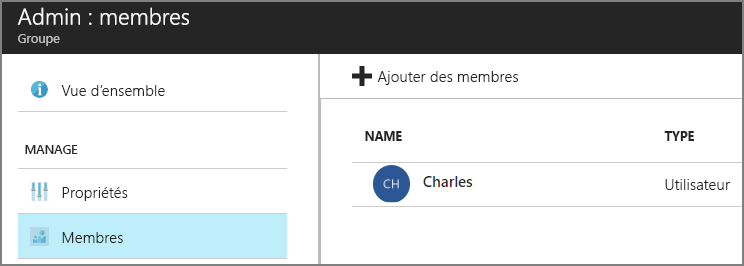

# <a name="application-roles"></a>Rôles d’application

[ Exemple de code][sample application]

Les rôles d’application servent à affecter des autorisations aux utilisateurs. Par exemple, l’application [Tailspin Surveys][Tailspin] définit les rôles suivants :

* Administrateur. Peut effectuer toutes les opérations CRUD sur toute enquête appartenant à ce locataire.
* Créateur. Peut créer des enquêtes.
* Lecteur. Peut consulter les enquêtes appartenant à ce client.

Vous pouvez voir que les rôles sont convertis en permissions, lors de l’ [autorisation]. Mais la première question concerne l’affectation et la gestion des rôles. Nous avons identifié trois principales possibilités :

* [Rôles d’application Azure AD](#roles-using-azure-ad-app-roles)
* [Groupes de sécurité Azure AD](#roles-using-azure-ad-security-groups)
* [Gestionnaire de rôles d’application](#roles-using-an-application-role-manager)

## <a name="roles-using-azure-ad-app-roles"></a>Rôles utilisant des rôles d’application Azure AD
Cette approche est celle que nous avons utilisée dans l’application Tailspin Surveys.

Dans celle-ci, le fournisseur SaaS définit les rôles d’application en les ajoutant au manifeste de l’application. Lorsqu’un client se connecte, un administrateur de l’annuaire Active Directory du client affecte les utilisateurs aux rôles. Lorsqu’un utilisateur se connecte, les rôles qui lui sont affectés sont envoyés en tant que revendications.

> [!NOTE]
> Si le client a Azure AD Premium, l’administrateur peut affecter un groupe de sécurité à un rôle, les membres de ce groupe héritant du rôle d’application concerné. C’est une solution pratique pour gérer des rôles, car le propriétaire du groupe n’a pas besoin d’être administrateur AD.
> 
> 

Avantages de cette approche :

* Modèle de programmation simple.
* Rôles propres à l’application. Les revendications de rôle d’une application ne sont pas envoyées à une autre application.
* Si le client supprime l’application à partir de son client AD, les rôles disparaissent.
* L’application n’a pas besoin d’autorisations Active Directory supplémentaires, autres que la lecture du profil de l’utilisateur.

Inconvénients :

* Les clients n’ayant pas Azure AD Premium ne peuvent pas attribuer de groupes de sécurité aux rôles. Pour ces clients, toutes les affectations d’utilisateur doivent être effectuées par un administrateur AD.
* Si vous avez une API web principale, distincte de l’application web, les attributions de rôle de l’application web ne s’appliquent à l’API web. Pour plus d’informations sur ce point, consultez la page [Sécurisation d’une API web principale].

### <a name="implementation"></a>Implémentation
**Définissez les rôles.** Le fournisseur SaaS déclare les rôles d’application dans le [manifeste de l’application]. Par exemple, voici l’entrée du manifeste de l’application Surveys :

```
"appRoles": [
  {
    "allowedMemberTypes": [
      "User"
    ],
    "description": "Creators can create Surveys",
    "displayName": "SurveyCreator",
    "id": "1b4f816e-5eaf-48b9-8613-7923830595ad",
    "isEnabled": true,
    "value": "SurveyCreator"
  },
  {
    "allowedMemberTypes": [
      "User"
    ],
    "description": "Administrators can manage the Surveys in their tenant",
    "displayName": "SurveyAdmin",
    "id": "c20e145e-5459-4a6c-a074-b942bbd4cfe1",
    "isEnabled": true,
    "value": "SurveyAdmin"
  }
],
```

La propriété `value` apparaît dans la revendication de rôle. La propriété `id` est l’identificateur unique du rôle défini. Générez toujours une nouvelle valeur GUID pour `id`.

**Affectez les utilisateurs**. Lorsqu’un nouveau client se connecte, l’application est enregistrée dans le client AD du client. À ce stade, un administrateur AD de ce client peut affecter des utilisateurs aux rôles.

> [!NOTE]
> Comme nous l’avons déjà vu, les clients n’ayant pas Azure AD Premium ne peuvent pas attribuer de groupes de sécurité aux rôles.
> 
> 

La capture d’écran du portail Azure suivante montre les utilisateurs et groupes de l’application Surveys. Admin et Creator sont des groupes, assignés aux rôles SurveyAdmin et SurveyCreator, respectivement. Alice est un utilisateur qui a été assigné directement au rôle SurveyAdmin. Bob et Charles sont des utilisateurs qui n’ont pas été directement assignés à un rôle.


Comme indiqué dans la capture d’écran suivante, Charles fait partie du groupe Admin ; il hérite donc du rôle SurveyAdmin. Bob, quant à lui, n’a pas encore été assigné à un rôle.




> [!NOTE]
> L’application peut également assigner des rôles par programme à l’aide de l’API Graph Azure AD. Toutefois, pour cela, l’application doit obtenir des autorisations d’écriture dans le répertoire AD du client. Une application avec ces autorisations pourrait faire beaucoup de dégâts &mdash; le client fait confiance à l’application pour qu’elle n’endommage pas son répertoire. De nombreux clients pourraient refuser d’accorder ce niveau d’accès.
> 

**Obtenez des revendications de rôle**. Lorsqu’un utilisateur se connecte, l’application reçoit le ou les rôles de celui-ci dans une revendication avec le type `http://schemas.microsoft.com/ws/2008/06/identity/claims/role`.  

Un utilisateur peut avoir zéro, un ou plusieurs rôles. Dans votre code d’autorisation, ne supposez pas que l’utilisateur n’a qu’une revendication de rôle. Rédigez plutôt un code qui vérifie si une valeur de revendication spécifique est présente :

```csharp
if (context.User.HasClaim(ClaimTypes.Role, "Admin")) { ... }
```

## <a name="roles-using-azure-ad-security-groups"></a>Rôles utilisant les groupes de sécurité Azure AD
Dans cette approche, les rôles sont représentés comme des groupes de sécurité AD. L’application affecte des autorisations aux utilisateurs en fonction de leur appartenance à des groupes de sécurité.

Avantages :

* Pour les clients qui n’ont pas Azure AD Premium, cette approche permet de gérer les affectations de rôle à l’aide de groupes de sécurité.

Inconvénients :

* Complexité. Étant donné que chaque client envoie différentes revendications de groupe, l’application doit suivre des groupes de sécurité correspondant aux rôles d’application, pour chaque client.
* Si le client supprime l’application de son client AD, les groupes de sécurité sont conservés dans son annuaire AD.

### <a name="implementation"></a>Implémentation
Dans le manifeste de l’application, attribuez à la propriété `groupMembershipClaims` la valeur « SecurityGroup ». Cette opération est nécessaire pour obtenir les revendications d’appartenance au groupe à partir d’AAD.

```
{
   // ...
   "groupMembershipClaims": "SecurityGroup",
}
```

Lorsqu’un nouveau client se connecte, l’application lui demande de créer des groupes de sécurité pour les rôles nécessaires à l’application. Il doit ensuite entrer les ID d’objet de groupe dans l’application. L’application les enregistre dans une table qui mappe ces ID de groupe aux rôles d’application, par client.

> [!NOTE]
> Autre possibilité, l’application pourrait créer les groupes par programme à l’aide de l’API Azure AD Graph.  Cette méthode est moins sujette aux erreurs. Toutefois, pour cela, l’application doit obtenir des autorisations de lecture et d’écriture sur tous les groupes dans le répertoire AD du client. De nombreux clients pourraient refuser d’accorder ce niveau d’accès.
> 
> 

Lorsqu’un utilisateur se connecte :

1. L’application reçoit les groupes de l’utilisateur sous la forme de revendications. La valeur de chaque revendication est l’ID d’objet d’un groupe.
2. Azure AD limite le nombre de groupes envoyés dans le jeton. Si le nombre de groupes dépasse cette limite, Azure AD envoie une revendication spéciale de « dépassement ». Si cette revendication est présente, l’application doit interroger l’API Azure AD Graph pour obtenir tous les groupes auxquels appartient cet utilisateur. Pour plus d’informations, consultez [Authorization in Cloud Applications using AD Groups] (Autorisation dans les applications cloud à l’aide de groupes AD), sous la section intitulée « Groups claim overage » (Dépassement de revendications de groupes).
3. L’application consulte les ID d’objet dans sa propre base de données, pour trouver les rôles d’application correspondants à affecter à l’utilisateur.
4. L’application ajoute une valeur de revendication personnalisée à l’utilisateur principal qui exprime le rôle d’application. Par exemple : `survey_role` = "SurveyAdmin".

Les stratégies d’autorisation doivent utiliser la revendication de rôle personnalisée, pas la revendication de groupe.

## <a name="roles-using-an-application-role-manager"></a>Rôles utilisant un gestionnaire de rôles d’application
Dans cette approche, les rôles d’application ne sont pas stockés dans Azure AD. Au lieu de cela, l’application stocke les assignations de rôle pour chaque utilisateur dans sa propre base de données &mdash; par exemple, à l’aide de la classe **RoleManager** dans ASP.NET Identity.

Avantages :

* L’application a un contrôle total sur les rôles et les affectations d’utilisateur.

Inconvénients :

* Complexité et gestion plus difficile.
* Impossible d’utiliser des groupes de sécurité AD pour gérer les affectations de rôle.
* Stockage des informations utilisateur dans la base de données de l’application, où elles peuvent se désynchroniser de l’annuaire AD du client lors de l’ajout ou de la suppression d’utilisateurs.   


[**Suivant**][autorisation]

<!-- Links -->
[Tailspin]: tailspin.md

[autorisation]: authorize.md
[Sécurisation d’une API web principale]: web-api.md
[manifeste de l’application]: /azure/active-directory/active-directory-application-manifest/
[sample application]: https://github.com/mspnp/multitenant-saas-guidance
