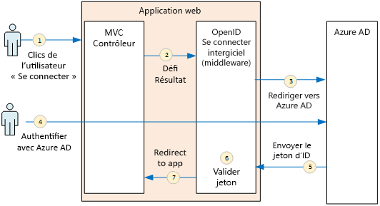
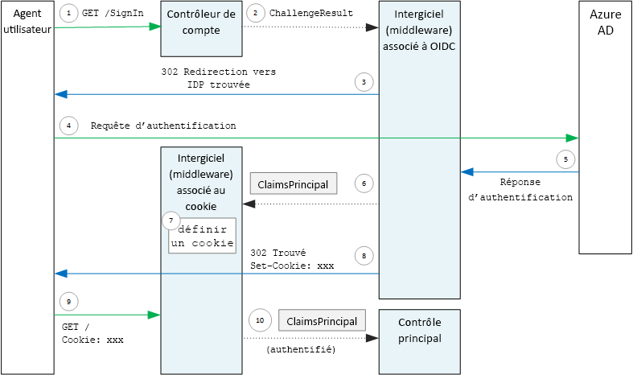

# <a name="authenticate-using-azure-ad-and-openid-connect"></a>S’authentifier avec Azure AD et OpenID Connect

[ Exemple de code][sample application]

L’application Surveys utilise le protocole OpenID Connect (OIDC) pour authentifier les utilisateurs auprès d’Azure Active Directory (Azure AD). L’application Surveys utilise ASP.NET Core, qui intègre un intergiciel (middleware) pour OIDC. Le schéma suivant illustre globalement la succession d’événements consécutifs à une connexion de l’utilisateur.



1. L’utilisateur clique sur le bouton de connexion dans l’application. Cette action est gérée par un contrôleur MVC.
2. Le contrôleur MVC renvoie une action **ChallengeResult** .
3. Le middleware intercepte la **ChallengeResult** et génère une réponse 302 qui redirige l’utilisateur vers la page de connexion d’Azure AD.
4. L’utilisateur s’authentifie auprès d’Azure AD.
5. Azure AD envoie un jeton d’ID à l’application.
6. Le middleware valide le jeton d’ID. À ce stade, l’utilisateur est maintenant authentifié au sein de l’application.
7. Le middleware redirige l’utilisateur vers l’application.

## <a name="register-the-app-with-azure-ad"></a>Inscrire l’application auprès d’Azure AD
Pour activer OpenID Connect, le fournisseur SaaS inscrit l’application à l’intérieur de son propre client Azure AD.

Pour inscrire l’application, suivez les étapes de l’article [Intégration d’applications dans Azure Active Directory](/azure/active-directory/active-directory-integrating-applications/), dans la section [Ajout d’une application](/azure/active-directory/active-directory-integrating-applications/#adding-an-application).

Consultez [Exécuter l’application Surveys](./run-the-app.md) pour découvrir les étapes spécifiques de l’application Surveys. Notez les points suivants :

- Pour une application multilocataire, vous devez configurer explicitement l’option multilocataire. Cela permet à d’autres organisations d’accéder à l’application.

- L’URL de réponse est l’URL à laquelle Azure AD doit envoyer les réponses OAuth 2.0. Quand ASP.NET Core est utilisé, elle doit correspondre au chemin que vous configurez dans le middleware d’authentification (consultez la section suivante), 

## <a name="configure-the-auth-middleware"></a>Configurer le middleware d’authentification
Cette section explique comment configurer le middleware d’authentification dans ASP.NET Core pour une authentification multilocataire avec OpenID Connect.

Dans votre [classe de démarrage](/aspnet/core/fundamentals/startup), ajoutez le middleware OpenID Connect :

```csharp
app.UseOpenIdConnectAuthentication(new OpenIdConnectOptions {
    ClientId = configOptions.AzureAd.ClientId,
    ClientSecret = configOptions.AzureAd.ClientSecret, // for code flow
    Authority = Constants.AuthEndpointPrefix,
    ResponseType = OpenIdConnectResponseType.CodeIdToken,
    PostLogoutRedirectUri = configOptions.AzureAd.PostLogoutRedirectUri,
    SignInScheme = CookieAuthenticationDefaults.AuthenticationScheme,
    TokenValidationParameters = new TokenValidationParameters { ValidateIssuer = false },
    Events = new SurveyAuthenticationEvents(configOptions.AzureAd, loggerFactory),
});
```

Notez que certains paramètres sont tirés des options de configuration du runtime. Les options du middleware ont la signification suivante :

* **ClientId**. ID client de l’application que vous avez obtenu lors de l’inscription de l’application dans Azure AD.
* **Authority**. Pour une application mutualisée, définissez ce paramètre sur `https://login.microsoftonline.com/common/`. Il s’agit de l’URL du point de terminaison commun d’Azure AD, qui permet aux utilisateurs de n’importe quel client Azure AD de se connecter. Pour plus d’informations sur le point de terminaison commun, consultez [ce billet de blog](https://www.cloudidentity.com/blog/2014/08/26/the-common-endpoint-walks-like-a-tenant-talks-like-a-tenant-but-is-not-a-tenant/).
* Dans **TokenValidationParameters**, définissez **ValidateIssuer** avec la valeur false. Cela signifie que l’application sera chargée de valider la valeur de l’émetteur dans le jeton d’ID. (Le middleware continue de valider le jeton proprement dit.) Pour plus d’informations sur la validation de l’émetteur, consultez [Validation de l’émetteur](claims.md#issuer-validation).
* **PostLogoutRedirectUri**. Spécifiez une URL de redirection des utilisateurs après leur déconnexion. Il doit s’agir d’une page qui autorise les demandes anonymes (en règle générale, la page d’accueil).
* **SignInScheme**. Définissez cette propriété sur `CookieAuthenticationDefaults.AuthenticationScheme`. Ce paramètre signifie qu’une fois que l’utilisateur est authentifié, les revendications d’utilisateur sont stockées localement dans un cookie. Ce cookie représente la façon dont l’utilisateur reste connecté pendant la session de navigateur.
* **Événements :** Rappels d’événement ; consultez la rubrique [Événements d’authentification](#authentication-events).

Ajoutez également le middleware Cookie Authentification au pipeline. Ce middleware est chargé d’écrire les revendications d’utilisateur sur un cookie et de lire ensuite le cookie au cours des prochains chargements de la page.

```csharp
app.UseCookieAuthentication(new CookieAuthenticationOptions {
    AutomaticAuthenticate = true,
    AutomaticChallenge = true,
    AccessDeniedPath = "/Home/Forbidden",
    CookieSecure = CookieSecurePolicy.Always,

    // The default setting for cookie expiration is 14 days. SlidingExpiration is set to true by default
    ExpireTimeSpan = TimeSpan.FromHours(1),
    SlidingExpiration = true
});
```

## <a name="initiate-the-authentication-flow"></a>Initier le flux d’authentification
Pour démarrer le flux d’authentification dans ASP.NET MVC, vous devez renvoyer un **ChallengeResult** à partir du contrôleur :

```csharp
[AllowAnonymous]
public IActionResult SignIn()
{
    return new ChallengeResult(
        OpenIdConnectDefaults.AuthenticationScheme,
        new AuthenticationProperties
        {
            IsPersistent = true,
            RedirectUri = Url.Action("SignInCallback", "Account")
        });
}
```

Le middleware renvoie alors une réponse 302 (trouvé) qui redirige vers le point de terminaison de l’authentification.

## <a name="user-login-sessions"></a>Sessions d’ouverture de session utilisateur
Comme nous l’avons indiqué plus haut, lors de la première connexion de l’utilisateur, le middleware Cookie Authentication écrit les revendications d’utilisateur dans un cookie. Les requêtes HTTP sont ensuite authentifiées grâce à la lecture du cookie.

Par défaut, le middleware de cookie écrit un [cookie de session][session-cookie], qui est supprimé une fois que l’utilisateur ferme le navigateur. À sa prochaine visite, l’utilisateur devra donc de nouveau se connecter. Cependant, si vous définissez **IsPersistent** avec la valeur true dans **ChallengeResult**, le middleware écrit un cookie persistant, si bien que l’utilisateur reste connecté après la fermeture du navigateur. Vous pouvez configurer l’expiration du cookie ; consultez [Contrôler les options du cookie][cookie-options]. Les cookies persistants sont plus pratiques pour l’utilisateur, mais ils peuvent être inadaptés à certaines applications (par exemple, les applications bancaires) pour lesquelles il est souhaitable de demander à l’utilisateur de se connecter à chaque fois.

## <a name="about-the-openid-connect-middleware"></a>À propos du middleware OpenID Connect
Le middleware OpenID Connect dans ASP.NET masque la plupart des détails du protocole. Cette section contient des remarques relatives à l’implémentation qui peuvent vous aider à comprendre le flux du protocole.

Commençons par examiner le flux d’authentification du point de vue d’ASP.NET (en ignorant les détails du flux de protocole OIDC entre l’application et Azure AD). Le schéma qui suit présente ce processus.



Dans ce schéma, deux contrôleurs MVC sont référencés. Le contrôleur de compte gère les demandes de connexion et le contrôleur d’accueil fournit la page d’accueil.

Voici comment se déroule le processus d’authentification :

1. L’utilisateur clique sur le bouton de connexion et le navigateur envoie une demande GET. Par exemple : `GET /Account/SignIn/`.
2. Le contrôleur de compte renvoie un `ChallengeResult`.
3. Le middleware OIDC renvoie une réponse HTTP 302 qui redirige l’utilisateur vers Azure AD.
4. Le navigateur envoie la demande d’authentification à Azure AD.
5. L’utilisateur se connecte à Azure AD, qui à son tour renvoie une réponse d’authentification.
6. Le middleware OIDC crée une entité de revendications et la transmet au middleware Cookie Authentication.
7. Ce middleware sérialise l’entité de revendications et définit un cookie.
8. Le middleware OIDC force une redirection vers l’URL de rappel de l’application.
9. Le navigateur suit la redirection en envoyant le cookie dans la demande.
10. Le middleware de cookie désérialise le cookie dans une entité de revendications et définit le paramètre `HttpContext.User` sur une valeur correspondant à l’entité de revendications. La demande est acheminée vers un contrôleur MVC.

### <a name="authentication-ticket"></a>Ticket d’authentification
Si l’authentification réussit, le middleware OIDC crée un ticket d’authentification, qui contient une entité de revendications regroupant les revendications de l’utilisateur. Vous pouvez accéder au ticket dans l’événement **AuthenticationValidated** ou **TicketReceived**.

> [!NOTE]
> Tant que le flux d’authentification n’est pas entièrement terminé, `HttpContext.User` contient toujours un principal anonyme, et **non** l’utilisateur authentifié. L’entité anonyme comporte un ensemble de revendications vide. Une fois l’authentification effectuée et l’utilisateur redirigé par l’application, le middleware cookie désérialise le cookie d’authentification et définit le paramètre `HttpContext.User` sur une entité de revendications représentant l’utilisateur authentifié.
> 
> 

### <a name="authentication-events"></a>Événements d’authentification
Pendant le processus d’authentification, le middleware OpenID Connect déclenche une série d’événements :

* **RedirectToIdentityProvider**. Appelé juste avant que le middleware ne redirige vers le point de terminaison de l’authentification. Vous pouvez utiliser cet événement pour modifier l’URL de redirection (par exemple, pour ajouter des paramètres de requête). Pour un exemple, consultez [Ajout de l’invite de consentement administrateur](signup.md#adding-the-admin-consent-prompt).
* **AuthorizationCodeReceived**. Appelé avec le code d’autorisation.
* **TokenResponseReceived**. Appelé après que le middleware obtient un jeton d’accès auprès du fournisseur d’identité, mais avant qu’il soit validé. S’applique uniquement au flux de code d’autorisation.
* **TokenValidated**. Appelé après validation du jeton d’ID par le middleware. À ce stade, l’application comporte un ensemble de revendications validées concernant l’utilisateur. Vous pouvez utiliser cet événement pour effectuer une validation supplémentaire sur les revendications, ou pour transformer les revendications. Consultez [Utilisation des revendications](claims.md).
* **UserInformationReceived**. Appelé si le middleware obtient le profil utilisateur à partir du point de terminaison des informations utilisateur. S’applique uniquement au flux de code d’autorisation et uniquement lorsque `GetClaimsFromUserInfoEndpoint = true` dans les options du middleware.
* **TicketReceived**. Appelé lorsque l’authentification est effectuée. Il s’agit du dernier événement, en supposant que l’authentification aboutisse. Une fois cet événement traité, l’utilisateur est connecté à l’application.
* **AuthenticationFailed**. Appelé en cas d’échec de l’authentification. Utilisez cet événement pour gérer les échecs d’authentification (par exemple, en le redirigeant vers une page d’erreur).

Pour fournir des rappels pour ces événements, définissez l’option **Events** sur le middleware. Il existe deux différentes manières de déclarer les gestionnaires d’événements : à la volée dans les expressions lambda, ou dans une classe dérivée de **OpenIdConnectEvents**. La deuxième approche est recommandée si vos rappels d’événement ont une logique substantielle, afin qu’ils ne viennent pas alourdir votre classe de démarrage. Notre implémentation de référence utilise cette approche.

### <a name="openid-connect-endpoints"></a>Points de terminaison OpenID Connect
Azure AD prend en charge la [découverte OpenID Connect](https://openid.net/specs/openid-connect-discovery-1_0.html), dans laquelle le fournisseur d’identité (IDP) retourne un document de métadonnées JSON à partir d’un [point de terminaison bien connu](https://openid.net/specs/openid-connect-discovery-1_0.html#ProviderConfig). Le document de métadonnées contient des informations telles que :

* L’URL du point de terminaison d’autorisation. Il s’agit du point de redirection de l’application pour l’authentification de l’utilisateur.
* L’URL du point de terminaison de « fin de session », où l’application se rend pour déconnecter l’utilisateur.
* L’URL permettant d’obtenir les clés de signature utilisées par le client pour valider les jetons OIDC obtenus à partir du fournisseur d’identité.

Par défaut, le middleware OIDC sait comment récupérer ces métadonnées. Définissez l’option **Authority** du middleware pour permettre à celui-ci de construire l’URL des métadonnées. (Vous pouvez remplacer l’URL des métadonnées en définissant l’option **MetadataAddress**.)

### <a name="openid-connect-flows"></a>Flux OpenID Connect
Par défaut, le middleware OIDC utilise un flux hybride avec un mode de réponse POST de type formulaire.

* *Flux hybride* signifie que le client peut obtenir un jeton d’ID et un code d’autorisation dans le même aller-retour vers le serveur d’autorisation.
* *Mode de réponse POST de type formulaire* signifie que le serveur d’autorisation utilise une requête HTTP POST pour envoyer le jeton d’ID et le code d’autorisation à l’application. Les valeurs utilisent la méthode form-urlencode (type de contenu = "application/x-www-form-urlencoded").

Lorsque le middleware OIDC redirige vers le point de terminaison d’autorisation, l’URL de redirection inclut tous les paramètres de chaîne de requête requis par OIDC. Pour un flux hybride :

* client_id. Cette valeur est définie dans l’option **ClientId**
* scope = "openid profile", ce qui signifie qu’il s’agit bien de la requête OIDC et que nous voulons le profil de l’utilisateur.
* response_type  = "code id_token". Spécifie le flux hybride.
* response_mode = "form_post". Spécifie la réponse POST du formulaire.

Pour spécifier un autre flux, définissez la propriété **ResponseType** sur les options. Par exemple : 

```csharp
app.UseOpenIdConnectAuthentication(options =>
{
    options.ResponseType = "code"; // Authorization code flow

    // Other options
}
```

[**Suivant**][claims]

[claims]: claims.md
[cookie-options]: /aspnet/core/security/authentication/cookie#controlling-cookie-options
[session-cookie]: https://en.wikipedia.org/wiki/HTTP_cookie#Session_cookie
[sample application]: https://github.com/mspnp/multitenant-saas-guidance
