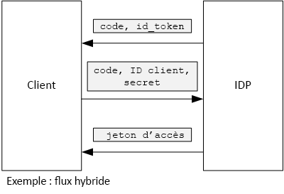

# <a name="use-client-assertion-to-get-access-tokens-from-azure-ad"></a><span data-ttu-id="fb0a6-103">Utiliser une assertion du client pour obtenir des jetons d’accès d’Azure AD</span><span class="sxs-lookup"><span data-stu-id="fb0a6-103">Use client assertion to get access tokens from Azure AD</span></span>

<span data-ttu-id="fb0a6-104">[ Exemple de code][sample application]</span><span class="sxs-lookup"><span data-stu-id="fb0a6-104">[ Sample code][sample application]</span></span>

## <a name="background"></a><span data-ttu-id="fb0a6-105">Arrière-plan</span><span class="sxs-lookup"><span data-stu-id="fb0a6-105">Background</span></span>

<span data-ttu-id="fb0a6-106">Lors de l’utilisation d’un flux de code d’autorisation ou d’un flux hybride dans OpenID Connect, le client reçoit un jeton d’accès en échange d’un code d’autorisation.</span><span class="sxs-lookup"><span data-stu-id="fb0a6-106">When using authorization code flow or hybrid flow in OpenID Connect, the client exchanges an authorization code for an access token.</span></span> <span data-ttu-id="fb0a6-107">Au cours de cette étape, le client doit s’authentifier auprès du serveur.</span><span class="sxs-lookup"><span data-stu-id="fb0a6-107">During this step, the client has to authenticate itself to the server.</span></span>



<span data-ttu-id="fb0a6-109">L’un des moyens d’authentifier le client consiste à utiliser une clé secrète client.</span><span class="sxs-lookup"><span data-stu-id="fb0a6-109">One way to authenticate the client is by using a client secret.</span></span> <span data-ttu-id="fb0a6-110">Voici comment l’application [Tailspin Surveys][Surveys] est configurée par défaut.</span><span class="sxs-lookup"><span data-stu-id="fb0a6-110">That's how the [Tailspin Surveys][Surveys] application is configured by default.</span></span>

<span data-ttu-id="fb0a6-111">Voici un exemple de requête du client au fournisseur d’identité, demandant un jeton d’accès.</span><span class="sxs-lookup"><span data-stu-id="fb0a6-111">Here is an example request from the client to the IDP, requesting an access token.</span></span> <span data-ttu-id="fb0a6-112">Notez le paramètre `client_secret` .</span><span class="sxs-lookup"><span data-stu-id="fb0a6-112">Note the `client_secret` parameter.</span></span>

```http
POST https://login.microsoftonline.com/b9bd2162xxx/oauth2/token HTTP/1.1
Content-Type: application/x-www-form-urlencoded

resource=https://tailspin.onmicrosoft.com/surveys.webapi
  &client_id=87df91dc-63de-4765-8701-b59cc8bd9e11
  &client_secret=i3Bf12Dn...
  &grant_type=authorization_code
  &code=PG8wJG6Y...
```

<span data-ttu-id="fb0a6-113">La clé secrète n’est qu’une simple chaîne. Veillez donc à ne pas communiquer sa valeur.</span><span class="sxs-lookup"><span data-stu-id="fb0a6-113">The secret is just a string, so you have to make sure not to leak the value.</span></span> <span data-ttu-id="fb0a6-114">La meilleure pratique consiste à conserver la clé secrète client en dehors du contrôle de code source.</span><span class="sxs-lookup"><span data-stu-id="fb0a6-114">The best practice is to keep the client secret out of source control.</span></span> <span data-ttu-id="fb0a6-115">Lorsque vous déployez un élément dans Azure, stockez la clé secrète dans un [paramètre d’application][configure-web-app].</span><span class="sxs-lookup"><span data-stu-id="fb0a6-115">When you deploy to Azure, store the secret in an [app setting][configure-web-app].</span></span>

<span data-ttu-id="fb0a6-116">Toutefois, toute personne ayant accès à l’abonnement Azure peut afficher les paramètres d’application.</span><span class="sxs-lookup"><span data-stu-id="fb0a6-116">However, anyone with access to the Azure subscription can view the app settings.</span></span> <span data-ttu-id="fb0a6-117">De plus, il est toujours tentant de vérifier les clés secrètes dans le contrôle de code source (par exemple, dans les scripts de déploiement), de les partager par courrier électronique, etc.</span><span class="sxs-lookup"><span data-stu-id="fb0a6-117">Further, there is always a temptation to check secrets into source control (e.g., in deployment scripts), share them by email, and so on.</span></span>

<span data-ttu-id="fb0a6-118">Pour renforcer la sécurité, vous pouvez utiliser l’ [assertion du client] au lieu d’une clé secrète client.</span><span class="sxs-lookup"><span data-stu-id="fb0a6-118">For additional security, you can use [client assertion] instead of a client secret.</span></span> <span data-ttu-id="fb0a6-119">Avec l’assertion du client, le client utilise un certificat X.509 pour prouver que la demande de jeton provient de lui.</span><span class="sxs-lookup"><span data-stu-id="fb0a6-119">With client assertion, the client uses an X.509 certificate to prove the token request came from the client.</span></span> <span data-ttu-id="fb0a6-120">Le certificat client est installé sur le serveur web.</span><span class="sxs-lookup"><span data-stu-id="fb0a6-120">The client certificate is installed on the web server.</span></span> <span data-ttu-id="fb0a6-121">En général, il est plus facile de restreindre l’accès au certificat que de garantir que personne ne révèle par inadvertance une clé secrète client.</span><span class="sxs-lookup"><span data-stu-id="fb0a6-121">Generally, it will be easier to restrict access to the certificate, than to ensure that nobody inadvertently reveals a client secret.</span></span> <span data-ttu-id="fb0a6-122">Pour en savoir plus sur la configuration de certificats dans une application web, consultez [Using Certificates in Azure Websites Applications][using-certs-in-websites].</span><span class="sxs-lookup"><span data-stu-id="fb0a6-122">For more information about configuring certificates in a web app, see [Using Certificates in Azure Websites Applications][using-certs-in-websites]</span></span>

<span data-ttu-id="fb0a6-123">Voici une requête de jeton utilisant l’assertion du client :</span><span class="sxs-lookup"><span data-stu-id="fb0a6-123">Here is a token request using client assertion:</span></span>

```http
POST https://login.microsoftonline.com/b9bd2162xxx/oauth2/token HTTP/1.1
Content-Type: application/x-www-form-urlencoded

resource=https://tailspin.onmicrosoft.com/surveys.webapi
  &client_id=87df91dc-63de-4765-8701-b59cc8bd9e11
  &client_assertion_type=urn:ietf:params:oauth:client-assertion-type:jwt-bearer
  &client_assertion=eyJhbGci...
  &grant_type=authorization_code
  &code= PG8wJG6Y...
```

<span data-ttu-id="fb0a6-124">Notez que le paramètre `client_secret` n’est plus utilisé.</span><span class="sxs-lookup"><span data-stu-id="fb0a6-124">Notice that the `client_secret` parameter is no longer used.</span></span> <span data-ttu-id="fb0a6-125">À la place, le paramètre `client_assertion` contient un jeton JWT qui a été signé à l’aide du certificat client.</span><span class="sxs-lookup"><span data-stu-id="fb0a6-125">Instead, the `client_assertion` parameter contains a JWT token that was signed using the client certificate.</span></span> <span data-ttu-id="fb0a6-126">Le paramètre `client_assertion_type` spécifie le type d’assertion &mdash; dans ce cas, jeton JWT.</span><span class="sxs-lookup"><span data-stu-id="fb0a6-126">The `client_assertion_type` parameter specifies the type of assertion &mdash; in this case, JWT token.</span></span> <span data-ttu-id="fb0a6-127">Le serveur valide le jeton JWT.</span><span class="sxs-lookup"><span data-stu-id="fb0a6-127">The server validates the JWT token.</span></span> <span data-ttu-id="fb0a6-128">Si le jeton JWT n’est pas valide, la requête de jeton renvoie une erreur.</span><span class="sxs-lookup"><span data-stu-id="fb0a6-128">If the JWT token is invalid, the token request returns an error.</span></span>

> [!NOTE]
> <span data-ttu-id="fb0a6-129">Les certificats X.509 ne représentent pas la seule forme d’assertion du client ; nous en parlons ici car ils sont pris en charge par Azure AD.</span><span class="sxs-lookup"><span data-stu-id="fb0a6-129">X.509 certificates are not the only form of client assertion; we focus on it here because it is supported by Azure AD.</span></span>

<span data-ttu-id="fb0a6-130">Au moment de l’exécution, l’application web lit le certificat à partir du magasin de certificats.</span><span class="sxs-lookup"><span data-stu-id="fb0a6-130">At run time, the web application reads the certificate from the certificate store.</span></span> <span data-ttu-id="fb0a6-131">Le certificat doit être installé sur la même machine que l’application web.</span><span class="sxs-lookup"><span data-stu-id="fb0a6-131">The certificate must be installed on the same machine as the web app.</span></span>

<span data-ttu-id="fb0a6-132">L’application Surveys inclut une classe d’assistance qui crée un certificat [ClientAssertionCertificate](/dotnet/api/microsoft.identitymodel.clients.activedirectory.clientassertioncertificate) que vous pouvez transmettre à la méthode [AuthenticationContext.AcquireTokenSilentAsync](/dotnet/api/microsoft.identitymodel.clients.activedirectory.authenticationcontext.acquiretokensilentasync) pour obtenir un jeton Azure AD.</span><span class="sxs-lookup"><span data-stu-id="fb0a6-132">The Surveys application includes a helper class that creates a [ClientAssertionCertificate](/dotnet/api/microsoft.identitymodel.clients.activedirectory.clientassertioncertificate) that you can pass to the [AuthenticationContext.AcquireTokenSilentAsync](/dotnet/api/microsoft.identitymodel.clients.activedirectory.authenticationcontext.acquiretokensilentasync) method to acquire a token from Azure AD.</span></span>

```csharp
public class CertificateCredentialService : ICredentialService
{
    private Lazy<Task<AdalCredential>> _credential;

    public CertificateCredentialService(IOptions<ConfigurationOptions> options)
    {
        var aadOptions = options.Value?.AzureAd;
        _credential = new Lazy<Task<AdalCredential>>(() =>
        {
            X509Certificate2 cert = CertificateUtility.FindCertificateByThumbprint(
                aadOptions.Asymmetric.StoreName,
                aadOptions.Asymmetric.StoreLocation,
                aadOptions.Asymmetric.CertificateThumbprint,
                aadOptions.Asymmetric.ValidationRequired);
            string password = null;
            var certBytes = CertificateUtility.ExportCertificateWithPrivateKey(cert, out password);
            return Task.FromResult(new AdalCredential(new ClientAssertionCertificate(aadOptions.ClientId, new X509Certificate2(certBytes, password))));
        });
    }

    public async Task<AdalCredential> GetCredentialsAsync()
    {
        return await _credential.Value;
    }
}
```

<span data-ttu-id="fb0a6-133">Pour plus d’informations sur la configuration d’une assertion du client dans l’application Surveys, consultez l’article [Utiliser Azure Key Vault pour protéger les secrets d’application][key vault].</span><span class="sxs-lookup"><span data-stu-id="fb0a6-133">For information about setting up client assertion in the Surveys application, see [Use Azure Key Vault to protect application secrets ][key vault].</span></span>

<span data-ttu-id="fb0a6-134">[**Suivant**][key vault]</span><span class="sxs-lookup"><span data-stu-id="fb0a6-134">[**Next**][key vault]</span></span>

<!-- links -->

[configure-web-app]: /azure/app-service-web/web-sites-configure/
[azure-management-portal]: https://portal.azure.com
[assertion du client]: https://tools.ietf.org/html/rfc7521
[client assertion]: https://tools.ietf.org/html/rfc7521
[key vault]: key-vault.md
[Setup-KeyVault]: https://github.com/mspnp/multitenant-saas-guidance/blob/master/scripts/Setup-KeyVault.ps1
[Surveys]: tailspin.md
[using-certs-in-websites]: https://azure.microsoft.com/blog/using-certificates-in-azure-websites-applications/

[sample application]: https://github.com/mspnp/multitenant-saas-guidance
