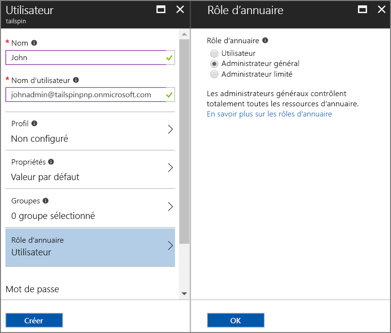
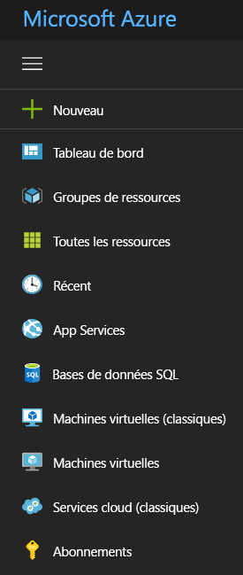

# <a name="use-azure-key-vault-to-protect-application-secrets"></a>Utiliser Azure Key Vault pour protéger les secrets d’application

[ Exemple de code][sample application]

Il est courant que les paramètres d’une application revêtent un caractère sensible et doivent être protégés, par exemple :

* Chaînes de connexion de base de données
* Mot de passe
* Clés de chiffrement

Par sécurité, il est conseillé de ne jamais stocker ces données secrètes dans le contrôle de code source. Elles peuvent fuiter très facilement, même si votre dépôt de code source est privé. De plus, il ne s’agit pas seulement de les préserver d’un accès par le grand public. Sur les projets volumineux, vous souhaiterez peut-être restreindre l’accès aux données de production secrètes à certains développeurs et opérateurs. (Les paramètres sont différents pour les environnements de test et de développement.)

Une option plus sûre consiste à stocker ces secrets dans [Azure Key Vault][KeyVault]. Ce service hébergé dans le cloud assure la gestion des clés de chiffrement et d’autres données secrètes. Cet article explique comment l’utiliser pour stocker les paramètres de configuration de votre application.

Dans l’application [Tailspin Surveys][Surveys], les paramètres suivants sont secrets :

* la chaîne de connexion de base de données ;
* la chaîne de connexion Redis ;
* la clé secrète client de l’application web.

L’application Surveys charge les paramètres de configuration à partir des emplacements suivants :

* le fichier appsettings.json ;
* Le [magasin des secrets utilisateur][user-secrets] (environnement de développement uniquement ; à des fins de test)
* l’environnement d’hébergement (paramètres des applications web Azure) ;
* Le service Key Vault (quand il est activé)

Chacun de ces paramètres se substituant aux précédents, les paramètres stockés dans Key Vault sont prioritaires.

> [!NOTE]
> Par défaut, le fournisseur de configuration du coffre de clés est désactivé. Il n’est pas nécessaire pour exécuter l’application localement. Vous devez l’activer dans un environnement de production.

Au démarrage, l’application lit les paramètres de chaque fournisseur de configuration enregistré et les utilise pour remplir un objet d’options fortement typé. Pour plus d’informations, consultez [Utilisation des options et des objets de configuration][options].

## <a name="setting-up-key-vault-in-the-surveys-app"></a>Configuration du coffre de clés dans l’application Surveys
Configuration requise :

* Installez les [applets de commande Azure Resource Manager][azure-rm-cmdlets].
* Configurez l’application Surveys, comme indiqué dans [Exécuter l’application Surveys][readme].

Procédure générale :

1. Configurez un utilisateur admin dans le client.
2. Configurez un certificat client.
3. Création d’un coffre de clés
4. Ajoutez des paramètres de configuration à votre coffre de clés.
5. Supprimez les marques de commentaire du code qui active le coffre de clés.
6. Mettez à jour les clés secrètes de l’utilisateur de l’application.

### <a name="set-up-an-admin-user"></a>Configuration d’un utilisateur admin
> [!NOTE]
> Pour créer un coffre de clés, vous devez utiliser un compte qui peut gérer votre abonnement Azure. De même, toute application que vous autorisez à lire dans le coffre de clés doit être inscrite dans le même locataire que ce compte.
> 
> 

Dans cette étape, vous allez vous assurer que vous pouvez créer un coffre de clés lorsque vous êtes connecté en tant qu’utilisateur du client où l’application Surveys est inscrite.

Créez un utilisateur administrateur au sein du locataire Azure AD où l’application Surveys est inscrite.

1. Connectez-vous au [portail Azure][azure-portal].
2. Sélectionnez le client Azure AD où votre application est inscrite.
3. Cliquez sur **Autres services** > **SÉCURITÉ + IDENTITÉ** > **Azure Active Directory** > **Utilisateurs et groupes**  > **Tous les utilisateurs**.
4. Dans la partie supérieure du portail, cliquez sur **Nouvel utilisateur**.
5. Complétez les champs et assignez l’utilisateur au rôle d’annuaire **Administrateur général**.
6. Cliquez sur **Créer**.



Assignez maintenant cet utilisateur comme propriétaire d’abonnement.

1. Dans le menu Hub, sélectionnez **Abonnements**.

    

2. Sélectionnez l’abonnement auquel l’administrateur doit accéder.
3. Dans le panneau de l’abonnement, sélectionnez **Contrôle d’accès (IAM)**.
4. Cliquez sur **Add**.
4. Sous **Rôle**, sélectionnez **Propriétaire**.
5. Tapez l’adresse e-mail de l’utilisateur à ajouter comme propriétaire.
6. Sélectionnez l’utilisateur et cliquez sur **Enregistrer**.

### <a name="set-up-a-client-certificate"></a>Configuration d’un certificat client
1. Exécutez le script PowerShell [/Scripts/Setup-KeyVault.ps1][Setup-KeyVault] comme suit :
   
    ```
    .\Setup-KeyVault.ps1 -Subject <<subject>>
    ```
    Pour le paramètre `Subject` , entrez un nom, comme « surveysapp ». Le script génère un certificat auto-signé et le stocke dans le magasin de certificats « Utilisateur actuel/Personnel ». La sortie du script est un fragment JSON. Copiez cette valeur.

2. Dans le [portail Azure][azure-portal], basculez vers le répertoire où est inscrite l’application Surveys en sélectionnant votre compte en haut à droite du portail.

3. Sélectionnez **Azure Active Directory** > **Inscriptions des applications** > Surveys

4.  Cliquez sur **Manifeste**, puis sur **Modifier**.

5.  Collez la sortie du script dans la propriété `keyCredentials` . Le résultat doit être semblable à ce qui suit :
        
    ```json
    "keyCredentials": [
        {
        "type": "AsymmetricX509Cert",
        "usage": "Verify",
        "keyId": "29d4f7db-0539-455e-b708-....",
        "customKeyIdentifier": "ZEPpP/+KJe2fVDBNaPNOTDoJMac=",
        "value": "MIIDAjCCAeqgAwIBAgIQFxeRiU59eL.....
        }
    ],
    ```          

6. Cliquez sur **Enregistrer**.  

7. Répétez les étapes 3 à 6 pour ajouter le même fragment JSON au manifeste d’application de l’API web (Surveys.WebAPI).

8. Dans la fenêtre PowerShell, exécutez la commande suivante pour obtenir l’empreinte numérique du certificat.
   
    ```
    certutil -store -user my [subject]
    ```
    
    Pour `[subject]`, utilisez la valeur que vous avez spécifiée pour Subject dans le script PowerShell. L’empreinte numérique est répertoriée sous « Cert Hash(sha1) ». Copiez cette valeur. Vous utiliserez l’empreinte numérique ultérieurement.

### <a name="create-a-key-vault"></a>Création d’un coffre de clés
1. Exécutez le script PowerShell [/Scripts/Setup-KeyVault.ps1][Setup-KeyVault] comme suit :
   
    ```
    .\Setup-KeyVault.ps1 -KeyVaultName <<key vault name>> -ResourceGroupName <<resource group name>> -Location <<location>>
    ```
   
    Lorsque vous êtes invité à entrer vos informations d’identification, connectez-vous avec les informations de l’utilisateur Azure AD que vous avez créé précédemment. Le script crée un groupe de ressources et un coffre de clés au sein de ce groupe de ressources. 
   
2. Exécutez à nouveau SetupKeyVault.ps comme suit :
   
    ```
    .\Setup-KeyVault.ps1 -KeyVaultName <<key vault name>> -ApplicationIds @("<<Surveys app id>>", "<<Surveys.WebAPI app ID>>")
    ```
   
    Définissez les valeurs des paramètres suivantes :
   
       * key vault name = Le nom que vous avez affecté au coffre de clés à l’étape précédente.
       * Surveys app ID = ID de l’application web Surveys.
       * Surveys.WebApi app ID = ID de l’application Surveys.WebAPI.
         
    Exemple :
     
    ```
     .\Setup-KeyVault.ps1 -KeyVaultName tailspinkv -ApplicationIds @("f84df9d1-91cc-4603-b662-302db51f1031", "8871a4c2-2a23-4650-8b46-0625ff3928a6")
    ```
    
    Ce script autorise l’application web et l’API web à extraire les données secrètes de votre coffre de clés. Pour plus d’informations, consultez [Prise en main du coffre de clés Azure](/azure/key-vault/key-vault-get-started/).

### <a name="add-configuration-settings-to-your-key-vault"></a>Ajout de paramètres de configuration à votre coffre de clés
1. Exécutez SetupKeyVault.ps comme suit :
   
    ```
    .\Setup-KeyVault.ps1 -KeyVaultName <<key vault name> -KeyName Redis--Configuration -KeyValue "<<Redis DNS name>>.redis.cache.windows.net,password=<<Redis access key>>,ssl=true" 
    ```
    where
   
   * key vault name = Le nom que vous avez affecté au coffre de clés à l’étape précédente.
   * Redis DNS name = Le nom DNS de votre instance de cache Redis.
   * Redis access key = la clé d’accès pour votre instance de cache Redis.
     
2. À ce stade, il est judicieux de vérifier si vous avez stocké correctement les clés secrètes dans le coffre de clés. Exécutez la commande PowerShell suivante :
   
    ```
    Get-AzureKeyVaultSecret <<key vault name>> Redis--Configuration | Select-Object *
    ```

3. Réexécutez SetupKeyVault.ps pour ajouter la chaîne de connexion de base de données :
   
    ```
    .\Setup-KeyVault.ps1 -KeyVaultName <<key vault name> -KeyName Data--SurveysConnectionString -KeyValue <<DB connection string>> -ConfigName "Data:SurveysConnectionString"
    ```
   
    où `<<DB connection string>>` est la valeur de la chaîne de connexion de base de données.
   
    Pour effectuer un test avec la base de données locale, copiez la chaîne de connexion à partir du fichier Tailspin.Surveys.Web/appsettings.json. Si vous faites cela, veillez à remplacer la double barre oblique inverse (« \\\\ ») par une simple barre oblique inverse. La double barre oblique inverse est un caractère d’échappement dans le fichier JSON.
   
    Exemple :
   
    ```
    .\Setup-KeyVault.ps1 -KeyVaultName mykeyvault -KeyName Data--SurveysConnectionString -KeyValue "Server=(localdb)\MSSQLLocalDB;Database=Tailspin.SurveysDB;Trusted_Connection=True;MultipleActiveResultSets=true" 
    ```

### <a name="uncomment-the-code-that-enables-key-vault"></a>Suppression des marques de commentaire du code qui active le coffre de clés
1. Ouvrez la solution Tailspin.Surveys.
2. Dans Tailspin.Surveys.Web/Startup.cs, localisez le bloc de code suivant et supprimez les commentaires.
   
    ```csharp
    //var config = builder.Build();
    //builder.AddAzureKeyVault(
    //    $"https://{config["KeyVault:Name"]}.vault.azure.net/",
    //    config["AzureAd:ClientId"],
    //    config["AzureAd:ClientSecret"]);
    ```
3. Dans Tailspin.Surveys.Web/Startup.cs, localisez le code qui inscrit `ICredentialService`. Supprimez les commentaires de la ligne qui utilise `CertificateCredentialService`, puis commentez la ligne qui utilise `ClientCredentialService` :
   
    ```csharp
    // Uncomment this:
    services.AddSingleton<ICredentialService, CertificateCredentialService>();
    // Comment out this:
    //services.AddSingleton<ICredentialService, ClientCredentialService>();
    ```
   
    Cette modification permet à l’application web d’utiliser l’[Assertion de client][client-assertion] pour obtenir des jetons d’accès OAuth. Avec l’assertion de client, vous n’avez pas besoin de secret client OAuth. Vous pouvez aussi stocker le secret client dans le coffre de clés. Cependant, le coffre de clés et l’assertion de client utilisent tous deux un certificat client. Donc, si vous activez le coffre de clés, il est recommandé d’activer aussi l’assertion de client.

### <a name="update-the-user-secrets"></a>Mise à jour des données secrètes de l’utilisateur
Dans l’Explorateur de solutions, cliquez avec le bouton droit sur le projet Tailspin.Surveys.Web, puis sélectionnez **Gérer les données secrètes de l’utilisateur**. Dans le fichier secrets.json, supprimez le script JSON existant et collez les éléments suivants :

    ```
    {
      "AzureAd": {
        "ClientId": "[Surveys web app client ID]",
        "ClientSecret": "[Surveys web app client secret]",
        "PostLogoutRedirectUri": "https://localhost:44300/",
        "WebApiResourceId": "[App ID URI of your Surveys.WebAPI application]",
        "Asymmetric": {
          "CertificateThumbprint": "[certificate thumbprint. Example: 105b2ff3bc842c53582661716db1b7cdc6b43ec9]",
          "StoreName": "My",
          "StoreLocation": "CurrentUser",
          "ValidationRequired": "false"
        }
      },
      "KeyVault": {
        "Name": "[key vault name]"
      }
    }
    ```

Remplacez les entrées entre [crochets] par les valeurs correctes.

* `AzureAd:ClientId`: L’ID client de l’application Surveys.
* `AzureAd:ClientSecret` : clé que vous avez générée au moment d’inscrire l’application Surveys dans Azure AD.
* `AzureAd:WebApiResourceId`: L’URI ID d’application que vous avez spécifié lorsque vous avez créé l’application Surveys.WebAPI dans Azure AD.
* `Asymmetric:CertificateThumbprint`: L’empreinte numérique de certificat que vous avez obtenue précédemment, lorsque vous avez créé le certificat client.
* `KeyVault:Name`: Le nom de votre coffre de clés.

> [!NOTE]
> `Asymmetric:ValidationRequired` a la valeur false, car le certificat que vous avez créé précédemment n’a pas été signé par une autorité de certification racine. En production, utilisez un certificat signé par une autorité de certification racine, puis affectez à `ValidationRequired` la valeur true.
> 
> 

Enregistrez le fichier secrets.json mis à jour.

Dans l’Explorateur de solutions, cliquez avec le bouton droit sur le projet Tailspin.Surveys.WebApi, puis sélectionnez **Gérer les données secrètes de l’utilisateur**. Supprimez le script JSON existant et collez les éléments suivants :

```
{
  "AzureAd": {
    "ClientId": "[Surveys.WebAPI client ID]",
    "WebApiResourceId": "https://tailspin5.onmicrosoft.com/surveys.webapi",
    "Asymmetric": {
      "CertificateThumbprint": "[certificate thumbprint]",
      "StoreName": "My",
      "StoreLocation": "CurrentUser",
      "ValidationRequired": "false"
    }
  },
  "KeyVault": {
    "Name": "[key vault name]"
  }
}
```

Remplacez les entrées entre [crochets] et enregistrez le fichier secrets.json.

> [!NOTE]
> Pour l’API web, veillez à utiliser l’ID client de l’application Surveys.WebAPI et non de l’application Surveys.
> 
> 

[**Suivant**][adfs]

<!-- Links -->
[adfs]: ./adfs.md
[authorize-app]: /azure/key-vault/key-vault-get-started//#authorize
[azure-portal]: https://portal.azure.com
[azure-rm-cmdlets]: https://msdn.microsoft.com/library/mt125356.aspx
[client-assertion]: client-assertion.md
[configuration]: /aspnet/core/fundamentals/configuration
[KeyVault]: https://azure.microsoft.com/services/key-vault/
[key-tags]: https://msdn.microsoft.com/library/azure/dn903623.aspx#BKMK_Keytags
[Microsoft.Azure.KeyVault]: https://www.nuget.org/packages/Microsoft.Azure.KeyVault/
[options]: /aspnet/core/fundamentals/configuration#using-options-and-configuration-objects
[readme]: ./run-the-app.md
[Setup-KeyVault]: https://github.com/mspnp/multitenant-saas-guidance/blob/master/scripts/Setup-KeyVault.ps1
[Surveys]: tailspin.md
[user-secrets]: http://go.microsoft.com/fwlink/?LinkID=532709
[sample application]: https://github.com/mspnp/multitenant-saas-guidance
