# <a name="run-the-surveys-application"></a>Exécution de l’application Surveys

Cet article décrit comment exécuter l’application [Tailspin Surveys](./tailspin.md) localement, à partir de Visual Studio. Ces étapes ne permettent pas de déployer l’application sur Azure. Toutefois, vous devez créer des ressources Azure &mdash; un annuaire Azure Active Directory (Azure AD) et un cache Redis.

Voici un résumé des étapes :

1. Créez un annuaire Azure AD (locataire) pour la société fictive Tailspin.
2. Inscrivez l’application Surveys et l’API web principale auprès d’Azure AD.
3. Créez une instance de cache Redis Azure.
4. Configurez les paramètres d’application et créez une base de données locale.
5. Exécutez l’application et inscrivez un nouveau locataire.
6. Ajoutez des rôles d’application aux utilisateurs.

## <a name="prerequisites"></a>Composants requis
-   [Visual Studio 2017][VS2017]
-   Compte [Microsoft Azure](https://azure.microsoft.com)

## <a name="create-the-tailspin-tenant"></a>Créer le locataire Tailspin

Tailspin est la société fictive qui héberge l’application Surveys. Tailspin utilise Azure AD pour permettre à d’autres locataires de s’inscrire auprès de l’application. Ces clients peuvent utiliser ensuite leurs informations d’identification Azure AD pour se connecter à l’application.

À cette étape, vous allez créer un annuaire Azure AD pour Tailspin.

1. Connectez-vous au [portail Azure][portal].

2. Cliquez sur **Nouveau** > **Sécurité + Identité** > **Azure Active Directory**.

3. Entrez `Tailspin` comme nom d’organisation et saisissez un nom de domaine. Le nom de domaine a le format `xxxx.onmicrosoft.com` et doit être globalement unique. 

    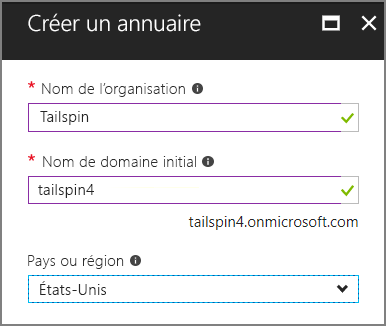

4. Cliquez sur **Créer**. La création de l’annuaire peut prendre plusieurs minutes.

Pour réaliser le scénario de bout en bout, vous aurez besoin d’un second annuaire Azure AD pour représenter un client s’inscrit à l’application. Vous pouvez utiliser votre annuaire Azure AD par défaut (pas Tailspin) ou créer un autre annuaire à cet effet. Dans les exemples, nous utilisons Contoso en tant que client fictif.

## <a name="register-the-surveys-web-api"></a>Inscrire l’API web Surveys 

1. Dans le [portail Azure][portal], basculez vers le nouvel l’annuaire Tailspin en sélectionnant votre compte dans l’angle supérieur droit du portail.

2. Sélectionnez **Azure Active Directory** dans le volet de navigation gauche. 

3. Cliquez sur **Inscription d’applications** > **Nouvelle inscription d’application**.

4.  Dans le panneau **Créer**, entrez les informations suivantes :

  - **Nom** : `Surveys.WebAPI`

  - **Type d’application** : `Web app / API`

  - **URL d’authentification** : `https://localhost:44301/`
   
  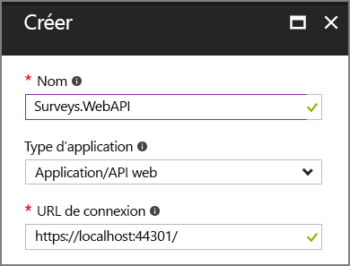 

5. Cliquez sur **Créer**.

6. Dans le panneau **Inscriptions d’application**, sélectionnez la nouvelle application **Surveys.WebAPI**.
 
7. Cliquez sur **Propriétés**.

8. Dans la zone de texte **URI ID d’application**, entrez `https://<domain>/surveys.webapi`, où `<domain>` est le nom de domaine de l’annuaire. Par exemple : `https://tailspin.onmicrosoft.com/surveys.webapi`

    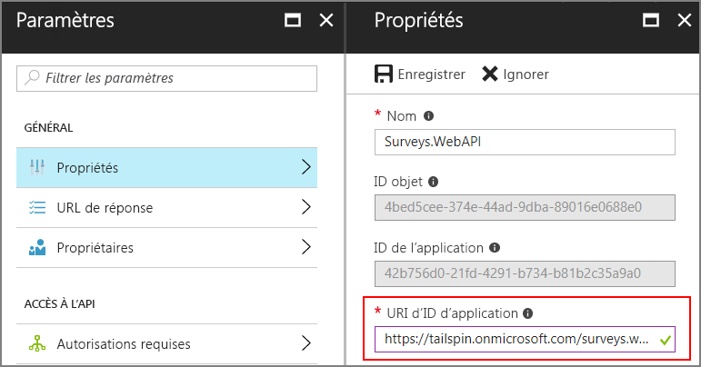

9. Définissez **Mutualisé** sur **OUI**.

10. Cliquez sur **Enregistrer**.

## <a name="register-the-surveys-web-app"></a>Inscrire l’application web Surveys 

1.  Revenez au panneau **Inscriptions des applications**, puis cliquez sur **Nouvelle inscription d’application**.

2.  Dans le panneau **Créer**, entrez les informations suivantes :

  - **Nom** : `Surveys`
  - **Type d’application** : `Web app / API`
  - **URL d’authentification** : `https://localhost:44300/`
   
    Notez que l’URL d’authentification a un numéro de port différent de celui de l’application `Surveys.WebAPI` à l’étape précédente.

3. Cliquez sur **Créer**.
 
4. Dans le panneau **Inscriptions d’application**, sélectionnez la nouvelle application **Surveys**.
 
5. Copiez l’ID de l’application. Vous en aurez besoin ultérieurement.

    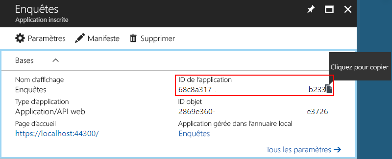

6. Cliquez sur **Propriétés**.

7. Dans la zone de texte **URI ID d’application**, entrez `https://<domain>/surveys`, où `<domain>` est le nom de domaine de l’annuaire. 

    

8. Définissez **Mutualisé** sur **OUI**.

9. Cliquez sur **Enregistrer**.

10. Dans le panneau **Paramètres**, cliquez sur **URL de réponse**.
 
11. Ajoutez l’URL de réponse suivante : `https://localhost:44300/signin-oidc`.

12. Cliquez sur **Enregistrer**.

13. Sous **ACCÈS D’API**, choisissez **Clés**.

14. Entrez une description, telle que `client secret`.

15. Dans la liste déroulante **Sélectionner une durée**, choisissez **1 an**. 

16. Cliquez sur **Enregistrer**. La clé est générée lorsque vous enregistrez.

17. Avant de quitter ce panneau, copiez la valeur de la clé.

    > [!NOTE] 
    > La clé n’est plus visible une fois que vous quittez le panneau. 

18. Sous **ACCÈS D’API**, cliquez sur **Autorisations requises**.

19. Cliquez sur **Ajouter** > **Sélectionner une API**.

20. Recherchez `Surveys.WebAPI` dans la zone de recherche.

    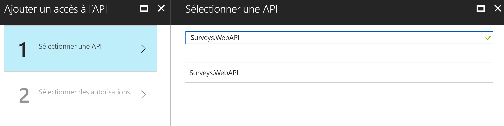

21. Choisissez `Surveys.WebAPI`, puis cliquez sur **Sélectionner**.

22. Sous **Autorisations déléguées**, cochez la case **Accéder à Surveys.WebAPI**.

    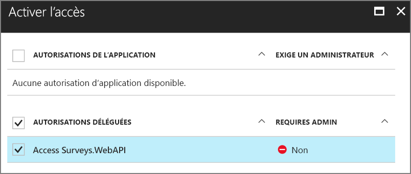

23. Cliquez sur **Sélectionner** > **Terminé**.


## <a name="update-the-application-manifests"></a>Mettre à jour les manifestes de l’application

1. Revenez au panneau **Paramètres** de l’application `Surveys.WebAPI`.

2. Cliquez sur **Manifeste** > **Modifier**.

    
 
3.  Ajoutez le code JSON suivant à l’élément `appRoles`. Générez de nouveaux GUID pour les propriétés `id`.

    ```json
    {
      "allowedMemberTypes": ["User"],
      "description": "Creators can create surveys",
      "displayName": "SurveyCreator",
      "id": "<Generate a new GUID. Example: 1b4f816e-5eaf-48b9-8613-7923830595ad>",
      "isEnabled": true,
      "value": "SurveyCreator"
    },
    {
      "allowedMemberTypes": ["User"],
      "description": "Administrators can manage the surveys in their tenant",
      "displayName": "SurveyAdmin",
      "id": "<Generate a new GUID>",  
      "isEnabled": true,
      "value": "SurveyAdmin"
    }
    ```

5.  Dans la propriété `knownClientApplications`, ajoutez l’ID de l’application web Surveys, que vous avez obtenu lors de l’inscription de l’application Surveys précédemment. Par exemple :

  ```json
  "knownClientApplications": ["be2cea23-aa0e-4e98-8b21-2963d494912e"],
  ```

  Ce paramètre ajoute l’application Surveys à la liste des clients autorisés à appeler l’API web.

6.  Cliquez sur **Enregistrer**.

À présent, répétez les mêmes étapes pour l’application Surveys, mais n’ajoutez pas d’entrée pour `knownClientApplications`. Utilisez les mêmes définitions de rôle, mais générez de nouveaux GUID pour les ID.

## <a name="create-a-new-redis-cache-instance"></a>Créer une nouvelle instance de cache Redis

L’application Surveys utilise Redis pour mettre en cache les jetons d’accès OAuth 2. Pour créer le cache, procédez comme suit :

1.  Accédez au [portail Azure](https://portal.azure.com), puis cliquez sur **Nouveau** > **Bases de données** > **Cache Redis**.

2.  Renseignez les informations requises, y compris le nom DNS, le groupe de ressources, l’emplacement et le niveau tarifaire. Vous pouvez créer un groupe de ressources ou utiliser un groupe de ressources existant.

3. Cliquez sur **Créer**.

4. Une fois le cache Redis créé, accédez à la ressource dans le portail.

5. Cliquez sur **Clés d’accès** et copiez la clé primaire.

Pour plus d’informations sur la création d’un cache Redis, voir [Utilisation du cache Redis Azure](/azure/redis-cache/cache-dotnet-how-to-use-azure-redis-cache).

## <a name="set-application-secrets"></a>Définir les secrets de l’application

1.  Ouvrez la solution Tailspin.Surveys dans Visual Studio.

2.  Dans l’Explorateur de solutions, cliquez avec le bouton droit sur le projet Tailspin.Surveys.Web, puis sélectionnez **Gérer les données secrètes de l’utilisateur**.

3.  Dans le fichier secrets.json, collez le texte suivant :
    
    ```json
    {
      "AzureAd": {
        "ClientId": "<Surveys application ID>",
        "ClientSecret": "<Surveys app client secret>",
        "PostLogoutRedirectUri": "https://localhost:44300/",
        "WebApiResourceId": "<Surveys.WebAPI app ID URI>"
      },
      "Redis": {
        "Configuration": "<Redis DNS name>.redis.cache.windows.net,password=<Redis primary key>,ssl=true"
      }
    }
    ```
   
    Remplacez les éléments figurant entre crochets comme suit :

    - `AzureAd:ClientId` : ID de l’application Surveys.
    - `AzureAd:ClientSecret` : clé que vous avez générée au moment d’inscrire l’application Surveys dans Azure AD.
    - `AzureAd:WebApiResourceId`: L’URI ID d’application que vous avez spécifié lorsque vous avez créé l’application Surveys.WebAPI dans Azure AD. Il doit avoir le format `https://<directory>.onmicrosoft.com/surveys.webapi`.
    - `Redis:Configuration` : construisez cette chaîne à partir du nom DNS du cache Redis et de la clé d’accès primaire. Par exemple, « tailspin.redis.cache.windows.net,password=2h5tBxxx,ssl=true ».

4.  Enregistrez le fichier secrets.json mis à jour.

5.  Répétez ces étapes pour le projet Tailspin.Surveys.WebAPI, mais collez le texte suivant dans le fichier secrets.json. Remplacez les éléments figurant entre crochets comme auparavant.

    ```json
    {
      "AzureAd": {
        "WebApiResourceId": "<Surveys.WebAPI app ID URI>"
      },
      "Redis": {
        "Configuration": "<Redis DNS name>.redis.cache.windows.net,password=<Redis primary key>,ssl=true"
      }
    }
    ```

## <a name="initialize-the-database"></a>Initialiser la base de données

À cette étape, vous utiliserez Entity Framework 7 pour créer une base de données SQL locale à l’aide de LocalDB.

1.  Ouvrez une fenêtre de commande.

2.  Accédez au projet Tailspin.Surveys.Data.

3.  Exécutez la commande suivante :

    ```
    dotnet ef database update --startup-project ..\Tailspin.Surveys.Web
    ```
    
## <a name="run-the-application"></a>Exécution de l'application

Pour exécuter l’application, démarrez les projets Tailspin.Surveys.Web et Tailspin.Surveys.WebAPI.

Vous pouvez configurer Visual Studio pour exécuter les deux projets automatiquement via F5, comme suit :

1.  Dans l’Explorateur de solutions, cliquez avec le bouton droit sur la solution, puis sélectionnez **Définir les projets de démarrage**.
2.  Sélectionnez **Plusieurs projets de démarrage**.
3.  Sélectionnez **Action** = **Démarrer** pour les projets Tailspin.Surveys.Web et Tailspin.Surveys.WebAPI.

## <a name="sign-up-a-new-tenant"></a>Inscrire un nouveau locataire

Lorsque l’application démarre, vous n’êtes pas connecté. Vous voyez donc la page d’accueil :

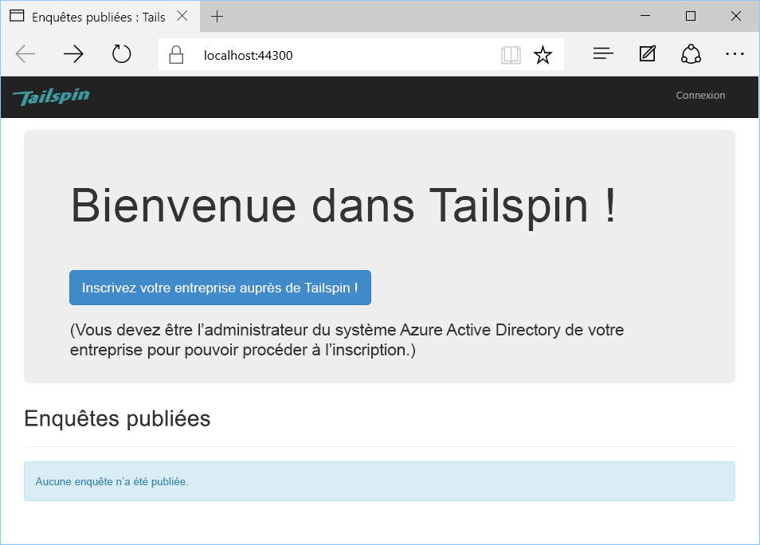

Pour vous inscrire auprès d’une organisation :

1. Cliquez sur **Inscrire votre entreprise dans Tailspin**.
2. Connectez-vous à l’annuaire Azure AD qui représente l’organisation utilisant l’application Surveys. Vous devez vous connecter en tant qu’administrateur.
3. Acceptez l’invite de consentement.

L’application inscrit le locataire, puis vous déconnecte. L’application vous déconnecte, car vous devez configurer les rôles d’application dans Azure AD avant d’utiliser l’application.

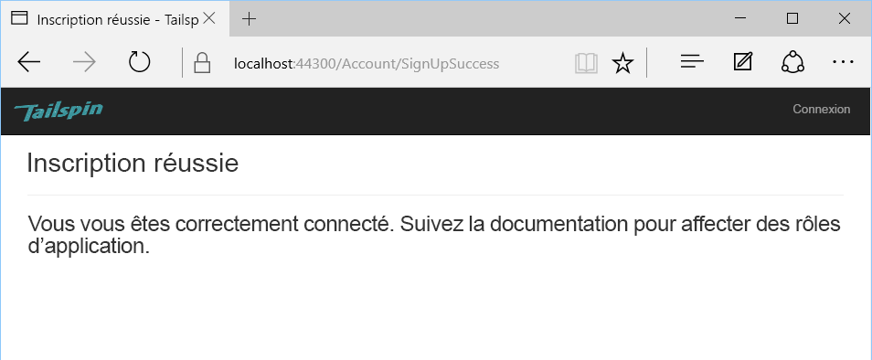

## <a name="assign-application-roles"></a>Affecter des rôles d’application

Lorsqu’un locataire s’inscrit, un administrateur Active Directory désigné pour ce locataire doit attribuer des rôles d’application aux utilisateurs.


1. Dans le [portail Azure][portal], basculez vers l’annuaire Azure AD que vous avez utilisé pour vous inscrire à l’application Surveys. 

2. Sélectionnez **Azure Active Directory** dans le volet de navigation gauche. 

3. Cliquez sur **Applications d’entreprise** > **Toutes les applications**. Le portail contient `Survey` et `Survey.WebAPI`. Si ce n’est pas le cas, vérifiez que vous effectué le processus d’inscription.

4.  Cliquez sur l’application Surveys.

5.  Cliquez sur **Utilisateurs et groupes**.

4.  Cliquez sur **Add User**.

5.  Si vous avez Azure AD Premium, cliquez sur **Utilisateurs et groupes**. Sinon, cliquez sur **Utilisateurs**. (L’attribution d’un rôle à un groupe nécessite Azure AD Premium.)

6. Choisissez un ou plusieurs utilisateurs, puis cliquez sur **Sélectionner**.

    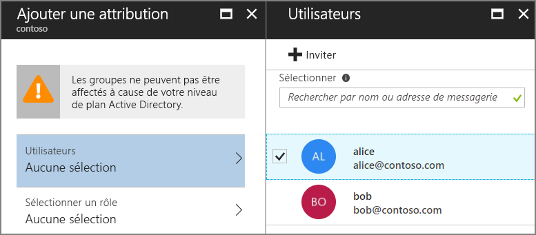

6.  Choisissez le rôle, puis cliquez sur **Sélectionner**.

    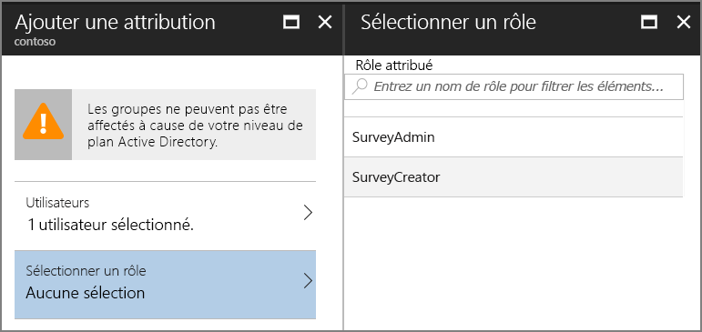

7.  Cliquez sur **Affecter**.

Répétez ces étapes afin d’attribuer des rôles pour l’application Survey.WebAPI.

> Important : un utilisateur doit toujours avoir les mêmes rôles dans Survey et Survey.WebAPI. Dans le cas contraire, l’utilisateur aura des autorisations incohérentes, ce qui peut entraîner des erreurs 403 (interdit) de la part de l’API web.

Revenez à l’application et reconnectez-vous. Cliquez sur **My Surveys**. Si l’utilisateur dispose du rôle SurveyAdmin ou SurveyCreator, vous verrez un bouton **Create Survey**, indiquant que l’utilisateur a les autorisations nécessaires pour créer une enquête.

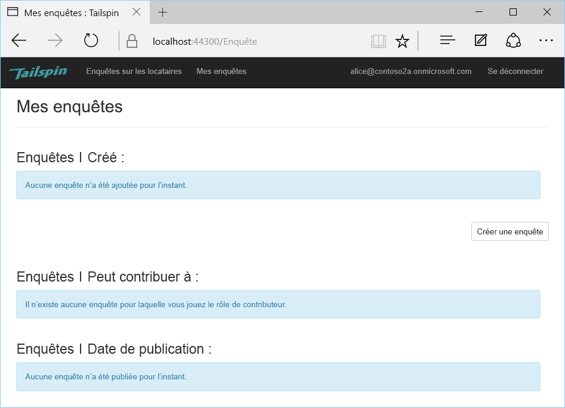


<!-- links -->

[portal]: https://portal.azure.com
[VS2017]: https://www.visualstudio.com/vs/
