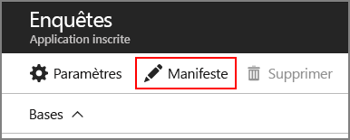

# <a name="run-the-surveys-application"></a><span data-ttu-id="1a854-103">Exécution de l’application Surveys</span><span class="sxs-lookup"><span data-stu-id="1a854-103">Run the Surveys application</span></span>

<span data-ttu-id="1a854-104">Cet article décrit comment exécuter l’application [Tailspin Surveys](./tailspin.md) localement, à partir de Visual Studio.</span><span class="sxs-lookup"><span data-stu-id="1a854-104">This article describes how to run the [Tailspin Surveys](./tailspin.md) application locally, from Visual Studio.</span></span> <span data-ttu-id="1a854-105">Ces étapes ne permettent pas de déployer l’application sur Azure.</span><span class="sxs-lookup"><span data-stu-id="1a854-105">In these steps, you won't deploy the application to Azure.</span></span> <span data-ttu-id="1a854-106">Toutefois, vous devez créer des ressources Azure &mdash; un annuaire Azure Active Directory (Azure AD) et un cache Redis.</span><span class="sxs-lookup"><span data-stu-id="1a854-106">However, you will need to create some Azure resources &mdash; an Azure Active Directory (Azure AD) directory and a Redis cache.</span></span>

<span data-ttu-id="1a854-107">Voici un résumé des étapes :</span><span class="sxs-lookup"><span data-stu-id="1a854-107">Here is a summary of the steps:</span></span>

1. <span data-ttu-id="1a854-108">Créez un annuaire Azure AD (locataire) pour la société fictive Tailspin.</span><span class="sxs-lookup"><span data-stu-id="1a854-108">Create an Azure AD directory (tenant) for the fictitious Tailspin company.</span></span>
2. <span data-ttu-id="1a854-109">Inscrivez l’application Surveys et l’API web principale auprès d’Azure AD.</span><span class="sxs-lookup"><span data-stu-id="1a854-109">Register the Surveys application and the backend web API with Azure AD.</span></span>
3. <span data-ttu-id="1a854-110">Créez une instance de cache Redis Azure.</span><span class="sxs-lookup"><span data-stu-id="1a854-110">Create an Azure Redis Cache instance.</span></span>
4. <span data-ttu-id="1a854-111">Configurez les paramètres d’application et créez une base de données locale.</span><span class="sxs-lookup"><span data-stu-id="1a854-111">Configure application settings and create a local database.</span></span>
5. <span data-ttu-id="1a854-112">Exécutez l’application et inscrivez un nouveau locataire.</span><span class="sxs-lookup"><span data-stu-id="1a854-112">Run the application and sign up a new tenant.</span></span>
6. <span data-ttu-id="1a854-113">Ajoutez des rôles d’application aux utilisateurs.</span><span class="sxs-lookup"><span data-stu-id="1a854-113">Add application roles to users.</span></span>

## <a name="prerequisites"></a><span data-ttu-id="1a854-114">Prérequis</span><span class="sxs-lookup"><span data-stu-id="1a854-114">Prerequisites</span></span>
-   <span data-ttu-id="1a854-115">[Visual Studio 2017][VS2017]</span><span class="sxs-lookup"><span data-stu-id="1a854-115">[Visual Studio 2017][VS2017]</span></span>
-   <span data-ttu-id="1a854-116">Compte [Microsoft Azure](https://azure.microsoft.com)</span><span class="sxs-lookup"><span data-stu-id="1a854-116">[Microsoft Azure](https://azure.microsoft.com) account</span></span>

## <a name="create-the-tailspin-tenant"></a><span data-ttu-id="1a854-117">Créer le locataire Tailspin</span><span class="sxs-lookup"><span data-stu-id="1a854-117">Create the Tailspin tenant</span></span>

<span data-ttu-id="1a854-118">Tailspin est la société fictive qui héberge l’application Surveys.</span><span class="sxs-lookup"><span data-stu-id="1a854-118">Tailspin is the fictitious company that hosts the Surveys application.</span></span> <span data-ttu-id="1a854-119">Tailspin utilise Azure AD pour permettre à d’autres locataires de s’inscrire auprès de l’application.</span><span class="sxs-lookup"><span data-stu-id="1a854-119">Tailspin uses Azure AD to enable other tenants to register with the app.</span></span> <span data-ttu-id="1a854-120">Ces clients peuvent utiliser ensuite leurs informations d’identification Azure AD pour se connecter à l’application.</span><span class="sxs-lookup"><span data-stu-id="1a854-120">Those customers can then use their Azure AD credentials to sign into the app.</span></span>

<span data-ttu-id="1a854-121">À cette étape, vous allez créer un annuaire Azure AD pour Tailspin.</span><span class="sxs-lookup"><span data-stu-id="1a854-121">In this step, you'll create an Azure AD directory for Tailspin.</span></span>

1. <span data-ttu-id="1a854-122">Connectez-vous au [portail Azure][portal].</span><span class="sxs-lookup"><span data-stu-id="1a854-122">Sign into the [Azure portal][portal].</span></span>

2. <span data-ttu-id="1a854-123">Cliquez sur **+ créer une identité de** > **ressource**  > **Azure Active Directory**.</span><span class="sxs-lookup"><span data-stu-id="1a854-123">Click **+ Create a Resource** > **Identity** > **Azure Active Directory**.</span></span>

3. <span data-ttu-id="1a854-124">Entrez `Tailspin` comme nom d’organisation et saisissez un nom de domaine.</span><span class="sxs-lookup"><span data-stu-id="1a854-124">Enter `Tailspin` for the organization name, and enter a domain name.</span></span> <span data-ttu-id="1a854-125">Le nom de domaine a le format `xxxx.onmicrosoft.com` et doit être globalement unique.</span><span class="sxs-lookup"><span data-stu-id="1a854-125">The domain name will have the form `xxxx.onmicrosoft.com` and must be globally unique.</span></span> 

    

4. <span data-ttu-id="1a854-126">Cliquez sur **Créer**.</span><span class="sxs-lookup"><span data-stu-id="1a854-126">Click **Create**.</span></span> <span data-ttu-id="1a854-127">La création de l’annuaire peut prendre plusieurs minutes.</span><span class="sxs-lookup"><span data-stu-id="1a854-127">It may take a few minutes to create the new directory.</span></span>

<span data-ttu-id="1a854-128">Pour réaliser le scénario de bout en bout, vous aurez besoin d’un second annuaire Azure AD pour représenter un client s’inscrit à l’application.</span><span class="sxs-lookup"><span data-stu-id="1a854-128">To complete the end-to-end scenario, you'll need a second Azure AD directory to represent a customer that signs up for the application.</span></span> <span data-ttu-id="1a854-129">Vous pouvez utiliser votre annuaire Azure AD par défaut (pas Tailspin) ou créer un autre annuaire à cet effet.</span><span class="sxs-lookup"><span data-stu-id="1a854-129">You can use your default Azure AD directory (not Tailspin), or create a new directory for this purpose.</span></span> <span data-ttu-id="1a854-130">Dans les exemples, nous utilisons Contoso en tant que client fictif.</span><span class="sxs-lookup"><span data-stu-id="1a854-130">In the examples, we use Contoso as the fictitious customer.</span></span>

## <a name="register-the-surveys-web-api"></a><span data-ttu-id="1a854-131">Inscrire l’API web Surveys</span><span class="sxs-lookup"><span data-stu-id="1a854-131">Register the Surveys web API</span></span> 

1. <span data-ttu-id="1a854-132">Dans le [portail Azure][portal], basculez vers le nouvel l’annuaire Tailspin en sélectionnant votre compte dans l’angle supérieur droit du portail.</span><span class="sxs-lookup"><span data-stu-id="1a854-132">In the [Azure portal][portal], switch to the new Tailspin directory by selecting your account in the top right corner of the portal.</span></span>

2. <span data-ttu-id="1a854-133">Sélectionnez **Azure Active Directory** dans le volet de navigation gauche.</span><span class="sxs-lookup"><span data-stu-id="1a854-133">In the left-hand navigation pane, choose **Azure Active Directory**.</span></span> 

3. <span data-ttu-id="1a854-134">Cliquez sur **Inscription d’applications** > **Nouvelle inscription d’application**.</span><span class="sxs-lookup"><span data-stu-id="1a854-134">Click **App registrations** > **New application registration**.</span></span>

4. <span data-ttu-id="1a854-135">Dans le panneau **Créer**, entrez les informations suivantes :</span><span class="sxs-lookup"><span data-stu-id="1a854-135">In the **Create** blade, enter the following information:</span></span>

   - <span data-ttu-id="1a854-136">**Nom** : `Surveys.WebAPI`</span><span class="sxs-lookup"><span data-stu-id="1a854-136">**Name**: `Surveys.WebAPI`</span></span>

   - <span data-ttu-id="1a854-137">**Type d’application** : `Web app / API`</span><span class="sxs-lookup"><span data-stu-id="1a854-137">**Application type**: `Web app / API`</span></span>

   - <span data-ttu-id="1a854-138">**URL d’authentification** : `https://localhost:44301/`</span><span class="sxs-lookup"><span data-stu-id="1a854-138">**Sign-on URL**: `https://localhost:44301/`</span></span>
   
    

5. <span data-ttu-id="1a854-139">Cliquez sur **Créer**.</span><span class="sxs-lookup"><span data-stu-id="1a854-139">Click **Create**.</span></span>

6. <span data-ttu-id="1a854-140">Dans le panneau **Inscriptions d’application**, sélectionnez la nouvelle application **Surveys.WebAPI**.</span><span class="sxs-lookup"><span data-stu-id="1a854-140">In the **App registrations** blade, select the new **Surveys.WebAPI** application.</span></span>
 
7. <span data-ttu-id="1a854-141">Puis cliquez sur **Paramètres** > **Propriétés**.</span><span class="sxs-lookup"><span data-stu-id="1a854-141">Click **Settings** > **Properties**.</span></span>

8. <span data-ttu-id="1a854-142">Dans la zone de texte **URI ID d’application**, entrez `https://<domain>/surveys.webapi`, où `<domain>` est le nom de domaine de l’annuaire.</span><span class="sxs-lookup"><span data-stu-id="1a854-142">In the **App ID URI** edit box, enter `https://<domain>/surveys.webapi`, where `<domain>` is the domain name of the directory.</span></span> <span data-ttu-id="1a854-143">Par exemple : `https://tailspin.onmicrosoft.com/surveys.webapi`</span><span class="sxs-lookup"><span data-stu-id="1a854-143">For example: `https://tailspin.onmicrosoft.com/surveys.webapi`</span></span>

    

9. <span data-ttu-id="1a854-145">Définissez **Mutualisé** sur **OUI**.</span><span class="sxs-lookup"><span data-stu-id="1a854-145">Set **Multi-tenanted** to **YES**.</span></span>

10. <span data-ttu-id="1a854-146">Cliquez sur **Enregistrer**.</span><span class="sxs-lookup"><span data-stu-id="1a854-146">Click **Save**.</span></span>

## <a name="register-the-surveys-web-app"></a><span data-ttu-id="1a854-147">Inscrire l’application web Surveys</span><span class="sxs-lookup"><span data-stu-id="1a854-147">Register the Surveys web app</span></span> 

1. <span data-ttu-id="1a854-148">Revenez au panneau **Inscriptions des applications**, puis cliquez sur **Nouvelle inscription d’application**.</span><span class="sxs-lookup"><span data-stu-id="1a854-148">Navigate back to the **App registrations** blade, and click **New application registration**.</span></span>

2. <span data-ttu-id="1a854-149">Dans le panneau **Créer**, entrez les informations suivantes :</span><span class="sxs-lookup"><span data-stu-id="1a854-149">In the **Create** blade, enter the following information:</span></span>

   - <span data-ttu-id="1a854-150">**Nom** : `Surveys`</span><span class="sxs-lookup"><span data-stu-id="1a854-150">**Name**: `Surveys`</span></span>
   - <span data-ttu-id="1a854-151">**Type d’application** : `Web app / API`</span><span class="sxs-lookup"><span data-stu-id="1a854-151">**Application type**: `Web app / API`</span></span>
   - <span data-ttu-id="1a854-152">**URL d’authentification** : `https://localhost:44300/`</span><span class="sxs-lookup"><span data-stu-id="1a854-152">**Sign-on URL**: `https://localhost:44300/`</span></span>
   
   <span data-ttu-id="1a854-153">Notez que l’URL d’authentification a un numéro de port différent de celui de l’application `Surveys.WebAPI` à l’étape précédente.</span><span class="sxs-lookup"><span data-stu-id="1a854-153">Notice that the sign-on URL has a different port number from the `Surveys.WebAPI` app in the previous step.</span></span>

3. <span data-ttu-id="1a854-154">Cliquez sur **Créer**.</span><span class="sxs-lookup"><span data-stu-id="1a854-154">Click **Create**.</span></span>
 
4. <span data-ttu-id="1a854-155">Dans le panneau **Inscriptions d’application**, sélectionnez la nouvelle application **Surveys**.</span><span class="sxs-lookup"><span data-stu-id="1a854-155">In the **App registrations** blade, select the new **Surveys** application.</span></span>
 
5. <span data-ttu-id="1a854-156">Copiez l’ID de l’application.</span><span class="sxs-lookup"><span data-stu-id="1a854-156">Copy the application ID.</span></span> <span data-ttu-id="1a854-157">Vous en aurez besoin ultérieurement.</span><span class="sxs-lookup"><span data-stu-id="1a854-157">You will need this later.</span></span>

    

6. <span data-ttu-id="1a854-158">Cliquez sur **Propriétés**.</span><span class="sxs-lookup"><span data-stu-id="1a854-158">Click **Properties**.</span></span>

7. <span data-ttu-id="1a854-159">Dans la zone de texte **URI ID d’application**, entrez `https://<domain>/surveys`, où `<domain>` est le nom de domaine de l’annuaire.</span><span class="sxs-lookup"><span data-stu-id="1a854-159">In the **App ID URI** edit box, enter `https://<domain>/surveys`, where `<domain>` is the domain name of the directory.</span></span> 

    

8. <span data-ttu-id="1a854-161">Définissez **Mutualisé** sur **OUI**.</span><span class="sxs-lookup"><span data-stu-id="1a854-161">Set **Multi-tenanted** to **YES**.</span></span>

9. <span data-ttu-id="1a854-162">Cliquez sur **Enregistrer**.</span><span class="sxs-lookup"><span data-stu-id="1a854-162">Click **Save**.</span></span>

10. <span data-ttu-id="1a854-163">Dans le panneau **Paramètres**, cliquez sur **URL de réponse**.</span><span class="sxs-lookup"><span data-stu-id="1a854-163">In the **Settings** blade, click **Reply URLs**.</span></span>
 
11. <span data-ttu-id="1a854-164">Ajoutez l’URL de réponse suivante : `https://localhost:44300/signin-oidc`.</span><span class="sxs-lookup"><span data-stu-id="1a854-164">Add the following reply URL: `https://localhost:44300/signin-oidc`.</span></span>

12. <span data-ttu-id="1a854-165">Cliquez sur **Enregistrer**.</span><span class="sxs-lookup"><span data-stu-id="1a854-165">Click **Save**.</span></span>

13. <span data-ttu-id="1a854-166">Sous **ACCÈS D’API**, choisissez **Clés**.</span><span class="sxs-lookup"><span data-stu-id="1a854-166">Under **API ACCESS**, click **Keys**.</span></span>

14. <span data-ttu-id="1a854-167">Entrez une description, telle que `client secret`.</span><span class="sxs-lookup"><span data-stu-id="1a854-167">Enter a description, such as `client secret`.</span></span>

15. <span data-ttu-id="1a854-168">Dans la liste déroulante **Sélectionner une durée**, choisissez **1 an**.</span><span class="sxs-lookup"><span data-stu-id="1a854-168">In the **Select Duration** dropdown, select **1 year**.</span></span> 

16. <span data-ttu-id="1a854-169">Cliquez sur **Enregistrer**.</span><span class="sxs-lookup"><span data-stu-id="1a854-169">Click **Save**.</span></span> <span data-ttu-id="1a854-170">La clé est générée lorsque vous enregistrez.</span><span class="sxs-lookup"><span data-stu-id="1a854-170">The key will be generated when you save.</span></span>

17. <span data-ttu-id="1a854-171">Avant de quitter ce panneau, copiez la valeur de la clé.</span><span class="sxs-lookup"><span data-stu-id="1a854-171">Before you navigate away from this blade, copy the value of the key.</span></span>

    > [!NOTE] 
    > <span data-ttu-id="1a854-172">La clé n’est plus visible une fois que vous quittez le panneau.</span><span class="sxs-lookup"><span data-stu-id="1a854-172">The key won't be visible again after you navigate away from the blade.</span></span> 

18. <span data-ttu-id="1a854-173">Sous **ACCÈS D’API**, cliquez sur **Autorisations requises**.</span><span class="sxs-lookup"><span data-stu-id="1a854-173">Under **API ACCESS**, click **Required permissions**.</span></span>

19. <span data-ttu-id="1a854-174">Cliquez sur **Ajouter** > **Sélectionner une API**.</span><span class="sxs-lookup"><span data-stu-id="1a854-174">Click **Add** > **Select an API**.</span></span>

20. <span data-ttu-id="1a854-175">Recherchez `Surveys.WebAPI` dans la zone de recherche.</span><span class="sxs-lookup"><span data-stu-id="1a854-175">In the search box, search for `Surveys.WebAPI`.</span></span>

    

21. <span data-ttu-id="1a854-177">Choisissez `Surveys.WebAPI`, puis cliquez sur **Sélectionner**.</span><span class="sxs-lookup"><span data-stu-id="1a854-177">Select `Surveys.WebAPI` and click **Select**.</span></span>

22. <span data-ttu-id="1a854-178">Sous **Autorisations déléguées**, cochez la case **Accéder à Surveys.WebAPI**.</span><span class="sxs-lookup"><span data-stu-id="1a854-178">Under **Delegated Permissions**, check **Access Surveys.WebAPI**.</span></span>

    

23. <span data-ttu-id="1a854-180">Cliquez sur **Sélectionner** > **Terminé**.</span><span class="sxs-lookup"><span data-stu-id="1a854-180">Click **Select** > **Done**.</span></span>


## <a name="update-the-application-manifests"></a><span data-ttu-id="1a854-181">Mettre à jour les manifestes de l’application</span><span class="sxs-lookup"><span data-stu-id="1a854-181">Update the application manifests</span></span>

1. <span data-ttu-id="1a854-182">Revenez au panneau **Paramètres** de l’application `Surveys.WebAPI`.</span><span class="sxs-lookup"><span data-stu-id="1a854-182">Navigate back to the **Settings** blade for the `Surveys.WebAPI` app.</span></span>

2. <span data-ttu-id="1a854-183">Cliquez sur **Manifeste** > **Modifier**.</span><span class="sxs-lookup"><span data-stu-id="1a854-183">Click **Manifest** > **Edit**.</span></span>

    
 
3. <span data-ttu-id="1a854-184">Ajoutez le code JSON suivant à l’élément `appRoles`.</span><span class="sxs-lookup"><span data-stu-id="1a854-184">Add the following JSON to the `appRoles` element.</span></span> <span data-ttu-id="1a854-185">Générez de nouveaux GUID pour les propriétés `id`.</span><span class="sxs-lookup"><span data-stu-id="1a854-185">Generate new GUIDs for the `id` properties.</span></span>

   ```json
   {
     "allowedMemberTypes": ["User"],
     "description": "Creators can create surveys",
     "displayName": "SurveyCreator",
     "id": "<Generate a new GUID. Example: 1b4f816e-5eaf-48b9-8613-7923830595ad>",
     "isEnabled": true,
     "value": "SurveyCreator"
   },
   {
     "allowedMemberTypes": ["User"],
     "description": "Administrators can manage the surveys in their tenant",
     "displayName": "SurveyAdmin",
     "id": "<Generate a new GUID>",  
     "isEnabled": true,
     "value": "SurveyAdmin"
   }
   ```

4. <span data-ttu-id="1a854-186">Dans la propriété `knownClientApplications`, ajoutez l’ID de l’application web Surveys, que vous avez obtenu lors de l’inscription de l’application Surveys précédemment.</span><span class="sxs-lookup"><span data-stu-id="1a854-186">In the `knownClientApplications` property, add the application ID for the Surveys web application, which you got when you registered the Surveys application earlier.</span></span> <span data-ttu-id="1a854-187">Par exemple : </span><span class="sxs-lookup"><span data-stu-id="1a854-187">For example:</span></span>

   ```json
   "knownClientApplications": ["be2cea23-aa0e-4e98-8b21-2963d494912e"],
   ```

   <span data-ttu-id="1a854-188">Ce paramètre ajoute l’application Surveys à la liste des clients autorisés à appeler l’API web.</span><span class="sxs-lookup"><span data-stu-id="1a854-188">This setting adds the Surveys app to the list of clients authorized to call the web API.</span></span>

5. <span data-ttu-id="1a854-189">Cliquez sur **Enregistrer**.</span><span class="sxs-lookup"><span data-stu-id="1a854-189">Click **Save**.</span></span>

<span data-ttu-id="1a854-190">À présent, répétez les mêmes étapes pour l’application Surveys, mais n’ajoutez pas d’entrée pour `knownClientApplications`.</span><span class="sxs-lookup"><span data-stu-id="1a854-190">Now repeat the same steps for the Surveys app, except do not add an entry for `knownClientApplications`.</span></span> <span data-ttu-id="1a854-191">Utilisez les mêmes définitions de rôle, mais générez de nouveaux GUID pour les ID.</span><span class="sxs-lookup"><span data-stu-id="1a854-191">Use the same role definitions, but generate new GUIDs for the IDs.</span></span>

## <a name="create-a-new-redis-cache-instance"></a><span data-ttu-id="1a854-192">Créer une nouvelle instance de cache Redis</span><span class="sxs-lookup"><span data-stu-id="1a854-192">Create a new Redis Cache instance</span></span>

<span data-ttu-id="1a854-193">L’application Surveys utilise Redis pour mettre en cache les jetons d’accès OAuth 2.</span><span class="sxs-lookup"><span data-stu-id="1a854-193">The Surveys application uses Redis to cache OAuth 2 access tokens.</span></span> <span data-ttu-id="1a854-194">Pour créer le cache, procédez comme suit :</span><span class="sxs-lookup"><span data-stu-id="1a854-194">To create the cache:</span></span>

1.  <span data-ttu-id="1a854-195">Accédez au [portail Azure](https://portal.azure.com), puis cliquez sur **Nouveau** > **Bases de données** > **Cache Redis**.</span><span class="sxs-lookup"><span data-stu-id="1a854-195">Go to [Azure Portal](https://portal.azure.com) and click **+ Create a Resource** > **Databases** > **Redis Cache**.</span></span>

2.  <span data-ttu-id="1a854-196">Renseignez les informations requises, y compris le nom DNS, le groupe de ressources, l’emplacement et le niveau tarifaire.</span><span class="sxs-lookup"><span data-stu-id="1a854-196">Fill in the required information, including DNS name, resource group, location, and pricing tier.</span></span> <span data-ttu-id="1a854-197">Vous pouvez créer un groupe de ressources ou utiliser un groupe de ressources existant.</span><span class="sxs-lookup"><span data-stu-id="1a854-197">You can create a new resource group or use an existing resource group.</span></span>

3. <span data-ttu-id="1a854-198">Cliquez sur **Créer**.</span><span class="sxs-lookup"><span data-stu-id="1a854-198">Click **Create**.</span></span>

4. <span data-ttu-id="1a854-199">Une fois le Cache Redis créé, accédez à la ressource dans le portail.</span><span class="sxs-lookup"><span data-stu-id="1a854-199">After the Redis cache is created, navigate to the resource in the portal.</span></span>

5. <span data-ttu-id="1a854-200">Cliquez sur **Clés d’accès** et copiez la clé primaire.</span><span class="sxs-lookup"><span data-stu-id="1a854-200">Click **Access keys** and copy the primary key.</span></span>

<span data-ttu-id="1a854-201">Pour plus d’informations sur la création d’un cache Redis, voir [Utilisation du cache Redis Azure](/azure/redis-cache/cache-dotnet-how-to-use-azure-redis-cache).</span><span class="sxs-lookup"><span data-stu-id="1a854-201">For more information about creating a Redis cache, see [How to Use Azure Redis Cache](/azure/redis-cache/cache-dotnet-how-to-use-azure-redis-cache).</span></span>

## <a name="set-application-secrets"></a><span data-ttu-id="1a854-202">Définir les secrets de l’application</span><span class="sxs-lookup"><span data-stu-id="1a854-202">Set application secrets</span></span>

1.  <span data-ttu-id="1a854-203">Ouvrez la solution Tailspin.Surveys dans Visual Studio.</span><span class="sxs-lookup"><span data-stu-id="1a854-203">Open the Tailspin.Surveys solution in Visual Studio.</span></span>

2.  <span data-ttu-id="1a854-204">Dans l’Explorateur de solutions, cliquez avec le bouton droit sur le projet Tailspin.Surveys.Web, puis sélectionnez **Gérer les données secrètes de l’utilisateur**.</span><span class="sxs-lookup"><span data-stu-id="1a854-204">In Solution Explorer, right-click the Tailspin.Surveys.Web project and select **Manage User Secrets**.</span></span>

3.  <span data-ttu-id="1a854-205">Dans le fichier secrets.json, collez le texte suivant :</span><span class="sxs-lookup"><span data-stu-id="1a854-205">In the secrets.json file, paste in the following:</span></span>
    
    ```json
    {
      "AzureAd": {
        "ClientId": "<Surveys application ID>",
        "ClientSecret": "<Surveys app client secret>",
        "PostLogoutRedirectUri": "https://localhost:44300/",
        "WebApiResourceId": "<Surveys.WebAPI app ID URI>"
      },
      "Redis": {
        "Configuration": "<Redis DNS name>.redis.cache.windows.net,password=<Redis primary key>,ssl=true"
      }
    }
    ```
   
    <span data-ttu-id="1a854-206">Remplacez les éléments figurant entre crochets comme suit :</span><span class="sxs-lookup"><span data-stu-id="1a854-206">Replace the items shown in angle brackets, as follows:</span></span>

    - <span data-ttu-id="1a854-207">`AzureAd:ClientId` : ID de l’application Surveys.</span><span class="sxs-lookup"><span data-stu-id="1a854-207">`AzureAd:ClientId`: The application ID of the Surveys app.</span></span>
    - <span data-ttu-id="1a854-208">`AzureAd:ClientSecret` : clé que vous avez générée au moment d’inscrire l’application Surveys dans Azure AD.</span><span class="sxs-lookup"><span data-stu-id="1a854-208">`AzureAd:ClientSecret`: The key that you generated when you registered the Surveys application in Azure AD.</span></span>
    - <span data-ttu-id="1a854-209">`AzureAd:WebApiResourceId`: L’URI ID d’application que vous avez spécifié lorsque vous avez créé l’application Surveys.WebAPI dans Azure AD.</span><span class="sxs-lookup"><span data-stu-id="1a854-209">`AzureAd:WebApiResourceId`: The App ID URI that you specified when you created the Surveys.WebAPI application in Azure AD.</span></span> <span data-ttu-id="1a854-210">Il doit avoir le format `https://<directory>.onmicrosoft.com/surveys.webapi`.</span><span class="sxs-lookup"><span data-stu-id="1a854-210">It should have the form `https://<directory>.onmicrosoft.com/surveys.webapi`</span></span>
    - <span data-ttu-id="1a854-211">`Redis:Configuration` : construisez cette chaîne à partir du nom DNS du cache Redis et de la clé d’accès primaire.</span><span class="sxs-lookup"><span data-stu-id="1a854-211">`Redis:Configuration`: Build this string from the DNS name of the Redis cache and the primary access key.</span></span> <span data-ttu-id="1a854-212">Par exemple, « tailspin.redis.cache.windows.net,password=2h5tBxxx,ssl=true ».</span><span class="sxs-lookup"><span data-stu-id="1a854-212">For example, "tailspin.redis.cache.windows.net,password=2h5tBxxx,ssl=true".</span></span>

4.  <span data-ttu-id="1a854-213">Enregistrez le fichier secrets.json mis à jour.</span><span class="sxs-lookup"><span data-stu-id="1a854-213">Save the updated secrets.json file.</span></span>

5.  <span data-ttu-id="1a854-214">Répétez ces étapes pour le projet Tailspin.Surveys.WebAPI, mais collez le texte suivant dans le fichier secrets.json.</span><span class="sxs-lookup"><span data-stu-id="1a854-214">Repeat these steps for the Tailspin.Surveys.WebAPI project, but paste the following into secrets.json.</span></span> <span data-ttu-id="1a854-215">Remplacez les éléments figurant entre crochets comme auparavant.</span><span class="sxs-lookup"><span data-stu-id="1a854-215">Replace the items in angle brackets, as before.</span></span>

    ```json
    {
      "AzureAd": {
        "WebApiResourceId": "<Surveys.WebAPI app ID URI>"
      },
      "Redis": {
        "Configuration": "<Redis DNS name>.redis.cache.windows.net,password=<Redis primary key>,ssl=true"
      }
    }
    ```

## <a name="initialize-the-database"></a><span data-ttu-id="1a854-216">Initialiser la base de données</span><span class="sxs-lookup"><span data-stu-id="1a854-216">Initialize the database</span></span>

<span data-ttu-id="1a854-217">À cette étape, vous utiliserez Entity Framework 7 pour créer une base de données SQL locale à l’aide de LocalDB.</span><span class="sxs-lookup"><span data-stu-id="1a854-217">In this step, you will use Entity Framework 7 to create a local SQL database, using LocalDB.</span></span>

1.  <span data-ttu-id="1a854-218">Ouvrez une fenêtre de commande.</span><span class="sxs-lookup"><span data-stu-id="1a854-218">Open a command window</span></span>

2.  <span data-ttu-id="1a854-219">Accédez au projet Tailspin.Surveys.Data.</span><span class="sxs-lookup"><span data-stu-id="1a854-219">Navigate to the Tailspin.Surveys.Data project.</span></span>

3.  <span data-ttu-id="1a854-220">Exécutez la commande suivante :</span><span class="sxs-lookup"><span data-stu-id="1a854-220">Run the following command:</span></span>

    ```
    dotnet ef database update --startup-project ..\Tailspin.Surveys.Web
    ```
    
## <a name="run-the-application"></a><span data-ttu-id="1a854-221">Exécution de l'application</span><span class="sxs-lookup"><span data-stu-id="1a854-221">Run the application</span></span>

<span data-ttu-id="1a854-222">Pour exécuter l’application, démarrez les projets Tailspin.Surveys.Web et Tailspin.Surveys.WebAPI.</span><span class="sxs-lookup"><span data-stu-id="1a854-222">To run the application, start both the Tailspin.Surveys.Web and Tailspin.Surveys.WebAPI projects.</span></span>

<span data-ttu-id="1a854-223">Vous pouvez configurer Visual Studio pour exécuter les deux projets automatiquement via F5, comme suit :</span><span class="sxs-lookup"><span data-stu-id="1a854-223">You can set Visual Studio to run both projects automatically on F5, as follows:</span></span>

1.  <span data-ttu-id="1a854-224">Dans l’Explorateur de solutions, cliquez avec le bouton droit sur la solution, puis sélectionnez **Définir les projets de démarrage**.</span><span class="sxs-lookup"><span data-stu-id="1a854-224">In Solution Explorer, right-click the solution and click **Set Startup Projects**.</span></span>
2.  <span data-ttu-id="1a854-225">Sélectionnez **Plusieurs projets de démarrage**.</span><span class="sxs-lookup"><span data-stu-id="1a854-225">Select **Multiple startup projects**.</span></span>
3.  <span data-ttu-id="1a854-226">Sélectionnez **Action** = **Démarrer** pour les projets Tailspin.Surveys.Web et Tailspin.Surveys.WebAPI.</span><span class="sxs-lookup"><span data-stu-id="1a854-226">Set **Action** = **Start** for the Tailspin.Surveys.Web and Tailspin.Surveys.WebAPI projects.</span></span>

## <a name="sign-up-a-new-tenant"></a><span data-ttu-id="1a854-227">Inscrire un nouveau locataire</span><span class="sxs-lookup"><span data-stu-id="1a854-227">Sign up a new tenant</span></span>

<span data-ttu-id="1a854-228">Lorsque l’application démarre, vous n’êtes pas connecté. Vous voyez donc la page d’accueil :</span><span class="sxs-lookup"><span data-stu-id="1a854-228">When the application starts, you are not signed in, so you see the welcome page:</span></span>


<span data-ttu-id="1a854-230">Pour vous inscrire auprès d’une organisation :</span><span class="sxs-lookup"><span data-stu-id="1a854-230">To sign up an organization:</span></span>

1. <span data-ttu-id="1a854-231">Cliquez sur **Inscrire votre entreprise dans Tailspin**.</span><span class="sxs-lookup"><span data-stu-id="1a854-231">Click **Enroll your company in Tailspin**.</span></span>
2. <span data-ttu-id="1a854-232">Connectez-vous à l’annuaire Azure AD qui représente l’organisation utilisant l’application Surveys.</span><span class="sxs-lookup"><span data-stu-id="1a854-232">Sign in to the Azure AD directory that represents the organization using the Surveys app.</span></span> <span data-ttu-id="1a854-233">Vous devez vous connecter en tant qu’administrateur.</span><span class="sxs-lookup"><span data-stu-id="1a854-233">You must sign in as an admin user.</span></span>
3. <span data-ttu-id="1a854-234">Acceptez l’invite de consentement.</span><span class="sxs-lookup"><span data-stu-id="1a854-234">Accept the consent prompt.</span></span>

<span data-ttu-id="1a854-235">L’application inscrit le locataire, puis vous déconnecte. L’application vous déconnecte, car vous devez configurer les rôles d’application dans Azure AD avant d’utiliser l’application.</span><span class="sxs-lookup"><span data-stu-id="1a854-235">The application registers the tenant, and then signs you out. The app signs you out because you need to set up the application roles in Azure AD, before using the application.</span></span>


## <a name="assign-application-roles"></a><span data-ttu-id="1a854-237">Affecter des rôles d’application</span><span class="sxs-lookup"><span data-stu-id="1a854-237">Assign application roles</span></span>

<span data-ttu-id="1a854-238">Lorsqu’un locataire s’inscrit, un administrateur Active Directory désigné pour ce locataire doit attribuer des rôles d’application aux utilisateurs.</span><span class="sxs-lookup"><span data-stu-id="1a854-238">When a tenant signs up, an AD admin for the tenant must assign application roles to users.</span></span>


1. <span data-ttu-id="1a854-239">Dans le [portail Azure][portal], basculez vers l’annuaire Azure AD que vous avez utilisé pour vous inscrire à l’application Surveys.</span><span class="sxs-lookup"><span data-stu-id="1a854-239">In the [Azure portal][portal], switch to the Azure AD directory that you used to sign up for the Surveys app.</span></span> 

2. <span data-ttu-id="1a854-240">Sélectionnez **Azure Active Directory** dans le volet de navigation gauche.</span><span class="sxs-lookup"><span data-stu-id="1a854-240">In the left-hand navigation pane, choose **Azure Active Directory**.</span></span> 

3. <span data-ttu-id="1a854-241">Cliquez sur **Applications d’entreprise** > **Toutes les applications**.</span><span class="sxs-lookup"><span data-stu-id="1a854-241">Click **Enterprise applications** > **All applications**.</span></span> <span data-ttu-id="1a854-242">Le portail contient `Survey` et `Survey.WebAPI`.</span><span class="sxs-lookup"><span data-stu-id="1a854-242">The portal will list `Survey` and `Survey.WebAPI`.</span></span> <span data-ttu-id="1a854-243">Si ce n’est pas le cas, vérifiez que vous effectué le processus d’inscription.</span><span class="sxs-lookup"><span data-stu-id="1a854-243">If not, make sure that you completed the sign up process.</span></span>

4.  <span data-ttu-id="1a854-244">Cliquez sur l’application Surveys.</span><span class="sxs-lookup"><span data-stu-id="1a854-244">Click on the Surveys application.</span></span>

5.  <span data-ttu-id="1a854-245">Cliquez sur **Utilisateurs et groupes**.</span><span class="sxs-lookup"><span data-stu-id="1a854-245">Click **Users and Groups**.</span></span>

4.  <span data-ttu-id="1a854-246">Cliquez sur **Add User**.</span><span class="sxs-lookup"><span data-stu-id="1a854-246">Click **Add user**.</span></span>

5.  <span data-ttu-id="1a854-247">Si vous avez Azure AD Premium, cliquez sur **Utilisateurs et groupes**.</span><span class="sxs-lookup"><span data-stu-id="1a854-247">If you have Azure AD Premium, click **Users and groups**.</span></span> <span data-ttu-id="1a854-248">Sinon, cliquez sur **Utilisateurs**.</span><span class="sxs-lookup"><span data-stu-id="1a854-248">Otherwise, click **Users**.</span></span> <span data-ttu-id="1a854-249">(L’attribution d’un rôle à un groupe nécessite Azure AD Premium.)</span><span class="sxs-lookup"><span data-stu-id="1a854-249">(Assigning a role to a group requires Azure AD Premium.)</span></span>

6. <span data-ttu-id="1a854-250">Choisissez un ou plusieurs utilisateurs, puis cliquez sur **Sélectionner**.</span><span class="sxs-lookup"><span data-stu-id="1a854-250">Select one or more users and click **Select**.</span></span>

    

6.  <span data-ttu-id="1a854-252">Choisissez le rôle, puis cliquez sur **Sélectionner**.</span><span class="sxs-lookup"><span data-stu-id="1a854-252">Select the role and click **Select**.</span></span>

    

7.  <span data-ttu-id="1a854-254">Cliquez sur **Affecter**.</span><span class="sxs-lookup"><span data-stu-id="1a854-254">Click **Assign**.</span></span>

<span data-ttu-id="1a854-255">Répétez ces étapes afin d’attribuer des rôles pour l’application Survey.WebAPI.</span><span class="sxs-lookup"><span data-stu-id="1a854-255">Repeat the same steps to assign roles for the Survey.WebAPI application.</span></span>

> <span data-ttu-id="1a854-256">Important : un utilisateur doit toujours avoir les mêmes rôles dans Survey et Survey.WebAPI.</span><span class="sxs-lookup"><span data-stu-id="1a854-256">Important: A user should always have the same roles in both Survey and Survey.WebAPI.</span></span> <span data-ttu-id="1a854-257">Dans le cas contraire, l’utilisateur aura des autorisations incohérentes, ce qui peut entraîner des erreurs 403 (interdit) de la part de l’API web.</span><span class="sxs-lookup"><span data-stu-id="1a854-257">Otherwise, the user will have inconsistent permissions, which may lead to 403 (Forbidden) errors from the Web API.</span></span>

<span data-ttu-id="1a854-258">Revenez à l’application et reconnectez-vous.</span><span class="sxs-lookup"><span data-stu-id="1a854-258">Now go back to the app and sign in again.</span></span> <span data-ttu-id="1a854-259">Cliquez sur **My Surveys**.</span><span class="sxs-lookup"><span data-stu-id="1a854-259">Click **My Surveys**.</span></span> <span data-ttu-id="1a854-260">Si l’utilisateur dispose du rôle SurveyAdmin ou SurveyCreator, vous verrez un bouton **Create Survey**, indiquant que l’utilisateur a les autorisations nécessaires pour créer une enquête.</span><span class="sxs-lookup"><span data-stu-id="1a854-260">If the user is assigned to the SurveyAdmin or SurveyCreator role, you will see a **Create Survey** button, indicating that the user has permissions to create a new survey.</span></span>


<!-- links -->

[portal]: https://portal.azure.com
[VS2017]: https://www.visualstudio.com/vs/
