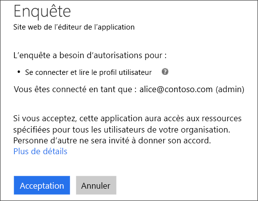
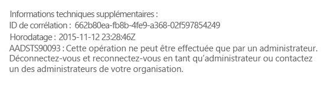
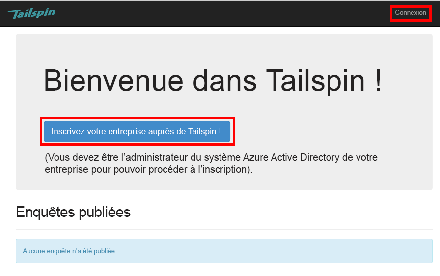
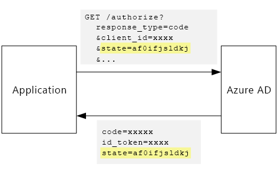

# <a name="tenant-sign-up-and-onboarding"></a><span data-ttu-id="e39a3-103">Inscription et intégration de locataire</span><span class="sxs-lookup"><span data-stu-id="e39a3-103">Tenant sign-up and onboarding</span></span>

<span data-ttu-id="e39a3-104">[ Exemple de code][sample application]</span><span class="sxs-lookup"><span data-stu-id="e39a3-104">[ Sample code][sample application]</span></span>

<span data-ttu-id="e39a3-105">Cet article décrit comment implémenter un processus d’*inscription* dans une application multi-locataire, ce qui permet à un client d’inscrire son organisation auprès de votre application.</span><span class="sxs-lookup"><span data-stu-id="e39a3-105">This article describes how to implement a *sign-up* process in a multi-tenant application, which allows a customer to sign up their organization for your application.</span></span>
<span data-ttu-id="e39a3-106">Il existe plusieurs raisons d’implémenter un processus d’inscription :</span><span class="sxs-lookup"><span data-stu-id="e39a3-106">There are several reasons to implement a sign-up process:</span></span>

* <span data-ttu-id="e39a3-107">Autoriser un administrateur Active Directory à consentir que l’ensemble de l’organisation du client utilise l’application.</span><span class="sxs-lookup"><span data-stu-id="e39a3-107">Allow an AD admin to consent for the customer's entire organization to use the application.</span></span>
* <span data-ttu-id="e39a3-108">Collecter des informations relatives au paiement par carte de crédit ou d’autres informations du client.</span><span class="sxs-lookup"><span data-stu-id="e39a3-108">Collect credit card payment or other customer information.</span></span>
* <span data-ttu-id="e39a3-109">Effectuer toute configuration par locataire en une seule fois nécessaire à votre application.</span><span class="sxs-lookup"><span data-stu-id="e39a3-109">Perform any one-time per-tenant setup needed by your application.</span></span>

## <a name="admin-consent-and-azure-ad-permissions"></a><span data-ttu-id="e39a3-110">Consentement administrateur et autorisations Azure AD</span><span class="sxs-lookup"><span data-stu-id="e39a3-110">Admin consent and Azure AD permissions</span></span>

<span data-ttu-id="e39a3-111">Pour s’authentifier auprès d’Azure AD, une application doit accéder au répertoire de l’utilisateur.</span><span class="sxs-lookup"><span data-stu-id="e39a3-111">In order to authenticate with Azure AD, an application needs access to the user's directory.</span></span> <span data-ttu-id="e39a3-112">L’application doit avoir au minimum une autorisation de lecteur du profil utilisateur.</span><span class="sxs-lookup"><span data-stu-id="e39a3-112">At a minimum, the application needs permission to read the user's profile.</span></span> <span data-ttu-id="e39a3-113">La première fois qu’un utilisateur se connecte, Azure AD affiche une page de consentement qui répertorie les autorisations demandées.</span><span class="sxs-lookup"><span data-stu-id="e39a3-113">The first time that a user signs in, Azure AD shows a consent page that lists the permissions being requested.</span></span> <span data-ttu-id="e39a3-114">En cliquant sur **Accepter**, l’utilisateur accorde l’autorisation à l’application.</span><span class="sxs-lookup"><span data-stu-id="e39a3-114">By clicking **Accept**, the user grants permission to the application.</span></span>

<span data-ttu-id="e39a3-115">Par défaut, le consentement est accordé par utilisateur.</span><span class="sxs-lookup"><span data-stu-id="e39a3-115">By default, consent is granted on a per-user basis.</span></span> <span data-ttu-id="e39a3-116">Chaque utilisateur qui se connecte voit la page de consentement.</span><span class="sxs-lookup"><span data-stu-id="e39a3-116">Every user who signs in sees the consent page.</span></span> <span data-ttu-id="e39a3-117">Toutefois, Azure AD prend également en charge le *consentement administrateur*, qui permet à un administrateur Active Directory de donner son consentement pour l’intégralité d’une organisation.</span><span class="sxs-lookup"><span data-stu-id="e39a3-117">However, Azure AD also supports  *admin consent*, which allows an AD administrator to consent for an entire organization.</span></span>

<span data-ttu-id="e39a3-118">Quand le flux de consentement administrateur est utilisé, la page de consentement indique que l’administrateur Active Directory accorde l’autorisation pour le compte de l’intégralité du locataire :</span><span class="sxs-lookup"><span data-stu-id="e39a3-118">When the admin consent flow is used, the consent page states that the AD admin is granting permission on behalf of the entire tenant:</span></span>



<span data-ttu-id="e39a3-120">Une fois que l’administrateur a cliqué sur **Accepter**, les autres utilisateurs appartenant au même locataire peuvent se connecter, et Azure AD omet alors l’écran de consentement.</span><span class="sxs-lookup"><span data-stu-id="e39a3-120">After the admin clicks **Accept**, other users within the same tenant can sign in, and Azure AD will skip the consent screen.</span></span>

<span data-ttu-id="e39a3-121">Seul un administrateur Active Directory peut donner un consentement administrateur, car il accorde l’autorisation pour le compte de l’ensemble de l’organisation.</span><span class="sxs-lookup"><span data-stu-id="e39a3-121">Only an AD administrator can give admin consent, because it grants permission on behalf of the entire organization.</span></span> <span data-ttu-id="e39a3-122">Si un utilisateur non-administrateur tente de s’authentifier avec le flux de consentement administrateur, Azure AD affiche une erreur :</span><span class="sxs-lookup"><span data-stu-id="e39a3-122">If a non-administrator tries to authenticate with the admin consent flow, Azure AD displays an error:</span></span>



<span data-ttu-id="e39a3-124">Si l’application nécessite des autorisations supplémentaires ultérieurement, le client doit s’inscrire à nouveau et donner son consentement pour les autorisations mises à jour.</span><span class="sxs-lookup"><span data-stu-id="e39a3-124">If the application requires additional permissions at a later point, the customer will need to sign up again and consent to the updated permissions.</span></span>

## <a name="implementing-tenant-sign-up"></a><span data-ttu-id="e39a3-125">Implémentation de l’inscription du locataire</span><span class="sxs-lookup"><span data-stu-id="e39a3-125">Implementing tenant sign-up</span></span>

<span data-ttu-id="e39a3-126">Pour l’application [Tailspin Surveys][Tailspin], nous avons défini plusieurs conditions requises pour le processus d’inscription :</span><span class="sxs-lookup"><span data-stu-id="e39a3-126">For the [Tailspin Surveys][Tailspin] application,  we defined several requirements for the sign-up process:</span></span>

* <span data-ttu-id="e39a3-127">Un locataire doit s’inscrire avant que des utilisateurs puissent se connecter.</span><span class="sxs-lookup"><span data-stu-id="e39a3-127">A tenant must sign up before users can sign in.</span></span>
* <span data-ttu-id="e39a3-128">L’inscription utilise le flux de consentement administrateur.</span><span class="sxs-lookup"><span data-stu-id="e39a3-128">Sign-up uses the admin consent flow.</span></span>
* <span data-ttu-id="e39a3-129">L’inscription ajoute le locataire de l’utilisateur à la base de données de l’application.</span><span class="sxs-lookup"><span data-stu-id="e39a3-129">Sign-up adds the user's tenant to the application database.</span></span>
* <span data-ttu-id="e39a3-130">Une fois un locataire inscrit, l’application affiche une page d’intégration.</span><span class="sxs-lookup"><span data-stu-id="e39a3-130">After a tenant signs up, the application shows an onboarding page.</span></span>

<span data-ttu-id="e39a3-131">Dans cette section, nous allons passer en revue notre implémentation de la procédure d’inscription.</span><span class="sxs-lookup"><span data-stu-id="e39a3-131">In this section, we'll walk through our implementation of the sign-up process.</span></span>
<span data-ttu-id="e39a3-132">Il est important de comprendre que l’opposition de l’« inscription » et de la « connexion » est un concept d’application.</span><span class="sxs-lookup"><span data-stu-id="e39a3-132">It's important to understand that "sign up" versus "sign in" is an application concept.</span></span> <span data-ttu-id="e39a3-133">Pendant le flux d’authentification, Azure AD ne sais pas, de façon intrinsèque, si l’utilisateur est en cours d’inscription.</span><span class="sxs-lookup"><span data-stu-id="e39a3-133">During the authentication flow, Azure AD does not inherently know whether the user is in process of signing up.</span></span> <span data-ttu-id="e39a3-134">C’est à l’application d’effectuer le suivi du contexte.</span><span class="sxs-lookup"><span data-stu-id="e39a3-134">It's up to the application to keep track of the context.</span></span>

<span data-ttu-id="e39a3-135">Quand un utilisateur anonyme visite l’application Surveys, deux boutons s’affichent à lui : un pour se connecter et un pour « abonner votre société » (inscription).</span><span class="sxs-lookup"><span data-stu-id="e39a3-135">When an anonymous user visits the Surveys application, the user is shown two buttons, one to sign in, and one to "enroll your company" (sign up).</span></span>



<span data-ttu-id="e39a3-137">Ces boutons appellent des actions dans la classe `AccountController`.</span><span class="sxs-lookup"><span data-stu-id="e39a3-137">These buttons invoke actions in the `AccountController` class.</span></span>

<span data-ttu-id="e39a3-138">Le `SignIn` action retourne un **ChallengeResult**, ce qui entraîne le middleware OpenID Connect rediriger vers le point de terminaison d’authentification.</span><span class="sxs-lookup"><span data-stu-id="e39a3-138">The `SignIn` action returns a **ChallengeResult**, which causes the OpenID Connect middleware to redirect to the authentication endpoint.</span></span> <span data-ttu-id="e39a3-139">Il s’agit de la méthode par défaut pour déclencher l’authentification dans ASP.NET Core.</span><span class="sxs-lookup"><span data-stu-id="e39a3-139">This is the default way to trigger authentication in ASP.NET Core.</span></span>

```csharp
[AllowAnonymous]
public IActionResult SignIn()
{
    return new ChallengeResult(
        OpenIdConnectDefaults.AuthenticationScheme,
        new AuthenticationProperties
        {
            IsPersistent = true,
            RedirectUri = Url.Action("SignInCallback", "Account")
        });
}
```

<span data-ttu-id="e39a3-140">Comparez maintenant l’action `SignUp` :</span><span class="sxs-lookup"><span data-stu-id="e39a3-140">Now compare the `SignUp` action:</span></span>

```csharp
[AllowAnonymous]
public IActionResult SignUp()
{
    var state = new Dictionary<string, string> { { "signup", "true" }};
    return new ChallengeResult(
        OpenIdConnectDefaults.AuthenticationScheme,
        new AuthenticationProperties(state)
        {
            RedirectUri = Url.Action(nameof(SignUpCallback), "Account")
        });
}
```

<span data-ttu-id="e39a3-141">Comme `SignIn`, l’action `SignUp` renvoie également `ChallengeResult`.</span><span class="sxs-lookup"><span data-stu-id="e39a3-141">Like `SignIn`, the `SignUp` action also returns a `ChallengeResult`.</span></span> <span data-ttu-id="e39a3-142">Mais cette fois, nous ajoutons une information d’état pour `AuthenticationProperties` dans `ChallengeResult` :</span><span class="sxs-lookup"><span data-stu-id="e39a3-142">But this time, we add a piece of state information to the `AuthenticationProperties` in the `ChallengeResult`:</span></span>

* <span data-ttu-id="e39a3-143">signup : indicateur booléen signalant que l’utilisateur a commencé le processus d’inscription.</span><span class="sxs-lookup"><span data-stu-id="e39a3-143">signup: A Boolean flag, indicating that the user has started the sign-up process.</span></span>

<span data-ttu-id="e39a3-144">Les informations d’état dans `AuthenticationProperties` sont ajoutées au paramètre [state] OpenID Connect, qui effectue des allers-retours pendant le flux d’authentification.</span><span class="sxs-lookup"><span data-stu-id="e39a3-144">The state information in `AuthenticationProperties` gets added to the OpenID Connect [state] parameter, which round trips during the authentication flow.</span></span>



<span data-ttu-id="e39a3-146">Une fois que l’utilisateur s’authentifie dans Azure AD et qu’il est redirigé vers l’application, le ticket d’authentification contient l’état.</span><span class="sxs-lookup"><span data-stu-id="e39a3-146">After the user authenticates in Azure AD and gets redirected back to the application, the authentication ticket contains the state.</span></span> <span data-ttu-id="e39a3-147">Nous utilisons cela pour garantir que la valeur « signup » est conservée dans l’intégralité du flux d’authentification.</span><span class="sxs-lookup"><span data-stu-id="e39a3-147">We are using this fact to make sure the "signup" value persists across the entire authentication flow.</span></span>

## <a name="adding-the-admin-consent-prompt"></a><span data-ttu-id="e39a3-148">Ajout de l’invite de consentement administrateur</span><span class="sxs-lookup"><span data-stu-id="e39a3-148">Adding the admin consent prompt</span></span>

<span data-ttu-id="e39a3-149">Dans Azure AD, le flux de consentement administrateur est déclenché en ajoutant un paramètre « prompt » à la chaîne de requête dans la demande d’authentification :</span><span class="sxs-lookup"><span data-stu-id="e39a3-149">In Azure AD, the admin consent flow is triggered by adding a "prompt" parameter to the query string in the authentication request:</span></span>

<!-- markdownlint-disable MD040 -->

```
/authorize?prompt=admin_consent&...
```

<!-- markdownlint-enable MD040 -->

<span data-ttu-id="e39a3-150">L’application Surveys ajoute l’invite pendant l’événement `RedirectToAuthenticationEndpoint` .</span><span class="sxs-lookup"><span data-stu-id="e39a3-150">The Surveys application adds the prompt during the `RedirectToAuthenticationEndpoint` event.</span></span> <span data-ttu-id="e39a3-151">Cet événement est appelé juste avant que le middleware ne redirige vers le point de terminaison de l’authentification.</span><span class="sxs-lookup"><span data-stu-id="e39a3-151">This event is called right before the middleware redirects to the authentication endpoint.</span></span>

```csharp
public override Task RedirectToAuthenticationEndpoint(RedirectContext context)
{
    if (context.IsSigningUp())
    {
        context.ProtocolMessage.Prompt = "admin_consent";
    }

    _logger.RedirectToIdentityProvider();
    return Task.FromResult(0);
}
```

<span data-ttu-id="e39a3-152">Le paramètre `ProtocolMessage.Prompt` indique au middleware d’ajouter le paramètre « prompt » à la demande d’authentification.</span><span class="sxs-lookup"><span data-stu-id="e39a3-152">Setting `ProtocolMessage.Prompt` tells the middleware to add the "prompt" parameter to the authentication request.</span></span>

<span data-ttu-id="e39a3-153">Notez que l’invite est nécessaire uniquement pendant l’inscription.</span><span class="sxs-lookup"><span data-stu-id="e39a3-153">Note that the prompt is only needed during sign-up.</span></span> <span data-ttu-id="e39a3-154">Une connexion normale ne doit pas l’inclure.</span><span class="sxs-lookup"><span data-stu-id="e39a3-154">Regular sign-in should not include it.</span></span> <span data-ttu-id="e39a3-155">Pour faire la distinction entre les deux, nous vérifions la valeur `signup` dans l’état d’authentification.</span><span class="sxs-lookup"><span data-stu-id="e39a3-155">To distinguish between them, we check for the `signup` value in the authentication state.</span></span> <span data-ttu-id="e39a3-156">La méthode d’extension suivante vérifie cette condition :</span><span class="sxs-lookup"><span data-stu-id="e39a3-156">The following extension method checks for this condition:</span></span>

```csharp
internal static bool IsSigningUp(this BaseControlContext context)
{
    Guard.ArgumentNotNull(context, nameof(context));

    string signupValue;
    // Check the HTTP context and convert to string
    if ((context.Ticket == null) ||
        (!context.Ticket.Properties.Items.TryGetValue("signup", out signupValue)))
    {
        return false;
    }

    // We have found the value, so see if it's valid
    bool isSigningUp;
    if (!bool.TryParse(signupValue, out isSigningUp))
    {
        // The value for signup is not a valid boolean, throw

        throw new InvalidOperationException($"'{signupValue}' is an invalid boolean value");
    }

    return isSigningUp;
}
```

## <a name="registering-a-tenant"></a><span data-ttu-id="e39a3-157">Inscription d’un locataire</span><span class="sxs-lookup"><span data-stu-id="e39a3-157">Registering a tenant</span></span>

<span data-ttu-id="e39a3-158">L’application Surveys stocke certaines informations sur chaque locataire et utilisateur dans la base de données de l’application.</span><span class="sxs-lookup"><span data-stu-id="e39a3-158">The Surveys application stores some information about each tenant and user in the application database.</span></span>


<span data-ttu-id="e39a3-160">Dans la table Tenant, IssuerValue est la valeur de la revendication de l’émetteur pour le locataire.</span><span class="sxs-lookup"><span data-stu-id="e39a3-160">In the Tenant table, IssuerValue is the value of the issuer claim for the tenant.</span></span> <span data-ttu-id="e39a3-161">Pour Azure AD, cette valeur est `https://sts.windows.net/<tentantID>` et elle donne une valeur unique par client.</span><span class="sxs-lookup"><span data-stu-id="e39a3-161">For Azure AD, this is `https://sts.windows.net/<tentantID>` and gives a unique value per tenant.</span></span>

<span data-ttu-id="e39a3-162">Lorsqu’un locataire se connecte, l’application Surveys écrit un enregistrement de locataire dans la base de données.</span><span class="sxs-lookup"><span data-stu-id="e39a3-162">When a new tenant signs up, the Surveys application writes a tenant record to the database.</span></span> <span data-ttu-id="e39a3-163">Cela se produit au sein de l’événement `AuthenticationValidated`.</span><span class="sxs-lookup"><span data-stu-id="e39a3-163">This happens inside the `AuthenticationValidated` event.</span></span> <span data-ttu-id="e39a3-164">(Ne le faites pas avant cet événement, car le jeton d’ID ne sera pas encore validé, et vous ne pourrez donc pas approuver les valeurs de revendication.)</span><span class="sxs-lookup"><span data-stu-id="e39a3-164">(Don't do it before this event, because the ID token won't be validated yet, so you can't trust the claim values.</span></span> <span data-ttu-id="e39a3-165">Voir [Authentification].</span><span class="sxs-lookup"><span data-stu-id="e39a3-165">See [Authentication].</span></span>

<span data-ttu-id="e39a3-166">Voici le code approprié de l’application Surveys :</span><span class="sxs-lookup"><span data-stu-id="e39a3-166">Here is the relevant code from the Surveys application:</span></span>

```csharp
public override async Task TokenValidated(TokenValidatedContext context)
{
    var principal = context.AuthenticationTicket.Principal;
    var userId = principal.GetObjectIdentifierValue();
    var tenantManager = context.HttpContext.RequestServices.GetService<TenantManager>();
    var userManager = context.HttpContext.RequestServices.GetService<UserManager>();
    var issuerValue = principal.GetIssuerValue();
    _logger.AuthenticationValidated(userId, issuerValue);

    // Normalize the claims first.
    NormalizeClaims(principal);
    var tenant = await tenantManager.FindByIssuerValueAsync(issuerValue)
        .ConfigureAwait(false);

    if (context.IsSigningUp())
    {
        if (tenant == null)
        {
            tenant = await SignUpTenantAsync(context, tenantManager)
                .ConfigureAwait(false);
        }

        // In this case, we need to go ahead and set up the user signing us up.
        await CreateOrUpdateUserAsync(context.Ticket, userManager, tenant)
            .ConfigureAwait(false);
    }
    else
    {
        if (tenant == null)
        {
            _logger.UnregisteredUserSignInAttempted(userId, issuerValue);
            throw new SecurityTokenValidationException($"Tenant {issuerValue} is not registered");
        }

        await CreateOrUpdateUserAsync(context.Ticket, userManager, tenant)
            .ConfigureAwait(false);
    }
}
```

<span data-ttu-id="e39a3-167">Ce code effectue les actions suivantes :</span><span class="sxs-lookup"><span data-stu-id="e39a3-167">This code does the following:</span></span>

1. <span data-ttu-id="e39a3-168">Vérifier si la valeur d’émetteur du locataire se trouve déjà dans la base de données.</span><span class="sxs-lookup"><span data-stu-id="e39a3-168">Check if the tenant's issuer value is already in the database.</span></span> <span data-ttu-id="e39a3-169">Si le locataire ne s’est pas inscrit, `FindByIssuerValueAsync` renvoie la valeur null.</span><span class="sxs-lookup"><span data-stu-id="e39a3-169">If the tenant has not signed up, `FindByIssuerValueAsync` returns null.</span></span>
2. <span data-ttu-id="e39a3-170">Si l’utilisateur s’inscrit :</span><span class="sxs-lookup"><span data-stu-id="e39a3-170">If the user is signing up:</span></span>
   1. <span data-ttu-id="e39a3-171">Ajouter le locataire à la base de données (`SignUpTenantAsync`).</span><span class="sxs-lookup"><span data-stu-id="e39a3-171">Add the tenant to the database (`SignUpTenantAsync`).</span></span>
   2. <span data-ttu-id="e39a3-172">Ajouter l’utilisateur authentifié à la base de données (`CreateOrUpdateUserAsync`).</span><span class="sxs-lookup"><span data-stu-id="e39a3-172">Add the authenticated user to the database (`CreateOrUpdateUserAsync`).</span></span>
3. <span data-ttu-id="e39a3-173">Sinon, exécuter le flux de connexion normal :</span><span class="sxs-lookup"><span data-stu-id="e39a3-173">Otherwise complete the normal sign-in flow:</span></span>
   1. <span data-ttu-id="e39a3-174">Si l’émetteur du locataire est introuvable dans la base de données, cela signifie que le locataire n’est pas inscrit, et le client doit s’inscrire.</span><span class="sxs-lookup"><span data-stu-id="e39a3-174">If the tenant's issuer was not found in the database, it means the tenant is not registered, and the customer needs to sign up.</span></span> <span data-ttu-id="e39a3-175">Dans ce cas, lever une exception pour provoquer l’échec de l’authentification.</span><span class="sxs-lookup"><span data-stu-id="e39a3-175">In that case, throw an exception to cause the authentication to fail.</span></span>
   2. <span data-ttu-id="e39a3-176">Sinon, créer un enregistrement de base de données pour cet utilisateur, s’il n’existe pas déjà (`CreateOrUpdateUserAsync`).</span><span class="sxs-lookup"><span data-stu-id="e39a3-176">Otherwise, create a database record for this user, if there isn't one already (`CreateOrUpdateUserAsync`).</span></span>

<span data-ttu-id="e39a3-177">Voici la méthode `SignUpTenantAsync` qui ajoute le locataire à la base de données.</span><span class="sxs-lookup"><span data-stu-id="e39a3-177">Here is the `SignUpTenantAsync` method that adds the tenant to the database.</span></span>

```csharp
private async Task<Tenant> SignUpTenantAsync(BaseControlContext context, TenantManager tenantManager)
{
    Guard.ArgumentNotNull(context, nameof(context));
    Guard.ArgumentNotNull(tenantManager, nameof(tenantManager));

    var principal = context.Ticket.Principal;
    var issuerValue = principal.GetIssuerValue();
    var tenant = new Tenant
    {
        IssuerValue = issuerValue,
        Created = DateTimeOffset.UtcNow
    };

    try
    {
        await tenantManager.CreateAsync(tenant)
            .ConfigureAwait(false);
    }
    catch(Exception ex)
    {
        _logger.SignUpTenantFailed(principal.GetObjectIdentifierValue(), issuerValue, ex);
        throw;
    }

    return tenant;
}
```

<span data-ttu-id="e39a3-178">Voici un résumé de l’intégralité du flux d’inscription dans l’application Surveys :</span><span class="sxs-lookup"><span data-stu-id="e39a3-178">Here is a summary of the entire sign-up flow in the Surveys application:</span></span>

1. <span data-ttu-id="e39a3-179">L’utilisateur clique sur le bouton **S’inscrire** .</span><span class="sxs-lookup"><span data-stu-id="e39a3-179">The user clicks the **Sign Up** button.</span></span>
2. <span data-ttu-id="e39a3-180">Le `AccountController.SignUp` action retourne un résultat de test.</span><span class="sxs-lookup"><span data-stu-id="e39a3-180">The `AccountController.SignUp` action returns a challenge result.</span></span>  <span data-ttu-id="e39a3-181">L’état d’authentification inclut la valeur de « signup ».</span><span class="sxs-lookup"><span data-stu-id="e39a3-181">The authentication state includes "signup" value.</span></span>
3. <span data-ttu-id="e39a3-182">Dans l’événement `RedirectToAuthenticationEndpoint`, ajoutez l’invite `admin_consent`.</span><span class="sxs-lookup"><span data-stu-id="e39a3-182">In the `RedirectToAuthenticationEndpoint` event, add the `admin_consent` prompt.</span></span>
4. <span data-ttu-id="e39a3-183">Le middleware OpenID Connect redirige vers Azure AD et l’utilisateur s’authentifie.</span><span class="sxs-lookup"><span data-stu-id="e39a3-183">The OpenID Connect middleware redirects to Azure AD and the user authenticates.</span></span>
5. <span data-ttu-id="e39a3-184">Dans l’événement `AuthenticationValidated` , recherchez l’état « signup ».</span><span class="sxs-lookup"><span data-stu-id="e39a3-184">In the `AuthenticationValidated` event, look for the "signup" state.</span></span>
6. <span data-ttu-id="e39a3-185">Ajoutez le locataire à la base de données.</span><span class="sxs-lookup"><span data-stu-id="e39a3-185">Add the tenant to the database.</span></span>

<span data-ttu-id="e39a3-186">[**Suivant**][app roles]</span><span class="sxs-lookup"><span data-stu-id="e39a3-186">[**Next**][app roles]</span></span>

<!-- links -->

[app roles]: app-roles.md
[Tailspin]: tailspin.md

[state]: https://openid.net/specs/openid-connect-core-1_0.html#AuthRequest
[Authentification]: authenticate.md
[Authentication]: authenticate.md
[sample application]: https://github.com/mspnp/multitenant-saas-guidance
