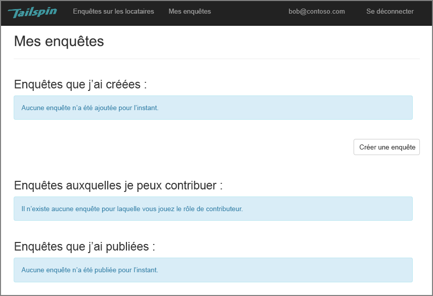
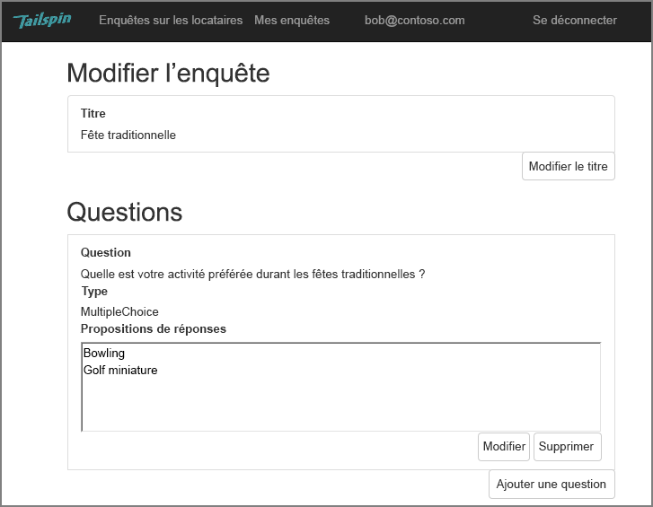
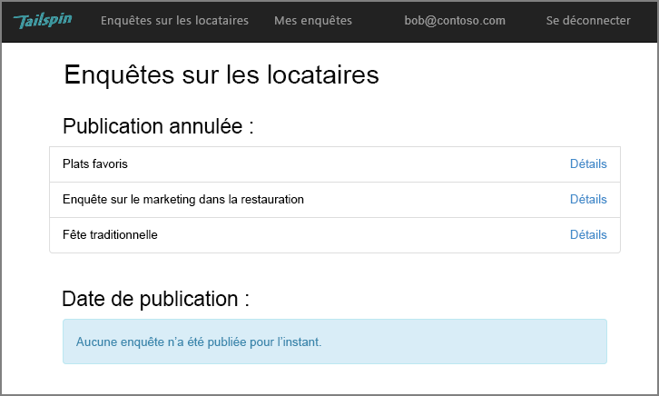
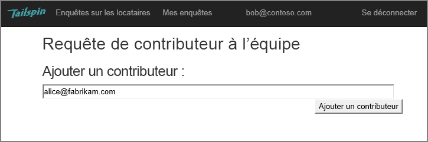
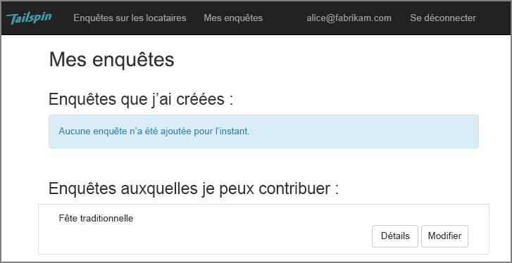
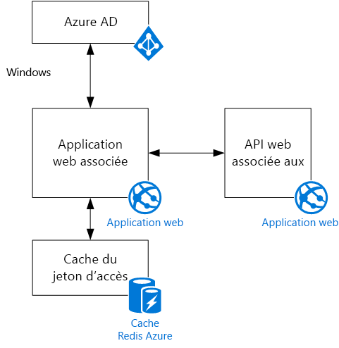

# Le scénario TailspinThe Tailspin scenario

[ Exemple de code][sample application][ Sample code][sample application]

Tailspin est une société fictive qui développe une application SaaS nommée Surveys.Tailspin is a fictitious company that is developing a SaaS application named Surveys. Cette application permet aux organisations de créer et de publier des enquêtes en ligne.This application enables organizations to create and publish online surveys.

* Une organisation peut s’inscrire auprès de l’application.An organization can sign up for the application.
* Une fois que l’organisation est inscrite, les utilisateurs peuvent se connecter à l’application avec leurs informations d’identification professionnelles.After the organization is signed up, users can sign into the application with their organizational credentials.
* Les utilisateurs peuvent créer, modifier et publier des enquêtes.Users can create, edit, and publish surveys.

> [!NOTE]
> Pour vous familiariser avec l’application, consultez [Exécution de l’application Surveys].To get started with the application, see [Run the Surveys application].

## Les utilisateurs peuvent créer, modifier et consulter des enquêtes.Users can create, edit, and view surveys

Un utilisateur authentifié peut consulter toutes les enquêtes qu’il a créées ou pour lesquelles il détient des droits de contributeur. Il peut également créer des enquêtes.An authenticated user can view all the surveys that he or she has created or has contributor rights to, and create new surveys. Notez que l’utilisateur est connecté à l’aide de son identité professionnelle, `bob@contoso.com`.Notice that the user is signed in with his organizational identity, `bob@contoso.com`.

Cette capture d’écran illustre la page Edit Survey :This screenshot shows the Edit Survey page:

Les utilisateurs peuvent aussi consulter les enquêtes créées par d’autres utilisateurs au sein du même locataire.Users can also view any surveys created by other users within the same tenant.

## Les propriétaires d’enquêtes peuvent inviter des contributeurs.Survey owners can invite contributors

Lorsqu’un utilisateur crée une enquête, il peut inviter d’autres personnes à devenir des collaborateurs sur l’enquête.When a user creates a survey, he or she can invite other people to be contributors on the survey. Les collaborateurs peuvent modifier l’enquête, mais ils ne peuvent pas la supprimer, ni la publier.Contributors can edit the survey, but cannot delete or publish it.

Un utilisateur peut ajouter des collaborateurs à partir d’autres clients, ce qui permet le partage des ressources entre locataires.A user can add contributors from other tenants, which enables cross-tenant sharing of resources. Dans cette capture d’écran, Bob (`bob@contoso.com`) ajoute Alice (`alice@fabrikam.com`) en tant que contributeur à une enquête que Bob a créée.In this screenshot, Bob (`bob@contoso.com`) is adding Alice (`alice@fabrikam.com`) as a contributor to a survey that Bob created.

Lorsqu’Alice se connecte, elle voit l’enquête répertoriée sous « Surveys I can contribute to » (Enquêtes auxquelles je peux contribuer).When Alice logs in, she sees the survey listed under "Surveys I can contribute to".

Notez qu’Alice se connecte à son propre locataire et non en tant qu’invité du locataire Contoso.Note that Alice signs into her own tenant, not as a guest of the Contoso tenant. Alice a des autorisations de contributeur uniquement pour cette enquête &mdash; elle ne peut pas consulter les autres enquêtes du locataire Contoso.Alice has contributor permissions only for that survey &mdash; she cannot view other surveys from the Contoso tenant.

## ArchitectureArchitecture

L’application Surveys se compose d’un serveur web frontal et d’un serveur principal d’API web.The Surveys application consists of a web front end and a web API backend. Les deux sont implémentés à l’aide d’[ASP.NET Core].Both are implemented using [ASP.NET Core].

L’application web utilise Azure Active Directory (Azure AD) pour authentifier les utilisateurs.The web application uses Azure Active Directory (Azure AD) to authenticate users. L’application web appelle également Azure AD pour obtenir des jetons d’accès OAuth 2 pour l’API web.The web application also calls Azure AD to get OAuth 2 access tokens for the Web API. Les jetons d’accès sont mis en cache dans le Cache Redis Azure.Access tokens are cached in Azure Redis Cache. Le cache permet à plusieurs instances de partager le même cache de jeton (par exemple, dans une batterie de serveurs).The cache enables multiple instances to share the same token cache (e.g., in a server farm).

[**Suivant**][authentication][**Next**][authentication]

<!-- links -->

[authentication]: authenticate.md

[Exécution de l’application Surveys]: ./run-the-app.md
[Run the Surveys application]: ./run-the-app.md
[ASP.NET Core]: /aspnet/core
[sample application]: https://github.com/mspnp/multitenant-saas-guidance
